# Trust Imperative 4.0

GenAI
The Trust Multiplier
for Government

2024 Global Report

## BCG ×

salesforce

## BCG ×

Boston Consulting Group partners with leaders in business and society to tackle their most important challenges and capture their greatest opportunities. BCG was the pioneer in business strategy when it was founded in 1963. Today, we work closely with clients to embrace a transformational approach aimed at benefiting all stakeholders—empowering organizations to grow, build sustainable competitive advantage, and drive positive societal impact.

Our diverse, global teams bring deep industry and functional expertise and a range of perspectives that question the status quo and spark change. BCG delivers solutions through leading-edge management consulting, technology and design, and corporate and digital ventures. We work in a uniquely collaborative model across the firm and throughout all levels of the client organization, fueled by the goal of helping our clients thrive and enabling them to make the world a better place.

The BCG Center for Digital Government is a global team of 350 experts dedicated to working with governments to deliver impact through digital technologies, data and AI. We bring world-class capabilities in digital strategy and transformation, artificial intelligence and analytics, design and implementation to the public sector.

For more information, visit www.bcg.com

salesforce

Salesforce is the #1 AI CRM, helping companies connect with customers in a whole new way since 1999. Our product portfolio, Einstein 1, brings #1 CRM apps together with trusted AI and data on one integrated platform so companies can grow relationships, productivity, and their bottom line.

In our new era of artificial intelligence, Salesforce is democratizing AI for companies of every size and industry. Our pioneering formula of CRM + AI + Data + Trust helps everyone get their data together and embrace AI safely and securely across every team and employee so they can unlock the promise of AI to transform their business.

Salesforce is proud to be the market leader, but we're even more proud to lead in philanthropy, innovation and culture. Guided by core values of trust, customer success, innovation, equality and sustainability, Salesforce is more than a business — we're a platform for change.

For more information, visit www.salesforce.com

The citizens' perspective on how responsible adoption of GenAI can improve government service delivery and multiply trust.

## About this report

Welcome to our fourth report in the BCG-Salesforce Trust Imperative Series. Since 2020, we have been collaborating to explore the nature of the connection and relationship between digital government service delivery and trust in government.

Our research explores the evolution in expectations and experiences with digital government services over the last two years and, given the relevance and importance of the topic, this year we also take a close look at citizens' attitudes towards government use of artificial intelligence (AI), particularly generative artificial intelligence (GenAI).

This report is based on BCG's 2024 Digital Government Citizen Survey (DGCS). BCG conducts the DGCS every two years and it is the most comprehensive and longest-running ‘voice of the citizen’ survey on digital government in the world. In 2024, we collected data that captures the perspectives of 41,600 regular internet users across 48 jurisdictions globally; a sample that represents viewpoints of 73 percent of the total global population and 88 percent of the population in Organization for Economic Co-Operation and Development (OECD) countries.

The DGCS is conducted as an online survey and uses a random sampling approach to collect input from respondents who use the internet regularly, capturing responses using an online survey tool. The survey reflects respondents' views provided at a point in time and is not a ranking or league table to compare jurisdictions. The results reflect the views of citizens which are evidently shaped by the unique local context of each jurisdiction and encompass the many factors that shape perceptions of government digital services.

The sampling methodology provides insights that are intended to be statistically representative of the general population by filtering respondents to balance demographic attributes (e.g. location and gender). Sample sizes yielded a confidence level of 95 percent with a margin of error less than 5 percent across all jurisdictions sampled, assuming a sample proportion of 0.5. In some jurisdictions, sample sizes are larger to enable further more detailed and separate sub-national analysis. This report presents an analysis of the global results and individual jurisdictions. Global averages reflect simple averages across jurisdictions, not weighted averages by population size. Detailed information on sample sizes across jurisdictions and respondent demographics is included in Appendix A.

Exhibit 1: We surveyed 41,600 regular internet users across 48 jurisdictions  
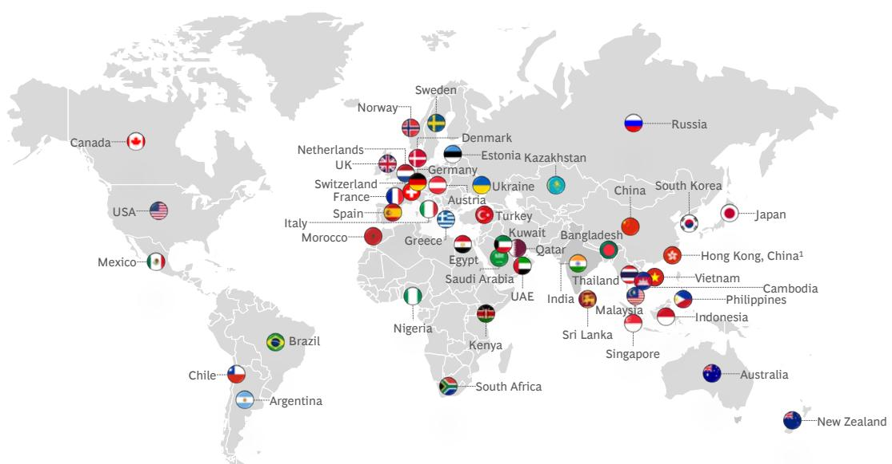  
Source: 2024 BCG Digital Government Citizen Survey  
$^{1}$ Special Administration Region of the People's Republic of China

In conducting this research, we also held interviews and gathered qualitative input from 20+ global experts in digital government and service delivery from BCG, Salesforce, and externally.

This report is divided into 4 sections:

\- Section 1: Service Improvement Opportunities reveals insights on citizen expectations of digital government services, their experiences using these services and level of satisfaction.

\- Section 2: The GenAI Imperative explores the potential opportunity of GenAI in government and examines the role it can play in improving citizen experience and building trust.

\- Section 3: Citizens’ Perspectives on GenAI in Government looks at citizens’ attitudes towards the use of AI and GenAI in government, the perceived benefits and risks, trust in government to use AI responsibly, and factors that might build or erode this trust.

\- Section 4: The GenAI Roadmap for Government describes how government can establish the necessary prerequisites for trust and deliver better, more innovative digital government services using GenAI.

## What is AI?

AI refers to the use of computer systems to perform tasks that have traditionally been associated with requiring human intelligence, such as learning, reasoning, problem-solving, and language.

## What is GenAI?

GenAI is a type of AI that uses foundational, multi-modal models. It can generate new content, including text, images, and audio/video, and support interaction using natural language prompts.

## Executive Summary

In 2024, BCG and Salesforce surveyed 41,600 regular internet users across 48 jurisdictions globally, and sought input from 20+ global experts to understand global digital government service delivery trends. The survey was conducted as part of the 2024 BCG Digital Government Citizen Survey (DGCS). This report presents the survey results and citizens' perspectives on how responsible adoption of GenAI can improve government service delivery and multiply trust.

## Digital government is improving in many jurisdictions

Despite a modest global average increase of 2 percentage points in net citizen satisfaction with digital government services over the last 2 years, there has been a noticeable upward trend and improvement in satisfaction in multiple jurisdictions. Satisfaction with online government services increased in 15 jurisdictions, remained steady in 19 and only decreased in 4.

## The bar for citizen expectations is set high

Citizens' expectations about the quality of digital government services are high, with 75 percent of respondents indicating they expect the quality of services to be similar to those provided by the world's best private sector organizations or global digital and technology leaders. Although the perception that digital government services are as good or better than a typical private sector interaction is positive in most jurisdictions, user experience issues remain common with 74 percent of respondents encountering issues in the past 2 years. There is clearly an opportunity for government to achieve a leap in service satisfaction by getting the basics right.

## GenAI could become a force multiplier for increased trust in government

Previous editions of the Trust Imperative series provided clear evidence of a direct and symmetrical relationship between customer experience of digital government services and citizens' trust in government. Specifically, in our 2020 survey, 87 percent of respondents said that positive customer experiences increased their trust and confidence in government, and 81 percent said that poor experiences eroded trust. GenAI represents a significant opportunity to increase trust in government by improving user experiences by making government services more accessible, personalized, and seamless, if deployed well and with responsible AI safeguards.

## Citizens have genuine concerns about GenAI, but are supportive for some use cases

On average just over half (51 percent) of respondents globally believe that AI is developing too quickly. The top 2 concerns about the use of AI and GenAI are the potential loss of jobs and impact to the economy (34 percent), and the accuracy of results and analysis (26 percent).

Despite these concerns, citizens are remarkably open to government using GenAI across a range of use cases. Sixty-three percent of respondents are comfortable interacting with GenAI to access simple government services. Seventy-one percent are comfortable with government using GenAI to communicate in multiple languages, 69 percent are comfortable with government employees using GenAI support tools, and 67 percent are comfortable with government using GenAI to streamline administrative tasks.

However, there is a wider spread in comfort levels for some use cases across jurisdictions, such as using GenAI to automate service access decisions and using GenAI to monitor public sentiment.

There is an opportunity for government to unlock the benefits of GenAI for use cases where there is already strong support and acceptance. It also highlights the importance of government taking a considered approach to use case selection, tailoring AI strategies and roadmaps to the unique contexts of each jurisdiction, and aligning with public sentiment on the social license for the use of GenAI.

## Establishing guardrails and building AI literacy are key to building trust

On average, approximately 3 in 5 respondents say they trust government to use AI responsibly, but this level of trust varies significantly across jurisdictions. The top 2 factors that would most increase trust in government use of AI remained fairly consistent globally. These were: 1) specific laws and regulations on how AI can be used by government (38 percent); and 2) rules to safeguard personal information (34 percent). Increasing overall AI knowledge and expertise will also be important to build trust because people with the most knowledge of AI are twice as likely as those with a basic knowledge to say the benefits outweigh the risks, and five times more likely than those with no knowledge of AI.

## The GenAI roadmap for government

In this report, we describe 3 key actions for government to improve service quality, and multiply trust with GenAI:

1. Get started now: Learn by doing, starting with low risk/low harm use cases, to build the internal capabilities to innovate and scale and invest in building the necessary skills, critical data and technology platforms.

2. Establish the prerequisites for trust: Adopt responsible AI governance, promote a responsible AI culture, commit to accountability and transparency, and design to bring the best of human and AI to deliver maximum impact for citizens.

3. Lead in AI innovation: Foster innovation by building workforce and population AI skills and expertise, and catalyze innovation through holistic AI strategies for a thriving knowledge economy.

# Section 1: Service Improvement Opportunities

## Satisfaction is improving or steady in most jurisdictions

Overall, net satisfaction with digital government services globally was 65 percent in 2024. This figure ranged from 26 to 83 percent across jurisdictions, as illustrated in Exhibit 2. Average net satisfaction remained relatively stable in the last two years, increasing only 2 percentage points (from 63 percent) across jurisdictions where longitudinal data is available (38 jurisdictions).

Despite a modest global average increase, there has been a noticeable improvement in satisfaction in multiple jurisdictions. Exhibit 2 shows that satisfaction with online government services has increased in 15 jurisdictions, remained steady in 19 and only decreased in 4.

Some jurisdictions saw significant improvements such as Thailand, Sweden, Brazil, and the Netherlands where net satisfaction has improved 10 percentage points or more.

Exhibit 2: Net satisfaction with digital government services increased or was steady in most jurisdictions  
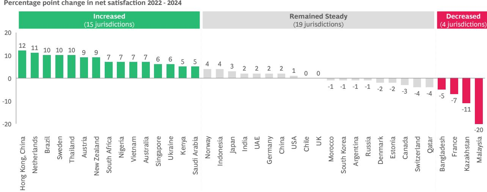  
Q. How satisfied or not are you with the use of the internet in delivering each of the following government services? Response options: 1. Extremely Dissatisfied, 2. Dissatisfied, 3. Rather dissatisfied, 4. Neither satisfied or not, 5. Rather satisfied, 6. Satisfied, 7. Extremely satisfied, 8. I don't know. Net satisfaction = total satisfied – total dissatisfied.
Source: 2022 and 2024 BCG Digital Government Citizen Survey

Exhibit 3: Global net satisfaction with digital government services  
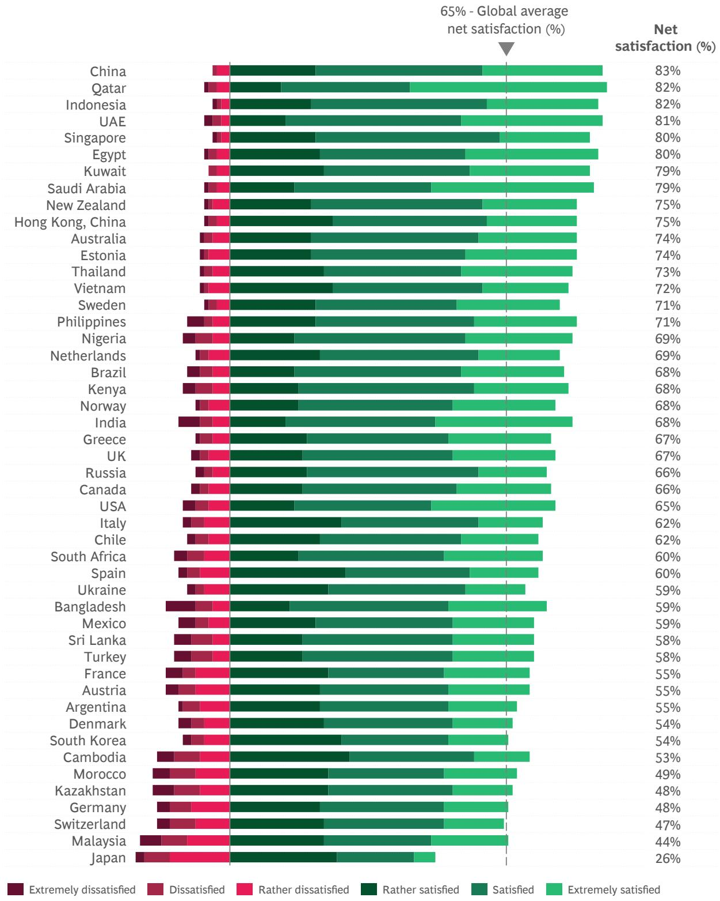  
Q. How satisfied or not are you with the use of the internet in delivering each of the following government services?
Net satisfaction % = total satisfied (extremely satisfied + satisfied + rather satisfied) less total dissatisfied (extremely dissatisfied + dissatisfied + rather dissatisfied). Note: Responses for 'Neither satisfied or not' are not shown.
Source: 2024 BCG Digital Government Citizen Survey

\- Similar to global digital leaders; such as Apple, Google, Uber, Spotify, Amazon, Alibaba, Tencent, JD.com, Baidu, Jumia
- Similar to best private sector institutions; such as banks, airlines, telcos, retailers, etc.
- Similar to the best online government services in the world
- My expectation is lower than any of the above

## The bar for citizen expectations is set high

Citizens’ expectations regarding the quality of digital government services are high with 75 percent of respondents indicating they expect the quality of digital government services to be similar to those provided by the world’s best private sector organizations or global digital and technology leaders. A further 19 percent expect their government digital services to be similar to the world’s best online government services (see Exhibit 4).

In our survey, respondents are also asked to compare their most recent digital government experience with a typical or average private sector interaction. On average 84 percent of global respondents say it was the same or better (36 percent the same, 48 percent better) but this varies across jurisdictions.

The challenge for government is to continue meeting the high service expectations of citizens when the benchmark for service quality, set by world leaders, is continuously being raised through accelerating technology developments such as GenAI and innovation in highly competitive global markets.

Exhibit 4: 75 percent of respondents expect the quality of digital government services to match the best private sector organizations or global digital leaders

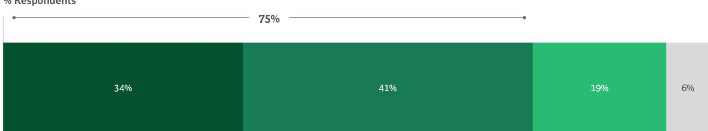  
Q. In your opinion, to what quality standard do you think online government services should be delivered, in terms of speed, convenience, ease of access, personalization, etc.? Source: 2024 BCG Digital Government Citizen Survey

## Chesterfield Borough Council's My Chesterfield Portal

Chesterfield Borough Council is a local authority in Derbyshire in the United Kingdom. It is home to around 105,000 residents and provides more than 50 council services to serve and support local communities. The My Chesterfield Portal provides an example of how a government organization is leveraging technology to deliver new products and services that meet citizen needs and expectations, and high quality experiences on par with private sector leaders.

The Chesterfield Borough Council's Right First-Time Contact Center System went live in 1 year and since then the team has seen over 15,000 registrations in the My Chesterfield portal (representing 30 percent of Chesterfield's households). The system helps streamline information and service delivery by enabling citizens to submit service requests online at any time through a single front door. It also supports the delivery of high quality services with a 360-degree-view for staff to review the inquiry, initiate service delivery, tag subject matter experts, assign tasks, and work together to close the case. The Council has seen an average of 1,100 logins to My Chesterfield every week, showing the ongoing traction an online forum has with the community. The team has continued to add new online services (over 50 in just 9 months) and as a result has seen a 6.5 percent reduction in telephone calls, a 42 percent reduction in online complaints, and a saving of an average 3 hours a day on reception activities.

Through the portal, citizens have visibility of their billing documents, benefit payments, direct debit details, and council tax balances all through My Chesterfield. The Council has also added the ability for residents to apply for grants to the My Chesterfield portal. The grants function was up and running in about 10 days and has collected roughly 95 percent of all grant applications, with no phone calls or paper forms needed. $^{2}$

## The service improvement opportunity

Notwithstanding the improvements in digital government service delivery, user experience issues remain common. On average, 74 percent of respondents globally experienced a problem using digital government services within the last two years. The most common issues were technical difficulties completing the interaction (25 percent), the overall process taking too long or was too difficult (24 percent), or citizens' needed help but none was available (20 percent).

Across the 48 jurisdictions included in this report, the proportion of respondents who encountered problems while using the internet to interact with government for a service ranged from around 60 to 90 percent. There is clearly an opportunity for government to achieve a leap in service satisfaction by getting the basics right. In the next chapter, we will explore the ways government can leverage GenAI to seize this opportunity, and the impact it could have on trust.

Exhibit 5: 74 percent of respondents encountered problems while using digital government services in the past two years  
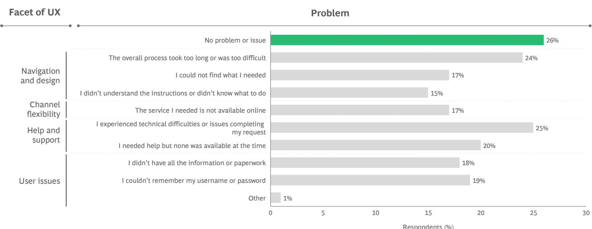  
Q. Which of the following problems have you encountered while using the internet to interact with government for this service? (tested across 27 services). Source: 2024 BCG Digital Government Citizen Survey

If we can't trust government to get the basics right, how can we trust them to get the more complex things like GenAI right?

\- Global digital government expert

## Transforming Customer Experiences at the California Department of Motor Vehicles

The California Department of Motor Vehicles (CA DMV) is the largest identity issuer in the USA, managing identities for more than 34 million people services across 175+ field offices and 300+ kiosks across the state. It is also setting the example for how any department or agency can offer high quality citizen experiences through an omni-channel approach that aims for excellence in terms of service delivery, and leverages innovative technology solutions for scale. Examples of CA DMV's approach include:

\- Contact center: Citizens can visit dmv.ca.gov and if they have a question they cannot answer through the website content, AI-powered bots support to answer frequently asked questions and connect citizens to customer service delivery agents for additional help. Language translation services are available within the live chat and interactions are captured to create a 360-degree profile record for the citizen to enable more personalized service delivery.

\- Virtual field office: If a citizen's question is too complex for chat or too real-time for email and needs to move to phone or video, their interaction can be moved from the contact center to the virtual field office based on escalation criteria and workflow rules. The approach lets the citizen get as far as possible into a process virtually using automated workflows. It also puts them into a virtual queue so that if they still have to go into a physical office they can pick up where they left off instead of standing in line and starting over.

\- Mobile drivers license pilot: Through this pilot, citizens could download the DMV mobile wallet app to their smartphone, where they have access to a secure mobile license as a digital credential.

\- Digital Experience Platform (DXP): DXP is the new core system that is enabling agile implementation in parallel to an iterative deployment process. The team is using this to improve service delivery further by introducing intelligent document processing via integrations with Artificial Intelligence/Machine Learning (AI/ML) and robotics, decision augmentation and automation, and configurable applications.

The CA DMV team has seen several outcomes as a result of this transformation. For example, the time it takes to apply for a REAL ID dropped from 35 minutes to 7 minutes. In addition, an estimated 55 percent of calls were solved via automated workflows, without staff involvement. Because the team also had more data standardized and consolidated on one platform, they can now also make more data-driven decisions. Less time spent waiting in line, less paperwork to be filled out and processed, and less repeating the same questions to multiple customer service delivery agents, makes for both improved citizen and employee satisfaction. $^{3}$

# Section 2: The GenAI Imperative

## Early adopters of GenAI are seeing significant service improvements

GenAI is already having a profound impact on business strategies and operations. A recent Salesforce study revealed that almost two-thirds of senior IT leaders believe that GenAI is going to be a 'game-changer' in delivering quality customer services. $^{4}$ BCG research across industries found that 89 percent of CEOs ranked AI and GenAI among the top 3 tech priorities for 2024 (alongside cybersecurity and cloud computing). $^{5}$

Early adopters in the private and public sector are already using GenAI to improve service quality. $^{6}$ For example, Octopus Energy cited an 18 percent improvement in 'customer happiness' when the company added GenAI capabilities to its customer service platform to help teams draft email responses more quickly than was previously possible. $^{6}$ Similarly, UK health solutions provider Simplyhealth has slashed email reply times from 12 minutes to 1 minute, by using GenAI to draft responses that are then reviewed and edited as needed by customer service delivery agents, which has enabled more time to be spent supporting vulnerable cohorts. $^{7}$

GenAI represents significant opportunities to increase trust in government by improving user experiences by making government services simpler, more accessible, personalized, and seamless, if deployed well and with responsible AI safeguards. $^{8}$ GenAI can also enable the rapid development and deployment of new digital services with user-centric interfaces and cross-government integration.

In addition, GenAI can drive substantial productivity and efficiency in government. BCG estimates that GenAI could unlock a US \$1.75 trillion annual productivity opportunity by 2033 for governments globally, across all functions and levels. $^{8}$ By delivering better services more efficiently, government can address backlogs in unmet demand, allocate more resources to human-centric support, and maximize the value and impact of public expenditure.

## Multiplying trust with GenAI

Previous editions of the Trust Imperative series provided clear evidence of a direct and symmetrical relationship between customer experience of digital government services and citizens' trust in government. $^{9}$ Specifically, in our 2020 survey, 87 percent of respondents said that positive customer experiences when using digital government services increased their trust and confidence in government, and 81 percent said that poor experiences eroded trust.

The nature of this relationship is captured in the ‘service delivery flywheel of trust’ (see Exhibit 6). Delivering high-quality digital government services increases trust and confidence in government. As a result, citizens are more comfortable sharing data and for governments to use this data to make services better, more personalized and relevant. The improved services further enhance trust and confidence and the cycle repeats. By integrating GenAI into this virtuous cycle, the technology can amplify and multiply trust by generating step-change improvements in service quality and experience.

Exhibit 6: The service delivery flywheel of trust  
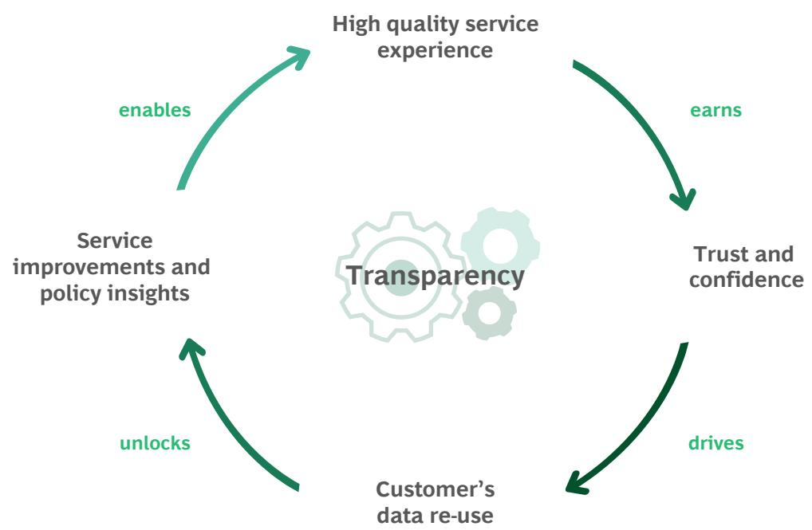  
Source: BCG and Salesforce Trust Imperative 3.0; BCG and Salesforce Analysis

  
GenAI will enable people to actually have a conversation with government... by enabling a deeper relationship, it can foster trust.  
– Adam Jura, BCG Asia Pacific Functional and Digital Senior Director

Exhibit 7: Proportion of respondents who use GenAI tools at least once a day varies across jurisdictions

# Section 3: Citizens' Perspectives on GenAI in Government

## Understanding the citizens' perspective

GenAI may present significant opportunities to improve the quality of government service delivery, but to what extent do citizens want what it offers, and are they ready for it? In our survey, we explored respondents' familiarity with AI and GenAI, their perspectives on its benefits versus the risks, and their level of comfort with its use in a government context. We found that for many use cases, citizens showed a high degree of comfort with GenAI being used, but there are genuine concerns about the speed of AI deployments and developments, and the potential impact on jobs, the workforce and the economy. Around 3 in 5 respondents trust government to use AI responsibly but more than a third do not trust government use of AI at all. More work clearly needs to be done to build (or rebuild) trust with a significant group of stakeholders for governments to be able to harness the benefits.

## Familiarity and usage of GenAI varies

To gain a better understanding of the level of GenAI maturity of citizens, our survey asked citizens about their usage and familiarity with GenAI tools. We found that the level of maturity and awareness is somewhat divided across the population, and varies significantly by jurisdiction.

On average 27 percent of respondents use GenAI tools at least once a week and 16 percent use them at least once a day (43 percent combined). Twenty-three percent of all respondents globally have never used GenAI tools, and 18 percent indicated they only use them less than once per month (41 percent combined).

Trends in daily usage vary significantly by jurisdiction. For example, only 4 percent of respondents in Italy use GenAI tools at least once a day, compared to 15 percent in the USA and 42 percent in Qatar.

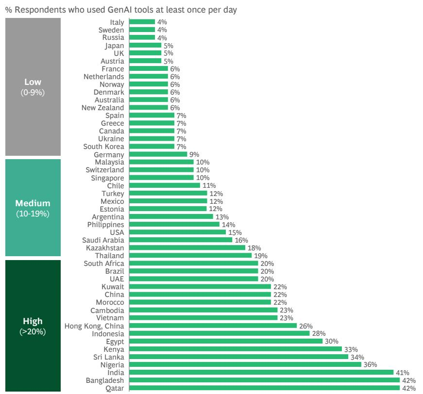

## Respondents are divided on whether benefits outweigh risks

We asked respondents to share their perspectives on the trade-off between the benefits and risks of using AI in a government context.

On average, 40 percent of respondents globally say that the benefits are greater than the risks, 31 percent say that the benefits and risks are about the same, and 21 percent say that the risks outweigh the benefits.

## Exhibit 8: Perception of benefits versus risks of AI in government

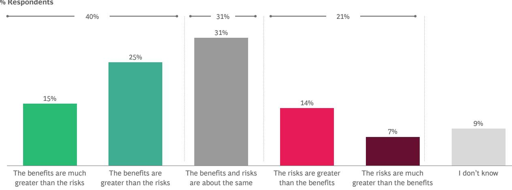  
Q. Do you think the potential benefits of using AI in government are greater than the risks? % respondents are a global average of total responses by the perception of benefits and risk of global AI, rounded to their nearest whole number. Note: Rounding to nearest whole numbers, totals may not add to 100%.
Source: 2024 BCG Digital Government Citizen Survey

However, the range of perspectives on this topic varies greatly. For example, the perception that the benefits of AI in government outweigh the risks ranges between +66 percent in Qatar and -14 percent in the Netherlands.

Exhibit 9: Overall perception that the benefits of AI in government are greater than the risks by jurisdiction

Perception that the potential benefits of AI in government are greater than the risks (%)

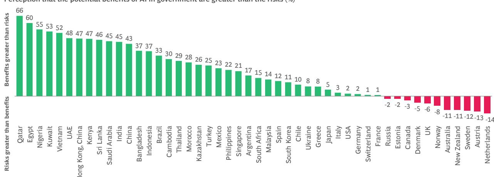

Q. Do you think the potential benefits of using AI in government are greater than the risks? Response options: 1. The benefits are much greater than the risks 2. The benefits are greater than the risks 3. The benefits and risks are about the same 4. The risks are greater than the benefits 5. The risks are much greater than the benefits 6. I don't know. Perception that the potential benefits of AI in government are greater than the risks (\%) = % benefits much greater or greater - % risks much greater or greater.
Source: 2024 BCG Digital Government Citizen Survey

## Novices see risks, experts see benefits

We asked respondents to self-assess their level of AI knowledge, and found that on average 63 percent of respondents say they have a basic or intermediate level of knowledge and 11 percent have none. Only 19 percent of respondents indicate they have an advanced level of AI knowledge and 7 percent self-identify as AI experts.

Our analysis of the survey data shows that the more knowledge and expertise someone has about AI, the more likely they are to perceive that the benefits of AI in government are greater than the risks. For instance, respondents with the most knowledge of AI are twice as likely to say that the benefits of AI in government are greater than the risks than respondents with a basic knowledge of AI, and 5 times more likely than respondents with no knowledge of AI.

Exhibit 10: Respondents with highest level of AI knowledge are more likely to say benefits of AI in government outweigh risks than those with no AI knowledge

AI knowledge and expertise
% respondents by self-assessed level of AI knowledge

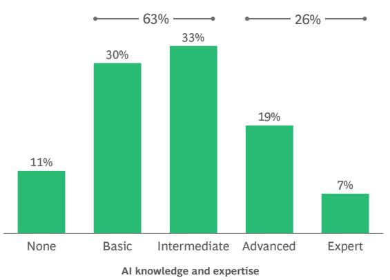  
Perception of benefits and risks
% respondents that say benefits of using AI in government outweighs risks

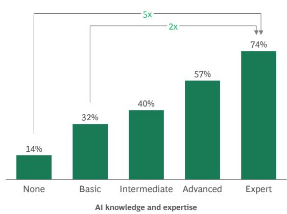  
Q. How would you describe your current level of knowledge of AI, including generative AI (GenAI)? Q. Do you think the potential benefits of using AI in government are greater than the risks? Response options: 1. The benefits are much greater than the risks 2. The benefits are greater than the risks 3. The benefits and risks are about the same 4. The risks are greater than the benefits 5. The risks are much greater than the benefits 6. I don't know.
Source: 2024 BCG Digital Government Citizen Survey

## 3 in 5 citizens are comfortable interacting with GenAI to access simple services

Despite the low levels of usage and knowledge, citizens globally are reasonably comfortable with the use of GenAI in government service delivery. For example, 39 percent of respondents indicated they are comfortable interacting with GenAI to access simple services and 24 percent of respondents are also comfortable interacting with GenAI to access both simple and complex services (63 percent combined). A further 21 percent prefer interacting with humans, but are comfortable with those staff using GenAI support tools. Less than 10 percent of respondents say they are not comfortable with using GenAI tools directly or interacting with staff who use GenAI tools.

Exhibit 11: 63 percent of respondents say they would be comfortable interacting with GenAI to access simple government services  
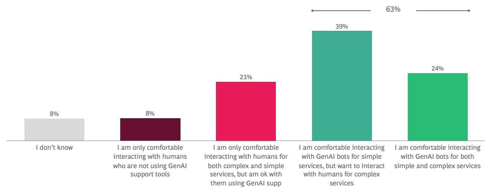  
Q. When are you comfortable interacting with GenAI to access government services? Source: 2024 BCG Digital Government Citizen Survey

Comfortable interacting with GenAI for both simple & complex services
Comfortable interacting with GenAI for simple services only

Again, perspectives vary across jurisdictions, with the percentage of respondents who are comfortable interacting with GenAI to access simple services ranging from 45 percent to 88 percent. Even in jurisdictions where the level of comfort was the

lowest (Denmark, Japan and the Netherlands) about half of all respondents still indicated that they are comfortable interacting with GenAI to access simple services.

Exhibit 12: Percentage of respondents comfortable interacting with GenAI to access simple services ranges between 45 and 88 percent  
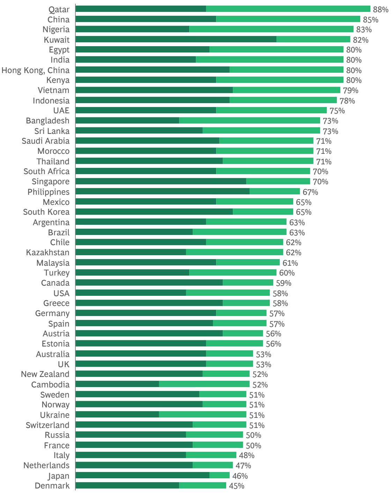

Q. When are you comfortable interacting with GenAI to access government services? Response options: I am comfortable interacting with GenAI bots for ... 1. both simple and complex services, 2. simple services but want to interact with humans for complex, 3. I am only comfortable interacting with humans for both complex and simple services but am ok with them using GenAI support tools, 4. I am only comfortable interacting with humans who are not using GenAI support tools, 5. I don't know.
Source: 2024 BCG Digital Government Citizen Survey

## High level of comfort across many but not all use cases

We asked respondents to tell us how comfortable they were with government using GenAI in 9 different situations and found multiple instances where the majority of respondents are already comfortable with governments using GenAI. For example, on average globally, 71 percent of

respondents are comfortable with the use of GenAI to communicate with citizens in multiple languages, 69 percent of respondents are comfortable with customer service agents using GenAI support tools and 67 percent are comfortable with the use of GenAI to streamline internal government administration.

Exhibit 13: Globally, overall comfort level with government using GenAI is positive  
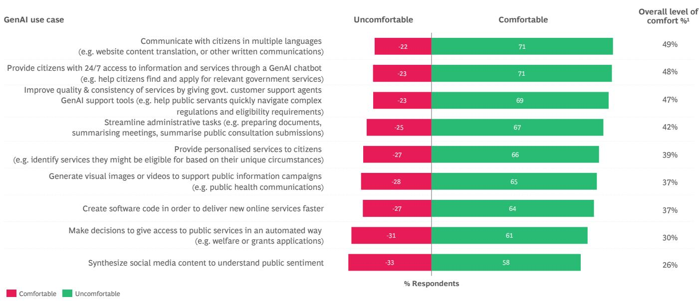  
Q. Please indicate how comfortable you are with government using GenAI to... Response options (per case): 1. Very comfortable, 2. Somewhat comfortable, 3. Somewhat uncomfortable, 4. Very Uncomfortable, 5. I don't know. Overall level of comfort = % very comfortable or somewhat comfortable - % somewhat uncomfortable or very uncomfortable. Responses for "I don't know" not shown. Source: 2024 BCG Digital Government Citizen Survey

While overall sentiment was positive across all 9 use cases, more detailed analysis shows substantial differences across jurisdictions and use cases. Exhibit 14 illustrates the global average level of comfort and the range of responses.

There is positive support for certain use cases such as using GenAI to communicate with citizens in multiple languages, to provide 24/7 access to information and services, to provide support tools to customer service delivery staff, to streamline administrative tasks, to provide personalized services to citizens, to generate text, images or videos to support public information campaigns and to write software code. However, in some jurisdictions, the level of comfort for some of these is weak or even negative; for example, in Denmark, Sweden, Norway, the Netherlands and France.

Citizens in some jurisdictions were not comfortable in general with governments using GenAI to make automated access decisions for public services or using it to monitor public sentiment. This was most evident in jurisdictions such as Denmark, Sweden, the Netherlands, Switzerland, Greece, the UK, Australia and New Zealand.

Governments should start by unlocking the benefits of GenAI in use cases where there is already a high degree of comfort. Support for some use cases is not universal, and this underscores the importance of taking a considered approach to use case selection, tailoring AI strategies and roadmaps to the unique contexts of each jurisdiction, and ensuring there is sufficient acceptance or social license on the use of GenAI.

Exhibit 14: Overall level of comfort in government using GenAI across the 9 use cases tested varies by jurisdiction
Overall level of comfort  
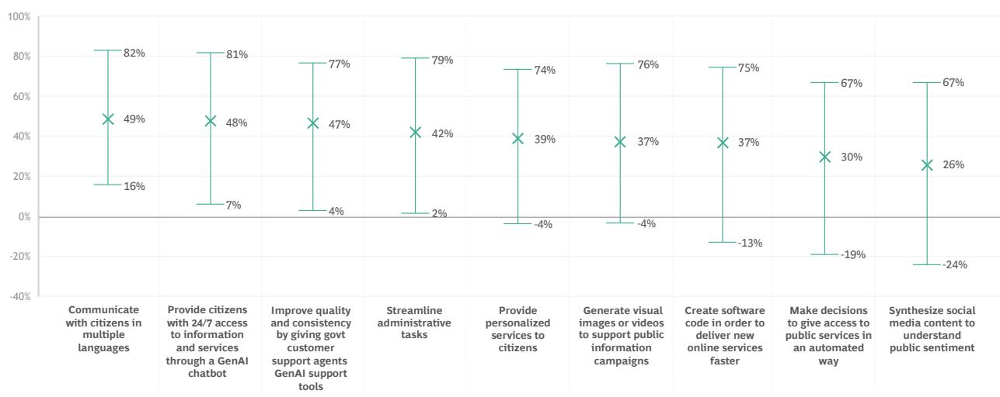  
Minimum and maximum (%) × Global average (%)  
Q. Please indicate how comfortable you are with government using GenAI to... Response options (per case): 1. Very comfortable, 2. Somewhat comfortable, 3. Somewhat uncomfortable, 4. Very Uncomfortable, S. I don't know. Overall level of comfort (%) = % very or somewhat comfortable - % somewhat or very uncomfortable.
Source: 2024 BCG Digital Government Citizen Survey

## AI development is happening quickly

The social license for AI and GenAI is evolving over time, and technical developments and capabilities are emerging virtually every day. We asked respondents what they thought about the pace of AI development and whether it was advancing too quickly, too slowly or about the right pace. On average, just over half (51 percent) of respondents globally believe that AI is developing too quickly, 33 percent think the speed is about right, and only 7 percent think it is too slow.

Exhibit 15: About half of global respondents believe that AI developments are moving too fast  
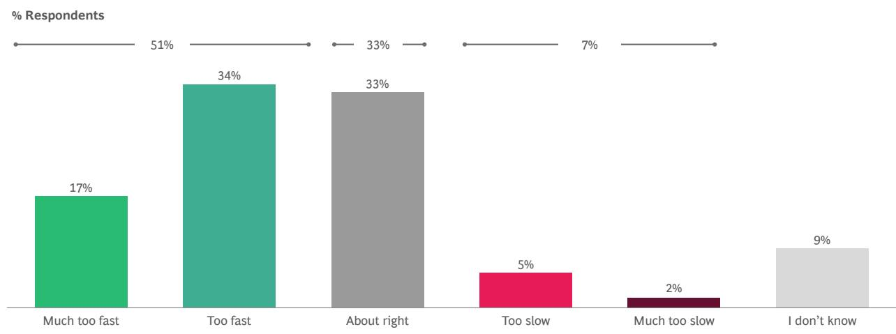  
Q. What do you think about the current speed of AI development? Source: 2024 BCG Digital Government Citizen Survey

This pattern was reasonably consistent across most jurisdictions. In about half of the jurisdictions surveyed, 50 percent of respondents or higher say the pace of AI development is too fast.

However, perspectives varied across the remaining jurisdictions. In some countries, including Germany and Switzerland, respondents are more evenly divided on whether the pace of AI development is too fast or about right.

In another 9 jurisdictions, respondents are more likely to say pace is about right; for example, in China (62 percent), Indonesia (59 percent) and Singapore (47 percent).

The proportion of respondents who think that AI is developing too slowly is low across all jurisdictions. However, respondents from Malaysia (17 percent) and Switzerland (15 percent) are the most likely to believe this is the case.

Exhibit 16: 51 percent of respondents said AI developments are moving too fast, 33 percent the right speed, and 7 percent too slow

Speed of AI development is...

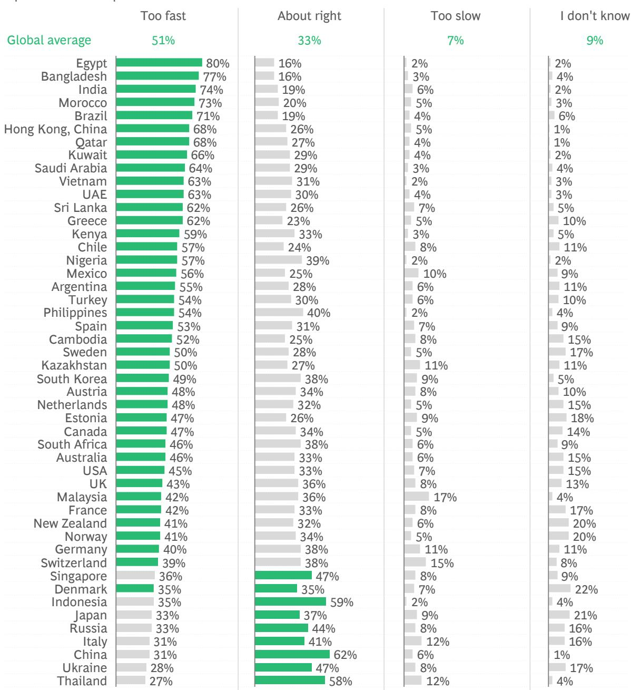  
Largest group of respondents

Q. What do you think about the current speed of AI development? Is it happening... Response options:: 1. Much too fast, 2. Too fast, 3. About right, 4. Too slow, 5. Much too slow, 6. I don't know. "Too fast" = "much too fast" + "too fast", and "too slow" = "too slow" + "much too slow". Rounding to nearest whole numbers, totals may not add to $100\%$ . Source: 2024 BCG Digital Government Citizen Survey

## Economic impact and accuracy are front of mind

We also asked respondents to indicate what their top concerns are regarding the use of AI and GenAI in society. Exhibit 17 shows that the top 2 concerns are: (1) the potential loss of jobs and impact to the economy (34 percent); and (2) the accuracy of the results and analysis (26 percent). This is closely followed by concerns that the moral and ethical issues have not yet been resolved (25 percent), and concerns regarding the capability of individuals to use it (also 25 percent). Only 8 percent of respondents do not have any concerns.

When we examined the survey responses across jurisdictions (see Exhibit 18), we found that the top 2 concerns were reasonably consistent.

Potential loss of jobs and economic impact clearly stand out as the number one concern globally, and was featured within the top 2 concerns in 38 out of 48 jurisdictions. Accuracy of the results and analysis was also a top 2 concern in about half (24 out of 48) of the jurisdictions.

Another point worth highlighting is that the large volumes of data needed and potential for bias and discrimination did not rank within the top 2 concerns in any of the 48 jurisdictions sampled. In addition, lack of transparency ranked within the top 2 concerns only in Denmark, Sweden, and Singapore.

Exhibit 17: Top 2 concerns about the use of AI and GenAI are the potential loss of jobs and impact to the economy, and the accuracy of results and analysis

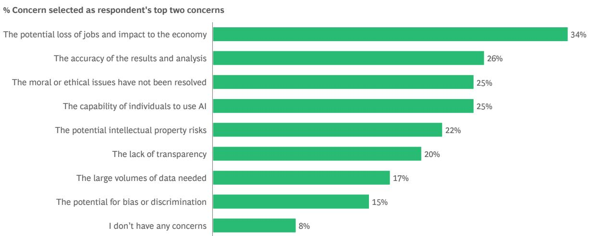  
Q. What concerns you the most about the use of AI (including GenAI)? (Select 2)
Source: 2024 BCG Digital Government Citizen Survey

## Exhibit 18: Top 2 concerns regarding the use of AI and GenAI

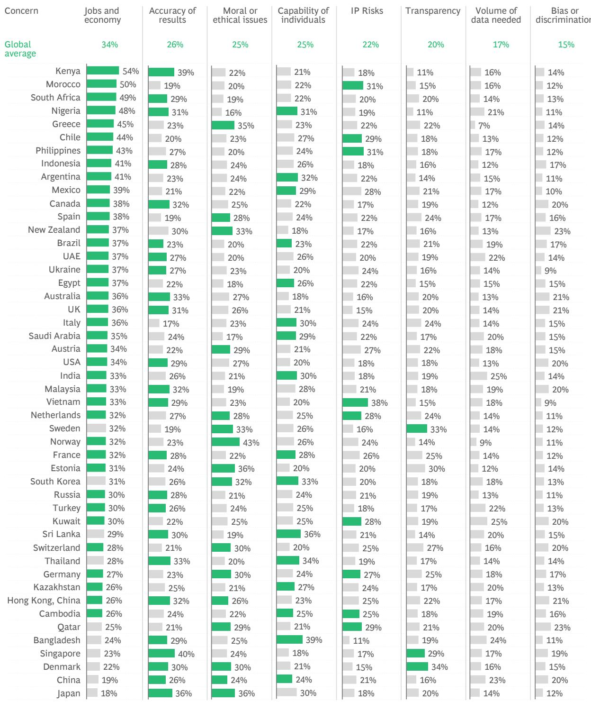  
Top 2 concerns by jurisdiction  
Q. What concerns you the most about the use of AI (including GenAI)? (Select 2)
Source: 2024 BCG Digital Government Citizen Survey

## AI Safety and Capability Development in the UK

The UK's ambition is to position itself as a global superpower in AI through its National Artificial Intelligence Strategy. Two key areas of government focus are putting AI safety mitigations in place, and building the necessary AI skills and capabilities of the civil service.

AI safety: The UK hosted the first major global summit on AI safety in 2023, bringing together representatives from 28 countries, leading technology companies, and researchers to agree on safety measures to evaluate and monitor the most significant risks from AI. The objectives of the summit were to: create a shared understanding of the risks and the need for action, discuss a process for international collaboration on AI safety, discuss measures for individual organizations to increase AI safety, identify potential areas for collaboration on AI safety research, and showcase how the safe development of AI will enable AI to be used for good globally. Summit outcomes included the Bletchley Declaration on AI safety, which was signed by all nations present, a joint statement on AI safety testing, and support for the development of a ‘State of the Science’ report that will help to build international consensus on the capabilities and risks of frontier AI.

AI skills and capabilities of the civil service: In January 2024, the UK’s Central Digital and Data Office (CDDO) published guidance to civil servants on the use of GenAI. This guidance focused on the practicalities of using GenAI by role, as well as data protection measures that civil servants must adhere to, in line with the UK’s general principles for civil service working as it applies to GenAI. This was accompanied by examples for how to use GenAI appropriately for AI research, to summarize information, to develop code, and to conduct textual data analysis.

In addition, the CDDO, in collaboration with the Department for Science, Innovation and Technology (DSIT), hosted workshops that provided guidance on the use of GenAI to civil servants by exploring use cases, risks, and opportunities that the new technologies offer. In February 2024, the UK Government also announced that it would invest US\$127 million (GB£100 million) in a program to realize new AI innovations and support the development of technical skills and capabilities for regulators. $^{10}$

## Do citizens trust government to use AI responsibly?

Three in five respondents (58 percent) globally say they trust state and local governments to use AI responsibly, and 59 percent say they trust their national governments to use AI responsibly.

Considering the global averages, there was no material difference in overall levels of trust across tiers of government, or in comparison to the private sector to use AI responsibly, but 37 percent say they did not trust state and local government and 35 percent did not trust the national government to use AI responsibly.

This highlights that there is a significant proportion of people (more than one-third) who do not trust the public or private sector to use AI responsibly and more work will need to be done to build (or rebuild) trust in the use of AI with these constituents.

Exhibit 19: Trust in government and private sector organizations to use AI responsibly

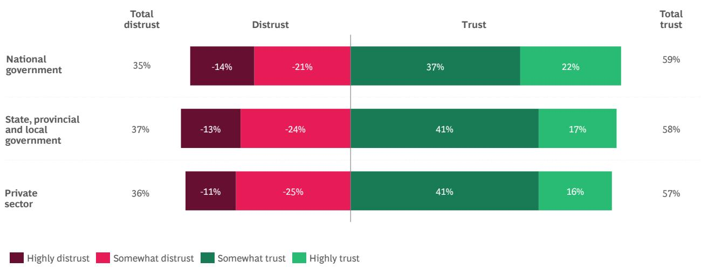  
Q. To what extent do you trust the following organizations to use AI responsibly? (Private sector organizations, Local governments, National governments, State or provincial governments). Note: 1. Responses for "I don't know" not shown. 2. State or provincial and local government responses combined as an average.
Source: 2024 BCG Digital Government Citizen Survey

Looking across jurisdictions, Exhibit 20 shows that the level of trust in government to use AI responsibly is generally higher in jurisdictions outside of the OECD than in OECD member jurisdictions.

This difference may be driven by more positive attitudes towards new technologies in less developed economies, cultural factors and attitudes towards authority and government intervention.

Exhibit 20: Level of trust in governments use of AI for OECD and non-OECD  
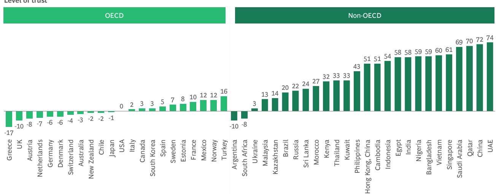  
Net trust - OECD Net trust - non-OECD  
Q. To what extent do you trust the following organizations to use AI responsibly? (Private sector organizations, Local governments, National governments, State or provincial governments). Response options (per case): 1. Highly trust, 2. Somewhat trust, 3. Somewhat distrust, 4. Highly distrust, 5. I don't know. Level of trust = % highly or somewhat trust - % somewhat or highly distrust. Note: average across all levels of government used.
Source: 2024 BCG Digital Government Citizen Survey; OECD member list.

Comparing levels of trust in the public and private sectors for each jurisdiction, we also observed a significant variation in trust to use AI responsibly. There are 3 broad categories:

\- Jurisdictions where trust in government to use AI responsibly is much higher than private sector such as Singapore, China, Qatar, and UAE.

\- Jurisdictions where trust in government to use AI responsibly is about the same as the private sector (+/- 2 percent). This includes jurisdictions such as Malaysia, India, Kuwait, Egypt, Morocco, USA, UK, Germany, and New Zealand.

\- Jurisdictions where trust in the private sector use of AI is the highest as observed in South Africa, Kenya, Nigeria, Brazil, Argentina, Mexico, Thailand, Sri Lanka, and Indonesia.

Exhibit 21: Trust in government to use AI responsibly versus the private sector

Percentage point difference in level of trust in government and private sector to use AI responsibly

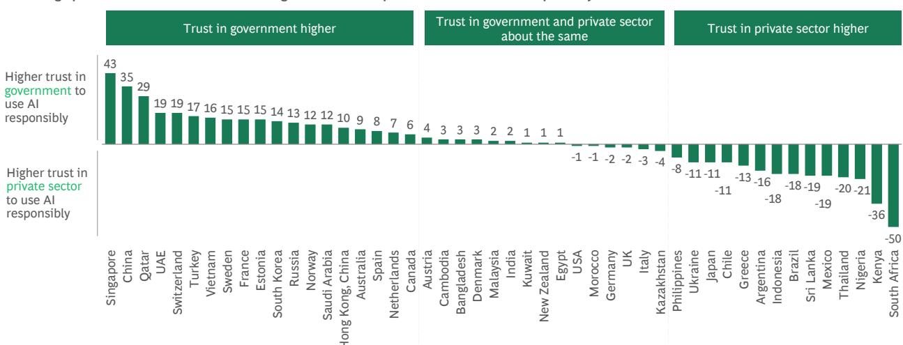  
Q. To what extent do you trust the following organizations to use AI responsibly? (Private sector organizations, Local governments, National governments, State or provincial governments). Response options for each organization: 1. Highly trust, 2. Somewhat trust, 3. Somewhat distrust, 4. Highly distrust, 5. I Don't Know. Level of Trust = % highly or somewhat trust less % somewhat or highly distrust. Average across all levels of government.
Source: 2024 BCG Digital Government Citizen Survey

## A few demographic differences

We did not find any statistically significant variations across demographic variables, such as gender or employment status. However, there are some differences for age and residential location.

For example, on average trust in government use of AI is higher for respondents under 50 compared to those over the age of 50. Specifically, overall trust is highest among respondents aged under 50 living in urban/metro areas and regional or remote locations, compared to respondents under 50 years of age across all loations.

In relation to frequency of usage, knowledge and benefits, Exhibit 22 shows that younger cohorts are the most frequent users of GenAI tools. For example, 48 percent of respondents aged 18-34 indicate that they use GenAI tools at least once a week, compared to 29 percent of respondents over 60. It also shows that the more frequently people use GenAI, the higher they rate their level of knowledge and expertise. Respondents with highest knowledge and expertise are also more likely to perceive the benefits of AI in government outweigh the risks.

Exhibit 22: The more respondents use GenAI, the higher their AI knowledge and the more they perceive the benefits of AI in government to outweigh the risks

Frequency of usage of GenAI vs. AI knowledge (inc. GenAI)

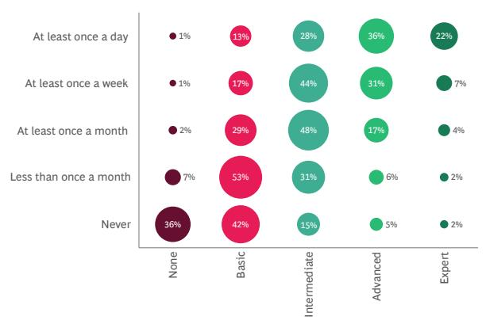  
AI knowledge vs. perception benefits and risks of AI in government

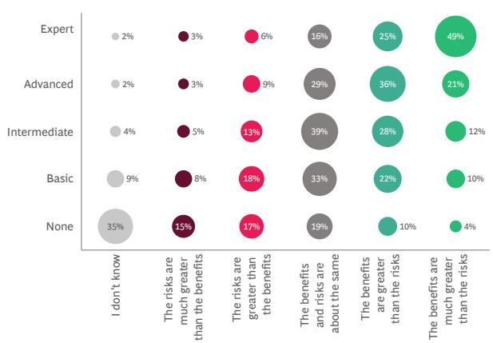  
Q. On average, how frequently are you using generative AI (GenAI) tools such as ChatGPT? Q. How would you describe your current level of knowledge of AI, including generative AI (GenAI)? Q. Do you think the potential benefits of using AI in government are greater than the risks?
Source: 2024 BCG Digital Government Citizen Survey

This relationship between AI usage, AI knowledge, the perception of benefits and risks, and trust in government to use AI responsibly, leads to a second flywheel of trust (see Exhibit 25). The more people understand and use AI, the more familiar they are with it. They are then also more likely to say that the benefits outweigh the risks, to support government use of AI, and to trust government

to use AI responsibly. In turn this drives greater usage and understanding. This second flywheel underscores the importance of building awareness, knowledge, experience, skills, and expertise across the population to be able to start unlocking the benefits of GenAI to deliver better and more cost effective services for citizens and multiply trust.

Exhibit 23: The AI trust flywheel  
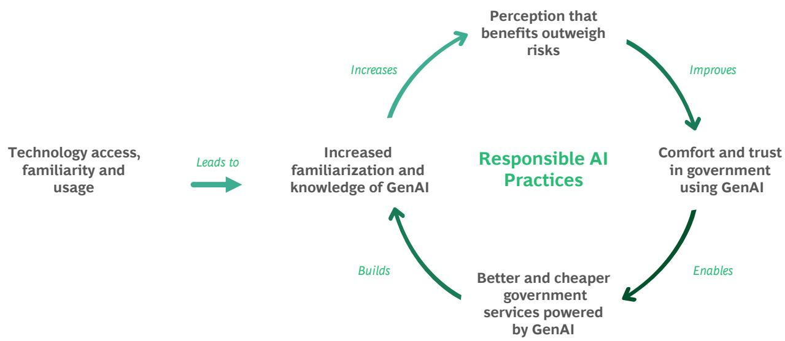  
Source: BCG and Salesforce Analysis

## RISE Singapore empowers workforce skills of the future

RISE is an upskilling program that has empowered Singaporeans to build high-demand skill sets in digital technology, business and green sustainability. The program was designed to bridge the skills gap in the market by giving citizens the opportunity to re-skill and adapt to rapidly changing workforce demands. The program is 95 percent subsidized by government. The digital upskilling course has 1,000+ hours of unique content on core critical skills, including data, digital sales, digital marketing, digital transformation, technology use cases, change management, and agile and soft skills. Within the first year of launch, 1,700+ citizens had graduated from the program and \~80 percent found jobs within a few months. $^{11}$

## Building greater trust in governments use of AI

Given the need to kickstart the flywheel to build (or rebuild) trust, we asked respondents to identify factors that would increase their trust in government use of AI. Overall, 10 percent of respondents say that nothing would influence their trust in government to use AI responsibly. However, the remaining 90 percent nominated several factors.

Establishing clear guardrails ranks the highest, with 38 percent of respondents highlighting the need for specific laws and regulations on how AI can be used by government as the most important trust building factor. Rules to safeguard personal information emerged as the second most important ingredient for trust, cited by 34 percent of respondents.

Other trust-building factors were selected by respondents in equal measures. They include the application of fairness and safety measures, and communication about the potential benefits and risks of AI. Transparency factors, including mandatory reporting of AI-related adverse events, and disclosure if AI had been used, was also identified as critical.

Exhibit 24: Specific laws/regulations and rules to safeguard personal information were the top two factors to increase trust  
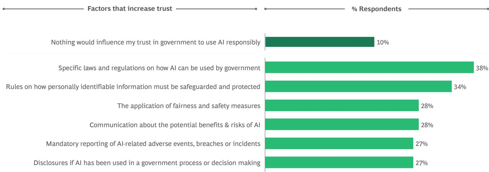  
Q. Which of the following would increase your trust in the use of AI by governments? (Select 2). Source: 2024 BCG Digital Government Citizen Survey

The global findings are largely consistent across jurisdictions, as shown in Exhibit 25. Specific laws and regulations on how AI can be used by government is one of the top 2 factors that would increase trust in all but 4 jurisdictions. Additionally, in 35 of the 48 jurisdictions, rules to safeguard personal information was also identified in the top two factors.

Exhibit 25: Top 2 things respondents say would increase trust in governments responsible use of AI fairly consistent across jurisdictions  
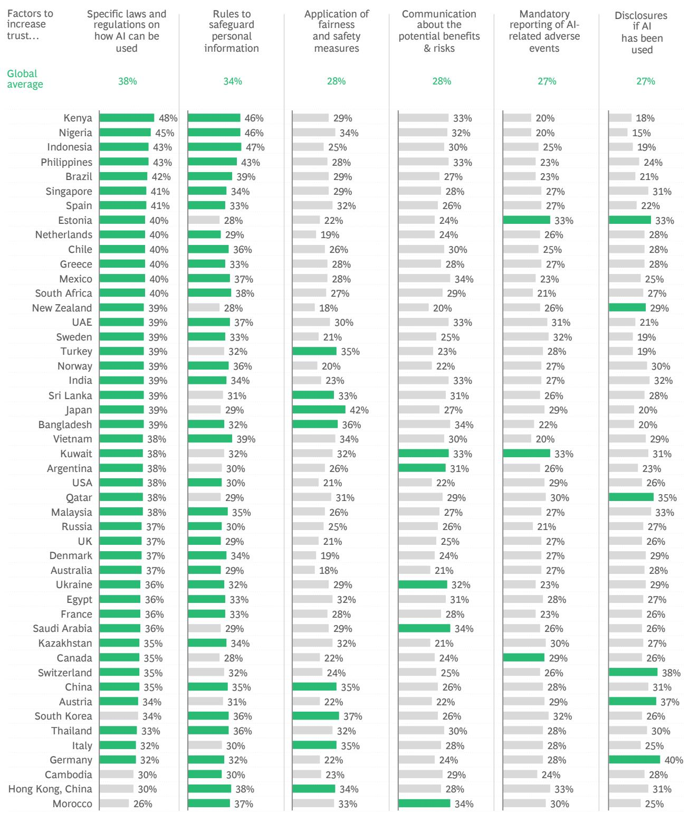  
Top 2 factors to increase trust in each jurisdiction  
Q. Which of the following would increase your trust in the use of AI by governments? (Select 2). Source: 2024 BCG Digital Government Citizen Survey

## Regulating for AI innovation and safety

Several regulatory and non-regulatory tools are available to government to promote responsible AI development. These include AI principles, AI frameworks, laws and policies, voluntary guidelines, standards and certifications, and establishment of capabilities to enable responsible innovation (e.g. regulatory sandboxes and data exchanges).

## Exhibit 26: Examples of government approaches to AI safety

<table><tr><td>Description</td><td>Voluntary standards, self regulation,principles and frameworks</td><td>AI specific regulation</td></tr><tr><td>Select examples (not exhaustive)</td><td>Japanhas to date relied on voluntary compliance measures including publishing principles for Human-Centric AI. The government has recently also released a draft of guidelines on the operationalization principles, and may consider legally binding regulations in the future. $^{1,2}$ USA NIST AI Risk Management Framework (AI RMF) is intended for voluntary use and to improve the ability to incorporate trustworthiness considerations into the design, development, use, and evaluation of AI products, services, and systems. In February 2024, the government also issued an Executive Order directing a number of actions to address AI safety including disclosure requirements for developers. In late March, a government-wide policy to mitigate risks of artificial intelligence (AI) and harness its benefits was also announced. $^{3,4,5}$ Singaporeis fostering Responsible AI without AI specific regulation through a variety of relevant sectoral and voluntary frameworks, as well as binding regulation in areas such as data protection, copyright and online safety. The AI Verify foundation, a subsidiary of the Infocomm Media Development Authority (IMDA), provides a voluntary assessment tool for companies who want to demonstrate responsible AI in an objective and verifiable manner. $^{6,7}$ UK is driving responsible AI through existing sector-based regulation, and encouraging regulators to consider five cross-sector principles through a framework, but which is not codified into law. Government also leading global AI Safety initiatives including hosting AI Safety Summits. $^8$ TheAfrican Union Development Agencyhas published a policy draft including recommendations for industry-specific codes, standards and certification bodies to assess and benchmark AI systems, regulatory sandboxes for safe testing of AI, and the establishment of national AI councils. $^9$ Indonesia&#x27;s AI landscape is guided by in the National Strategy on AI emphasizing the development of the AI ecosystem, encompassing talent, data, infrastructure, and research, and currently steered by general and ethical guidelines (including humanity, security, transparency, etc.). Recently, Indonesia is preparing more comprehensive AI regulations to be launched by end of 2024. $^{10}$ </td><td>EU regulations include risk framework banning use cases that present unacceptable risk, requiring extra vigilance and a mandatory risk mitigation framework for those which are high risk, and establishing requirements for transparency. Regulatory sandboxes also used to promote responsible AI innovation. Combined with the EU&#x27;s GDPR, the Digital Market Acts and the Digital Services Act, the EU has one of the worlds most robust regulatory environments to mitigate harms from the development and application of AI systems and collection of citizen data. $^{11,12}$ Chinahas implemented AI regulation to manage different facets of AI including the Algorithm Recommendation Regulation on the use of various algorithms for recommending internet content, the Deep Synthesis Regulation which is more specific on deep synthesis technologies, and the Draft Ethical Review Measure which focuses the ethical aspects of researching and developing AI technologies. The GenAI Regulation also regulates the development and application of all GenAI technologies in service provision. $^{13}$ </td></tr></table>

1. Center for Strategic and International Studies 2. Kyodo News 3. NIST, 4. Whitehouse Fact Sheet 5. Whitehouse Fact Sheet, 6. IAAP; 7. A.I. Verify Foundation,  
8. GOV.UK, 9. MIT Technology Review, 10. CNN Indonesia, 11. Europa.eu 12. Europa.eu 13. Latham and Watkins, 13. Carnegie Endowment. Note: Select examples

# Section 4: The GenAI Roadmap for Government

This section sets out a roadmap for government to multiply trust with GenAI:

1. Get started, now: Learn by doing, starting with low risk/low harm use cases, to build the internal capabilities to innovate and scale and invest in building the necessary skills, critical data and technology platforms.

2. Establish the prerequisites for trust:
Adopt responsible AI governance, promote a responsible AI culture, commit to accountability and transparency, and design to bring the best of human and AI to deliver maximum impact for citizens.

3. Lead in AI innovation: Foster innovation by building AI skills and expertise, and catalyze innovation through holistic AI strategies for a thriving knowledge economy.

Governments need to get a move on [with GenAI] ... the focus needs to be on competence in delivery to build trust.

– Richard Sargeant, BCG Managing Director and Partner, London

## 1. Get started now

Citizens have already indicated they are comfortable with governments using GenAI for a number of use cases, such as improving access to services through language translation or streamlining government back-office processes and administration (see Section 3). Governments should start with low-risk or low-harm use cases, but also look ahead to build the capabilities needed to scale.

Start with pilots but get ready to scale
Governments need to combine an ambitious vision for the potential of AI and GenAI with a portfolio of targeted and practical initiatives that create the evidence-base and learning required to scale. The optimal roadmap for AI and GenAI adoption will vary across jurisdictions; the social license for it will be influenced and shaped by citizens' readiness and comfort with government using the technology and, as our research shows, this varies significantly across jurisdictions.

To determine the pace of adoption, governments need to carefully weigh the potential benefits of enhancing service quality and efficiency against the potential risks and overall citizen sentiment. Governments may also need to lay more groundwork through responsible AI policies, education, and knowledge to raise awareness and acceptance.

By starting with practical proof-of-concepts and pilots, government can begin to unlock the benefits of GenAI now, and build the understanding, knowledge, capabilities, and confidence necessary to scale. It will also support the establishment of trust and credibility with citizens by demonstrating benefits and competence using the technology, and boosting familiarity with the technology.

## “

The key will be in understanding which [GenAI] use cases can have an immediate and genuine impact for citizens and agency productivity, while also managing the risks.

– Dr. Gayan Benedict, Salesforce CTO for Australia and New Zealand

## Start with low-risk/low-harm use cases

Starting with use cases that are internally facing, such as streamlining internal processes and administration, enables governments to build the organizational capabilities and demonstrate value before progressing to more complex and more sensitive citizen-facing applications. When deploying GenAI in citizen-facing applications, government could start with use cases where there is already a high degree of citizen comfort, such as using GenAI to provide citizens with 24/7 access to information, for language translation, or as a support tool for customer service delivery agents.

Governments should identify where GenAI can create the greatest efficiencies, improve customer experiences, or open up new opportunities to better achieve their policy goals. Regardless of the approach taken, rigorously evaluating use cases is essential.

Unfortunately, in the rush to get started, some organizations have initiated loosely defined pilots and proof-of-concepts with large numbers of users, often without the rigor and discipline of a randomized trial, control groups or other ways of baselining and measuring the productivity benefits or service improvements. The costs associated with GenAI models and supporting infrastructure can be significant, and one of the key outcomes of the trials and pilots should be to create the information and evidence-base needed to inform and justify future investments. By documenting the performance metrics and benchmarks of GenAI initiatives, government can also showcase the tangible benefits and service improvements driven by GenAI and establish a framework for continuous improvement and accountability.

## Fast-tracking upskilling

Twenty-five percent of respondents in our survey identified the capabilities of individuals to use AI as a key concern, however recent BCG research shows that only 6 percent of CEOs globally have started upskilling their teams in a meaningful way. $^{12}$ Much like the private sector, building digital and GenAI proficiency at all levels of government should be a top priority. The public sector workforce need to be upskilled in essential AI and GenAI skills such as model selection, prompt engineering, quality assurance and verification, data security, privacy and ethics. Doing so will also address employees' fears and concerns. For example, BCG research shows that 68 percent of desk workers who were initially fearful of using GenAI increased their productivity and job satisfaction after using GenAI tools regularly while overcoming their fears. $^{13}$

Fast-tracking upskilling is a three-pronged strategy. First, governments should invest in at-scale learning programs to build digital and GenAI skills and provide hands-on learning experiences. The same BCG research cited earlier shows that desk workers' fear of using GenAI tools drops significantly when they have hands-on experience in their work context, with training offering the additional benefit of increasing productivity simultaneously. $^{13}$ Second, recruitment rounds should be used to hire new staff with strong core digital, AI and GenAI skills. Third, governments should explore opportunities to accelerate capability development by leveraging lessons learned from other jurisdictions.

## Use case selection to maximize trust

\- High value for citizens and government. Prioritize use cases that have the greatest potential to improve productivity, efficiency, reduce costs, improve access, or increase effectiveness or accessibility of government services.

\- Low risk of unintended consequences. Carefully assess the potential risks of each use case. Choose use cases where the risks can be mitigated effectively by algorithmic transparency and human oversight.

\- Low potential for harm. Assess the potential consequential impacts, losses or downside risks of each use case on citizens, particularly on vulnerable or at-risk population segments.

\- Public acceptance. Use cases that gain wide public acceptance are likely to be more successful. Gauge the level of citizen acceptance for each use case, including perceived benefits, risks, and ethical implications.

Examples include sharing knowledge and experience through summits and conferences, establishing collaboration forums, or memorandums of understanding or knowledge sharing partnerships to facilitate the exchange of experience and insights.

GenAI... [training] is a crucial contributor to empowerment and autonomy so people understand what they have their hands on, and how to use it responsibly.

– Dr. Gayan Benedict, Salesforce CTO for Australia and New Zealand

## Establish data and technology platforms

The primary purpose of using GenAI in government is to make better-informed policy decisions, deliver higher quality services, and improve government operations' efficiency and effectiveness. Where solutions are trained with specialized data sets, it is essential that the source data is complete, accurate, relevant, and updated, as data errors might lead to inaccuracy or biases. Data must reflect current situations and undergo strict ongoing checks for reliability. Understanding how that data is safeguarded after being used to train a model should also be considered.

However, not all government use cases require GenAI models to be trained on government data. An increasing range of platforms, solutions, and tools are becoming available to suit highly regulated industries like the public sector where data sensitivity is paramount. Some technologies do not require training on government data at all, but are instead ‘grounded’ in that specific contextual data without copying, learning, or the data leaving the safety of the secure government environment. In other situations, the technology is evolving to suit use cases where no specific government or citizen data is needed at all. With the right data and responsible AI methods, government employees will be empowered to reach their highest potential while mitigating the risks of AI.

## 2. Establish the prerequisites for trust

To harness the power and benefits of AI, governments must establish the prerequisites to increase citizens' trust in the responsible use of AI by government. The key elements which citizens indicated are most important are establishing a clear framework with specific laws and regulations, requirements for transparency, and keeping humans in the loop.

## Establish clear laws and regulations

Many existing policy and regulatory frameworks already apply to some aspects of GenAI safety such as privacy, cybersecurity, online safety, copyright, and intellectual property. However, given the unique nature and characteristics of GenAI, these regulations need to be reassessed to ensure their continued relevance and effectiveness. In response to the rapid pace of technological advancements, governments can evolve existing frameworks to create the guardrails for responsible AI research, and the development and application of AI.

For example as illustrated in Exhibit 26, some governments may opt for voluntary standards, self-regulation and industry-led best practices. At the other end of the spectrum lies comprehensive, binding regulation, particularly in high-risk domains or addressing pressing concerns surrounding GenAI safety.

## Adopt a responsible AI framework and culture

A comprehensive framework for the responsible use of AI in government is also essential. Such a framework should encompass an overarching strategy, governance, policies and standards, and effective controls embedded within processes and technology. Government leaders will also have a key role to play $^{14}$ in establishing a responsible AI culture in their departments through setting expectations for responsible AI use, allowing and encouraging responsible experimentation, driving awareness of responsible AI principles and practices and leading by example.

In addition, outlining the oversight and accountability structures, including independent review bodies and audit processes, can reassure citizens of government commitment to preventing misuse.

## Be transparent

The feedback from citizens in our survey clearly indicated that they want government to be transparent and to disclose when and how GenAI is being used. Similar to citizens' expectations around cyber incidents and data breaches, they expect governments to be transparent about any GenAI lapses, to quickly resolve emerging problems, and to communicate the situations and the corrective measures implemented. Governments can also promote technological transparency, which could include publishing details about the algorithms, data sources, and machine learning models used in their GenAI applications.

A GenAI Charter could signal to citizens what they should expect from government's use of GenAI. It might describe how government plans to ensure the responsible development and application of GenAI, including key principles which will be applied, how it will be governed and accountability maintained, how problems will be addressed, and which services will be powered by GenAI.

## Combine the best of humans + AI

In our survey, respondents indicated a clear preference for an approach that keeps humans in the loop in government service delivery, especially for those services which are more complex. This synergy is vital for: ensuring fairness and accuracy; adhering to citizens' expectations of explainability, transparency, and accountability; and leveraging AI to align with citizen expectations to interact with humans and comfort with the use of GenAI and automation more broadly. Combining the advantages of GenAI with human expertise that recognizes the distinct advantages of each is crucial for enhancing both trust and effectiveness.

Transparency and communication will be key to building trust, and emphasis needs to be on purpose and benefits – not just the technology itself.

– Richard Sargeant, BCG Managing Director and Partner, London

## Helsinki and Amsterdam AI Registers

The City of Amsterdam has established an Algorithm Register which provides an overview of the city's AI systems and algorithms. $^{15}$ The register is publicly available and provides citizens with an opportunity to understand more about the specific solutions that are being deployed. This includes intended purpose, data sets used, how human oversight is provided, the system architecture and operational logic of data processing, and information on the approach to ensure non-discrimination and risk management strategies. Citizens can also provide feedback through the register to help make the algorithms used better, fairer and more responsible. The City of Helsinki has also taken a similar approach (AI Register). $^{16}$

## 3. Lead in AI innovation

Citizens are genuinely concerned about the potential impact of AI and GenAI on job losses and the economy, and most analyses show that the adoption of AI and GenAI will be highly disruptive. Some entire jobs may become redundant or obsolete and the tasks performed in many jobs will be automated or augmented. There will also be new jobs created that have not yet been imagined and do not exist today. The overall impact on the workforce will be significant and disruptive. Navigating this transition requires investment and collaboration between individuals, businesses, academia, and government in upskilling and reskilling at scale and at speed.

## Build national AI literacy

Governments face a critical challenge of building digital skills across the economy and attracting AI talent to their countries and regions. This is crucial to driving adoption and unlocking the economic benefits, preparing citizens for the future of work, and building the trust needed for the widespread adoption of AI technologies. Boosting national AI literacy requires comprehensive strategies to increase AI awareness and understanding in school education, vocational and higher education, and the upskilling and reskilling of the current workforce.

## Ensure AI equity

Governments have a responsibility to ensure that the benefits of GenAI are fairly distributed across socio-economic groups, that the advantages are shared, and that the risks are not borne disproportionately by particular groups - in particular by women and younger generations who are more susceptible to automation because of the nature of the roles they tend to fill in the economy. AI developments may also inadvertently widen economic divides. Ensuring equity will require inclusive policies that democratize access to educational tools and programs, and ensure every learner can benefit from the advancements in GenAI.

## Catalyze innovation

Governments need to create a supportive regulatory environment for innovation. For example, regulatory sandboxes and safe harbor provisions offer companies protection and safe spaces to experiment with new GenAI applications and to innovate and test new products and ideas more quickly. Investment in collaborative research and development between business, government, and academia, and innovation clusters or hubs can also catalyze innovation and advance understanding of approaches to responsible AI. Further, by encouraging partnerships, summits and establishing collaboration platforms, governments can facilitate knowledge sharing across government, industry, academia, and civil society, and cultivate ecosystems aligned around shared goals to push the boundaries of GenAI research, pilot novel applications, and tackle ethical and societal challenges.

Supporting innovation within the small and medium enterprise sector is crucial, and governments could facilitate this by earmarking funds for GenAI research and development. This support might extend to startups, research entities, and joint ventures, with tax incentives and innovation competitions further boosting investment. An equitable allocation of these resources is vital to creating a diverse and inclusive environment for technological innovation.

## About the Authors

## Miguel Carrasco

is a Managing Director & Senior Partner in the Sydney office of Boston Consulting Group, and the global lead for the BCG Center for Digital Government and BCG X in Public Sector.

carrasco.miguel@bcg.com

## Grantly Mailes

is a Partner & Associate Director in the London office of Boston Consulting Group, and is the global topic leader for emerging technologies in the BCG Center for Digital Government.

mailes.grantly@bcg.com

## Francisca Browne

is a Consultant in the Sydney office of the Boston Consulting Group. She is the topic manager for the BCG Center for Digital Government.

browne.francisca@bcg.com

## Gisele Kapterian

leads Public Sector Strategy across Asia Pacific for Salesforce. She has a Masters in International Law from Cambridge University, and served 5 years as political adviser to 3 Australian Federal Cabinet Ministers.

gkapterian@salesforce.com

## Barry Dietrich

is Senior Vice President and General Manager Public Sector and Healthcare APAC at Salesforce.
bdietrich@salesforce.com

## Acknowledgments

The authors would like to thank Stephanie McMillan, Joanna Beerman, Jane Armstrong, Sarka Tran, Seamus Horan, Mendel Bernardino, Angelene Buckland, Hannah Shorter, Katie Pickford and Katie Dufficy at Salesforce for their generous input and support. They would also like to thank Joseph Hsaio, Billie Jones, Sam Watson, Eliza Spring, Anna Leonedas and Rebecca Diepenheim at BCG for their contribution to the research, analysis, writing, design and production.

We want to also thank Casey Coleman, Paul Tatum, Kevin Paschuck, Ashlee Marcuccio, Paula Goldman, Gayan Benedict, and Polly Sumner from Salesforce and Gareth Dando, Steve Mills, Frank Felden, Richard Sargeant, Kirsten Rulf, Rami Mourtada, Simon Shenton, Saibal Chakraborty, Adam Jura, Heidi Kim, Masahiro Nakagawa, and Atsushige Kimoto from BCG for providing expert advice and input.

This report was jointly funded and prepared by BCG and Salesforce.

## Appendix A

Respondents by jurisdiction (n=41,600)

<table><tr><td>Jurisdiction</td><td>No. of respondents</td></tr><tr><td>Argentina</td><td>500</td></tr><tr><td>Australia</td><td>4,323</td></tr><tr><td>Austria</td><td>501</td></tr><tr><td>Bangladesh</td><td>501</td></tr><tr><td>Brazil</td><td>502</td></tr><tr><td>Cambodia</td><td>502</td></tr><tr><td>Canada</td><td>503</td></tr><tr><td>Chile</td><td>505</td></tr><tr><td>China</td><td>509</td></tr><tr><td>Denmark</td><td>500</td></tr><tr><td>Egypt</td><td>517</td></tr><tr><td>Estonia</td><td>500</td></tr><tr><td>France</td><td>515</td></tr><tr><td>Germany</td><td>2,000</td></tr><tr><td>Greece</td><td>509</td></tr><tr><td>Hong Kong, China</td><td>505</td></tr></table>

<table><tr><td colspan="2">Jurisdiction</td><td>No. of respondents</td></tr><tr><td></td><td>India</td><td>2,002</td></tr><tr><td></td><td>Indonesia</td><td>506</td></tr><tr><td></td><td>Italy</td><td>513</td></tr><tr><td></td><td>Japan</td><td>519</td></tr><tr><td></td><td>Kazakhstan</td><td>500</td></tr><tr><td></td><td>Kenya</td><td>511</td></tr><tr><td></td><td>Kuwait</td><td>517</td></tr><tr><td></td><td>Malaysia</td><td>509</td></tr><tr><td></td><td>Mexico</td><td>505</td></tr><tr><td></td><td>Morocco</td><td>502</td></tr><tr><td></td><td>Netherlands</td><td>505</td></tr><tr><td></td><td>New Zealand</td><td>501</td></tr><tr><td></td><td>Nigeria</td><td>523</td></tr><tr><td></td><td>Norway</td><td>500</td></tr><tr><td></td><td>Philippines</td><td>500</td></tr><tr><td></td><td>Qatar</td><td>503</td></tr></table>

<table><tr><td>Jurisdiction</td><td>No. of respondents</td></tr><tr><td>Russia</td><td>503</td></tr><tr><td>Saudi Arabia</td><td>500</td></tr><tr><td>Singapore</td><td>500</td></tr><tr><td>South Africa</td><td>500</td></tr><tr><td>South Korea</td><td>501</td></tr><tr><td>Spain</td><td>516</td></tr><tr><td>Sri Lanka</td><td>503</td></tr><tr><td>Sweden</td><td>500</td></tr><tr><td>Switzerland</td><td>500</td></tr><tr><td>Thailand</td><td>500</td></tr><tr><td>Turkey</td><td>500</td></tr><tr><td>Ukraine</td><td>500</td></tr><tr><td>United Arab Emirates</td><td>505</td></tr><tr><td>United Kingdom</td><td>2,001</td></tr><tr><td>United States of America</td><td> $9,563^1$ </td></tr><tr><td>Vietnam</td><td>500</td></tr></table>

1. This survey includes 9,563 total respondents from the United States of America (USA). USA national representation data includes 2,006 respondents, and additional 7,557 respondents provide representation across 15 states. Global averages presented in this report are calculated as simple averages, and are not weighted to population. Source: 2024 BCG Digital Government Citizen Survey

## Global survey respondent demographics

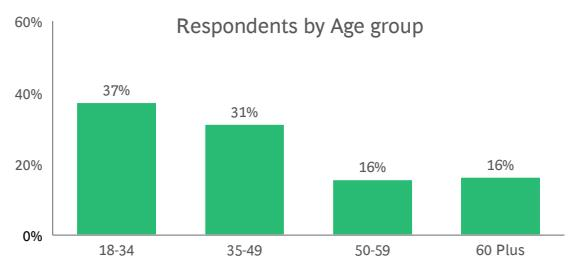

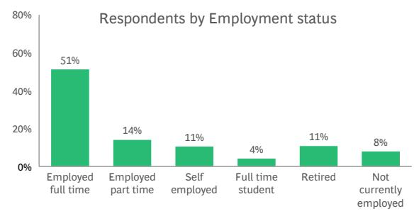

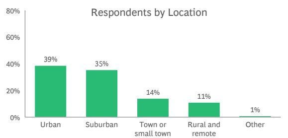

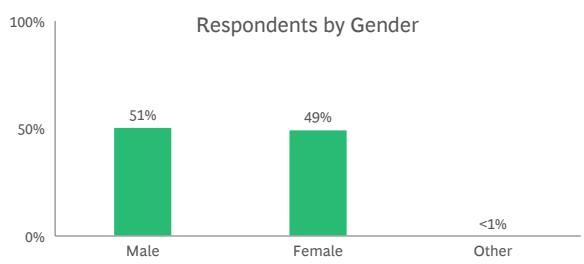  
Q. How old are you? Q. Which of the following best describes your current work status? Q. Which of the following best describes where you live? Q. Are you... 1. Male, 2. Female, 3. Other. Note: 1. Rounding to nearest whole numbers, totals may not add to $100\%$ . Source: 2024 BCG Digital Government Citizen Survey

27 online government services rated for usage and satisfaction  
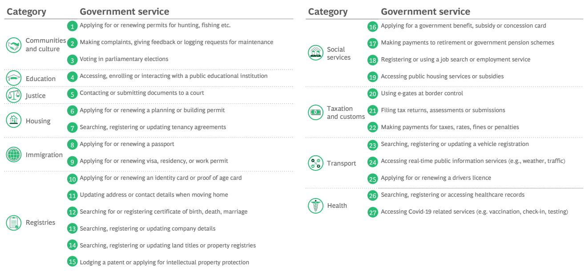  
Source: 2024 BCG Digital Government Citizen Survey

## Disclaimer

The purpose of this report is to provide general and preliminary information, and its contents should not be relied upon or construed as advice or similar. The contents of this report are disclosed in good faith, and subject to change without notice. The report contains BCG and Salesforce trademarks, confidential and proprietary information, and BCG and Salesforce retain all right, title and interest to its contents. The report does not contain a complete analysis of every material fact on the subject matter, and all warranties, representations and guarantees pertaining to the reliability, timelines, suitability, accuracy or completeness of its contents are expressly disclaimed. BCG and Salesforce, and their subsidiaries and affiliates, disclaim all liability relating to or arising from access, use or reliance on this report, including but not limited to direct, indirect, incidental, special or consequential losses arising from the information in this report, howsoever arising, including third party claims.

## Artificial Intelligence Disclosure Statement

This report includes images and content generated with the assistance of artificial intelligence (AI) technology and tools. However, the final outputs, concepts and insights are based on human expertise, judgment, input, interpretation and decision-making. For further inquiries regarding the AI technologies employed in this report or for additional details on the methodology, please contact us.

© Boston Consulting Group, Inc. 2024. All rights reserved.

For information or permission to reprint, please contact BCG at permissions@bcg.com.

## BCG ×

salesforce