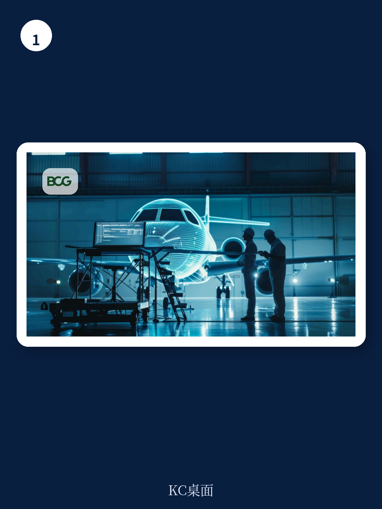

# 波士顿咨询：国防航空出勤率问题-AI可助力修复

全球军事冲突形态正在快速演变，但一个老问题始终未解：各国空军主力战机的任务出勤率长期徘徊在低位。波士顿咨询这份报告给出了几个具体数字——美国、法国、德国的战机任务可用率常规性低于70%；英国2024年F-35机队中，仅三分之一具备完全任务能力。这些数据背后，是持续增加的维护人员、备件库存和基地维修投入，但效果有限。

报告的核心判断是：问题不在投入规模，而在流程效率。AI不是锦上添花的工具，而是重构维护与保障体系的关键杠杆。波士顿咨询从三个具体方向拆解了AI如何改变现状，每个方向都指向一个可量化的改善路径。

## 1. 生成式AI正在解决维护人员“经验断层”这个硬约束

战机出勤率低的一个直接原因是合格维护人员不足。老一代技师经验丰富但陆续退休，年轻接替者面对分散在纸质手册、不同系统间的技术文档，现场排障效率极低。波士顿咨询指出，GenAI可以将所有技术信息整合到一个可交互的界面中，让经验不足的维护人员也能快速定位正确的维修流程，并准确列出所需工具和备件清单。这意味着，AI不是替代人，而是把“十年经验”压缩成一次查询。对于任何拥有复杂装备体系的组织，这个逻辑同样适用——知识管理才是效率瓶颈。

> **KC评论：** 报告没有展开的是，GenAI在军事维护场景中的部署门槛并不低——数据安全、文档数字化程度、网络环境稳定性，都是现实约束。但方向已经明确：谁先完成技术文档的结构化，谁就拿到了效率提升的入场券。

## 2. “备件不缺，缺的是能看见备件在哪”才是真实痛点

很多战机停飞并非因为备件短缺，而是因为备件“在某个角落但找不到”。波士顿咨询提出的“AI供应链控制塔”方案，核心是提升备件位置、订单状态和前置时间的可见性。这不是一个复杂的预测模型，而是用AI打通信息孤岛，让维护人员知道备件在哪、多久能到。报告隐含的判断是：军事供应链的摩擦成本远高于采购成本，而AI解决的是“最后一公里”的匹配效率。

## 3. 从“坏了再修”到“提前预判”，AI改变了维修节奏

报告第三个方向指向维修策略的根本转变。预测性维护可以提前识别潜在故障，让部队在飞机停飞前就安排好维修窗口、备件和人员。波士顿咨询还特别提到了“可靠性控制委员会”这个机制——用AI识别那些导致大量停飞天数的“长尾”零件和流程，然后反向推动供应商增产、与OEM沟通设计变更，甚至重新审视哪些强制检查是真正必要的。这个思路值得注意：AI不是只做预测，它还能帮助决策者质疑既有流程的合理性。

这份报告没有堆砌技术术语，而是用三个具体场景说明了AI如何解决真实问题。对于任何关注国防现代化或复杂装备管理的读者，核心启示或许不是技术本身，而是“效率提升的起点往往是信息整合，而非算法突破”。
