BCG

Executive Perspectives

## Driving Sustained Structural Cost Advantage with Applied AI

Cost Management

July 2026

## Introduction

The performance gap between AI leaders and everyone else is widening — and it is now visible in the P&L.

Companies at the forefront achieve three times greater cost reductions, 1.6 times higher EBIT margins, and 2.7 times the return on invested capital relative to peers. Yet only 5% of companies are generating AI value at scale, and 60% report no material gains despite substantial investment.

Depth of commitment to applied AI — the deliberate deployment of AI into core operations at scale — is what separates companies capturing structural value from those running disconnected pilots.

The firms pulling ahead concentrate Applied AI investment in their core, redesign processes from the ground up, and hold themselves to hard P&L targets — managing both the cost AI takes out and the cost it puts in.

This guide draws on BCG's work with clients across industries to help CFOs, CIOs, and CTOs cut through the noise on three questions:

\- Where and how should you invest in AI to realize value and reduce costs?

• What differentiates successful AI programs from those falling short?

• What does it take to activate change at scale and cash the check?

In this BCG Executive Perspective, we show how leaders achieve three times greater cost-out than peers, and reshape the P&L with applied AI.

## Executive summary | Drive sustained structural cost advantage with applied AI

## The performance gap is widening, and now visible in the P&L

While 82% of CEOs are more optimistic about AI's ROI than a year ago, only 5% of companies are generating AI value at scale, and 60% report no material gains despite substantial investment. Future-built companies achieve three times greater cost reductions, 1.6 times higher EBIT margins, and 2.7 times the return on invested capital relative to peers.

The pattern reflects a fundamental challenge. AI's primary impact is on productivity, an output concept, and translating productivity into cost requires deliberate action.

Five traps prevent most companies from making the translation: fragmented initiatives at insufficient scale, AI grafted onto existing processes amplifying low-value work, deep programs losing momentum without early proof points, investment stalling while waiting for certainty, and productivity targets set without matching cost targets.

## Depth of integration determines who wins — and reshapes the P&L along the way

Firms capturing structural value share one trait: they have embedded applied AI deeper into their operations. Value compounds as firms move from chatbots and copilots, which assist individuals on tasks through AI-powered workflows that automate predefined steps, to autonomous agents that complete full tasks end-to-end, and finally to multi-agent systems that run entire processes across functions.

Each wave shifts more deciding and acting from humans to AI, and cost-out compounds in the later waves as AI moves from executing steps to running decisions. Many firms remain in the first two waves and capture only a fraction of the available value.

Applied AI also reshapes the cost base. Labor and external spend decline as tech and consumption costs rise. CFOs who shape this shift deliberately turn applied AI into lasting advantage, those who do not, see savings on one line quietly absorbed by rising costs on another. Cost performance is now a function of applied AI maturity, and the gap between leaders and the rest is becoming structural.

BCG's experience with AI leaders across industries and functions reveals five management actions behind successful cost transformation:

## Five management actions translate applied AI into sustained structural cost advantage

\- Scale the core: Concentrate AI investment in your core capabilities. Scattered pilots across the periphery rarely reach the P&L.

\- Redesign processes around decisions, not tasks: Map decisions first, then automate around them—grafting AI onto existing task flows captures a fraction of the value

\- Fund the journey with traditional levers: Early wins from traditional levers, amplified by AI, create financial runway for deeper investment

\- Commit and accelerate: Have a clear business case, not a precise one. Waiting for full ROI certainty costs more than the tokens you save

\- Set hard targets and enforce them: Productivity gains do not reduce cost on their own. Set hard headcount targets and make new behaviors unavoidable.

## AI adoption and managing costs remain top priorities for CEOs, yet many companies are failing to translate investment into value

Top strategic priorities for 2026
Share of CEO responses

Manage costs and operational efficiency

65%

Accelerate AI, digital transformation, and innovation

62%

Drive growth and market expansion

59%

## CEO conviction on AI is rising ...

82% of CEOs are more optimistic about AI's potential for ROI than a year ago

## 72%

say they are the main decision maker on AI in their organization, twice that of last year

## ... but intent is not translating to value.

## 60%

of companies are not achieving material value from AI at all, despite significant investment

## Linking AI adoption to cost reduction is harder than it appears. Five traps prevent most companies from translating AI into structural cost advantage

In 2026, AI investment is projected to double $^{1}$ , yet 60% of companies are not achieving material value from AI $^{2}$

AI's primary impact is on productivity, enabling people to create more, faster. This is fundamentally an output concept, not a cost one

Translating productivity into savings requires deliberate, structural action

1. BCG Build for the Future 2025 Global Study (n=1250); 2. BCG AI Radar 2026 Survey (n=2360)

## Too many fragmented initiatives, not enough scale

Siloed AI efforts with no path to enterprise-wide deployment means efficiency gains go unaccounted for and the business case quietly disappears

## AI grafted onto existing processes amplifies low-value work

Automating activities that should first be eliminated or consolidated makes the wrong work faster — output multiplies, but the cost structure stays intact

## Deep AI programs lose momentum without early proof points

Long-horizon efforts that take years to deliver lose support along the way. Skepticism builds, funding tightens, and programs are scaled back before they reach maturity

## Investment stalls waiting for certainty

Companies slow or defer AI investment until ROI is fully proven. By the time the business case is airtight, the gap with leaders has already widened

## Productivity targets are set, cost targets are not

AI programs are measured on efficiency and adoption rates, not on P&L outcomes. Without hard headcount targets and behavioral reinforcement, savings remain on paper

## Avoiding these traps is what defines the firms capturing structural value

## What was incremental is becoming structural.

By redesigning where and how cost is created, top adopters are building an advantage that compounds over time. Savings fund the next wave of capability, raising the bar for everyone else

Cost performance is now a function of AI maturity

What the top adopters are achieving versus peers  
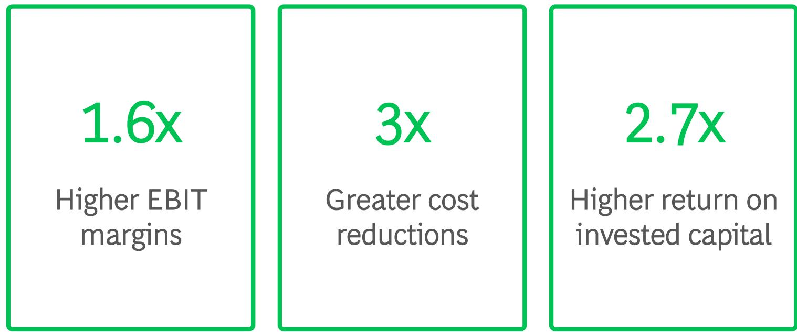

Greater cost reductions

Higher return on
invested capital

"Future-built" companies vs "stagnating" and "emerging" laggards $^{1}$

## The investment gap is widening. Future-built companies are doubling down and reaping compounding returns

## What an AI transformation costs Firms are exponentially expanding investments in AI...

Investment in AI as share of an organization's revenue $(\%)$

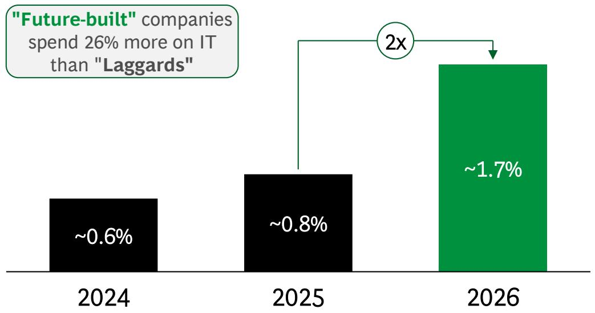

## What an AI transformation returns ...with trailblazers reaping outsized returns

2024 realized % gain in revenue/savings AI delivered, measured where AI investment is concentrated

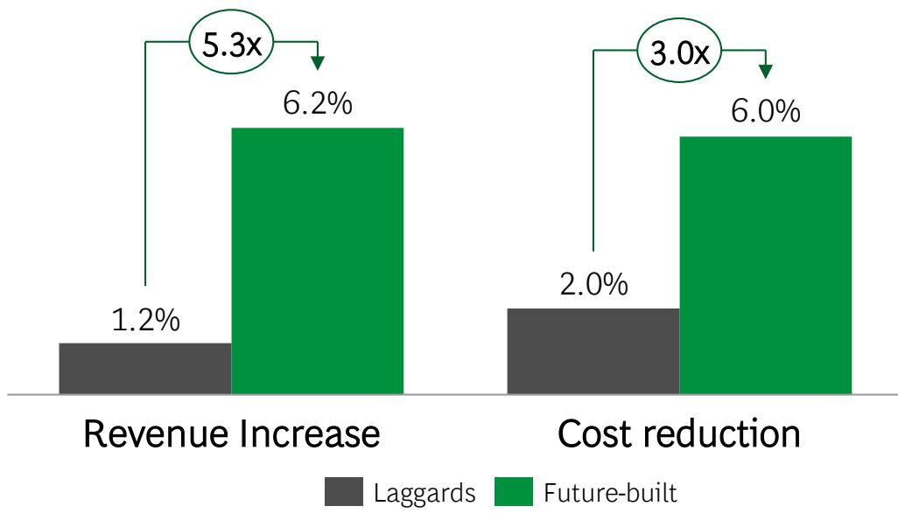

Future-built players deliberately allocate significant investments beyond technology toward structural elements, including talent, upskilling, org, etc.

Note: AI Investments refer to all investments needed to realize the benefits from AI, including but not limited to, technology and infrastructure, data and architecture enablement, talent and upskilling, external partners, etc.; Sources: BCG AI Radar 2026 Survey (n = 2,360), BCG AI Radar 2025 Survey (n = 1,803); BCG AI Radar 2024 Survey (n = 1,406), BCG Build for the Future 2025 Global Study (n = 1,250), BCG analysis, AI players defined as "Future-built" vs "stagnating" and "emerging" laggards across 41 AI maturity dimensions. Revenue increase and cost reduction are calculated as a percentage of annual revenue through AI efficiency gains in areas where AI is applied.

## Winning with applied AI goes beyond productivity. The structural prize lies in reshaping your core, not just deploying AI at the edges

## DEPLOY off-the-shelf AI solutions in everyday tasks to realize 10% to 20% individual productivity gains

Broad enterprise-wise productivity:

\- Meeting summary

\- Notes drafting

\- Dashboarding

\- Calendar management

\- Data wrangling

## RESHAPE critical functions for 30% to 50% enhancement in efficiency and effectiveness

E2E process and workflow reinvention for productivity/quality improvement:

\- Marketing

\- Customer Service

\- Field Technicians

• Tech/Software Development

• R&D

\- Back-office operations

Critical for sustained
structural cost advantage

## INVENT new products and services to build long-term competitive advantage

New value propositions, revenue streams:

• Reinvented customer experience

\- Data monetization

\- AI-powered services

\- AI in products

\- Hardware to software

## How deeply you reshape your core offerings drives structural cost advantage. Most firms remain far from the frontier

Each wave shifts more deciding and acting from humans to AI:

\- Chatbots and copilots: AI assists; humans do the work

• AI-powered workflows: AI executes predefined steps

• Autonomous agents: AI chooses its own path within set boundaries

\- Multi-agent systems: multiple agents coordinate to run entire processes

Cost-out compounds in Waves 3 and 4, as AI moves from executing steps to running decisions

Value disruption

Majority of players operate here

Majority of value captured here

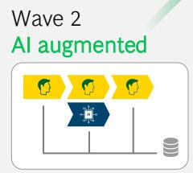

Wave 1 Chatbots

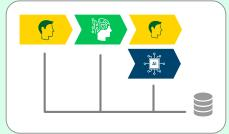

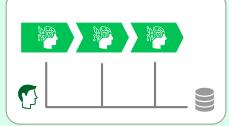

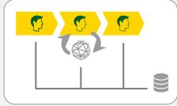

Span of technology

<table><tr><td>Technology</td><td>Chatbots/Copilots</td><td>AI-powered workflows</td><td>Autonomous Agents</td><td>Multi-Agent Systems</td></tr><tr><td>Scope</td><td>Single task for individual users</td><td>Single function, select process segment</td><td>Single function, end-to-end process</td><td>Entire operating system enterprise wide</td></tr><tr><td>Organizational change</td><td>Minimal, same roles, new tools</td><td>Moderate, some changes to roles</td><td>Significant, new roles and governance</td><td>Full redesign</td></tr><tr><td>Advantage Type</td><td>Individual productivity</td><td>Speed and quality in a process</td><td>Process automation and cost-out</td><td>Structural cost advantage</td></tr></table>

Magnitude of Value

Human executing

AI supported

Data flow

Data

AI augmented

AI agent executing #

Human-led / oversight

## AI's integration in an organization and impact on the P&L is determined by how it reshapes work and demand for labor

## Productivity gains expand labor demand $^{1}$

AI replaces core task execution and unlocks talent demand

Insurance sales agents,
IT support technicians

## AI Substitutes Human Labor

## AI substitutes for routine work while demand remains bounded

Call center representatives,
financial analysts

Future
cost base

AI augments human capabilities, lowered costs expand market demand
Software engineers, lawyers, procurement teams

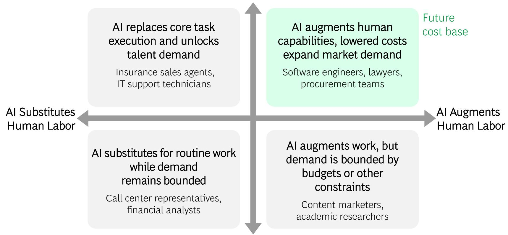

## AI Augments Human Labor

AI augments work, but demand is bounded by budgets or other constraints
Content marketers,
academic researchers

As AI improves productivity and substitutes routine human labor at scale, companies' cost base will shift toward supporting high productivity, high value work where AI augments human labor

Productivity gains saturate labor demand $^{1}$

1. Measured by whether AI-driven reductions in unit cost or cycle time (industry-level price elasticity) unlock additional output (US job openings and turnover)
Note: For BCG's latest perspective on how AI will reshape the job market, refer to https://www.bcg.com/publications/2026/ai-will-reshape-more-jobs-than-it-replaces?

## AI unlocks cost reduction across every P&L line. Quick wins in Wave 1 and 2 can help fund the journey

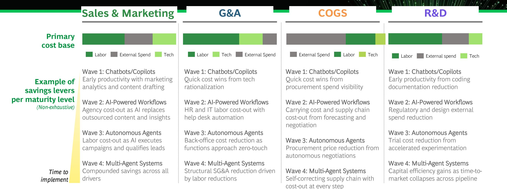

Quick wins start in Wave 1 and 2 — procurement spend visibility, marketing content, help desk automation, and engineering productivity typically deliver value in under six months and fund the deeper journey

<table><tr><td rowspan="2">Exemplary high impact workflows (Non-exhaustive)</td><td>Content creation and localization pipelineAI drafts, adapts, and localizes campaign content across markets, replacing agency production</td><td>Finance transaction processingAI automates invoice matching, duplicate-payment checks, reconciliations—driving zero-touch transaction processing</td><td rowspan="2">Spend-baseline and category strategyAI structures PO data into full category transparency. Balances forecast and inventory to avoid stock-outsSupplier negotiation at scaleAI generates and runs negotiation letters across the long-tail supply base</td><td rowspan="2">Drug candidate screening and library expansionAI screens over a billion compounds, expanding the viable drug library 100xR&amp;D portfolio and spec rationalizationAI surfaces highest-confidence modifications, eliminating manual search and GTM effort</td></tr><tr><td>Campaign analytics and lead qualificationAI sets targeting, allocates media spend, and qualifies leads in-flight</td><td>HR and IT help desk resolutionAI agents resolve tier 1 tickets end-to-end—access, payroll, and benefits queries</td></tr><tr><td>Value lever</td><td>Staff productivity, campaign ROIExternal (agency) spend</td><td>Process throughput/accuracyLabor spend (back-office FTE)</td><td>Negotiation coverage, wastage reduction↓Inventory and landed cost</td><td>Throughput/drug library breadthCycle time and trial cost</td></tr><tr><td>Tangible impact1</td><td>20%-40% time savings in brand performance reporting2x quality uplift on concept designs</td><td>~15%-30% of OPEX cost-out using AI</td><td>2%-3% additional savings through AI-assisted negotiations3x-4x faster processes and decision cycles</td><td>40%-50% faster cycle time20% molecular synthesis cost-out</td></tr></table>

## AI-native workflows are the primary cost-out drivers across the P&L

## Sales & Marketing

## G&A

## COGS

## R&D

Redesign, not retrofit: AI-native workflows deliver cost-out and free capacity for higher value judgment-led work.

## At maturity, the value at stake is significant and delivers structural cost advantage but demands sustained commitment

At maturity, the north star is a step-change cost-out across every P&L line.

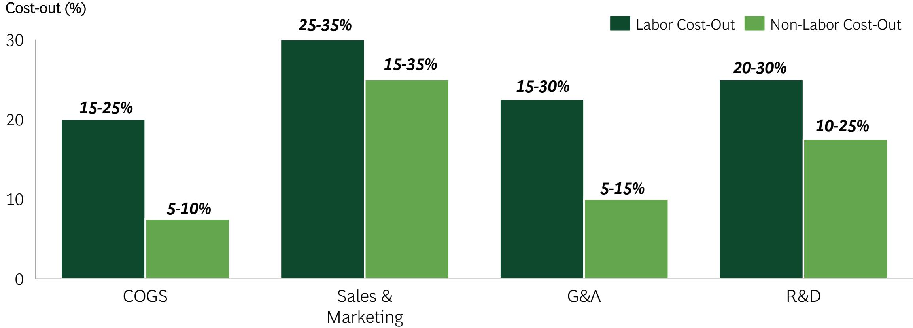  
Sources: BCG POP.X Bionic Workforce Analysis estimated FTE cost-out potential; ranges reflect weighted average across functions mapped to each P&L line. Non-FTE cost-out per BCG case experience across procurement, supply chain, agency spend, and external R&D. Savings apply to addressable spend categories within each P&L line and results vary significantly by industry and cost structure. Ranges reflect full-maturity potential; few firms have yet captured the full value.

## Applied AI structurally reshapes the P&L. Deliberate management determines whether total cost falls

## Example P&L impact

## Consumer Packaged Goods

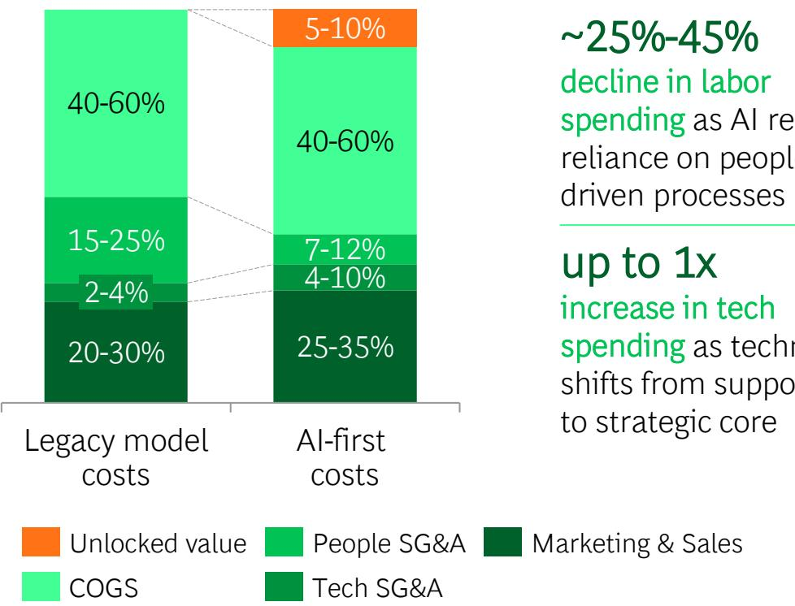

## Illustrative and directional

## \~25%-45%

decline in labor spending as AI reduces reliance on people-driven processes

## up to 1x

increase in tech spending as technology shifts from support role to strategic core

## COST-DOWN

## Cost-down requires headcount discipline

Productivity gains do not reduce cost on their own. A directional FTE or role-count target, tracked through the transformation, is what converts efficiency into P&L impact.

## COST-UP

Forecast and budget consumption before it materializes
Token, compute, and AI infrastructure costs are variable and scale with adoption. They should be forecast at the use-case level and built into the operating budget from the start.

## COST-REDEPLOYED

Decide whether freed capacity exits the P&L or funds growth Capacity released by AI can be removed from the cost base or redeployed to growth priorities. Both are legitimate. Combining them implicitly is the most common reason cost programs underdeliver.

## COST ATTRIBUTED

## Match AI costs to the functions capturing the benefit

If AI spend lands in a corporate IT bucket while gains accrue to business units, the management system loses sight of true ROI and demand decisions slip. Costs should sit where the value is created.

## Five key success factors to translate applied AI into long-term structural cost advantage

## Scale the core: concentrate applied AI where you compete

## Redesign processes around decisions, not tasks

## Fund the journey with traditional levers

## Commit and accelerate. Hesitation costs will compound

## Set hard targets and enforce them

Concentrate AI investment in your core capabilities. Scattered pilots across the periphery rarely reach the P&L.

Map decisions first, then automate around them. Grafting AI onto existing task flows captures a fraction of the value.

Early wins from traditional levers, amplified by AI, create the financial runway for deeper AI investment.

Have a clear business case, not a precise one. Waiting for full ROI certainty costs more than the tokens you save.

Set hard headcount targets and make new behaviors unavoidable. Efficiency percentages do not pay the bills.

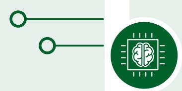

## 1 Scale the core: Concentrate applied AI investment where it protects and extends your competitive advantage

Core skill
High competitive impact

Embed AI Deep

You own it and it's
where you win.
Scale AI to
maintain
competitive edge

core product, key
customer experience

Non-core skill
High competitive impact

Buy
Best in Class

High stakes but it's not your edge. Buy the best available and swap out as better options emerge

CRM, procurement platforms

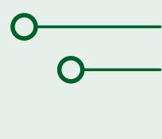

Core skill
Low competitive impact

Layer AI on to traditional levers

You own it, but it's not your edge. De-layer or outsource and then layer AI on top

back-office ops, field service

Non-core skill
Low competitive impact

Deprioritize

Neither competitive and important nor something you own. Use what the vendor offers and move on

facilities,
internal comms

## Where to scale

Don't scatter AI.
Concentrate investment
on core competencies to
protect and extend
competitive advantage.

## How to scale

Scaling the core means looking left and right, not within functional silos. Value is at the cross-functional hand-offs not within a single function

## 2 Reduce and consolidate activities first, then redesign processes around decisions

Step 1: Reduce and consolidate before you AI-enable.

Triage every activity for value before automating. A custom activity-based outcome (ABO) review rates each activity on the value of its output, and flags those that AI would amplify in volume, not in value.

## √ √ √

Step 2: Redesign around decisions, not tasks. Identify where real judgment happens and where humans lead, then automate everything around the decision: data gathering, routing, approvals, exceptions, reporting.

## Example: Marketing

## Automated Inputs

Consumer and market data
AI-aggregated insights and trend synthesis

Campaign proposal
AI-generated business case

## Core Decision Approve campaign concept and budget allocation?

## Automated Outputs

## Content Creation AI-generated

## Performance reporting

AI-generated reports and optimization recommendations

## Cross-Functional Unlock

Apply this logic across multiple functions: sales (lead prioritization), supply chain (demand planning), and R&D (concept development) to unlock faster, leaner commercial execution at scale.

## 3 Early wins from traditional levers create the financial runway for deeper AI investment

## Quick wins from AI applied to traditional levers fund the AI journey

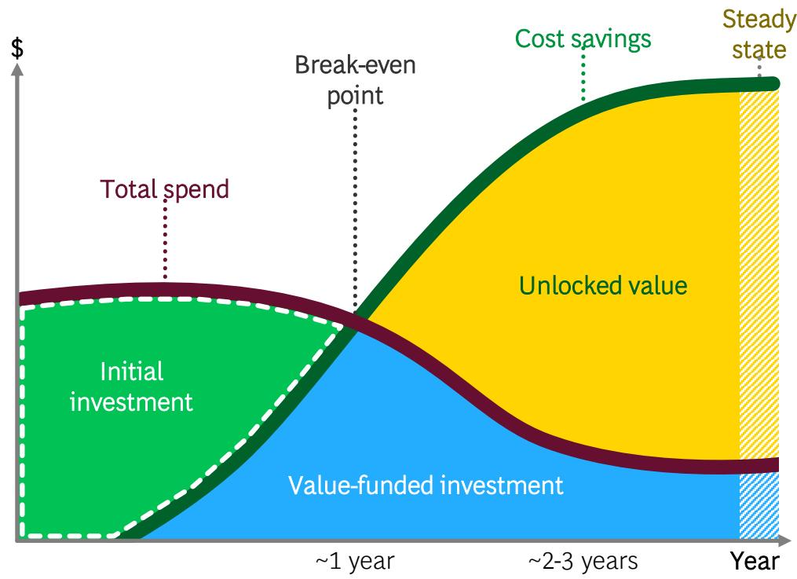

## Traditional Levers

Traditional levers, amplified by AI, can generate the early run-rate savings needed to fund additional AI investment, building momentum, freeing up funds, and unlocking resources. Examples include:

\- Procurement and supplier review—5%–25% savings in 3 to 6 months. AI accelerates spend baselining, supplier negotiation at scale (including the long tail), and specification rationalization.

\- Organization redesign—10%–17% savings in 6 to 12 months. A hard look at activities, reports, and approvals—what to kill, what to consolidate, what to AI-enable—so freed capacity exits the P&L rather than being reabsorbed.

## Value-funded

Run-rate savings from initial investments can be reinvested into continued transformation journeys with payback after two to three years.

## Case Example 1 – Sales and Marketing | A global CPG used AI to transform its marketing operating model with to drive cost savings and growth

## Context

A global CPG company sought to drive growth and competitive advantage through a multi-year enterprise AI transformation.

The company began by attacking the core: marketing, where low-value, repetitive tasks consumed significant time.

The company built a custom platform early with a disciplined approach of investing progressively and tracking impact rigorously, and has since used that foundation to expand into broader functions.

## Actions taken

## Redesigned marketing workflows end to end using a custom-built AI platform:

\- Conducted a time and motion study across tasks to identify the highest-value opportunities across marketer tasks.

• Built proofs of value, piloting use cases with human control groups before scaling.

\- Compiled data sources to power insights, enabling faster product concept development

\- Automated content localization and adaptation across markets.

\- Invested in training and change management to drive adoption with leadership buy-in.

\- Expanded capabilities into additional functions (through 2026), with 2,000+ across R&D and marketing already trained.

## Impact

## Double Digit

P&L efficiency gains in marketing

## 30%

Up to

Faster creative asset adaptation

Better quality
innovation concepts

## 20%-40%

Time savings on brand performance reporting

## Case Example 2 – General and Administrative | A global technology company reduced operating costs through AI back-office transformation

## Context

A major global technology company launched a program to reduce annual operating costs and reinvest savings into growth.

Back-office functions were characterized by fragmented systems, repetitive transactional work, and heavy reliance on custom IT infrastructure.

The transformation targeted three levers:

• G&A process redesign

\- IT rationalization

• Third-party spend optimization

## Actions taken

## Pursued end-to-end back-office transformation combining traditional levers, process redesign, and AI at scale:

\- Started with traditional levers (offshoring, contract renegotiation) to build early momentum and accelerate AI-enabled growth.

\- Applied Eliminate, Simplify, Automate framework across every function with no protected processes, ensuring workflows were rebuilt, not retrofitted, around AI.

\- Launched AI pilots across G&A functions with ambitious, pre-aligned success metrics, advancing only those with a clear path to P&L impact.

\- Tracked realization through a rigorous PMO, anchored by direct CEO accountability, with 90-day pilot reviews.

## Impact

30% annual OPEX savings on \$15B cost base

## \~50%

Cost-out from AI-enablement

Activities automated
across back-office
functions

## Case Example 3 – Cost of Goods Sold | A global food and beverage company used AI to accelerate a procurement-led cost transformation

## Context

A food and beverage company with a global footprint and thousands of suppliers set a bold ambition to accelerate growth.

A global cost transformation was set up to find efficiencies to reinvest in brands, products, and innovations.

AI was deployed as the key accelerator to unlock savings that would have been too time-consuming or low-ROI to pursue manually.

## Actions taken

## Deployed AI across the source-to-pay process to unlock savings at speed and scale:

\- Applied AI to build and analyze spend baseline of unstructured purchase order data to establish full category transparency.

\- Long-tail supplier value captured through AI-generated negotiation letters at scale.

\- Leveraged AI to identify historical overpayments, early payments, and working capital leakage across supplier contracts.

\- Used AI to consolidate 100,000+ line items of technical specifications across manufacturing, enabling large-scale rationalization.

## Impact

## \$900M

Total cost-out
delivered

## 3,500+

Supplier negotiations
completed in <100 days

## \~2%-3%

Average savings per AI-assisted negotiation

## Case Example 4 – Research and Development | A global pharma company used AI to reimagine its small-molecule drug discovery workflow

## Context

A global pharma company faced mounting pressure to reduce R&D costs and accelerate time to market across its small-molecule pipeline.

The classic process was slow and manual, given data and capacity constraints, extending optimization cycles.

The company partnered with BCG to redesign its drug discovery workflow end to end, deploying AI at every stage from candidate identification through lead optimization.

## Actions taken

## Deployed AI across the drug discovery workflow to replace manual processes and compress cycle times:

\- Used AI to screen over 1 billion compounds, focusing investment on core drug discovery, and expanding the viable library 100x.

\- Applied AI to analyze over 500 million molecule modifications, surfacing highest-confidence changes and eliminating manual search time.

\- Built end-to-end pipeline with AI-powered algorithms to optimize drug candidates across efficacy and safety properties and reduce cycle time.

\- Deployed AI-integrated lab robotics to redesign the discovery loop, feeding experimental results back into the model with minimal manual intervention.

## Impact

## 40-50%

Cycle time
acceleration across
discovery

## 20%

Molecular synthesis reduction for cost-out

100x

Expansion of viable drug candidate library

## BCG experts | Key contacts for driving sustained structural cost advantage with AI

## Americas

  
Managing Director and Senior Partner Washington D.C.

  
Kevin Kelley
Managing Director
and Senior Partner
Dallas

Paari Rajendran
Managing Director
and Partner
San Francisco

  
Geraldine Rhodes
Managing Director
and Partner
Washington D.C.

  
Laverdiere
Managing Director
and Partner Houston

  
Paul Goydan
Managing Director
and Senior Partner
Houston

  
Dylan Bolden
Managing Director
and Senior Partner
Dallas

  
Matt Marchingo
Managing Director
and Partner
Houston

  
David Martin
Managing Director
and Senior Partner
Dallas  
Abhinav Verma
Managing Director
and Partner
San Francisco

  
Paolo Vicino
Managing Director
and Partner
New Jersey

## Europe, Middle East, and Africa

  
Nicolas De Bellefonds
Managing Director
and Senior Partner
Paris

## Asia-Pacific

  
Kosuke Uchida
Managing Director and
Senior Partner
Nagoya

  
Olivier Bouffault
Managing Director and
Senior Partner
Paris

  
Romain de Laubier
Managing Director and
Senior Partner
Singapore

  
Jacopo Brunelli
Managing Director and
Senior Partner
Milan

  
Michael Grebe
Managing Director and
Senior Partner
Munich

  
Jeff Walters
Managing Director and
Senior Partner
Singapore

  
Alex Dolya
Managing Director and
Senior Partner
Singapore

## BOG