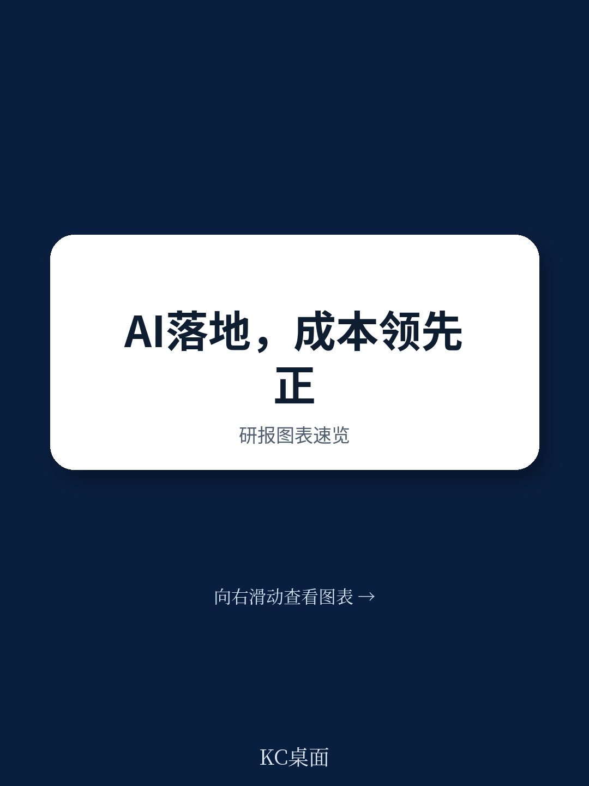
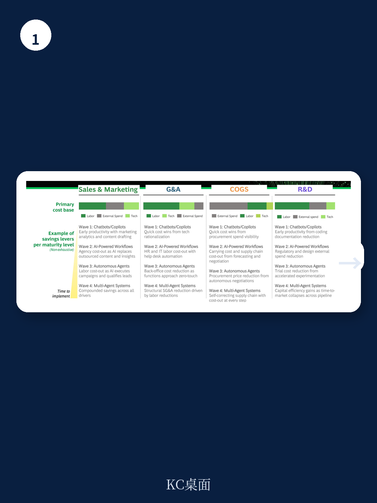
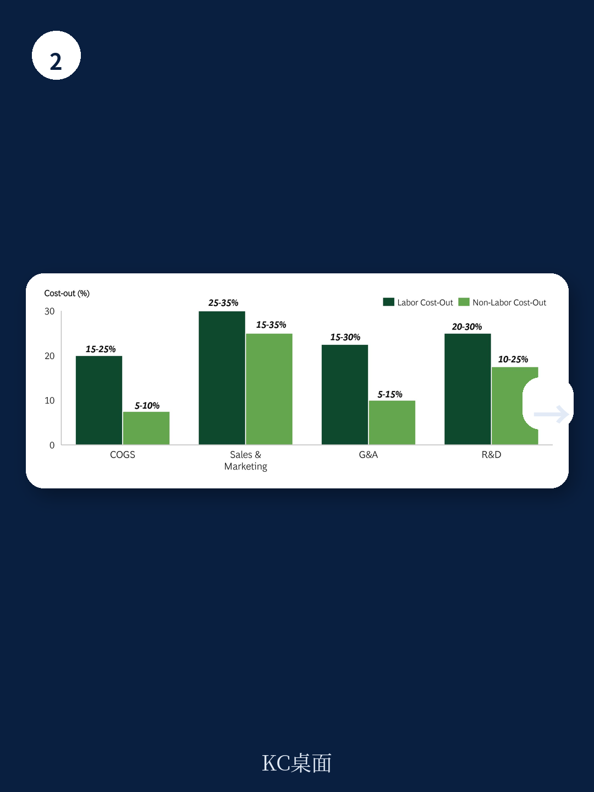

# 波士顿咨询：AI优先的结构性成本削减路径

只有5%的公司正在规模化地通过AI创造价值，而60%的公司尽管投入巨大，却未获得实质性收益。波士顿咨询这份报告的核心判断是：AI领先者与追赶者之间的绩效差距正在扩大，并且已经清晰反映在利润表中。领先公司实现的成本降幅是同行三倍，EBIT利润率高出1.6倍，投入资本回报率高出2.7倍。

问题不在于是否研究AI，而在于AI是否被深度嵌入核心运营。报告识别出五个常见陷阱：碎片化试点无法规模化、AI被嫁接在低效流程上放大无效工作、长期项目因缺乏早期验证而失去动力、研究因等待确定性而停滞、以及只设定效率目标而不设定成本目标。这些陷阱解释了为什么多数公司无法将AI投入转化为结构性成本优势。

## 1. 整合深度决定成本优势能否从临时性变为结构性

波士顿咨询将AI应用分为四个递进阶段：聊天机器人和副驾驶、AI驱动的工作流、自主代理、以及多代理系统。多数公司停留在前两个阶段，只捕获了可用价值的一小部分。成本优势在第三和第四阶段才真正显现，因为AI从执行步骤转向运行决策，价值创造方式发生了质变。

报告认为，成本绩效现在已经成为AI成熟度的函数。领先者与追赶者之间的差距正在变得结构化——先发者节省的成本会持续投入下一轮能力建设，从而不断抬高竞争门槛。这种自我强化的循环意味着，起步较晚的公司追赶成本将越来越高。

> **KC评论：** 波士顿咨询的四个阶段框架提供了一个实用的自检工具。多数企业可以对照判断自己处于哪个阶段，以及下一阶段需要什么样的组织变革。关键不在于技术选型，而在于是否愿意重新设计流程和角色。

## 2. 利润表正在被AI重塑：劳动力成本下降，技术支出上升

AI对利润表的影响不是单向的。报告以消费品公司为例，劳动力支出可能下降25%-45%，但技术支出可能增长近一倍。CFO如果只盯着单一线条的成本削减，可能看到节省被另一端的成本上升悄然吸收。

这种结构性变化要求管理层同时管理“AI带走的成本”和“AI带来的成本”。报告特别强调，生产率提升不会自动转化为成本下降。只有设定硬性的员工人数或岗位数量目标，并通过行为强化使其不可回避，才能将效率提升转化为实际的利润表影响。

## 3. 五个管理动作决定AI成本转型成败

基于与各行业AI领先者的合作经验，波士顿咨询提炼出五个关键管理动作。第一，将AI研究集中在核心能力上，而不是分散在外围试点。第二，围绕决策而非任务重新设计流程——将AI嫁接在现有任务流上只能捕获一小部分价值。第三，用传统杠杆的早期成果为AI转型提供资金，形成财务缓冲。第四，明确商业案例而非追求精确——等待完全确定性的ROI，代价远大于节省的算力成本。第五，设定硬性目标并强制执行。

报告中的案例提供了具体参照：一家全球消费品公司通过将AI部署到采购到付款的全流程，在不到100天内完成超过3500次供应商谈判，实现9亿美元总成本削减。一家全球制药公司将AI应用于小分子药物发现，将筛选化合物库扩大100倍，同时将发现周期缩短40%-50%。

这些案例的共同点是：AI不是被当作一个独立项目，而是被嵌入到核心业务流程中，并且管理层从一开始就设定了可衡量的成本目标。波士顿咨询认为，这才是将AI研究转化为结构性成本优势的关键路径。
