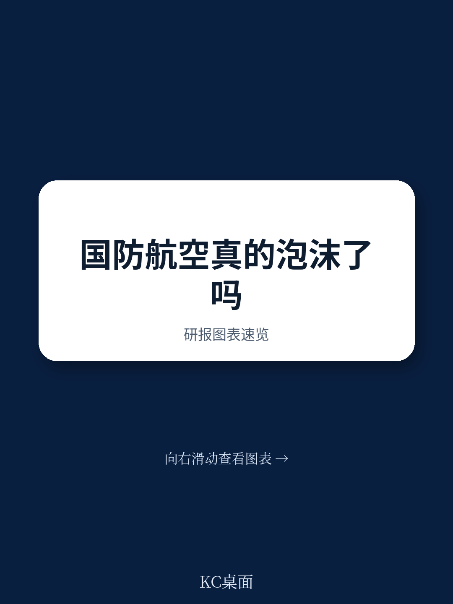
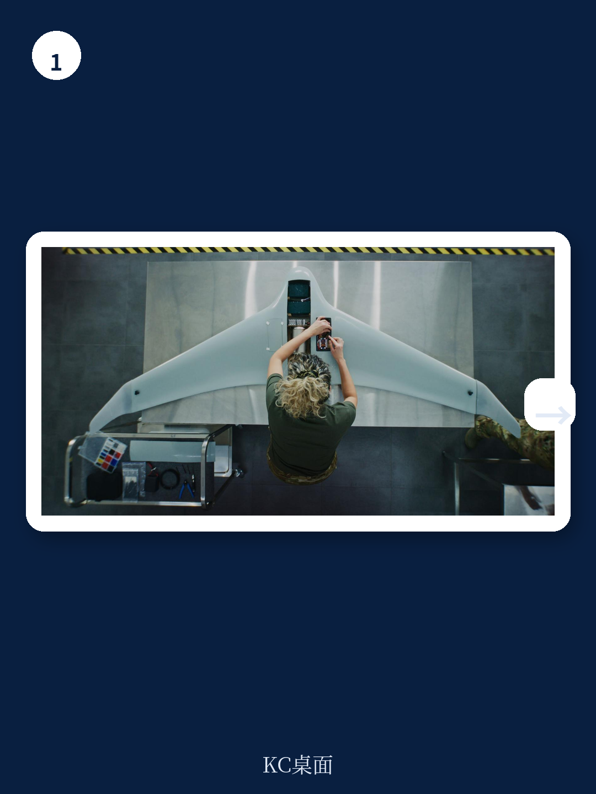
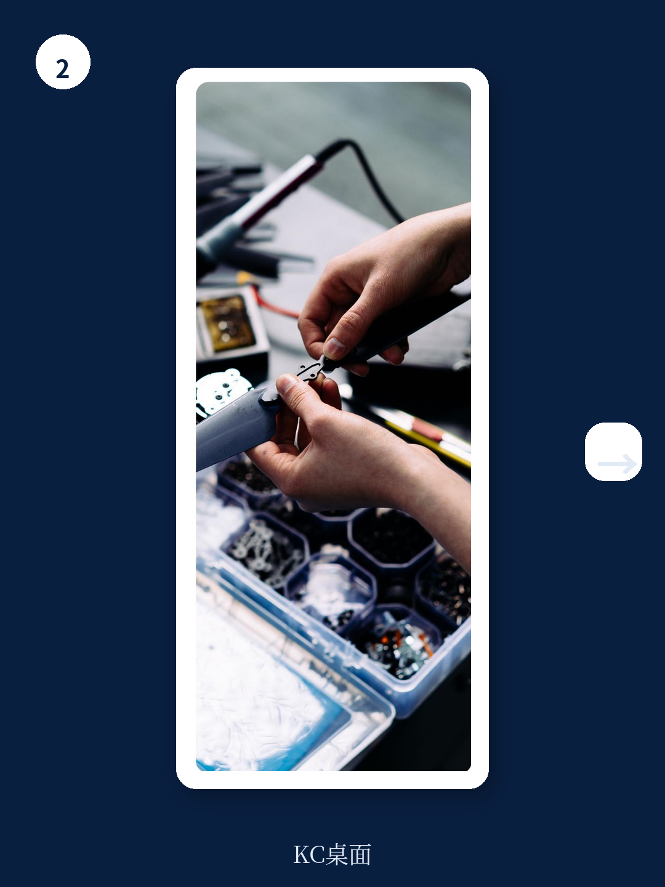

# 波士顿咨询：国防科技泡沫的利润结构分析

过去两年，大量资本涌入“便宜、可消耗”的国防航空技术——无人机、巡飞弹、低成本可消耗飞行器。媒体和研究圈都在问同一个问题：传统军工巨头会不会被颠覆？波士顿咨询与Vertical Research Partners联合发布的分析给出了一个反直觉的判断：新赛道的增速确实惊人，但利润池的结构决定了，传统平台在未来十年仍将占据超过80%的市场份额，且利润的可持续性远优于新玩家。

这份报告的核心价值不在于预测泡沫与否，而在于它拆解了不同类别国防航空技术的利润来源、供应链深度和研发不确定性分配。它提醒决策者：增长率和利润率是两个维度，而利润的“形状”——是一次性销售还是数十年持续服务——才是决定长期回报的关键变量。

## 1. 新赛道增速是传统平台的10倍以上，但基数决定了天花板

报告将国防航空技术分为三类：精尖系统（如F/A-18战斗机）、可负担量产系统（如协作作战飞机）、可消耗系统（如巡飞弹）。2025年，精尖系统在美国和欧盟的采购收入约为650亿美元，可负担量产系统约50亿美元，可消耗系统仅5500万美元。到2033年，精尖系统预计年增长2%-3%，可负担量产系统增长15%-20%，可消耗系统增长35%-40%。

但即便以这样的增速，精尖系统到2033年仍将占据市场超过80%的份额。原因很简单：新赛道从极小的基数起步，高速增长无法在绝对规模上撼动传统市场。这不是一个“颠覆”的故事，而是一个“补充”的故事。

> **KC评论：** 这张增长曲线图很容易被误读为“新赛道即将主导”。报告的核心提醒是：增长率高不等于利润池大。决策者应该关注的是绝对利润规模，而非相对增速。

## 2. 精尖系统的利润来自数十年服务，可消耗系统只有一次性销售

报告以F/A-18E/F“超级大黄蜂”和AeroVironment的Switchblade 300巡飞弹为例，对比了两种平台的利润结构。精尖系统在整个生命周期中，约一半的利润来自后续的维护、备件和升级——超级大黄蜂的终身项目收入约203亿美元，其中维护部分超过100亿美元。这意味着，即使国防预算在和平时期大幅削减，传统军工企业仍能通过存量平台的维护服务维持收入。

可消耗系统则完全不同：几乎全部利润来自初始生产和采购。后续维护仅限于战前准备、软件更新和少量备件。一旦采购合同结束，利润流就基本中断。这种利润结构使得新玩家对国防预算波动的敏感度远高于传统巨头。

报告还指出，精尖系统的供应链更深更长——一级供应商（发动机、传感器、通信系统）可以独立于平台主承包商，捕获40%-50%的生命周期利润。而可消耗系统的供应链更浅，价值集中在拥有平台知识产权和独家生产能力的企业身上。这些企业目前大多缺乏通过复杂合规认证的经验，难以向上渗透到更大型的合同。

## 3. 研发不确定性从政府转移到了企业，这是新赛道最容易被忽视的变量

传统精尖系统的研发通常是政府出资的成本加成合同，企业承担的不确定性有限，但利润上限也受到约束。可负担量产和可消耗系统的研发则主要由企业自筹资金——通常依赖不确定性研究或私募资本。这意味着，如果产品成功，企业拥有知识产权并成为独家供应商，利润空间更大；但如果失败，企业承担全部损失。

这种不确定性转移对传统军工巨头而言是一个关键考量。它们习惯了稳定的政府资助研发模式，要进入新赛道，就必须接受更高的研发不确定性、更短的开发周期和更低的单机利润。报告认为，传统企业的最佳策略不是全面转型，而是将新业务作为补充组合的一部分——通过设立独立损益单元、采用不同的运营模式和采购渠道，在核心业务之外探索新市场。

## 4. 和平时期的客户关系是新玩家无法复制的护城河

传统军工企业在和平时期仍然与客户保持紧密联系——因为精尖系统需要持续的维护、培训和升级支持。它们通常在客户基地设有常驻团队。新玩家没有类似的客户关系基础，除非其技术也能用于非军事任务（如边境巡逻、关键基础设施保护），但这些通常属于不同的政府客户。

这意味着，传统企业的收入在和平时期更稳定，对国防预算增长的依赖度更低。而新玩家的收入高度依赖采购合同，一旦预算调整，面临的不确定性更大。

这份报告的价值在于，它没有停留在“新赛道增速快”的简单叙事上，而是深入拆解了利润池的结构性差异。对于传统军工企业，核心问题不是“要不要进入新市场”，而是“如何在不损害核心业务的前提下，以组合方式参与”。对于读者，关键判断不是“哪个赛道增长更快”，而是“哪个赛道的利润更可持续、不确定性更可控”。

For informational purposes only. Portions may be generated,translated,summarized,or edited with AI assistance based on source materials and may contain omissions or errors. Please verify independently. This is not investment,legal,tax,accounting,or other professional advice.

