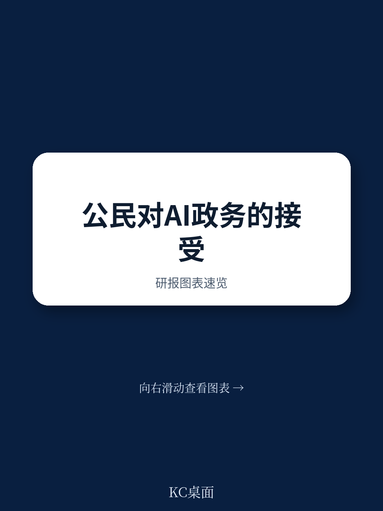
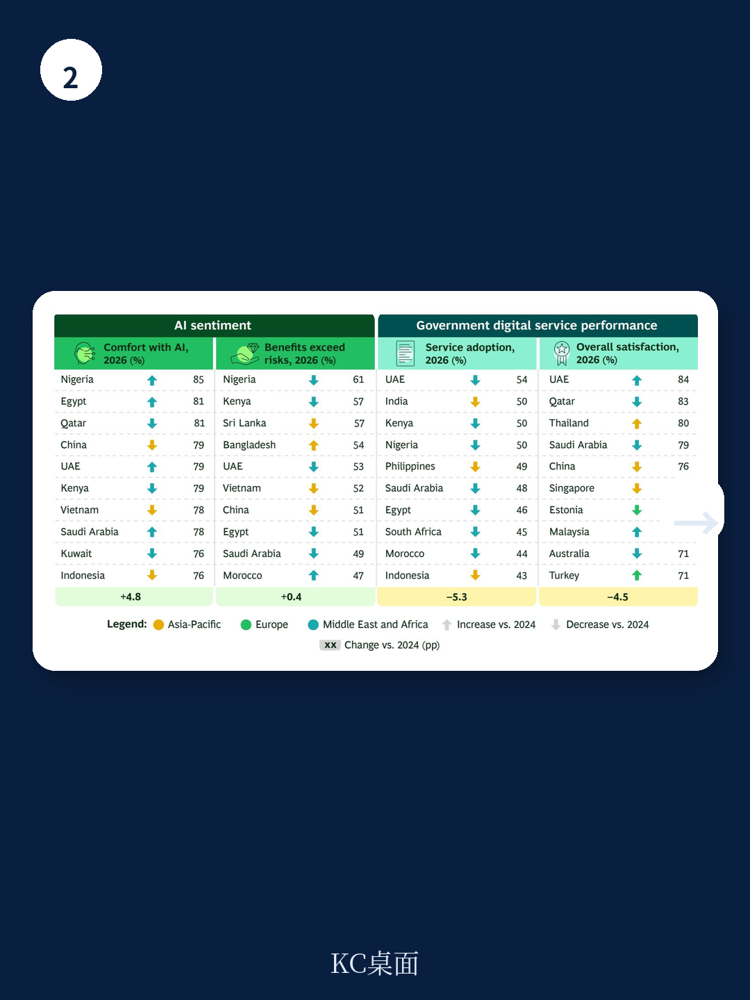

# 波士顿咨询：公民对公共AI服务持开放态度

波士顿咨询2026年全球数字政府公民调查覆盖88%的OECD国家、代表全球70%人口，其核心发现是：过去十年政府数字服务的使用率提升了15个百分点，但公民满意度反而下降了13个百分点。报告认为，这一矛盾并非数字化的失败，而是公民预期被私营部门持续拉升后的自然落差。更关键的是，AI正在同时成为拉大这一差距和弥合这一差距的力量——而公民对政府AI部署的态度窗口，可能不会一直敞开。

## 1. 公民AI熟练度两年内跃升26个百分点，专家用户对AI正面看法是零经验者的七倍

报告数据显示，2026年定期使用AI工具的公民比例达到64%，较2024年上升26个百分点。同期，对AI不确定性与收益“不知道”的回应比例下降了4个百分点。波士顿咨询认为，这标志着公民对AI的认知正在从模糊走向具体，而这一转变主要来自真实接触。

熟练度分层尤为关键。自评为“专家”的用户认为AI收益大于不确定性的比例，是零经验用户的近七倍。这意味着，随着更多公民成为AI的日常使用者，整体舆论环境可能进一步向支持AI应用倾斜。但报告也指出，这种态度仍在变化中，一旦固化，政府推动AI部署的民意基础可能更难塑造。

> **KC评论：** 熟练度与态度之间的强相关性，是政府制定AI推广策略时最容易被忽视的杠杆。与其花精力解释AI原理，不如让公民在低不确定性场景中实际使用一次，效果可能更直接。

## 2. 公民对代理型AI的接受度超出预期，但偏好集中在外部服务而非内部决策

报告专门调查了公民对代理型AI——即AI直接代表个人执行任务——的接受程度。结果显示，公民最舒适的场景是“7x24小时聊天机器人获取信息与帮助”（66%），其次是虚拟助手、欺诈检测和个性化服务。这三个场景均涉及代理型AI。

公民的接受度随场景向政府内部运作延伸而递减。AI用于辅助行政任务时，仍有57%的受访者表示舒适；但AI被授权“决定公民能否获得公共服务”时，反对比例显著上升。报告认为，公民对AI的态度并非一刀切，而是沿着“外部服务-内部运营-决策权限”这条光谱逐步收紧。

阿布扎比TAMM平台推出的AutoGov是一个典型案例：AI代理自动处理许可证续期、公用事业缴费和医疗预约，用户只需在每一步收到通知并可随时覆盖。这种“后台运行、前台可控”的模式，可能是政府部署代理型AI的参考路径。

## 3. 区域态度正在收敛，但年轻群体的短期情绪波动值得关注

从区域看，美洲地区认为AI收益大于不确定性的比例上升了5个百分点，中东和非洲地区则下降了9个百分点——尽管后者仍是对AI最舒适的区域。亚太和欧洲的态度基本持平。波士顿咨询认为，区域差异正在缩小，但人口结构内部的短期分化更值得留意。

报告特别提到，2026年春季美国斯坦福大学和中佛罗里达大学的毕业典礼上，学生多次对赞扬AI的科技高管报以嘘声。同时，针对数据中心建设和影响的抗议也在增加。报告指出，年轻群体和即将进入职场的大学毕业生对AI的态度变化速度，快于整体舆论。这意味着，政府在制定AI战略时，不能只看全国平均数据，还需要按年龄、教育水平等维度做更细颗粒度的分析。

## 4. 政府AI部署的四个行动优先级：从公民视角出发而非技术视角

报告最后给出了政府推进AI部署的四条建议，其共同特征是“从公民视角出发”而非“从技术能力出发”。

第一，优先部署公民最易感知的外部服务场景，如聊天机器人和虚拟助手，而非先做内部效率优化。第二，建立“人在回路中”的监督机制，让公民知道AI的决策可以被人类审查和推翻。第三，研究公民和公务员的AI素养培训，因为熟练度直接决定态度。第四，根据本地实际情况调整服务上线顺序和复杂度，避免一刀切。

报告强调，当前公民对政府AI部署的开放态度可能不会持续。随着AI从抽象概念变为日常体验，谨慎案例和争议事件将不断塑造公众认知。政府如果等到舆论完全成熟再行动，可能已经错过了最佳窗口。
