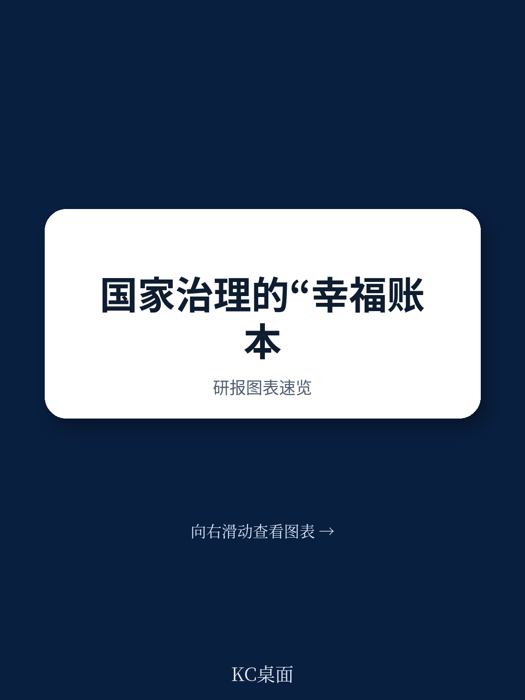
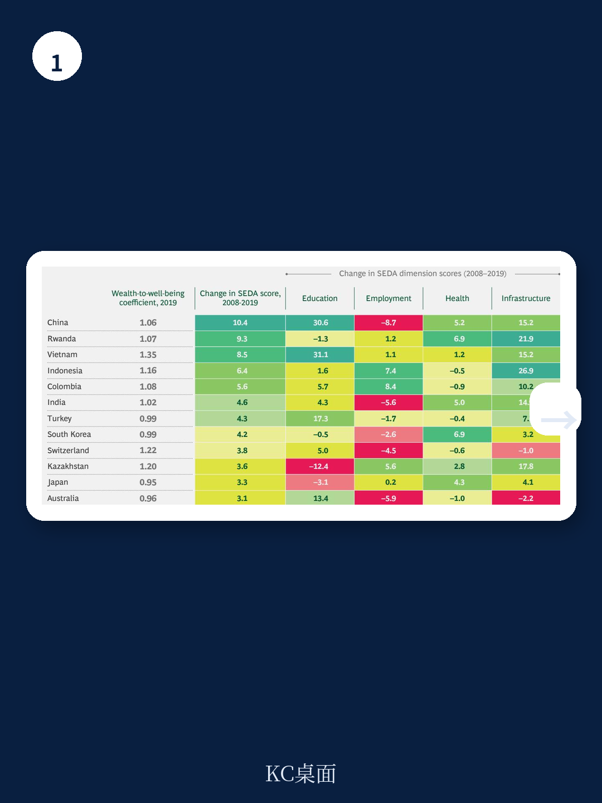
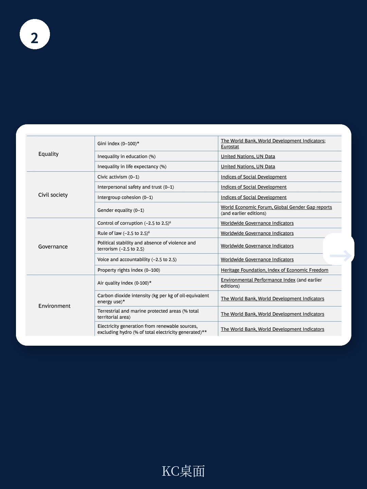

# 波士顿咨询：AI在公共部门的应用-2019年SEDA福祉评估框架

波士顿咨询2019年发布的《可持续宏观环境评估》报告提出一个核心判断：仅靠GDP衡量国家表现已经不够，政府需要一套包含客观福祉、主观幸福感和宏观环境数据的综合仪表盘。这份覆盖143个国家、占全球97%人口和98%地区的研究，提供了从“测量福祉”到“改善福祉”的具体路径。

报告认为，当前技术变革加速和潜在不平等加剧，使得政府比以往任何时候都更需要一套能够捕捉公民真实体验的评估工具。BCG自2012年开发的SEDA框架，正是为此设计——它不替代GDP，而是补充GDP无法反映的维度。

## 1. 收入相近的国家，福祉水平可以相差很大

报告通过对比发现，波兰和阿根廷人均收入相近，但波兰的SEDA福祉得分远高于阿根廷。美国人均收入高于荷兰，SEDA得分却明显更低。南非收入水平高于印尼，福祉得分却大幅落后。

这些对比揭示了一个关键事实：财富转化为福祉的效率，各国差异巨大。BCG用“财富-福祉系数”来衡量这种转化效率——系数大于1.0表示该国用同样收入创造了高于预期的福祉水平，低于1.0则相反。越南的系数从2008年的1.16持续上升至2019年的1.35，而美国同期从0.92降至0.90。

> **KC评论：** 财富-福祉系数是一个容易被忽视但实用的分析工具。它剥离了收入水平的影响，直接衡量政府公共研究和社会政策的产出效率。越南的持续上升值得关注，而美国的下降则提示，即使高收入国家也可能在健康、教育等公共领域存在系统性短板。

## 2. 客观福祉与主观幸福感并不总是同步

报告引入了一个反直觉的发现：客观福祉得分高的国家，反而更可能出现低于预期的幸福感水平。回归分析显示，两者之间存在负相关趋势。

BCG认为，这种分歧本身就是一个预警信号。它可能反映政府未能有效传达进步叙事以激励公民，也可能揭示政府优先事项与公民真实需求之间的脱节。更深层的原因可能包括社会不平等——报告特别指出，社会不平等（健康结果和教育机会的不均等）对福祉的影响比收入不平等更显著。

报告以美国为例：2019年世界幸福报告将美国幸福感下降部分归因于对健康和成瘾问题的政策回应不足。而SEDA健康维度中，美国因高肥胖率和预期寿命下降而表现仍在调整。

## 3. 三支柱仪表盘：GDP、客观福祉与主观幸福感的组合使用

BCG建议政府构建一个三支柱绩效仪表盘：GDP衡量宏观环境产出，SEDA提供客观福祉数据，世界幸福报告提供主观幸福感数据。三者各自独立又相互补充。

报告用全球36个“宏观环境强国”（25个最大地区与25个最大人口国的并集）验证了这一框架。结果显示：23个国家宏观环境增长快于收入相近的对照组，但其中只有5个同时在财富-福祉系数和幸福感得分上实现改善。4个国家两项指标均退步。大多数国家——包括多数增长较快和全部增长较慢的国家——至少有一项福祉指标出现谨慎信号。

这意味着，宏观环境增长并不自动转化为福祉改善。BCG认为，政府需要同时追踪这三个维度，才能及时发现战略偏差并做出调整。

## 4. 社会不平等比收入不平等更能预测福祉表现

报告在2018年扩展了SEDA的平等维度，在原有的收入基尼系数基础上，新增了健康和教育不平等指标。分析发现，一些国家如荷兰和瑞典，社会不平等和收入不平等都较低；尼日利亚和刚果民主共和国则两项都很高。

但更值得关注的是中间地带：中国、阿根廷和美国属于收入不平等较高但社会不平等较低的类型。报告认为，社会不平等对福祉的影响比收入不平等更直接——它直接关系到公民能否获得基本健康和教育服务，而这些正是政府公共研究的核心领域。

BCG的研究显示，收入不平等与客观福祉和主观幸福感之间的差距显著相关。换句话说，收入不平等越高的国家，其公民的幸福感往往低于基于客观福祉水平所预期的程度。
