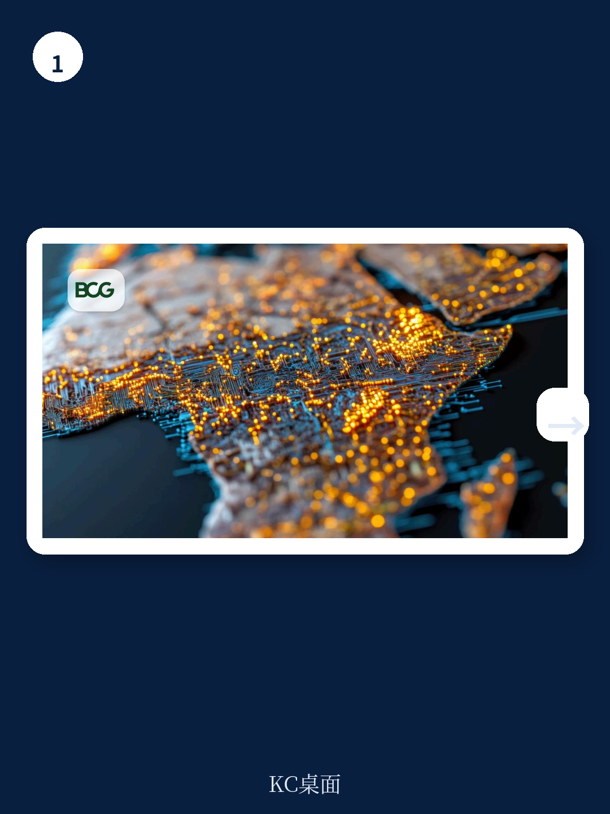
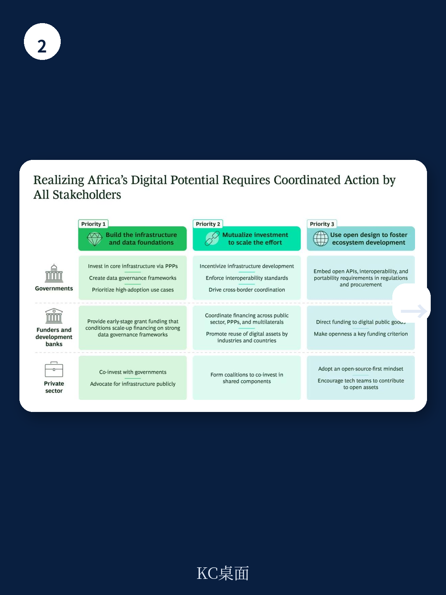

# 波士顿咨询：非洲AI与数字宏观环境-2050年占比仅8.5%

非洲数字宏观环境目前仅占该地区GDP的5%，远低于15%的全球平均水平。按照当前轨迹，到2050年这一比例也只会上升到8.5%。波士顿咨询这份报告的核心判断是：非洲的问题不在于数字技术采用速度，而在于价值创造环节的缺失——如果非洲不能从技术消费者转变为技术生产者，数据将像过去的矿产和农产品一样，成为新的原材料被运往海外加工。

报告识别出三项结构性约束，导致数字宏观环境的价值持续外流。

## 1. 市场碎片化与规模不足制约基础设施研究

非洲54个地区各自为政，没有一个国家GDP超过5000亿美元。单个地区规模太小，难以支撑现代数字宏观环境所需的基础设施研究。在企业层面，非洲银行每年在数字化转型上的支出超过300万美元的不到三分之一。这种双重碎片化使得任何单一主体都难以实现回报表现所需的规模效应。

报告认为，印度UPI支付系统的经验值得参考。印度国家支付公司（NPCI）作为银行共有的非营利机构，建设并运营统一支付接口，政府通过零费率政策和激励方案推动采用，用户规模扩大后单位成本下降，进一步吸引更多参与者。目前UPI已接入超过700家银行和40家第三方服务商，占全球实时支付交易量的约49%。

> **KC评论：** 报告强调的“互惠化研究”概念值得关注。它不只是分摊成本，而是通过共享基础设施创造新的市场结构——参与者在基础层合作，在应用层竞争。这种模式对非洲尤其适用，因为任何单一国家都难以独立承担数字基础设施的前期投入。

## 2. 人才外流与本地技术能力薄弱形成循环

非洲拥有约6.2万名AI专家，仅占全球AI劳动力的5%。更关键的是，2021年数据显示，其中38%的AI从业者远程为外国公司工作。非洲的开发者群体是全球增长最快的，但本地生态系统尚未成熟，人才就被全球需求吸纳。

报告指出，依赖进口的封闭系统加剧了这一困境。非洲企业为同等软件支付的费用比全球同行高出35%。高成本、低灵活性的技术环境削弱了本地开发者留在本地的动力，也抑制了本地企业进行创新的意愿。人才外流与系统依赖形成相互强化的循环。

## 3. 开源模式与公共数字基础设施的本地化路径

报告用两个案例说明开源路径的可行性。OpenMRS电子病历系统2006年在非洲开发，最初用于扩大HIV和结核病治疗规模，目前已被80多个国家的8100多家医疗机构采用，管理超过2200万患者记录。由于没有供应商锁定和重复许可费用，各国可以复用并调整系统，本地技术团队在开放架构上积累能力。

摩洛哥国家人口登记系统则基于印度开发的MOSIP开源数字身份平台建设，在共享数字公共产品的基础上定制本地化方案，改善了公共项目的目标定位，同时将技术能力和价值锚定在国内。

报告认为，开源路径需要三个配套条件：通过监管和技术标准要求开放API与互操作性；将开源作为资金拨付的关键标准；确保底层协议层保持开放，同时指定商业或公共运营商负责系统运行。

## 4. 信任机制与数据治理是规模化前提

报告引用一份白皮书数据：94%的新兴地区公民缺乏法律追索机制，18个国家的身份系统缺乏充分的法律框架。当公民没有法律救济途径、无法控制自身数据时，无论技术质量如何，系统都难以规模化。

数据治理需要从初期就明确分类规则——按敏感度分级，规定各类数据的存储位置、AI处理权限等。对于身份平台等核心系统，国家应保留核心数据的所有权。报告强调，数字化转型失败的原因几乎从来不是技术问题，而是组织协调、激励机制和问责机制是否到位。

非洲拥有全球最年轻的人口结构和快速增长的消费者基础，但能否从数字消费者转变为数字价值创造者，取决于公共机构是否具备必要的领导力和管理能力，以及运营环境是否支持这种转变。报告没有给出确定答案，而是将这两个问题留给了政策制定者和企业决策者。
