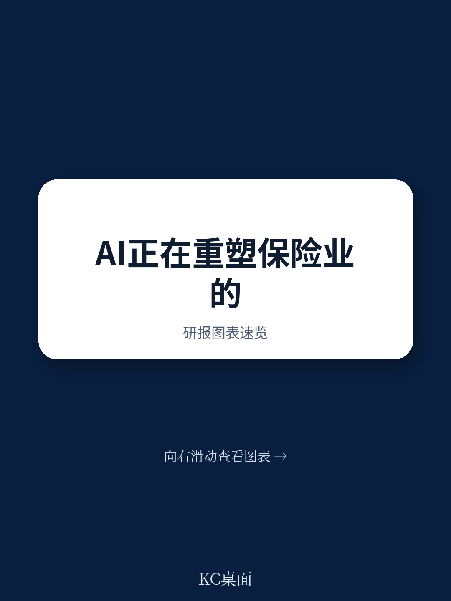
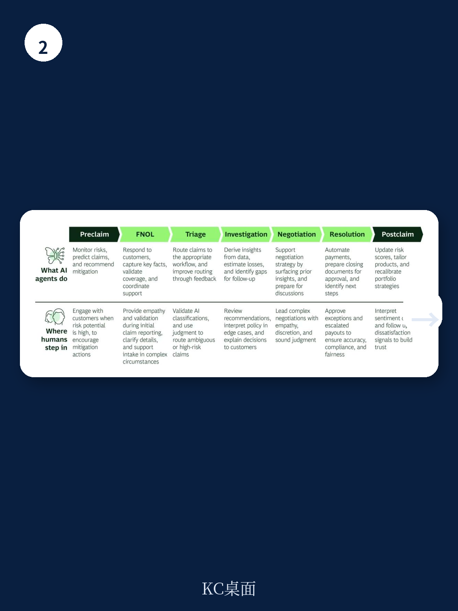

# 波士顿咨询：保险公司人才模式与AI适配性

保险公司在AI部署上已取得实质进展，客户体验、速度和运营效率均有改善。但波士顿咨询这份报告提出一个更根本的判断：这些收益掩盖了更深层的机会。AI的真正价值不在于让现有流程更快，而在于改变保险业的人才模式——包括什么工作留给人类、如何构建专业判断、以及问责机制如何设计。

报告估算，AI潜在价值的约70%来自变革管理、人才与运营模式的重构，仅30%来自AI工具和技术本身。这意味着AI战略与人才战略不可分离。

## 1. AI正在替代执行而非简单自动化流程

多数保险公司目前将AI视为改进现有工作流的工具——加速核保录入、改善理赔分类或指导分销决策。但波士顿咨询认为这一视角过于狭窄。AI的能力正从“辅助流程”转向“直接接管执行”。

对于清晰、高容量的请求，直通式处理将成为默认方式。AI在源头捕获并结构化数据，将指导直接嵌入决策和工作流。人类将被大规模移除出常规执行环节。报告以核保为例：当前模式下核保人每月需审查200份常规投保申请，未来将聚焦于10至15个涉及新不确定性或异常特征的边缘案例。

> **KC评论：** 报告用“从全科医生到急诊医生”类比这一转变。常规工作消失意味着保险业长期依赖的“通过重复积累判断”的学徒制将断裂。这不是效率提升，而是人才供应链的结构性断裂。

## 2. 传统人才模式面临五重断裂

当员工从处理常规任务转向“拥有结果”，AI将从五个方向冲击现有模式。

专业判断的积累路径将消失。保险业长期通过重复和数量构建判断力，但AI移除常规工作后，初级员工成长为资深专家的通道被切断。报告称之为“结构性悖论”：专业判断变得更有价值的同时，它变得更难培养。

问责将碎片化。当人类参与变成例外驱动，在缺乏明确决策权界定时，问责空白会迅速出现。谁为系统做出的核保决策负责？谁为自动理赔结果承担责任？这些问题需要在决策系统持续运行前就明确回答。

人类工作强度将上升。剩余工作涉及模糊性、高不确定性和情感敏感场景。认知负荷增加，同时高影响决策的问责集中在更少员工身上。报告警告，若不主动管理，可能导致决策疲劳、判断不一致和人员流失。

问责将集中化。当常规决策变成系统性的，正式问责落在更少员工身上，但决策来自模型、数据管道和控制系统，无人直接操作。单个错误的后果因AI的规模化而放大。

治理需要实时化。多数保险公司仍通过事后审查管理绩效。但当AI驱动持续、大规模的决策时，从错误决策到发现之间的滞后意味着数千案例被错误定价或处理。

## 3. 专业判断必须从“通过数量积累”转向“通过设计构建”

在这五重变化中，专业判断的发展最为关键。报告认为，未来保险从业者将通过结构化指导、AI辅助学习工具和跨决策类型的刻意轮换来积累经验，而非依赖数量。

报告引用核电站的培训模式作为参照：操作员可能多年不面对真实紧急情况，但通过逼真模拟器持续训练，保持应对罕见高不确定性时刻的判断力。保险公司需要类似的“模拟训练”体系来培养未来团队。

专业判断的培养不是泛化的技能提升，而是精准生产少数合格人员。早期投入的保险公司将在决策质量上建立可持续优势。

## 4. 治理模式需从“事后审查”转向“实时控制”

报告提出一个具体的治理架构：在每个业务领域设立小型、资深、业务主导的团队，嵌入决策流程进行实时监控。这个团队组合三种角色：对结果负责并有权干预的高级业务负责人；识别结果偏离预期模式并决定应对方式的领域专家；能追溯问题根源并在系统中修复的数据与技术负责人。

报告用“空中交通管制塔”类比这一模式。飞机大多自主飞行，管制员从塔台监控全局，在需要时才介入。这种治理能在决策发生的当下识别并拦截问题，而非在错误已扩散后重建原因。

## 5. 行动窗口正在收窄

AI正在加速决策的速度、规模和复杂度，同时保险业资深核保和理赔人才的输送管道正在弱化。大量员工接近退休年龄，保险业在吸引新一代人才方面面临来自其他行业的竞争。

报告认为，领先者与跟随者之间的价值创造差距将随时间复合扩大。那些等待的公司将被迫在一个学徒制已过时的环境中重建专业判断能力。

四个优先行动方向：重新设计专业判断的培养方式，不再依赖常规工作积累；在业务、技术和不确定性之间明确决策所有权；研究于人类工作的可持续性，提供工具、支持和负荷管理；建立业务主导的实时治理团队。

在AI主导的保险模式中，人才不是支撑性能力，而是约束条件、不确定性控制和竞争优势的来源。

For informational purposes only. Portions may be generated,translated,summarized,or edited with AI assistance based on source materials and may contain omissions or errors. Please verify independently. This is not investment,legal,tax,accounting,or other professional advice.

