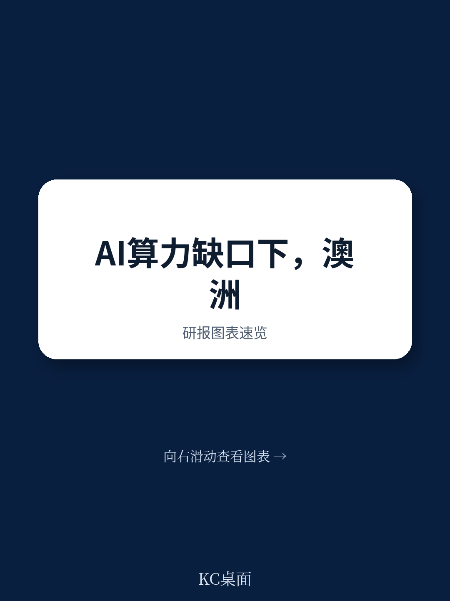
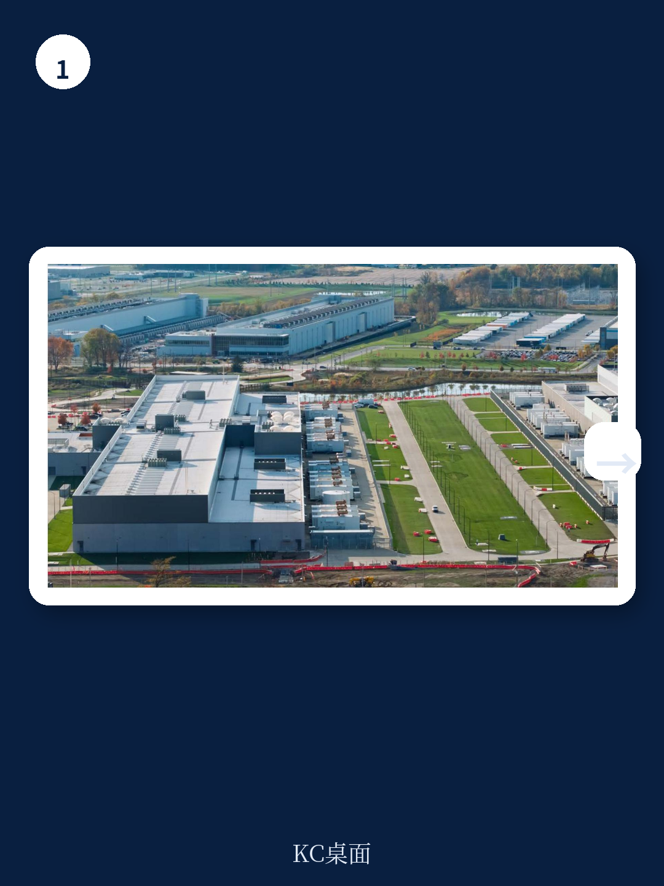
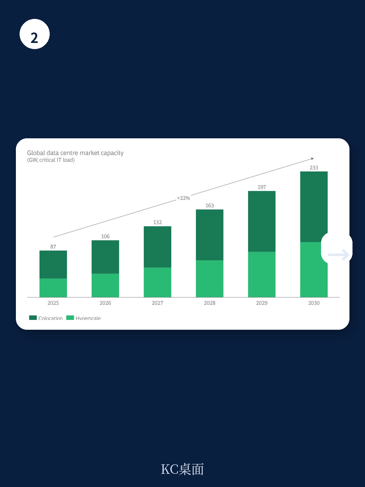

# 波士顿咨询：研究主题与行业变化观察

全球数据中心市场容量预计到2030年将增长近2.5倍，从87 GW增至233 GW。波士顿咨询这份报告聚焦澳大利亚在这一轮扩张中的位置与瓶颈。澳大利亚已是亚太地区最大的数据中心市场之一，2025年装机容量约1.8 GW，但报告认为，随着生成式AI推动需求加速，该国正接近一个关键转折点——能源可用性、研究时序、基础设施集中度和审批效率四个方面的不确定性正在变得突出，而亚太其他市场正在以更快的政策响应争夺同一批研究。

## 1. 全球数据中心需求仍由AI训练与推理驱动，但供给瓶颈集中在电力侧

报告测算，2026至2030年间全球数据中心市场增量中，约四分之三将来自延迟容忍型的生成式AI推理工作负载，包括agentic AI的持续扩展。训练需求同样保持增长，但推理侧因用户规模和应用场景的扩大，成为更持续的兆瓦需求来源。

全球范围内，电力可用性已成为新建数据中心的首要约束。电网并网周期往往长达数年，即便需求信号明确，供给侧的物理交付仍存在显著滞后。报告同时指出，尽管市场存在对AI研究泡沫的讨论——例如资本支出超前于需求、部分承销容量依赖估值尚未完全实现的AI公司——但行业基本面依然稳健：空置率极低，管道项目大部分已预租，且数据中心容量具备灵活性，即使训练需求正常化，也可转向企业AI、云、存储等用途。

> **KC评论：** 报告对“泡沫”与“韧性”两种信号做了并列呈现，但核心判断是需求结构比单一场景更宽，这降低了资产搁浅不确定性。读者可以关注报告中的Exhibit 2，它列出了泡沫信号与韧性信号的具体对照，是理解当前市场定价分歧的关键框架。

## 2. 澳大利亚的结构优势仍在，但四个约束正在收窄增长空间

报告认为，澳大利亚拥有可再生能源潜力、强大的海底光缆连接能力以及稳定的政治与商业环境，这些因素使其成为亚太地区有吸引力的数据中心选址。但报告同时识别出四个正在加剧的约束

第一，电力悖论。数据中心正成为快速增长的新增电力需求来源，而澳大利亚同时处于能源转型过程中。风能、太阳能和天然气的最终研究决策近年因宏观环境性、许可和社区问题而基本停滞。数据中心需求理论上可以通过承购协议加速新能源项目的宏观环境可行性，但需求增长的速度远快于新电源交付所需的时间。

第二，研究时序的鸡与蛋困境。开发商不愿在没有长期客户承诺的情况下投入大量前期资本，而客户希望在做出长期决策前获得更确定的交付时间表、电力可用性和基础设施就绪度。随着需求加速，平衡这些不确定性偏好的难度在上升。

第三，微观决策的束缚。数据中心研究正日益集中在悉尼和墨尔本等主要枢纽，这些地区拥有现成的基础设施、连接性和需求优势，但累积效应正在对能源、土地和网络基础设施施加更大不确定性。报告提出，这引发了关于增长如何在全国范围内平衡、基础设施规划如何在能源、连接和土地使用之间更好协调的问题。

第四，区域竞争加剧。亚太各国政府正在以不同策略争夺数据中心研究。新加坡通过严格管理的容量释放和可持续性标准维持区域枢纽地位；马来西亚以税收优惠和可持续开发指南定位为新加坡的“溢出”市场；印度正在制定国家政策框架和州级激励措施；日本将数据中心战略与脱碳优先事项对齐；韩国通过2025年电力网格特别法案推动容量分散。报告指出，拥有清晰、综合政策框架的市场正在捕获更高水平的研究。

## 3. 2.5 GW新增容量的宏观环境影响测算与实现条件

报告测算，到2030年开发2.5 GW额外计算容量，可在澳大利亚产生超过1000亿澳元的本地保留宏观环境影响，来自数据中心建设、配套新能源发电以及间接刺激的本地供应链活动。投入运营后，每年可带动约80至100亿澳元的本地宏观环境活动。

但这一测算的实现有前提条件：电力供应必须同步到位，审批和电网连接流程需要加速，研究时序需要协调。报告没有给出这些条件是否能够满足的判断，而是指出澳大利亚需要在速度、协调性、监管细节和长期基础设施规划之间取得平衡。

## 4. 亚太竞争格局中，政策响应速度成为关键变量

报告用一张表格系统比较了新加坡、马来西亚、印度、日本、韩国、泰国、印度尼西亚和澳大利亚在战略协调、基础设施赋能和财政激励三个维度的政策设置。澳大利亚在战略协调和激励措施方面与部分亚太市场存在差距，尤其是在审批流程的碎片化和并网时间方面。

报告认为，随着AI工作负载对延迟的容忍度提高，选址灵活性正在增加，这为澳大利亚争取更大份额的亚太和全球需求创造了机会。但同时，时间敏感的研究决策更倾向于流向审批更快、政策更可预测的市场。澳大利亚能否在保持其结构性优势的同时，解决审批和并网效率问题，将决定其在这一轮扩张中的实际捕获率。

> **KC评论：** 报告的Exhibit 4提供了亚太主要市场在战略、赋能和激励三个维度的横向对比，是理解不同市场竞争力来源的实用工具。读者可以重点关注“审批与并网时间”这一隐含变量——它往往是政策框架差异转化为实际研究流向的关键中介。

澳大利亚已在多个领域取得进展，但报告的核心判断是：结构性优势不会自动转化为增长。未来几年，该国如何平衡基础设施就绪度、交付确定性、能源转型优先事项、区域发展机会和国际竞争力，将决定其能否成为亚太地区可信赖的数字基础设施目的地。

For informational purposes only. Portions may be generated,translated,summarized,or edited with AI assistance based on source materials and may contain omissions or errors. Please verify independently. This is not investment,legal,tax,accounting,or other professional advice.

