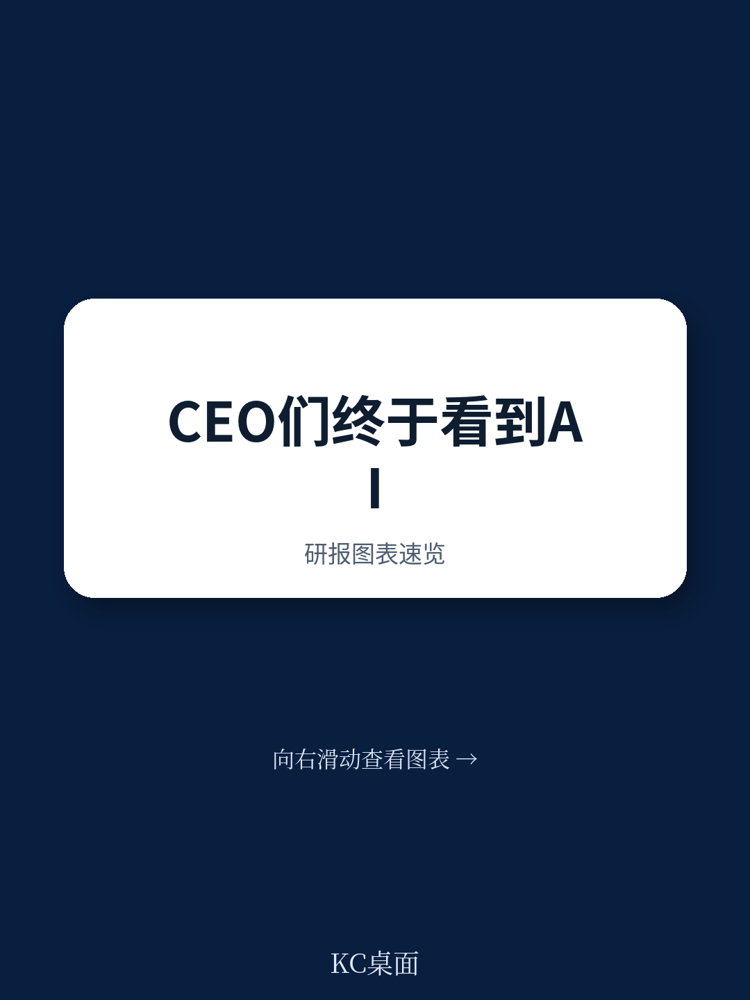
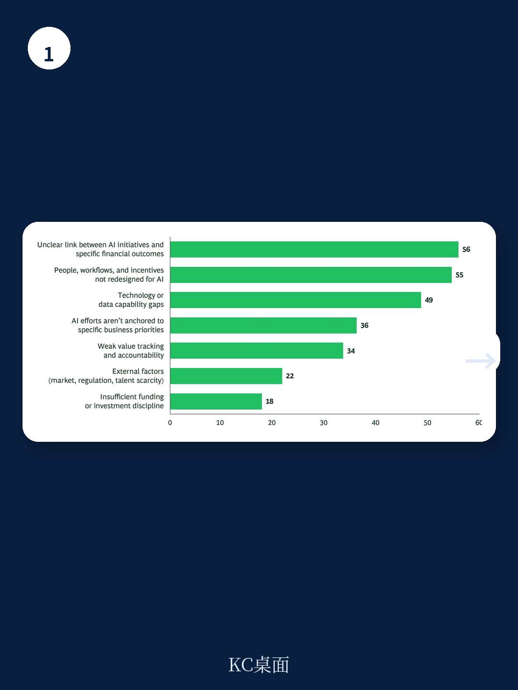

# 波士顿咨询：AI技术与行业应用观察

近九成 CEO 报告其公司已在特定领域从 AI 中获得成本或收入收益。这是波士顿咨询 2026 年 CEO 调查的一个核心发现。但更值得关注的不是这个数字本身，而是它背后的分化：那些真正实现显著财务回报的 CEO，与仍在试点中徘徊的同行，其差距几乎全部集中在组织执行层面，而非技术能力。

这份基于 152 位全球 CEO 反馈的调研，将高绩效者定义为报告 AI 带来至少 10% 成本削减或 5% 收入增长的企业，低绩效者则低于 5% 成本削减或 2% 收入增长。两组之间的对比，揭示了 AI 规模化落地的真实瓶颈。

## 1. 组织障碍已超过技术约束，成为限制 AI 财务影响的主要因素

当被问及“什么限制了 AI 转化为大规模财务影响”时，CEO 们列举的前三大障碍分别是：AI 计划与财务结果之间的关联不清晰、难以重新设计工作流程与角色、以及激励机制的错位。这些都属于组织执行范畴。相比之下，模型性能、数据架构或监管等技术问题，排名明显靠后。

报告指出，这些执行障碍并不新鲜，但真正令人困惑的是，很少有公司真正采取行动。多数 CEO 承认需要将 AI 计划与损益表挂钩，但只有 14% 为所有 AI 计划明确界定了损益影响。他们理解人员和流程必须改变，但不到三分之一的企业为流程重新设计和技能提升提供资金。他们看到问责制的必要性，却让所有权分散在各个职能部门。

> **KC评论：** 这张图的关键不在于 CEO 知道什么，而在于他们知道却未行动的比例。14% 这个数字是整份报告最值得记住的锚点——它意味着 86% 的 CEO 在“将 AI 与财务挂钩”这件事上，认知与执行之间存在巨大缺口。这不是技术问题，是管理纪律问题。

## 2. 高绩效者更倾向于将问责制下放到业务负责人，而非由 CEO 亲自执行

调查显示，近半数 CEO 表示亲自领导 AI 实施，但波士顿咨询认为这恰恰可能成为瓶颈。CEO 的角色应是设定方向、回答“AI 如何支持公司战略”这类根本性问题，而非陷入季度执行细节。真正的交付责任应归属于 CXO 和损益表所有者。

数据支撑了这一判断：报告显示，实现最高 AI 财务影响的公司，其将问责制重组作为 AI 计划一部分的可能性，是低绩效同行的两倍。这意味着，AI 转型不是 CEO 一个人的项目，而是需要将绩效指标与结果挂钩，而非与活动量挂钩。

## 3. 高绩效者在四个关键领域采取了与同行截然不同的行动

波士顿咨询提炼出四个区分规模化 AI 价值与停留在试点的关键动作，且每个动作都伴随可量化的差距。

第一，设定清晰的问责制。高绩效者定义所有 AI 计划的损益影响的可能性是低绩效者的约五倍。第二，重塑业务流程。高绩效者以 AI 端到端重新设计工作流的可能性是低绩效者的约七倍。第三，直接追踪财务价值。高绩效者让财务部门从第一天起强制执行损益问责的可能性是低绩效者的 1.4 倍。第四，研究于人员和变革管理。高绩效者将最优秀人才分配到 AI 工作流的可能性是低绩效者的 2.4 倍。

这些数字背后有一个共同逻辑：AI 的价值分配中，仅 10% 来自算法，20% 来自数据，剩余 70% 来自运营模式变革和新工作方式。这意味着，如果企业将主要精力放在技术选型上，而忽视组织变革，其投入产出比将严重失衡。

## 4. AI 放大了传统转型的难度，而非改变其基本逻辑

报告专门解释了为什么 AI 让熟悉的转型工作变得更难。原因有四：对人的影响更大——AI 不仅改变任务，还替换完成任务所需的技能，可能侵蚀批判性思维和判断力；计划必须随技术变化而调整——两到三年的转型计划可能需要多次调整；不确定性在企业完全理解之前就已扩大——从网络漏洞到不可预测的消费成本；价值案例更难预先证明——收益可能更大，但显现时间更长，归因更困难。

波士顿咨询的建议是，将 AI 计划聚焦于少数高价值领域，而非四处试点。例如，一家全球工业企业将 AI 实施限定在供应链规划、售后客户互动和生产力等少数端到端业务领域，并在第一年内就在多个市场实现了可衡量的损益影响。

这份报告的核心信息是：CEO 已经看到了 AI 的早期信号，但真正的分水岭在于能否将试点阶段的兴奋转化为有纪律的组织执行。那些在问责制、流程重塑、财务追踪和人员投入上做到位的企业，正在将早期 momentum 转化为可持续的竞争优势。而那些仍在等待技术成熟或试图用试点覆盖所有方向的公司，其执行差距只会继续扩大。

For informational purposes only. Portions may be generated,translated,summarized,or edited with AI assistance based on source materials and may contain omissions or errors. Please verify independently. This is not investment,legal,tax,accounting,or other professional advice.

