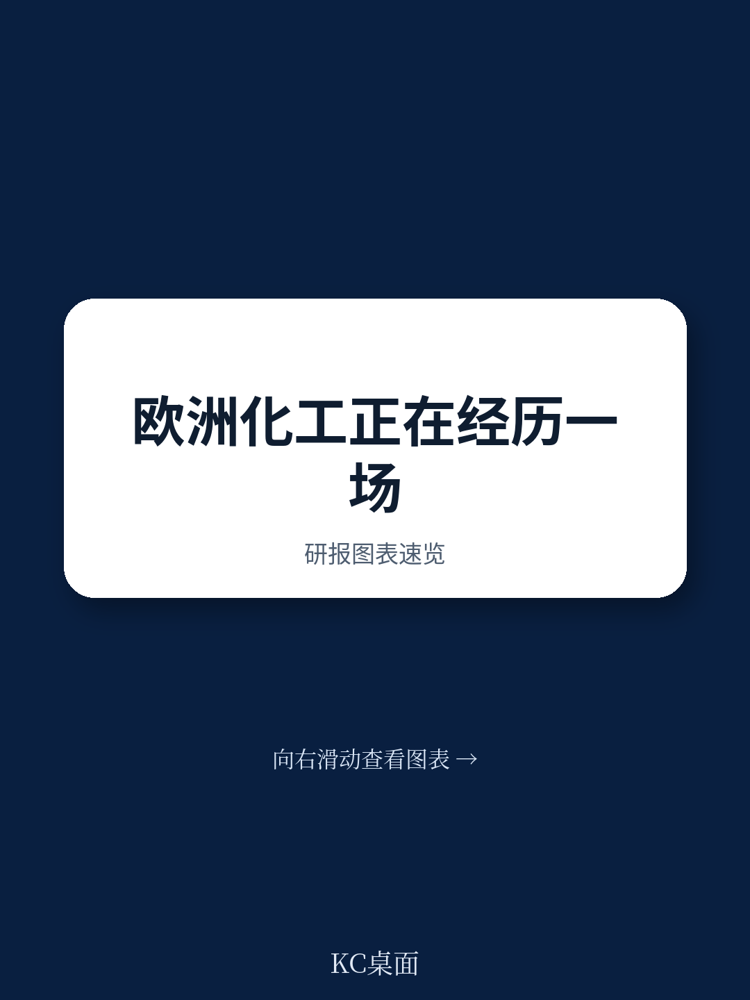
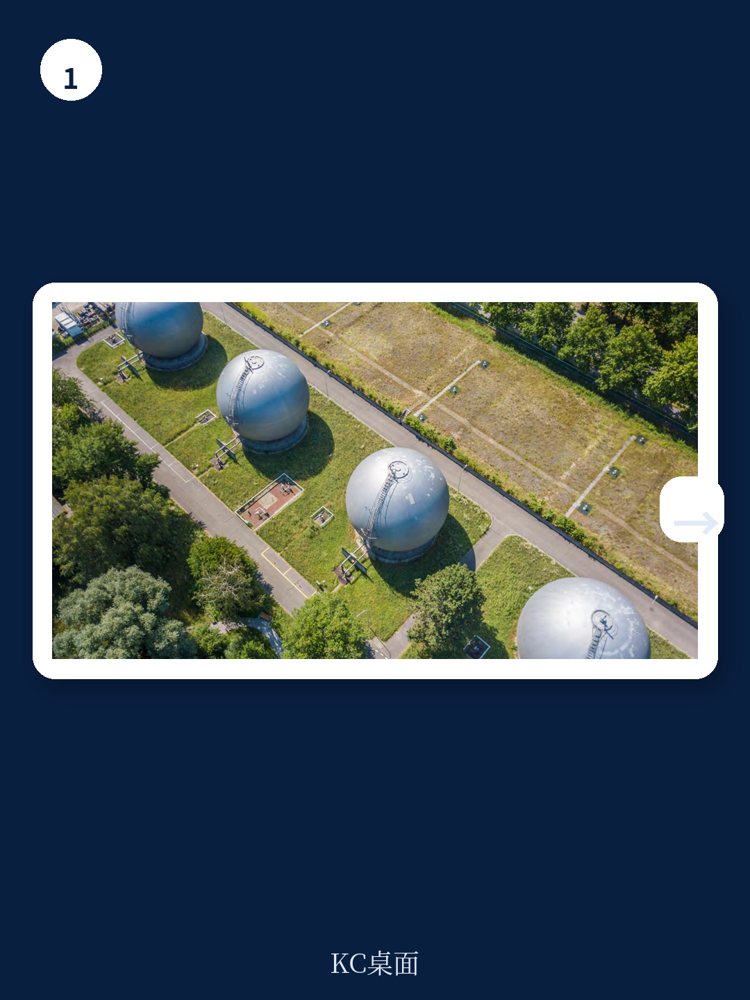
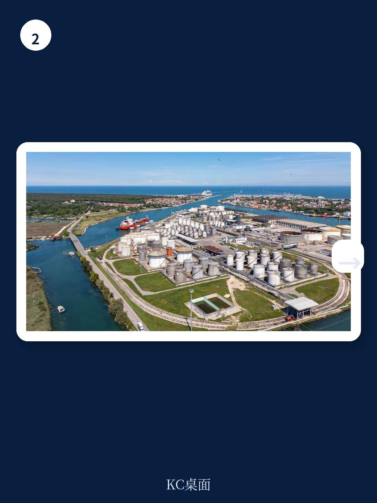

# 波士顿咨询：欧洲化工2030-2040

欧洲化工行业正经历一场结构性重置，而非周期性波动。波士顿咨询在2026年6月发布的报告中指出，过去五年间欧洲化工装置利用率较2015-2020年均值下降了约10个百分点，这一变化背后是能源与原料成本高企、全球产能过剩、需求模式转变以及监管收紧等多重力量的叠加。报告认为，这些不确定性不会随宏观环境周期消退，行业此前依赖的均衡状态已经终结。

2026年第二季度，中东局势导致全球石油供应路线中断，欧洲化工生产商的竞争地位一度改善。但波士顿咨询明确将这一变化定性为暂时性好转，而非结构性复苏。欧洲生产商面临的核心问题——需求仍在调整、投入成本高、全球产能过剩以及来自亚洲和中东的低价竞争——并未得到解决。报告强调，增量改进计划无法弥合当前的结构性竞争力差距。

## 1. 行业分化加速，组合平均指标失去参考价值

欧洲化工行业正在分裂为三个截然不同的群体。差异化、可防御的细分领域凭借创新优势和客户粘性仍能维持相对稳健的利润水平。不确定性过渡型业务虽仍可运营，但成本劣势、监管暴露或贸易动态正持续侵蚀其竞争力。而结构性暴露的大宗化学品链条——以聚合物为代表——面临最严峻的挑战，这些产品能源密集、易于贸易且难以实现差异化。

波士顿咨询识别出四个驱动分化的结构性变量：能源强度、贸易暴露度、终端市场周期性和监管负担。能源强度高的产品直接受制于欧洲的成本位置，易于运输的化学品面临更强的进口竞争，暴露于周期性行业则加剧需求波动，高碳足迹则推高监管成本。报告认为，在此背景下，组合层面的平均指标已失去指导意义，战略决策必须下沉到细分领域、资产甚至客户层面。

> **KC评论：** 报告点出了一个容易被忽视的转变——过去化工企业习惯用组合平均值来评估业务健康度，但当前环境下，平均值掩盖了不同业务单元之间的真实差异。企业需要重新审视每个资产在结构性变量上的具体暴露程度，而非依赖整体数字做判断。

## 2. 四种未来情景均不指向旧均衡的回归

波士顿咨询构建了四种可能的行业演进路径，每种情景对价值捕获方、利润水平和重组速度的假设不同，但共同点是：没有任何一种情景能够恢复此前的均衡状态。

在区域化情景下，供应安全担忧和政策措施提升欧洲生产的吸引力，但成本差距依然存在。成本趋同情景假设欧洲能源和原料价格下降缩小竞争力差距，但全球产能过剩持续限制利润空间。绿色溢价情景中，低碳产品需求快速增长，但报告指出，客户对绿色溢价的接受度仍有限，企业需按客户细分验证支付意愿而非假设市场整体接受。进口加剧情景则意味着全球产能过剩持续推动进口不确定性，加速暴露链条的市场份额侵蚀。

报告特别提醒，当前轨迹下，大多数主要价值链的竞争劣势将在2030年前变得明显，而到2040年，今天的资本配置决策将深刻嵌入行业结构，届时调整空间将大幅收窄。

## 3. 三种商业模式与无遗憾行动框架

波士顿咨询认为，行业战略选择正在收敛为三种商业模式。规模驱动的成本领先者适用于大宗化学品链条，核心是优势资产、高利用率和严格运营纪律。集成网络玩家通过原料获取、合作伙伴关系和稳定下游连接来降低波动性。创新主导的专家则依靠差异化产品、应用专长和紧密客户关系来支撑利润质量。

报告强调，试图同时覆盖三种模式通常只会增加复杂性而不带来优势。企业需要明确自身定位，并在此基础上执行一系列无遗憾行动——这些行动在几乎所有情景下都有意义。具体包括：基于结构性宏观环境学的硬核组合分析，识别可持续优势所在；通过运营改进和结构性成本削减缩小成本差距；通过长期合同、回收和整合确保原料与能源供应；利用数据和分析提升收率、优化规划、减少停机并降低营运资本。

波士顿咨询的结论直白且克制：欧洲化工行业不能等待周期性反弹。那些继续依赖旧有假设和组合平均指标的企业将越来越难以竞争，而早期行动者——重新配置资本、重塑组合、在差异化可防御领域建立更强地位——将更有可能创造价值。调整的必要性已不再是问题，问题是谁能足够果断地行动。
