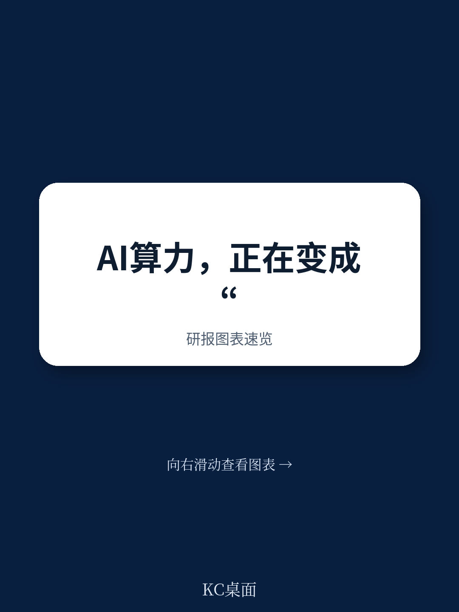
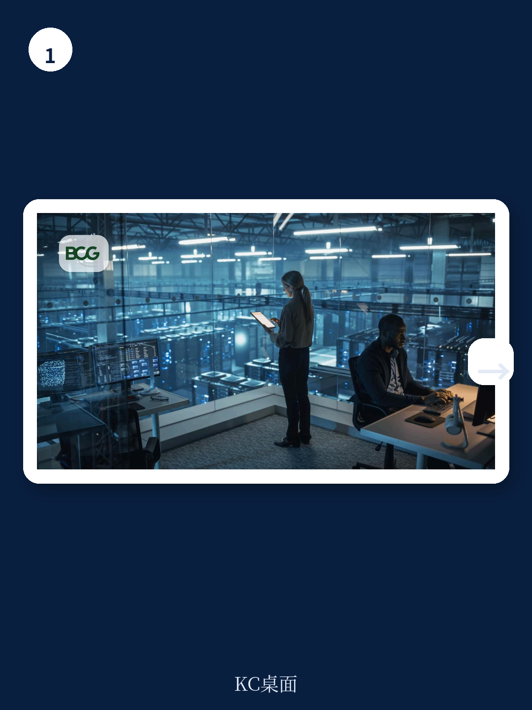
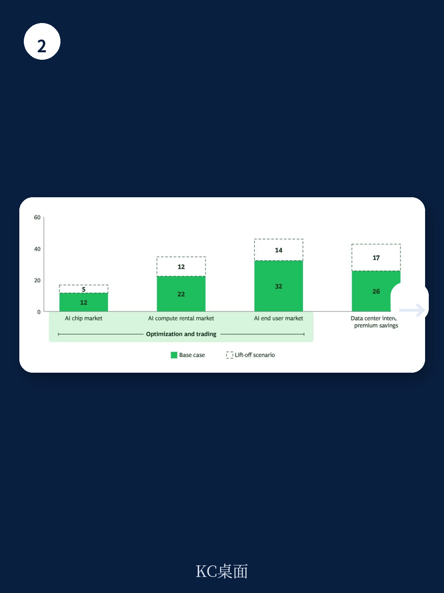

# 波士顿咨询：AI算力正成为商品

企业级AI的定价模式正在经历根本性转变。波士顿咨询（BCG）在2026年7月发布的研究中指出，Anthropic和OpenAI等AI实验室已从固定订阅费转向按量计费，下一步将是动态定价——算力价格随供需实时波动。对于企业用户而言，这意味着AI成本敞口正在显著上升。

BCG估计，这一转变可能释放高达每年1400亿美元的“暗价值”——因市场效率低下而未被捕获的价值。这些价值集中在两个领域：算力芯片、租赁和终端token三个环节的优化与套利，以及数据中心运营商的融资成本降低。

## 1. 企业用户正从固定费率走向实时价格暴露

过去，企业用户支付固定订阅费，AI提供商通过限速和排队来控制需求，用户感受不到算力成本的真实波动。但这一模式已经终结。2026年4月，Anthropic将企业客户改为每人20美元基础费加按token付费的API费率；OpenAI的Codex也从固定消息定价转为按token计量；GitHub收紧Copilot限制；Windsurf取消固定积分制改为每周硬性限额。

BCG认为，下一步是动态token定价——推理价格随底层算力供需变化，类似于批发电力市场：实时客服请求在早高峰时段价格更高，而夜间批量摘要任务则便宜得多。这种机制有效运行的前提是模型可替代——开发者可以在Claude、GPT或开源模型之间切换，竞争使价格贴近实际算力成本。

> **KC评论：** 报告区分了“可替代”和“不可替代”两类场景。深度生态集成——定制芯片、微调模型、数据驻留安排——会创造切换成本，削弱现货市场的定价约束。企业需要判断自己的AI工作负载属于哪一类，才能决定采用哪种成本管理策略。

## 2. AI实验室面临价格发现不足与不确定性管理工具缺失

AI实验室和自动驾驶、生物科技等大型算力用户面临两个结构性挑战。第一，价格发现有限。公开标价与实际成交价往往不一致，折扣、预留容量承诺和企业协议都在场外谈判且不公开。BCG指出，原油等成熟市场通过价格报告机构收集实际交易数据并标准化发布，为期货市场提供了参考基准。AI算力市场目前缺乏这样的基准。

第二，不确定性管理工具不足。数据中心空置率仅1%，约92%的新增容量在建成前已被预签。但据Cast.AI数据，部分GPU集群的利用率低至5%。从外部看这似乎低效，但从买家角度看，算力不足意味着无法训练下一代模型或服务新用户。长期合同同时用于锁定供应和管理价格不确定性——H100 GPU价格自2025年1月以来月均上涨约2.2%，期间最大跌幅11%，最大涨幅约25%。

BCG认为，一个更成熟的市场应提供两种不确定性管理工具：短期市场让买家灵活增减容量，期货市场让实验室锁定未来算力成本。

## 3. 数据中心运营商的高融资成本有望通过远期曲线降低

AI数据中心市场目前依赖超大规模企业的股权和现金流融资，但随着市场成熟，债务融资需求将快速增长。当前数据中心运营商借款利率较高，原因在于抵押品——GPU硬件和客户租赁协议——存在双重不确定性：GPU每两年更新一代，残值快速贬值；H100小时租赁费率从2024年初约8美元峰值跌至2025年底1.96美元，2026年4月回升至2.64美元。客户合同还往往集中在少数交易对手。

BCG测算，假设2026至2030年3.6万亿美元的AI基础设施研究，70%贷款价值比、4.5年摊销期、SOFR 3.6%的条件下，若建立可靠的远期曲线，数据中心运营商的综合利率可从6.43%降至4.75%，4.5年节省约1160亿美元利息，相当于每年约260亿美元可重新投入产能建设。

## 4. 市场向流动性转变面临三重阻力，但方向已定

BCG识别出三个主要阻力。技术复杂性：AI算力在时间、质量和地理三个维度上存在差异——H100与H200性能不同，非GPU成本（CPU、网络、存储、编排软件）往往隐藏，不同地区的成本和可用性也不同。缺乏共识基准：已出现的Ornn H100指数和Silicon Data H100租赁指数采用不同方法论，同一GPU在同一天可能在不同指数上获得显著不同的价格。资本可用性：许多AI实验室尚未实现高盈利，但股权融资仍可获得，管理价格不确定性只是近期才成为优先事项。

尽管如此，BCG认为向更高流动性和透明度的转变不可逆转。早期行动者——无论是管理成本敞口的企业用户、获取更便宜融资的数据中心运营商，还是保障供应的AI实验室——都有机会在这一转变中捕获不成比例的价值。
