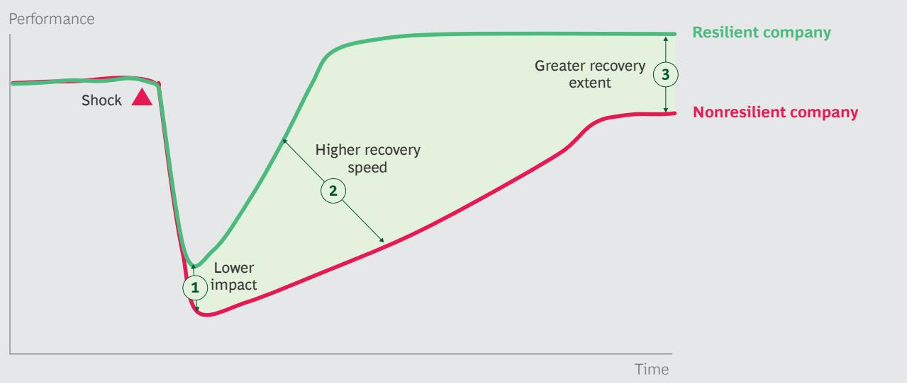
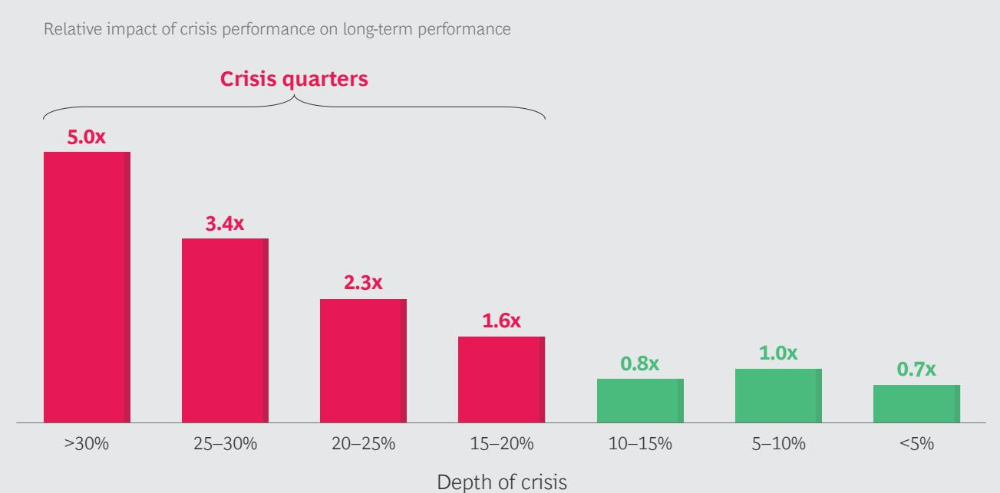
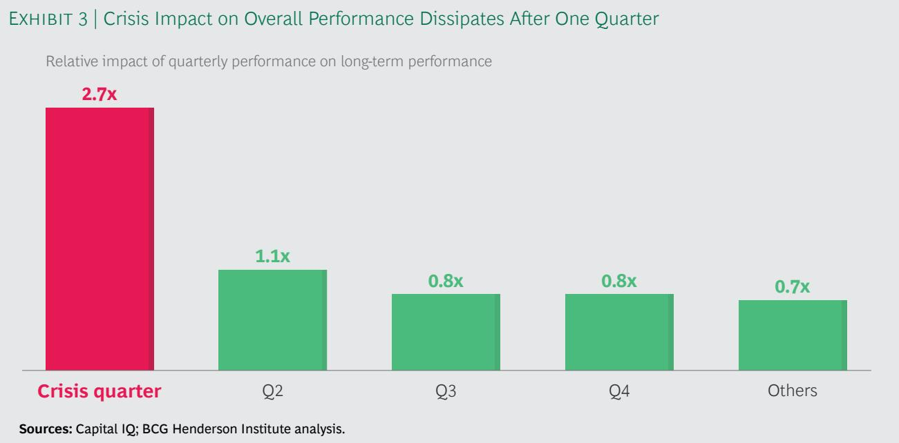
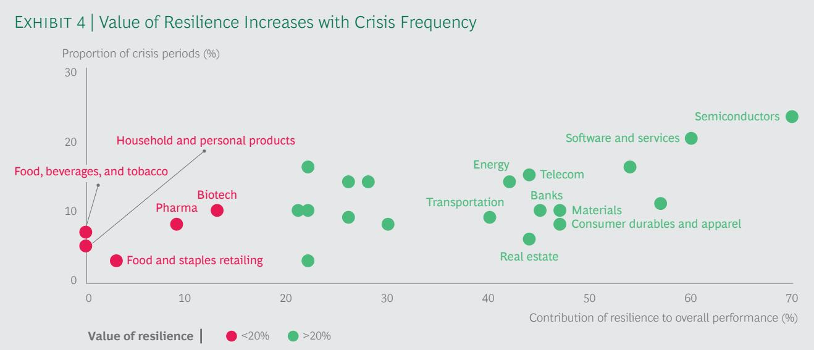
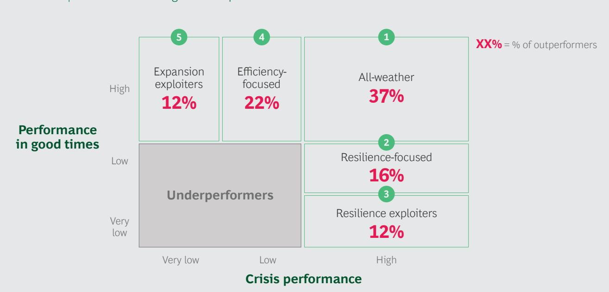
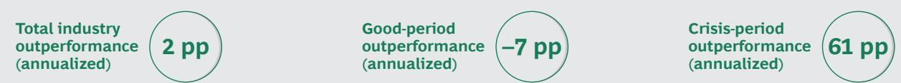
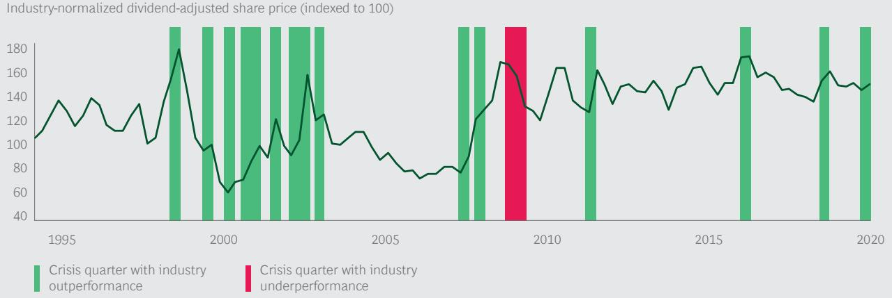
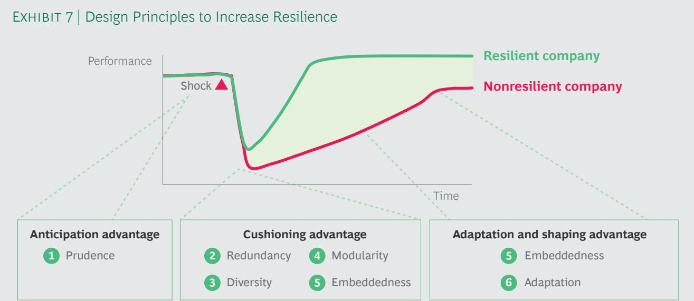

# BECOMING AN ALL-WEATHER COMPANY

By Martin Reeves, Saumeet Nanda, Kevin Whitaker, and Edzard Wesselink

"The world is simply not prepared to deal with a disease—an especially virulent flu, for example—that infects large numbers of people very quickly. Of all the things that could kill 10 million people or more, by far the most likely is an epidemic. But I believe we can prevent such a catastrophe by building a global warning and response system for epidemics."

—Bill Gates, 2015

T HAS BEEN KNOWN for a long time that pandemics pose a major risk to global health and economies, yet the world was caught mostly flat-footed when COVID-19 started spreading. A few countries were well-prepared for the crisis, but many were not, and some had even scrapped or defunded preparation plans in recent years.

As we have seen time and again, if good times last long enough, it becomes hard to justify investments to ameliorate the bad times—efficiency becomes prized over resilience.

Many companies have effectively made a similar choice to value short-run efficiency over resilience, such as by spending down cash buffers on shareholder buybacks and removing operational slack, only to be hit hard during the pandemic. Many companies now express an intention to rebuild their business more resiliently, but it remains to be seen whether they will be able to respond effectively to the current crisis—and whether they will maintain resilient practices during good times in the future.

To help leaders do so, it is worth asking several questions: What is resilience and how does it work? How valuable is resilience in the long run? And how can companies go about building it?

Our quantitative study of nearly 1,800 companies over 25 years shows that resilience in unfavorable periods accounts for nearly 30% of long-term outperformance. We also find that some companies are consistently resilient over time and offer clues about how to build and sustain resilience.

How Resilience Creates Value At its core, resilience is a company's capacity to absorb stress, recover critical functionality, and thrive in altered circumstances.

This is needed when a sudden and unfavorable shift in the business environment causes an immediate shock to one or more critical business functions. For instance, when COVID-19 hit, some businesses saw a rapid fall in demand, while others experienced interruptions in supply chains or labor availability. Eventually, recovery ensues, but at very different rates across firms. In the shock-recovery trajectory, resilient companies enjoy better outcomes than their peers on one or more of three dimensions:

\- First, the immediate impact of an external shock on their performance can be lower than their peers.

\- Second, the speed of their recovery can be higher than peers.

\- Finally, the extent of their recovery can be higher than peers.

Measuring these three parameters offers a route to quantify the value of resilience across companies and to compare their strategies. (See Exhibit 1.)

To better understand the value and dynamics of resilience, we studied the performance of approximately 1,800 US companies from 1995 to 2020. $^{1}$ We assessed relative resilience by measuring the relative total shareholder return (TSR) of each company, compared with the average of its industry, during crisis quarters (quarters in which the industry TSR saw a peak decline of at least 15 percentage points [pp] from the start of the quarter).

## Quantifying the Impact of Resilience

Our study revealed several insights about the value of resilience:

Crisis periods have a disproportionate effect on long-run outperformance. While many companies tend not to focus on resilience, our analysis found it has an outsized effect: Although crises occurred in only 11% of the quarters in our study period, relative TSR during those times accounts for 30% of a company's long-run relative TSR. In other words, performance during crisis periods has almost three times the impact of performance during stable periods.

This impact stems from the fact that shareholder returns of companies in a given industry tend to move together during normal periods, but they diverge significantly during a crisis. In stable quarters, the average gap in TSR between the 25th and 75th percentile performers in an industry is 16 pp. However, this nearly doubles to 30 pp in crisis quarters.

EXHIBIT 1 | Resilient Companies Enjoy Better Outcomes on Three Fronts  
  
Source: BCG Henderson Institute analysis.

What happens during crisis quarters? The majority were linked to major economic recessions—the dot-com recession, the global financial crisis, and the coronavirus crisis. The rest were about evenly spread between nonrecession, market-wide crises (such as the one caused by the Russian financial crisis in 1998) and industry-specific crises (such as the 2015–2016 energy industry crisis caused by a drop in oil prices).

The deeper the crisis, the greater the value of resilience. As the depth of a crisis increases, so does the contribution of the corresponding quarter to long-run relative performance. (See Exhibit 2.)

Quarters with a TSR decline of more than 15% have a disproportionately higher impact on overall performance. Moreover, this impact dissipates in the first quarter after the crisis is over. (See Exhibit 3.)

The value of resilience differs by industry. The value of resilience tends to be higher in industries that face deeper or more frequent crises. While the value of resilience is greatest in technology and consumer durables sectors, which have tended to be more volatile, it is lowest in industries with more stable demand, such as food and beverages, household products, and health care. (See Exhibit 4.)

Outperformance is driven primarily by withstanding the immediate impact. Of the three phases of resilience, not all are equally important. Reducing the immediate impact of a shock accounts for 63% of relative TSR in crisis periods, while greater recovery speed accounts for 23%. The remaining 15% is explained by the extent of recovery; some companies benefit from the crisis and end up at a higher level than when they started.

Most paths to long-term success leverage resilience. We looked at the more than 500 companies that outperformed their industries from 1994 to 2020 (while being public for at least ten years in that time) and identified five archetypes of success. (See Exhibit 5.)

EXHIBIT 2 | Deeper Crises Have Greater Impact on Long-Term Performance

Relative impact of crisis performance on long-term performance

  
Sources: Capital IQ; BCG Henderson Institute analysis.  
Note: Maximum TSR drop from quarter opening is used to categorize depth of crisis.

Nearly two-thirds of the long-run outperformers did better than their peers in crisis periods. Moreover, nonresilient companies were only half as likely as resilient companies to achieve long-run outperformance. In order to succeed in the long run without resilience, companies needed to reach a very high bar during good times—outperforming their industry by 8 pp each year on average.

Achieving General Resilience
Each crisis is unique—for instance,
COVID-19 helped companies like Zoom and Clorox outperform, as the pandemic forced people to work from home and increased the focus on hygiene. However, companies can't always predict what kind of risks they will run into or when they will occur. This raises the question of whether general resilience—the capability to deal with any kind of crisis—is possible.

We found that there is indeed such a thing as general resilience in business: 15% of companies displayed general resilience by outperforming their industries in more than 80% of the crisis quarters they faced over the 25-year study period. (This is

  
Sources: Capital IQ; BCG Henderson Institute analysis.

  
Sources: Capital IQ; BCG Henderson Institute analysis.

Total industry outperformance (annualized)

Crisis-period outperformance (annualized)

significantly higher than the roughly 4% that would have done so if outperformance was completely uncorrelated across crises.)

An example of a generally resilient company is Berkshire Hathaway. From 1995 onwards it has outperformed the diversified financials industry by about 2 pp per year—but this outperformance was achieved entirely in crisis quarters (it outperformed in 15 of the 17 crisis quarters it faced). Across all noncrisis quarters, the company actually underperformed. (See Exhibit 6.)

Being generally resilient is extremely valuable over the long run, as such companies achieved an annual 5-pp TSR outperformance over their industries for the 25-year period that we observed (1995–2020). And, perhaps not surprisingly, five of the current Fortune 10 companies have been generally resilient.

EXHIBIT 5 | Two-Thirds of Long-Run Outperformers Do Well in Crises  
  
Sources: Capital IQ; BCG Henderson Institute analysis.

EXHIBIT 6 | Berkshire Hathaway Outperforms Industry via General Resilience  

Industry-normalized dividend-adjusted share price (indexed to 100)  
  
Sources: Capital IQ; BCG Henderson Institute analysis.  
Note: Good-period and crisis-period outperformances are over different time frames, so they are not directly additive or multiplicative.

## What Resilient Companies Do

Resilient companies create four types of advantage that help them achieve superior performance in crises:

\- Anticipation advantage: the ability to recognize threats and prepare for them in advance, which helps cushion the immediate impact and improve recovery speed.

\- Cushioning advantage: the ability to withstand the initial shock, which helps in cushioning the immediate impact.

\- Adaptation advantage: the ability to quickly identify the actions needed to restore operations and implement them swiftly, which helps improve recovery speed and achieve a greater extent of recovery.

\- Shaping advantage: the ability to shape the dynamics of the industry in the postshock environment, which helps in achieving a greater extent of recovery.

We have previously studied long-lasting biological systems to understand how they are structured for resilience, finding that these systems reflect six implicit design principles: prudence, redundancy, diversity, modularity, embeddedness, and adaptivity. These same design principles can also help companies anticipate a crisis, cushion its impact, adapt to it on different timescales, and shape the environment. (See Exhibit 7.)

Here we explore some specific measures that resilient companies deploy to operationalize the six principles.

## PRUDENCE

Prudence involves operating on the precautionary principle that if something can plausibly happen, it eventually will. Prudent companies therefore have an anticipation advantage, which helps them be better prepared to manage a crisis.

Resilient companies operationalize prudence by preparing for long-term shifts that can significantly disrupt an industry, developing plans or circumvention mechanisms in anticipation of a disruption, and looking for early warning signals to identify a crisis before it affects them.

Prepare for long-term shifts. Slow-moving trends often contribute to crises. For example, the continuous increase in international mobility was one of the factors responsible for COVID-19's global spread. Long-term shifts may also point to new opportunities; this crisis has accelerated trends like digitization of work and service delivery. Companies that navigate slow but significant shifts are likely to be advantaged in anticipating and preparing for a wide range of disruptions.

  
Source: BCG Henderson Institute analysis.

The video conferencing technology company Zoom was one of the biggest outperformers (achieving TSR 110 pp better than its industry) in the coronavirus crisis. Zoom's founder and CEO Eric Yuan recognized the shift from audio-based to video-based communication as a major long-term trend and focused on improving video quality even at lower bandwidths. As a result of this video-first mentality, Zoom was in position to take advantage of the demand surge brought about by the pandemic.

Build contingency plans for disruptions. Whether resulting from long-term changes or sudden shifts, a wide range of disruptions can cause shocks. Hence, resilient companies identify potential causes and invest in building contingency plans or circumvention mechanisms for them. Just because there are plans on paper does not mean they will be executed successfully—war games and simulations can help ensure that they are pressure-tested and implementable during a crisis.

Build an early warning system and continuously scan the environment for emerging risks. Once a company has recognized potential threats and developed contingency plans, it can gain further advantage by scanning the environment for early warning signals. Though risks may seem unpredictable, the study of natural systems indicates that some disruptions are reliably preceded by certain indicators, such as the breaking down of historical correlations or a gradual slowing down of recovery time from smaller disruptions. $^{2}$

In business, early warning signals may be found by scanning the activity of fringe competitors or studying events in other regions. For example, Regeneron Pharmaceuticals CEO Leonard Schleifer said that the company's alarm bells rang in late January when Chinese authorities built new hospitals in Wuhan in less than a week. $^{3}$ Realizing this was not a normal incident, Regeneron turned its full attention to the new virus. As a result of this head start, it has been one of the frontrunners in COVID-19 research, contributing to 45-pp outperformance during the crisis.

Decoding early warning signals is particularly advantageous because many companies often do not recognize crises until it is too late. For instance, of the roughly 100 major US companies with earnings calls between January 24 and February 24—when the coronavirus outbreak was still largely confined to China—only ten discussed the possibility of a global pandemic affecting their business. Seven of them outperformed when the pandemic eventually spread (with an average overperformance of 9 pp), illustrating the value of anticipation.

## REDUNDANCY

Redundancy involves creating buffers to cushion against unexpected shocks, giving companies a cushioning advantage. There are two main ways in which highly resilient companies build in redundancy: operational buffering and financial buffering.

Operational Buffers. Redundancy in operational components like stocks, production capacity, and skilled workers for critical functions can help companies deal with demand fluctuations and supply disruptions. One company that benefited from such buffers is 3M, which has outperformed its industry in 78% of the crises faced in the past 25 years. After experiencing supply shortages during the SARS crisis, 3M deliberately built up excess “surge” capacity for respirator masks, enabling a rapid production ramp-up in the COVID-19 crisis. $^{4}$ As a result, 3M became one of the major PPE manufacturers in the US during the pandemic.

Financial Buffers. Generally resilient companies have a 16% lower debt/enterprise value (debt/EV) ratio and a 27% higher cash/operating costs ratio than the industry averages. $^{5}$ This financial buffering increases the capacity to sustain operations during a deeper or longer revenue shock. Moreover, having more cash or debt capacity also allows companies to purchase distressed assets inexpensively during a severe crisis. For example, Chevron has outperformed its industry in 80% of crisis quarters over time, in part because it maintains an advantageous debt position. In 2020, Chevron had a debt/EV ratio less than one-third of its peers' average, giving it more flexibility—in July, it completed the first major US energy acquisition of the crisis, agreeing to purchase Nobel Energy for \$5 billion.

## DIVERSITY

Diversity creates different types of options with which to react to a crisis. Companies with diverse businesses or operations are less likely to experience catastrophic failure; they enjoy a cushioning advantage. Companies can leverage diversity in their revenue sources (what they sell, where, how, and to whom) or in their operations (how they create and deliver products).

Revenue Source Diversity. Diversity of offerings, customers, geographies, or sales channels can protect against a sharp decline in demand during a crisis, because different segments are likely to respond to a shock differently. Companies that report revenues from more geographic or business segments than the industry median achieve an annualized crisis outperformance of 4 pp and 1 pp, respectively, in the long run.

Operational Diversity. Diversity of supply chain options, operational processes, and means of production can also provide alternatives during a crisis. For example, whereas most large hotel chains are concentrated in major tourist destinations, Airbnb offers a more diverse set of accommodation options thanks to the ease with which it can onboard new rental properties. When long-distance business and leisure travel stopped during the pandemic, the hotel industry suffered a prolonged shock—but Airbnb recovered much more quickly owing to its wider range of rental options. As people looked for safer vacations at smaller locations near major cities,

Airbnb's US bookings from the end of April to early June actually surpassed its 2019 figures.

## MODULARITY

Modularity refers to organizing a system in separate, loosely linked modules. This allows individual elements of a system to fail without the entire system collapsing. Modularity thus confers a cushioning advantage. Modularity can involve either operational or financial separation between businesses or components of businesses.

Operational Modularity. Companies with highly concentrated supply chains benefit from economies of scale, but they can suffer cascading effects from a small disruption. For example, the Fukushima earthquake and its aftershocks led to a temporary closing of major silicon wafer factories. Because 60% of wafers globally were produced by only two Japanese companies at that time, a localized crisis led to disruption in the supply chains of many major chip makers around the world.

Companies with localized supply chains for their major markets are likely to suffer less from disruptions. For instance, 3M's manufacturing model emphasizes “local for local,” with production facilities for key products distributed across all of its major markets. $^{6}$ This helps the company service all of its markets effectively even when facing disruptions, contributing to an annualized industry outperformance of more than 30 pp during crises.

Organizing in multi-company ecosystems can also help build modularity. Business ecosystems typically have a modular structure wherein different participants can smoothly fit into a set of standardized roles and then connect, interact, or exchange resources with others. This is beneficial during a crisis, as one or more failing participants can be swiftly substituted by others to ensure that customers are served without disruption.

Financial Separation. Catastrophic performance in a high-risk business can impact other businesses as well. Hence, some

resilient companies financially separate high-risk assets from regular businesses, such as by holding them in a separate subsidiary.

For instance, Alphabet has outperformed its industry in 80% of crisis quarters. Alongside Google, which generates most of the company's revenue, Alphabet invests in a number of other businesses, many of which are financially separate and have their own boards. This protects the immediately profitable Google business from financial risk. In March, Alphabet's driverless mobility unit Waymo raised more than \$2 billion from outside investors—thus securing equity funding for a relatively high-risk venture without diluting the existing shareholders' stake in Alphabet as a whole.

## EMBEDDEDNESS

Embeddedness is the alignment of a system's goals and activities with those of the broader economic or social systems it is a part of. Businesses with a high level of embeddedness can rely on support from their local communities and governments, and they are less likely to be abandoned by their customers or suppliers during a crisis. Moreover, in tough times, this alignment with society can be a strong motivating factor for employees. Having strong relationships with larger systems confers a cushioning advantage and an adaptation advantage.

Companies can be embedded in their customers' lives by providing an essential service, and they can be embedded in social systems more broadly by aligning their purpose with society.

Be important to the customer. Companies whose portfolios comprise largely discretionary spending items tend to be less exposed to demand fluctuations than those that serve staples. Businesses designed to be key to customers' lives also have the ability to lock in revenues through long-term contracts or subscriptions.

American Tower, a real estate investment trust and wireless communication infrastructure operator, has outperformed its industry in 83% of crisis quarters. It provides communication infrastructure that is critical for its customers, enabling it to keep 95% of its revenues locked in under long-term contracts, guaranteeing a stable revenue stream during crises.

Align the company's purpose with that of society. Organizations that are driven by a purpose aligned with society's may receive more external support and may give employees more motivation during a crisis. However, merely stating a purpose is not sufficient; a company needs to signal its authenticity by integrating the purpose into its core business strategy and ways of working.

For instance, in 2014, US pharmacy CVS Health, a generally resilient company that has outperformed its industry in 88% of crisis quarters, decided to live its purpose of “helping people on their path to better health” by becoming the first drugstore to stop selling tobacco. Despite forgoing a \$2 billion revenue stream, it grew in areas more aligned with its purpose, such as pharmacy benefits management. During the COVID-19 crisis, CVS has opened more than 1,800 drive-through testing locations, showing the extent of its embeddedness in the US health care system.

## ADAPTIVITY

Adaptivity is the ability of a system to rapidly adjust to new circumstances. A crisis often brings about a significant change in industry dynamics—and an organization’s ability to change in sync confers adaptation advantage. The flux in consumer behavior and industry structure also creates an opportunity for forward-looking companies to influence the industry dynamics favorably—providing a shaping advantage during and beyond the crisis.

In the short run, adaptivity requires the ability to experiment with a variety of actions and select and scale up the successful ones. On longer timescales, resilient companies shift their portfolio mix and investment toward new sources of postcrisis growth. Some resilient companies take a step beyond adaptation and try to shape

the business environment to capture even greater value.

Experimentation. Companies that can quickly experiment with a number of different actions and select and scale up successful ones will adapt fastest to a crisis. Some resilient companies run controlled experiments and use algorithms to automatically tune their actions. While experimentation reduces static efficiency, it improves the ability to learn and adapt, creating advantage in dynamic and unpredictable environments.

While Airbnb's diversity of rental options gave it an opportunity to recover, its ability to quickly sense the change in customers' travel preferences was essential in taking advantage of that opportunity. On the basis of this information, the company modified its marketing focus to a “Go near” campaign aimed at promoting locations within driving distance of large cities, and it changed its guest rules to ensure pandemic-related safety precautions in these locations. $^{7}$

Agility. Fast action in a crisis can be valuable in securing scarce resources and capitalizing on opportunities. In order to be nimble, some organizations decentralize decision making by eliminating excessive layers and the need for consensus. Some go a step further by substituting algorithms for human-based decision making in areas such as pricing and supply chain planning. Agility is unlocked by fostering collective action, having a culture of getting things done, clearly and persuasively communicating the company's goals, and creating self-fueling movements among stakeholders.

Even though Zoom was well positioned to take advantage of the demand for video-based communication triggered by the COVID-19 crisis, it was hindered by security concerns. The company quickly took note and announced a 90-day plan that included the release of a transparency report. It acquired the secure-messaging firm Keybase in order to use its technology to build end-to-end encryption, and as a sign of commitment it halted all nonsecurity upgrades for 90 days. By immediately recognizing the issue, communicating transparently, and acting quickly, Zoom preserved user trust and thereby achieved growth at a critical juncture. For example, though the New York Department of Education banned the app early on, it rescinded the ban in a month, after Zoom upgraded security features.

Operational Flexibility. Companies that are operationally flexible can change their processes more easily to adapt to adverse situations. Typically, asset-light companies are more operationally flexible: Companies that had a lower fixed assets/revenue ratio than their industry median outperformed by 15% (annualized) during crisis periods.

Nevertheless, asset-heavy companies can still be adaptive by building flexibility into their processes. An example is Intel, which outperformed its industry in 92% of crisis quarters. Large economies of scale in the semiconductor industry led to the consolidation of manufacturing and supply chains, making them vulnerable to supply shocks. To reduce this risk but still gain some economies of scale, Intel builds factories with standardized layouts and processes that give it the flexibility to produce multiple products from different factories, if required, with minimal additional expense. $^{8}$

Shifting Portfolio Mix. A crisis often leads to new consumer behaviors, policy environments, and ways of working. Resilient companies are successful in identifying and committing to new sources of growth by appropriately changing their investment mix.

Following the disproportionate impact of the GFC on the financial sector, Hong Kong-based insurance company Ping An saw tech platforms as a new growth driver. In 2008, it set up a subsidiary called Ping An Technologies and transformed into a diversified tech-focused company, hiring a co-CEO in order to lead platform-based businesses and committing to spend 1% of revenue on R&D. The company made gains during and after the crisis, moving from number 462 in the Fortune 500 in 2008 to number 29 in 2019.

Shaping the Future. Achieving shaping advantage involves influencing an ecosystem of customers, suppliers, and complementors to redefine industry standards. For example, Alibaba's initial focus was on enabling Chinese companies to sell their products internationally, but the 2003 SARS epidemic spurred it to launch an online consumer marketplace, Taobao, to leverage the increased interest in online purchasing. However, the industry was still nascent in the country and many consumers did not trust online transactions. As a result, Alibaba launched Alipay—a new online payments service that provided escrow services and a merchant ratings system—enhancing trust in e-commerce and enabling the company to take a leading position in the industry.

## Resilience Begins with a Mindset Shift

Merely adopting the measures described here will not guarantee resilience—a mindset shift is also required for these measures to be understood, valued, embraced, and implemented effectively. An unspoken assumption that short-run efficiency trumps everything else, or that short-run financial returns should always be maximized, will undermine any effort to create a resilient company. Leaders who aspire to rebuild more resiliently must reshape how their companies think about business. Here are some places to start:

Have a biological mindset. As uncertainties and interconnections increase, businesses and business environments function more like complex adaptive systems and less like machines that can be optimized. A biological mindset in management requires leaders to look at systems as a whole and always be prepared for the unexpected. This naturally helps large organizations balance efficiency with resilience.

Think long-term. Calm seas will be disturbed by stormy weather at some point. Long-run performance is disproportionately determined by performance in crisis periods. Therefore, it is necessary to think ahead and prepare for unexpected and unfavorable events.

Think in systems and emphasize collaboration. A chain is only as strong as its weakest link. A company with a brittle supply chain or mistrustful regulators cannot be resilient. When diagnosing resilience, you must look beyond the boundaries of your organization.

Redefine “performance.” Businesses tend to be very goal-oriented. Leaders should aim for consistent long-term value creation—in changing and unfavorable times as well as in good times. Aspire to measure and manage forward-looking, long-term metrics like resilience, vitality, and adaptability.

Educate your managers. The term “resilience” is important and topical, but sadly it is also a source of confusion. It is defined in various contradictory ways, and few know how to achieve it. Furthermore, your managers have likely been weaned on efficiency thinking rather than resilience thinking. It is important to discuss what you mean by resilience, how it works, and how you plan to achieve it.

Go beyond the numbers. Resilience involves coping with and benefiting from the unexpected—it can’t be reduced to a closed-form equation. Modeling and quantifying knowable risks play a role. But restricting measures to the easily quantifiable is not enough to create a generally resilient company. You need to embrace weak signals, deal with contingencies, change plans in light of new information, and make judgments about the right level of “insurance” for your business.

Be optimistic. Resilience is not only about reacting to events with the aim of minimizing downside impact. It is also about outflanking your competition by learning faster from changing circumstances and shaping them to your advantage. “Opportunity” should figure in your thinking as much as “risk.”

THE CORONAVIRUS CRISIS has brought renewed attention to the need for resilience. Given that resilience is a critical

capability to deliver long-term outperformance, companies need to start the process of operationalizing resilience today to ensure that they are best prepared to navigate the future.

## NOTES

1. Analysis includes all companies with a market cap of \$3 billion or more at the beginning of 2020 or an equivalent inflation-adjusted market cap at the beginning of any five-year period since 1995.
2. Scheffer et al., “Early-warning signals for critical transitions,” Nature, September 2009; Scheffer et al., “Anticipating critical transitions,” Science, October 2012.

3. See “These Scientists Raced to Find a Covid-19 Drug. Then the Virus Found Them.”
4. See “How 3M Plans to Make More Than a Billion Masks by End of Year.”
5. Cash ratio defined as Cash-in-bank/(Operating costs ex DA).
6. See “Industries Mobilizing Against the Coronavirus.”
7. See “Airbnb launches Go Near, a new campaign to support domestic travel.”
8. See “Building a Resilient Supply Chain.”

## About the Authors

Martin Reeves is a managing director and senior partner in the San Francisco office of Boston Consulting Group and chairman of the BCG Henderson Institute. You may contact him by email at reeves.martin@bcg.com.

Saumeet Nanda is a consultant in the San Francisco office of Boston Consulting Group and an ambassador to the BCG Henderson Institute. You may contact him by email at nanda.saumeet@bcg.com.

Kevin Whitaker is head of strategic analytics at the BCG Henderson Institute. You may contact him by email at whitaker.kevin@bcg.com.

Edzard Wesselink is a principal in the firm's San Francisco office and an ambassador to the BCG Henderson Institute. You may contact him by email at wesselink.edzard@bcg.com.

Boston Consulting Group partners with leaders in business and society to tackle their most important challenges and capture their greatest opportunities. BCG was the pioneer in business strategy when it was founded in 1963. Today, we help clients with total transformation—inspiring complex change, enabling organizations to grow, building competitive advantage, and driving bottom-line impact.

To succeed, organizations must blend digital and human capabilities. Our diverse, global teams bring deep industry and functional expertise and a range of perspectives to spark change. BCG delivers solutions through leading-edge management consulting along with technology and design, corporate and digital ventures—and business purpose. We work in a uniquely collaborative model across the firm and throughout all levels of the client organization, generating results that allow our clients to thrive.

## About BCG Henderson Institute

The BCG Henderson Institute is Boston Consulting Group's strategy think tank, dedicated to exploring and developing valuable new insights from business, technology, and science by embracing the powerful technology of ideas. The Institute engages leaders in provocative discussion and experimentation to expand the boundaries of business theory and practice and to translate innovative ideas from within and beyond business. For more ideas and inspiration from the Institute, please visit https://www.bcg.com/featured-insights/thought-leadership-ideas.aspx

## © Boston Consulting Group 2020. All rights reserved. 9/20

For information or permission to reprint, please contact BCG at permissions@bcg.com. To find the latest BCG content and register to receive e-alerts on this topic or others, please visit bcg.com. Follow Boston Consulting Group on Facebook and Twitter.