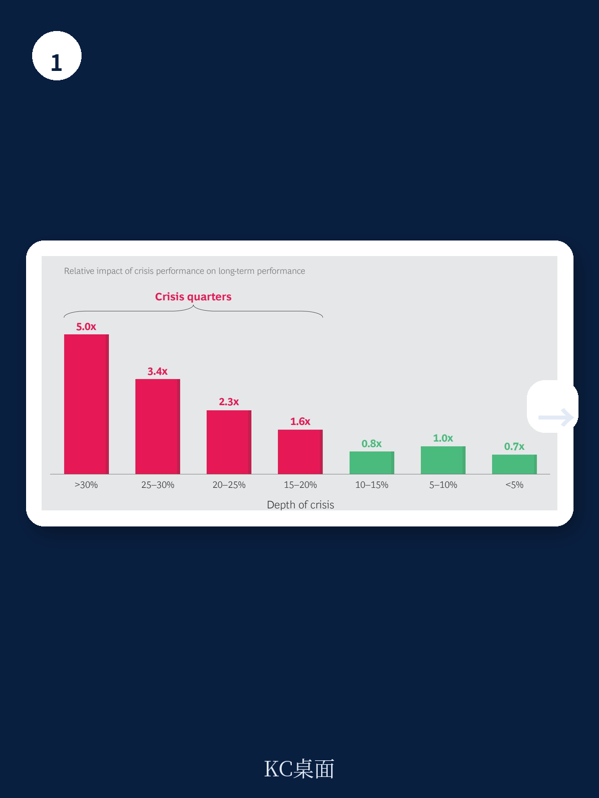
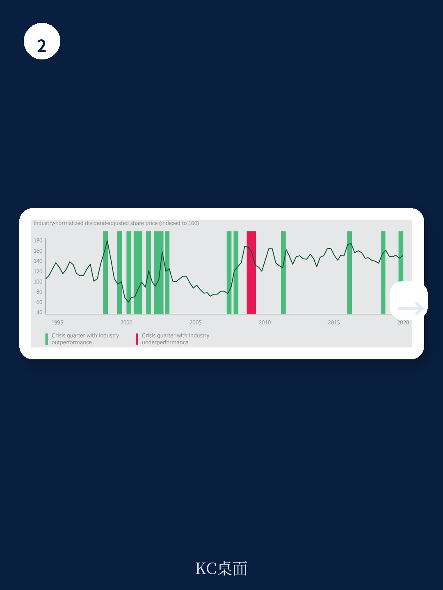

# 波士顿咨询：研究主题与行业变化观察

波士顿咨询（BCG）旗下BCG亨德森研究所发布了一份基于近1800家美国公司25年数据的研究，量化了企业韧性对长期股东回报的贡献。核心发现是：尽管扰动季度仅占研究周期的11%，但企业在这些时期的相对股东总回报（TSR）表现，解释了长期相对TSR的约30%。这意味着扰动时期的业绩影响力几乎是平稳时期的三倍。

这份报告试图回答一个长期困扰管理者的难题：在效率与韧性之间，企业应如何权衡。研究给出的答案并非鼓励企业放弃效率，而是指出韧性并非成本，而是长期超额回报的重要来源。报告识别出15%的企业具备“通用韧性”——它们在超过80%的扰动季度中跑赢行业，这些公司25年间的年化TSR比行业高出5个百分点。

## 1. 扰动时期业绩分化程度是平稳期的近两倍

报告通过量化分析揭示了韧性价值的具体来源。在平稳季度，行业内第25百分位与第75百分位公司之间的TSR差距平均为16个百分点。但在扰动季度，这一差距几乎翻倍至30个百分点。这意味着扰动是区分优秀公司与普通公司的关键窗口。

研究进一步拆解了韧性的三个维度：抵御冲击的即时影响、恢复速度、以及恢复程度。其中，降低即时冲击对扰动期相对TSR的贡献占63%，恢复速度占23%，恢复程度占15%。这一发现挑战了“快速反弹最重要”的直觉——真正拉开差距的是扰动发生时的抗压能力，而非事后的追赶速度。

> **KC评论：** 报告将韧性拆解为可量化的三个维度，其中“降低即时冲击”权重最高。这意味着企业不应只关注扰动后的应急响应，而应更重视扰动前的缓冲设计——比如财务储备、供应链冗余、以及早期预警机制。

## 2. 通用韧性企业的财务缓冲特征：低负债与高现金储备

报告识别出具备通用韧性的企业具有可量化的财务特征。与行业平均水平相比，这些公司的债务/企业价值比率低16%，现金/运营成本比率高27%。这种财务缓冲结构使它们能够在更深或更长的收入冲击中维持运营，同时也有能力在扰动期间以较低价格收购困境资产。

报告以雪佛龙为例：2020年其债务/企业价值比率不到同行平均水平的三分之一，这使其在当年7月完成了疫情以来美国能源行业的首笔重大收购——以50亿美元收购诺贝尔能源。这一案例展示了财务缓冲不仅是防御工具，也是扰动中的进攻性优势。

## 3. 韧性设计六原则：从生物系统到企业组织

报告借鉴了长期存续的生物系统的结构特征，提炼出六项韧性设计原则：审慎、冗余、多样性、模块化、嵌入性和适应性。这些原则并非抽象概念，而是可以通过具体管理措施落地的操作框架。

以“审慎”为例，报告指出具备审慎优势的企业会主动扫描早期预警信号。在2020年1月底，当中国当局在武汉一周内建成新医院时，再生元制药CEO意识到这并非正常事件，随即公司将全部注意力转向新冠病毒。这一提前行动使其成为新冠研究的领先者之一，并在扰动期间实现45个百分点的超额TSR表现。相比之下，在2020年1月24日至2月24日期间举行财报电话会议的约100家美国大公司中，只有10家讨论了全球大流行可能影响业务的可能性——而这10家公司中有7家在疫情蔓延后跑赢行业。

## 4. 长期跑赢行业的企业中近三分之二具备韧性

报告分析了1994年至2020年间跑赢行业的500多家公司，识别出五种成功模式。其中近三分之二的长期跑赢者都在扰动时期表现优于同行。相反，不具备韧性的公司要实现长期跑赢，必须在平稳时期达到极高的标准——每年平均跑赢行业8个百分点。

这一发现对管理者的启示是：韧性不是可选的附加项，而是长期业绩的核心驱动因素。报告建议企业重新定义“绩效”的概念——不应只关注平稳期的增长指标，而应衡量和管理前瞻性、长期性的指标，如韧性、活力和适应性。

> **KC评论：** 报告指出非韧性企业需要在平稳期每年跑赢行业8个百分点才能弥补扰动期的损失，这个门槛极高。对于大多数企业而言，在效率与韧性之间寻找平衡，可能比单纯追求效率最大化更具长期价值。

报告最后强调，韧性不仅是对抗节奏变化不确定性的能力，也是从变化中学习、塑造环境以获取竞争优势的能力。在扰动中，“机会”与“不确定性”应被同等重视。

For informational purposes only. Portions may be generated,translated,summarized,or edited with AI assistance based on source materials and may contain omissions or errors. Please verify independently. This is not investment,legal,tax,accounting,or other professional advice.

