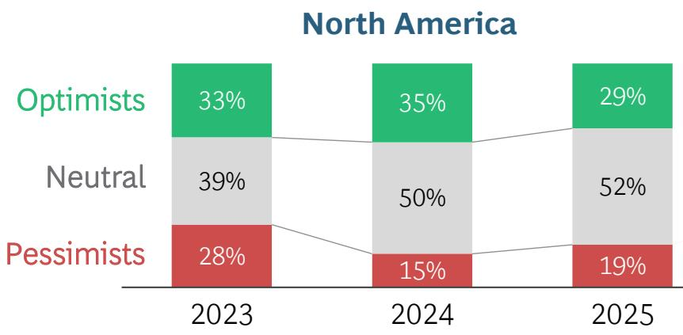
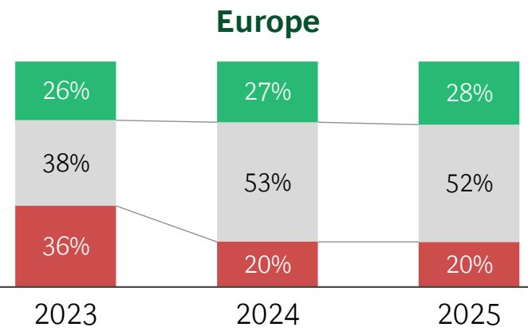
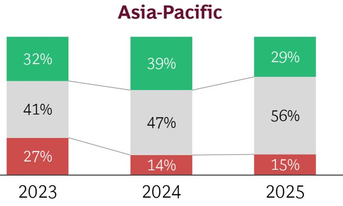
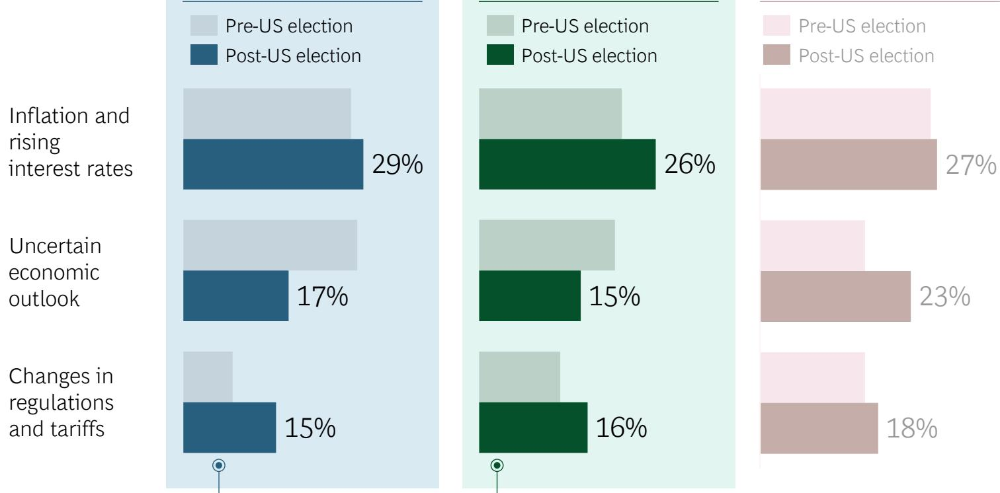
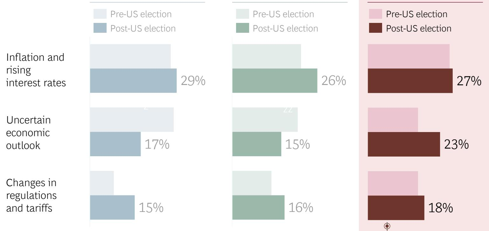
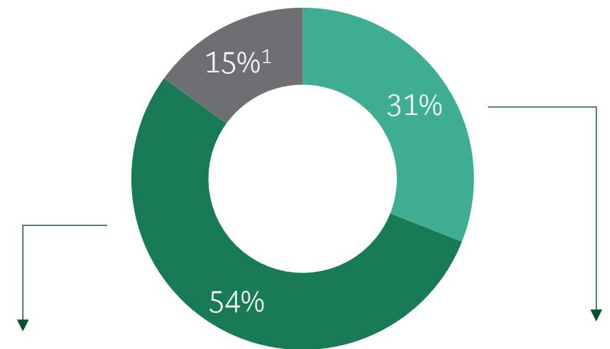
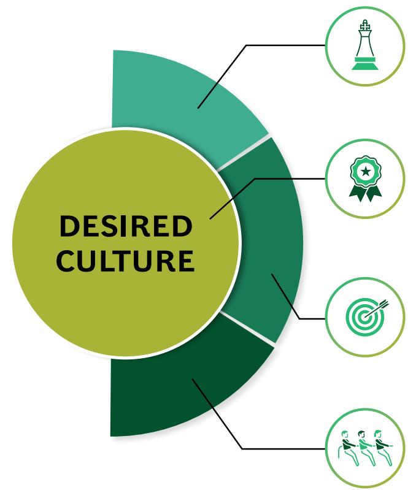
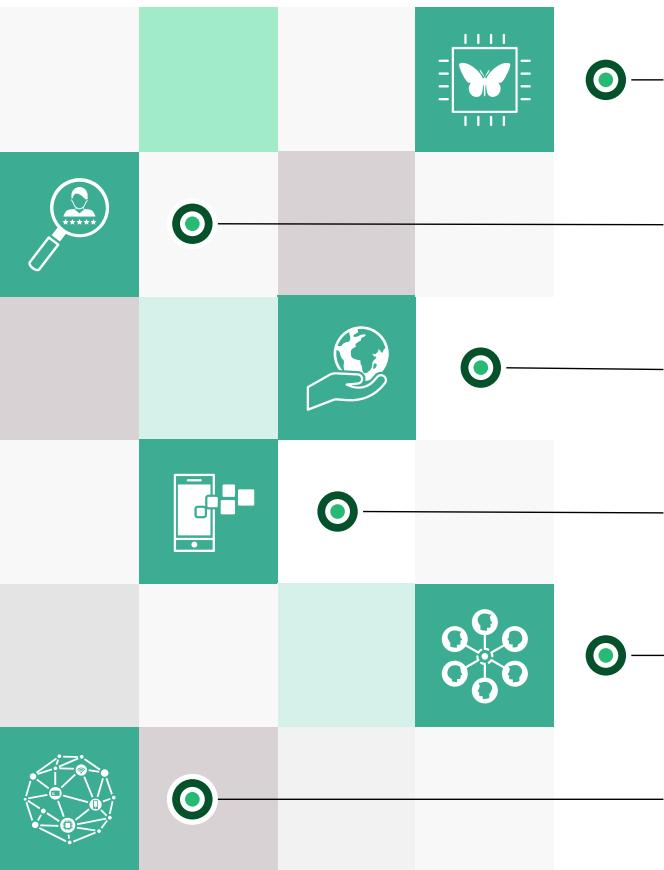

BCG

Executive Perspectives

## BCG's Guide to Cost and Growth

Strategic Insights for Navigating Economic Uncertainty

January 2025

## Introduction

The year ahead brings both opportunities and challenges as CEOs and executive leaders worldwide grapple with economic uncertainty and the need for strategic reinvestment. In our latest survey of over 570 executives across regions and industries (conducted at the close of 2024), we explored the primary concerns and strategies shaping business priorities for 2025.

Our research reveals that cost management remains a top priority amid fluctuating interest rates and global trade tensions. This edition synthesizes insights from CEOs and leading experts at BCG, providing a roadmap for sustainable margins and cost efficiency while positioning businesses for long-term growth.

This edition also delves into the factors critical to maintaining financial discipline in companies and explores how leaders can reinvest strategically to fuel competitive advantage in 2025.

In this BCG Executive Perspectives edition, we share executives' views on the 2025 macroeconomic outlook, with a focus on cost management and growth

## Executive summary | In a complex and uncertain economic environment, cost management remains the top priority for executives across industries

<table><tr><td>Navigating the economic landscape of 2025</td><td>The global market outlook for 2025 remains relatively steady, with declining optimism in 2025 relative to 2024 following the US election outcome40% of executives feel unprepared for market shocks in 2025, despite years of navigating disruptions (e.g., COVID, supply chain, ChatGPT)North American and European executives are increasingly concerned about margins and profitability as rising interest rates, inflation, and potential tariff and regulatory changes intensify pressureAsia-Pacific1 executives are concerned about impacts on exports that could slow economic growth as geopolitical tensions in the region could further erode investor confidence and disrupt global supply chainsIn the wake of the recent US election,85% of executives are already addressing tariffs and regulatory changes to mitigate potential disruptions</td></tr><tr><td>Managing cost structures in 2025</td><td>Amid a complex economic landscape,cost management remains executives’ top priorityHeading into 2025, executives are prioritizing cost efficiency in theircore operations including supply chain optimization and product portfolio simplificationto remain competitiveExecutives in the sample report thatonly 48% of cost-saving targets are achievedand that their companies struggle to maintain efficiencies Companies that announce but fail to achieve targets average9pp TSR underperformance compared with successful peersThe greatest barrier to lasting structural cost change is &quot;cultural resistance&quot; to cost-saving measures, but firms withactive focus to align culture on cost and efficiencies and agile management achieve up11% greater lasting cost reduction</td></tr><tr><td>Unlocking sustainable growth</td><td>Laying the foundations for sustainablecost management is vital, as67% of executives plan reinvest savings into growth and innovationExecutives view GenAI as a pillar for efficiency, with86% planning to invest in AI and advanced analytics in 2025Executives see GenAI and advanced analytics as anopportunity to cut costs in areas like customer serviceBCG’s holistic approach combines deep expertise and proprietary capabilities todeliver cost management programs that drive lasting savings, fuel growth, and tackle structural cost challenges</td></tr></table>

## BCG Executive Perspectives

AGENDA

Navigating the economic landscape of 2025
Managing cost structures in 2025
Unlocking sustainable growth

## Executives show caution regarding 2025 outlook amid economic and geopolitical uncertainty

How do executives view the stability of the markets they are operating in?

\- The US economy has remained strong and stable since COVID, despite threats of recession, with $\pm 2.2\%$ GDP growth $^{2}$ projected for 2025

• 42% of executives expect their markets to outperform the forecasted GDP growth

\- Nevertheless, concerns over global economic and geopolitical stability have arisen following the recent US election outcome

\- Despite economic challenges, optimism remains steady supported by low unemployment and a projected $\pm 1.5\%$ GDP growth $^{1}$ in 2025

• 47% of executives expect their markets to outperform the forecasted GDP growth

\- Pessimism likely reflects an uneven recovery since COVID, geopolitical tensions, armed conflicts, and energy concerns

\- Optimism has dropped in Asia $^{2}$ , despite the continuously strong GDP growth forecast of ±4.5% $^{3}$ for 2025

\- Yet 47% of executives expect their markets to outperform the forecasted GDP growth

\- Executives’ sentiment toward market stability has shifted further to neutrality following the recent US election outcome, as they are seeking early indications of potential tariffs and trade policy changes

## 40% of executives feel unprepared for market shocks heading into 2025

## How prepared are executives for market shocks heading into 2025?

40% of executives continue to feel unprepared for potential future market shocks, despite navigating years of disruptions like COVID, supply chain crises, the ChatGPT launch, and other economic upheavals

## Learn more about current challenges and risks:

## Geopolitical tensions and supply chain

Ongoing conflicts impact trade and market stability; companies should use scenario planning and diversify supply chains to enhance resilience

Read more about geopolitical risk management in strategic planning

## Rapid technological changes

Companies struggle to keep up with innovation yet need to adapt quickly by implementing new tech and upskilling employees

## Read more about the value in AI

## North American and European executives are increasingly concerned about margin pressure

What top macroeconomic factors do executives expect to affect their company performance in 2025?

North America

## Europe

## Asia-Pacific $^{1}$

  
Over 60% of executives expressed increased concerns about tariffs, following the recent US election outcome

North American and European executives are increasingly concerned about margins and profitability as high interest rates, inflation, potential changes in regulations, and tariffs intensify pressures

Protectionist measures introduced by the recently elected US government could reshape global trade dynamics, reducing trade flows and disrupting supply chain stability—even before considering potential retaliatory actions

These measures, aimed at boosting domestic US manufacturing, may accelerate local investments while discouraging offshoring. For Europe, this could exacerbate existing competitiveness challenges

## Asia-Pacific executives are concerned about impacts on exports that could slow economic growth

What top macroeconomic factors do executives expect to affect their company performance in 2025?

North America

Europe

Asia-Pacific $^{1}$

  
Over 60% of Asia-Pacific (excl. China) executives expressed increased concerns about economic uncertainty and tariffs, following the US election outcome

Asia-Pacific executives are navigating a complex economic environment marked by persistent inflation, varied monetary policy responses, and global trade uncertainties—all of which contribute to heightened concerns over inflation and interest rates

They are increasingly concerned about economic uncertainty stemming from the recent US election outcome, with recession risks and US-China trade tensions emerging as top underlying concerns

Potential geopolitical tensions in the region could further erode investor confidence and disrupt global supply chains, potentially reducing revenues and slowing economic growth in export-dependent Asia-Pacific economies

Note: Asia-Pacific countries excluding China  
Source: BCG global executive survey on strategic priorities (N=570) Q4 2024; BCG analysis  
1. Asia-Pacific includes India, Australia, Japan, and South Korea

1. No immediate actions taken in response to the US election outcome
Source: BCG global executive survey on strategic priorities (N=570) Q4 2024; BCG analysis

## Following the US election, 85% of executives are acting on tariffs and regulatory changes

## What actions are executives taking in response to the US election outcome?

## 54% are actively monitoring

What top indicators are executives tracking, given the recent US election outcome?

1. Tariffs changes

2. Regulatory changes

3. Geopolitical conflicts

4. Supply chain disruption

## 31% have launched contingency plans

What top initiatives have executives launched, given the recent US election outcome?

1. Planning response to tariffs changes

2. Assessing impact of regulatory changes

3. Redesigning supply chain

4. Reviewing geopolitical risks and business impacts

Executives across regions express concern for supply chain disruption, driven by the potential reinstatement or escalation of tariffs and trade barriers, which could significantly impact companies' performances in 2025

Corporate leaders globally are closely monitoring or assessing developments in geopolitical conflicts in Eastern Europe and the Middle East, along with US-China trade tensions, as potential sanctions and the economic isolation of certain countries could have significant impacts on business operations such as energy prices, supply chain disruption

Read more about managing geopolitical risk in the context of supply chains

## BCG Executive Perspectives

AGENDA

Navigating the economic landscape of 2025
Managing cost structures in 2025
Unlocking sustainable growth

## Cost management remains the top priority for executives across regions and industries

## What are the top three strategic priorities for executives heading into 2025?

## #1

## Cost management

33% of corporate leaders are prioritizing cost reduction as most critical, +8pp compared with 2024

## #2

## Growth/Expansion

Growth remains a focus, with 70% of executives reporting that they have sufficient mid-term visibility to make informed investment decisions

## #3

## Revenue management

Executives are looking into pricing strategies to manage potential rising supply chain costs while addressing end-consumer pressures

In a challenging economic landscape, companies that prioritize productivity growth through disciplined cost management will outperform those that choose to absorb margin pressures or pass costs on to consumers

## When it comes to cost efficiency, executives prioritize supply chain optimization and product portfolio simplification

What key cost drivers are executives prioritizing for optimization in 2025?

## Top ranking across industries

#1

Supply chain optimization #2

Product
portfolio
simplification #3

Operating
model and
workforce
productivity #4

Customer
service
operations #5

Sales
and
marketing

## Industries where each cost action is top-of-mind

Consumer

Industrials

Insurance

Technology

Finance

Industrials

Health care

Insurance

Finance

Technology

Consumer

While all companies prioritize cost management, there is no one-size-fits-all approach—it must be tailored to focus on areas that strengthen the industry’s competitive advantage

To remain competitive,
executives are prioritizing core
operations, optimizing supply
chains, and streamlining
product portfolios for cost
efficiency

Read more about our latest thinking on cost excellence

## A cost-efficient and resilient supply chain reinforces competitive advantage

## Supply chain optimization

Supply chains remain under
relentless pressure from multiple
directions:

\- Geopolitical crisis

• Uncertain macroeconomic outlook

• Climate change and pressure of net zero commitments

• Technology disruptions

• Changing consumer expectations

## Cost-efficient and resilient supply chains need to be managed across the value chain...

## Dimensions

Product

development

Planning

## Procurement

## Manufacturing

Logistics and transportation

## Warehousing

## Optimization levers

\- Modularize product design

\- Design solution-oriented for fast-cycled processes and reduced bottlenecks

• Leverage digital scenario planning

\- Engage AI in forecasting

\- Align processes between supply chain and manufacturing

\- Deploy strategic global sourcing to identify best suppliers

\- Ensure best prices through competitive tenders, benchmarking, should-cost models

• Enhance supplier relationship and develop joint innovation programs

• Conduct material flow and utilization analysis

\- Optimize plant layout and equipment

• Reassess service level and maintenance needs

\- Optimize logistics network

• Consolidate transport routes and explore shared services

\- Reduce "rush shipments"

• Consolidate warehousing

• Explore digitization and automation

\- Renegotiate capacity and rates

Read more about future-proof end-to-end supply chain transformations

## A design-to-value optimization approach ensures a lean and competitive product portfolio

## Product portfolio optimization

In fast-moving markets, growing product complexity and shifting priorities drive up structural costs and profitability pressures

• Product complexity and proliferation (e.g., too many SKUs)

\- Raw material and component costs

• Manufacturing overhead and supply chain complexity

• Inventory holding costs

• Product development and R&D costs

• Life cycle management costs

• Marketing and sales expenses

• Regulatory and compliance costs

## Focusing resources on high-value products while improving operation efficiency and reducing supply chain complexity

## Optimization levers

## #1

Eliminating the “tail” through consolidation to eliminate low-volume configurations while retaining volume and revenue

#2 A design-to-value approach with a customer-centric perspective helps to rebalance value and cost of the product portfolio

## Baseline setting

• Understanding customer voice

• Detailed cost breakdown

\- Gap analysis

## Idea generation

• Cross-functional workshops to rebalance value and cost

\- Benchmarking

## Implementation

• Ensuring customer and supplier alignment on design changes

• Monitoring progress

## Companies struggle to achieve their cost targets

Average proportion of
cost-saving target
achieved by companies

  
Proportion of
companies failed to
achieve long-lasting
structural cost cutting

Companies failing to meet cost targets underperformed on total shareholder return by an average of 9pp compared with the average TSR of peers that met their targets

## What were the biggest challenges to the success of past cost reduction efforts?

  
Employee and
organizational
culture

  
Change in mgmt.
(org. structure
and process)  
Skills/Expertise

  
Technical
infrastructure
and capabilities

Resistance to change can hinder implementation of new cost-saving measures and efficiency improvements; however, firms with aligned culture and agile management see up to 11% higher efficiency in cost reduction initiatives

## A cost-conscious organizational culture is essential for successful cost management

## Which measures are most effective for embedding cost awareness into daily operations?

## Company performance visibility

## 79%

What types of company performance information are most effective?

#1 Financial year targets and gaps

#2 Specific cost-saving achievements and initiatives

#3 Market trends and economic forecasts

## Communications from organization leadership

## 62%

What types of communication from leaders are most effective?

#1 Ensuring leaders model cost-conscious behavior

#2 Regular executive-led town halls

#3 Internal written updates from executives

Achieving cost excellence requires effective change management to secure employee buy-in

Clear communication and leadership transparency on company performance are key to embedding cost awareness into daily operations

Read more about how to sustain a cost-conscious culture over time

## BCG Executive Perspectives

AGENDA

Navigating the economic landscape of 2025
Managing cost structures in 2025
Unlocking sustainable growth

## Laying solid foundations is crucial, as 67% of executives plan to reinvest cost savings into growth

## Enduring cost management fosters continuous improvement of HOW work is done...

Of executives plan to invest savings from cost reduction efforts into growth

DESIRED CULTURE

## LEADER ENABLEMENT

HOW: Equip leaders with tools, visibility, and empowerment to identify and drive cost-saving initiatives

## DESIRED CULTURE

HOW: Foster a cost-aware and accountable culture by celebrating wins; encourage learning from successes and setbacks to drive ongoing improvement

## PEOPLE ENGAGEMENT

HOW: Align employees with cost reduction goals and growth vision; empower employees to join solutioning process; provide real-time feedback

## EXECUTIONAL CERTAINTY

HOW: Implement effective governance and tracking of cost reduction initiatives; hold employees accountable for progress

Learn more about cost management foundations

## Organizations plan to use cost savings to support strategic investments

## Strategic priorities vary for each organization, yet a few are highly relevant for most

<table><tr><td>Digital and AI</td><td>Accelerating digital adoption positions tech and digital as key to resilience and cost efficiency. Organizations need to quickly adapt tech capabilities like GenAI to boost efficiency and drive business growth Read more</td></tr><tr><td>Talent advancement</td><td>Competition for talent will persist, requiring companies to enhance their strategies through data-driven hiring, continuous skill development, and AI-driven processes Read more</td></tr><tr><td>Climate and sustainability</td><td>To bolster long-term sustainability and address climate challenges, leaders should invest in high-impact sustainable projects and align with climate benchmarks Read more</td></tr><tr><td>Supply chain of the future</td><td>Supply chains should leverage cross-functional coordination, digital integration, and rapid execution to enable seamless transformation, enhancing resilience and efficiency Read more</td></tr><tr><td>Operational excellence</td><td>Amid ongoing uncertainty, companies should shift from reactive cost-cutting to strategic efficiency by focusing on optimization and building sustainable competitive capabilities Read more</td></tr><tr><td>Business expansion</td><td>Successful top-line growth amid shifting global economic and geopolitical dynamics can be achieved by focusing on core markets while exploring new regions, sectors, and product lines Read more</td></tr></table>

## Executives see GenAI as a key pillar for future efficiency

## Which applications of GenAI and advanced analytics can drive significant near-term cost reductions?

Of executives plan to invest in AI and/or advanced analytics in 2025

Customer service

Sales and marketing

Support functions

R&D in engineering

Supply chain

50%

49%

47%

35%

31%

E.g., customer inquiries, call center insights, back-office processing

E.g., content creation and distribution, marketing insights, lead generation

E.g., financial planning and reporting, training, legal review

Investing in GenAI not only helps with cost reduction efforts, but also boosts productivity, scales capacity, and supports growth through continuous innovation

## Executives can also use GenAI to tackle their top three strategic priorities for 2025

## Cost management

Read more about unlocking impact with AI

## #1

Automating processes, optimizing supply chains, and improving operational efficiency:

• Decrease labor cost by automating tasks in areas like customer service and content creation

\- Use predictive models to enhance supply chain efficiency by forecasting demand and inventory levels

• Monitor and reduce energy consumption across facilities, directly impacting operating costs

## Growth/Expansion

## #2

Enabling employees to perform more complex tasks, speeding up workflows:

• Accelerate product development and innovation through AI, enhancing speed-to-market

\- Drive growth with AI-powered upselling, personalized marketing, and quick adaptation to new markets

\- Prioritize high-impact AI initiatives around large, homogenous resource pools, not just incremental automation

## #3

## Revenue management

Driving revenue by enhancing personalization and opening new revenue streams, including:

\- Improve customer retention and upselling (e.g., churn prediction, targeted retention strategies)

\- Enable personalized marketing (e.g., product recommendations, targeted campaigns)

\- Assist in product innovation and accelerate development processes

## BCG has deep expertise in cost management Partnering with your organization to craft a cost program that creates enduring impact

We leverage our unique strengths and approach to transform your organization, delivering lasting structural cost savings that fuel growth

<table><tr><td>Strategic cost optimization with growth focus</td><td>We design lean cost structures that drive savings without limiting growth, aligning cost management with your strategic objectives</td></tr><tr><td>Empowered culture and continuous improvement</td><td>We foster a culture of continuous improvement, empowering employees to take accountability, ensuring sustainable progress even after our engagement</td></tr><tr><td>Customized expertise and reliable execution</td><td>We deliver tailored cost solutions for competitive advantage leveraging our deep industry expertise, ensuring end-to-end focus and reliable outcomes</td></tr><tr><td>Advanced digital &amp; AI capabilities and data-driven insights</td><td>We embed cutting-edge digital and AI tools in operations, enabling data-driven decisions for enhanced operations efficiency and productivity</td></tr><tr><td>Collaborative partnership and lasting impact</td><td>We work hand-in-hand with your leaders, ensuring projects are co-created for lasting results that stick, with a “done with” partnership mentality</td></tr></table>

## BCG cost experts

## Paul Goydan

Managing Director & Senior Partner Houston

## Namit Puri

Managing Director & Senior Partner

New Delhi

## Karin von Funck

Managing Director

& Senior Partner

Munich

## Michael Grebe

Managing Director

& Senior Partner

Munich

## Jochen Schönfelder

Managing Director

& Senior Partner

Cologne

## Jacopo Brunelli

Managing Director & Senior Partner Milan

## Dwight Hutchins

Managing Director & Senior Partner Boston

## Kevin Kelley

Managing Director & Senior Partner Dallas

## Rashi Agarwal

Managing Director & Partner
New York

## Mai-Britt Poulsen

Managing Director & Senior Partner London

## Disclaimer

The services and materials provided by Boston Consulting Group (BCG) are subject to BCG's Standard Terms (a copy of which is available upon request) or such other agreement as may have been previously executed by BCG. BCG does not provide legal, accounting, or tax advice. The Client is responsible for obtaining independent advice concerning these matters. This advice may affect the guidance given by BCG. Further, BCG has made no undertaking to update these materials after the date hereof, notwithstanding that such information may become outdated or inaccurate.

The materials contained in this presentation are designed for the sole use by the board of directors or senior management of the Client and solely for the limited purposes described in the presentation. The materials shall not be copied or given to any person or entity other than the Client (“Third Party”) without the prior written consent of BCG. These materials serve only as the focus for discussion; they are incomplete without the accompanying oral commentary and may not be relied on as a stand-alone document. Further, Third Parties may not, and it is unreasonable for any Third Party to, rely on these materials for any purpose whatsoever. To the fullest extent permitted by law (and except to the extent otherwise agreed in a signed writing by BCG), BCG shall have no liability whatsoever to any Third Party, and any Third Party hereby waives any rights and claims it may have at any time against BCG with regard to the services, this presentation, or other materials, including the accuracy or completeness thereof. Receipt and review of this document shall be deemed agreement with and consideration for the foregoing.

BCG does not provide fairness opinions or valuations of market transactions, and these materials should not be relied on or construed as such. Further, the financial evaluations, projected market and financial information, and conclusions contained in these materials are based upon standard valuation methodologies, are not definitive forecasts, and are not guaranteed by BCG. BCG has used public and/or confidential data and assumptions provided to BCG by the Client. BCG has not independently verified the data and assumptions used in these analyses. Changes in the underlying data or operating assumptions will clearly impact the analyses and conclusions.

