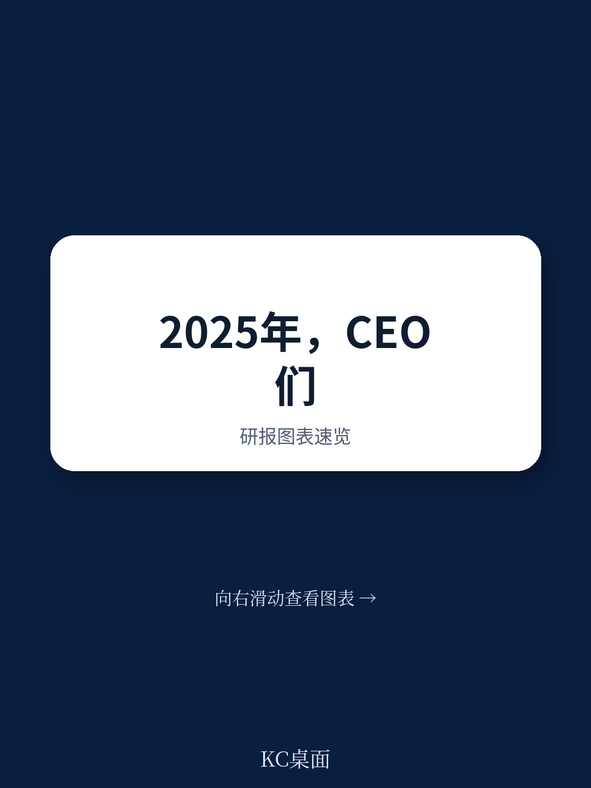
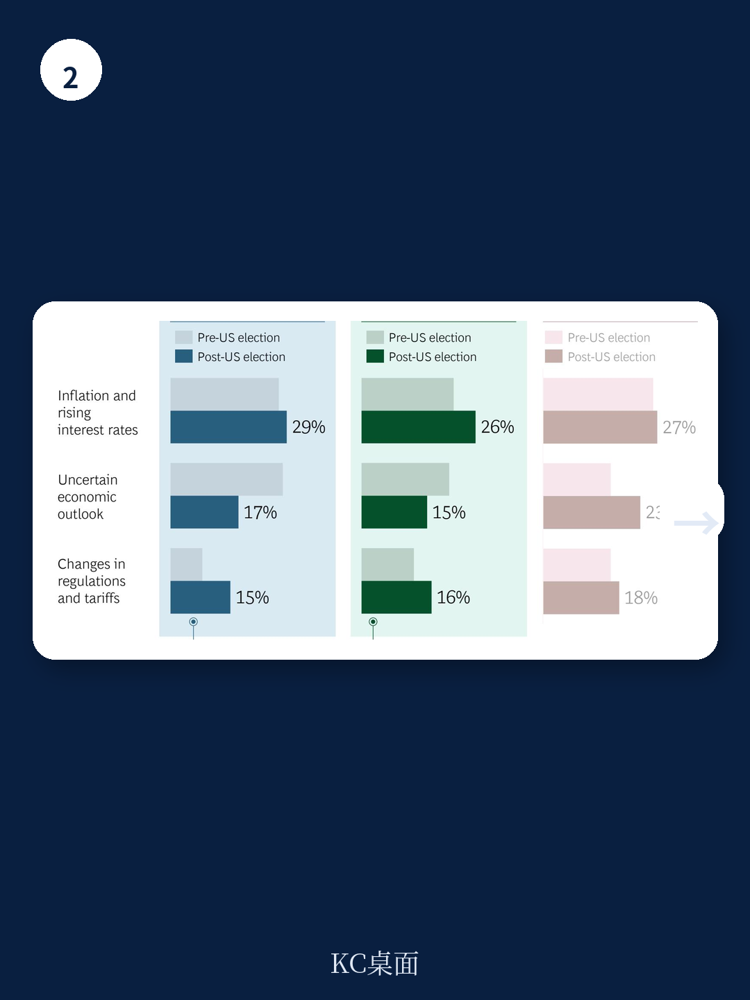

# 波士顿咨询：2024年调查显示低碳航运业务与近期数据观察

2025年企业战略优先级排序出现一个值得关注的变化。波士顿咨询在2024年底对全球570余名高管的调查显示，成本管理取代增长扩张，成为企业第一战略优先级，提及比例较2024年上升8个百分点至33%。与此同时，70%的受访者表示有足够的中期可见度来做出研究决策——这意味着企业并非在调整，而是在有选择地收紧。

这份报告的核心判断是：成本管理的重要性在上升，但企业执行能力存在系统性短板。调查显示，企业平均仅能实现48%的成本节约目标，且多数公司难以维持长期结构性降本效果。那些宣布目标但未能达成的企业，在股东总回报上比成功达成目标的同行平均落后9个百分点。

## 1. 成本目标达成率不足五成，文化阻力是最大障碍

报告披露了一个关键数据：企业平均只实现了不到一半的成本节约目标。在未能实现长期结构性成本削减的公司中，最大的障碍并非技术或资源不足，而是“员工与组织文化”层面的阻力。波士顿咨询指出，那些主动推动文化对齐、建立敏捷管理机制的企业，在成本削减效率上比同行高出最多11个百分点。

这一发现意味着，成本管理本质上是一个组织能力问题，而非单纯的财务或运营技术问题。企业如果只关注削减动作本身，而忽视组织对变化的接受度和执行惯性，最终效果往往大打折扣。

> **KC评论：** 48%的目标达成率说明，多数企业的成本削减计划在设计和执行之间存在显著落差。报告没有直接给出原因，但“文化阻力”被列为最大障碍这一点值得注意——它指向的是激励机制、沟通方式和组织惯性，而非预算数字本身。

## 2. 供应链优化与产品组合简化成为优先方向

在具体执行层面，企业将供应链优化列为成本管理的第一优先方向，其次是产品组合简化、运营模式与劳动力效率提升。不同行业的侧重点存在差异：消费品行业更关注供应链，工业品行业同样聚焦供应链，而保险和科技行业则更重视产品组合优化。

波士顿咨询认为，供应链优化需要覆盖从产品开发到仓储的全价值链，包括模块化设计、数字化情景规划、全球战略采购、物流网络整合等具体杠杆。产品组合优化的核心则是通过“设计到价值”方法，在客户视角下重新平衡产品价值与成本，尤其需要清理低销量、高复杂度的SKU尾部。

这些方向本身并不新颖，但报告将其与“成本目标达成率低”的事实并列，暗示了一个隐含判断：许多企业的成本削减方案过于粗放，缺乏对具体业务环节的精细拆解和针对性设计。

## 3. 区域差异反映不同不确定性暴露路径

报告按区域拆分了高管的关注点差异。北美和欧洲的高管对利润率和盈利能力的担忧在上升，主要不确定性来自高利率、通胀以及潜在的关税和监管变化。亚太地区（不含中国）的高管则更担心出口仍在调整和宏观环境不确定性，尤其是美国大选结果可能带来的贸易政策变化。

一个值得注意的数据是：85%的受访高管表示已经在着手应对关税和监管变化，其中54%处于积极监测阶段，31%已启动应急预案。供应链中断是各区域共同关注的不确定性点，但触发因素不同——北美和欧洲更关注关税和地缘冲突，亚太则更关注中美贸易紧张对出口的传导。

> **KC评论：** 85%的应对比例说明，企业并非被动等待政策落地，而是在不确定性中提前布局。但“监测”和“预案”之间的差距，也反映出多数企业仍在观望，尚未做出实质性结构调整。

## 4. 一个可复用的观察框架：成本管理的组织维度

报告虽然没有直接给出一个完整的分析框架，但从其调查逻辑中可以提炼出一个三层观察维度：第一层是目标设定是否合理，第二层是执行路径是否具体到业务环节，第三层是组织文化是否支持持续改进。多数企业的短板集中在第三层。

对于企业决策者而言，评估自身成本管理能力时，可以对照这三个维度做一次自检：目标是否与战略优先级一致？执行方案是否覆盖了供应链、产品组合、运营模式等具体领域？组织内部是否存在对成本削减的隐性抵抗？波士顿咨询的数据表明，前两个维度相对容易解决，第三个维度才是决定长期效果的关键变量。

报告没有给出具体的解决方案，但其调查数据已经勾勒出一个清晰的信号：2025年的竞争格局中，成本管理能力将成为区分企业表现的重要维度，而这一能力的核心不在于削减多少，而在于能否持续执行。
