# More than a Space Programme

## The Value of Space Exploration to Empower the Future of Europe

November 2023

## About the Report

This report provides the findings of a work by Boston Consulting Group (BCG) and the European Space Policy Institute (ESPI) to quantify the overall impact of Europe's Mission for Space Exploration. It is meant as a contribution to a plan for a transformation and invigoration of the European space ecosystem, as requested in the "Revolution Space" report published in March 2023 by the High-Level Advisory Group on Human and Robotic Space Exploration for Europe, and in preparation for the Space Summit held in Sevilla on 6-7 November 2023.

This report is a concise and publicly accessible rendition of the original study. The study was funded by ESA, as an independent assessment performed by ESPI and BCG. The findings and conclusion or recommendations expressed in the study are those of the authors and do not necessarily represent the views of ESA.

A three-step methodology has been employed to analyse the various economic benefits that Europe can gain from space exploration. These benefits encompass immediate economic returns, cross-fertilisation within the space industry, and significant broader improvements and outcomes for the economy and society at large.

The authors acknowledge that the study, by its mandate and very nature, reaches across classical boundaries of space programmes (e.g., launchers, exploration, space applications), which in most European programmes are traditionally defined and funded within their respective objectives, funding, and governance frameworks. The report however demonstrates that these benefits are inseparable and can only be achieved in full if addressed as a whole within a European space industry at scale and globally competitive. Indeed, the development of core space exploration capabilities is pivotal to unlock cross-fertilisation effects for the space industry and, therefore, enhance value generation for the broader economy and society.

The study also acknowledges that the precise quantification of the economic benefits, across individual domains of space programmes, and from the space economy into other sectors of the economy is still at an earlier stage of research and relatively new to the space community. It is however believed that the general assessment of such broader impact and the presented order of magnitude of impact provide valid indicators of actual impact.

Overall, it is in the hope of the authors that the study will contribute to a debate across those domains and the formulation of strategies that optimise synergies across different programmatic domains, as done by global space powers.

## Table of Contents

About the Report iii
1. Key findings 1
2. Introduction 3
2.1 Context 3
2.2 Rationales 5
2.3 Objectives 6
3. The value of space exploration 7
3.1 Economic and societal benefits of space exploration 8
3.1.1 Direct, indirect, and induced benefits 9
3.1.2 Catalytic benefits: economic 9
3.1.3 Catalytic benefits: (geo)political 10
3.1.4 Catalytic benefits: technological and scientific 11
3.1.5 Catalytic benefits: societal 12
3.2 Space exploration's cross-fertilisation benefits with the space industry 12
3.2.1 Application-specific and systemic benefits 12
3.2.2 Cross-fertilisation from launch and manufacturing capabilities 15
3.3 Benefits of space for the broader economy and society 21
3.3.1 Space and other critical sectors 21
3.3.2 Value of space for the broader economy and society 23
4. Time to act 29
5. Cost of inaction 32
6. Closing remarks 39
Appendix 42
A. Methodology for GDP impact estimation 42
A.1 Input-output analysis 43

A.2 Data sources 45  
A.3 Modelling approach 45  
A.4 Strengths and limitations 47  
B. Scope of space exploration activities 48  
C. Additional clarification on space economy vs global economy enhanced by space 51  
D. Gap analysis 53  
D.1 List of studies 58  
E. The SpaceX Case: How Funding Space Exploration Induces Commercial Market Leadership 60

## List of Figures

Figure 1. Different level of benefits from space exploration activities 8  
Figure 2. Estimated benefits of space exploration in Europe (2025-40) 9  
Figure 3. Human spaceflight missions for Falcon 9 and Soyuz launchers (2020-22) 13  
Figure 4. Share of HSE-related revenues for US and European players 14  
Figure 5. Cross-fertilisation potential from launch and manufacturing capabilities 16  
Figure 6. Revenue CAGR and EBITDA margin for space OEMs 18  
Figure 7. Value of space launch market in 2015-40, by application 19  
Figure 8. Value of space manufacturing market in 2015-40, by application 20  
Figure 9. Comparable industries to space 21  
Figure 10. Space industry exceptional funding in Europe compared to other industries 22  
Figure 11. Space industry multiplier on the broader economy and society 23  
Figure 12. Value of space for economy & society in 2022, by industry 24  
Figure 13. Selected examples of space enhancement across sectors 25  
Figure 14. Main drivers of space technology adoption 26  
Figure 15. Evolution of value of space for economy & society (2022-40) 27  
Figure 16. Time for orbital capabilities and manufacturing cost for space station OEMs 30  
Figure 17. Cost of inaction related to direct, indirect, induced, and catalytic benefits 33  
Figure 18. Cost of inaction related to European space industry size and competitiveness 34  
Figure 19. Key examples of lost opportunities 37  
Figure 20. Space exploration comprehensive benefits for Europe in 2025-40 40  
Figure 21. Space exploration intangible benefits for Europe in 2025-40 41  
Figure 22. Cumulative GDP and average FTEs linked to space exploration in Europe ('25-40) 42  
Figure 23. Methodology for direct, indirect, induced impact calculation 45  
Figure 24. Comparison of European space exploration investment and NASA impacts 46  
Figure 25. Methodology for catalytic impact calculation 47  
Figure 26. Space economy taxonomy 51

Figure 28. SpaceX institutional support through Space Act Agreements (SAA) in COTS, NASA commercial crew contracts and private capital raising (\$ million)

## List of Tables

Table 1. Rationale behind chosen indicators....57
Table 2. List of studies....59
Table 3. SpaceX Company Valuation and Revenue Multiplier....63

## List of Abbreviations

<table><tr><td>CAGR</td><td>Compound Annual Growth Rate</td></tr><tr><td>C4ISR</td><td>Command, Control, Communications, Computers, Intelligence, Surveillance and Reconnaissance</td></tr><tr><td>EO</td><td>Earth Observation</td></tr><tr><td>FMS</td><td>Fleet Management System</td></tr><tr><td>GDP</td><td>Gross Domestic Product</td></tr><tr><td>GEO</td><td>Geostationary Earth Orbit</td></tr><tr><td>GNC</td><td>Guidance, Navigation, and Control</td></tr><tr><td>GNSS</td><td>Global Navigation Satellite System</td></tr><tr><td>HSE</td><td>Human Space Exploration</td></tr><tr><td>ILRS</td><td>International Lunar Research Station</td></tr><tr><td>ISRU</td><td>In-Situ Resource Utilisation</td></tr><tr><td>ISS</td><td>International Space Station</td></tr><tr><td>LEO</td><td>Low Earth Orbit</td></tr><tr><td>MDS</td><td>Missile Defence Systems</td></tr><tr><td>MEO</td><td>Medium Earth Orbit</td></tr><tr><td>OEM</td><td>Original Equipment Manufacturer</td></tr><tr><td>PNT</td><td>Positioning, Navigation, and Timing</td></tr><tr><td>SatCom</td><td>Satellite Communications</td></tr><tr><td>SBSP</td><td>Space-Based Solar Power</td></tr><tr><td>SWE</td><td>Space Weather Events</td></tr><tr><td>SSA</td><td>Space Situational Awareness</td></tr><tr><td>TSR</td><td>Total Shareholder Return</td></tr></table>

## 1. Key findings

The report shows that the implementation of a major European space exploration programme would allow to generate a GDP multiplier effect of >5x the overall budget. Considering an investment of €50 billion between 2025 and 2040, the estimated benefits would amount to a cumulative GDP impact of at least €260 billion and an average of 90,000 FTEs created over the same period.

The impact distinguishes a multiplier of 3x resulting in a GDP impact of €150 billion...

\- In terms of direct economic benefits, the investment is anticipated to contribute to €25 billion of direct cumulative GDP impact through the value added generated by an average of 4,000 new space exploration-related FTEs. In addition, procurement expenditures are projected to generate \~€70 billion of indirect GDP impact within the European space industry. Finally, the budget's injection into the economy is anticipated to increase household spending of employees in the space sector within the broader supply chain, further contributing to \~€55 billion of induced cumulative GDP impact throughout the 2025-40 timeframe.

... and a further GDP impact of €110 billion, thus resulting in a total multiplier of >5x:

\- In terms of catalytic benefits, Europe's investment will generate \~€110 billion of incremental GDP contribution within the 2025-40 timeframe. The lion's share of this contribution (€85 billion) will stem from new space markets, including space travel, in-space R&D and manufacturing, in-orbit services, and edge computing. Additionally, a renewed focus on space innovation driven by investment in space exploration is also expected to generate a GDP impact of \~€10 billion between 2025-40 from technological spinoffs as well as an increase in GDP of \~€15 billion through the comparably higher productivity and value generation of STEM jobs.

Together with the direct, indirect, induced, and catalytic economic gains, space exploration provides cross-fertilisation effects across different elements of the broader space sector, by both supporting the overall development of the space economy and generating improvements in critical capabilities that strengthen companies' competitiveness. In both cases, investment in space exploration goes beyond its own borders and positively affects other core European capabilities across the whole space ecosystem (e.g., launch capabilities).

Looking at the US, the correlation between space exploration expenditures and industry competitiveness can also be observed, particularly considering SpaceX and its transformative impact on the entire ecosystem. Indeed, as shown in Annex E, SpaceX's business model was mostly enabled by the initial support provided by public institutions (e.g., NASA) in exploration and space transportation.

The value created by space exploration for the broader space economy manifests itself in systemic benefits that provide critical size, bolster the industrial ecosystem, and promote synergies with other space domains (e.g., industrial capability as part of security policy).

The report also shows that due to its role in providing scale to the industrial ecosystem, in enabling economies of scale, and serving as a vehicle for increasing competitiveness, investment in space exploration cannot be dissociated from the overall investment in space and the economic benefits enhanced by space, beyond the space programme, for the whole economy and its sectors. Indeed, as a prominent element of space programmes across all space powers, exploration is central to the creation of a resilient space industrial landscape, often linked to strategic capabilities in security and defence, and to the benefit of other applications too. In short, exploration impacts space and the broader economy as enhancement of key economic activities in sectors like telecom and defence.

The value of the space economy in 2022 is \~\$460 billion, whereas the estimated value of space for the broader economy amounts to \~\$3.1 trillion in the same year. This estimation is built on the analysis of 15+ business cases across different industries, where space demonstrates its enabling effects in terms of creating new markets, generating incremental value-added, and enabling core industries.

Looking at the future, the estimated value the space economy will reach \$1 trillion in 2040, while the value of space for the broader economy and society is projected to reach approximately \$7.9 trillion, leading to a cumulative impact of over \$80 trillion between 2025 and 2040.

While the economic benefits of space exploration and space at large are promising, there are several risks that must be carefully managed for its full realisation. Firstly, budget deployment is critical, as resources must be allocated appropriately, deployed in a timely manner, and distributed effectively among key stakeholders and across existing silos between space domains in Europe. The ability to attract private capital is also essential, particularly in establishing the necessary infrastructure at European level to develop effective public-private partnerships. Moreover, a strategy without strong own capabilities and relaying mainly on cooperation with other countries as a junior partner poses a risk, as Europe would only support an established market of leading space powers, a market outside Europe, which would potentially represent a more attractive target for private investors. Lastly, the risk associated with human exploration activities cannot be ignored as the occurrence of severe accidents could temporarily halt missions, thus hindering the realization of these benefits. Coordinated planning and ad hoc risk mitigation strategies will be essential to navigate these challenges successfully and seize the Space Revolution opportunity. Ultimately, a related space strategy would require dedicated efforts to include space in strategies of other sectors, like the European Green Deal and Digital Strategy.

## 2. Introduction

## 2.1 Context

The space industry is a critical sector for government investments with tremendous potential in the future. Space represents a substantial market that exceeded expectations in 2022, achieving a remarkable \$464 billion size, growing higher than previous forecasts at an impressive 6% CAGR and it is foreseen to reach \$1 trillion by 2040. Moreover, the industry plays a pivotal role in fostering the creation of highly skilled employment and driving innovation spinoffs across multiple sectors.

The space industry's contribution extends beyond economic value as it profoundly impacts society and positively influences the lives of people on Earth. For example, space technologies significantly contribute to achieving sustainable development goals (SDGs) and are core enablers in realizing the net-zero climate change ambitions set by COP27 with 50% of essential climate variables only measurable from space. Additionally, they also actively assist disaster responses and crisis management. Indeed, 400+ international relief efforts are supported by earth observation imagery, navigation, or satellite communications, and 600+ remote sensing satellites survey across borders.

The space industry is currently experiencing an unprecedented momentum. Over the last decade, the industry has grown remarkably, boasting more than 1,000 active space companies in 2022, compared to around 600 in 2012 $^{1}$ . The number of satellites launched annually has surged from an average of \~300 from 2010-19 to 2,000+ in 2022, with a significant portion driven by Starlink. Consistently, in-orbit services are being developed to sustain orbital infrastructures (e.g., satellite refuelling). Similarly, the need for Space Traffic Management services and Space Situational Awareness (SSA) has become evident, as happened with the International Space Station (ISS) performing three manoeuvres in 2022 to avoid debris collision, compared to a total of 33 since 1999.

The space sector's growth has also sparked intense competition. NATO has declared space as the $5^{\text{th}}$ battleground and the United States has set up an independent Space Force. Governments worldwide are allocating substantial resources, with spending in 2022 surpassing \$100 billion, representing a $9\%$ year-on-year increase from 2021, driven mainly by defence-related endeavours. Key countries are prioritizing their space initiatives, and new nations are entering the arena. However, despite representing circa 25% of global GDP, Europe only covers a 15% share (\~€15 billion) of the total government budgets allocated to space.

The capital influx into the industry is substantial, with significant investments coming from both government institutions and private investors. The commercialisation potential of space has driven considerable private funds, particularly from the United States and China. Even in Europe, investments in space start-ups reached a significant threshold of €1 billion in 2022, marking a 65% increase compared to the previous year, with Venture Capital accounting for approximately 75% of the total $^{2}$ .

Space exploration is a core engine of all these transformations, and investments and developments in space exploration are on the rise globally. The international space exploration landscape sets the beginning of a new historical juncture. In LEO, the development of sovereign space stations has already been showcased. While China's space station is operational, India will likely have its own orbital infrastructure soon after the ISS era together with Russia, despite not in the near term. Additionally, US OEMs, often supported by NASA, are also leading the way towards nascent commercial LEO space stations (i.e., Axiom station, Northrop Grumman station, Orbital Reef, Starlab, Haven-1). In this context, Europe risks to become a junior partner contributing only to the development of one of the five US main stations, which will compete for CLD funding in the coming years. Beyond LEO, the Moon has re-emerged as a key target for human space exploration activities of the major spacefaring nations. On this front, the three leading space powers, the United States, China, and Russia, all have plans for landing and sustaining their respective astronauts, taikonauts and cosmonauts on the lunar surface within the next decade.

In this rapidly evolving context, today Europe still has the opportunity to also become a transformative player in the unfolding space revolution.

## 2.2 Rationales

In 2023, ESPI supported the High-Level Advisory Group (HLAG) in the preparation of the report “Revolution Space”. This report marked a decisive moment in showcasing the strategic importance of space exploration activities and outlining how Europe must stand to benefit from increased participation. The study laid the foundation for defining the advantages of heightened involvement and proposed an initial roadmap for a European strategy.

Subsequently, it was evident that the critical relevance of the subject required a clear and comprehensive categorization and quantification of the benefits that it would bring to Europe. To achieve this, ESPI, in collaboration with BCG, orchestrated internal research to offer a thorough assessment of these benefits.

Integral to the realisation of this report was the gap analysis conducted by the ESPI research team, which is presented in Annex D. It involves a review of a diverse range of existing research studies (listed in Annex D.1), selected considering their alignment with the scope of this report. It provides an overview of the existing knowledge and analysis conducted by other stakeholders in the past on the socio-economic benefits derived from space activities.

The purpose of this exercise is to highlight and identify blind spots and deficiencies in their evaluation of the benefits of space (exploration). In addition, the gap analysis supported both the conceptual and methodological objectives of this report itself.

While the aim of the gap analysis is mostly to highlight and identify blind spots and deficiencies in their evaluation of the benefits of space (exploration), the exercise also supports the delineation of the conceptual and methodological objectives of the report itself. On one hand, the gap analysis serves as a baseline to identify any deficiencies in previous studies and the need for new holistic research integrations. On the other hand, insights from previous research were expected to provide the study team with methodological guidance.

Given the vast extent and dimensions of the socio-economic benefits for Europe, it is essential to undertake multifaceted efforts to clarify and communicate these advantages to relevant decision makers. Having an impactful and established tradition of studies that address the benefits of space is thus of paramount importance. However, previous research often proves to have narrow scopes or partial intents, highlighting the necessity for a new assessment that strives to meet the highest target of completeness and meaningfulness.

## 2.3 Objectives

The objective of this report is to share the findings of a study conducted to quantify the induced and catalytic economic impact of Europe's Mission for Space Exploration. This assessment has been requested by the High-Level Advisory Group Report “Revolution Space” in preparation for the 2023 Space Summit. A three-step methodology has been employed to analyse the various benefits that Europe stands to gain from space exploration. These benefits encompass direct economic returns, cross-fertilisation within space industry, and broader advantages for society.

The first step of the analysis evaluates the impact of direct, indirect, induced, and catalytic benefits of space exploration in Europe. The first three are calculated starting from an assumption on future direct investments in the sector, which are set to stimulate economic output and job creation along the value chain. Meanwhile, additional catalytic benefits will arise from the unlocking effect of space exploration on new markets within the space industry.

In the second step, the study focuses on the cross-fertilisation benefits of space exploration for the overall space economy. This section investigates how exploration activities enable broader space capabilities, providing both application-specific and systemic benefits to the space economy. Additional benefits that the European upstream industry stands to gain from space exploration investments will also be assessed.

The third step of the analysis is dedicated to exploring the broader economic and societal value of space. In this step, 15+ business cases spanning across 10+ industries have been assessed. The culmination of this assessment is expressed through an economic multiplier, providing a comprehensive synthesis of the overall impact.

Finally, the study focuses on the expected outlook of the space sector, marked by a pivotal moment of evolution, influenced by geopolitical challenges and a growing emphasis on commercialisation. To do so, an evaluation of the cost of inaction and the necessity of a timely effort is presented, considering the potential consequences of declining market shares and reduced competitiveness for key European players in the space industry.

The authors acknowledge that the study, by its mandate and very nature, reaches across classical boundaries of space programmes (launchers, exploration, applications, etc.), which are traditionally defined and funded within their respective funding and governance frameworks. It is in the hope of the authors that the study will contribute to a debate across those domains and the formulation of strategies that optimise synergies across different programmatic domains, as done by global space powers.

## 3. The value of space exploration

Space exploration provides distinct levels of benefits that stem from the direct contribution of its core activities and propagate up to the level of the broader economy and society (Figure 1).

Benefits of space exploration arise from a dedicated investment in core space exploration activities, which consequently generate direct contribution in terms of gross value added and employment at central level. The increased contracting volume within the European space supply chain, and the consequent boost of household spending, in turn produce indirect and induced benefits in the form of incremental GDP and job creation. Finally, catalytic effects emerge from the development of core capabilities and solutions driven by the investment in space exploration activities, embracing multiple impact categories such as economic (e.g., growth of space travel), (geo)political (e.g., establishment of international cooperation agreements), technological (e.g., spin-offs) and societal (e.g., growth of STEM talent).

Space exploration also benefits the space industry via strong cross-fertilisation effects. Indeed, space exploration capabilities contribute to advance the industry both at the level of specific applications (e.g., launchers) and at systemic level on the overall sector's competitiveness and start-up ecosystem growth, hence enabling a thriving and more resilient space industry developing services and solutions across multiple sectors of the global economy.

The value of space exploration, through its relevance for the space industry, further extends to the broader economy and society. Space is indeed a critical enabler of key economic activities (e.g., transportation) and provides direct contribution to societal needs and long-term existential threats mitigation (e.g., water and food scarcity, climate change and energy crisis, geopolitical posture, and defence capabilities).

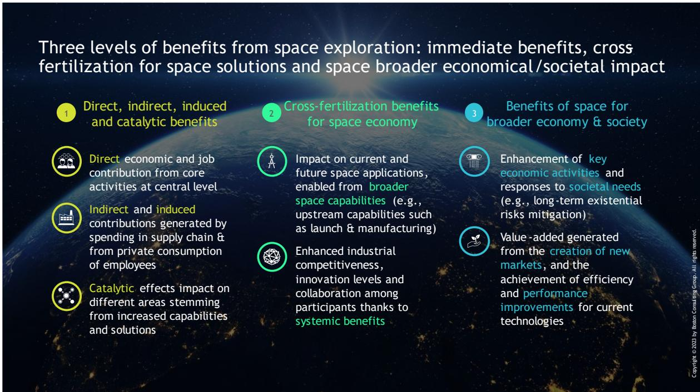  
Figure 1. Different level of benefits from space exploration activities

## 3.1 Economic and societal benefits of space exploration

Space exploration has the potential to create at least \~€260 billion of cumulative GDP impact and an average of \~90,000 FTEs in Europe between 2025 and 2040 (Figure 2). The investment in space exploration is estimated to generate the largest share of total benefits (\~60%) and to enable catalytic effects, accounting for the remaining proportion (\~40%) of cumulative impact. Additional sizable benefits are expected after the 2040-time horizon as the emergence of future markets such as space-based solar power and in-situ resources utilisation will likely realize their full potential.

These benefits could only be unlocked through a significant step up in investments and focus from Member States and, consequently, ESA. Particularly, the underlying assumption is for space exploration-dedicated funding to grow from the current investment of less than €1 billion to more than €3 billion per year, with an overall commitment of \~€50 billion in the 2025-40-time horizon, leading to a multiplier effect of over 5 times the total budget.

These resources shall be deployed to design and implement a European Space Mission establishing an independent European presence in Earth orbit, lunar orbit, on the Moon, and beyond, including a European Commercial LEO Station, cargo and crew capabilities for the Gateway and the Moon, and sustained presence on the lunar surface.

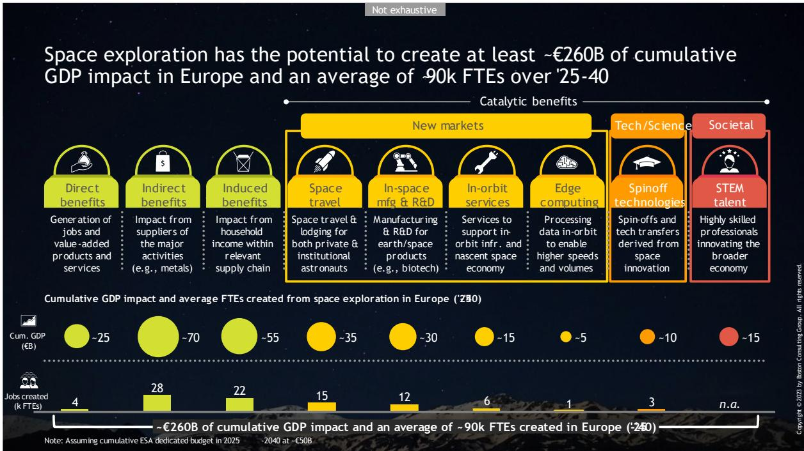  
Figure 2. Estimated benefits of space exploration in Europe (2025-40)

## 3.1.1 Direct, indirect, and induced benefits

To sustain the development of European space exploration capabilities, the funding will need to be directed towards the procurement of relevant goods and services as well as in the growth of space exploration employment within the European space ecosystem. Investment in space human capital is expected to contribute to €25 billion direct cumulative GDP via the value added generated by an average of 4,000 new space exploration-related employees, in line with previous studies conducted by NASA. On the other hand, ESA procurement expenditure is expected to generate \~€70 billion of indirect GDP impact from higher business-to-business spending within the Agency's supply chain. Finally, the budget injection within the economy is anticipated to increase household spending of both ESA employees and others within the broader supply chain, further contributing to \~€55 billion of induced cumulative GDP impact.

## 3.1.2 Catalytic benefits: economic

Europe's investment will develop core space exploration capabilities and unlock the potential of new markets, particularly in-space R&D and manufacturing, in-orbit services, edge computing, and space travel. The renewed focus on space exploration, alongside the development of critical technological and industrial capabilities, will allow Europe to capture its fair share of these nascent markets, totalling up to at least \~€85 billion of incremental GDP contribution within the 2025-

40 timeframe (please refer to the sections below for a more detailed breakdown of catalytic benefits).

Catalytic effects will produce broader benefits than their economic contributions and employment generation. For example, the space travel market will support the development of new space access capabilities and infrastructures (e.g., spaceports). In Europe, frequency of space access is expected to reach over ten crewed launches per year by 2040. Total station pressurized volume in orbit will dramatically expand from the current $\sim 1,300\mathrm{m}^3$ on the ISS and Tiangong to over $3,500\mathrm{m}^3$ across the multiple stations managed by both institutional and commercial players (e.g., Axiom). Consequently, the number of scientific experiments is anticipated to grow exponentially from the $\sim 700$ research projects conducted on the ISS over the past 5 years. Similarly, in-space R&D and manufacturing will boost the creation of new products (e.g., artificial retinas), but also the quality of those same products manufactured on Earth.

The total size of cumulative GDP impact can potentially grow even further beyond the current estimates as there are certain benefits that go even beyond catalytic effects and the timeframe of this study. For instance, this report does not consider the upside of emerging capabilities and markets such as space-based solar power and in-situ resources utilisation (e.g., Moon, asteroids). It is assumed that until 2050, SBSP alone could yield over €750 billion in total net benefits for Europe $^{3}$ . While these areas might contribute with additional, sizable benefits, they are currently in nascent stage and their full potential is likely to fully materialize beyond 2040.

## 3.1.3 Catalytic benefits: (geo)political

The geopolitical benefits of space exploration encompass several key aspects that further highlight the importance of a major European space exploration mission. First, space exploration substantially reinforces a nation's strategic sovereignty and contributes to ensuring an independent access to space. Secondly, it increases soft power, strengthens the means to build partnerships and creates lock-in effects via space collaborations (e.g., Artemis programme). In fact, stronger European capabilities in space exploration would benefit both Europe and its international partners and would directly contribute to improving space assets' resilience and diversification. In addition, a strong presence in space exploration positively influences a country's projection of power, extending its influence across interconnected fields (e.g., security). Lastly, a competitive stance in space exploration enables the acquisition of strategic footholds in uncharted domains that are still unconquered (e.g., US and China intersecting plans for a lunar base on South Pole and their ambitions in resources exploitation).

From a security perspective, advanced industrial capabilities in space exploration would promote synergies and bring dual use solutions that benefit the broader defence industry ecosystem. Specifically, it would enhance multi-domain operations, increase the scope of current security alliances, and provide Ministries of Defence with critical innovations necessary to maintain a competitive advantage.

## 3.1.4 Catalytic benefits: technological and scientific

In the past two decades, several technologies developed for space exploration have spun off to other use cases and applications. In Europe, the renewed focus on space innovation driven by investment in space exploration is expected to generate technological spinoffs for a total cumulative GDP impact of \~€10 billion between 2025-40.

Spinoffs are among the key components of technological benefits from space exploration activities. Only between 2000 and 2015, NASA has contributed to the creation of over 600 technologies and more than 20,000 FTEs for a cumulative value creation of \~€23 billion within the same period. Notable examples of these spin-off are the LADAR laser, memory foam, and enriched baby food. Similarly, between 2005 and 2015, ESA has supported the creation of over 150 technologies and 2,500 FTEs. Water filtration (in collaboration with NASA), cryo-freezing, and protein production are among the major examples of the new markets generated. It should be noted that advanced technological applications enable country-wide productivity increments, constituting a key driver for economic growth.

Scientific progress is another fundamental advantage derived from space exploration activities. Involvement in the International Space Station (ISS), notably through the European Columbus laboratory, and missions extending beyond low Earth orbit (BLEO), play a vital role in advancing knowledge and practical applications across multiple fields such as life support, microgravity fluid dynamics, material research, propulsion, and space physics. Additionally, lunar initiatives offer extensive benefits in advancing geology, solar system science, new materials, understanding the origin of the Moon, and comprehending its impact on Earth. Mars missions further contribute to long-term impact and benefits through the study of life and water detection, geology, and climate evolution.

## 3.1.5 Catalytic benefits: societal

Space exploration has historically been a driving force of inspiration and national pride since the first human flight of Yuri Gagarin in 1961. The heightened focus and attractiveness of space and its inspirational power generate positive impacts in engaging younger generations towards STEM disciplines. Investment in space exploration is indeed expected to grow STEM talent in Europe and generate an increase in GDP of \~€15 billion over 2025-40, driven by their comparably higher productivity in value-adding jobs.

Space and human exploration further contribute to society by providing key solutions to monitor and manage long-term European existential risks, such as strategic independence for European defence and security, climate change monitoring, as well as water management and migration flows coordination and oversight.

"People ask why we invest in space and not in climate change, but we would not know about climate change if we had not invested in space."

Mike Gold

Former Maxar Civil Space VP and NASA Director

## 3.2 Space exploration's cross-fertilisation benefits with the space industry

Space exploration provides cross-fertilisation effects across different elements of the broader space sector. Particularly, it is possible to distinguish between benefits supporting the development of the space economy and improvements in critical upstream capabilities, which strengthen industrial competitiveness.

In both cases, additional investment in space exploration goes beyond its own borders, and positively impacts other core European capabilities across the whole space ecosystem. In fact, the spread of benefits stemming from stronger European capabilities in space exploration will contribute to higher robustness and resilience of its space industry in general. It is therefore as important to invest in space exploration activities as to invest in application-specific technologies.

## 3.2.1 Application-specific and systemic benefits

The value created by space exploration for the broader space economy manifests itself in two dimensions. First, additional missions and innovation efforts lead to application-specific enhancements for both existing and future market segments (which only are partially covered in traditional SEI assessments). On the other hand, an increase in investments enables systemic benefits that bolster the industrial ecosystem and promote synergies with other terrestrial and space domains (e.g., security).

## 3.2.1.1 Application-specific benefits

Launch capabilities are subject to significant economies of scale, as companies performing a higher number of launches can increase their efficiency, reliability, and reactiveness.

The boost in volume of launch activities from exploration missions, particularly human spaceflight missions, would strengthen launch and exploration capabilities, benefiting other applications too. For instance, human space exploration (HSE) missions covered a 30-35% share of non-constellation launches for Falcon 9 and Soyuz launchers over the last three years, thus generating significant economies of scale effects (Figure 3). However, compared to the US, Europe is lagging on this front, relying on foreign support for the provision of such services.

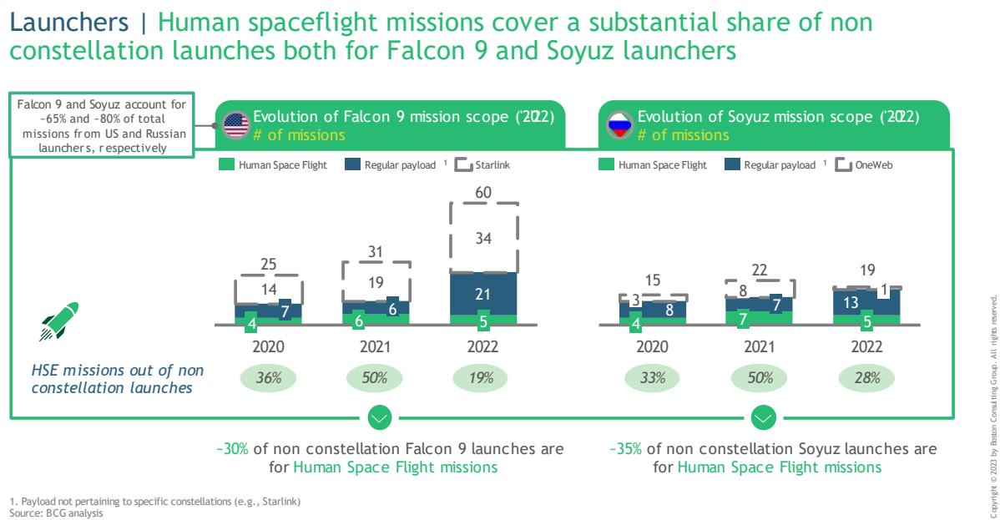  
Figure 3. Human spaceflight missions for Falcon 9 and Soyuz launchers (2020-22)

Additionally, the development of the future space economy, which will mainly consist of services to support and maximize the value of space assets and LEO commercialisation, will require specific technological advancements. Among others, space exploration sustains innovation in technologies that benefit the growing in-orbit services capabilities (and vice versa). Indeed, in-orbit services and spacecrafts share core technological capabilities (i.e., thrusters, avionics, Guidance, Navigation, and Control (GNC), on board computers, docking & rendezvous), whose improvement allows for a faster and more efficient roll-out.

## 3.2.1.2 Systemic benefits

World-class space capabilities are strongly correlated with the overall industrial development within the country, especially since the existence of an industrial ecosystem fosters competition, innovation, and collaboration among market participants. Therefore, investments in industrial development are key to pursue these objectives. In addition, they have the potential to support the creation of a resilient industrial infrastructure, expanding the benefits of existing capabilities (e.g., Earth Observation) and new applications. For instance, the three leading space OEMs in the US, Lockheed Martin, Boeing, SpaceX (with \~35% of revenues from HSE), generated an average of \~€1.4 billion/year in 2022 from human space exploration activities, which is 5x the total HSE volume of the only two European space OEMs active in HSE, i.e., Airbus Defence & Space and Thales Alenia Space (Figure 4).

In this context, it is also important to remember that SpaceX's business model was mostly enabled by the support provided by public institutions (e.g., NASA) in exploration and space transportation (Annex E), although today its impact is more visible in commercial markets through Starlink, in a connectivity market roughly 100 times bigger than that of launchers. This approximately represents $80\%$ of SpaceX valuation.

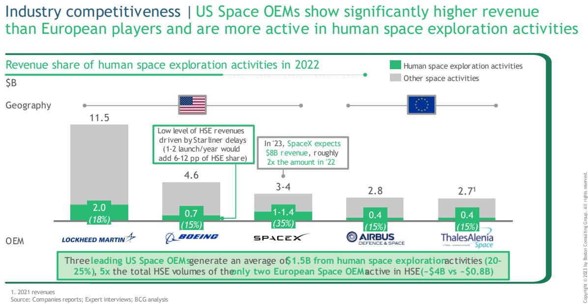  
Figure 4. Share of HSE-related revenues for US and European players

Furthermore, space start-ups aiming to raise capital to develop their business can gain significant more traction with investors when supported by a larger addressable market. In the US, public space budgets currently drive \~3x private investments compared to Europe (\$6 billion in the US compared to \$2 billion per year over the last three years in Europe). It is worth noticing that among the \$6 billion invested per year in the US, \~\$3 billion are focused on companies active in HSE (e.g., SpaceX, Blue Origin, Sierra Space, Axiom). It is also important to highlight the multiplier effect that a focused investment in space start-ups can have on the overall ecosystem. From the capital raised to develop launch technologies, SpaceX was then able to expand its portfolio of offerings (e.g., Starlink, Starshield) and unlock capabilities that benefit the broader industry, both in space and on earth. Larger space exploration investments can therefore foster the growth of a European space start-up ecosystem by expanding their addressable markets and increasing their competitiveness. Furthermore, they are also expected to support the birth of \~160 tech spinoffs between 2025-40.

Lastly, space capabilities derived from civil uses are increasingly benefitting security applications (e.g., Maxar Earth Observation solutions or Starlink services in Ukraine), especially since harnessing cutting-edge civil space capabilities promotes synergies across the two domains. This is particularly true for Defence agencies which are expressing a growing need of innovation that cannot be satisfied by their current capabilities. Hence, they are increasingly leveraging innovative private players to broaden their span of capabilities (e.g., National Reconnaissance Office (NRO) via hyperspectral study contracts) or increasing their own resilience (e.g., US Space Force National Security Space Launch (NSSL) Phase 3).

"The loss of space-based communications and navigation services could have a devastating impact on warfighters during a conflict."

Lieut. Gen. Scott Berrier

Director, US Defence Intelligence Agency

## 3.2.2 Cross-fertilisation from launch and manufacturing capabilities

The share of launch and manufacturing revenues related to space exploration is expected to grow significantly in the future, with considerable benefits for European companies investing in exploration. Specifically, the leading European players are expected to generate \~€22 billion of additional cumulative revenues and \~€2.3 billion of incremental profits (i.e., cumulative EBITDA) between 2025-40. At the same time, larger volume of activities would enable a higher European market share, particularly +3 percentage points for launch and +6 percentage points for manufacturing. Additionally, over 8,000 additional direct, highly qualified FTEs would be created by 2040 (Figure 5).

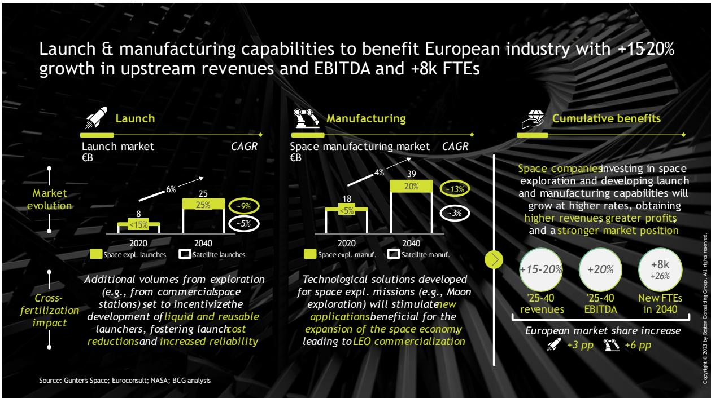  
Figure 5. Cross-fertilisation potential from launch and manufacturing capabilities

Within the space industry value chain, upstream launch and manufacturing capabilities enjoy the most significant cross-fertilisation potential from space exploration. Despite their critical role for independent access to space, the concentration of these capabilities has been historically limited to a small number of countries (less than 15 nations have launch capabilities and only 3 can conduct crewed launches). Scale and innovation are key to foster competitiveness across these capabilities and investments in space exploration are instrumental for these goals along three dimensions:

## 1. New technologies

Investments in space exploration stimulate innovation and the development of new technological solutions, laying the foundations for the new space economy (e.g., in-orbit manufacturing, in-orbit services), opening new markets and opportunities for emerging space players.

## 2. Integrated capabilities

Strengthening exploration-related capabilities expands the scope of commercial offerings, allowing space OEMs to become more competitive and capture higher market shares, both in nascent and traditional space domains (i.e., satellite-related). These improvements lead to increased leverage with counterparts, hence expanding opportunities for European players to become prime contractors in flagship space initiatives. Alternatively, European players can exploit the creation of consortia to achieve capability integration across different players with large end-to-end system engineering capabilities.

## 3. Scale and volumes

The surge in the number of launches stemming from a higher volume of exploration missions requires adequate scale and cost-effective solutions, which ultimately accelerate the transition towards liquid and reusable launchers. By overcoming these technological challenges, space companies can improve their products' reliability as well as their business cases' profitability. This change in dynamics directly contributes to a greater space accessibility for scientific, commercial, and military purposes.

Together, these benefits enhance industry's competitiveness by expanding the addressable market for space players. The ensuing diversification across different segments of the space sector strengthens the overall industrial ecosystem and leads to greater resilience for companies.

Historically, US companies have played a leading role in space exploration, showcasing larger size, stronger growth and superior profitability compared to European counterparts. Between 2018 and 2022, the largest American space players $^{4}$ have managed to achieve sustained growth, while all leading European companies have shrunk (Figure 6). In the same period, American companies have also experienced higher profitability levels, providing them with greater financial capacity for additional investments, and a safety net in case of market downturns. By analysing the correlation between revenue CAGR and average EBITDA margin for the sample of companies in Figure 6, it is possible to estimate that an additional 10 pp in revenues CAGR leads to a 3.5 pp improvement in EBITDA margins. This bonus has a positive effect on the companies' financial resilience, allowing them to conduct additional investments and withstand tougher market conditions.

Major European players with declining revenues, alongside lower size and profitability vs US peers: +10 pp revenues CAGR leading to +3.5 pp EBITDA margin

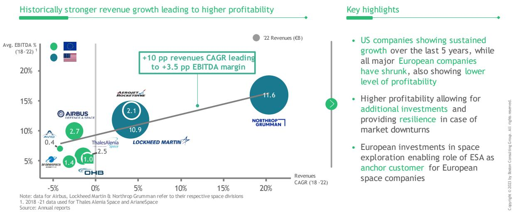  
Figure 6. Revenue CAGR and EBITDA margin for space OEMs

European players investing in space exploration will be able to improve their performance and capture higher market shares in the future. Indeed, launch and manufacturing revenues linked to exploration are expected to grow significantly between 2025-40, and their share on the overall market will rise compared to a relative decline of traditional space activities (i.e., satellites).

The overall launch market is expected to grow at 6% CAGR between 2020-40 (Figure 7), with space exploration launches enjoying a stronger growth (9% CAGR) compared to satellite launches (5% CAGR). The former will be driven by the roll-out of commercial space stations hosting both institutional astronauts and space tourists, and exploration missions to the Moon. The latter will instead reflect the deployment and replacement of mega-constellations. As a result, the share of exploration launches in 2040 is expected to reach 25%, up from less than 15% in 2020. In the same timeframe, economies of scale and technological innovations (e.g., reusable launchers), are set to drive the decline in average launch costs (from \~€14,000/kg to \~€5,000/kg), a key success factor for market participants. Hence, innovation efforts will be crucial for European companies to maintain competitiveness in such a context. Failing to do so will negatively affect European players' offerings, leading to more fragmentation and increasing the risk of displacement by other integrated players.

Share of exploration-related launches to reach 25% by 2040, an opportunity for companies to grow and maintain market leadership across segments

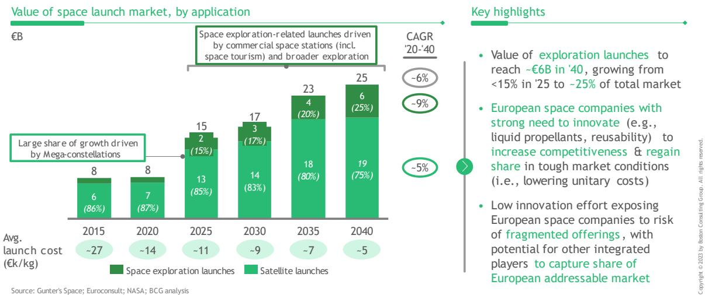  
Figure 7. Value of space launch market in 2015-40, by application

The manufacturing market is expected to present a similar trend, with an overall growth at 4% CAGR in 2020-40 (Figure 8), characterized by fast-growing space exploration-related manufacturing (13% CAGR) and a weaker satellite manufacturing segment (3% CAGR), due to volume and price dynamics. Indeed, the bulk of satellite manufacturing growth will take place by 2025, when most mega-constellations will be built, while decreasing unitary costs are set to stabilize the value of the satellite segment in subsequent years. As a result, the share of space exploration-related manufacturing is expected to reach 20% of the total market by 2040, up from less than 5% in 2020. The development of a European space station would thus be beneficial to enhance the exploration capabilities needed by European companies to seize a larger share of the manufacturing market as well as additional opportunities from the future space economy.

Space manufacturing growth set to be mainly driven by space exploration from '25 onwards, with expected 20% market share in 2040

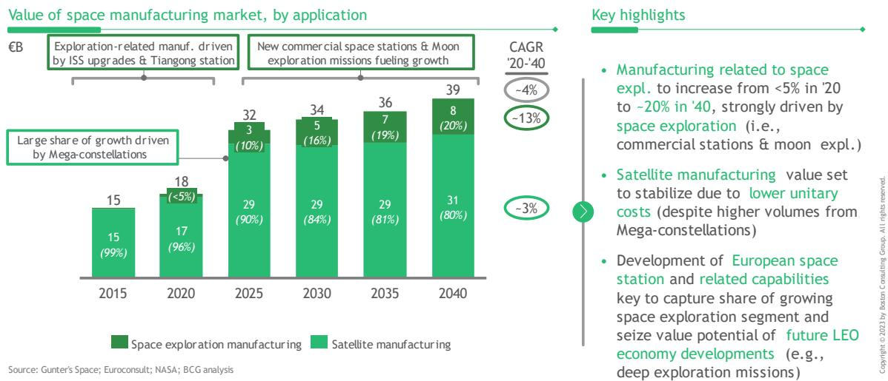  
Figure 8. Value of space manufacturing market in 2015-40, by application

Cross-fertilisation effects arising from additional investments in space exploration at European level can lead to numerous benefits for its industrial ecosystem, too. This is particularly true if major European space companies actively invest in space exploration and achieve the higher growth rates associated with the global market. First, cumulative revenues in 2025-40 are set to increase by 16%, equivalent to an additional €22 billion. Simultaneously, thanks to the positive correlation between higher revenues CAGR and EBITDA margins (Figure 6), their cumulative profits will increase by 20%, hence generating an additional €2.3 billion. The resulting 2040 market share for Europe will increase by 3 pp for launches and 6 pp for manufacturing (compared to a scenario where no space exploration investments are made). Positive implications will also extent to the labour market, with 8,000 additional direct FTEs created by 2040, encompassing a wide range of roles within the companies involved. It should be noted that executing selective investments in a limited set of initiatives (e.g., launchers) would not yield the same returns that can be achieved by directly funding industry-wide investments in space exploration. In fact, selective investments lead to fragmented offerings, hampering the ability of companies to capture higher market shares within the broader space sector and to attract private capital to further sustain innovation and growth. Additionally, the synergies brought by diversification also allow for greater flexibility when dealing with market cycles (e.g., PNT constellations).

## 3.3 Benefits of space for the broader economy and society

Through its relevance for the space industry, the value of space exploration further extends to the broader economy and society as a critical enabler of key economic activities and direct contributor to societal needs and long-term existential threats mitigation. The study acknowledges that the precise quantification of the economic benefits, across individual domains of space programmes, and from the space economy into other sectors of the economy is still at an earlier stage of research and relatively new to the space community. It is however believed that the general assessment of such broader impact and the presented order of magnitude of impact provide valid indicators of actual impact.

## 3.3.1 Space and other critical sectors

When benchmarked across comparable sectors (Figure 9), key differences in terms of economic industrial support emerge.

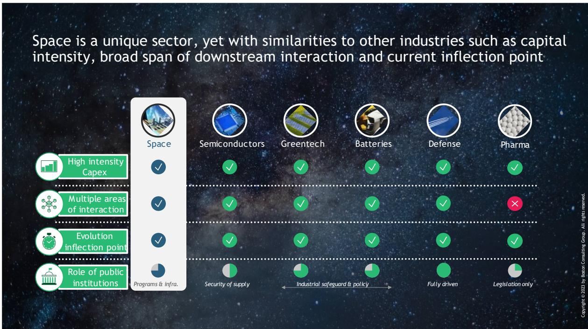  
Figure 9. Comparable industries to space

Public institutions play a vital role for the development of a more dynamic and innovative space industry by establishing ambitious programmes and promoting the necessary infrastructural investments. However, recent space exceptional funding (i.e., on top of legacy subsidies or funding mechanisms) in Europe has been lagging compared to other industries (Figure 10). In fact, once the industry size is considered, space emerges as significantly underinvested compared to other sectors. As a reference, exceptional public funding for the IRIS $^{2}$ programme amounts to less than €3 billion, which is <1% of the global space industry market size (slightly over €440 billion in 2022), a negligible figure compared to support provided to other industries. For instance, semiconductors benefitted from the approval of substantial public support in the past year, of which the \~€43 billion $^{5}$ EU Chips Act is the most relevant example, amounting to \~8% of total market size (€570 billion in 2022). On a similar note, the Greentech industry, a €520 billion market in 2022, benefitted from considerable funding in the form of grants under the REPowerEU \~€70 billion programme. Recently, exceptional funding has also affected the defence industry, with a budget increase that exceeded €190 billion after the start of the Russia-Ukraine war in 2022 and accounting for \~10% of the total market. These funds are a mix of structural budget increases and one-off programmes that will take several years to materialize.

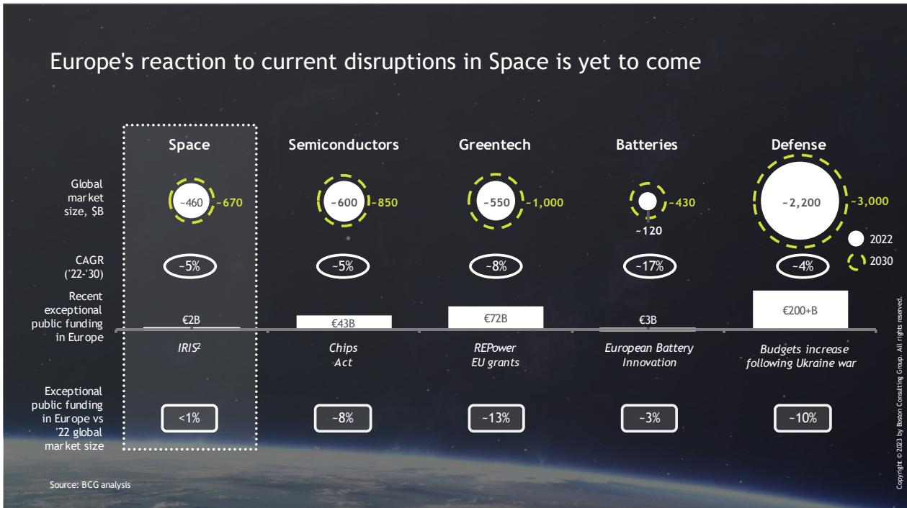  
Figure 10. Space industry exceptional funding in Europe compared to other industries

Compared to similar sectors, the space industry is currently underinvested, despite showing a multiplier effect of 7x on the broader economy, a value aligned to other critical sectors such as semiconductors, batteries, and pharmaceuticals (Figure 11).

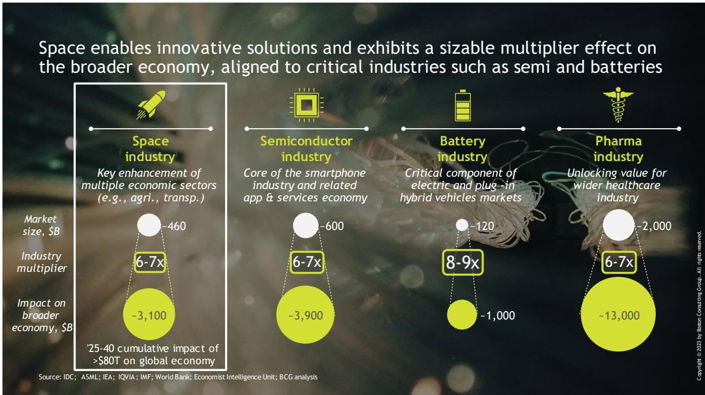  
Figure 11. Space industry multiplier on the broader economy and society

## 3.3.2 Value of space for the broader economy and society

In 2022, and while the calculated value of the space economy in 2022 is \~\$460 billion, the estimated value of space for the broader economy and society in 2022 amounts to \~\$3.1 trillion, facilitated by innovative solutions based on domains like space exploration, PNT, SatCom, and EO (as shown in Figure 12). This estimation considers more than fifteen business cases across various industries, where space technologies demonstrate both their enabling and enhancing effects on new markets creation, incremental value-added generation, and core industries enhancement.

Value of Space for economy & society of \~\$3.1T in '22 based on >15 business cases investigated across industries, showing impact on broad span of sectors
Space application value potential across selected industries

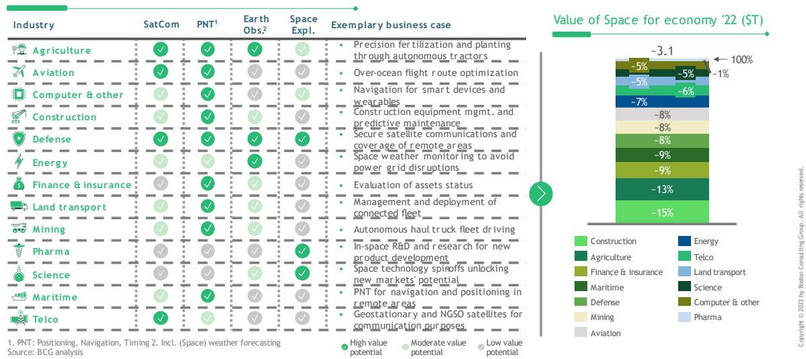  
Figure 12. Value of space for economy & society in 2022, by industry

Based on the potential value that space applications offer to each sector, thirteen industries were prioritized for this assessment, with space exploration generating significant value for industries such as defence, energy, agriculture, pharmaceuticals, and science. These use cases benefit the broader economy and society across three major enablement effects (Figure 13):

The methodology employed to estimate the value of space heavily depends on the specific critical enhancement effect under consideration. The following categories illustrate the approach:

1. New markets creation: the value of space is determined by summing up the market sizes of the new sectors it creates and enhances. Industries such as pharmaceuticals and science fall into this category. For example, in the pharmaceutical industry, human space exploration research has contributed to the development of new drugs such as Keytruda, an antibody used in cancer immunotherapy treating melanoma and other cancer types (e.g., lung, breast). Its market has grown at a 67% CAGR between 2015 and 2022, evolving into a \$21 billion market, corresponding to \~35% of Merck's total revenues.

2. Incremental value-added generation: the value of space is calculated by considering three key factors: i) the global market size of the sector, ii) the incremental impact generated, and iii) the industry's adoption of the space technology that enhances the specific use case. This classification includes significant industries such as agriculture, construction, and mining. Looking into agriculture, precision farming technologies have proven sizable value generation potential for companies' performance. For instance, precision fertilisation can lead to a 10-15% increase over average yields and a 10-20% cost reduction on crops such as wheat or rapeseed.

3. Core industry enhancement: the value of space is calculated by considering the total market size and the adoption of technologies specifically to each industry. The majority of industries considered for this assessment fall into this category, including aviation, computer & other, defence, energy, finance & insurance, land transport, maritime transport, and telecommunications. Looking into the defence industry, space technologies act as critical enablers of specific markets. Particularly, PNT solutions are core components of the technology stack for missiles and missile defence systems (MDS), as for Earth observation in C4ISR $^{6}$ , and SatCom in tactical communications. Similarly, integrated space services also play a fundamental role for critical infrastructure protection, considering that, in the US, fourteen out sixteen of them depend on space assets.

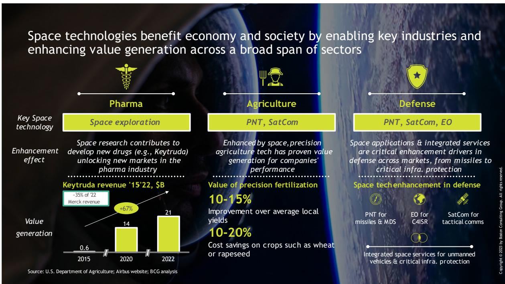

Figure 13. Selected examples of space enhancement across sectors Between 2025 and 2040, the impact of space on the broader economy and society is expected to be mostly driven by the adoption of space technologies across the multiple impacted sectors. The penetration of space solutions across the broader economy is projected to grow over the years due to their multiple benefits (Figure 14):

\- Increased output: e.g., in agriculture, field zoning and mapping via PNT can improve land analysis and generate higher crop yields.

\- Higher efficiency: e.g., in mining, fleets connected via telematics can increase equipment utilisation and streamline operations.

\- Enhanced resiliency: e.g., in the financial sector, PNT used for transactions' timing and synchronisation strengthens the resilience of the broader industry.

\- Improved footprint: e.g., in road transportation, fleet management systems (FMS) improve resource allocation and efficiency, hence reducing emissions and, potentially, CAPEX by optimising the size of the fleet.

On the other hand, there are alternative solutions that might reduce the adoption of space technologies. For example, while missiles and defence systems currently rely heavily on PNT, future quantum-enabled GPS could potentially provide more accurate navigation inputs.

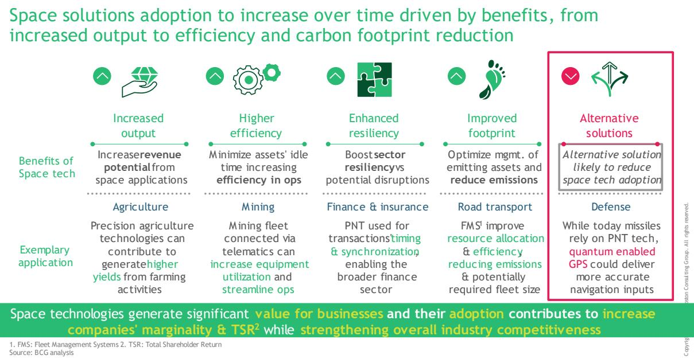  
Figure 14. Main drivers of space technology adoption

Nevertheless, space solutions are and will continue to generate significant value for businesses, with increased adoption leading to higher marginality, total shareholder return (TSR), and enhanced industry competitiveness. Yet, failing to invest timely can result in significant missed opportunities for the whole industry, besides the loss of value enhanced. In fact, a lack of European funding in space would imply a slower product development and innovation effort, potentially leading to missed generations of technologies vis-à-vis other countries and players investing more proactively. The resulting innovation gap in the industry would be extremely complex for Europe to bridge in the future.

By 2040, the estimated value of space for the broader economy and society is projected to reach approximately \$8 trillion, representing a CAGR of 5% compared to the 2022 value (as depicted in Figure 15). Consequently, this would lead to a cumulative impact of over \$80 trillion between 2025 and 2040.

Space currently enhances >\$3.1T of global economic value and is expected to generate much wider benefits for economy & society between '25 and '40

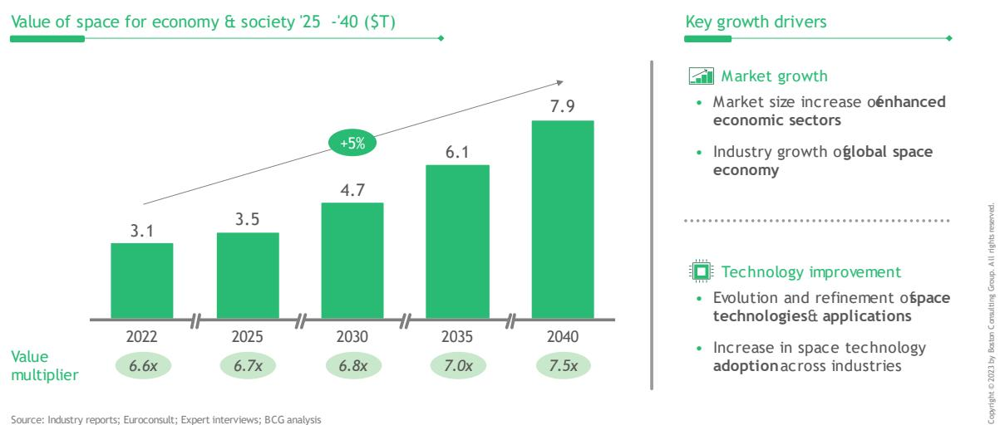  
Figure 15. Evolution of value of space for economy & society (2022-40)

The multiplier value, which represents the impact of space on the broader economy, is expected to grow over the years, ranging from a 6.6x in 2022 to approximately 7.5x by 2040, aligned to other comparable sectors such as semiconductors, batteries, pharmaceuticals.

The estimation of the evolution of space value was conducted by analysing individual business cases and establishing targeted assumptions regarding the adoption of space technologies. Market size growth was identified via industry reports (e.g., HIS Markit) and other relevant data sources including BCG knowledge database. Therefore, over this period, the penetration of space solutions across the broader economy is expected to increase due to their numerous benefits, including increased adoption by these sectors, output, higher efficiency, and enhanced resiliency.

As a result, space solutions will continue to generate significant value for businesses, leading to higher margins, total shareholder returns, and greater industry competitiveness.

## 4. Time to act

The space industry is currently reaching an evolution inflection point characterized by increased participation of private companies and an evolution towards multipolar systems centred around the US (e.g., Artemis) and, on the other hand, across China and Russia (e.g., ILRS $_{7}$ ).

NASA launch capabilities are currently challenged by the delays and extra costs associated to its Space Launch System (SLS) and exacerbated by the reliance on Russian solutions for crewed transfer to the International Space Station (ISS). This context paves the way to private providers to capture a significant share of the launch market.

The decommissioning of the ISS, expected by the turn of the next decade, further incentivizes the development of both commercial and national space capabilities. In fact, the Russia-Ukraine conflict exposed the need to acquire sovereign space competences and limit dependencies on other nations. In addition, NASA and other space agencies, including ESA, are implementing key initiatives to support the transition to commercial space stations.

Indeed, after the retirement of the ISS, NASA plans to maintain a continuous human presence and advance technological capabilities in Low Earth Orbit (LEO) by transitioning to commercial platforms and services. The Commercial LEO Destination (CLD) programme aims at stimulating US private industry development of free-flying orbital destinations capabilities (e.g., Axiom), and creating a market where services are available for both government and private customers. NASA will act as a “partner” for the private sector, supplying crew and cargo transportation services, thus becoming one of many customers of the New Space Economy.

Future space stations will therefore no longer be the result of a multi-country effort and will rather derive from commercial solutions as well as partnerships among smaller groups of countries wishing to augment their overall projection of power (e.g., China's Tiangong station). This trend intensifies the need for Europe to establish independent crew-rated launch capabilities and build a proprietary orbital module, that is, the required infrastructure to conduct its own space exploration missions and avoid dependency on foreign countries.

However, the future space station landscape already appears highly polarized, with a prominent role of US OEMs that are likely to prevail within the segment with four leading actors: Axiom, Orbital Reef, Starlab, and Northrop Grumman.

Europe is already lagging on orbital station development. A benchmark of the key players in the field shows that, on average, the construction of a space station requires \~10 years and up to \$10 billion investment to cover manufacturing costs (Figure 16). In addition, the development of a space station entails highly specialized assets and capabilities together with a strong industrial base of key partners and suppliers with flight heritage. Europe must act now to accelerate the development of critical space exploration capabilities, such as a space station, which anyhow would be at regime only after the decommissioning of the International Space Station.

If Europe fails to invest promptly, the additional value unlocked by commercial, non-ISS stations would also be at risk. As a matter of fact, free-flyer capsules such as VARDA Space and Space Forge are part of the technological solutions that enable new markets (e.g., RFA, ATMOS, and Yuri “Eva” microgravity service), while contributing with improvements in return capability and high-frequency flights. A timely investment in space exploration is required to catch up with other space powers and enable a leading role for Europe in the next decade as previously happened with other European success stories such as the development of Ariane 5 in the ‘90s or the setup of Eutelsat in the ‘80s. Failing to do so would only amplify, potentially to a non-reversible stage, the existing gaps in European assets and capabilities.

On average, the development of a commercial space station takes\~10 years and might require up to \$10B to manufacture

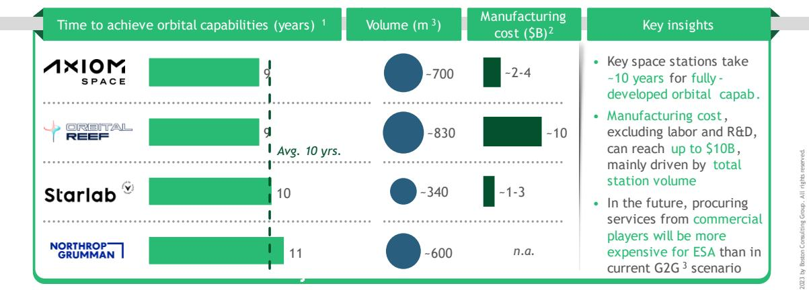  
1. Time to launch calculated as number of years between date of expected deployment (including expected delays) and award of
2. Excluding labor cost and R&D expenditures 3.G2G: Government to Government Source: Space station actors' websites; Expert

Figure 16. Time for orbital capabilities and manufacturing cost for space station OEMs

US-lead on commercial space stations: three cases on the role of space exploration to stimulate industrial dynamics and attract financial markets

Case 1. SpaceX and the ISS – looking at the market leader, SpaceX greatly benefited from initial institutional funding through a stable foundation of ISS resupply contracts for cargo (\$1.6 billion value) and crew transfer (\$2.6 billion value) through NASA CCDev programme. Through this capital, SpaceX could complete the development of Falcon 9, enabling the creation of its business models for the commercialisation phase of Starlink and Starshield. Missions for institutional customers to the ISS represent the economic and technological foundation which enabled the company to subsequently conquer both commercial connectivity (Starlink) and now also defence businesses (Starshield), attracting significant funding from financial markets. It is a powerful case showing how institutional support in space exploration created a US industrial champion, now valued at \~\$150 billion, revolutionizing the overall space economy.

Switch to commercial stations - the ISS decommissioning in 2031 and the US shift to commercial space stations create a new window of opportunity for private actors. Within the first phase of the Commercial LEO Destinations (CLD) Programme, NASA has already awarded funding to four private US companies (i.e., \$140 million to Axiom Space, \$126 million to Northrop Grumman, \$160 million to Nanoracks, and \$130 million to Blue Origin) to develop private space stations after the ISS.

Case 2. Axiom Space, the ISS, and a private station – Axiom Space recently raised a private funding of \$350 million from the Korean pharmaceutical company Boryung and the Saudi Arabian investment company Aljazira Capital. Similarly, to supply commercial markets in the medium run, it first received institutional support, notably \$140 million from NASA to build at least one ISS habitation module and future support to dock at least four modules to the ISS forming a standalone station after ISS decommissioning. Therefore, starting from institutional support, Axiom has eventually been able to attract commercial interest from the space tourism and pharmaceutical industries, thus becoming more attractive to further investors. European countries such as Sweden and, more recently, Poland, have also contracted Axiom to transport their astronauts to the ISS. Overall, Axiom claims they received customer contracts worth \$2.2 billion.

What the connectivity market opportunity represented for SpaceX may be the pharmaceutical prospects for Axiom, both critical to grow beyond the public support and to become attractive as investment targets from financial markets into emerging commercial opportunities enabled by space.

Case 3. Voyager-Airbus Defence & Space (ADS) joint-venture – so far, the only European participation in this emerging ecosystem is the joint venture that ADS recently signed with Voyager Space to build and operate the Starlab station, funded with \$160 million by NASA. Besides attracting capital, it is also an example of how institutional funding enhances international cooperation, under US lead.

## 5. Cost of inaction

Investments and developments in space exploration are on the rise, presenting Europe with an opportunity to become a prominent participant in the space revolution. By contrast, the cost of inaction could be significant and lead to lost opportunities for economic development and industrial competitiveness. This section focuses on the quantification of the cost of inaction and its impact on the competitiveness of the space industry. In addition, it presents an overview of previous examples of lost opportunities across countries that might arise in Europe if decisive countermeasures are not promptly implemented.

## Quantifying the cost of inaction

As discussed in previous sections, space exploration provides distinct levels of benefits that stem from the direct contribution of its core activities and propagate up to the level of the broader economy and society (Figure 1).

Limited European investment in space exploration would curtail the size of direct, indirect, and induced benefits. It would also hinder the enablement of catalytic impacts given the reduction in the European fair share across markets (e.g., space travel, in-space manufacturing, and R&D). Similarly, a contraction in the volume of space exploration procurement and human capital development would restrain the size and competitiveness of the European space industry.

Consequently, the broader economy and society would be severely impacted by a lower level of European investment in space although these capabilities would likely be replaced by alternative solutions from competing space powers, which aim to maximize their influence through the development of cutting-edge solutions and to ensure their technological and industrial leadership.

It is also critical to stress that such strategic dependence and lack of autonomy would limit European industries at large to develop sovereign solutions. This presents a fundamental risk for the Continent as it would not be able to control state-of-the-art solutions, potentially resulting in delayed timing, higher costs, or lower quality of the available capabilities.

With respect to the impact on direct, indirect, induced, and catalytic benefits, the cost of inaction for Europe would result in a loss of at least €165 billion in cumulative GDP between 2025 and 2040. This result is strongly opposed to the total €260 billion expected in case of European investment in space exploration. In addition, it would imply a loss of an average of 60,000 FTEs, corresponding to a reduction of \~70% compared to the investment scenario (with an average of 90,000 FTEs created). Total GDP multiplier would shrink from more than 5x to less than 4x the budget invested (-27%), with a much more significant impact on GDP and employment mainly due to the loss of catalytic benefits, thus implying a non-linear return on budget invested (Figure 17). Additionally, Europe would lose opportunities for potential benefits beyond catalytic ones and the 2040 timeframe, like SBSP and ISRU.

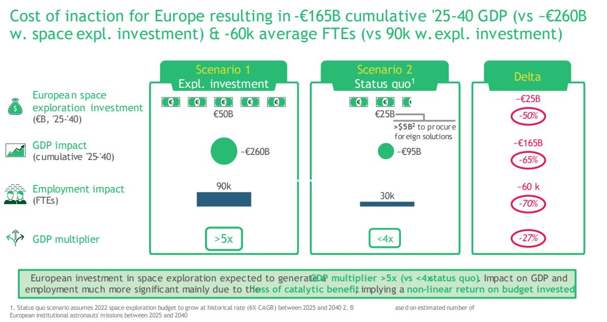  
Figure 17. Cost of inaction related to direct, indirect, induced, and catalytic benefits

These figures are estimated comparing two scenarios. The first assumes that Europe will invest €50 billion in space exploration between 2025 and 2040, in line with previous hypotheses and results. Conversely, the second case assumes that Europe will preserve the status quo, i.e., it will keep pursuing investments in space exploration in line with the historical growth observed over the past 5 years (6% CAGR).

With half the budget invested in space exploration, Europe would not be able to develop an end-to-end offering of critical assets and capabilities. Thus, it would not be capable of fully capturing the opportunities provided by the LEO economy and the resulting catalytic benefits, (e.g., in-space manufacturing and R&D market) requiring both an orbital module and crew-rated launch capabilities. In addition, Europe will need to procure foreign solutions (e.g., from the US) to access the New Space Economy. Based on the expected number of European institutional astronauts' missions between 2025-40, \~€5 billion would be spent on third-country offerings, corresponding to 20% of total European budget invested in space exploration.

Concerning the European space industry size and competitiveness, the cost of inaction would result in at least €32 billion of lower cumulative revenues between 2025 and 2040, arising from lost opportunities from potential space exploration revenues and lower competitiveness of the traditional business (Figure 18).

Inaction costing Europe €22B of lost revenues in '25-40 from exploration-related activities, and additional €10B from lower competitiveness of traditional business

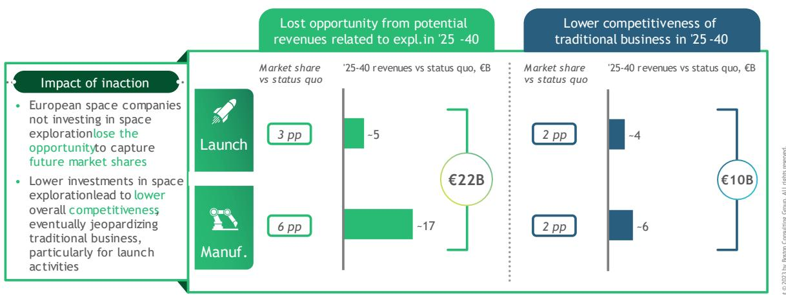  
Figure 18. Cost of inaction related to European space industry size and competitiveness

## Lost opportunities from potential space exploration revenues

Limited European investments in space exploration will potentially hinder European players' urgency to invest in the field, slowing the development of critical innovations and hampering their ability to achieve competitiveness on products and solutions that are useful for space exploration. Consequently, European companies will lose the opportunity to participate in the fastest-growing segments (i.e., the ones linked to space exploration) of the launch and manufacturing markets, forgoing €22 billion of additional cumulative revenues in 2025-40.

## Lower competitiveness of traditional business

Lower procurement volumes resulting from limited exploration investments are set to reduce the addressable market for space companies, curtailing the development of cutting-edge solutions and cost-related improvements. Eventually, these shortfalls are set to have repercussions on the satellite launch and manufacturing markets as well, jeopardizing revenues and market shares.

Space exploration and satellite launches are very similar in terms of market dynamics, with launch cost and reliability as key success factors. Accordingly, launch players failing to achieve cost competitiveness and top-notch reliability are set to face market share loss in the future satellite launch market. In the past, European players have already experienced market share decline in this field (2 pp between 2010 and 2020), mainly due to declining performance and the rise of disruptors (i.e., SpaceX). Assuming that limited investments would lead to a similar decline, reducing European market share by 2 pp in 2040, the cost of inaction for European launch players would reach €4 billion in 2025-40.

A similar evolution can be foreseen for satellite manufacturing, albeit the capabilities for space stations manufacturing and traditional satellites are only partially overlapping. Applying the same approach used for launches to satellite manufacturing in Europe, historical data shows a 2-pp decline in European market share between 2013 and 2022. Therefore, it is possible to assume a 2-pp market share contraction in satellite manufacturing in 2040, costing European manufacturing companies €6 billion between 2025 and 2040.

## Assessing the impact on industrial competitiveness

The cost of inaction from Europe's failure to invest in space exploration would be substantial and would impact the competitiveness of the industry across five key areas.

## 1. Strategic dependence and lack of sovereignty

Insufficient development in space exploration would not only weaken the broader space industry but also compromise overall sovereignty. In fact, Europe would become highly dependent on other countries for core space and security activities, thus eroding its strategic independence.

## 2. Space exploration assets and capability gaps

Europe risks missing out on the current and future potential of the New Space Economy. The failure to timely develop core space exploration technologies and competencies would result in significant assets and capabilities gaps. This would also mean losing opportunities in nascent and future domains such as lunar exploration, space-based solar power, as well as other aspects of the rapidly evolving New Space Economy (e.g., microgravity research). Once the window of opportunity is closed, the recovery of such required assets may then become difficult, expensive, or even impossible to develop.

## 3. Barriers to entry in New Space Economy

Today, participation in the space economy is mainly regulated by government-to-government negotiations among agencies. However, in the future, access to LEO economy will follow commercial logics. The lack of investment in European proprietary space exploration assets and capabilities could create entry barriers for European players, hindering their growth opportunities and limiting their ability to compete.

## 4. Siloed offerings

In the future, the European space industry could provide fragmented solutions (e.g., only uncrewed launches), while international competitors will offer more comprehensive solutions of integrated capabilities. This siloed approach would leave Europe behind, at a disadvantage. Within an already constrained addressable market, Europe would be exposed to alternative solutions and potentially lose market share. Therefore, investments in space exploration require a joint effort across European countries to reach a critical mass comparable to other space powers.

## 5. Value chain fragility

If Europe does not invest in space exploration, the focus on individual steps of the value chain (e.g., launchers) would expose the industry to higher supplier risk for critical assets and capabilities. This fragility within the value chain would leave Europe vulnerable to disruptions and limit its ability to respond to changes in demand or market conditions. Additionally, the effects of seasonality would have more severe consequences due to the lack of diversified offerings.

In addition to these elements, inaction also poses the risk of neglecting a generation of technological advancement, depleting European capabilities, and reducing the chances to regain a competitive edge in the future. Even if European players entered the space exploration market at a later stage, they would set foot in a low-return environment where incumbents would capture most of the benefits compared to newcomers (i.e., European players).

We are on the brink of a new era in space exploration, a turning point where it is crucial to fully capitalize on the advancements in the industry and reap their benefits. Europe must seize this moment, intensifying its role, investments size, and appetite for risk to match the pace of other space powers and support robust industrial capabilities. In this context of rapid industrial development, the cost of inaction can be larger and lead to significant lost opportunities.

## Key examples of lost opportunities

Over the years, countries' cost of inaction due to lost opportunities has resulted in reduced industrial competitiveness and strategic independence across a variety of sectors.

Over the years, countries' cost of inaction due to lost opportunities has resulted in reduced industrial competitiveness and strategic independence

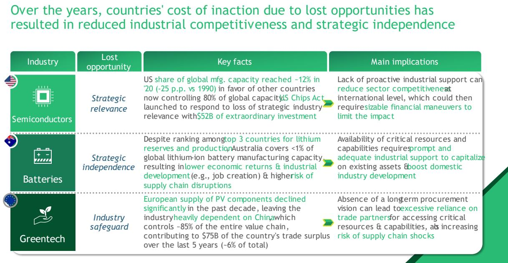  
Figure 19. Key examples of lost opportunities

## The semiconductor industry in the United States

The case of the semiconductor industry in the United States is a clear example of a lost opportunity that negatively impacted the sector's strategic relevance. Historically, US companies focused on chip design and R&D, gradually externalizing manufacturing to reduce CAPEX required to build domestic manufacturing capabilities. On the other hand, China, Taiwan, Korea, and Japan have gained share of manufacturing capacity and now control \~80% of the total market.

The US Chips Act was launched as a response to the loss of strategic presence in semiconductor manufacturing and to the recent chip shortages and their impact on global value chains. Despite its launch, however, the US lack of proactiveness led to considerable missed opportunities in terms of economic development, employment generation, and overall sector competitiveness. The lack of adequate and timely support from government and policymaking authorities can lead to slower industrial development, hence requiring even larger investments to recover the gap and re-establish strategic relevance.

## The Greentech industry in Europe

In Europe, the Greentech industry constitutes a relevant example of missed opportunity for the sector safeguard. Between 2010 and 2021, the European supply of solar-PV components declined significantly across the whole value chain (i.e., polysilicon, wafer, cell, and module). Conversely, nowadays China dominates the global supply of solar-PV components with \~85% concentration across all steps.

This phenomenon presents sizable economic implications both from the perspective of the cost of inaction for the importer (i.e., Europe) and the seized opportunity for the exporter (i.e., China). On one hand, in 2022 Europe imported over €18 billion worth of solar components from China, corresponding to \~95% of total solar-related imports. On the other hand, the sector has contributed to \$75 billion of China's trade surplus over the last 5 years, i.e., \~6% of the total within the same period.

The lack of industrial support for Greentech also has important strategic implications for Europe. The European Union wants to make solar power its single biggest source of energy by 2030, thus requiring the triplication of solar power generation capacity over the next seven years. Yet, the vast majority of European solar panel imports in 2021 came from one single country, thus posing the European value chain resiliency at jeopardy. As a matter of fact, in 2020, explosions at a major polysilicon plant in China removed \~10% of global supply, pushing prices up by 50%. The absence of a long-term procurement vision and prompt industrial support mechanism can lead to excessive reliance on trade partners for accessing critical resources and capabilities. Ultimately, it increases the risk of supply chain shocks, and hindering Europe’s ability to achieve its ambition in solar and clean energy.

In conclusion, the examples presented highlight the significant cost of inaction and lost opportunities for countries across various sectors. The United States' failure to maintain strategic presence in semiconductor manufacturing has resulted in reduced competitiveness and greater dependency on foreign countries. Australia, despite having abundant lithium reserves, has missed the opportunity to establish a domestically independent battery industry, limiting its share of the global lithium-ion battery market. Europe's decline in the supply of solar-PV components has led to heavy dependence on China, both economically and strategically. These cases emphasize the need for proactive governmental support and timely investments to ensure industrial development, employment generation, and resilience of value chains. Failing to seize such opportunities restrain countries' strategic relevance and increase vulnerability to supply chain disruptions, eventually impeding their ambitions in key sectors of the economy.

Europe must not repeat the same mistakes for its space industry and should promptly embark on a unified path of bolstering the sector, starting from the uniqueness of space exploration opportunity, to fully capitalize on both the economic and societal benefits it offers.

## 6. Closing remarks

This study showcased the critical importance of space exploration as a pivotal sector for strategic investment in Europe. The potential benefits of active involvement and funding in this domain span across economics, politics, technology, and society, presenting extraordinary opportunities.

A three-step methodology has been employed to analyse the various economic benefits that Europe can gain from space exploration. These benefits encompass immediate economic returns, cross-fertilisation within the space industry, and significant broader improvements and outcomes for the economy and society at large.

These benefits are inseparable and can only be achieved in full if addressed as a whole within a European space industry at scale and globally competitive. Indeed, the development of core space exploration capabilities is pivotal to unlock cross-fertilisation effects for the space industry and, therefore, enhance value generation for the broader economy and society.

The implementation of a major European space exploration programme would allow for the building of core capabilities and assets within the industrial ecosystem and the establishment of an independent presence in low Earth orbit, lunar orbit, on the Moon, and beyond.

In Europe, implementation of a major European space exploration programme is estimated to generate a GDP multiplier effect of >5x the overall budget, with estimated benefits stemming from the investment amounting to a cumulative GDP impact of at least €260 billion and an average of 90,000 FTEs created between 2025 and 2040, considering an investment of €50 billion over the same period (Figure 2).

The impact distinguishes a multiplier of 3x resulting in a GDP impact of €150 billion...

\- In terms of direct economic benefits, the investment is anticipated to contribute to €25 billion of direct cumulative GDP impact through the value added generated by an average of 4,000 new space exploration-related FTEs. In addition, procurement expenditures are projected to generate \~€70 billion of indirect GDP impact within the European space industry. Finally, the budget's injection into the economy is anticipated to increase household spending of employees in the space sector within the broader supply chain, further contributing to \~€55 billion of induced cumulative GDP impact between 2025 and 2040.

... and a further GDP impact of €110 billion, thus resulting in a total multiplier of >5x:

\- In terms of catalytic benefits, Europe's investment will generate \~€110 billion of incremental GDP contribution within the 2025-40 timeframe. The lion's share of this contribution (€85 billion) will stem from new space markets, including space travel, in-space R&D and manufacturing, in-orbit services, and edge computing. Additionally, a renewed focus on space innovation driven by investment in space exploration is also expected to generate a GDP impact of \~€10 billion between 2025-40 from technological spinoffs as well as an increase in GDP of \~€15 billion through the comparably higher productivity and value generation of STEM jobs.

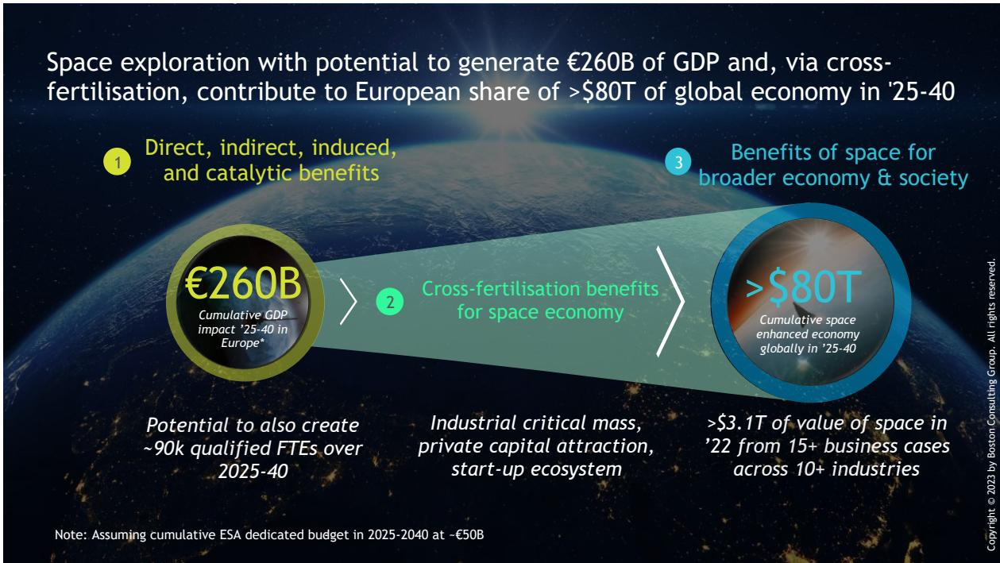  
Figure 20. Space exploration comprehensive benefits for Europe in 2025-40

Developing space exploration capabilities becomes paramount for Europe to ensure long-term resilience, sovereignty, and competitiveness in this rapidly advancing frontier of the space industry. Particularly, space exploration is projected to increase its share from 5-10% to 20-25% of launch and manufacturing markets by 2040, highlighting the significance of securing a solid foothold in this dynamic domain.

Moreover, the overall space sector plays a critical role in enabling the global economy, too. With its impact exceeding a cumulative \$80 trillion in 2025-40, it corresponds to seven times the size of the industry itself (Figure 20).

Beyond its considerable economic influence, the space sector plays a pivotal role in providing essential solutions that safeguard Europe's future and address critical existential challenges, such as climate change and energy crises, water and food scarcity, geopolitical posture and defence capabilities (Figure 21).

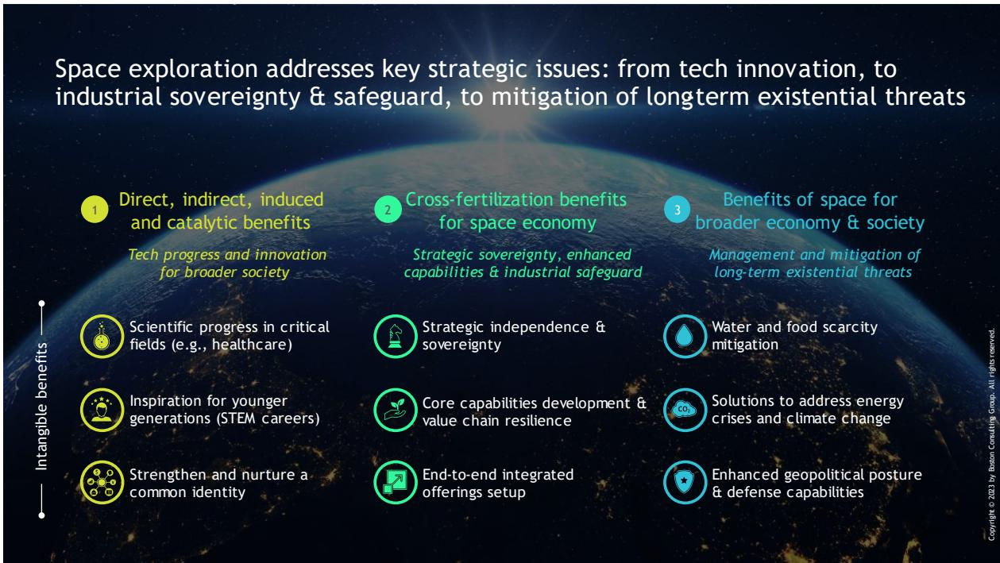  
Figure 21. Space exploration intangible benefits for Europe in 2025-40

Nonetheless, Europe finds itself with relatively limited end-to-end capabilities in comparison to other space powers, particularly concerning orbital and transportation solutions and a lack of a strong industrial complex developing space solutions for security and defence. The current situation presents a concrete risk of an even wider gap as other nations in different world regions are making significant investments in next-generation technologies, with innovation often driven by space exploration and space for security and defence, both with limited focus as of now in Europe. Europe faces a pressing need to take prompt action, avoiding the ominous and far-reaching consequences associated to inaction.

With a cumulative investment of €50B, Europe could unlock at least \~€260B of total GDP impact (\~5x vs budget) creating an average of \~90k FTEs over '25'40

## Appendix

## A. Methodology for GDP impact estimation

Between 2025 and 2040, space exploration has the potential to generate a cumulative GDP impact of at least €260 billion in Europe, along with an average of around 90,000 FTEs (Figure 22). The investment in space exploration is projected to yield most of the overall benefits (\~60%), while the remaining portion (\~40%) will derive from catalytic effects. Additionally, potential upsides from other applications such as space-based solar power and in-situ resource utilisation are expected to materialize beyond 2040, with further benefits in term of GDP impact and job creation.

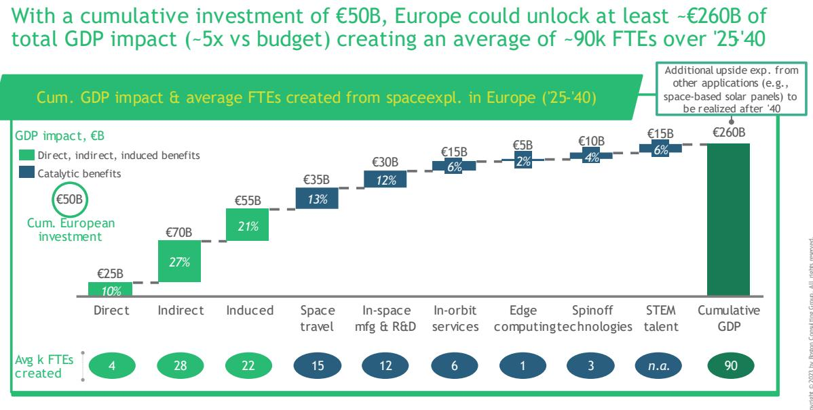  
Figure 22. Cumulative GDP and average FTEs linked to space exploration in Europe ('25-40)

Realizing these benefits would require a substantial increase in investments and a heightened level of focus from Member States and, consequently, ESA. Specifically, the premise is that dedicated funding for space exploration must escalate from the current level of under €1 billion to exceed €3 billion annually, with a total commitment of approximately €50 billion within the 2025-40 timeframe. Such a commitment would generate a GDP multiplier effect of over 5x the overall budget.

These resources shall be deployed to build core space exploration capabilities and assets within ESA and the European industrial ecosystem. Specifically, the total cumulative budget would address two core objectives.

1. Space exploration-specific employment (\~15% of total European cumulative budget): support the creation and development of space exploration-specific employment via hiring of new employees specialized in space exploration while up- & re-skilling current employment in the field

2. Procurement activities (\~85% of total): construct and maintain a European space station, ensuring regular space travel (i.e., Earth-to-Orbit and vice versa), supporting science and R&D-focused missions as well as deep-space exploration (e.g., Moon, Mars)

Specifically, the budget is expected to gradually increase from €1.6B in 2025, to €3.0B in 2030, reaching €3.5B in 2040. This increase is linked with the evolution of activities funded by the budget, which are mainly driven by research, development, and testing in the first phases, to then shift towards manufacturing and launch activities for the European space station.

Following the same logic, the share of the budget allocated to employment will decrease over time, from $20\%$ in 2025 to $13\%$ in 2040. The reason for this change lies in the nature of space exploration programs, which usually start with the hiring and training of specialised employees. Once the backbone of the program's workforce and skills is built, programs usually shift to infrastructure, manufacturing, and maintenance activities.

The methodology used to calculate both GDP and employment impact from the European investment in space exploration falls into the domain of economic impact analysis and, specifically, input-output analysis. A more detailed account of this academic field and the modelling approach adopted is provided in the following section.

## A.1 Input-output analysis

Input-output modelling is a widely used analytical tool in economic impact analysis that helps assessing the interdependencies between different sectors of an economy. It provides a framework for understanding the flows of goods, services, and income between industries and quantifying the ripple effects of changes in economic activities. At the heart of input-output modelling is the concept of the multiplier effect, which allows the estimation of direct, indirect, and induced impacts on GDP and employment.

At its core, an input-output model represents the economy as a matrix, with each row and column corresponding to a specific sector. The matrix entries capture the inputs required from each sector to produce the outputs of other sectors. These inputs can be both intermediate inputs (e.g., raw materials, components, and services) and final demand (e.g., consumption, investment, government spending, and exports).

The multiplier effect is based on the idea that a change in one sector's output or demand can lead to changes in other sectors. When there is an increase in final demand or output in a particular sector, the direct effect represents the initial impact within that sector. However, this direct impact also generates indirect effects as the increased production in the initial sector requires additional inputs from other sectors. For instance, if there is an increase in government spending on infrastructure, it will directly benefit the construction sector. The indirect effect occurs as the construction sector increases its demand for materials from other sectors like steel, cement, and transportation.

Furthermore, the induced effect captures the changes in consumer spending that results from the increased income generated by the direct and indirect effects. As employment and income rise in the direct and indirect affected sectors, both individuals and households are likely to have more money to spend on goods and services. This phenomenon stimulates additional activity in various industries and creates a positive feedback loop that amplifies the initial impact.

Multipliers are key tools in input-output modelling for estimating the magnitudes of these effects. They are derived from input-output tables and capture the relationship between changes in final demand or outputs and the resulting changes in GDP and employment.

Using multipliers allows to estimate the total impact of a specific economic activity or policy change on GDP and employment. By applying appropriate multipliers, one can estimate the direct GDP impact, which represents the initial change in output or final demand. The indirect GDP impact accounts for the ripple effects in other sectors due to changes in intermediate inputs. Finally, the induced GDP impact reflects the additional economic activity resulting from increased consumer spending. Similarly, employment multipliers are used to estimate the direct, indirect, and induced employment creation which result from a specific economic activity.

The present study analyses the impact of a European investment directed towards the creation of space exploration-specific jobs and the procurements of related goods and services. This change in economic activity serves as the starting point for further economic stimulation, and the resulting actions and activities constitute the overall impacts.

## A.2 Data sources

Multiple data sources were examined to develop the input-output model and estimate the impact of a European investment in space exploration. The OECD harmonised input-output tables database was used to collect national tables for the key European countries considered within the scope of the analysis: France, Germany, Italy, UK, Belgium, and Spain. For the computation of induced impacts, OECD data was used for the average compensation of employees in Europe, while data on household income was gathered from Oxford Economics. Historical ESA budgets were referenced for the allocation across key European countries and to estimate total direct, indirect, and induced impacts from the investment in space exploration. Finally, BCG knowledge database and experts contributed to the development of market models (e.g., space travel) for catalytic impact assessment as well as for the identification of the European fair share across these markets.

## A.3 Modelling approach

The calculation of direct, indirect, induced GDP impact was conducted via an established methodology relying on multiplier calculation via input-output tables (Figure 23).

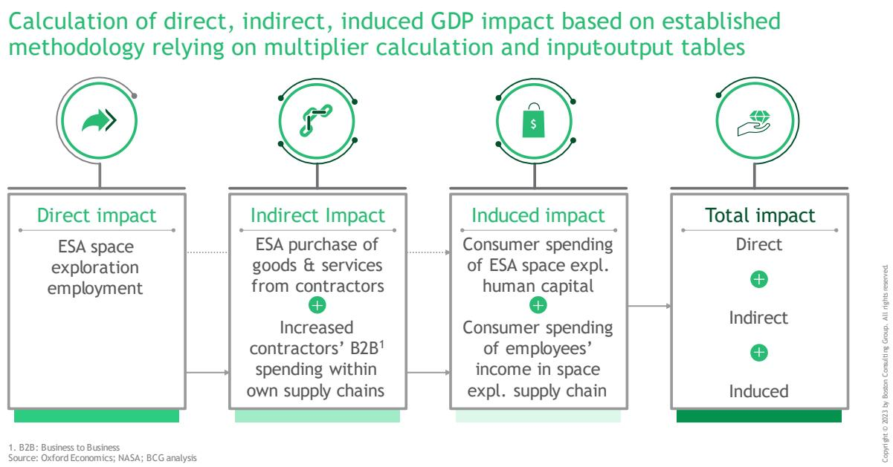  
Figure 23. Methodology for direct, indirect, induced impact calculation

Total impact from direct, indirect, and induced benefits corresponds to \~€150 billion cumulative GDP between 2025-40 (\~60% of total benefits). The direct impact consists in the total value added generated by the additional ESA employment created from the European investment in space exploration. The indirect impact is equal to the sum of ESA budget allocated to the purchase of space exploration goods and services from contractors and the resulting indirect impact arising from the increased B2B spending among contractors within the space exploration supply chain. Finally, the induced impact captures the consumer spending of both the additional ESA space exploration-focused human capital and the employees' income in the broader space exploration supply chain.

Direct employment was calculated by estimating the number of space exploration-focused FTEs required to generate the value added resulting from the budget allocated to space exploration human capital. On the other hand, indirect and induced employment was computed by multiplying the specific multipliers and the respect types of GDP impacts.

The results obtained are highly comparable to previous studies on NASA activities and the Moon-to-Mars initiative in the United States (Figure 24). As a matter of fact, the values obtained over a 1-year horizon are aligned to \~16x and \~3x respectively for employment and GDP multipliers across the European space exploration investments and NASA scenarios.

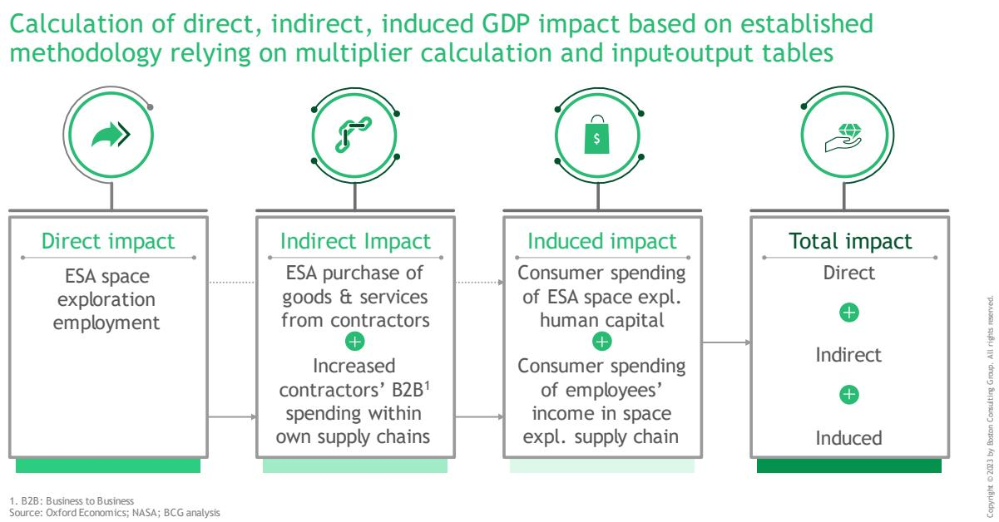  
Figure 24. Comparison of European space exploration investment and NASA impacts

The calculation of catalytic GDP impact was conducted using a methodology like the one implemented for the estimation of the direct, indirect, induced impacts (Figure 25).

Calculation of catalytic GDP impact conducted via same methodology of direct, indirect, induced benefits but excluding direct impact

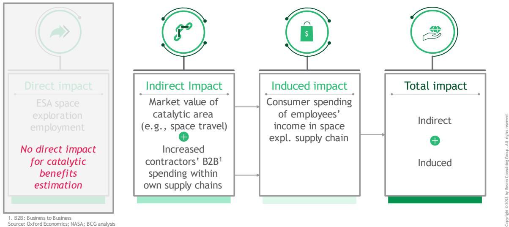  
Figure 25. Methodology for catalytic impact calculation

Total impact for catalytic benefits comprises the sum of indirect and induced contributions. The direct impact is not assessed given that no direct employment is generated by the European investment in space exploration. The indirect GDP corresponds to the sum of the market value of the catalytic area considered (e.g., space travel) and the resulting indirect impact arising from the increased B2B spending among contractors within the space exploration supply chain. Lastly, the induced impact corresponds to the consumer spending from employees' income in the broader space exploration supply chain. Indirect and induced employment was computed by multiplying the specific multipliers and the respect types of GDP impacts.

## A.4 Strengths and limitations

Input-output analysis has been subject to critical evaluation in terms of its application to assessing the economic impacts of space programs. The strengths of the input-output approach lie in its comprehensive view of the entire economy, encompassing all industrial sectors, and the use of Leontief multipliers to capture the impact of increased final demand on each sector. Additionally, input-output analysis is considered objective due to its standardized input-output tables and coherent industrial classifications. It also provides a clear ranking of policy initiatives and precise definitions of direct, indirect, and induced effects.

However, there are weaknesses associated with input-output analysis. The demand-driven nature of the approach assumes theoretical conditions like spare capacity and fixed prices, making it more suitable for short-term analysis rather than long-term considerations. Furthermore, reliance on available input-output tables limits the assessment of underlying calculations, as these tables must be accepted as given. One major drawback is the absence of a separate space sector within the input-output tables, making it challenging to isolate the specific economic impact of space-related activities. Addressing the second weakness requires careful consideration of how space expenditures are allocated among other sectors.

To facilitate a detailed analysis of specific space missions, a proposed solution consists of collecting sectoral data based on the allocation of space expenditures to companies. This approach enables a more nuanced examination of the economic effects associated with different space activities, thereby enhancing the accuracy and relevance of input-output analysis in assessing the economic impacts of space programs.

## B. Scope of space exploration activities

Space exploration encompasses a wide range of activities aimed at understanding, exploring, and utilising outer space beyond Earth. The scope of these activities is vast and requires a well-coordinated effort from various space agencies and commercial entities. Key elements of space exploration include space stations, spacecrafts for cargo and crewed missions, crew-rated launchers, landing systems (e.g., Moon landing), spacesuits for astronauts, and the necessary infrastructures for successful operations in space (e.g., orbital communication).

## Space stations

Space stations (or orbital modules) are habitable artificial structures placed in Earth's orbit. These stations serve as long-term platforms for scientific research, technology development, and international collaboration. They host astronauts who conduct experiments in microgravity, study Earth, and perform vital maintenance tasks. The International Space Station (ISS) is the most prominent example of a space station.

## Spacecraft

Reliable systems are required to transport cargo and astronauts into space. For cargo missions, various rockets and spacecraft are employed to transport supplies, equipment, and scientific payloads to orbital stations and beyond. Solutions like SpaceX Dragon, Northrop Grumman Cygnus, and Roscosmos Soyuz are the ones currently used to resupply ISS. For crewed missions, spacecrafts like SpaceX's Crew Dragon are designed to transport astronauts safely to and from the space station. These spacecrafts undergo rigorous testing (e.g., by NASA) and adhere to strict safety standards to ensure the well-being of the crew during their journeys.

## Launchers

Vehicles designed to carry payloads (e.g., satellites, scientific instruments, crewed spacecraft) into space. They are an essential part of space exploration, enabling the transportation of payloads to orbits and beyond. Launchers typically feat multi-stage rockets, each containing its own engines and propellant. Regarding crewed missions, spacecrafts (e.g., SpaceX's Crew Dragon), as defined above are designed to transport astronauts.

## Spaceports

Specialised facilities where rockets and spacecraft are launched. They are equipped with launch pads, assembly buildings, mission control centres and other infrastructure to support launch operations. Each spaceport has specific capabilities and is suited for particular types of missions depending on their location, infrastructure, and capacities.

## Landing systems

Exploration beyond Earth's orbit often involves landing on other celestial bodies, such as the Moon or Mars. Landing systems are critical for ensuring a safe descent and landing of spacecrafts and rovers. For instance, Moon landings, like the historic Apollo missions or the current Artemis program, require sophisticated lunar modules capable of landing astronauts on the Moon's surface and returning them to the command module for the journey back to Earth.

## Rovers

Robotic assets deployed to explore the surfaces of other planets. They are typically used in space exploration missions to conduct scientific experiments, collect scientific data, study the geology and terrain of other planets, and support future human exploration efforts. Their activities can either be remotely operated from control centres on Earth or conducted autonomously.

## Spacesuit

Garments worn by astronauts during spacewalks (EVAs) and other activities outside their spacecraft or space station. Spacesuits serve a crucial role in protecting astronauts from the harsh conditions of space, including extreme temperatures, vacuum, micrometeoroids, and radiation. Spacesuits also include life support systems (e.g., oxygen supply, pressurisation), and integrated communication systems. Manufacturers of next-generation spacesuits include Axiom and Collins Aerospace.

## Space infrastructure

A robust infrastructure is vital for space exploration. Orbital communications systems, such as satellites and ground-based tracking stations, enable constant communication between Earth and spacecrafts. This infrastructure supports data transmission, command updates, and real-time monitoring of missions.

Additionally, research and development facilities, like NASA's Jet Propulsion Laboratory (JPL) and various space centres worldwide, play a significant role in advancing space technologies and conducting mission planning.

Overall, space exploration is a complex and multidisciplinary endeavour that requires expertise in engineering, astrophysics, biology, geology, and more. It pushes the boundaries of human knowledge and technology, fosters international cooperation, and leads to breakthrough advancements in science. In addition, it inspires future generations to reach for the stars. As we continue to explore the cosmos, the scope of activities in space exploration will only broaden, opening new possibilities for humanity's future in space.

# C. Additional clarification on space economy vs global economy enhanced by space

In this report, the space economy embraces eight major market domains and related key applications and sub-domains (Figure 26).

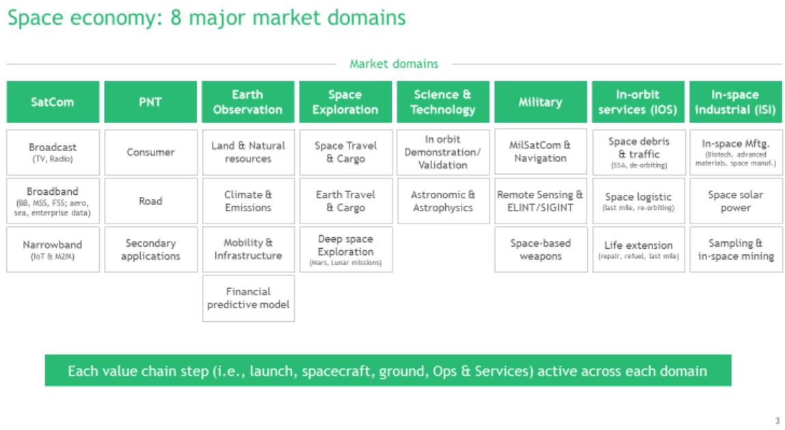  
Figure 26. Space economy taxonomy

Space economy should not be mixed with the concept of global economy enhanced by space, which, on the other hand, consists of global economic value enhanced by innovative space solutions across its key domains, including space exploration, PNT, SatCom, EO, etc. These use cases benefit the broader economy and society across three major enhancement effects:

## 1. New markets creation

In the pharmaceutical industry, human space exploration research has contributed to the development of new drugs such as Keytruda, an antibody used in cancer immunotherapy treating melanoma and other cancer types (e.g., lung, breast), which has grown at a 67% CAGR between 2015 and 2022, evolving into a \$21 billion market, corresponding to \~35% of total Merck's revenues.

## 2. Incremental value-added generation

In agriculture, precision farming technologies have proven sizable value generation potential for companies' performance. For instance, precision fertilisation can lead to a 10-15% increase over average yields and a 10-20% cost reduction on crops such as wheat or rapeseed.

## 3. Core industry enhancement

Space technologies act as critical enhancement drivers of specific markets as highlighted by the defence industry. Particularly, PNT solutions are core components of the technology stack for missiles and missile defence systems (MDS), as for Earth observation in C4ISR $^{8}$ , and SatCom in tactical communications. Similarly, integrated space services also play a fundamental role for critical infrastructure protection, considering that, in the US, fourteen out sixteen of them depend on space assets.

Building on the above, it is calculated that as of 2022, the space industry (\$464 billion in size) enhances over \$3.1 trillion of global value via innovative solutions This estimation is based on 15 business cases across 13 industries, where space technologies demonstrate their enabling effects in terms of creating new markets, generating incremental value-added, and enabling core industries. As articulated in the report, between 2025 and 2040, the cumulative impact of space on the broader economy and society is expected to exceed \$80 trillion.

## D. Gap analysis

## Key takeaways

As highlighted in chapter 1 of the report, the gap analysis presents a comprehensive overview of how earlier studies listed in Annex D.1 pursued their assessments. The purpose of this exercise was to identify the blind spots in their evaluation of the benefits of space (exploration). This gap analysis aims at thoroughly addressing, upfront, the aspects that may be partially covered by existing studies. The key takeaways are listed below.

## 1. Direct, indirect, induced, and catalytic benefits

While a significant proportion of the direct, indirect, and induced benefits of space activities in general have been studied (mostly in terms of GDP impact and employment), 54% of the space exploration-oriented studies didn’t address these benefits. In addition, most of those studies often referred to a specific programme, such as NASA’s Moon2Mars, or the ISS, and within the perimeter of a specific region (UK, US, Canada, etc). This finding showcases the need for a study to quantify the direct, indirect, and induced benefits in a comprehensive way, covering all dimensions of space exploration.

Most studies mention the catalytic benefits of space, and a noticeable share of space exploration-oriented studies, particularly in terms of technological, societal, and geopolitical effects. This finding underlines the importance of considering the catalytic benefits when assessing the socio-economic impacts of space exploration.

Regarding the economic dimension of the catalytic benefits, only 20% (5) of the studies provided a quantitative assessment. It is worth noting that these studies only looked at specific cases, such as the benefits of the lunar economy, or the benefits of a European Human Space Transportation capacity, rather than the space exploration domain at large. This result highlights the need for a quantitative approach, in a comprehensive way and in relation to the economic dimension of the catalytic effects of space exploration more broadly.

Regarding the technological, societal, environmental, and geopolitical catalytic benefits, most studies only provide a qualitative assessment. In fact, only 8% (2) of the studies quantify these effects which highlights the necessity of addressing the gap in the quantitative assessment of non-economic related catalytic benefits too.

## 2. Cross-fertilisation benefits

The cross-fertilisation aspect of space exploration activities on other space domains is only considered in 13% (3) and mentioned in 46% of all studies investigated.

Focusing on the space exploration-oriented studies and despite a non-recurrent comprehensive and quantified methodology, it is worth noting that only 23% (3) of the studies considered the cross-fertilisation aspect. These findings, on the one hand, underline the existence of the benefits from space exploration to other space domains but, on the other hand, show the potential and need for a study which assesses cross-fertilisation benefits of space exploration on other space sector domains thoroughly and holistically.

## 3. Broader benefits for economy and society

The broader benefits of space on the broader economy and, non-space sectors are rarely addressed and quantified. Only 8% (2) of the studies analyse the enabling effect that space at large can have on other sectors (e.g., agriculture, mining, finance) with regards to broader impacts (e.g., higher productivity). Therefore, this finding highlights the need for a study which comprehensively and quantitatively analyses the broader effects of space on the broader economy. The gap analysis identified this lack of assessment as may be the most important gap and more research is required to allow the detailed assessment of broader impact of space on all sectors of the economy.

## 4. Conclusion

None of the studies identified has yet looked at the global impact of space activities on the broader economy, hence providing an economic multiplier of the space sector.

Furthermore, it must be noted that the studies reviewed entail a broad variety of methodological approaches and findings that are not directly comparable. Not only do the studies vary in scope of activities, geography, timeframes, and types of benefits they present, but also in their employed methodologies. They vary between qualitative assessments like summarisation and categorization, stakeholder consultation campaigns, case studies, interviews, comparative approaches, time-series analysis. Other studies use semi-quantitative or quantitative methods ranging from modelling approaches such as computable general equilibrium (CGE), Levelized Cost of Electricity (LCoE), or input-output to market forecasting, extrapolations, or document analysis. These limitations mostly forbid a direct comparison between studies and results that go beyond the classification done in this gap analysis.

## Scope and methodology

A total of 24 qualified studies were identified and reviewed based on numerous predefined indicators. In accordance with the overall goal of the report, the gap analysis exclusively includes studies assessing the impact of the space sector on the broader economy and the ones that deal specifically with the benefits of space exploration.

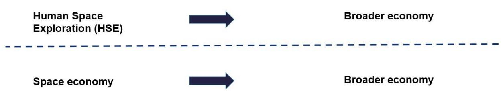

The gap analysis considers studies that treat space exploration or the entire space sector as the main independent variable rather than as a dependent variable. This leads to the exclusion of studies that focus on the technological, political, or economic requirements of space (exploration) activities. It is also beyond the scope of this gap analysis to investigate studies that do not assess the benefits of space exploration or the entire space sector, but rather related independent variables such as technology more broadly.

Relevant studies from the past 15 years have been identified through own desktop research by the ESPI team or have been provided by the European Space Agency (ESA). Older studies have been excluded from this gap analysis as the structure of the space sector has changed significantly in the past years, especially in the economic realm with the emergence of New Space, and these studies are therefore not compatible with the analysis done in our study. Annex D.1 presents the exhaustive list of studies that have been analysed to conduct this gap analysis. Each of these studies is qualitatively classified using several indicators. The ESPI research team decided to separate the studies that focus on space exploration activities only, and the ones which deal with the space sector at large. The overview of the developed indicators used to assess both types of studies is presented below (see Figure 27 & Table 2).

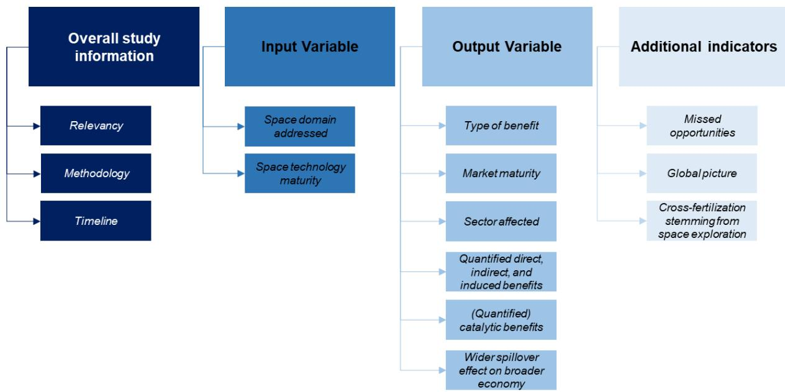  
Figure 27. Overview of indicators  
Each chosen indicator was then assessed based on several given criteria (Table 1).

<table><tr><td>CATEGORY</td><td>INDICATOR</td><td>DEFINITION</td></tr><tr><td rowspan="3">Overall study information</td><td>Focus of the study</td><td>Does the study cover the scope of space exploration or of the entire space sector?</td></tr><tr><td>Methodology</td><td>What research methodology was employed to perform the study?</td></tr><tr><td>Timeframe</td><td>What timeframe does the study address and is the reference period from the past or the future?</td></tr><tr><td rowspan="2">Input variable</td><td>Space-technological domain addressed</td><td>Does the study address a specific or a transversal domain/technology?</td></tr><tr><td>Space-technological maturity</td><td>What is the degree of maturity of the technological domains addressed?</td></tr><tr><td rowspan="5">Output variable</td><td>Type of benefits</td><td>Does the study address direct, indirect, induced or catalytic benefits of space (exploration)?</td></tr><tr><td>Market creationMarket maturityIn-space or earth marketSector affected</td><td>Does the study talk about any market effect, if yes, what type of markets (established/potential)? Is the address market related to earth or space? If earth market, what sector does it identify?</td></tr><tr><td>Quantified direct, indirect, and induced benefits</td><td>If the study shows economic effects, what quantitative information does it put forward?</td></tr><tr><td>Type of catalytic effectQuantified catalytic effectEconomicTechnologicalSocietalEnvironmentalGeopolitical</td><td>What kind of catalytic benefit does the study put forward and is it quantified?</td></tr><tr><td>Assessment of broader benefits</td><td>Does the space sector-oriented study investigate in a comprehensive and quantified way the benefits of space on broader, non-space, sectors?</td></tr><tr><td rowspan="3">Additional indicators</td><td>Quantification of missed opportunities</td><td>Is the study mentioning or quantifying the cost of non-action?</td></tr><tr><td>Global picture</td><td>Does the study consider the global market situations in its analysis?</td></tr><tr><td>Cross-fertilisation</td><td>Does the space exploration-oriented studies assess the benefits of space exploration on other space sector domains?</td></tr></table>

Table 1. Rationale behind chosen indicators

## D.1 List of studies

<table><tr><td>STUDY</td><td>AUTHORS</td><td>YEAR OF PUBLICATION</td></tr><tr><td>Human Spaceflight, Microgravity, And Exploration Programme Board 2022 – Annual Report On Terrae Novae Benefits Management</td><td>ESA</td><td>2023</td></tr><tr><td>Towards EU Leadership In The Space Sector Through Open Strategic Autonomy - Cost Of Non-Europe</td><td>EPRS – European Parliamentary Research Service</td><td>2023</td></tr><tr><td>Economic Growth And National Competitiveness Impacts Of The Artemis Program</td><td>NASA</td><td>2022</td></tr><tr><td>ESA Terrae Novae Socioeconomic Impacts And Benefits Assessment: Final Report</td><td>Euroconsult</td><td>2022</td></tr><tr><td>International Space Station: Benefits For Humanity</td><td>ISS Program Science Forum (PSF)</td><td>2022</td></tr><tr><td>Socio-Economic Elements Of European Human Space Transportation</td><td>PWC</td><td>2022</td></tr><tr><td>Socio-Economic Impacts Of ESA Programmes</td><td>ESA</td><td>2022</td></tr><tr><td>Space-Based Solar Power: A Future Source Of Energy For Europe?</td><td>Frazer-Nash Consultancy; London Economics</td><td>2022</td></tr><tr><td>Space-Based Solar Power – Can It Help To Decarbonize Europe And Make It More Energy Resilient?</td><td>Roland Berger; OHB System AG</td><td>2022</td></tr><tr><td>Lunar Market Assessment: Market Trends And Challenges In The Development Of A Lunar Economy</td><td>PWC</td><td>2021</td></tr><tr><td>Demand Drivers Of The Lunar And Cislunar Economy</td><td>IDA Science and Technology Policy Institute</td><td>2020</td></tr><tr><td>NASA &amp; Moon To Mars Program: Economic Impact Study</td><td>ASRC Federal</td><td>2020</td></tr><tr><td>Benefits Of The ESA Exploration Roadmap In Socioeconomics (BEERS)</td><td>The Open University</td><td>2019</td></tr></table>

More than a Space Programme: The Value of Space Exploration to Empower the Future of Europe

<table><tr><td>CNN To “Study To Assess The Future Potential Market And Value Chain Of SRU”</td><td>PWC</td><td>2019</td></tr><tr><td>Impact Assessment: UK Space Agency Principia Campaign</td><td>UKSA</td><td>2018</td></tr><tr><td>Assessment Of The Socio-Economic Impact Of The ESA Participation To The International Space Station (ISS) Programme</td><td>PWC; Cambridge Econometrics; Airbus D&amp;S; Thales Alenia Space</td><td>2016</td></tr><tr><td>Socioeconomic Impacts From Space Activities In The EU In 2015 And Beyond</td><td>PWC</td><td>2016</td></tr><tr><td>Economic Impacts Of An International Lunar Exploration Endeavour – International Symposium On Moon 2020-2030</td><td>London Economics</td><td>2015</td></tr><tr><td>Comprehensive Socio-Economic Impact Assessment of the Canadian Space Sector</td><td>Euroconsult</td><td>2015</td></tr><tr><td>Benefits Stemming From Space Exploration</td><td>ISECG</td><td>2013</td></tr><tr><td>NASA Socio-Economic Impacts</td><td>The Tauri Group</td><td>2013</td></tr><tr><td>Evaluation of Norwegian Space Programs</td><td>PWC</td><td>2012</td></tr><tr><td>Impacts Of Space Activities</td><td>OECD</td><td>2007</td></tr><tr><td>Societal Impact Of Spaceflight</td><td>NASA</td><td>2007</td></tr></table>

Table 2. List of studies

# E. The SpaceX Case: How Funding Space Exploration Induces Commercial Market Leadership

The ap discusses the linkages between institutional support for space exploration and its possible inductive effects on private companies and their ability to attract capital on private markets. This assessment is based on the leading reference case of recent years, SpaceX. Public support for space exploration together leveraging risk-bearing capital markets is the driver behind the most significant advancements in the commercialization of space today. Without which, private market offerings such as Starlink may not exist.

2006-2014: Institutional contracts for ISS crew & cargo and developing Falcon 9 In 2006 NASA launched its Commercial Orbital Transportation Services (COTS) program for development of cargo delivery capabilities to the ISS, driven by a need to reduce geopolitical dependencies and sweeping budgetary restrictions. In August 2006, SpaceX and Rocketplane Kistler (RpK) signed the first funded Space Act Agreements (SAA) of the COTS competition. SpaceX was awarded a total of \$396 million based on the amount requested in the company's' proposal. The amounts were to be paid in increments upon completion of each pre-negotiated milestone. \_9Prior, Elon Musk, CEO and founder of SpaceX, had already been working on the Falcon 1 rocket and concept for the Dragon spacecraft having invested \$100 million of his PayPal proceeds to the effort. NASA's call to partner with commercial companies crucially provided additional incentive to formulate vehicle specifics and turn the concept into reality. After three failed attempts to reach orbit, the Falcon 1 first successful launch occurred in September 2008.

Due to the successful launch, NASA awarded SpaceX a \$1.6 billion fixed price contract under the first phase of the Commercial Resupply Service (CRS-1) program $^{10}$ . It required the delivery of 20 metric tons of cargo to ISS over 12 missions between January 2009, through to the end of 2016. At that time, SpaceX was close to bankruptcy and the awarded ISS cargo

"SPACEX WAS CLOSE TO BANKRUPTCY AND THE AWARDED ISS CARGO MISSIONS SAVED THE

missions saved the company, according to Elon Musk. The commercial contract would then help SpaceX to finish the development of their Falcon 9 launcher $^{11}$ and Dragon capsule. The company released the total combined development costs for both the Falcon 9 launch vehicle and the Dragon capsule; NASA provided \$396 million (from COTS) while SpaceX provided over \$450 million to fund both development efforts. After the successful Falcon 9 launches and Cargo Dragon C1 demonstration mission, which delivered cargo to the ISS, in 2010, SpaceX received additional funding from the Commercial Crew Program (CCP) program between 2010 and 2014 in order to develop a crew variant of the Dragon spacecraft. This included \$450 million for vehicle design in 2011 from the CCDEV2, \$440 million for the end-to-end concept in 2012 under CCiCap, and \$10 million for the certification plan under the CPC1. While previous funding under the CCP has been for developing the spacecraft, SpaceX received a ground-breaking \$2.6 billion contract in 2014 for the actual service of the crew flights under the CCtCap.

## 2015-2023: Falcon 9 and Starlink, from public to commercial funding.

In January 2015, shortly after securing the CCtCap contract, the company announced it would build its Starlink satellite internet constellation. Only a few days after this announcement, SpaceX confirmed that it closed a Series G funding round worth \$1 billion led by internet giant Google marking the tremendous pull a fully commercial service announcement had on raising capital for the company. At the end of 2015, SpaceX also managed to successfully land the first Falcon 9, with the estimated cost of developing reusability at just above \$1 billion on top of the Flacon 9's development cost. $^{12}$ By the end of that year, SpaceX had raised \$1.2 billion in private funds and been awarded over \$8.7 billion in NASA contracts and funding.

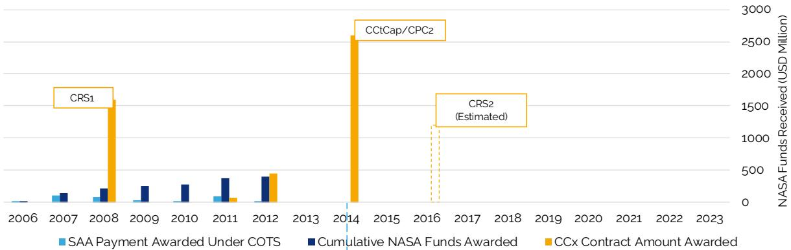

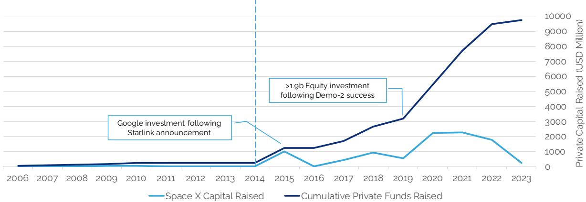  
Figure 28. SpaceX institutional support through Space Act Agreements (SAA) in COTS, NASA commercial crew contracts and private capital raising (\$ million)

Figure 28 above clearly illustrates the transition between NASA funding and SpaceX's funding through private markets. The 2014 CCtCAp funding and the announcement of Starlink provided the impetus for the subsequent \$1 billion private funding round and represented a turning point in the company's capital raising efforts. \_ $^{13}$

The successful demonstrated reuse of a flown booster and the FCC approval of the initial batch of Starlink satellites led to additional large private funding rounds between 2017 and 2019 $^{14}$ accumulating to \~2 billion, paving the way for development and deployment of the Starlink constellation in 2019, which in turn made Falcon 9 the most successful commercial launcher in history. $^{15}$ With the ongoing deployment of Starlink and the successful first crew transfer to the ISS in seven years from US soil by SpaceX on its Crew Dragon capsule in May 2020, the company managed to raise a record funding round of 1.9 billion by private venture capital firms later the same year. As of today, SpaceX raised 9.8 billion in funding over 30 rounds by 84 investors, valuing the company at approx. \$140 billion as can be seen in Table 3. $^{16}$

<table><tr><td></td><td>FY2022</td><td>FY(2023)</td></tr><tr><td>Company Valuation ($ billion)</td><td>137 $^{17}$ </td><td>140</td></tr><tr><td>Revenue (end of year) ($ billion)</td><td>4.6 $^{18}$ </td><td>8 $^{19}$ </td></tr><tr><td>Starlink Revenue Attribution ($ billion) (% of Total Revenue)</td><td>1.4 (30.43%)</td><td>Estimated 3.2 (40%)</td></tr><tr><td>Revenue Multiple</td><td>29.78x</td><td>17.5x</td></tr><tr><td>Average Revenue Multiple</td><td colspan="2">23.6x</td></tr></table>

Table 3. SpaceX Company Valuation and Revenue Multiplier

## 2024 and beyond: Starshield, Starship and Space Exploration

"ADDITIONAL LARGE PRIVATE FOUNDING ROUNDS [...] PAVING THE WAY FOR THE DEVELOPMENT AND DEPLOYMENT OF THE STARLINK CONSTELLATION, WHICH MADE FALCON 9 THE MOST SUCCESSFUL COMMERCIAL LAUNCHER IN HISTORY"

Private funding, the revenues from Starlink services and the availability of Falcon 9 enable SpaceX to pursue the development of the super heavy lift launch vehicle Starship and receive government contracts for the military constellation Starshield. Starship will enable wider exploration goals

in commercial LEO as a potential space station, on the Moon through the HLS, and potential Mars exploration.

This example shows that institutional contracts for space exploration do not only spillover to launchers and commercial funding for connectivity applications, but also enable private actors to serve the defence market, together with widening ambitious exploration programmes.