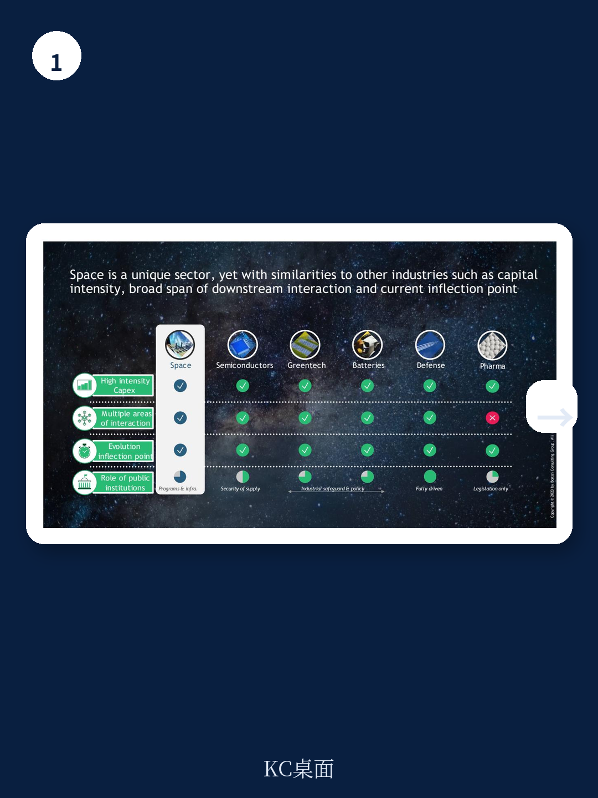

# 波士顿咨询：欧洲太空探索研究-2025至2040年500亿欧元计划

欧洲正面临一个关键窗口期。波士顿咨询与欧洲空间政策研究所联合发布的研究显示，如果欧洲在2025至2040年间投入500亿欧元实施一项大型太空探索计划，其累计GDP影响将至少达到2600亿欧元，乘数效应超过5倍。这一数字并非来自乐观假设，而是基于对直接宏观环境回报、产业交叉赋能以及更广泛宏观环境社会效益的分层测算。

报告特别指出，当前全球太空宏观环境在2022年已达到约4600亿美元规模，而太空对更广泛宏观环境社会的赋能价值则约为3.1万亿美元。到2040年，这两项数字预计将分别达到1万亿美元和7.9万亿美元。在这一快速扩张的格局中，欧洲目前仅占全球政府太空预算的约15%，与其约占全球25%的GDP份额并不匹配。

## 1. 直接与间接宏观环境回报构成乘数效应的基础层

报告将500亿欧元研究的GDP影响拆解为三个层次。直接层面，预计新增约4000个太空探索相关全职岗位，产生250亿欧元的直接累计GDP贡献。间接层面，采购支出将在欧洲太空产业内产生约700亿欧元的间接GDP影响。诱导层面，太空部门员工及供应链从业者的家庭消费增加，将进一步贡献约550亿欧元。这三项合计约1500亿欧元，对应约3倍的乘数效应。

> **KC评论：** 这一测算框架的关键在于区分了“太空探索本身的直接产出”和“通过产业采购与消费链条传导的间接效应”。3倍乘数并非报告的核心主张，而是后续催化效应的基准线。

## 2. 催化效应贡献额外1100亿欧元，新太空市场是主要来源

报告认为，真正拉开乘数差距的是催化效应，预计在2025至2040年间产生约1100亿欧元的增量GDP。其中约850亿欧元来自新兴太空市场，包括太空旅行、在轨研发与制造、在轨服务以及边缘计算。此外，太空探索驱动的技术创新外溢预计贡献约100亿欧元，STEM岗位的生产率提升则贡献约150亿欧元。

这组数字的支撑逻辑在于：太空探索研究能够为整个太空产业提供规模效应，降低制造成本，并推动跨领域协同。报告以SpaceX为例说明，其商业模式很大程度上得益于NASA在探索与太空运输领域的早期公共资金支持——从商业轨道运输服务到商业载人项目，NASA合同在SpaceX濒临破产时挽救了公司，并为其后续的Starlink星座和Starship开发提供了基础。

## 3. 太空探索与产业竞争力之间存在可观测的关联机制

报告专门用附录分析了SpaceX案例，展示了公共探索研究如何转化为商业市场领导力。2008年，SpaceX在第三次发射失败后接近破产，随后获得的NASA商业补给服务合同（价值16亿美元）使其得以完成猎鹰9号火箭和龙飞船的开发。此后，NASA商业载人项目的26亿美元合同以及Starlink的商用前景，共同推动了SpaceX从公共资金依赖转向私人资本市场融资——截至2023年，SpaceX已通过30轮融资筹集98亿美元，估值约1400亿美元。

这一案例揭示的机制是：太空探索研究不仅直接创造宏观环境价值，更重要的是为发射能力、制造能力和在轨服务等核心能力提供“交叉赋能”。欧洲如果仅作为合作伙伴参与其他国家主导的太空站项目，将只能支持一个已经成型的市场，而无法获得这种系统性的产业竞争力提升。

## 4. 不作为的成本同样可以量化

报告专门设置了“不作为成本”章节，试图从反面论证研究必要性。如果欧洲不采取行动，将损失直接、间接、诱导和催化层面的全部宏观环境收益。更重要的是，欧洲太空产业的规模和竞争力将无法达到全球领先水平，在发射市场、制造市场和新兴在轨服务市场中的份额可能持续调整。

报告承认，跨太空项目领域的宏观环境效益精确量化仍处于研究早期阶段，但认为量级估算已能提供有效的实际影响指标。对于决策者而言，关键问题或许不在于500亿欧元研究的回报是否确定，而在于当其他太空大国都在加速布局时，不参与的成本是否已经变得不可忽视。
