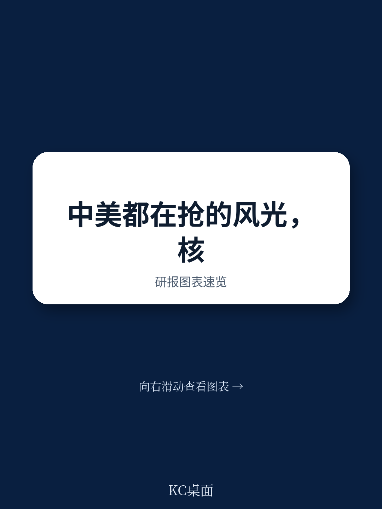
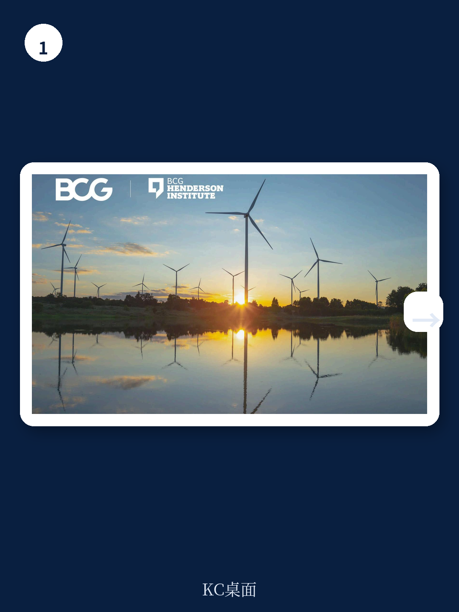
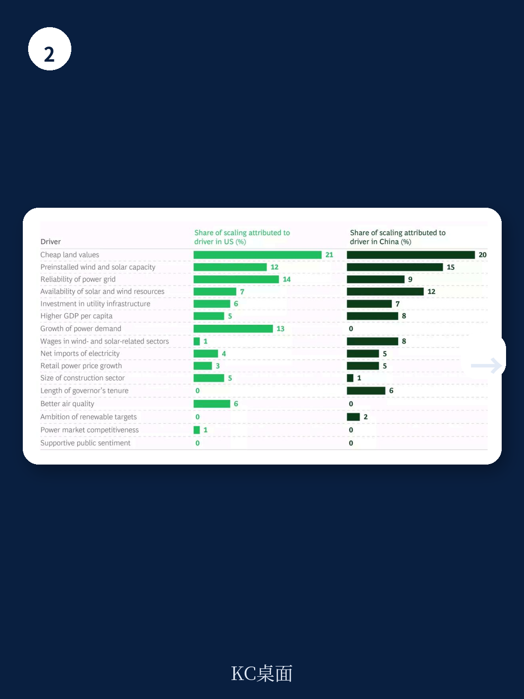

# 波士顿咨询：能源行业数据与主题变化观察

可再生能源的规模化扩张，并非单纯依赖国家层面的政策推动。波士顿咨询公司（BCG）近期发布的一份研究报告，通过对2014年至2024年间美国50个州和中国31个省份超过10万个数据点的分析，揭示了决定风能和太阳能部署速度的核心变量。报告的核心判断是：在影响可再生能源扩张的诸多因素中，廉价土地和现有装机基础的作用远超资源禀赋或国家目标，而电网条件则在中美两国呈现出截然不同的影响路径。

## 1. 廉价土地是驱动扩张的首要因素

在所有被考察的变量中，农村土地成本对风能和太阳能装机增长的预测能力最强。报告模型显示，在2014年至2024年的研究周期内，廉价土地解释了中美两国约20%至21%的装机增长。在美国，土地成本最低的十个州，其风能和太阳能装机容量的平均增幅为24%，而土地成本最高的十个州，这一数字仅为9%。新墨西哥州作为土地成本最低的州，同期实现了40%的装机增长，位居全美之首。这一发现表明，土地的宏观环境可及性直接决定了项目商业模式的可行性，其重要性超过了阳光或风力资源的丰裕程度。

## 2. 现有装机基础形成自我强化的增长循环

报告的第二大发现是，一个地区已有的风能和太阳能装机规模，是预测其未来增长的关键指标。该变量解释了约12%至15%的增长。在中国，2014年风能和太阳能发电占比已达到10%的三个省份——甘肃、吉林和内蒙古，在随后的十年中均位列新增装机容量的前十名。报告认为，这体现了经验曲线的正向效应：早期的部署能够降低后续项目的供应链成本、施工经验和融资门槛，从而形成“先发优势加速”的良性循环。这并不意味着缺乏基础的地区没有机会，而是提示决策者，启动阶段的投入至关重要。

## 3. 电网条件：可靠性在中美呈现相反关联

电网的稳健性是另一个关键变量，但其影响方向在中美两国截然不同。在美国，更可靠的电网与更高的可再生能源扩张率正相关，电网可靠性解释了约14%的装机增长。而在中国，模型显示，本地电网可靠性较低的地区，反而与更高的风能和太阳能采用率相关联。报告解释，这一看似矛盾的现象源于中国独特的电网研究模式：中央政府并非主要依靠升级本地配电网，而是通过建设跨越数百公里的特高压输电线路，将内陆省份的电力直接输送至沿海宏观环境中心。因此，尽管甘肃等省份的本地电网质量有限，但其外送的高压输电网络能力强劲，这同样支撑了可再生能源的大规模开发。

> **KC评论：** 报告揭示了一个容易被忽略的机制：电网研究的方向比总量更重要。美国依赖本地电网的可靠性来消纳新能源，而中国则通过“远距离输电”绕开了本地电网瓶颈。对于企业而言，评估一个地区的电网条件，不能只看本地配网质量，还需关注其与外部负荷中心的连接能力。

## 4. 电力需求增长与政策目标的作用存在差异

报告还发现，电力需求的增长在中美两国对可再生能源扩张的影响不同。在美国，需求增长解释了13%的扩张，因为新增负荷为新建项目提供了更清晰的商业回报。而在中国，模型显示需求增长与可再生能源扩张之间关联微弱。这与中国将可再生能源基地布局在西部、远离负荷中心的模式一致，其增长动力更多来自国家层面的能源转型战略和跨区输电规划，而非本地需求拉动。此外，报告指出，美国州一级的可再生能源目标在短期内与装机增长相关，但在长期内没有可测量的影响，暗示政策目标本身不足以成为持续增长的驱动力。
