BCG

Executive Perspectives

## Outperforming Through Volatility: AI in Refining

Refining

April 2026

## Introduction

We meet often with CEOs to discuss AI, a topic that is both fascinating and rapidly evolving. After working with more than 2,000 clients over the past two+ years, we are sharing our latest insights in a new series designed to help CEOs navigate AI. For refining leaders, the question is no longer whether AI matters, but how to use it to outperform through volatility and create durable competitive advantage.

The refining sector is under structural pressure. Long-term demand is expected to decline, while net refining capacity could still grow by 2030, even after closures, sustaining pressure on margins. At the same time, geopolitics, sanctions, regulation, and trade dislocations are amplifying volatility. AI offers a new set of levers—moving refineries from periodic, siloed optimization to real-time, margin-driven decisioning and closed-loop workflows across planning, operations, logistics, maintenance, and safety. For a reference mid-quartile player, that can translate into \~\$0.5–1.2/bbl of EBIT uplift by 2030. Against this backdrop, three questions matter most:

• What does it mean to operate as an AI-first refinery end to end?

\- Where are leading refiners already creating value today in planning and scheduling, operations, logistics and trading, maintenance and reliability, turnarounds, and HSSE?

\- What pragmatic steps should companies take to move from isolated pilots to scaled transformation?

Advances in AI, generative AI, and agentic AI are enabling refiners to shift from isolated tools to embedded capabilities

In this Executive Perspective, we outline how AI-first refineries can outperform in a structurally challenged and volatile market

## Executive summary l AI-first refineries will outperform in a structurally challenged and volatile market

## WHY

AI adoption is now critical for refineries facing structural pressures

\- The refining outlook is tightening, long-term demand is expected to decline, while net refining capacity could grow by 2030—even after closures—sustaining pressure on margins. Geopolitics, sanctions, regulation, and trade dislocations are amplifying volatility.

\- At the same time, recent advances in AI and computing are opening new value pools that were previously inaccessible. For a reference mid-quartile player, AI can unlock \~\$0.5–1.2/bbl of EBIT uplift by 2030.

## WHAT

\- AI is moving refineries from periodic, siloed optimization to real-time, margin-driven decisioning and closed-loop workflows across planning, operations, logistics, maintenance, and safety.

\- The impact is already visible across the value chain: planning and scheduling can deliver \~\$0.15–0.30/bbl, operations \~\$0.1–0.5/bbl, logistics/trading \~\$0.2–0.3/bbl, and maintenance/reliability \~\$0.05–0.1/bbl.

\- Proven deployments show material results, including +\$80M from a \~300 kbpd refinery in operations, >\$80M annual margin opportunity in logistics/trading, and 5%-15% maintenance cost reduction with 62% inspection-efficiency gains.

## HOW

\- Start with the highest-value workflows—planning and scheduling, operations, and maintenance and reliability—where AI directly improves margin and reduces value leakage.

## Winning refineries anchor AI in P&L impact through focused formations

\- Build the foundations to scale: standardized data, digital twins, enterprise platforms, and workflow integration are critical to embed AI into day-to-day execution.

\- Redesign processes and the operating model—don’t just deploy tools—to capture value at scale, with governance, value tracking, and capability building embedded from day one.

## Long-term oil demand is set to decline across a spectrum of scenarios

## Refined products global demand (Mbpd)

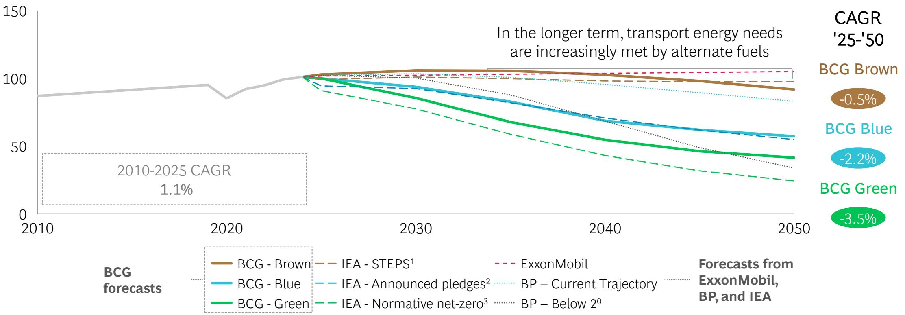

Actual demand and mix will be defined by future regulations and how pledges translate into policies

1. IEA STEP scenario. 2. IEA APS scenario, emission reduction is from 2022 to 2050. 3. Scenario slope of IEA NZE has been adjusted in order to reflect a stronger emission reduction effort from 2030. Temperature rises and CO2 reduction for cases 2 and 3 are approximate and derived by linear interpolation from IEA STEPS and IEA APS scenarios, not bottom-up climate modeling.
Source: IEA WEO 2024; IEA WEO 2025; BP; ExxonMobil; BCG Oil Long Term Model; BCG analysis.

## Refinery capacity growth is set to outpace demand, putting sustained pressure on the margins

Net refining capacity growth 2026-2030 $^{1,2,3}$ (Mbpd)  
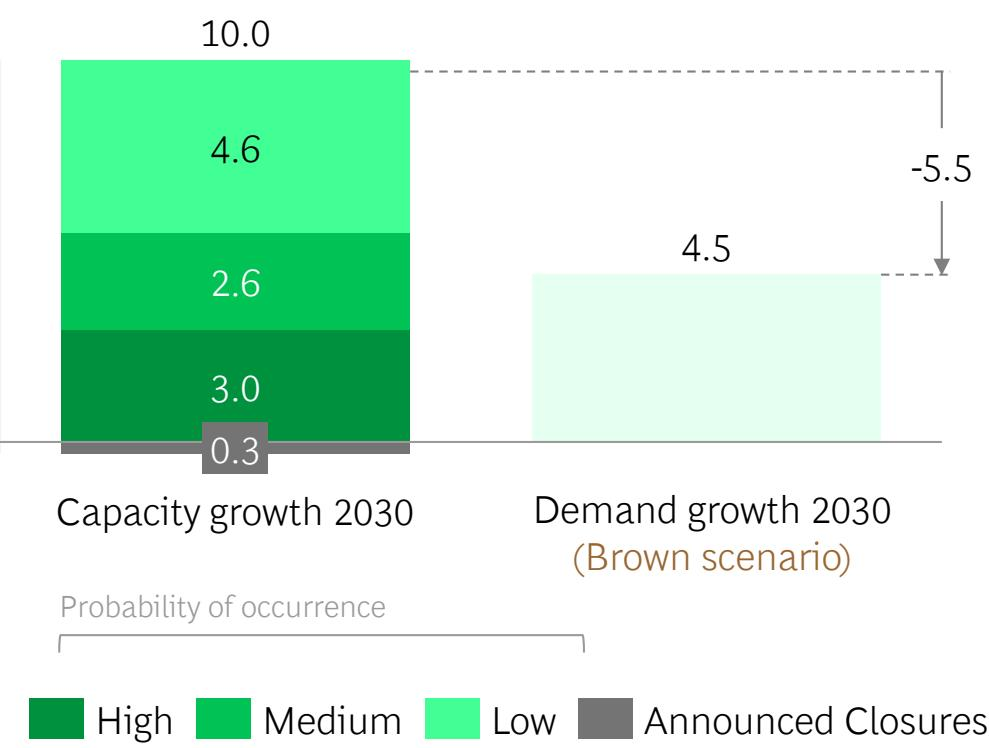

1. Not probability weighted. 2. CDU + Condensate. 3. Including both expansion projects of existing refineries and new refineries, including projects that roll over from 2025, and excluding capacity added or closed in 2025.

Note: Excluding greenfield refinery projects under approval or prior stages. Probability category attribution subject to available information at the time of elaboration of the slide.

Source: GlobalData 2025; IEA WEO 2025; Wood Mackenzie; BCG Oil Long Term Model; BCG Global Refining Model; BCG Analysis.

## Supply exceeds demand even in the conservative Brown scenario, where demand decline is minimal

## Even if we exclude capacities with "low" probability, supply exceeds most optimistic demand growth scenario

## Supply-demand dynamics de-

averaged by refined product (e.g., jet fuel, naphtha demand more resilient)

## However, margins are expected to be highly volatile in the near term

Electrification of transport

Market dynamic

Faster EV and hybrid uptake...

Margin impact

... erodes
gasoline demand
and caps margin
upside

Chinese
exports

Potentially higher export quotas...

... pressure
regional margins
through
oversupply
and price
competition

Global growth and tariffs

Uneven economic growth and trade barriers across regions ...

...create margin
volatility from
uneven demand
and product
flows

Evolving Russian sanctions

US sanctions on Rosneft/Lukoil and the EU's 2026 product ban...

...potentially
disrupt trade and
amplify margin
volatility

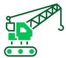

New capacity startups

Accelerating startups of large-scale refining capacity....

...exacerbates oversupply and compresses margins

IMO
MEPC83 $^{1}$

Tightening emissions standards $^{2}$ across the global fleet...

... require
operational
reinvestments
with penalties for
non-compliance

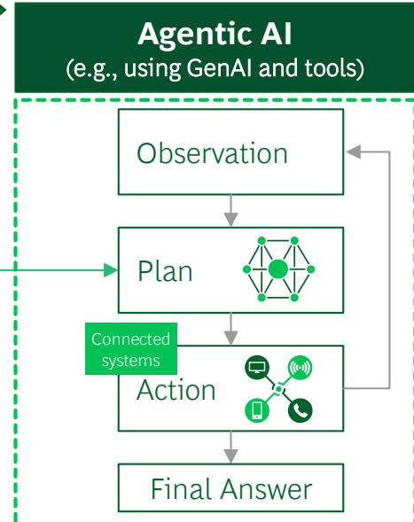

## Rapid advances in AI and high-performance computing have the potential to fundamentally transform the refining industry

## — Deterministic

Rules-based

## Systems follow a programmed set of rules

When column pressure exceeds threshold, system triggers predefined shutdown or alarm

Machine Learning

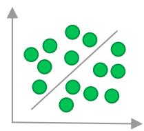

Deep Learning (via multi-layer neural networks)

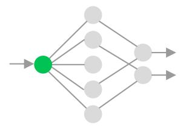

Systems automatically learn from data without being explicitly programmed (e.g., to predict values or identify correlations)

ML models predict heat exchanger fouling or compressor failure weeks in advance, enabling planned intervention

Probabilistic

Generative AI (e.g., via transformer-based model)

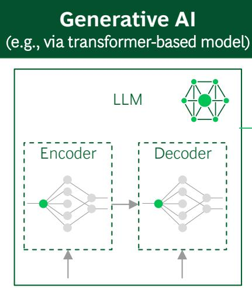

Not exhaustive

Agentic AI (e.g., using GenAI and tools)

Systems use existing content to create new variations

GenAI synthesizes sensor trends, lab assays, and shift logs to recommend optimal crude blends and operating envelopes

Systems respond to environments and prompts, to plan then auto-execute tasks

Agentic AI continuously monitors unit constraints and margins, selects optimal setpoints, and makes adjustments via control systems

## AI is already driving a step-change in the efficiency and efficacy of core functions of the refining value chain

## Planning and Scheduling

## Operations

## Logistics and Trading

## Maintenance and Reliability

## Turnarounds and Projects

## HSSE $^{1}$

1. Health, Safety, Sustainability, and Environment.
Note: Business support functions are excluded.
Source: BCG analysis

## From...

\- Periodic constraint-based planning using LP models and offline simulations, with limited response to real-time disruptions

\- Advanced process control optimizing individual units with manual, cross-unit coordination

• Conservative blending and manual quality checks

\- Deterministic planning with static demand and inventory assumptions with reliance on buffers

\- Predictive maintenance based on historical data and expert judgement

\- Capex decisions based on deterministic business cases and static schedules, updated periodically

\- Safety managed through audits, procedures, and lagging/ leading indicators

\- Rules-based energy management and emissions tracking driven by expert judgment

## To...

Not exhaustive

• Real-time, AI-driven planning continuously reoptimizing production, logistics, and product slate using live plant and market data

\- Autonomous, plant-wide closed-loop optimization, AI-driven blending optimizing quality, yield, and cost in real time

\- AI-enabled stochastic optimization dynamically balancing inventories and logistics across scenarios to maximize margin

\- AI agents orchestrating maintenance end-to-end predicting failures and prioritizing interventions

\- AI continuously stress-testing scope and sequencing across thousands of scenarios identifying optimal paths much more quickly

\- AI-enabled continuous risk sensing and incident prediction

\- Model-driven, scenario-based optimization under real-time constraints

## AI is unlocking several high-impact applications across the refining value chain

## 1 Planning and Scheduling

## 2 Operations

<table><tr><td>AI-driven crude slate and margin optimizer</td><td> AI-assisted real-time optimization, control room</td><td>AI inventory reconciliation and loss detection</td></tr><tr><td> AI-based short-interval scheduling optimizer</td><td>Lab and quality analytics for spec giveaway prevention</td><td>Integrated logistics network and transport optimization</td></tr><tr><td> Automated plan-to-actual root cause diagnosis and learning</td><td> AI energy management optimizer</td><td> Market structure prediction for proactive trades</td></tr><tr><td>Automated multi-scenario refinery planning and feasibility</td><td></td><td></td></tr></table>

## 3 Logistics and Trading

## 4 Maintenance and Reliability

## 5 Turnarounds and Projects

## 6 HSSE

<table><tr><td>Predictive maintenance platform</td><td></td><td>Integrated turnaround planning and resource scheduler</td><td></td><td>Predictive safety risk and incident detection</td></tr><tr><td> Risk-based inspection and integrity analytics</td><td colspan="2">Turnaround execution control tower</td><td colspan="2">Carbon intensity analytics, reporting automation</td></tr><tr><td>AI maintenance planning and scheduling optimizer</td><td colspan="2">AI-assisted inspection planning and execution</td><td rowspan="2" colspan="2"></td></tr><tr><td>AI-driven equipment strategy optimizer</td><td colspan="2">MOC and compliance co-pilot</td></tr></table>

Common business support functions (legal, HR, IT, procurement)
Material opportunities exist in these functions as well, but are not Chemicals-specific and therefore out of scope of this report

## AI has potential to improve refining EBIT by over 50% by 2030

2030 AI impact on EBIT $^{1}$ (\$/bbl)  
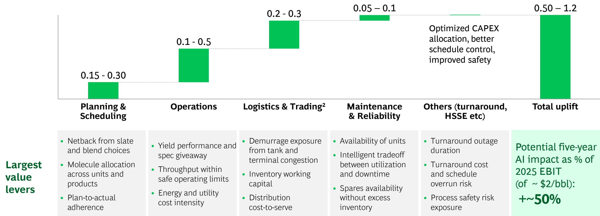

1. For a reference player- mid-quartile. Examples of Al-levers in refining: gross margin (e.g. Al-driven real-time prescriptive input of optimal operating points, maximizing throughputs and yields value and optimal scheduling plan generation with Al algorithms), energy and utilities (e.g., real-time utility network monitoring and optimization to minimize energy and H2 cost), maintenance (e.g., LLM-based agents to support maintenance operators in end-to-end execution including work order generation, image-based unit diagnostics, repair instructions, and log and report automation), CapEx run and maintenance (e.g., capital deployment optimization based on risk-based optimization of project selection supported by Al algorithms). 2. Logistics, maintenance, G&A.

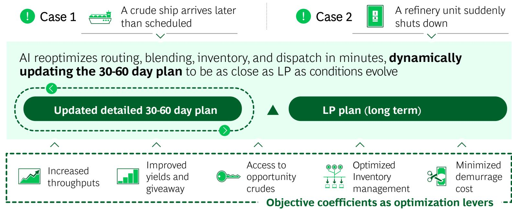

## AI improves margin and operational performance through adaptive scheduling that rapidly reoptimizes under changing conditions

## The challenge

At a Southeast Asian refiner, short-term scheduling was constrained by:

• High complexity across units, tanks, logistics, and time

\- Manual/Excel-based scheduling focused on feasibility over value maximization

\- Slow response to disruptions leading to margin leakage

## The Impact

\~0.15 - 0.30 \$/bbl
Margin uplift

## How AI played a role

AI scheduler runs a digital twin to dynamically reoptimize short-term refinery operation schedule as operational variability occurs

## Live Detailed Digital Twin

AI uses the digital twin as the executable model of refinery state, flows and constraints

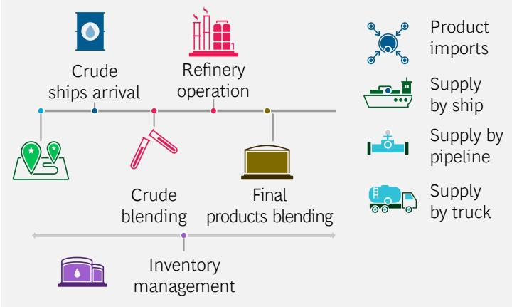

Inventory
management

## Operational Variability

A crude ship arrives later than scheduled

A refinery unit suddenly shuts down

AI reoptimizes routing, blending, inventory, and dispatch in minutes, dynamically updating the 30-60 day plan to be as close as LP as conditions evolve

Updated detailed 30-60 day plan

## LP plan (long term)

Increased
throughputs

Improved yields and giveaway

Access to
opportunity
crudes

Optimized
Inventory
management

Minimized
demurrage
cost

## Planning and Scheduling

## AI pinpoints margin leakage and analyzes root causes across the integrated value chain to protect refinery margin

## The challenge

At a European downstream major, operational performance analysis was challenged

• Traditional backcasting focused on isolated KPIs, not total margin

\- Limited visibility into value leakage across trading, refining, and sales

• Manual, slow root-cause analysis

## The Impact

\~1 - 3 \$/bbl
Identified opportunity $^{1}$

## How AI played a role

AI detects plan-to-actual margin leakage by comparing actual performance with reference scenarios and surface actionable drivers

## Capture

## Unify Data and Codify Logic

Ingest diverse internal, cloud, and external data sources

Internal Data

  
External Data  
Execution leakage  
Planning leakage

Cloud
Data

## Analyze

## Advanced Analytics + Cloud Architecture

Decision-quality gap

Structural upside gap

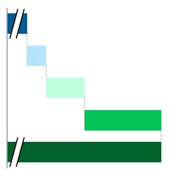  
Optimize Margins

Total identified opportunity

\- Integrate trading, refining, and sales data with standardized margin calculation logic

• Establish baseline for plan and reference scenarios - Compare scenarios with plan and actual performance to size \$/bbl margin leakage

• Automate root causes analysis across leakages

## Act

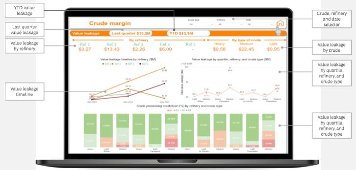

\- Surface margin improvement opportunities across value chain

\- Recommend actions on highest impact levers

## AI agents orchestrate real-time refinery optimization, translating plant conditions into margin actions for the control room

## The challenge

At a Latin American large refiner, operational performance was constrained by:

■ High operating variability (feed/utility swings, unit constraints)

■ Manual, slow diagnosis and response, driving margin leakage

■ Decision making was siloed, remaining unit by unit and shift by shift

## The impact

+\$80M from \~300 kbpd capacity

## How AI played a role

AI agents orchestrate real-time refinery optimization by combining plant data, KPIs, alerts, and historical knowledge to detect issues early, optimize trade-offs, and guide control room actions.

## Data layer

Real-time plant data

## Operating KPIs

Alerts and events feed

## Knowledge base (historical reports, expert inputs)

## Workflow orchestration

## 24/7 multi-agent advisors

answer questions and guide action using data and knowledge

## Optimization Engine across

100+ critical variables for better operating settings/trade-offs

## Early warning and real-

## Action layer

## AI control room center

with single view that consolidates KPIs, alerts, recommendations for leadership

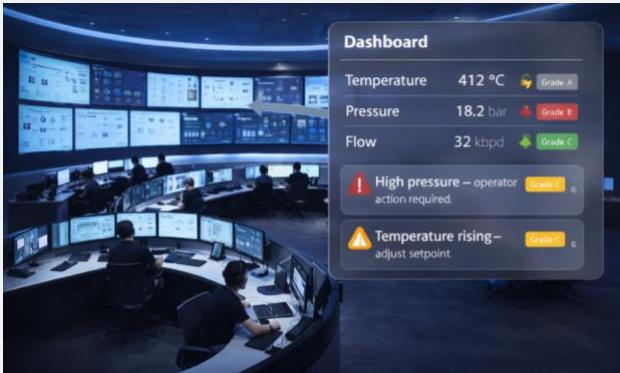

## AI predicts market structure to unlock margin from physical assets by shifting trading from reactive coverage to proactive capture

## The challenge

At an American refiner, trading performance was challenged due to:

■ Reactive execution focused on near-term cost minimization to meet volume commitments

■ Physical markets difficult to predict outside of 5- to 10-day windows

\- Trader insight/tribal knowledge not codified, making decision logic inconsistent

## The Impact

>\$80M+ annual margin opportunity Ten trades executed in two weeks, with 75% of closed positions cash-positive

## How AI played a role

## AI forecasts market structure and spread dynamics by combining internal proprietary signals with market feeds

## Ingest Inputs

## AI aggregates a range of internal and external data sources

  
indicators

  
Shipping and freight rates

Inventory levels

Macro factors and sentiment

Refinery utilization

Proprietary data

## Predict market structure

## AI transforms raw data into proprietary factors and forecast distributions of commodity prices and spreads

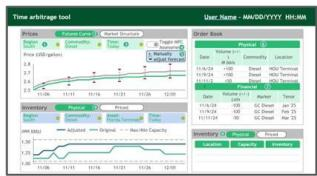  
Time arbitrage signals

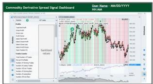  
Commodity spread signals

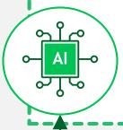

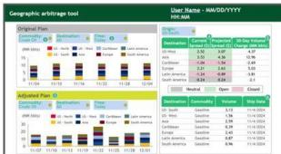  
Geo arbitrage signals

• Technical analysis (including mean reversion vs. momentum)

• Factor analysis and feature engineering

• Correlation analysis

## Closed loop: AI learns from past executed trades to improve next recommendations

## Recommend Trades

## AI recommends daily 'best trades' across various instruments

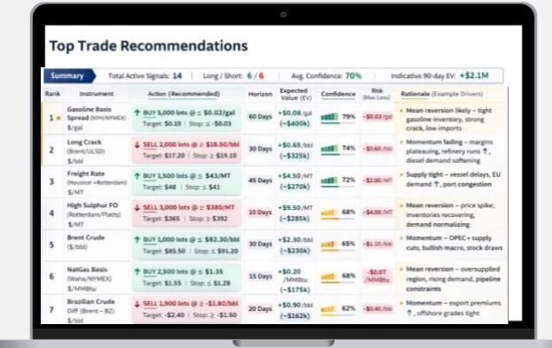

## AI agents reduce maintenance costs by orchestrating remote inspections and risk-based interventions across assets

## The challenge

At a Southeast Asian NOC's flagship refinery, asset reliability was challenged due to:

\- Maintenance spend misaligned with actual risk exposure

\- Limited visibility on failure probability vs economic impact

\- Reactive, budget-driven inspection strategies rather than risk-based prioritization

## The Impact

5%-15% Maintenance cost reduction

62% Efficiency gain in inspection workflow

## How AI played a role

AI fuses unmanned inspection data and computer-vision integrity analytics to prioritize risk-based inspection and maintenance actions

## Unmanned Inspection

AI agents ingest drone, robot, and sensor data across assets

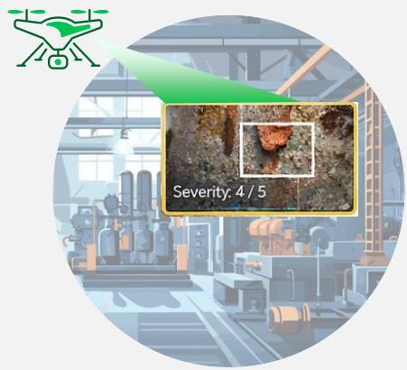

√ Replace manual work with remote inspection

Lower HSE risk by limiting onsite exposure

## Computer Vision

AI agents detect defects, assess severity, and prioritize interventions based on risk

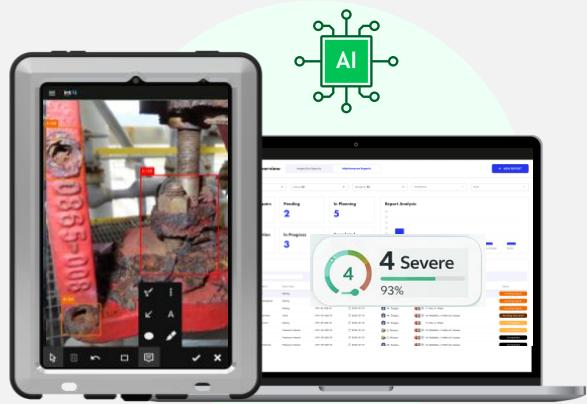

√ Automate corrosion detections from imagery

√ Quantify severity for each case

## Actionable Outcomes

AI agents recommend highest-priority work orders and inspection actions

## Top risk actions

Risk exposure (next 30d)

▲ Run targeted CUI checks on flagged anomalies

▲ Issue work orders for coating repair on high-severity findings

Inspect now: 3
Repair now: 2

▲ Execute leak repair and complete post-repair pressure testing

Schedule planned maintenance for Tank 1030 to Tank 1058

√ Surface highest priority maintenance issues

√ Recommend work orders for inspection/repair

\- Limited visibility into time-cost-risk trade-offs across scenarios

## How AI played a role

## AI evaluates thousands of scenarios to recommend the 'best-fit' schedule – and triggers co-pilot reoptimization on disruption

## INGEST DATA

AI builds a model with digital schedule and constraints

Schedule: Microsoft Project/Primavera (mpp, xer, xml)

Constraints: Variable ranges of crews, resources, etc.

Live signals: daily progress, equipment availability, etc.

## ANALYZE

AI generates and ranks all feasible scenarios based on time, cost, risk

Resource agent checks feasibility and estimates cost

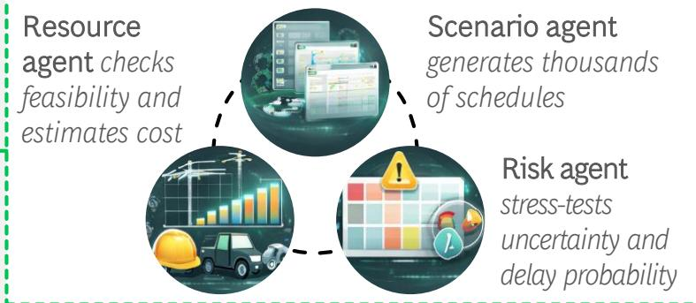

Scenario agent
generates thousands
of schedules

Risk agent
stress-tests
uncertainty and
delay probability

## AI triggers re-

optimization upon changes – refresh and re-rank scenarios

## Example

task slips

## ACT

crew unavailable

## AI suggests best-fit plan and recovery actions based on real-time progress

bad weather

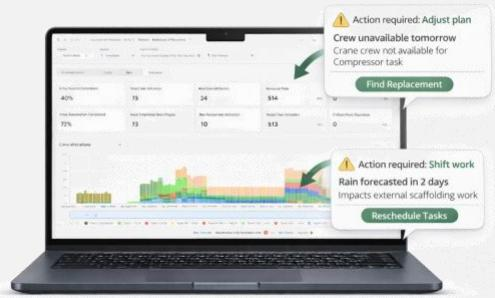

## User push to:

\- Approve and export schedule to P6/MSP

\- Generate change log for stakeholder sign-off

## AI improves refinery safety by shifting from reactive incident management to real-time intervention, reducing near-misses and response time

## The challenge

At a large Indian refinery, on-site safety and risk management faced gaps due to:

\- Reactive incident detection, with issues identified only after escalation

\- Manual monitoring unable to keep pace with operational scale and complexity in real time

• Passive CCTV systems, limited to recording without real-time risk detection or analytics

## The impact

30%-50% reduction in near-miss incidents >50% faster response time in intervention

## How AI played a role

## AI overlays real-time safety detection on CCTV to flag violations, escalate high-risk events, and build an incident log for trend analytics

## Run 20+ real-time safety scenarios with customizable detection parameters to detect violations early

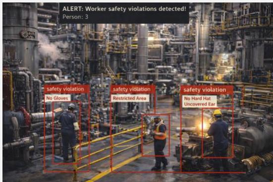  
Example of computer vision detection of safety violations at a refinery

## Provide continuous incident logging and safety trend analytics to pinpoint hotspots and repeated violations

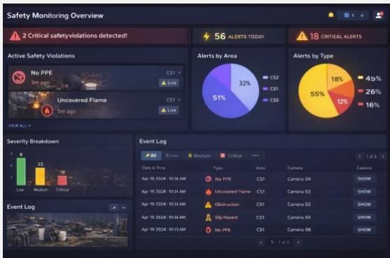  
Incident log and trend analytics dashboard

## Trigger real-time alerts via mobile notifications and audio alarms to prompt immediate intervention

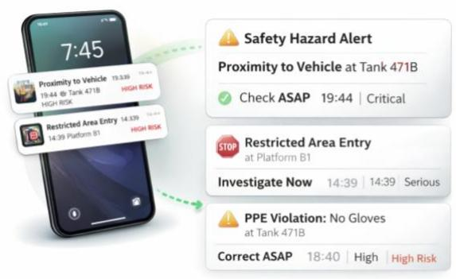  
Operator-ready view of active safety scenarios and alerts

## Organizational inertia, fragmentation, and weak governance are key implementation hurdles to successful AI transformation in refineries

## Fragmented priorities

Diffused priorities and agendas (across operations, maintenance, sales) with no common view of impact—dilutes focus and funding, creating many pilots, but limited scale-up of high-value use cases

## Legacy IT systems

Plants operate on fragmented and aging IT/OT stacks (e.g., DCS/SCADA, SAP/CMMS) leading to gaps in data quality and integration—slows deployment of digital and AI use cases in control room and field

## Siloed operations

Refineries make decisions by unit and function with limited cross-unit and asset coordination, preventing end-to-end optimization of throughput, margin, and reliability trade-offs

## Inflexible operating models

Delivery model is designed to run day-to-day operations, such as “keeping the lights on.” Talent and org not optimized with resources dedicated to fast implementation, scaling, and learning

## Lack of governance

Dedicated resources and senior sponsorship required to centrally run the transformation, constantly assessing value and steering use case scaling to keep implementations on track and “fund the journey”

## Future-built refineries overcome these hurdles through value-driven multiyear transformations

## What future-built companies do differently

Pursue a multiyear strategic ambition

Reshape and reinvent for P&L impact

## Implement an AI-first operating model

Secure and enable necessary talent

## Use fit-for-purpose technology and data

## Outperformers vs. laggards

C-suite actively engaged in AI agenda (refinery general manager, functional leaders)
More likely to appoint chief AI and data officers

Greater focus on P&L impact over tool deployment
Stronger AI governance and value tracking
Greater deployment and scaling of AI workflows

## Strategic workforce planning for AI in place

Mature and responsible AI guardrails and governance
Shared business-IT ownership (e.g., engineering and digital) in implementation

Small number of capable AI leaders shaping requirements and vendor choices Higher business-led ownership of AI solution design and deployment Greater workforce enablement without building large internal AI teams

Standard templates and enterprise-wide data models Synergistic, enterprise AI platform as an efficient backbone

Source: BCG Build for the Future 2025 Global Study (n = 1250).

## AI agents and solutions will enable simplified human-in-loop workflows to provide necessary automation with checks and balances

## Example of human-agent $^{1}$ supervision flow in refinery operations, such as crude slate, unit optimization

Strategic decision layer (L2)
Human-led
sets crude slate strategy, throughput/yield targets,
product quality guardrails, emissions
and safety limits

## Orchestration layer (L3)

## Co-led/split responsibilities

human governs critical decisions such as constraint exceptions and major rate changes; agents handle the baseline by recommending setpoints and actions based on constraints, energy cost, reliability risk

## Execution layer (L4)

## AI-led

optimize unit operation and energy use, draft shift logs and work orders, monitor alarms and anomalies; detect safety, quality, and compliance triggers

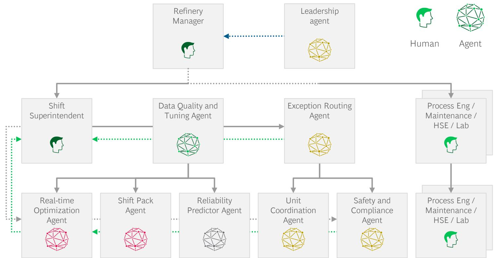  
Source: BCG experience  
1. Agents connected to systems such as DCS/SCADA | Historian | LIMS | CMMS | LP/Scheduling.

## AI-first organizations use business context fabric and easy access to structured and unstructured data to enable development of AI agents

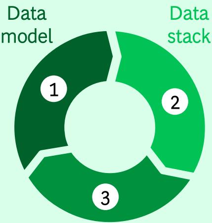  
Data teams

## 1 Business context fabric

\- Agents need more than data, they need business context, including:

\- Objectives – outcomes, not outputs

\- Resources – tools and data

\- Constraints – safety and spec limits and regulatory limits

## 2 Unstructured data ready for agent retrieval

\- Enable retrieval over unstructured data by converting documents (e.g., contracts and network manuals) into searchable formats that agents can retrieve at runtime

\- Implement short- and long-term agent memory (session and episodic or semantic) to retain and reuse interaction history

## 3 Data products for agents

\- APIs and model context protocol (MCP) that agents and data teams can call autonomously to expose data

\- Federated data ownership, with business teams owning data while platforms expose it via APIs for agent consumption

\- Data-driven decision-making culture, with shared playbooks and templates to standardize high-quality agent-supported decisions

## Bringing this to life across refineries

## Must have well-connected integration across

lab, plant, quality, and customer systems (e.g., ELN/LIMS, plant sensor, and batch data)

## Must mine thousands of data records daily to surface relevant insights

## 3 Users must be equipped with intuitive platforms to interact with and supervise agents

## Continuous monitoring and

enhancements are essential to ensure the capability scales and adapts with the business

Key takeaway: Data must be treated as a critical enterprise asset. Investing in quality, governance, and management is essential for scaling agents across chemical players.

## Building an agentic ecosystem requires a new stack on top of traditional business systems and data

## Traditional

Conventional digital application architecture is organized into distinct layers with limited flexibility and integration resulting in reduced adaptability and greater rigidity

## Digitally enhanced

AI-driven architecture combining tools like chatbots, agents, and protocols over traditional structures. Integrates diverse data for enhanced adaptability and efficiency

## AI-First

An ecosystem built around embedded AI agents, orchestrations, and tools, emphasizing secure, observable agent-to-agent interactions. Integrates legacy systems and data to boost AI-driven operations.

## Traditional

Digital app

Digital UI

## Business and API layer

Data layer

Business systems

## Digitally enhanced

AI platform

Digital UI

Chatbots
and
voice-bots

Agents

Tools, protocols, and guardrails

Business and API layer

Structured data

Unstructured data

Business systems

## AI-first

## AI ecosystem

New

Embedded agents

New

Agent orchestration

New

Agent to agent

New

Agentic tool registries

Memory platforms

Legacy business systems and data

## Illustrative

Agent operations and monitoring

LLM evaluation

Agent-to-agent guardrails

## Best- in-class refiners strategically leverage partners to accelerate AI delivery on top of traditional platforms

• Value case and roadmap

\- Operating model and governance

\- Foundation models

\- Organization design and change leadership

\- Customization

\- Safety features

\- Rapid innovation cycles

\- Workflow orchestration

\- Automation

\- Adoption at scale

Model providers and AI labs
furnish the "brains"

Workflow and automation platforms embed AI in daily work

Strategic advisors
advise on ambition
and execution

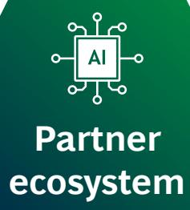

Data, operations, and governance
make AI usable,
reliable, and
compliant

Builders and integrators engineer and integrate at scale - End-to-end build

• Integration and migration

\- Delivery factory

\- Run and operate

Cloud platforms deliver compute and enterprise services - Scalable compute and storage

• Security and landing zones - AI services

• Data foundation and pipelines

\- LLM and ML operations and monitoring

\- Governance controls

Value proposition varies across partners. Critical to select best-in-role and orchestrate capabilities across the build-buy-partner mix

## Transformation to future-built refineries requires an early focus on prioritized opportunities before expansion and scale-up

\~3 months

\~12 months

\~18 months

\- Define North Star vision

\- Prioritize value pools and identify quick wins

\- Establish governance

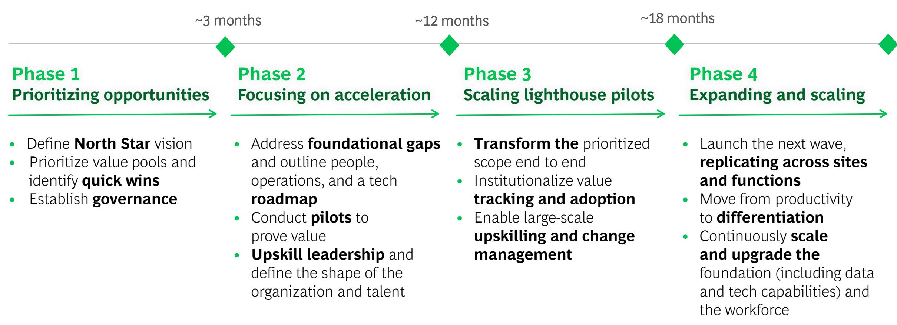

Phase 2 Focusing on acceleration

\- Address foundational gaps and outline people, operations, and a tech roadmap

\- Conduct pilots to prove value

\- Upskill leadership and define the shape of the organization and talent

Phase 3 Scaling lighthouse pilots

• Transform the prioritized scope end to end

• Institutionalize value tracking and adoption

\- Enable large-scale upskilling and change management

\- Launch the next wave, replicating across sites and functions

\- Move from productivity to differentiation

• Continuously scale and upgrade the foundation (including data and tech capabilities) and the workforce

Underpin the transformation journey with increasing investments in enterprise foundations including core tech and data, people, and responsible AI

## Is my organization on track to be AI future-ready? Leaders' checklist

<table><tr><td></td><td>Leadership and strategy set the direction</td><td>AI is a strategic priority communicated to the organizationI have a named AI sponsor (C-level or board level)Al progress is a standing agenda item in leadership meetings</td></tr><tr><td></td><td>Solutions and business value determine priorities</td><td>We&#x27;ve identified functions or E2E processes where AI can create tangible valueWe prioritize use cases identified for each function, with target outcomesEach use case has a business sponsor with P&amp;L accountabilityWe track both business ROI and operational outcomes from AI cases</td></tr><tr><td></td><td>Funding and investment back it with resources</td><td>Our leadership has a standard way to request AI funding that communicates ROII have an approved budget for AI-ready data, talent, and implementationThere is a defined three-year AI investment envelope (% of revenue)</td></tr><tr><td></td><td>Data and technology build the foundation</td><td>Named data owners/stewards exist in business units or functions (e.g., operations, maintenance)We have an active program cleaning, governing, and integrating refinery data from control business systems (including DCS/SCADA, APC, MES, CMMS)Our critical data is AI ready (structured and labeled, accessible, compliant)</td></tr><tr><td></td><td>People and processes drive adoption</td><td>Our leadership team is undergoing AI fluency trainingWe have cross-functional AI teams that combine refinery domain experts (field operations, process engineering, maintenance) with OT/IT and Centers of ExcellenceThere is a change management plan to address trust, compliance, and regulationWe have an AI talent plan to attract, retain, and motivate talent</td></tr><tr><td></td><td>Governance and responsible AI scale with trust</td><td>Wins and lessons learned from pilots communicated visibly across the organizationWe have an AI governance council (ethics, compliance, regulatory).We operate under a responsible AI framework (safety, explainability, bias)I receive a quarterly AI impact report with business and operational outcomes</td></tr></table>

BCG experts | Key contacts for refinery AI transformations

## Americas

Ilshat
Haris

Oleg
Gubin

John
Florez

Buddy Myers

Elisabet Assens
Gibert

Wade
Barnes

## Europe, Middle East, and Africa

Alex
de Mur

Alberto
de la Fuente

Jaime
Ruiz-Cabrero

Ana María
Martínez

Sébastien
Rexhausen

Arthur
Akhmetov

## Asia Pacific

Arun
Rajamani

Asheesh
Sastry

Rahool Pai
Panandiker

Kashmira
Jirafe

Anish
Nazimudeen

Achraf
El Ouali

## BOG