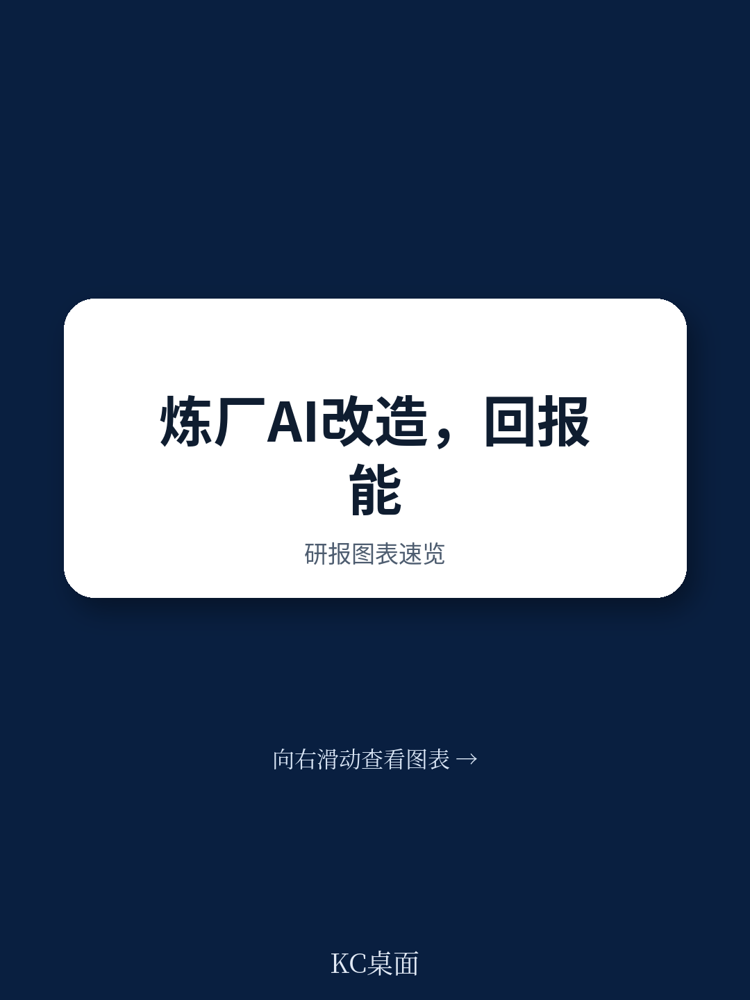
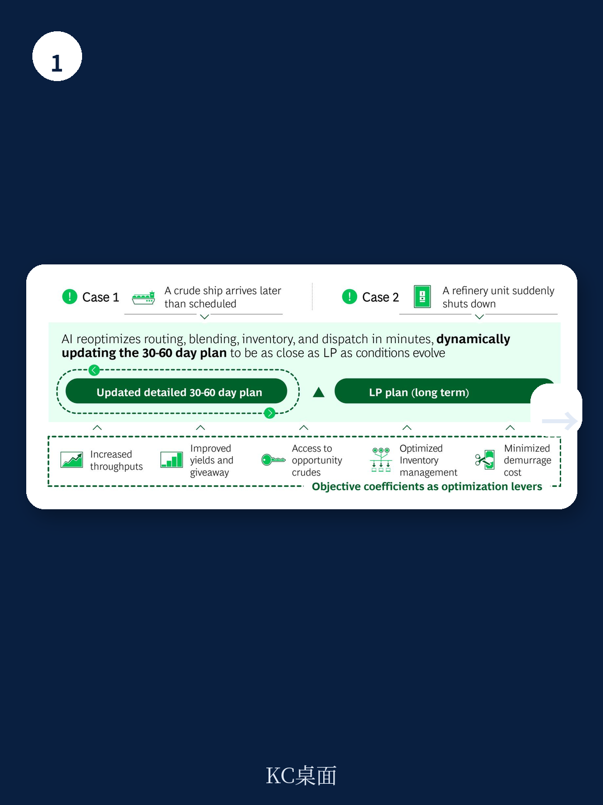

# 波士顿咨询：AI优先的炼油企业

炼油行业正面临一个结构性矛盾：长期需求预期下降，而净炼油产能到2030年仍可能增长，即使考虑关停项目。波士顿咨询在2026年4月发布的这份报告中指出，AI不再是可选项，而是炼油企业在波动中创造竞争优势的核心杠杆。对于参考中四分位玩家，AI到2030年可带来每桶0.5至1.2美元的EBIT提升，相当于超过50%的利润改善空间。

报告基于与超过2000家客户的合作经验，提出炼油企业需要从周期性、孤立的优化转向实时、以利润为导向的决策闭环。这一转变覆盖规划、运营、物流、维护和安全等核心环节，且已有可量化的落地案例。

## 1. 炼油产能增长持续超过需求，利润承压

报告引用的数据显示，2026至2030年净炼油产能增长将超过需求增长，即使在保守的“棕色情景”下，供应仍超过最乐观的需求增长情景。不同油品表现分化：航空煤油和石脑油需求更具韧性，而汽油因电动化加速面临需求侵蚀。

多重因素叠加放大利润波动：中国出口配额可能推高区域供应仍在调整，全球增长与关税政策造成区域需求不均，俄罗斯制裁演变可能扰乱贸易流，新产能加速投产进一步压缩利润空间。国际海事组织MEPC83会议收紧排放标准，也要求运营层面的再研究。

## 2. AI应用已覆盖炼油全价值链，每环节均有量化收益

报告将AI在炼油中的应用分为六个领域，每个领域都给出了具体的EBIT提升区间。规划与排程可贡献每桶0.15至0.30美元，运营环节每桶0.1至0.5美元，物流与贸易每桶0.2至0.3美元，维护与可靠性每桶0.05至0.1美元。

具体案例显示，一家东南亚炼油企业通过AI驱动的数字孪生进行短期排程优化，实现了每桶0.15至0.30美元的利润提升。AI调度器在原油船晚到或装置突然停工时，能在数分钟内重新优化30至60天的排程计划。一家拉丁美洲大型炼油企业通过AI代理实现实时优化，在约30万桶/日产能上获得超过8000万美元的利润改善。

> **KC评论：** 这些数字来自具体客户案例，不是理论模型推演。报告强调AI的价值在于将“计划与实际”之间的利润泄漏系统性地识别并回收，而不是追求单一指标的极致优化。

## 3. 从确定性规则到概率性智能，AI能力分层演进

报告将炼油AI能力分为四个层级：确定性规则系统、机器学习、深度学习、生成式AI与代理式AI。当前行业主流仍处于第一和第二层级，而领先企业已开始向第三和第四层级迁移。

代理式AI是报告中重点强调的能力跃迁。它不仅能预测设备故障或优化操作参数，还能持续监控装置约束和利润变化，自主选择最优设定点并通过控制系统执行调整。这意味着炼油厂的操作模式从“人找问题”变为“系统自动响应”。

## 4. 规模化转型需要分阶段推进，而非一次性部署

报告提出了三阶段转型路径。第一阶段约3个月，重点是定义愿景、优先价值池、识别速赢项目并建立治理机制。第二阶段约12个月，解决基础数据和技术缺口，开展试点验证价值，并培养领导层AI素养。第三阶段约18个月，将试点成果规模化，制度化价值追踪，并启动跨站点复制。

报告特别强调，企业需要同步建设六大基础能力：领导力与战略、解决方案与业务价值、资金与研究、数据与技术、人员与流程、治理与负责任AI。其中，数据就绪度是关键瓶颈——需要确保来自DCS、SCADA、APC、MES、CMMS等控制业务系统的关键数据已结构化、可访问且合规。

对于炼油企业决策者，这份报告提供了一个可操作的评估框架：是否已有明确的AI战略优先级？是否已识别出具体功能或端到端流程中AI可创造实际价值的环节？每个用例是否有具备P&L责任的业务负责人？这些问题的答案，决定了企业能否从AI试点走向规模化竞争优势。

For informational purposes only. Portions may be generated,translated,summarized,or edited with AI assistance based on source materials and may contain omissions or errors. Please verify independently. This is not investment,legal,tax,accounting,or other professional advice.

