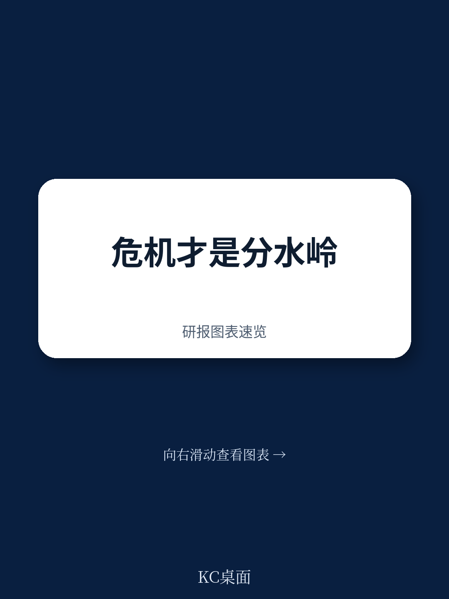

# 波士顿咨询：研究主题与行业变化观察

波士顿咨询（BCG）亨德森研究所对近1800家美国公司25年数据的定量研究显示，扰动时期仅占研究周期的11%，但企业在此期间相对股东总回报（TSR）的表现，贡献了长期相对TSR的约30%。这意味着扰动时期的业绩影响几乎是平稳时期的三倍。报告同时发现，15%的公司展现出“一般韧性”——在超过80%的扰动季度中跑赢行业，这些公司25年间年均TSR超出行业5个百分点。

这一结论挑战了多数企业将韧性视为“成本项”的惯性思维。当行业平稳期各公司TSR差距平均为16个百分点时，扰动期间这一差距会翻倍至30个百分点。韧性不是锦上添花，而是长期业绩分化的核心变量。

## 1. 扰动深度与韧性价值呈正相关

报告将扰动按TSR最大跌幅分为不同深度层级。数据显示，TSR跌幅超过15%的季度，对长期业绩的影响呈不成比例的放大效应。且这种影响在扰动结束后的第一个季度便迅速消散——说明扰动窗口期是决定长期排名的关键战场。

不同行业的韧性价值差异显著。技术、耐用消费品等波动较大的行业，韧性价值最高；食品饮料、家庭用品、医疗等需求稳定行业，韧性价值相对较低。这提示决策者：行业固有波动性决定了韧性投入的回报率。

> **KC评论：** 报告将韧性拆解为“降低冲击影响、加快恢复速度、提升恢复程度”三个维度。其中降低冲击影响贡献了扰动期相对TSR的63%，是韧性的核心杠杆。企业应优先评估自身在冲击第一阶段的脆弱性，而非过早追求恢复速度。

## 2. 一般韧性可被识别和复制

报告识别出15%的公司具备“一般韧性”——即无论扰动类型如何，均能持续跑赢行业。以伯克希尔·哈撒韦为例，1995年以来其相对行业年均超额回报约2个百分点，但这一超额完全来自扰动季度（17个扰动季度中跑赢15次），平稳期实际跑输行业。

研究进一步提炼出韧性企业的四种优势：预判优势、缓冲优势、适应优势和塑造优势。这四种优势对应六项设计原则——审慎、冗余、多样性、模块化、嵌入性和适应性。报告提供了具体操作案例：3M在SARS扰动后主动建立口罩的“激增产能”，使其在新冠扰动中成为美国主要PPE制造商；雪佛龙凭借低于同行三分之一的债务/企业价值比，在2020年完成行业首笔大型收购。

## 3. 韧性企业通过四项机制实现持续跑赢

预判优势方面，韧性企业会持续扫描环境中的早期信号。报告举例：再生元制药CEO在2020年1月底注意到中国一周内新建医院，判断非正常事件，随即全力转向新冠病毒研究，最终实现扰动期45个百分点的超额回报。在2020年1月24日至2月24日的约100家美国公司财报电话会中，仅10家讨论全球大流行可能性，其中7家在疫情扩散后跑赢行业。

缓冲优势体现在财务和运营两个层面。一般韧性企业的债务/企业价值比低于行业均值16%，现金/运营成本比高出27%。运营缓冲方面，3M在SARS后主动储备口罩产能，使其在新冠扰动中实现快速扩产。

多样性优势则通过收入来源和运营方式分散不确定性。报告发现，报告更多地理或业务分部的公司，长期扰动期年化超额回报分别为4个百分点和1个百分点。Airbnb在疫情期间的恢复速度快于传统酒店，因其住宿选项的多样性——当长途旅行停滞时，近郊短租需求迅速填补缺口。

## 4. 韧性是长期跑赢的必要条件，非充分条件

研究覆盖的500余家长期跑赢行业的公司中，近三分之二在扰动期表现优于同行。非韧性公司实现长期跑赢的概率仅为韧性公司的一半。若要在缺乏韧性的情况下实现长期跑赢，企业需要在平稳期年均超额回报达到8个百分点——这是一个极高的门槛。

报告同时指出，韧性并非万能。在平稳期，韧性企业可能因持有现金、保留冗余产能而显得“低效”。但长期来看，这种“低效”恰恰是穿越周期的代价。五家当前财富10强公司曾被识别为一般韧性企业，这一事实本身说明了韧性在大型组织中的可操作性。

对于决策者而言，报告提供了一个可复用的观察框架：评估自身在预判、缓冲、适应、塑造四个维度的现状，对照六项设计原则逐一诊断，而非简单追求“更灵活”或“更保守”的模糊目标。韧性不是一种状态，而是一套可设计、可测量、可改进的组织能力。
