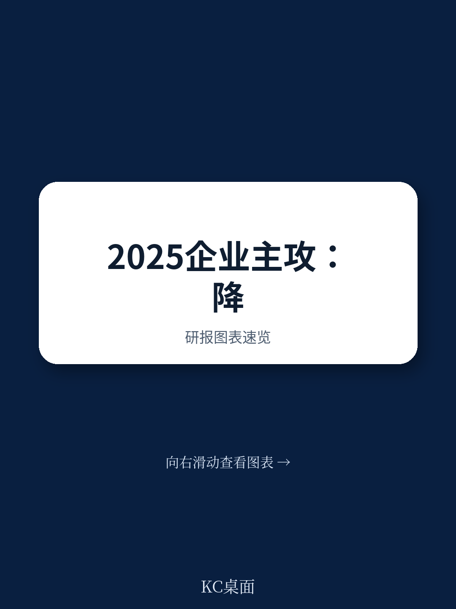

# 波士顿咨询：低碳航运业务与近期数据观察

2025年企业管理的核心矛盾，不是要不要降本，而是降本目标与实际执行之间的系统性落差。波士顿咨询在2025年1月发布的全球高管调研中，基于570位企业决策者的反馈，揭示了一个关键信号：成本管理连续第二年成为高管第一优先事项，但企业平均只能实现48%的成本节约目标。那些宣布目标却未能达成的公司，其股东总回报比成功达标的同行平均低9个百分点。这一差距，正在成为2025年企业竞争力的分水岭。

调研显示，33%的企业领导者将成本削减列为最关键的优先事项，较2024年上升8个百分点。与此同时，70%的高管表示拥有足够的中期可见度来做出研究决策。这意味着，2025年的成本管理并非单纯的调整防御，而是为后续增长腾挪资源的结构性动作——67%的受访高管计划将节约下来的资金重新投入增长与创新。

## 1. 成本执行的最大障碍来自组织文化而非技术

波士顿咨询的调研数据表明，企业在成本削减中面临的最大挑战并非技术基础设施或专业能力不足，而是“员工与组织文化”层面的阻力。报告指出，对变革的抵触会阻碍新成本节约措施的实施，而那些主动调整文化以匹配成本效率目标、并采用敏捷管理的公司，其成本削减的持久性可提升最多11%。

这一发现值得注意。许多企业在制定成本目标时，往往将精力集中在供应链优化、产品组合精简等可见环节，却低估了组织惯性对执行效果的侵蚀。波士顿咨询的样本显示，超过一半的企业未能实现长期结构性成本削减，而文化因素正是导致这一结果的首要原因。

> **KC评论：** 成本削减的失败往往不是方案设计的问题，而是执行过程中组织文化的“软抵抗”。报告中的11%效率差异，提示企业在启动成本项目前，需要先评估内部的文化对齐程度，而非直接进入工具和流程层面。

## 2. 供应链优化与产品组合精简成为两大优先方向

在具体的成本驱动因素中，波士顿咨询的调研将“供应链优化”和“产品组合简化”列为2025年高管最优先优化的两个方向。不同行业侧重点有所差异：消费品行业优先供应链，工业品行业同样聚焦供应链，保险业则更关注产品组合，科技和资金行业将运营模式与劳动力生产力放在前列。

报告强调，供应链正面临来自地缘政治、宏观宏观环境不确定性、气候变化与净零承诺、技术颠覆以及消费者预期变化等多重不确定性。企业需要从产品开发、规划、采购、制造、物流到仓储的全价值链维度进行管理。在产品组合方面，波士顿咨询建议通过“设计到价值”的方法，以客户视角重新平衡产品价值与成本，尤其要消除低销量配置的“长尾”产品。

## 3. 美国大选结果加速了企业对关税与监管的应对

调研中一个重要的时间节点是2024年底的美国大选结果。85%的高管已经就此采取行动，其中54%在积极监测关税和监管变化，31%已启动应急预案。北美和欧洲的高管对利润率与盈利能力的担忧正在上升，而亚太地区（不含中国）的高管则更关注出口仍在调整与宏观环境不确定性。

超过60%的高管表示，关税变化是他们最关注的指标。波士顿咨询认为，美国新政府可能推出的保护主义措施将重塑全球贸易格局，减少贸易流动并破坏供应链稳定。对于欧洲而言，这可能加剧其已有的竞争力挑战；对于亚太出口导向型地区，地缘政治紧张可能进一步削弱读者信心。

## 4. 一个可复用的观察框架：成本管理的“目标-执行-文化”三角

波士顿咨询的调研为决策者提供了一个简洁但有效的分析框架：成本管理的成败，取决于目标设定、执行能力和组织文化三个维度的匹配程度。数据显示，企业平均只能实现48%的成本节约目标，这意味着超过一半的预期效益在落地过程中流失。而股东回报的9个百分点差距，则直接量化了执行失败的市场代价。

对于正在制定2025年成本计划的企业而言，这一框架提示：在设定成本目标的同时，需要同步评估组织内部的文化阻力，并建立敏捷管理机制。单纯依赖技术工具或流程优化，而不解决文化层面的“软问题”，成本削减的效果将难以持久。波士顿咨询的调研还显示，86%的高管计划在2025年研究于AI与高级分析，将其视为提升效率的重要支柱——但这同样需要组织文化的配合才能转化为实际成果。

For informational purposes only. Portions may be generated,translated,summarized,or edited with AI assistance based on source materials and may contain omissions or errors. Please verify independently. This is not investment,legal,tax,accounting,or other professional advice.

