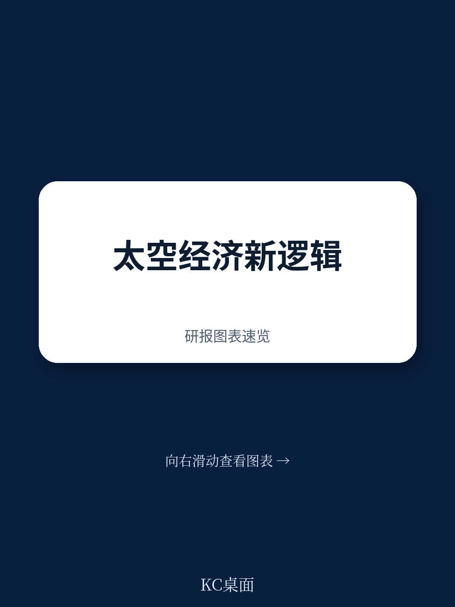
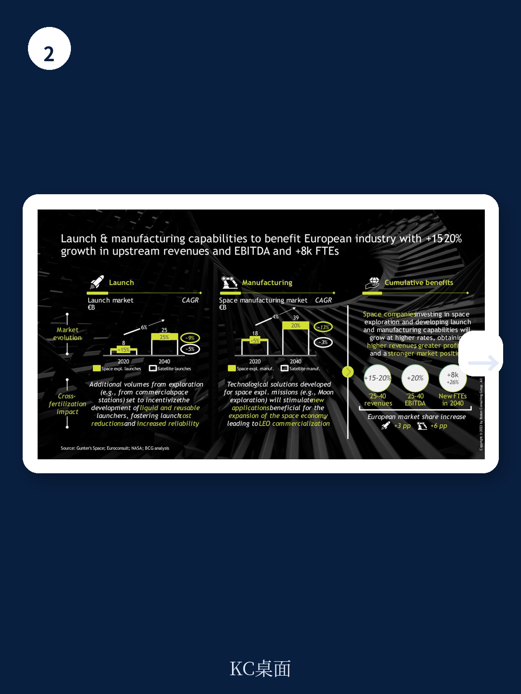

# 波士顿咨询：欧洲太空探索研究-2023年11月

一份由波士顿咨询与欧洲空间政策研究所联合完成的研究显示，若欧洲在2025至2040年间投入500亿欧元用于太空探索项目，其累计GDP影响将不低于2600亿欧元，对应超过5倍的乘数效应。这一数字并非单纯来自直接支出，而是由直接、间接、诱导和催化四层效益叠加而成。

该研究发布于2023年11月，正值全球太空探索格局加速重构之际。国际空间站即将退役，中国空间站已投入运营，美国商业空间站方案正在推进，月球成为主要航天国家的新目标。在此背景下，欧洲面临一个关键选择：成为主导力量，还是沦为次要合作伙伴。

报告将500亿欧元研究的效益拆解为两个层次。第一层是直接、间接和诱导效益，合计带来约1500亿欧元的GDP贡献，乘数约为3倍。其中，直接效益来自约4000个新增太空探索相关岗位带来的250亿欧元增加值；间接效益来自采购支出对欧洲航天产业链的约700亿欧元拉动；诱导效益则来自航天从业人员及供应链员工消费增加带来的约550亿欧元贡献。

第二层是催化效益，额外贡献约1100亿欧元。这部分效益的核心来源是新兴太空市场，包括太空旅行、在轨研发与制造、在轨服务以及边缘计算，预计贡献850亿欧元。此外，技术创新衍生和STEM岗位生产率提升分别贡献约100亿和150亿欧元。

> **KC评论：** 催化效益是这份报告最值得关注的部分。它意味着太空探索研究的价值不仅体现在航天器制造和发射本身，更在于催生此前不存在的商业市场。报告认为，这些新市场的大部分价值将在2030年后才逐步释放，因此研究节奏和耐心同样重要。

## 1. 太空探索对航天工业的交叉赋能效应

报告提出，太空探索研究对更广泛的航天工业存在系统性交叉赋能。这种效应体现在三个层面：为工业生态系统提供关键规模、促进不同航天领域间的协同、以及强化战略能力。

以发射能力为例，报告指出，人类太空探索任务对运载火箭的可靠性、安全性和重复使用能力提出了更高要求，这些要求反过来推动了整个发射产业的技术升级和成本下降。研究显示，2020至2022年间，猎鹰9号运载火箭执行的载人航天任务次数已超过联盟号，这背后是NASA通过商业轨道运输服务等项目对SpaceX的持续支持。

报告附录E专门分析了SpaceX案例：该公司在2008年获得NASA价值16亿美元的商业补给服务合同，当时SpaceX濒临破产。这笔合同不仅挽救了公司，还帮助其完成了猎鹰9号和龙飞船的开发。此后，NASA商业载人项目又提供了约26亿美元的服务合同。这些公共机构在太空探索领域的投入，成为SpaceX后续商业成功和私人资本涌入的关键转折点。

## 2. 太空宏观环境与太空增强宏观环境的规模差异

报告提供了一个重要的分析框架：区分“太空宏观环境”和“太空增强宏观环境”。前者指航天产业本身的产值，2022年约为4600亿美元；后者指太空技术对其他宏观环境部门的赋能价值，同年约为3.1万亿美元。

这一估算基于对15个以上跨行业商业案例的分析。报告认为，太空技术的赋能效应体现在创造新市场、产生增量附加值以及赋能核心产业三个维度。例如，卫星通信、导航和地球观测已成为电信、交通、农业、能源等多个关键行业的基础设施。

展望未来，报告预测太空宏观环境将在2040年达到1万亿美元，而太空增强宏观环境的价值将增至约7.9万亿美元，2025至2040年间的累计影响将超过80万亿美元。

## 3. 需要继续观察动的代价与不确定性

报告专门设置章节讨论需要继续观察动的代价。如果欧洲不推进自主太空探索计划，将面临多重损失：直接、间接、诱导和催化效益的全面流失；欧洲航天工业规模和竞争力的相对调整；以及在关键新兴市场中被边缘化的不确定性。

报告特别指出，欧洲目前在全球政府太空预算中仅占约15%的份额，而欧洲GDP约占全球的25%。这一差距意味着欧洲在太空领域的投入与其地区量并不匹配。

同时，报告也承认，效益的完全实现需要管理多重不确定性：预算的及时有效部署、吸引私人资本的能力、避免仅作为次要合作伙伴参与他国项目，以及应对载人探索活动中可能发生的严重事故。

> **KC评论：** 报告对“需要继续观察动代价”的量化值得关注。它试图回答一个决策者常问的问题：如果现在不做，未来要花多少钱才能追回来？报告给出的隐含答案是，不仅成本更高，而且可能永远失去成为主导者的窗口期。这一逻辑框架对其他战略性基础设施研究也有参考价值。

## 4. 可复用的观察框架：太空研究的效益分层

报告采用的效益分层方法——直接、间接、诱导、催化——不仅适用于太空探索，也可用于评估其他大型基础设施或科技项目的宏观环境影响。其中，催化效益的识别和量化是最具挑战性也最有价值的部分。

催化效益的核心在于识别研究如何催生此前不存在的市场和能力。报告以SpaceX为例说明：NASA的太空探索合同不仅帮助SpaceX开发了运载火箭，还间接催生了星链卫星互联网业务，后者目前已占SpaceX收入的约40%。这种从探索研究到商业应用的传导链条，正是催化效益的典型体现。

对于欧洲而言，报告建议将太空探索纳入其他产业战略，如欧洲绿色协议和数字战略，以最大化交叉赋能效应。

For informational purposes only. Portions may be generated,translated,summarized,or edited with AI assistance based on source materials and may contain omissions or errors. Please verify independently. This is not investment,legal,tax,accounting,or other professional advice.

