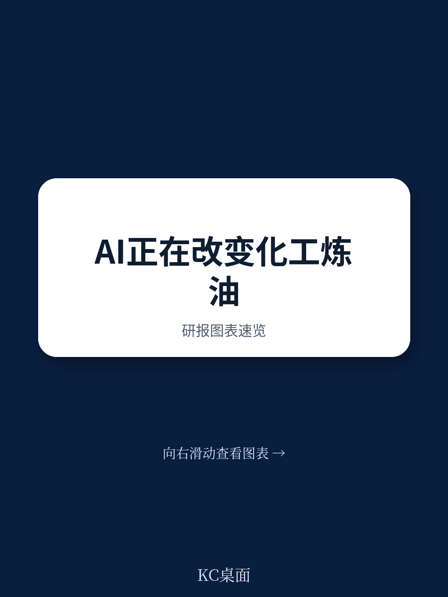
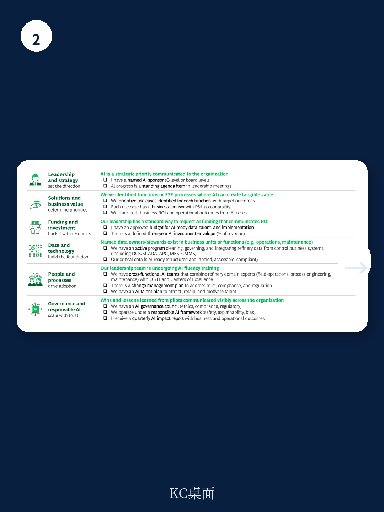

# 波士顿咨询：AI炼油厂每桶EBIT提升0.5至1.2美元

炼油行业正面临一个结构性矛盾：长期需求预期下降，而净炼油产能到2030年仍可能增长，这意味着利润率将持续承压。波士顿咨询在2026年4月发布的这份报告中，给出了一个具体判断：对于中等水平的炼油企业，AI技术到2030年可以带来每桶0.5至1.2美元的EBIT提升。这不是一个远期愿景，而是一个基于已落地案例的测算。

报告的核心主张很清晰：AI正在将炼油厂从周期性的、孤立的优化，转变为实时的、以利润为导向的决策系统。这种转变覆盖了从规划调度、运营、物流交易到维护安全的完整工作流。波士顿咨询认为，那些率先构建“AI优先”运营体系的炼油厂，将在市场波动中建立可持久的竞争优势。

## 1. 运营环节已出现单个炼油厂超8000万美元的AI收益

报告提供了一个具体案例：一家拉丁美洲的大型炼油厂，通过AI代理实现实时优化，在约30万桶/日的产能规模下，获得了超过8000万美元的利润提升。这个数字来自运营环节的改进——AI代理将工厂数据、关键绩效指标、警报和历史知识整合在一起，能够更早发现问题，并在控制室层面优化利润权衡。

波士顿咨询将AI在炼油价值链中的影响做了量化拆解。规划与调度环节可贡献每桶0.15至0.30美元，运营环节每桶0.1至0.5美元，物流与交易每桶0.2至0.3美元，维护与可靠性每桶0.05至0.1美元。这些数字并非理论模型，而是来自报告所称的“已证明的部署”。

> **KC评论：** 这些数字值得注意的地方在于，它们不是加总后的一次性收益，而是每个环节独立可追踪的改进。这意味着炼油企业可以按优先级选择切入点，而不必一次性完成全链条改造。

## 2. 供给过剩与多重波动因素并存，AI成为应对不确定性的工具

报告用数据展示了炼油行业面临的多重不确定性。全球炼油产能增长预计将超过需求增长，即使在最保守的需求下降情景下，供给仍然过剩。与此同时，六个关键波动因素在同时作用：交通电气化侵蚀汽油需求、中国出口配额可能增加、全球宏观环境增长不均与贸易壁垒、俄罗斯制裁演变、新产能投产加速，以及国际海事组织收紧排放标准。

这些因素叠加的结果是，利润率不仅受压，而且高度波动。波士顿咨询认为，传统基于线性规划的周期性优化模式，已经无法应对这种快速变化的环境。AI的价值恰恰在于，它能够将规划周期从周或天缩短到分钟级别，并在条件变化时自动重新优化。

## 3. 从数字孪生到AI代理，技术路径已有清晰案例

报告详细描述了AI在炼油厂中的具体应用方式。在规划与调度环节，AI使用数字孪生作为可执行的工厂状态模型，当一艘原油船晚到或某个装置突然停机时，AI能在几分钟内重新优化路由、调和、库存和调度方案，生成更新后的30至60天计划。报告引用了一家东南亚炼油厂的案例，这种能力带来了每桶0.15至0.30美元的利润提升。

在更复杂的运营环节，AI代理已经能够持续监控装置约束和利润变化，选择最优设定点，并通过控制系统自动执行调整。报告将这种能力描述为从“确定性规划”到“概率性优化”的跃迁——系统不再只是遵循预设规则，而是能够基于实时数据和学习到的模式，自主做出决策。

## 4. 规模化部署需要三个阶段的推进路径

波士顿咨询为炼油企业提供了一个三阶段推进框架。第一阶段约3个月，重点是定义愿景、优先排序价值池并建立治理机制。第二阶段约12个月，解决基础数据和技术缺口，开展试点验证价值，并对领导层进行AI素养培训。第三阶段约18个月，将经过验证的试点规模化推广，建立价值追踪和采纳机制，并启动下一波复制。

报告特别强调，成功的炼油企业会将AI锚定在利润表影响上，而不是将其视为独立的技术项目。每个AI用例都需要有业务负责人和明确的利润表责任，价值追踪从第一天起就嵌入流程。

> **KC评论：** 这个框架的实用性在于，它承认了大多数炼油企业目前仍处于“孤立试点”阶段。报告给出的时间线——从启动到规模化约33个月——也暗示了，那些现在开始行动的企业，可能在2028至2029年市场不确定性最集中时，已经建立起可运行的AI系统。

波士顿咨询在报告最后附上了一份领导力检查清单，涵盖战略、解决方案、资金、数据技术、人员流程和治理六个维度。这份清单本身就是一个可复用的观察框架：企业可以对照检查自己是否已经具备AI就绪的基础，而不是盲目启动项目。

For informational purposes only. Portions may be generated,translated,summarized,or edited with AI assistance based on source materials and may contain omissions or errors. Please verify independently. This is not investment,legal,tax,accounting,or other professional advice.

