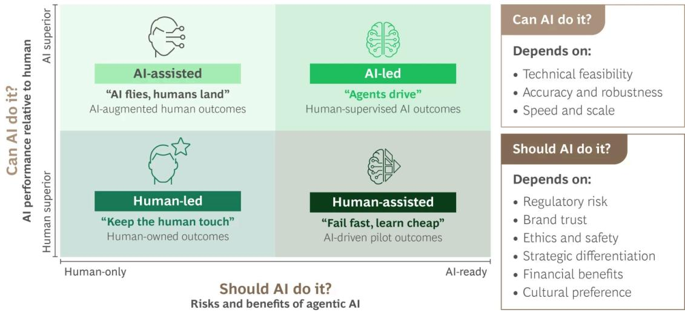

BCG

ARTIFICIAL INTELLIGENCE

# Design Your Company for AI, Not AI for Your Company.

By Nina Kataeva, Vinciane Beauchene, Christoph Hilberath, Kevin Kelley, and Sophie Strelczyk

ARTICLE APRIL 23, 2026 8 MIN READ

AI has advanced at extraordinary speed, triggering a wave of experimentation and investment across industries. Yet the business impact remains limited. BCG research shows that while most organizations are piloting AI, only 5% are capturing meaningful value at scale. The challenge is that most organizations and operating models were built for a purely human workforce, with work structured around functional roles, handoffs, and decision bottlenecks. Simply inserting AI into this model will only deliver incremental gains.

In an AI-first organization, work is no longer organized primarily around human roles and hierarchies, but around connected systems of agents that dynamically coordinate work. Leaders define clear objectives and allow agentic networks to determine how those objectives are achieved. This requires a ground-up redesign of structure and processes, shifting from static, human-centered models to adaptive, AI-driven ways of operating. This allows organizations to create the conditions for AI to evolve and reach its full potential. Below, we outline what leaders need to do to develop an AI-first company and share real-world examples of organizations already delivering measurable impact.

## What It Really Means to Be AI-First

AI-first organizations are designed around a powerful shift: agents are central to how work gets done. That does not mean these companies are not still “people centric.” But while humans define outcomes and provide context, AI agents find the best way to achieve those outcomes via autonomous workflows.

Historically, operating models were designed around fairly unchanging coordination among human roles. Processes were predefined, decision rights were distributed across layers, and execution followed fixed paths. There was a set route to get from point A to point B, and any deviation slowed everything down.

In an AI-first model, humans step into higher-order roles: shaping strategy, setting intent, managing risk, and intervening when judgment, ethics, or accountability is needed. They drive strategic differentiation. And they set the destination, timing, and constraints (available resources, permissions, and the like). Within these parameters, agents continuously and dynamically determine the optimal path forward, adapting in real time while delivering consistent outcomes.

So how do companies become AI-first? The two case studies below show what an AI-first transformation looks like and how organizations are already translating AI-first ambition into measurable results.

## How a European Energy Leader Created an AI-First Operating

## Model

A leading European energy services provider began its AI journey with high levels of urgency and investment. Dozens of AI pilots were launched across customer service, operations, and support. Yet the business impact remained limited.

The operating model—built for a human workforce—included legacy processes and systems that weren’t adapting to AI, which led to fragmented customer journeys, unclear ownership, and a limited ability to scale. Intent on creating an AI-first organization, the company’s leaders made a deliberate shift: rather than inserting AI into existing workflows, they would redesign how work was structured, governed, staffed, and prioritized.

From Scattered Pilots to a Shared North Star. The company’s leaders anchored their AI transformation in a clear two-year vision: reimagining end-to-end customer journeys according to an AI-first model. The future state was made tangible through interactive prototypes and narrative videos that showed how customers would interact with the company in a redesigned, AI-enabled experience. This aligned the organization around an actionable, near-term vision linked to concrete business outcomes.

Organizing Around the Customer, Not Functions. The company's operating model put the customer at the center. Each customer journey determined where agents would be deployed, which AI skills and capabilities were needed, how humans would oversee outcomes or continue to add differentiated value, and how processes, data, and systems needed to evolve. This structure created clarity and cohesion across the company. AI became embedded in the flow of work, not layered on top of it.

Funding the Journey Quickly. The transformation was designed to fund itself. By prioritizing customer journeys that created value quickly, the company generated run-rate savings within the first three months. That early impact validated the approach, unlocked resources, and built confidence to expand the scope. Each redesigned journey generated momentum to fund the next one.

Leadership-Driven Prioritization. The CEO made AI-first one of the company's top strategic priorities. Lower-priority initiatives were paused or cancelled if any resource constraints arose. This made it clear that scaling AI required organizational tradeoffs, strict focus, and alignment.

Ways of Working. Three cross-functional teams worked in parallel, each focused on a high-impact journey. These teams were given a mandate to fully own and transform their portion of the customer journey, and they were equipped with the technical, business, and HR capabilities needed to execute. In this way, they could quickly address roadblocks without consulting with other units and be fully accountable for outcomes.

Results. AI-enabled journeys quickly matched—and are on track to exceed—human performance on customer satisfaction metrics. The company was able to reduce its dependence on external

service providers by more than 90% and free up cash flow that was reinvested in accelerating the AI-first journey. The CEO said that, based on the results of the transformation, “AI is going to be the next major driver of growth for us.”

# A Global Bank's Shift to Human-AI Collaboration at Scale

For a global financial institution, AI represented an opportunity to reinvent how it serves clients, manages talent, and creates value. Early AI pilots showed promise, but their impact was fragmented across functions and value did not materialize in the bottom line. To create impact at scale, leaders had to rethink how humans and agentic AI worked together across every part of the enterprise.

A Bold Vision. The company's leadership set a firm-wide ambition to automate $30\%$ to $50\%$ of workflows and shift human effort to higher-value decisions. This redesign resulted in a lean, intelligent organization where AI does the routine work and humans focus on strategy, orchestrating, and steering.

Central Governance as Anchor. To enable this shift, the organization established a central governance structure. A transformation office owns business alignment and prioritization, while a responsible AI center of excellence sets ethical and compliance standards. A journey-based operating model with cross-functional teams ensures that every initiative links to measurable outcomes. This governance structure ensures enterprise-level alignment and disciplined sequencing, avoiding fragmented experimentation.

Reimagining Core Workflows Along End-to-End Journeys. To reimagine core processes, the company began by redesigning its HR function around the full employee journey. For each stage, it identified more than 80 capabilities where agents could assume core tasks over time. These agents are being rolled out over a three-year timeline, prioritized around key moments in the employee journey and balanced between highest business value and greatest employee benefit. This ensures that automation is applied first to activities that deliver tangible improvements in experience, speed, value, and productivity. Underpinning the transformation is a vertically integrated GenAI platform that combines foundational models, orchestration layers, and specialized agents, all connected through shared data and governance. Digital employee twins enable more precise talent matching, targeted reskilling, and workforce planning.

Redefining the Operating Model and Organizational Structure. The organization redesigned its entire operating model. Work is now organized around small, cross-functional teams that integrate human talent, AI agents, data, and technology to deliver a specific outcome. These teams own employee and client processes end to end, balancing automation, human expertise, and AI-driven insight. Within this model, AI agents execute core tasks across HR and operations, including onboarding, policy support, travel, and learning. Employees are being reskilled to take on new roles—such as AI product owners, model governance managers, and talent data strategists—to ensure that AI capabilities are not layered on, but structurally embedded in the organization.

Results. The bank is on track to automate $30\%$ to $50\%$ of workflows, which will free about three million hours of human capacity—equivalent to 1,700 FTEs—for higher-value work. The program expects full payback within two years and a projected $150\%$ ROI over five years. With strong support from the bank's leadership, AI moved from experiment to everyday practice.

# How to Get Started: Decide Where AI Should and Shouldn't Lead

The fastest way to begin an AI-first transformation is not to launch more AI initiatives but to systematically determine which outcomes should remain human-led and which should be delivered by AI agents.

When setting the ambition, leaders must ask two questions: Could AI do this as well or better than humans? and Should AI do this? (See the exhibit.) The first is a question of performance. Can AI deliver the same level of accuracy, speed, and scale as humans—and is it technically feasible? The second is a question of judgment and strategic differentiation. Will this pose challenges around regulatory risk, customer trust, ethics, safety, and overall impact on the brand? Will this add unique and differentiated value? Together, these questions can help organizations target the right mode of human–AI collaboration.

Two Questions for Assessing Where AI Should and Shouldn't Lead

  
Source: BCG analysis.

Some activities, where trust, empathy, or accountability dominate, will remain human-led. Others will be AI-assisted, accelerating human decision making. And in some cases, AI will lead end to end, executing workflows at scale under human supervision.

The ultimate goal is to rethink end-to-end business outcomes with a focus on autonomous execution (rather than automation layered onto existing work). By making the human–agent collaboration model explicit from the outset, organizations avoid over-automation and under-utilization. They create operating models where humans focus on intent, judgment, and risk, intelligent agents are trusted to deliver outcomes at speed, and the organization is fully aligned around AI-first principles.

From our work across industries, it’s clear that becoming AI-first involves 30% technology and 70% people and organization. If AI is not delivering impact, it is rarely because the technology is not delivering. It is because most organizations have not made the shift from deploying isolated AI tools to redesigning their operating model around human–agent collaboration.

Becoming AI-first is a leadership choice that will redefine competitive advantage across industries. Boards and executive teams must treat this as a strategic redesign of how outcomes are delivered across the enterprise. The first step is deciding where AI should lead, where human judgment creates differentiation, and where human–AI collaboration generates structural advantage.

AI will not wait for your organization to catch up. The gap between leaders and laggards is already widening, driven by operating model decisions rather than technology choices. The leaders in this era won't be those with the best AI tools but those willing to redesign their organizations around an AI-first operating model.

## Authors

  
Nina Kataeva

  
Managing Director & Partner Zurich

## Christoph Hilberath

Managing Director & Partner Munich

  
Sophie Strelczyk

Principal Hamburg

  
Vinciane
Beauchene

Managing Director & Partner Paris

## Kevin Kelley

Managing Director & Senior Partner, Global Lead for Operating Model, Organization, and Cost
Dallas

## ABOUT BOSTON CONSULTING GROUP

Boston Consulting Group partners with leaders in business and society to tackle their most important challenges and capture their greatest opportunities. BCG was the pioneer in business strategy when it was founded in 1963. Today, we work closely with clients to embrace a transformational approach aimed at benefiting all stakeholders—empowering organizations to grow, build sustainable competitive advantage, and drive positive societal impact.

Our diverse, global teams bring deep industry and functional expertise and a range of perspectives that question the status quo and spark change. BCG delivers solutions through leading-edge management consulting, technology and design, and corporate and digital ventures. We work in a uniquely collaborative model across the firm and throughout all levels of the client organization, fueled by the goal of helping our clients thrive and enabling them to make the world a better place.

© Boston Consulting Group 2026. All rights reserved.

For information or permission to reprint, please contact BCG at permissions@bcg.com. To find the latest BCG content and register to receive e-alerts on this topic or others, please visit bcg.com. Follow Boston Consulting Group on Facebook and X (formerly Twitter).