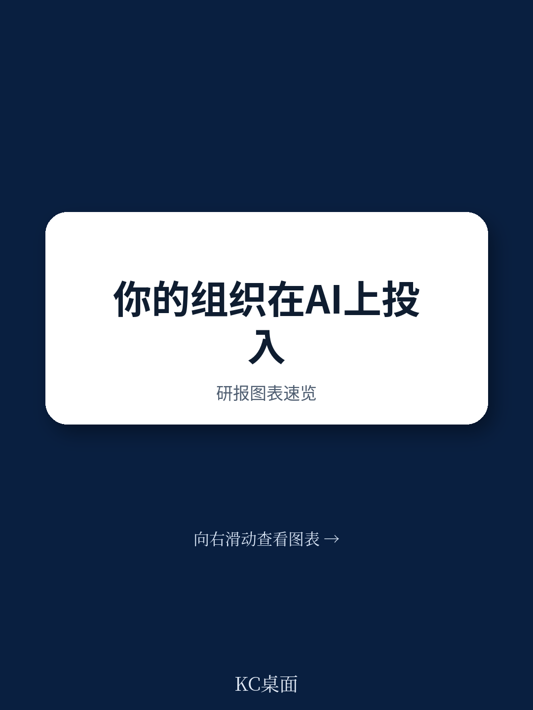
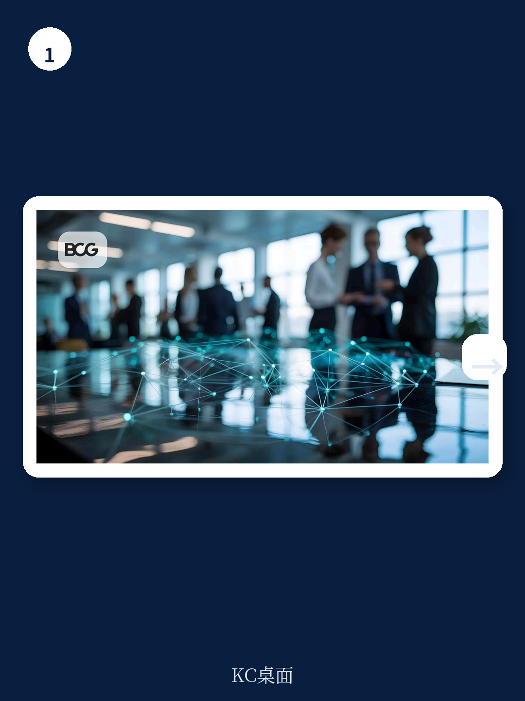
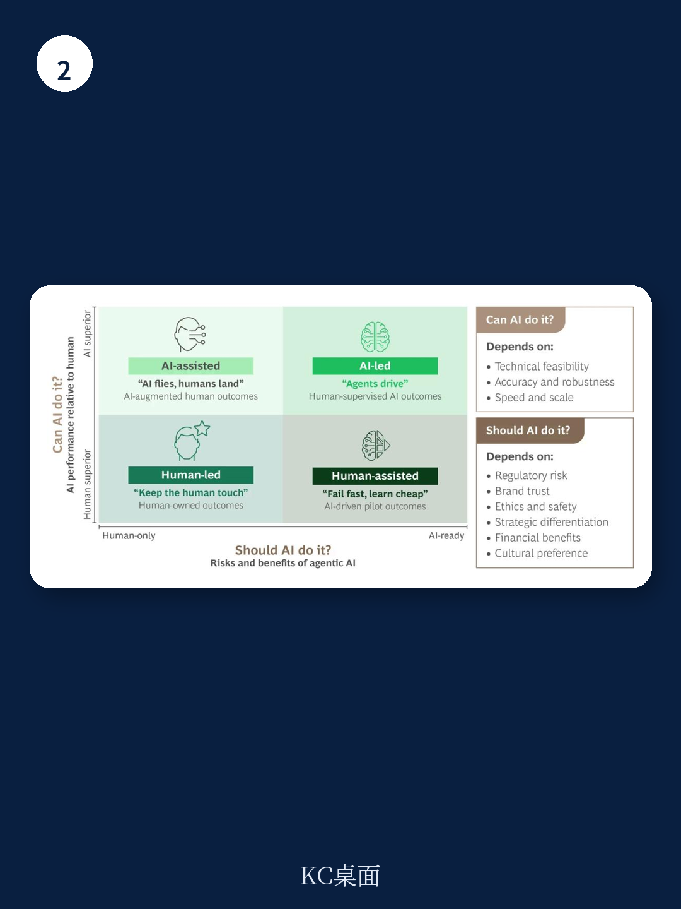

# 波士顿咨询：为AI设计公司而非为公司部署AI

多数组织正在试点AI，但波士顿咨询的研究显示，只有5%的企业从AI中获得了可规模化的价值。核心原因不是技术需要继续观察，而是企业试图把AI塞进为纯人类劳动力设计的运营模式里。报告认为，真正的转变不是“为你的公司部署AI”，而是“为AI重新设计你的公司”。

这份报告基于对欧洲能源企业和全球银行的案例研究，提出了一个判断：AI优先的组织，工作不再围绕人类角色和层级展开，而是围绕能够动态协调工作的智能体系统。人类负责定义目标、设定约束、管理不确定性，AI智能体在参数范围内自主寻找最优路径。

## 1. 欧洲能源企业：从分散试点到端到端旅程重构

一家欧洲领先的能源服务商，初期在客服、运营、支持等部门启动了数十个AI试点，但业务影响有限。运营模式是为人类劳动力设计的，遗留流程和系统无法适应AI，导致客户旅程碎片化、所有权不清晰、规模化能力受限。

该公司领导层做了一个关键选择：不把AI插入现有工作流，而是重新设计工作的结构、治理、人员配置和优先级。他们锚定了一个两年愿景——按照AI优先模式重新构想端到端客户旅程。每个客户旅程决定了智能体部署位置、所需AI技能、人类如何监督或继续提供差异化价值，以及流程、数据和系统如何演进。

结果：AI驱动的客户旅程在满意度指标上迅速匹配并有望超越人类表现。该企业对外部服务提供商的依赖度降低了90%以上，释放的现金流被重新研究于加速AI优先转型。CEO评价说，基于转型结果，“AI将成为我们下一个主要增长驱动力”。

> **KC评论：** 这家企业的做法值得注意——他们用“自筹资金”的方式推动转型，优先改造能快速创造价值的客户旅程，前三个月就产生了运营成本节省。这种“先验证、再扩展”的节奏，比一次性大规模研究更务实。

## 2. 全球银行：设定30%至50%工作流自动化目标

一家全球机构的案例展示了另一种路径。该银行领导层设定了全公司范围的雄心：自动化30%至50%的工作流，将人类精力转移到更高价值的决策上。这一重新设计的目标是建立一个“精简、智能”的组织——AI处理常规工作，人类聚焦战略、协调和方向把控。

为了支撑这一转变，该银行建立了中央治理结构：一个转型办公室负责业务对齐和优先级排序，一个负责任的AI卓越中心设定伦理和合规标准。在流程层面，他们从人力资源职能开始，沿着完整的员工旅程重新设计核心工作流。每个阶段识别出超过80项可由智能体逐步接管的核心任务，按三年时间线分批推出。

支撑这一转型的是一个垂直整合的GenAI平台，结合了基础模型、编排层和专用智能体，通过共享数据和治理连接。数字员工孪生技术实现了更精准的人才匹配、定向技能重塑和劳动力规划。

结果：该银行有望自动化30%至50%的工作流，释放约300万小时的人力容量（相当于1700个全职员工），用于更高价值的工作。项目预计两年内实现完全回报，五年内ROI达到150%。

## 3. 两个问题决定AI该在哪里主导

报告提供了一个可操作的决策框架：领导者在设定AI优先转型的雄心时，需要回答两个问题——“AI能否做得和人类一样好或更好？”以及“AI应该做这件事吗？”

第一个问题是关于性能：AI能否在准确性、速度和规模上达到人类水平，技术上是否可行。第二个问题是关于判断和战略差异化：这件事是否会带来监管不确定性、客户信任、伦理、安全或品牌影响方面的问题？是否会增加独特且差异化的价值？

这两个问题组合起来，可以划分出三种模式：某些活动（信任、同理心或问责占主导）保持人类主导；另一些由AI辅助，加速人类决策；还有一些由AI端到端主导，在人类监督下规模化执行工作流。

报告强调，从跨行业的工作经验来看，成为AI优先涉及30%的技术和70%的人与组织。如果AI没有带来影响，很少是因为技术需要继续观察，而是因为大多数组织没有从部署孤立的AI工具转向围绕人机协作重新设计运营模式。

## 4. 运营模式决策正在拉大领先者与追赶者的差距

报告最后提出了一个值得关注的判断：AI不会等待组织追赶。领先者与追赶者之间的差距已经在扩大，驱动因素不是技术选择，而是运营模式决策。这个时代的领先者不会是拥有最好AI工具的公司，而是那些愿意围绕AI优先运营模式重新设计组织的公司。

对于正在推进AI战略的决策者来说，这份报告提供了一个清晰的参照：不要问“我们能用AI做什么”，而要问“我们的组织是否准备好让AI决定如何工作”。

For informational purposes only. Portions may be generated,translated,summarized,or edited with AI assistance based on source materials and may contain omissions or errors. Please verify independently. This is not investment,legal,tax,accounting,or other professional advice.

