# From Discount To Premium: A Wake-Up Call for Undervalued Korean Corporates

Korea Value Creators Report 2026

June 2026

Boston Consulting Group

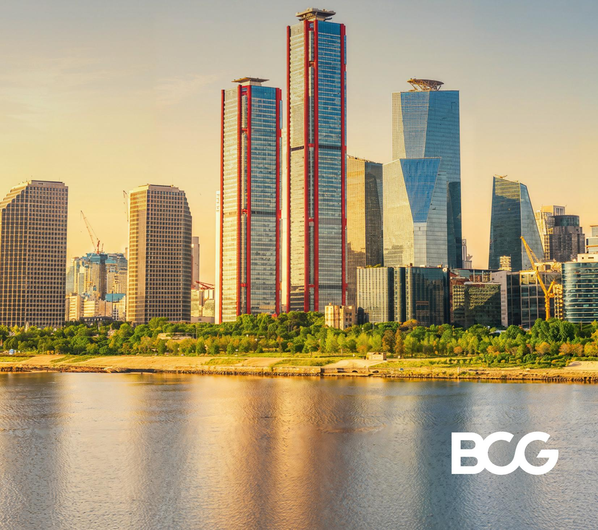

## BCG

Boston Consulting Group partners with leaders in business and society to tackle their most important challenges and capture their greatest opportunities. BCG was the pioneer in business strategy when it was founded in 1963. Today, we work closely with clients to embrace a transformational approach aimed at benefiting all stakeholders—empowering organizations to grow, build sustainable competitive advantage, and drive positive societal impact.

Our diverse, global teams bring deep industry and functional expertise and a range of perspectives that question the status quo and spark change. BCG delivers solutions through leading-edge management consulting, technology and design, and corporate and digital ventures. We work in a uniquely collaborative model across the firm and throughout all levels of the client organization, fueled by the goal of helping our clients thrive and enabling them to make the world a better place.

## Introduction

4

## Section 1

## 2025 Korean Stock Market Review

5

• KOSPI: #1 Index Return Globally

\- Two Drivers Behind the PBR Re-Rating

\- Yet, KOSPI Still Has a Long Way to Go

## Section 2

11

## TSR Improvement — No Longer Optional

• TSR Improvement Can No Longer Be Delayed

\- Efficiency Over Earnings – The Real Driver of TSR

\- Japan Case Study – Government-Led ROE-Centric Management

• Japan Case Study – Corporate Self-Transformation

• Change Has Already Begun in Korea

## Section 3

## What Companies Must Do Now

15

• The First Step Towards TSR Improvement

• 7 Key Actions for TSR Improvement

\- Renewing Mindset and Systems

## Introduction

For years, the Korean capital market struggled to shake off the label of the 'Korea Discount.' Low shareholder returns, inefficient capital allocation, and a governance structure dominated by controlling shareholders are some of the reasons global investors applied a discount to the Korean market.

In 2025, however, Korean equities staged a rally that seemed to flip that narrative overnight. The KOSPI surged from 2,400 at end-2024 to 4,200 by end-2025, and has since broken through 8,000 in May 2026 — tripling in just over 18 months. By market cap, the KOSPI has vaulted to approximately fifth globally, behind only the US, China, Japan, Hong Kong, and India. The government's capital market revitalization policies and a powerful earnings and multiple expansion cycle in four key sectors — semiconductors, defense, shipbuilding, and nuclear power — were the core drivers of this rally.

Yet it would be premature to conclude that the Korea Discount has been fully resolved. At end-2025, the KOSPI's PBR stood at 1.4x $^{1}$ , and even the 2026 year-end estimate of 1.9x remains well below the US (4.9x), Taiwan (4.0x), and India (2.8x). Moreover, this rally was a party for the few. While the four key sectors — semiconductors, defense, shipbuilding, and nuclear power — drove the index higher, more than 60% of all listed companies still trade below book value.

For companies left behind, the situation has actually become more precarious. The sharper the market rally, the greater the pressure from shareholders and the market on companies that failed to participate. Scrutiny of low capital efficiency is intensifying, and the lack of TSR $^{2}$ (Total Shareholder Return) improvement can lead to activist fund interventions, board restructuring, business reorganization, and management changes. Japan, which walked this path a decade ahead of Korea, witnessed exactly that — management control disputes, forced portfolio restructuring, asset sales, and record-high delistings. Companies that failed to adapt bore significant costs.

This report reviews the performance and current state of the Korean equity market from 2025 through the first half of 2026 and presents the key priorities that companies must urgently execute to sustain shareholder value creation.

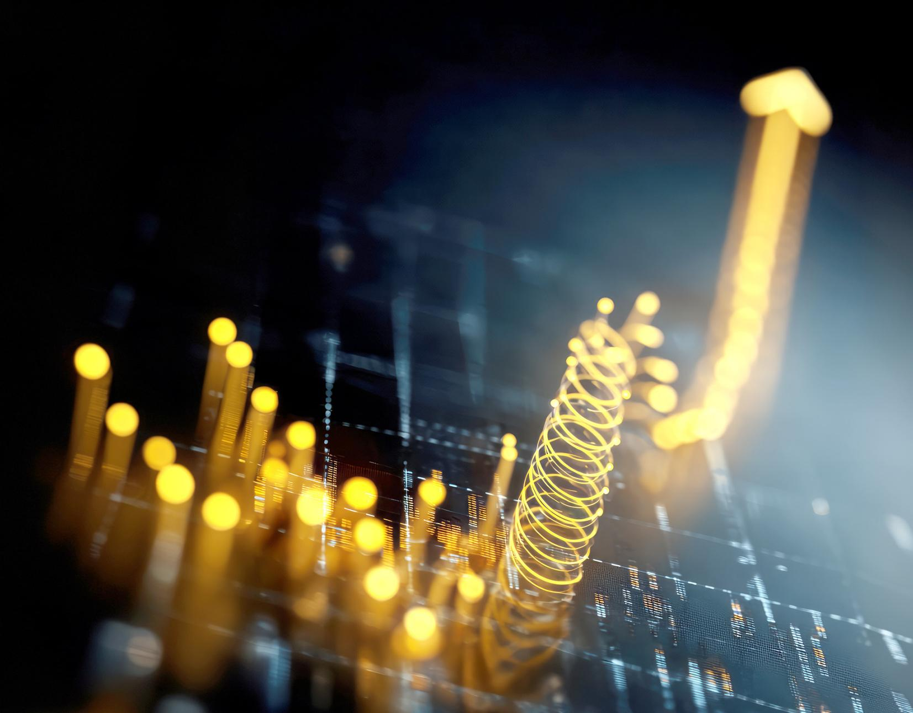

Section 1

# 2025 – 2026 Korean Stock Market Review

KOSPI: #1 Index Return Globally

In 2025, the Korean stock market delivered an overwhelmingly strong performance relative to major global markets. The KOSPI's TSR was approximately 76%, significantly exceeding the average of the top 10 global indices (approximately 22%).

Exhibit 1
2025 TSR Comparison Across Major Indices $^{1}$

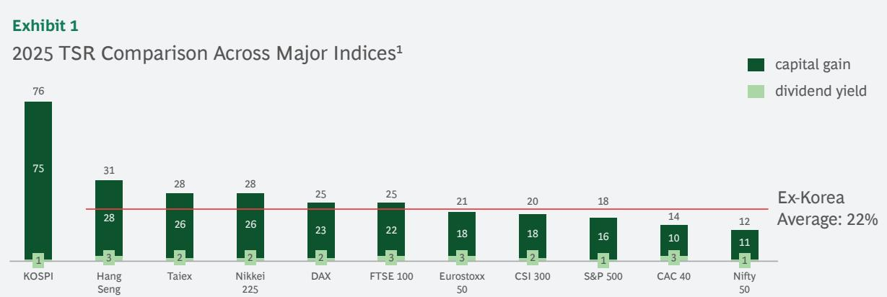  
1. Total Shareholder Return (TSR) for full year 2025; ex-Korea average is an arithmetic mean; Source: Bloomberg

The rally was driven primarily by capital gain, not dividends. Of the total 76% TSR, 75 percentage points came from capital gain, with dividend yield contributing just 1 percentage point. This signals not simply that companies shared more profits with shareholders, but that the market's fundamental view of Korean companies has changed. The Korean market — long labelled an undervalued market — has begun to receive recognition as a genuine re-rating story marked for both earnings growth and multiple expansion.

PBR is fundamentally determined by ROE, growth rate (g), and cost of equity (COE): $PBR = (ROE - g) / (COE - g)$ . ROE is the return a company generates on shareholders' capital; COE is the minimum return investors require. The more consistently ROE exceeds COE over time, the higher the resulting PBR. Conversely, for companies where ROE falls short of COE, high valuations are difficult to justify regardless of earnings level. The rise in PBR suggests that investors are, for the first time, beginning to price in the possibility of structural ROE improvement.

Exhibit 2
KOSPI PBR and ROE Comparison (2024–2026E) $^{1}$

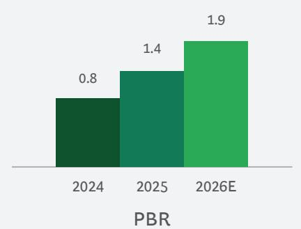

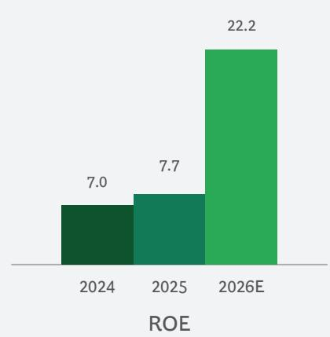  
1. 2024 and 2025 figures based on year-end market cap and total shareholders' equity. 2026E based on market cap as of 2026/05/04 and 2026E consensus shareholder's equity. Source: Bloomberg

Exhibit 2 illustrates this transformation in numbers. The KOSPI's average PBR rose from 0.8x in 2024 to 1.4x by end-2025, and is expected to re-rate further to 1.9x in 2026. ROE is also forecast to rise from 7.0% in 2024 and 7.7% in 2025 to 22% in 2026, with the 22%+ level expected to be maintained in 2027. $^{3}$ The fact that capital efficiency metrics are improving rapidly, not just the index breaking out of the sub-1x PBR zone that persisted for so long, signals that the market has begun to question whether the structural discount it has applied to Korean companies is still warranted.

However, it is too early to take these numbers at face value. The 1.9x PBR and 22% ROE figures are largely the result of the dominant contributions of four sectors: semiconductors, shipbuilding, defense, and nuclear power. The rest of the market tells a very different story — explored in detail in the next section.

## Two Drivers Behind the PBR Re-Rating: Earnings Improvement in Four Sectors and Government Policy

This PBR re-rating was the result of two converging forces.

The first was the earnings recovery in the four key sectors: semiconductors/hardware, shipbuilding, defense, and nuclear power. Visible earnings recovery in these high market-cap sectors drove multiple expansion that lifted the entire index's PBR.

The second was the new government's capital market revitalization policies. The new administration placed the reduction of the Korea Discount at the center of its capital market agenda, driving substantive improvements in governance and capital allocation structures through the Value-Up Program, Commercial Law amendments, and tax reforms. As Japan's decade-earlier experience demonstrates, such policy shifts act as powerful tools that reduce the market's structural discount.

## 1. Market Re-rating Driven by Earnings Growth in Four Key Sectors: Semiconductors, Shipbuilding, Defense, and Nuclear Power

The earnings improvement in the four key sectors drove the market's re-rating. The total KOSPI market cap expanded approximately three-fold compared to 2024, with semiconductor/hardware's market cap growing approximately five-fold, pushing its index weight from 29% to 52%. Shipbuilding, defense, and nuclear each grew 3\~6x. This rise reflects distinct structural drivers in each sector: AI-driven memory demand recovery for semiconductors; global order cycle recovery for shipbuilding and defense; and new plant restarts and overseas export expansion for nuclear power.

Exhibit 3

Market Cap, PBR, ROE, and Market Cap Share by Sector (2024–2026E)  
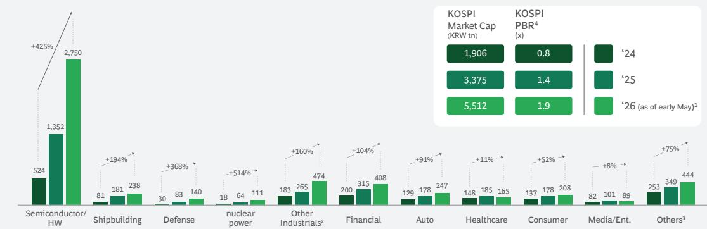

<table><tr><td></td><td>&#x27;24</td><td>&#x27;25</td><td>&#x27;26</td><td>&#x27;24</td><td>&#x27;25</td><td>&#x27;26</td><td>&#x27;24</td><td>&#x27;25</td><td>&#x27;26</td><td>&#x27;24</td><td>&#x27;25</td><td>&#x27;26</td><td>&#x27;24</td><td>&#x27;25</td><td>&#x27;26</td><td>&#x27;24</td><td>&#x27;25</td><td>&#x27;26</td><td>&#x27;24</td><td>&#x27;25</td><td>&#x27;26</td><td>&#x27;24</td><td>&#x27;25</td><td>&#x27;26</td><td>&#x27;24</td><td>&#x27;25</td><td>&#x27;26</td><td>&#x27;25</td><td>&#x27;26</td><td></td></tr><tr><td> $PBR^4$ (x)</td><td>0.8</td><td>1.8</td><td>2.9</td><td>2.0</td><td>3.4</td><td>4.1</td><td>0.6</td><td>1.2</td><td>1.9</td><td>0.8</td><td>2.5</td><td>4.3</td><td>1.2</td><td>1.6</td><td>2.9</td><td>0.5</td><td>0.6</td><td>0.8</td><td>0.5</td><td>0.6</td><td>0.9</td><td>2.5</td><td>2.6</td><td>2.3</td><td>0.5</td><td>0.6</td><td>0.7</td><td>1.2</td><td>1.4</td><td>1.2</td></tr><tr><td> $ROE^4$ (%)</td><td>9</td><td>14</td><td>60</td><td>9</td><td>16</td><td>20</td><td>7</td><td>4</td><td>6</td><td>1</td><td>1</td><td>4</td><td>3</td><td>2</td><td>6</td><td>8</td><td>9</td><td>9</td><td>11</td><td>8</td><td>9</td><td>4</td><td>5</td><td>6</td><td>3</td><td>3</td><td>5</td><td>4</td><td>5</td><td>7</td></tr><tr><td>Mkt Cap Share (%)</td><td>29</td><td>42</td><td>52</td><td>5</td><td>6</td><td>5</td><td>2</td><td>3</td><td>3</td><td>1</td><td>2</td><td>2</td><td>10</td><td>8</td><td>9</td><td>11</td><td>10</td><td>8</td><td>7</td><td>5</td><td>5</td><td>8</td><td>6</td><td>3</td><td>8</td><td>5</td><td>4</td><td>5</td><td>3</td><td>2</td></tr><tr><td>Number of Companies(as of 2025)</td><td></td><td>50</td><td></td><td></td><td>19</td><td></td><td></td><td>7</td><td></td><td></td><td>4</td><td></td><td></td><td>102</td><td></td><td></td><td>47</td><td></td><td></td><td>65</td><td></td><td></td><td>64</td><td></td><td></td><td>168</td><td></td><td></td><td>24</td><td></td></tr></table>

1. As of 2026/05/04 2. Other Industrials includes power equipment, battery chain, etc. 3. Others includes energy, materials, utilities, telecom, transportation, etc. 4. 2024 and 2025 figures based on year-end market cap and shareholders' equity; 2026 figures based on market cap as of May 4, 2026 closing price and estimated 2026 shareholders' equity; Source: S&P Capital IQ, BCG analysis

By contrast, the picture for the remaining sectors — financials, autos, healthcare, consumer, and media/entertainment — is quite different. Market cap growth for these sectors was largely below 2x over the same period, and profitability improvement was limited. Financials' ROE hovers around 8\~9%; autos' ROE actually declined from 11% to 9%; consumer and media/entertainment remain stuck in the mid-single-digit ROE range. The average ROE for industries outside the four key sectors is approximately 7%, still below the typical cost of equity (COE) of approximately 10%.

Looking ahead, the divergence becomes even more stark. The 2026E KOSPI PBR of 1.9x and ROE of 22% are largely the product of semiconductor/hardware ROE surging to 60% and market cap weight exceeding 50%. Samsung Electronics' operating profit is expected to surge from KRW 44 trillion in 2025 to KRW 340 trillion in 2026, while SK Hynix's is forecast to jump from KRW 47 trillion to KRW 248 trillion. $^{4}$ The 2026E ROE of 22% is in essence a number heavily dependent on a semiconductor cycle recovery.

Excluding semiconductors, the 2026E PBR estimate falls to 1.2x; excluding all four key sectors, it drops to just 1.0x. The index has risen, but a significant portion of the market remains stuck in a structure unable to cover its COE. This rally was a highly concentrated re-rating.

## 2. Policy Driver: The New Government's Capital Market Reforms — To remove the Korea Discount

The other pillar of this rally, alongside the earnings improvement of the four key sectors, was the new government's capital market revitalization policies. The new administration launched a comprehensive policy overhaul targeting the structural causes of the Korea Discount across the board. Governance, shareholder returns, capital allocation, dual listings, and market fairness — practices tolerated for decades are now being addressed one by one through explicit regulation and policy. The significance lies in the comprehensiveness: rather than piecemeal responses to individual issues, this is a systematic effort to address the structural drivers of the Korea Discount simultaneously.

As both the direction of the policies and the government's commitment to execution have become clear, the view that Korea's structural discount is chronic has started to shift — and this has been one of the foundations of this rally. Below is a detailed look at what policy changes are underway for each major discount factor.

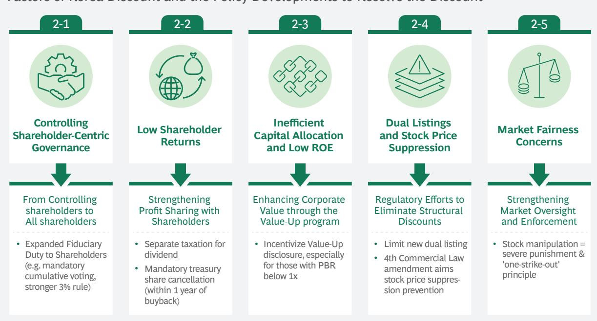  
Source: News reports, capital market interviews  
4. Source: FnGuide, as of May 4, 2026

## 2-1. From 'Controlling Shareholders' to 'All Shareholders' — The Governing Standard Itself Is Changing

Korean companies have long operated under a controlling shareholder-centric decision-making structure, with limited real checks by the board. Recent Commercial Law amendments directly target this structure. Expanding directors' fiduciary duty to 'all shareholders,' along with expanding separately-elected audit committee members, strengthening the 3% rule, $^{5}$ and introducing cumulative voting, are institutional mechanisms to constrain controlling shareholder influence and strengthen board independence. From an investor perspective, these changes build trust that 'my capital is being used for shareholder value,' contributing to a reduction in valuation discounts.

## 2-2. Strengthening Profit Sharing with Shareholders — From 'Retaining' to 'Returning'

Korean companies have long had a strong tendency to retain profits internally even when generating strong earnings. While the US total shareholder return ratio stands at 70% and Japan at 60%, $^{6}$ Korea's figure was just 37% as of 2025. The government has lowered investors' tax burden through separate dividend income taxation, $^{7}$ incentivized higher dividend payouts, and curbed the practice of using treasury share buybacks as a control defense mechanism by mandating their cancellation. The shift in the destination of a company's generated profits — from 'within the company' to 'shareholders' — is providing another foundation for the reduction of valuation discounts.

## 2-3. Inefficient Capital Allocation and Low ROE — Increasing Pressure for Improvement Through the Value-Up Program

Targeting the inefficient capital allocation where generated profits fail to translate into shareholder value, the government and the exchange are prompting companies to explicitly present ROE improvement targets and action plans through Value-Up disclosures. Initial response was slow, but momentum shifted when tax benefits from dividend income separation were linked to Value-Up disclosures. As of April 2026, the number of disclosing companies has surged to 714, and if the 'stock price suppression prevention law' under legislative discussion becomes a reality, an environment in which companies can no longer afford to ignore capital efficiency will firmly take hold. ROE improvement is no longer a company's voluntary choice — it is transitioning to a mandatory requirement demanded by both the market and the policy.

## 2-4. Dual Listings and Stock Price Suppression Practices — Direct Regulation of Structural Discount Factors

Parent-subsidiary dual listings have been a representative factor eroding shareholder value in the Korean market. While the dual listing ratio in the US is below 0.1%, Korea's is approximately 11% $^{8}$ , explaining that the issue is rather structural. Since the current government took office, new dual listings have effectively been halted, and if the stock price suppression prevention law under legislative discussion becomes a reality, maintaining value-destructive structures will become genuinely difficult.

## 2-5. Market Fairness — The End of Slap-on-the-Wrist Punishment

A structure where enforcement, even when violations are detected, was light and slow, has been eroding market trust. With the launch of a joint financial authorities response unit in July 2025, the 'one-strike-out' principle was introduced. When violations are detected, a fine of up to twice the illicit gain, account freezes, and officer employment restrictions are applied simultaneously, and penalties for serious securities crimes have been elevated up to life imprisonment. The signal that the Korean market is transitioning from a 'market where fairness risk can be tolerated' to a 'market where discipline operates' is a significant change that reduces foreign investors' risk premium and contributes to reduction of valuation discounts.

## Yet, KOSPI Still Has a Long Way to Go

Despite the recent rise, the KOSPI's PBR remains low relative to major global markets. Korea's 2026E PBR of 1.9x is significantly lower than the US (4.9x), Taiwan (4.0x), India (2.8x), and Europe $^{9}$ (2.2x). Among all KOSPI listed companies, those trading below 1x PBR decreased modestly from 553 in 2024 to 541 at end-2025, but still 64% of the total trade below the book value. The index has risen, but more than half the market has yet to receive recognition for even its book value.

Exhibit 5
PBR $^{1}$ and ROE $^{1}$ Comparison Across Major Indices  
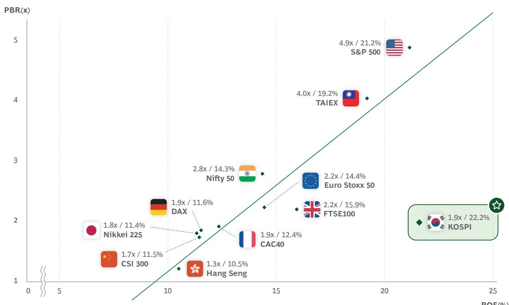  
1. Based on 2026/05/04 closing price, 2026E PBR, 2026E forward ROE

Korea's position in Exhibit 5 is paradoxical. ROE of 22% is among the highest of any major country index, yet PBR is similar to or lower than Japan and Germany, whose ROE is only 11\~12%. There are two reasons the market does not take Korea's high ROE at face value.

First, the average ROE for industries outside the four key sectors still hovers around 7%, leading investors to perceive the current ROE as a temporary peak dependent on a specific industry cycle rather than a structural improvement across the market.

Second, while institutional changes have begun, investors' conviction about actual increases in shareholder returns is still lacking. Changes in laws and regulations do not mean immediate changes in corporate behavior — the market wants to see execution. Without improvement in capital efficiency across the market, further normalization of PBR will inevitably be limited.

Ultimately, resolving the Korea Discount is not a task that will be completed solely through policy and earnings improvement in a few sectors. The government's institutional transformation and the four key sectors' earnings improvement led the first re-rating, and it is now time for the remaining companies to take substantive action on capital efficiency improvement and shareholder value enhancement to lead the next phase of re-rating.

Section 2

# TSR Improvement – No Longer Optional

## TSR Improvement Can No Longer Be Delayed

There are two reasons companies must engage in TSR management.

The first is the changing status of the stock market. Currently, approximately 65% of domestic household assets are concentrated in illiquid assets such as real estate. The government has been continuously pursuing policies to redirect capital flows into the stock market to change this structure, and as a result the number of individual domestic investors has surged from 5 million (2018) to approximately 14 million (2025). The stock market is becoming a mainstream vehicle for household wealth. A company's TSR is no longer the concern of only a small number of institutional investors — it is emerging as a core variable affecting a broad range of economic actors.

The second is the rise of shareholder activism. Poor TSR management can escalate into direct threats to management control. Activist investors no longer limit their demands to dividend increases — they are intervening in all aspects of company operations including management changes, board restructuring, and asset sales. In the US, the proportion of activist campaigns leading to CEO replacements is approximately 20%, significantly exceeding the market average CEO replacement rate of 12%. In Japan, amid the government's Value-Up momentum, the spread of activism resulted in 357 delistings over 2022–2025, with 125 in 2025 alone representing a record high. $^{10}$

## Efficiency Over Earnings – The Real Driver of TSR

So what must change to raise TSR? The key is the capital efficiency, not just the size of earnings. Generating large profits alone is not sufficient. How much profit a company generates per unit of capital employed is the core determinant of valuation. Over the past decade, Korean companies' net income growth rate averaged 4.9% annually — which is by no means low. However, over the same period ROE improved only 0.4 percentage points from 7.3% to 7.7%. Profits increased, but capital efficiency improvement was effectively stagnant due to excessive cash holdings, maintenance of non-core assets, and continued capital investment in low-profitability businesses.

Japan's trajectory was different. Over the same period, Japan's net income growth rate was 4.7% — almost identical to Korea's — but ROE improved 2.1 percentage points from 8.7% to 10.8%. This was the result of transitioning to a structure of generating the same profits with less capital, through non-core business divestitures, treasury share buybacks and cancellations, and dividend expansion.

The market recognized this as structural improvement, and the Nikkei 225 has risen more than four-fold from 15,000 points at end-2013 to 62,000 points in May 2026. Japan's case provides valuable lessons for the Korean market. Next, we look at how the Japanese government and companies drove this transformation.

## Japan Case Study – Government-Led ROE-Centric Management

Japan's experience, which walked this path a decade ahead of Korea, is highly instructive. The Abe administration (2nd term) set capital market reform as a core agenda item and pursued policies over a decade designed to create an environment where companies were increasingly incentivized to prioritize shareholder value. At the center was a strong emphasis on capital efficiency improvement — specifically ROE enhancement.

## Exhibit 6

Japan's decade-long Value-Up policies since 2014 — Korea is expediting the same process starting from 2024

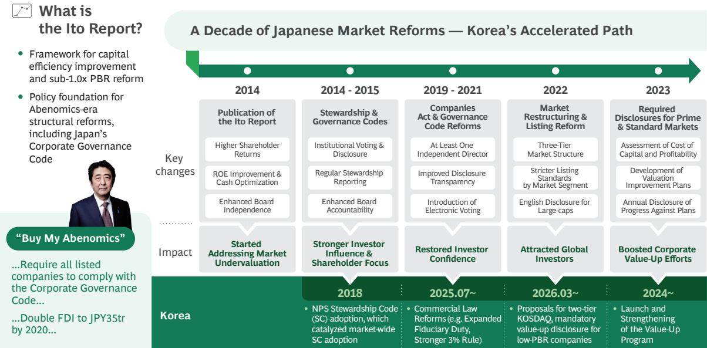  
The starting point was the 2014 'Ito Report.' The Abe administration presented ROE exceeding the cost of capital (minimum 8%) as an explicit target, prompting companies to realign their capital policies, governance, and investor communications. This was a national-level demand for the shift from 'profit size'-centric management to 'capital efficiency'-centric management.

From 2014 to 2021, stewardship codes and governance codes were introduced in parallel. Institutional investors were encouraged to actively push the companies to improve capital efficiency, and companies began to recognize ROE not as a simple performance metric but as the core indicator of capital allocation and long-term strategy. Governance reforms — mandatory outside director appointment, strengthened board accountability, enhanced disclosure transparency — proceeded simultaneously, laying the foundation for trust recovery between investors and companies.

From 2022, the Tokyo Stock Exchange reorganized markets into the Prime, Standard, and Growth framework and strengthened market discipline by requiring companies with PBR below 1x to disclose management plans to improve capital cost structure and share price. Moving beyond mere recommendations, this created an environment where companies could not avoid improving ROE and capital efficiency.

As a result, ROE became internalized as a core management indicator throughout Japanese corporate management, and the Nikkei 225 has risen more than four-fold from 15,000 points at end-2013 to 62,000 points May 2026. Japan's experience has become an explicit benchmark for Korean policy. The Commercial Law amendments, mandatory Value-Up disclosures, and other policies outlined earlier are not coincidental but the product of intentional design targeting the same outcomes.

## Japan Case Study – Corporate Self-Transformation

As government policy changes and investor demands converged, companies' management goals also began to change. Some leading companies, which had until now focused on building 'Great Companies,' began to simultaneously pursue becoming 'Great Stocks.' They internalized ROE and shareholder value enhancement as core management metrics and fundamentally restructured their business portfolios and capital allocation strategies. The transformation extended well beyond financial metrics — it fundamentally restructured business portfolios and governance practices.

Hitachi is a symbolic case. With more than 20 listed subsidiaries and a complex business structure, Hitachi — from 2009 to 2022 — fully restructured its listed subsidiaries and restructured its portfolio around its core business of digital infrastructure. Simultaneously, it dramatically strengthened board independence and built global-standard governance. In the process, ROE improved from -29% in 2009 to +14% in 2022, and the share price rose approximately 5.5x from 2009 through the completion of restructuring in 2022, receiving market re-rating; as of early May 2026, it has risen nearly 20x. This case demonstrates that liquidating idle assets and improving capital efficiency can directly translate into meaningful corporate value creation.

DNP (Dai Nippon Printing) is a case that explicitly set ROE and PBR as management objectives. In 2023, it announced public targets of ROE 10% and PBR exceeding 1x, and transitioned its portfolio from printing-centric business structures to growth industries including semiconductors and displays. In addition, it simultaneously executed approximately JPY 300 billion in treasury share buybacks, implementing growth investment and shareholder returns together. As a result, ROE — which averaged just 3.2% over the 10 years prior to the announcement — improved to an average of approximately 8.3% after the announcement, and the share price has risen 2.6x since early 2023. This was a strategic transformation that raised ROE by simultaneously pursuing business restructuring and capital return.

The two cases took different approaches but shared the same orientation. While Hitachi raised capital efficiency through fundamental business restructuring, DNP gained market trust by combining explicit financial target setting with shareholder returns. The common thread is that management embraced ROE and shareholder value as core management metrics and executed concrete actions to realize them.

What these cases demonstrate is that Japan's Value-Up translated into market re-rating only when institutional change combined with corporate execution. That is precisely what is now required of Korean companies.

## Change Has Already Begun in Korea

We already see early examples in Korea. Among the top 50 companies by 3-year TSR, $^{11}$ a handful of companies improved TSR through management actions such as capital efficiency improvement and shareholder return policies, rather than relying on industry tailwinds.

Exhibit 7
Top 50 Companies by 3-Year $^{11}$ TSR in Korea

<table><tr><td></td><td>Company</td><td>Sector</td><td>3Y TSR (%)</td></tr><tr><td>1</td><td>Peptron</td><td>Healthcare</td><td>225</td></tr><tr><td>2</td><td>Hyosung Heavy Industries</td><td>Industrials</td><td>187</td></tr><tr><td>3</td><td>ISC</td><td>IT</td><td>182</td></tr><tr><td>4</td><td>HD Hyundai Electric</td><td>Industrials</td><td>166</td></tr><tr><td>5</td><td>Silicon2</td><td>Consumer</td><td>151</td></tr><tr><td>6</td><td>Rainbow Robotics</td><td>IT</td><td>139</td></tr><tr><td>7</td><td>HD Hyundai Marine Engine</td><td>Industrials</td><td>133</td></tr><tr><td>8</td><td>Hanwha Aerospace</td><td>Industrials</td><td>130</td></tr><tr><td>9</td><td>Alteogen</td><td>Healthcare</td><td>127</td></tr><tr><td>10</td><td>Robotis</td><td>IT</td><td>126</td></tr><tr><td>11</td><td>Iljin Electric</td><td>Industrials</td><td>124</td></tr><tr><td>12</td><td>Hanmi Semiconductor</td><td>IT</td><td>124</td></tr><tr><td>13</td><td>SK Square</td><td>IT</td><td>122</td></tr><tr><td>14</td><td>Samyang Foods</td><td>Consumer</td><td>115</td></tr><tr><td>15</td><td>Doosan</td><td>Industrials</td><td>112</td></tr><tr><td>16</td><td>SK Hynix</td><td>IT</td><td>107</td></tr><tr><td>17</td><td>ABL Bio</td><td>Healthcare</td><td>106</td></tr></table>

<table><tr><td></td><td>Company</td><td>Sector</td><td>3Y TSR (%)</td></tr><tr><td>18</td><td>LS Electric</td><td>Industrials</td><td>105</td></tr><tr><td>19</td><td>Techwing</td><td>IT</td><td>102</td></tr><tr><td>20</td><td>BHI</td><td>Industrials</td><td>100</td></tr><tr><td>21</td><td>Voronoi</td><td>Healthcare</td><td>99</td></tr><tr><td>22</td><td>Shinsung Delta Tech</td><td>IT</td><td>94</td></tr><tr><td>23</td><td>PSK Holdings</td><td>IT</td><td>93</td></tr><tr><td>24</td><td>LS Marine Solution</td><td>Industrials</td><td>93</td></tr><tr><td>25</td><td>Olix Pharma</td><td>Healthcare</td><td>90</td></tr><tr><td>26</td><td>Hanwha Ocean</td><td>Industrials</td><td>90</td></tr><tr><td>27</td><td>Hyundai Rotem</td><td>Industrials</td><td>88</td></tr><tr><td>28</td><td>SNT Energy</td><td>Industrials</td><td>87</td></tr><tr><td>29</td><td>HD Korea Shipbuilding</td><td>Industrials</td><td>81</td></tr><tr><td>30</td><td>Pharma Research</td><td>Consumer</td><td>81</td></tr><tr><td>31</td><td>SNT Dynamics</td><td>Industrials</td><td>80</td></tr><tr><td>32</td><td>Hanwha Engine</td><td>Industrials</td><td>80</td></tr><tr><td>33</td><td>Hanwha Systems</td><td>Industrials</td><td>75</td></tr><tr><td>34</td><td>Samchundang Pharm</td><td>Healthcare</td><td>75</td></tr></table>

<table><tr><td></td><td>Company</td><td>Sector</td><td>3Y TSR (%)</td></tr><tr><td>35</td><td>YC</td><td>Consumer</td><td>73</td></tr><tr><td>36</td><td>Doosan Enerbility</td><td>Industrials</td><td>70</td></tr><tr><td>37</td><td>LS Eco Energy</td><td>Industrials</td><td>69</td></tr><tr><td>38</td><td>Samsung Heavy Ind.</td><td>Industrials</td><td>68</td></tr><tr><td>39</td><td>LIG D&amp;A</td><td>Industrials</td><td>67</td></tr><tr><td>40</td><td>POSCO DX</td><td>IT</td><td>67</td></tr><tr><td>41</td><td>Ecopro</td><td>Industrials</td><td>65</td></tr><tr><td>42</td><td>HD Hyundai Heavy Ind.</td><td>Industrials</td><td>64</td></tr><tr><td>43</td><td>Gaon Cable</td><td>Industrials</td><td>64</td></tr><tr><td>44</td><td>EO Technics</td><td>IT</td><td>60</td></tr><tr><td>45</td><td>LigaChem Bio</td><td>Healthcare</td><td>59</td></tr><tr><td>46</td><td>Mirae Asset Securities</td><td>Financial</td><td>59</td></tr><tr><td>47</td><td>Kiwoom Securities</td><td>Financial</td><td>58</td></tr><tr><td>48</td><td>Hyundai Elevator</td><td>Industrials</td><td>57</td></tr><tr><td>49</td><td>JB Financial Group</td><td>Financial</td><td>56</td></tr><tr><td>50</td><td>HD Hyundai</td><td>Energy</td><td>56</td></tr></table>

Hyundai Elevator's starting point was profitability improvement through overseas business restructuring. Building on restored profitability, it raised its payout ratio to an average of approximately 150% over the past two years, with ROE improving from 14% to 20% in the process. This is a case of simultaneously improving capital efficiency and investor trust through both earnings improvement and proactive shareholder returns.

JB Financial Group is a case of consistently combining profitability management with shareholder returns. It has steadily strengthened earnings power through niche segment customer targeting for expanded interest margins and loan loss ratio improvement, while efficiently managing capital through aggressive treasury share buybacks. As a result, it has maintained ROE of 12% — among the highest of domestic financial holding companies — for five consecutive years, demonstrating the results of consistent capital efficiency management to the market.

The sector and approach differed, but the message from both cases is the same: when capital allocation and shareholder returns are placed at the core of management, it can translate into corporate value enhancement. These changes are still confined to a handful of leading companies, but for Korea's capital market to achieve a sustainable re-rating, such cases must spread across the entire market. The next section presents the core priorities that companies must execute immediately for TSR improvement.

Section 3

# What Companies Must Do Now

## The First Step Toward TSR Improvement – Self-Diagnosis

TSR improvement is achieved when business, financial, and investor strategies are organically aligned. The starting point is knowing precisely why your company's TSR is low. The priority of improvement differs depending on whether the root cause of undervaluation is profitability, capital allocation, or communication with the market. Companies should first diagnose the root cause of their undervaluation using the TSR checklist below, and use this as the basis for setting improvement priorities.

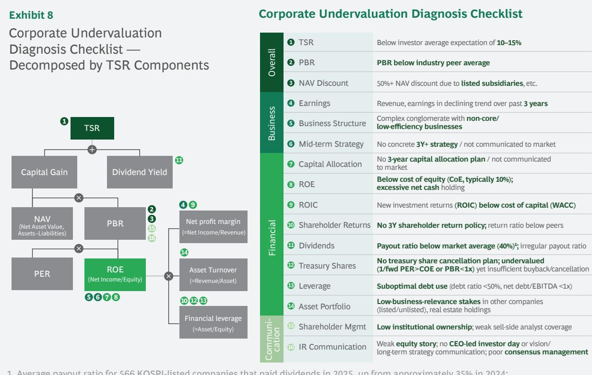

<table><tr><td colspan="3">Corporate Undervaluation Diagnosis Checklist</td></tr><tr><td rowspan="3">Overall</td><td>1 TSR</td><td>Below investor average expectation of 10–15%</td></tr><tr><td>2 PBR</td><td>PBR below industry peer average</td></tr><tr><td>3 NAV Discount</td><td>50%+ NAV discount due to listed subsidiaries, etc.</td></tr><tr><td rowspan="3">Business</td><td>4 Earnings</td><td>Revenue, earnings in declining trend over past 3 years</td></tr><tr><td>5 Business Structure</td><td>Complex conglomerate with non-core/low-efficiency businesses</td></tr><tr><td>6 Mid-term Strategy</td><td>No concrete 3Y+ strategy / not communicated to market</td></tr><tr><td rowspan="8">Financial</td><td>7 Capital Allocation</td><td>No 3-year capital allocation plan / not communicated to market</td></tr><tr><td>8 ROE</td><td>Below cost of equity (CoE, typically 10%);excessive net cash holding</td></tr><tr><td>9 ROIC</td><td>New investment returns (ROIC) below cost of capital (WACC)</td></tr><tr><td>10 Shareholder Returns</td><td>No 3Y shareholder return policy; return ratio below peers</td></tr><tr><td>11 Dividends</td><td>Payout ratio below market average (40%)1; irregular payout ratio</td></tr><tr><td>12 Treasury Shares</td><td>No treasury share cancellation plan; undervalued (1/fwd PER&gt;COE or PBR&lt;1x) yet insufficient buyback/cancellation</td></tr><tr><td>13 Leverage</td><td>Suboptimal debt use (debt ratio &lt;50%, net debt/EBITDA &lt;1x)</td></tr><tr><td>14 Asset Portfolio</td><td>Low-business-relevance stakes in other companies (listed/unlisted), real estate holdings</td></tr><tr><td rowspan="2">Communication</td><td>15 Shareholder Mgmt</td><td>Low institutional ownership; weak sell-side analyst coverage</td></tr><tr><td>16 IR Communication</td><td>Weak equity story; no CEO-led investor day or vision/long-term strategy communication; poor consensus management</td></tr></table>

Once the root causes and vulnerabilities of undervaluation have been identified through diagnosis, companies need to take the appropriate actions to improve. Different companies will have to focus on different areas, but the following seven are the core actions that have in practice driven the greatest impact on TSR improvement across many companies.

## 7 Key Actions for TSR Improvement

## Business Strategy Low-Margin/Low-Multiple Portfolio Restructuring

## 1. Business Divestiture / Asset Sales

Maintaining businesses with low profitability or diminishing strategic importance is equivalent to locking up capital. Not through simple expansion, but through selectivity and focus, capital must be concentrated in areas where it can create the highest value. Low-profile business divestitures and asset sales are among the most direct means of improving ROE.

## Financial Strategy Capital Efficiency Improvement and Capital Allocation Optimization

## 2. ROIC-Based Investment Pre-Evaluation and Post-Investment Monitoring

All investment decisions must be evaluated against the cost of capital (WACC). $^{12}$ A company's WACC is typically 5\~8%, and investments where ROIC falls below this destroy shareholder value. Strict criteria must be established not only at the investment pre-evaluation stage but also with continuous monitoring and management of post-investment performance.

## 3. Active Utilization of Idle Cash and Non-Core Assets

Excessive cash holdings may be positive from a financial stability perspective, but become a factor diluting ROE. Domestic companies frequently hold various forms of non-core assets including non-operating real estate, equity stakes in other companies with low business rationale, and listed subsidiaries. Idle cash and non-core assets should be proactively monetized and redeployed into growth investments or returned to shareholders.

## 4. Capital Allocation in the Direction of Maximizing TSR

There are broadly two uses for capital — reinvest in business, or return to shareholders. The key is not to decide this habitually, but to make strategic judgments at each point in time in the way that maximizes TSR. If there are high-profitability investment opportunities where ROIC exceeds WACC, bold investment is warranted; if not, returning to shareholders is appropriate. For major investment decisions in particular, companies must specifically persuade investors about how much return can be expected from the investment and when it will be realized. Without this, the market will send a clear signal: 'just pay it out as a dividend,' and the investment announcement itself can drive share prices down.

## 5. Consistent and Visible Shareholder Return Strategy

If the direction is set toward shareholder returns, the next question is how to combine dividends and treasury share buybacks. In undervalued periods (1/fwd PER > COE), treasury share buybacks and cancellations become the means of maximizing shareholder value; with stable cash flow bases, dividends are appropriate. Various return mechanisms including 'capital reduction dividends' $^{13}$ should also be considered strategically. As important as the means is consistency. If payout ratios swing wildly from year to year, investors cannot predict future income, which leads to valuation discounts. Announcing return policies and target levels on a 3-year cycle and maintaining them stably is the most reliable method for building investor trust.

## Investor Strategy Building Trust Through Equity Story-Centered Communication

## 6. Communicating a Concrete Equity Story

The answer to 'why should investors invest in our company' must be clearly presented to the market. Build an equity story that reflects growth direction and capital allocation plans, and present it to the market along with quantitative targets including ROE in addition to revenue and earnings. The more specific and verifiable the targets, the more they are reflected in valuations. C-level should communicate directly through annual events such as Investor Days, and credibility should be accumulated by continuously updating target progress through subsequent IR activities.

## 7. Resolving Structures that Damage Shareholder Value

Structural factors that undermine market trust — dual listings, opaque governance structures — lead to valuation discounts independent of a company's fundamentals. Structural discount factors must be eliminated through minimizing new subsidiary listings, reviewing existing dual listing structures, reducing NAV discounts through monetization of listed subsidiary stakes, and strengthening board independence.

## Renewing Mindset and Systems

Executing individual actions is important, but what matters even more is a fundamental shift in companies' strategic orientation, organizational structure, and incentive systems. Without changes in all three, individual initiatives are likely to remain one-off events.

## 1. Change the Strategic Orientation — From 'Great Company' to 'Great Stock'

A company's performance is no longer evaluated only by its business results. Share price must become a management objective, not the result. Until now, Korean companies have set revenue and earnings growth as the core management objective, but going forward, becoming a 'Great Stock' — i.e., corporate value maximization — must also be established as an explicit goal.

Value-Up begins with medium-to-long-term strategy. However, a significant number of domestic companies have yet to establish systematic medium-to-long-term strategies themselves, and these companies must begin formulating them immediately. Even companies with medium-to-long-term strategies often have business and financial objectives separated, or capital allocation plans missing entirely. A clear plan for how capital will be allocated — whether for investment or returning to shareholders — must be incorporated into the strategy. And the core metric for checking whether that plan is actually enhancing corporate value is ROE. Specifying ROE as a medium-to-long-term target and tracking it — that is the starting point for Value-Up execution.

## 2. IR Is the CEO's Agenda

Many companies perceive IR as a passive channel for reporting results. The absence of dedicated IR organizations or the CFO also acting as IR lead is common for this reason. However, IR is fundamentally a tool for lifting valuation. IR should be a forward-looking agenda generator, that wins investor trust, rather than a passive vehicle transmitting past results. If a dedicated IR function does not exist, one must be set up immediately.

However, creating an IR organization does not automatically solve the problem. IR can construct the equity story that appeals to the market only if each business division and finance provide their respective plans. IR cannot create that content from scratch. Business divisions want growth; finance wants efficiency. It is the CEO's responsibility to organize the different divisions, resolve conflicts, and drive the coherent company-wide strategy and message. When the CEO leads cross-functional collaboration and communicates directly with the market through Investor Days and similar events, IR becomes a strategic function that moves valuations.

## 3. When Incentives Align, Management and Shareholders Look in the Same Direction

Even the best strategy and strongest CEO intent will fall short if the organization does not follow. And what moves the organization is ultimately the KPI and compensation system. If management's KPIs are tied only to revenue and earnings, capital efficiency improvement will always be pushed to the back burner. What gets measured gets managed. Ultimately, designing performance metrics and compensation systems linked to TSR is the starting point.

For companies in developed markets such as the US, long-term incentives account for more than 70% of compensation, with stock-based compensation such as RSUs and PSUs. TSR acts as a core performance indicator. Recently this trend has been spreading rapidly in Korea. Major domestic companies — Samsung Electronics, Hanwha, SK, Amorepacific, Naver — have successively introduced stock-based compensation, and when management looks in the same direction as shareholders, the entire organization begins to move toward TSR improvement.

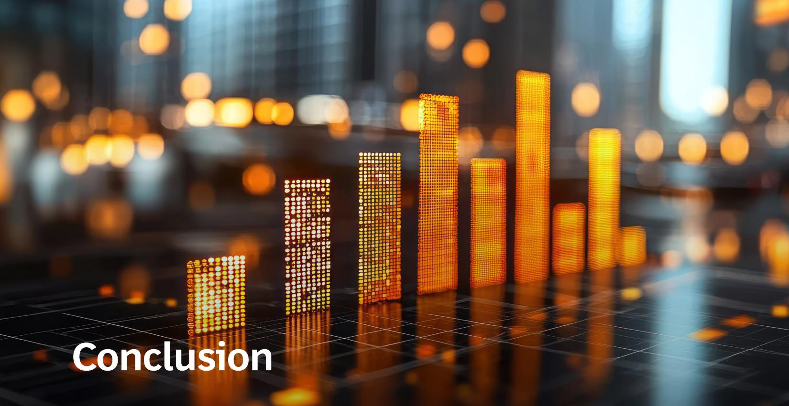

## Conclusion

Korea's capital market opened the first chapter of a historic re-rating from 2025 through the first half of 2026. Yet this achievement was led by government-driven policy changes and earnings improvement in a handful of key sectors. For the KOSPI's PBR to leap to the level of the US or Taiwan, the structural quality improvement of the market as a whole — not just a handful of sectors — must provide support. The key is not simply generating more earnings but transitioning to a structure of generating earnings with less capital. It is the quality of earnings, not the size, that determines valuations.

The next phase of re-rating will depend on corporate actions. Companies that reset their strategic orientation toward corporate value maximization, align capital allocation, shareholder returns, and market communication in that direction, and simultaneously change their organizational and incentive systems — these companies will write the next chapter of Korea's capital market.

Finally, one final observation concerns the role of government. The government's contribution to this rally was immense. The compressed institutional overhaul — Commercial Law amendments, Value-Up Program, tax reforms — created market expectations and laid the foundation for the first re-rating. However, the change thus far has been the product of expectations. The Value-Up disclosure participation rate still hovers around 28%, $^{14}$ still well below the Tokyo Stock Exchange Prime Market disclosure rate of 94%. $^{15}$ Many companies still operate with the belief that a low share price is acceptable.

Going forward, it is the government's task to fine-tune regulations at the execution stage and to create the conditions for companies to change. Just as the Japanese government refined regulations persistently over a decade and created a culture where companies internalize shareholder value as the core of management, the Korean government must also continuously drive all listed companies across the market to raise capital efficiency — not just relying on the structure of a few sectors like semiconductors, shipbuilding, and defense.

## Authors

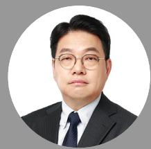

Joonho Lee
Managing Director and Senior
Partner, Seoul

Lee.Joonho@bcg.com

Seoha Kim
Managing Director and Partner,
Seoul

Kim.Seoha@bcg.com

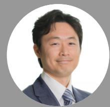

For Further Contact

If you would like to discuss this report, please contact the authors.

Ichiro Kaku
Managing Director and Senior
Partner, Tokyo

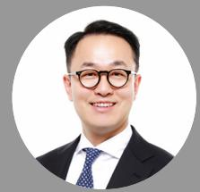

Kaku.Ichiro@bcg.com

Kyungjae Lee
Project Leader,
Seoul

Lee.Kyungjae@bcg.com

Acknowledgments

The authors are grateful to a number of colleagues for their continued support and assistance. They include Eugene Khoo and Shi Wei Lim in BCG Value Science Center and the members of the CFS Research Team for their specific contributions for quantitative analysis in this report.

For information or permission to reprint, please contact BCG at permissions@bcg.com. To find the latest BCG content and register to receive e-alerts on this topic or others, please visit bcg.com. Follow Boston Consulting Group on LinkedIn, Facebook, and X (formerly Twitter).

© Boston Consulting Group 2026. All rights reserved.

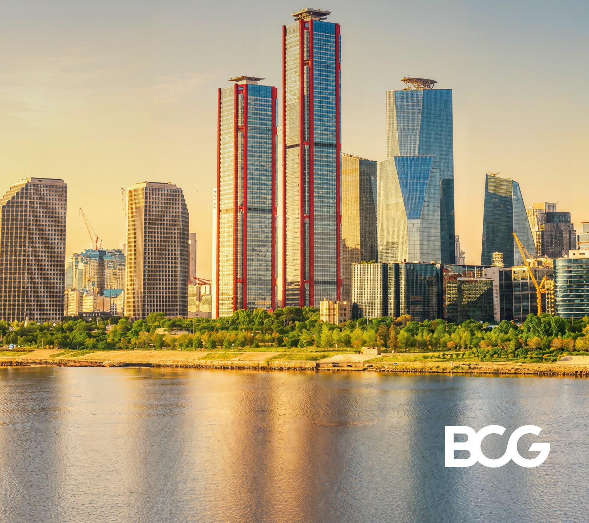