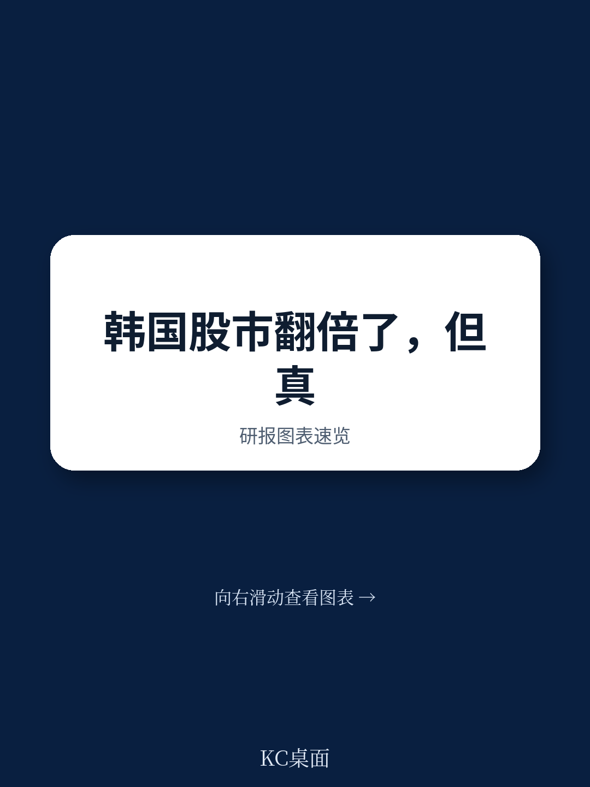
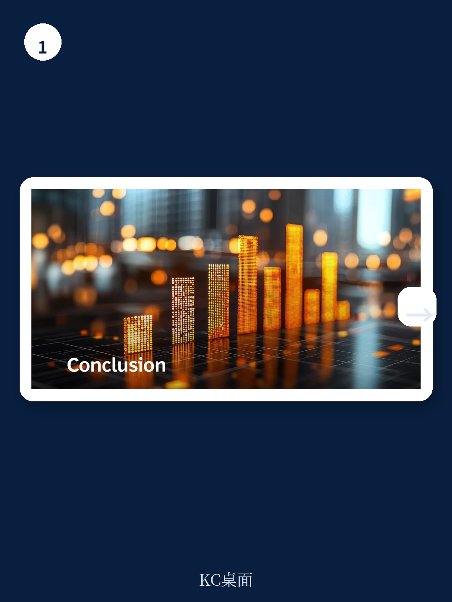
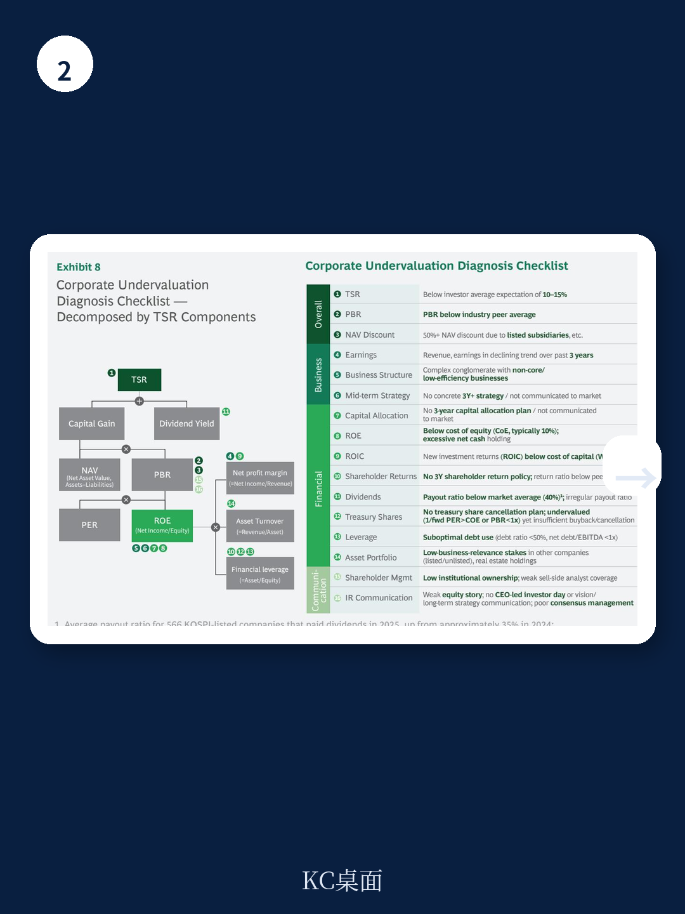

# 波士顿咨询：韩国价值创造报告2026-KOSPITSR约76%

2025年，韩国综合报价指数（KOSPI）总股东回报率（TSR）达到约76%，远超全球前十大指数约22%的平均水平。这一轮上涨由资本利得驱动——75个百分点的涨幅来自报价升值，股息仅贡献1个百分点。市场对韩国企业的定价逻辑正在发生变化，从长期贴水转向重估叙事。

但波士顿咨询（BCG）在2026年6月发布的《从折价到溢价：被低估韩国企业的觉醒》报告中指出，这轮重估高度集中。截至2025年底，KOSPI的市净率（PBR）从2024年的0.8倍升至1.4倍，2026年预期进一步升至1.9倍。然而，剔除半导体、造船、国防和核电四个关键行业后，2026年预期PBR降至1.0倍。超过60%的上市公司仍以低于账面价值的价格交易。

> **KC评论：** 报告通过拆解PBR的驱动因素，揭示了一个容易被忽视的事实——指数上涨掩盖了市场内部的严重分化。半导体行业的ROE在2026年预期达到60%，市值占比从29%跃升至52%，而其余行业的平均ROE仅约7%，仍低于约10%的股权成本。

## 1. 政策改革与行业盈利共同推动第一轮重估

报告认为，这轮重估由两股力量共同驱动。一是四个关键行业的盈利复苏：AI驱动的存储芯片需求回升、全球造船和国防订单周期回暖、核电重启与出口扩张。二是新政府的资本市场振兴政策，包括商法修订扩大董事对全体股东的受信义务、价值提升计划要求企业明确ROE改善目标、股息分离课税鼓励利润分配、以及禁止新股低价发行等结构性改革。

政策层面的系统性推进正在改变市场对韩国结构性折价的预期。报告特别指出，日本的经验表明，政府持续十年的监管完善最终使企业将股东价值内化为管理核心。韩国目前的价值提升披露参与率约28%，远低于东京标的交易所主板市场的94%，政策传导仍需时间。

## 2. 多数企业仍面临资本效率不足的结构性不确定性

报告通过对比各行业财务数据，清晰展示了市场内部的断层。资金、汽车、医疗保健、消费和媒体娱乐等行业的市值增长普遍低于2倍，盈利能力改善有限。汽车行业的ROE从11%下降至9%，消费和媒体娱乐仍停留在中个位数水平。

这些行业面临的核心问题不是盈利规模，而是盈利质量。PBR由ROE、增长率和股权成本共同决定。当ROE持续低于股权成本时，无论盈利水平如何，高估值都难以成立。报告认为，市场已开始质疑对韩国企业长期适用的结构性折价是否仍然合理，但这一判断目前仅适用于少数行业。

## 3. 企业层面的TSR改善成为不可回避的议题

报告指出，对于被这轮上涨抛在后面的企业，处境实际上更加危险。市场涨得越猛，未能参与的企业面临的不确定性越大。资本效率低下的企业可能面临激进读者干预、董事会重组、业务重组和管理层更迭。日本的经验显示，未能适应的企业付出了显著代价——管理层控制权纠纷、被迫资产出售、以及创纪录的退市数量。

报告为企业提供了七项关键行动，涵盖战略重置、资本配置优化、股东回报政策调整、以及组织激励体系改革。其中特别强调，CEO需要亲自推动跨部门协作，将读者关系从信息传递职能升级为估值管理工具。在美国等成熟市场，长期激励占管理层薪酬的70%以上，且以公司为基础，TSR作为核心绩效指标。这一趋势正在韩国扩散，三星电子、韩华、SK、爱茉莉太平洋、Naver等已相继引入股权激励。

## 4. 下一阶段重估取决于企业行动而非政策预期

报告认为，韩国资本市场从2025年到2026年上半年开启了历史性重估的第一章，但这主要由政府政策变化和少数行业的盈利改善驱动。要使KOSPI的PBR跃升至美国或台湾的水平，需要市场整体结构性质量的提升，而非仅靠少数行业。

关键在于用更少的资本产生盈利，而非单纯扩大盈利规模。决定估值的是盈利质量，而非盈利体量。报告最后指出，政府的贡献巨大，但迄今为止的变化是预期的产物。下一阶段的重估将取决于企业能否将战略重心转向企业价值最大化，并同步调整资本配置、股东回报和市场沟通。

对于读者而言，这份报告提供了一个观察框架：区分哪些企业的估值改善有盈利质量和政策改革支撑，哪些只是指数上涨的被动受益者。韩国市场的结构性分化可能在未来几个季度进一步加剧。
