## BCG Investor Perspectives Series

US Edition, Q2 2026

SURVEY CONDUCTED JUNE 22–23, 2026

## BCG Investor Perspectives Series | US Edition, Q2 2026

BCG surveyed leading investors June 22–23, 2026, to understand their perspectives on the US economy and US stock market, as well as their expectations for the companies they invest in or cover. This survey has important implications for the strategic decisions being made by senior executives and boards of directors.

This is BCG's 34th US investor pulse check since March 2020. In addition, we have conducted three European investor pulse checks since April 2025.

BCG conducted this pulse check survey to help corporate executives and boards of directors understand investors' perspectives in this rapidly changing environment.

\- Approximately 63% of the participants in the June 2026 survey overlap with the respondents in the survey conducted March 23–27, 2026, and 82% of the March participants overlapped with those surveyed September 25–28, 2025

\- Across the three most recent surveys (September 25–28, 2025, March 23–27, 2026, and June 22–23, 2026), the overlap in respondents is 57%

## About the respondents:

\- They represent investment firms that have approximately \$10 trillion in combined assets under management

\- Over $90\%$ are portfolio managers and senior buy-side analysts who are responsible for buy, sell, and hold decisions

\- They cover a broad spectrum of investor types and investment styles, including deep value, income, quality value, growth at a reasonable price (GARP), and core growth; they also include some quantitative, technical, and special situation investors

## The survey focused on three key topics:

## 1

Investors' views of and expectations for the US economy and stock market, and their views on key risks and opportunities in the current environment

2

Investors' expectations regarding the future impact of AI and GenAI as well as their related priorities for companies they invest in or cover

3

Investors' perspectives on and implications for important decisions that corporate executives and boards are considering and making

\- Because the market environment is evolving, especially regarding macroeconomic conditions, some questions from prior surveys were not asked or were replaced with new ones in this edition

\- The analysis shared in this document represents an aggregated view that is not segmented by investor type; it is important for corporate executives and boards of directors to keep in mind their current and target investor types while interpreting the results

\- The results represent surveyed investors’ views only—reflecting current investor sentiment and currently priced-in expectations—both of which are subject to change as new information becomes available; to understand BCG’s point of view on current topics, please visit bcg.com

## This edition compares the findings from the June 2026 US pulse check to the March 2026 and September 2025 pulse checks

## June 22–23

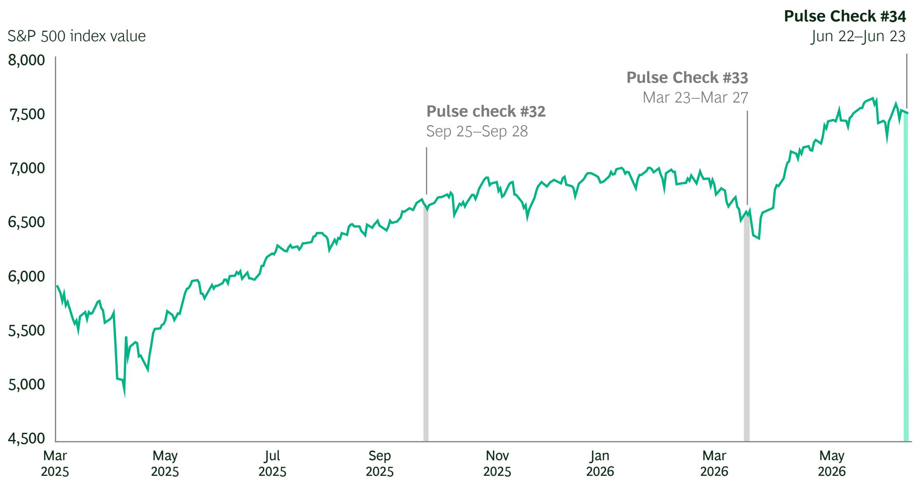  
New tariff policies announced, Apr 2, 2025  
Middle East ceasefire announced, Apr 8, 2026

Start of conflict in the Middle East, Feb 28, 2026

## Pulse check #34

\- Followed a strong market upswing (since April) and renewed market volatility in June

\- S&P 500 closed at 7,472 points on June 22, 2026 (about $1.8\%$ below current all-time high $^{1}$ )

## Pulse check #33

\- Initiated over three weeks after the start of the conflict in the Middle East

\- S&P 500 closed at 6,506 points on March 20, 2026 (about $6.7\%$ below prior all-time high²)

## Pulse check #32

\- Initiated after the market had recovered from the correction following the April 2025 new tariff policy announcement

\- S&P 500 closed at 6,638 points on September 24, 2025 (about $0.8\%$ below prior all-time high $^{3}$ )

## Investor Pulse Check, Q2 2026 | Highlights

## June 22–23

\- Investor sentiment improved materially, with 46% of investors bullish for the rest of 2026 (up from 26% in March 2026). At the same time, increased concerns about the S&P 500 being overvalued (raised by 67% of investors vs. 62% in March 2026) and potential profitability headwinds (raised by 51% of investors) led to market-average TSR expectations remaining muted at 6.2% over the next three years (versus 6.3% in March).

\- Interest rates and inflation have risen to become the top two macro risk factors, highlighted by 61% and 47% of investors, respectively (up from 47% and 35%, respectively, in March 2026), with geopolitics dropping from number one to number three, highlighted by 44% of investors (down from 69% in March).

\- AI now is the number one expected market driver (highlighted by 66% of investors, up from 54% in March 2026), with 56% seeing the market as too optimistic on AI (up from 55% in March), and 77% expecting future TSR headwinds as a result of elevated valuation levels due to AI (up from 63% in March).

\- Investors anticipate that AI will have a material impact on companies' financial performance (80% expect this to be reflected in revenue growth and/or profitability within the next two years), with more than 60% of investors expecting AI to primarily deliver efficiency gains or temporary first-mover advantages, compared with only 25% of investors seeing AI as a source of durable competitive advantage for AI winners.

\- As a result, investor scrutiny of AI is high, with 78% of investors specifically analyzing companies’ AI strategies (up from 72% in March 2026), and three times as many investors believing companies are overinvesting in AI rather than underinvesting (45% vs. 15%).

\- More broadly, investors remain strongly focused on companies' growth prospects (cited by $60\%$ as a key investment criterion, up from $55\%$ in March 2026), but most investors expect companies to also fully deliver on near-term EPS guidance and consensus ( $58\%$ , up from $52\%$ in March).

\- Investors want capital allocation to be disciplined and balanced across high-return investments (with 33% focusing on returns on capital) while maintaining healthy balance sheets (69% of investors avoid companies with over three times leverage) and paying consistent dividends (expected by 79%).

\- Investors want companies to actively shape their portfolios, with 79% saying that companies should consider divesting businesses and 78% supporting focused tuck-in acquisitions.

## US investors' current perspectives on the US economy and stock market

June 22–23

## Macroeconomic outlook

## INVESTORS WERE ASKED ABOUT THEIR VIEWS ON US RECESSION RISKS

17%

Investors that believe the US will experience a recession by the end of 2026

Below the March 2026 and September 2025 survey results of 43% and 53%, respectively

## INVESTORS WERE ASKED HOW LONG THEY EXPECT INFLATION TO REMAIN ABOVE THE FEDERAL RESERVE'S 2% TARGET

49%

Investors that believe inflation will remain elevated beyond year-end 2026

Above the March 2026 and September 2025 survey results of 47% and 38%, respectively

3.6%

3.3%

The average expected inflation rate for year-end 2026

The average expected inflation rate for 2027 and 2028

## Bull vs. bear sentiment

## INVESTORS WERE ASKED TO PLACE THEMSELVES ON THE BULL-BEAR SPECTRUM OVER DIFFERENT TIME PERIODS

46%

Investors that are
bullish for the
remainder of 2026

Above the March 2026 and September 2025 survey results of 26% and 36%, respectively

## INVESTORS WERE ASKED ABOUT THEIR INFLATION EXPECTATIONS

68%

Investors that are bullish for the next three years $^{1}$

Between the March 2026 and September 2025 survey results of 71% and 63%, respectively

## INVESTORS WERE ASKED ABOUT THEIR SENTIMENT TODAY, COMPARED WITH THREE MONTHS AGO

50%

Investors that are more bullish on the economy

Above the March 2026 survey result of 22% and equal to the September 2025 survey result

46%

Investors that are more bullish on the stock market

Between the March 2026 and September 2025 survey results of 28% and 57%, respectively

## Expected stock market low

S&P 500 market low

## Implied potential S&P decline from current level $^{2}$

6,946

Timing of low

7%

Matches series low vs. 8% in both March 2026 and September 2025 surveys

Q4 2026

## Stock market level in three years

S&P 500 level of... $^{2}$

8,664

...implies an average annual TSR for the next three years $^{1}$

6.2%

Near the March 2026 result of 6.3% and equal to the September 2025 result

Bullish

Neutral

Bearish

## Interest rates and inflation have become the top two macro risk factors, while geopolitical risks dropped to number three

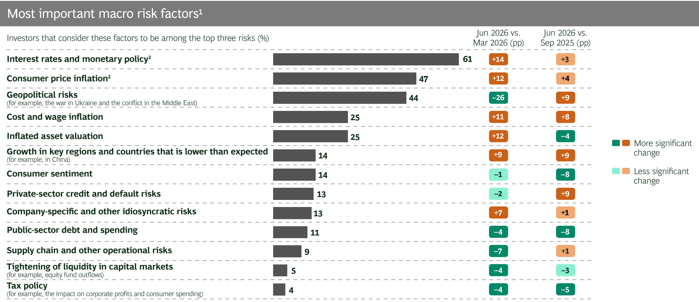

## Two-thirds of investors view the S&P 500 as overvalued

June 22–23

Investor perspectives on current S&P 500 valuation level $(\%)^{1}$

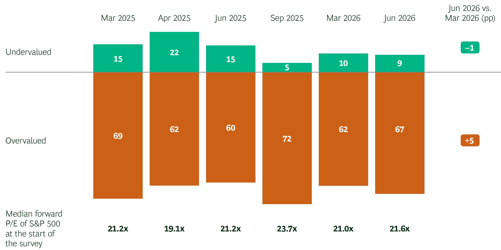

77% | Investors that anticipate TSR headwinds due to the current market valuation level and bullish AI expectations (up 14pp since March 2026). $^{2}$

51% | Investors that expect meaningful earnings resets over the next 12 to 24 months. $^{3}$

As a result, it will be important to have a clear and compelling value-creation agenda to offset lower profitability and/or valuation multiple compression.

## Investors see the market as too bullish on all market drivers, especially the future impact of AI, US federal policies, and interest rates

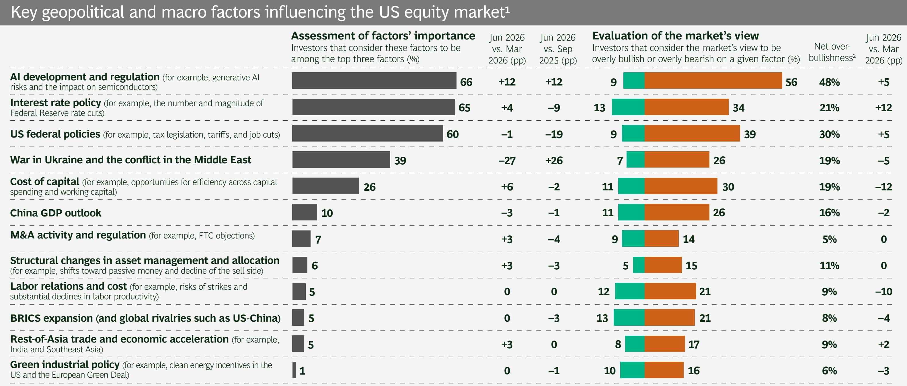

While the expected impact of US tariffs remains broadly negative across macro and corporate indicators, it has moderated

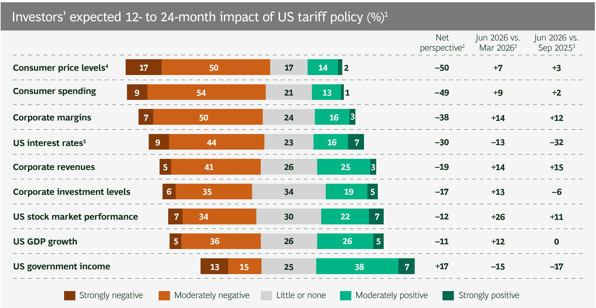  
Sources: BCG Investor Perspectives Series, Q2 2026 (June 22–23, 2026, n = 151), Q1 2026 (March 23–27, 2026), and Q3 2025 (September 25–28, 2025).  
Note: Series may not sum to 100 because a small share of respondents reported being unsure of the prospective impact of US tariffs on a given indicator. Any apparent discrepancies in totals or comparisons with prior survey results are due to rounding. $^{1}$ Survey question: How would you rate the impact of the US tariff policy over the next 12 to 24 months? $^{2}$ Net perspective is the share of investors expecting positive impact minus the share of investors expecting negative impact. $^{3}$ Change in net perspective compared with the results from the same question asked in the surveys conducted March 23–27, 2026, and September 25–28, 2025, respectively. $^{4}$ Negative impact on consumer prices means the consumer price index will increase from current levels. $^{5}$ Positive impact on US interest rates means that interest rates will decline from current levels. $^{6}$ Percentage of investors agreeing with this statement: The US stock market has so far underreacted to the likely macroeconomic impact of tariffs.

Exploration-based industries, financial institutions, and tech sectors are seen as macro winners, while consumer sectors are expected to lag

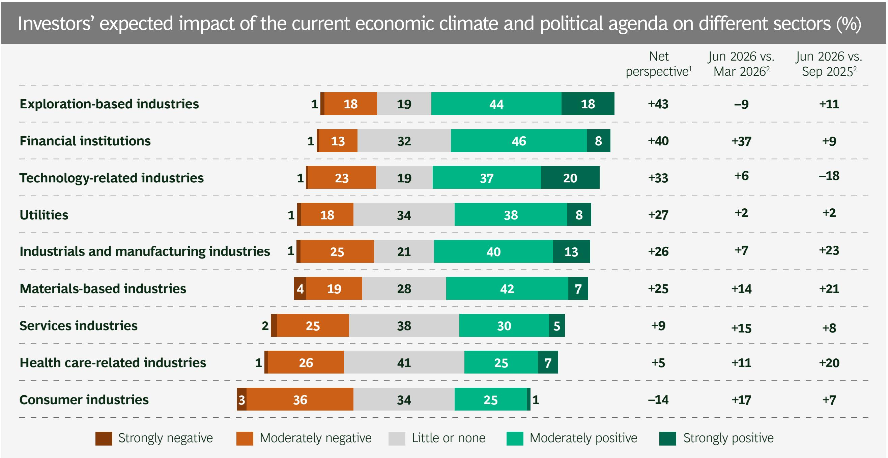  
Sources: BCG Investor Perspectives Series, Q2 2026 (June 22–23, 2026, n = 151), Q1 2026 (March 23–27, 2026), and Q3 2025 (September 25–28, 2025).

Investors are confident in their understanding of macroeconomic factors.

For example, 79% of survey respondents say that they have a strong grasp of the likely tariff impact on the companies they invest in, compared with 71% in March 2026 and 75% in September 2025. $^{3}$

## Most investors expect AI to have a material impact on fundamentals, but only 25% think AI will create durable competitive advantages

Investors' views on the expected impact of AI

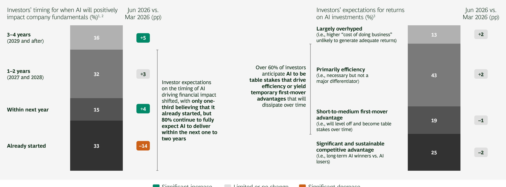  
Sources: S&P Capital IQ; BCG Investor Perspectives Series, Q2 2026 (June 22–23, 2026, n = 151) and Q1 2026 (March 23–27, 2026).  
$^{1}$ Survey question: When do you expect AI and GenAI to have a materially positive impact on corporate fundamentals and profitability across most industries, excluding technology companies focused on AI? $^{2}$ Changes relative to corresponding time frames in prior survey. Series does not sum to 100% because 2% of investors do not believe there will be an impact on growth or margins. $^{3}$ Survey question: Which of the following best describes your overall view on the likely average impact of AI and GenAI on corporate value creation over the next one to two years?

## AI is expected to positively impact GDP growth, stock market performance, and corporate fundamentals, at the cost of jobs and wages

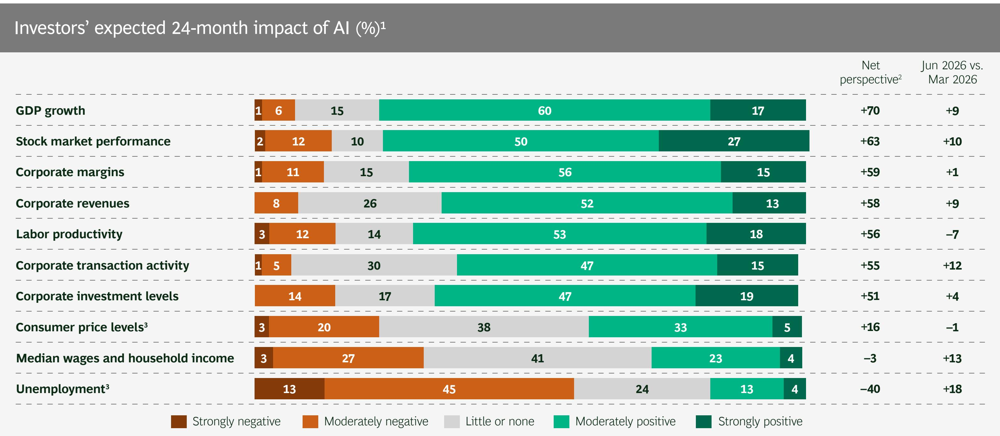  
Sources: S&P Capital IQ; BCG Investor Perspectives Series, Q2 2026 (June 22–23, 2026, n = 151) and Q1 2026 (March 23–27, 2026).  
Note: Series may not sum to 100 because a small share of respondents reported being unsure. Any apparent discrepancies in totals or comparisons with prior survey results are due to rounding.  
$^{1}$ Survey question: What impact do you expect AI to have in the following areas over the next 24 months in [your region]? $^{2}$ Net perspective is the share of investors expecting positive impact minus the share of investors expecting negative impact.

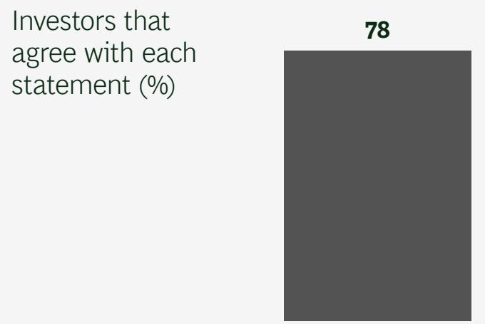  
Investors are actively evaluating AI strategies...  
I analyze and evaluate the AI and GenAI strategies of the companies that I invest in or cover

## About 80% of investors are actively evaluating companies' AI strategies and stress the importance of having a clear AI narrative

June 22–23

...and emphasize the importance of a clear AI narrative, with a majority preferring AI leaders...

...whereas views on companies' AI reporting and valuation impact are mixed but improving

  
It is critical for management teams to have a clear and authentic narrative regarding their AI and GenAI strategies

  
I prefer companies to pursue leadership in AI and GenAI rather than be fast followers

  
The companies I invest in or cover provide good reporting on their AI and GenAI agendas and their impact

  
The AI strategies, public commitments, and investments of companies are reflected in their market valuations

Investors' responses excluded technology companies focused on AI, including infrastructure and tools

Significant increase

Limited or no change

Significant decrease

  
...but many investors view current AI investments as too aggressive

## Many investors view AI investments as too aggressive, but they are increasingly willing to accept margin dilution to build AI capabilities

June 22–23

Investors are concerned about companies' technical and organizational capabilities...

...and are increasingly willing to accept moderate margin dilution to fund AI...

Jun 2026 vs. Mar 2026 (pp)

Investors that agree with each statement (%)

  
I am concerned about the data and technological capabilities to successfully execute AI  
I am concerned about the people and nontechnical capabilities to deliver AI

  
I am willing to accept a moderate level of margin dilution (1pp to 2pp) temporarily (one to two years)

  
Investors' views on AI investments (%)  
I am willing to accept a significant level of margin dilution (3pp to 5pp) temporarily (one to two years)

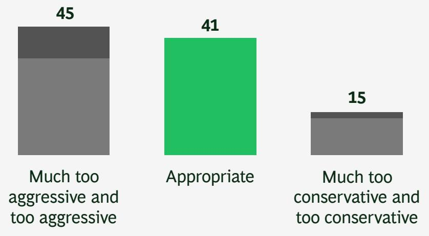

Investors' responses excluded technology companies focused on AI, including infrastructure and tools

Significant increase

Limited or no change

Significant decrease

Investors ultimately expect AI to create meaningful value, especially in health care, technology, financial institutions, and industrials

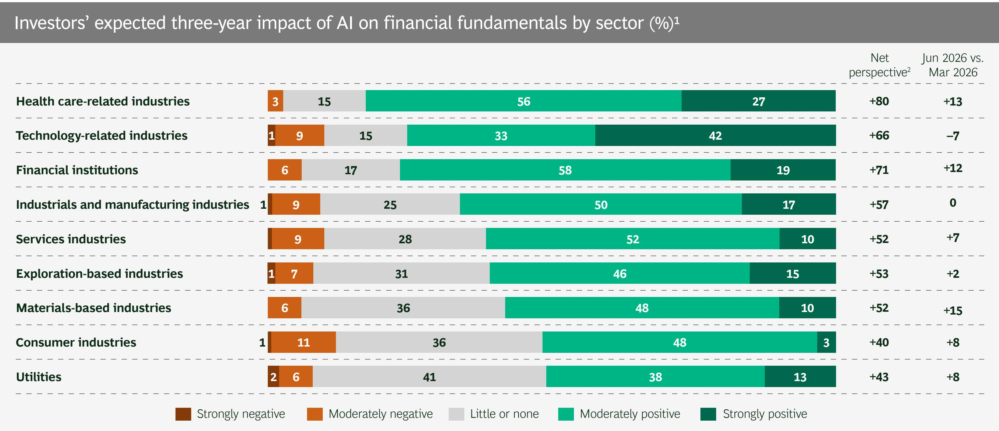  
Sources: S&P Capital IQ; BCG Investor Perspectives Series, Q2 2026 (June 22–23, 2026, n = 151) and Q1 2026 (March 23–27, 2026).  
Note: Any apparent discrepancies in sums or comparisons with prior survey results are due to rounding.  
$^{1}$ Survey question: How do you expect the development of AI to affect the financial fundamentals (for example, revenue growth, margins, profitability, and free cash flow generation) of companies across different sectors within the next three years (by year-end 2028)? $^{2}$ Net perspective is the share of investors expecting positive impact minus the share of investors expecting negative impact.

## Changes in investment practices and priorities

Investors that report making the following changes to capital allocation and investing practices or recommendations since the beginning of 2025 $(\%)^{1}$

## Investors are prioritizing structural growth and macro beneficiaries, while being cautious by increasing cash holdings and smaller positions

June 22–23

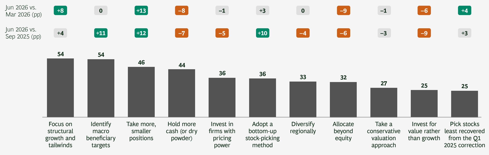

## Long-term organic growth remains the dominant investment consideration, followed by strong returns on capital

Most important company-specific factors driving investment decisions or recommendations

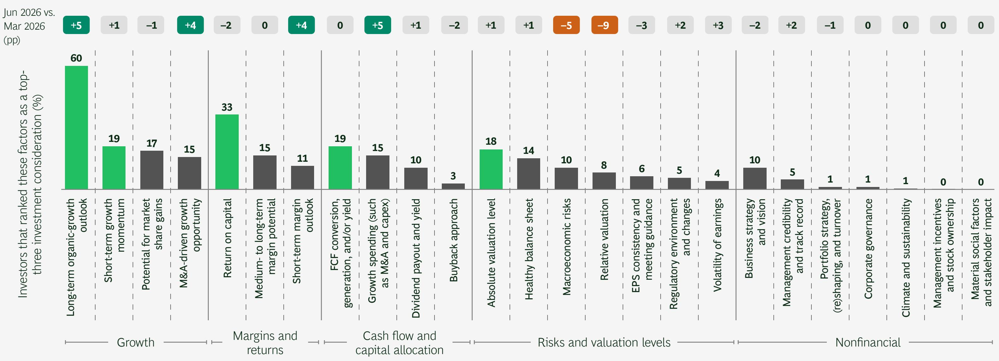  
Sources: BCG Investor Perspectives Series, Q2 2026 (June 22–23, 2026, n = 151) and Q1 2026 (March 23–27, 2026).  
Note: FCF = free cash flow; EPS = earnings per share. Any apparent discrepancies in comparisons with prior survey results are due to rounding. The ranking for climate and sustainability factors would likely be very different for sectors where environmental considerations are central to the investment thesis.

## A clear majority of investors want companies to deliver on near-term EPS expectations while making disciplined growth investments

June 22–23

Investors' priorities for financially healthy companies  
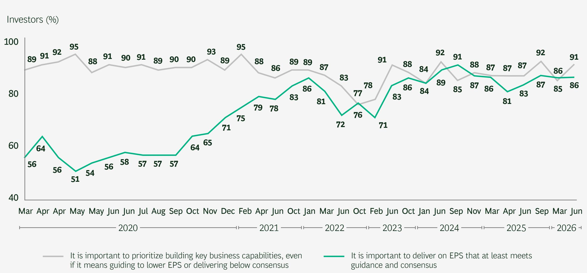

When asked to choose, investors skew toward investing for growth by a three-to-one margin $^{1}$

28% | Investors that would prefer companies to prioritize growth investments (below the March 2026 survey result of 37%)

14% | Investors that would prefer companies to focus on delivering short-term EPS performance (near the March 2026 survey result of 11%)

58% | Investors that expect companies to thread the needle and both deliver near-term EPS and invest for the future (higher than the March 2026 survey result of 52%)

## Investors remain supportive of investing for growth, while more strongly emphasizing cost discipline and transformation initiatives

June 22–23

<table><tr><td rowspan="2">Do investors support companies that prioritize long-term investments or short-term performance?</td><td>83% | Investors that support companies investing in innovation and go-to-market strategies, even if that affects margins short term3pp lower than the March 2026 result of 86%, and equal to the September 2025 result</td><td rowspan="2">How should companies prepare to tackle the challenges raised by the current environment?</td><td>78% | Investors that believe that in 2026, there is an increased need for transformative initiatives (such as cost programs, pricing optimization, and growth acceleration) compared with prior years6pp higher than the March 2026 result of 72%, and 8pp above the September 2025 result of 70%</td></tr><tr><td>79% | Investors that support companies focusing on reducing costs to strengthen near-term profitability and hunkering down—that is, not reinvesting cost savings into medium- and longer-term growth9pp higher than the March 2026 result of 70%, and 6pp above the September 2025 result of 73%</td><td>51% | Investors that believe companies should expect an increase in activist activity and, therefore, take proactive steps to mitigate activism risk by strengthening their businesses&#x27; fundamentals13pp lower than the March 2026 result of 64%, and 8pp below the September 2025 result of 59%</td></tr></table>

## Investors increasingly back portfolio reshaping through acquisitions and divestitures

June 22–23

Should
companies
reshape their
portfolios
through
divestitures or
acquisitions,
or both?

79% | Investors that believe exiting or divesting lines of businesses should be considered to strengthen the overall company in the current market environment

Same as the March 2026 result, and 1pp above the September 2025 result of 78%

72% | Investors that believe acquisitions should be actively pursued to strengthen the business at current valuation levels

9pp higher than the March 2026 result of 63%, and 8pp above the September 2025 result of 64%

Do investors
support
tuck-in or
even larger
acquisitions
in the current
environment?

78% | Investors that support companies making focused tuck-in acquisitions (for example, well below 20% of their market cap) that do not materially increase their leverage

3pp lower than the March 2026 result of 81%, and 4pp above the September 2025 result of 74%

72% | Investors that support companies making substantial or even transformative acquisitions (above 20% of their market cap) that have the potential to be strategic and competitive game changers, even if they substantially increase short-term leverage (one to two years)

3pp higher than the March 2026 and September 2025 results of 69% for each period

## Investors increasingly value disciplined cash returns, indicating durable dividends are critical and showing more support for buybacks

June 22–23

<table><tr><td rowspan="6">Should companies prioritize dividends and/or repurchase shares?</td><td>79% | Investors that think it is important to pay dividends that are at least in line with historical levels1</td></tr><tr><td>2pp higher than the March 2026 result of 77%, and 7pp above September 2025 result of 72%—matching a series high</td></tr><tr><td>58% | Investors that agree that dividends have become a more important consideration in decision making and recommendations in the current market environment</td></tr><tr><td>5pp higher than the March 2026 result of 53%, and 1pp below the September 2025 result of 59%</td></tr><tr><td>48% | Investors that think it is important to aggressively repurchase shares in today&#x27;s market environment</td></tr><tr><td>9pp higher than the March 2026 result of 39%, and 5pp above the September 2025 result of 43%—matching a series high</td></tr></table>

The vast majority of investors remain strongly committed to the importance of durable dividends as a sign of quality.

Given the current uncertainty, dividends also have become more important considerations in investment decisions.

While more investors support aggressive share buybacks despite near-record S&P levels, such decisions depend on the individual company's valuation and TSR outlook.

Investor perspectives and approaches regarding companies with debt

## Investors' aversion to leverage remains high, especially for companies with elevated debt levels

June 22–23

Actively avoiding or reducing exposure to companies carrying higher leverage (for example, more than three times the net debt-to-EBITDA ratio)

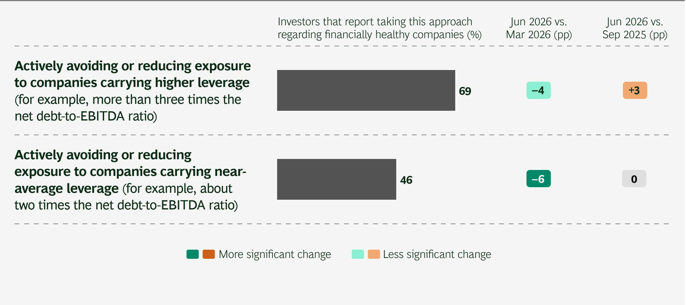

Most investors continue to avoid companies with elevated leverage, underscoring the importance of balance sheet resilience.

While leverage concerns have eased since March, investors remain cautious on companies with higher debt levels.

Companies with moderate leverage have more room, but they should preserve flexibility in case the macro backdrop deteriorates.

## Almost 80% of investors seek more C-suite engagement, while over two-thirds remain concerned about the accuracy of sell-side forecasts

June 22–23

Does the current environment present special challenges that companies need to address through guidance and engagement?

68% | Investors that believe that most sell-side forecasts do not accurately reflect the current uncertainty and fast-changing environment

5pp lower than the March 2026 result of 73%, and 3pp below the September 2025 result of 71%

78% | Investors that would like to engage more frequently with senior executives of the companies they invest in or cover

4pp higher than the March 2026 and September 2025 results of 74%

Companies should ensure clear guidance and proactively manage expectations, while providing more C-suite access for high-quality investors.

## Comparison of BCG's US investor pulse checks (1/7)

<table><tr><td></td><td colspan="14">2020</td><td colspan="3">2021</td></tr><tr><td>What are your expectations for...</td><td>Mar 22 #1</td><td>Apr 5 #2</td><td>Apr 19 #3</td><td>May 3 #4</td><td>May 17 #5</td><td>Jun 7 #6</td><td>Jun 28 #7</td><td>Jul 19 #8</td><td>Aug 9 #9</td><td>Sep 19 #10</td><td>Oct 17 #11</td><td>Nov 14 #12</td><td>Dec 13 #13</td><td>Feb 7 #14</td><td>Apr 30 #15</td><td>Jun 20 #16</td><td></td></tr><tr><td>Duration of COVID-19&#x27;s impact on the US economy</td><td>Through Q3 2020</td><td>Through Q3 2020</td><td>Through Q4 2020</td><td>Through Q4 2020</td><td>Through Q4 2020</td><td>Through Q4 2020</td><td>Through Q1 2021</td><td>Through Q2 2021</td><td>Through Q2 2021</td><td>Through Q2 2021</td><td>End of Q2 or start of Q3 2021</td><td>Through Q2 2021</td><td>Through Q2 2021</td><td>Through Q4 2021</td><td>Through Q4 2021</td><td>Not asked</td><td></td></tr><tr><td>Stock market decline:</td><td colspan="15"></td><td></td><td></td></tr><tr><td>▪ S&amp;P 500 level after the decline (from the current level at the time of the survey)</td><td>2,062 (-14%)</td><td>2,158 (-14%)</td><td>2,393 (-15%)</td><td>2,382 (-16%) ↓</td><td>2,449 (-16%) ↓</td><td>2,676 (-14%)</td><td>2,664 (-14%)</td><td>2,765 (-14%)</td><td>2,935 (-12%)</td><td>2,962 (-12%)</td><td>3,108 (-11%)</td><td>3,153 (-9%)</td><td>3,288 (-10%)</td><td>3,468 (-10%)</td><td>3,828 (-9%)</td><td>3,812 (-9%)</td><td></td></tr><tr><td>▪ Timing of decline</td><td>End of May 2020</td><td>End of June (Q2) 2020</td><td>Early Q3 2020</td><td>End of Q3 2020</td><td>End of Q3 2020</td><td>End of Q3 2020</td><td>End of Q3 2020</td><td>End of Q4 2020</td><td>End of Q4 2020</td><td>End of Q4 2020</td><td>End of Q1 2021</td><td>End of Q1 2021</td><td>End of Q2 2021</td><td>End of Q2 2021</td><td>End of Q3 2021</td><td>End of Q4 2021</td><td></td></tr><tr><td>Three-year S&amp;P 500 level (implied TSR) $^1$ </td><td>3,075 (11%) ↑</td><td>3,165 (10%)</td><td>3,411 (9%)</td><td>3,591 (9%)</td><td>3,525 (9%)</td><td>3,717 (8%)</td><td>3,685 (8%)</td><td>3,727 (7%)</td><td>3,869 (7%)</td><td>3,938 (7.5%)</td><td>4,061 (7.5%)</td><td>4,153 (7.5%)</td><td>4,232 (7%)</td><td>4,488 (7%)</td><td>4,840 (7%)</td><td>4,829 (7%)</td><td></td></tr><tr><td colspan="16">Bull vs. bear</td><td></td><td></td></tr><tr><td>Investors that are bullish for:</td><td colspan="15"></td><td></td><td></td></tr><tr><td>▪ Current CY</td><td>55%</td><td>53%</td><td>44%</td><td>46%</td><td>45%</td><td>41%</td><td>40%</td><td>35%</td><td>36%</td><td>45%</td><td>35%</td><td>38%</td><td>47%</td><td>51%</td><td>50%</td><td>39%</td><td></td></tr><tr><td>▪ Next CY</td><td>63%</td><td>64%</td><td>67% ↑</td><td>64%</td><td>62%</td><td>55%</td><td>64%</td><td>57%</td><td>57%</td><td>65%</td><td>56%</td><td>55%</td><td>50%</td><td>41%</td><td>47%</td><td>45%</td><td></td></tr><tr><td>▪ Next three years</td><td>65%</td><td>68%</td><td>69%</td><td>69%</td><td>64%</td><td>61%</td><td>61%</td><td>57%</td><td>60%</td><td>66%</td><td>63%</td><td>59%</td><td>57%</td><td>53%</td><td>52%</td><td>52%</td><td></td></tr><tr><td>More bullish vs. last month/three months ago:  $economy^2$ </td><td>Not asked</td><td>Not asked</td><td>34%</td><td>35%</td><td>30%</td><td>64%</td><td>35%</td><td>28%</td><td>43%</td><td>45%</td><td>39%</td><td>47%</td><td>60%</td><td>63%</td><td>73%</td><td>55%</td><td></td></tr><tr><td>More bullish vs. last month/three months ago: stock  $market^2$ </td><td>Not asked</td><td>Not asked</td><td>45%</td><td>40%</td><td>33%</td><td>53%</td><td>30%</td><td>31%</td><td>36%</td><td>34%</td><td>35%</td><td>49%</td><td>54%</td><td>59%</td><td>57%</td><td>40%</td><td></td></tr></table>

Sources: BCG's investor pulse checks, March 2020 through June 2026; n = \~150 for each survey.  
↑ Series high ↓ Series low  
Note: CY = calendar year.

## Comparison of BCG's US investor pulse checks (2/7)

<table><tr><td></td><td>2021</td><td colspan="4">2022</td><td colspan="4">2023</td><td colspan="4">2024</td><td colspan="4">2025</td><td colspan="3">2026</td></tr><tr><td>What are your expectations for...</td><td>Oct 31#17</td><td>Jan 31#18</td><td>Mar 22#19</td><td>Jun 21#20</td><td>Oct 11#21</td><td>Feb 22#22</td><td>Jun 8#23</td><td>Oct 13#24</td><td>Jan 18#25</td><td>Jun 16#26</td><td>Sep 23#27</td><td>Nov 10#28</td><td>Mar 25#29</td><td>Apr 9#30</td><td>Jun 8#31</td><td>Sep 28#32</td><td>Mar 27#33</td><td>Jun 23#34</td><td>Difference(Jun 2026 vs.Mar 2026)</td><td></td></tr><tr><td>Duration of COVID-19&#x27;s impact on the US economy</td><td>Not asked</td><td>End of Q2 2022</td><td>End of Q2 2022</td><td>Not asked</td><td>Not asked</td><td>Not asked</td><td>Not asked</td><td>Not asked</td><td>Not asked</td><td>Not asked</td><td>Not asked</td><td>Not asked</td><td>Not asked</td><td>Not asked</td><td>Not asked</td><td>Not asked</td><td>Not asked</td><td>Not asked</td><td>NA</td><td></td></tr><tr><td>Stock market decline:</td><td colspan="19"></td><td></td></tr><tr><td>▪ S&amp;P 500 level after the decline(from the current level at the time of the survey)</td><td>4,140(-10%)</td><td>3,875(-10% to -12%)</td><td>3,920(-10%)</td><td>3,240(-12%)</td><td>3,375(-10%)</td><td>3,712(-8%)</td><td>3,878(-9%)</td><td>3,965(-9%)</td><td>4,397(-8%)</td><td>4,984(-8%)</td><td>5,257(-8%)</td><td>5,523(-7%)↑</td><td>5,251(-9%)</td><td>4,539(-10%)</td><td>5,543(-8%)</td><td>6,096(-8%)</td><td>5,970(-8%)</td><td>6,946(-7%)↑</td><td>+125bps</td><td></td></tr><tr><td>▪ Timing of decline</td><td>End of Q2 2022</td><td>End of Q2 2022</td><td>End of Q3 2022</td><td>End of Q4 2022</td><td>End of Q4 2022</td><td>End of Q2 2023</td><td>End of Q4 2023</td><td>End of Q1 2024</td><td>End of Q2 2024</td><td>End of Q4 2024</td><td>End of Q2 2025</td><td>End of Q2 2025</td><td>End of Q4 2025</td><td>End of Q4 2025</td><td>End of Q4 2025</td><td>End of Q1 2026</td><td>End of Q3 2026</td><td>End of Q4 2026</td><td>NA</td><td></td></tr><tr><td>Three-year S&amp;P 500 level (implied TSR) $^1$ </td><td>5,273(6.5%)</td><td>5,120(7%-7.5%)</td><td>5,140(7%)</td><td>4,460(8.5%)</td><td>4,400(8%)</td><td>4,692(7%)</td><td>4,953(7%)</td><td>4,948(6%)↓</td><td>5,532(6.5%)</td><td>6,293(6.5%)</td><td>6,546(6%)↓</td><td>6,920(6.5%)</td><td>6,688(6.5%)</td><td>5,978(7%)</td><td>6,911(6%)↓</td><td>7,631(6.2%)</td><td>7,562(6.3%)</td><td>8,664(6.2%)</td><td>-10bps</td><td></td></tr><tr><td colspan="20">Bull vs. bear</td><td></td></tr><tr><td>Investors that are bullish for:</td><td colspan="19"></td><td></td></tr><tr><td>▪ Current CY</td><td>41%</td><td>20%</td><td>22%</td><td>6%</td><td>5%↓</td><td>22%</td><td>21%</td><td>19%</td><td>37%</td><td>41%</td><td>44%</td><td>65%↑</td><td>25%</td><td>20%</td><td>28%</td><td>36%</td><td>26%</td><td>46%</td><td>+20pp</td><td></td></tr><tr><td>▪ Next CY</td><td>43%</td><td>43%</td><td>41%</td><td>29%</td><td>25%↓</td><td>51%</td><td>51%</td><td>38%</td><td>59%</td><td>51%</td><td>52%</td><td>57%</td><td>60%</td><td>48%</td><td>48%</td><td>41%</td><td>50%</td><td>Not asked</td><td>NA</td><td></td></tr><tr><td>▪ Next three years</td><td>45%↓</td><td>60%</td><td>62%</td><td>59%</td><td>62%</td><td>73%</td><td>69%</td><td>65%</td><td>67%</td><td>60%</td><td>60%</td><td>67%</td><td>76%↑</td><td>66%</td><td>68%</td><td>63%</td><td>71%</td><td>68%</td><td>-3pp</td><td></td></tr><tr><td>More bullish than one or three months ago:  $economy^2$ </td><td>41%</td><td>33%</td><td>25%</td><td>14%</td><td>13%↓</td><td>60%</td><td>58%</td><td>35%</td><td>62%</td><td>53%</td><td>59%</td><td>74%↑</td><td>31%</td><td>18%</td><td>41%</td><td>50%</td><td>22%</td><td>50%</td><td>+28pp</td><td></td></tr><tr><td>More bullish than one or three months ago:  $stock market^2$ </td><td>42%</td><td>25%↓</td><td>29%</td><td>27%</td><td>28%</td><td>53%</td><td>53%</td><td>37%</td><td>59%</td><td>53%</td><td>60%</td><td>75%↑</td><td>37%</td><td>29%</td><td>45%</td><td>57%</td><td>28%</td><td>46%</td><td>+18pp</td><td></td></tr></table>

Sources: BCG's investor pulse checks, March 2020 through June 2026; n = \~150 for each survey.  
Note: CY = calendar year; NA = not applicable; bps = basis points.  
$^{1}$ TSR is derived through the CAGR of the S&P 500 level and the S&P-average dividend yield. $^{2}$ Respondents were asked for their change in bullishness relative to the prior month until

## Comparison of BCG's US investor pulse checks (3/7)

Investors that agree with the following statements about financially healthy companies (\%) $^{1}$

<table><tr><td></td><td colspan="13">2020</td><td colspan="3">2021</td></tr><tr><td>It is important for financially healthy companies to... $^{1}$ </td><td>Mar 22 #1</td><td>Apr 5 #2</td><td>Apr 19 #3</td><td>May 3 #4</td><td>May 17 #5</td><td>Jun 7 #6</td><td>Jun 28 #7</td><td>Jul 19 #8</td><td>Aug 9 #9</td><td>Sep 19 #10</td><td>Oct 17 #11</td><td>Nov 14 #12</td><td>Dec 13 #13</td><td>Feb 7 #14</td><td>Apr 30 #15</td><td>Jun 20 #16</td></tr><tr><td>Prioritize building key business capabilities</td><td>89%</td><td>91%</td><td>92%</td><td>95% ↑</td><td>88%</td><td>91%</td><td>90%</td><td>91%</td><td>89%</td><td>90%</td><td>90%</td><td>93%</td><td>89%</td><td>95% ↑</td><td>88%</td><td>86%</td></tr><tr><td>Actively pursue acquisitions</td><td>58%</td><td>64%</td><td>65%</td><td>66%</td><td>70%</td><td>68%</td><td>68%</td><td>69%</td><td>71%</td><td>72% ↑</td><td>65%</td><td>63%</td><td>65%</td><td>63%</td><td>71%</td><td>68%</td></tr><tr><td>Actively consider exiting or divesting lines of business</td><td>Not asked</td><td>Not asked</td><td>Not asked</td><td>Not asked</td><td>65%</td><td>64% ↓</td><td>75%</td><td>67%</td><td>73%</td><td>75%</td><td>73%</td><td>77%</td><td>71%</td><td>83% ↑</td><td>75%</td><td>77%</td></tr><tr><td>Aggressively repurchase shares</td><td>39%</td><td>44%</td><td>38%</td><td>36%</td><td>42%</td><td>43%</td><td>34% ↓</td><td>44%</td><td>37%</td><td>41%</td><td>43%</td><td>36%</td><td>36%</td><td>35%</td><td>41%</td><td>36%</td></tr><tr><td>Maintain the dividend per share</td><td>41%</td><td>43%</td><td>35%</td><td>29% ↓</td><td>36%</td><td>43%</td><td>33%</td><td>36%</td><td>36%</td><td>37%</td><td>40%</td><td>45%</td><td>43%</td><td>47%</td><td>53%</td><td>47%</td></tr><tr><td>Consider significant equity issuance a reasonable move</td><td>Not asked</td><td>48%</td><td>56%</td><td>55%</td><td>53%</td><td>53%</td><td>61%</td><td>59%</td><td>55%</td><td>37% ↓</td><td>56%</td><td>52%</td><td>61%</td><td>55%</td><td>55%</td><td>63% ↑</td></tr><tr><td>Deliver EPS that at least meets revised guidance or consensus</td><td>56%</td><td>64%</td><td>56%</td><td>51% ↓</td><td>54%</td><td>56%</td><td>58%</td><td>57%</td><td>57%</td><td>57%</td><td>64%</td><td>65%</td><td>71%</td><td>75%</td><td>79%</td><td>78%</td></tr><tr><td>Expect an increase in activist activity and take proactive steps to mitigate risk</td><td>59%</td><td>66%</td><td>64%</td><td>70%</td><td>61%</td><td>65%</td><td>63%</td><td>66%</td><td>63%</td><td>57%</td><td>67%</td><td>67%</td><td>67%</td><td>68%</td><td>67%</td><td>69%</td></tr><tr><td>Continue to fully pursue their ESG agenda and priorities $^{2}$ </td><td>Not asked</td><td>56%</td><td>46%</td><td>48%</td><td>45%</td><td>51%</td><td>48%</td><td>53%</td><td>51%</td><td>69% ↑</td><td>45%</td><td>48%</td><td>50%</td><td>50%</td><td>47%</td><td>55%</td></tr><tr><td>Double down on ESG initiatives that create value and/or reduce risk longer term $^{2}$ </td><td>Not asked</td><td>Not asked</td><td>Not asked</td><td>Not asked</td><td>Not asked</td><td>Not asked</td><td>Not asked</td><td>Not asked</td><td>Not asked</td><td>Not asked</td><td>Not asked</td><td>Not asked</td><td>Not asked</td><td>Not asked</td><td>Not asked</td><td>49% ↑</td></tr></table>

↑ Series high ↓ Series low  
Sources: BCG's investor pulse checks, March 2020 through June 2026; n = \~150 for each survey.  
Note: EPS = earnings per share; ESG = environmental, social, and governance.

## Comparison of BCG's US investor pulse checks (4/7)

Investors that agree with the following statements about financially healthy companies (\%) $^{1}$

<table><tr><td></td><td colspan="2">2021</td><td colspan="3">2022</td><td colspan="3">2023</td><td colspan="3">2024</td><td colspan="3">2025</td><td colspan="3">2026</td><td></td><td></td></tr><tr><td>It is important for financially healthy companies to... $^{1}$ </td><td>Oct 31 #17</td><td>Jan 31 #18</td><td>Mar 22 #19</td><td>Jun 21 #20</td><td>Oct 11 #21</td><td>Feb 22 #22</td><td>Jun 8 #23</td><td>Oct 13 #24</td><td>Jan 18 #25</td><td>Jun 16 #26</td><td>Sep 23 #27</td><td>Nov 10 #28</td><td>Mar 25 #29</td><td>Apr 9 #30</td><td>Jun 8 #31</td><td>Sep 28 #32</td><td>Mar 27 #33</td><td>Jun 23 #34</td><td>Difference (Jun 2026 vs. Mar 2026)</td></tr><tr><td>Prioritize building key business capabilities</td><td>89%</td><td>89%</td><td>87%</td><td>83%</td><td>76% ↓</td><td>78%</td><td>91%</td><td>88%</td><td>84%</td><td>92%</td><td>91%</td><td>88%</td><td>87%</td><td>87%</td><td>87%</td><td>92%</td><td>85%</td><td>91%</td><td>+6pp</td></tr><tr><td>Actively pursue acquisitions</td><td>71%</td><td>72% ↑</td><td>62%</td><td>69%</td><td>68%</td><td>68%</td><td>57%</td><td>61%</td><td>61%</td><td>59%</td><td>55% ↓</td><td>62%</td><td>60%</td><td>61%</td><td>65%</td><td>64%</td><td>63%</td><td>72% ↑</td><td>+9pp</td></tr><tr><td>Actively consider exiting or divesting lines of business</td><td>79%</td><td>75%</td><td>74%</td><td>78%</td><td>75%</td><td>75%</td><td>76%</td><td>81%</td><td>78%</td><td>80%</td><td>78%</td><td>78%</td><td>77%</td><td>77%</td><td>76%</td><td>78%</td><td>79%</td><td>79%</td><td>No change</td></tr><tr><td>Aggressively repurchase shares</td><td>37%</td><td>43%</td><td>39%</td><td>47%</td><td>44%</td><td>36%</td><td>37%</td><td>41%</td><td>38%</td><td>34% ↓</td><td>37%</td><td>37%</td><td>40%</td><td>43%</td><td>37%</td><td>43%</td><td>39%</td><td>48% ↑</td><td>+9pp</td></tr><tr><td>Maintain the dividend per share</td><td>45%</td><td>51%</td><td>49%</td><td>54%</td><td>47%</td><td>66%</td><td>68%</td><td>71%</td><td>74%</td><td>76%</td><td>76%</td><td>77%</td><td>79% ↑</td><td>76%</td><td>72%</td><td>72%</td><td>77%</td><td>79% ↑</td><td>+2pp</td></tr><tr><td>Consider significant equity issuance a reasonable move</td><td>61%</td><td>61%</td><td>61%</td><td>54%</td><td>55%</td><td>Not asked</td><td>Not asked</td><td>Not asked</td><td>Not asked</td><td>Not asked</td><td>Not asked</td><td>Not asked</td><td>Not asked</td><td>Not asked</td><td>Not asked</td><td>Not asked</td><td>Not asked</td><td>NA</td><td></td></tr><tr><td>Deliver EPS that at least meets revised guidance or consensus</td><td>83%</td><td>86%</td><td>81%</td><td>72%</td><td>77%</td><td>71%</td><td>83%</td><td>86%</td><td>84%</td><td>89% ↑</td><td>85%</td><td>87%</td><td>86%</td><td>81%</td><td>83%</td><td>87%</td><td>86%</td><td>86%</td><td>No change</td></tr><tr><td>Expect an increase in activist activity and take proactive steps to mitigate risk</td><td>69%</td><td>73% ↑</td><td>62%</td><td>61%</td><td>57%</td><td>63%</td><td>64%</td><td>67%</td><td>58%</td><td>63%</td><td>54%</td><td>63%</td><td>62%</td><td>55%</td><td>55%</td><td>59%</td><td>64%</td><td>51% ↓</td><td>-13pp</td></tr><tr><td>Continue to fully pursue their ESG agenda and priorities $^{2}$ </td><td>45%</td><td>43%</td><td>44%</td><td>41%</td><td>37%</td><td>37%</td><td>32%</td><td>29%</td><td>25%</td><td>29%</td><td>27%</td><td>28%</td><td>21% ↓</td><td>21% ↓</td><td>30%</td><td>28%</td><td>27%</td><td>28%</td><td>+1pp</td></tr><tr><td>Double down on ESG initiatives that create value and/or reduce risk longer term $^{2}$ </td><td>45%</td><td>42%</td><td>41%</td><td>37%</td><td>35%</td><td>33%</td><td>30%</td><td>29%</td><td>29%</td><td>25%</td><td>24%</td><td>29%</td><td>23% ↓</td><td>23% ↓</td><td>23% ↓</td><td>Not asked</td><td>Not asked</td><td>Not asked</td><td>NA</td></tr></table>

Sources: BCG's investor pulse checks, March 2020 through June 2026; n = \~150 for each survey.  
Note: EPS = earnings per share; ESG = environmental, social, and governance; NA = not applicable.  
$^{1}$ Financially healthy companies were defined as companies with relatively strong and resilient free cash flow and a healthy balance sheet. $^{2}$ Leading investment industry institutions and executives have voiced their strong and unwavering commitment to and focus on ESG and sustainable investing. However, most of the investors BCG recently surveyed indicated that ESG is not currently a primary consideration in day-to-day investment decisions and recommendations.

## Comparison of BCG's US investor pulse checks (5/7)

<table><tr><td></td><td colspan="4">2022</td><td colspan="3">2023</td><td colspan="4">2024</td><td colspan="4">2025</td><td colspan="3">2026</td></tr><tr><td>Investors that ranked these criteria among the top three investment risk factors (%)</td><td>Jan 31 #18</td><td>Mar 22 #19</td><td>Jun 21 #20</td><td>Oct 11 #21</td><td>Feb 22 #22</td><td>Jun 8 #23</td><td>Oct 13 #24</td><td>Jan 18 #25</td><td>Jun 16 #26</td><td>Sep 23 #27</td><td>Nov 10 #28</td><td>Mar 25 #29</td><td>Apr 9 #30</td><td>Jun 8 #31</td><td>Sep 28 #32</td><td>Mar 27 #33</td><td>Jun 23 #34</td><td>Difference (Jun. 2026 vs. Mar. 2026)</td></tr><tr><td>Interest rates and US Federal Reserve policy $^{1}$ </td><td>82%</td><td>84%</td><td>91% ↑</td><td>87%</td><td>69%</td><td>75%</td><td>77%</td><td>70%</td><td>65%</td><td>58%</td><td>45% ↓</td><td>50%</td><td>46%</td><td>51%</td><td>58%</td><td>47%</td><td>61%</td><td>+14pp</td></tr><tr><td>Consumer price inflation and sentiment $^{2}$ </td><td>Not asked</td><td>Not asked</td><td>Not asked</td><td>Not asked</td><td>42%</td><td>43%</td><td>45%</td><td>41%</td><td>53% ↑</td><td>45%</td><td>31% ↓</td><td>46%</td><td>53% ↑</td><td>38%</td><td>43%</td><td>35%</td><td>47%</td><td>+12pp</td></tr><tr><td>Geopolitical risks $^{3}$ </td><td>46%</td><td>63%</td><td>38%</td><td>39%</td><td>39%</td><td>39%</td><td>53%</td><td>49%</td><td>42%</td><td>53%</td><td>49%</td><td>40%</td><td>33%</td><td>32% ↓</td><td>35%</td><td>69% ↑</td><td>44%</td><td>-25pp</td></tr><tr><td>Cost and wage inflation $^{4}$ </td><td>39%</td><td>43%</td><td>45%</td><td>62% ↑</td><td>37%</td><td>40%</td><td>29%</td><td>36%</td><td>32%</td><td>25%</td><td>27%</td><td>24%</td><td>13%</td><td>12% ↓</td><td>16%</td><td>13%</td><td>25%</td><td>+12pp</td></tr><tr><td>Tightening of liquidity in capital markets</td><td>Not asked</td><td>Not asked</td><td>Not asked</td><td>Not asked</td><td>25% ↑</td><td>15%</td><td>16%</td><td>12%</td><td>6%</td><td>6%</td><td>9%</td><td>9%</td><td>19%</td><td>16%</td><td>7%</td><td>9%</td><td>5% ↓</td><td>-4pp</td></tr><tr><td>Inflated asset valuation $^{5}$ </td><td>21%</td><td>13%</td><td>11%</td><td>8% ↓</td><td>22%</td><td>25%</td><td>21%</td><td>23%</td><td>23%</td><td>33% ↑</td><td>25%</td><td>21%</td><td>12%</td><td>19%</td><td>28%</td><td>13%</td><td>25%</td><td>+12pp</td></tr><tr><td>Public-sector debt and spending</td><td>12%</td><td>7%</td><td>4% ↓</td><td>8%</td><td>18%</td><td>15%</td><td>23%</td><td>22%</td><td>27%</td><td>28% ↑</td><td>25%</td><td>14%</td><td>10%</td><td>27%</td><td>19%</td><td>15%</td><td>11%</td><td>-4pp</td></tr><tr><td>Climate and other ESG-related risks $^{6}$ </td><td>7%</td><td>5%</td><td>7%</td><td>5%</td><td>12% ↑</td><td>7%</td><td>4%</td><td>5%</td><td>9%</td><td>5%</td><td>7%</td><td>1% ↓</td><td>2%</td><td>2%</td><td>1% ↓</td><td>2%</td><td>1% ↓</td><td>+1pp</td></tr><tr><td>Supply chain and other operational risks $^{7}$ </td><td>19%</td><td>19%</td><td>19%</td><td>9%</td><td>11%</td><td>8%</td><td>5% ↓</td><td>12%</td><td>7%</td><td>7%</td><td>11%</td><td>9%</td><td>17%</td><td>21% ↑</td><td>9%</td><td>16%</td><td>9%</td><td>-7pp</td></tr><tr><td>Private-sector credit and default risks</td><td>2% ↓</td><td>6%</td><td>3%</td><td>3%</td><td>7%</td><td>3%</td><td>9%</td><td>12%</td><td>15% ↑</td><td>12%</td><td>6%</td><td>5%</td><td>8%</td><td>8%</td><td>5%</td><td>15% ↑</td><td>13%</td><td>-2pp</td></tr><tr><td>Company-specific risks</td><td>7%</td><td>5% ↓</td><td>6%</td><td>5% ↓</td><td>7%</td><td>6%</td><td>7%</td><td>9%</td><td>12%</td><td>10%</td><td>9%</td><td>7%</td><td>5% ↓</td><td>7%</td><td>12%</td><td>6%</td><td>13% ↑</td><td>+7pp</td></tr><tr><td>Lower growth in key regions and countries (for example, China) $^{8}$ </td><td>Not asked</td><td>Not asked</td><td>Not asked</td><td>Not asked</td><td>Not asked</td><td>18% ↑</td><td>7%</td><td>6%</td><td>6%</td><td>14%</td><td>9%</td><td>9%</td><td>11%</td><td>5% ↓</td><td>5% ↓</td><td>5% ↓</td><td>14%</td><td>+9pp</td></tr><tr><td>Stagnation in world trade</td><td>Not asked</td><td>Not asked</td><td>Not asked</td><td>Not asked</td><td>Not asked</td><td>Not asked</td><td>Not asked</td><td>Not asked</td><td>Not asked</td><td>Not asked</td><td>27%</td><td>47%</td><td>55% ↑</td><td>39%</td><td>25%</td><td>27%</td><td>2% ↓</td><td>-25pp</td></tr><tr><td>Tax policy impact $^{9}$ </td><td>Not asked</td><td>Not asked</td><td>Not asked</td><td>Not asked</td><td>Not asked</td><td>Not asked</td><td>Not asked</td><td>Not asked</td><td>Not asked</td><td>Not asked</td><td>18%</td><td>15%</td><td>12%</td><td>19% ↑</td><td>9%</td><td>8%</td><td>4% ↓</td><td>-4pp</td></tr><tr><td>Macroeconomic risks</td><td>24% ↓</td><td>38%</td><td>58%</td><td>61% ↑</td><td>Not asked</td><td>Not asked</td><td>Not asked</td><td>Not asked</td><td>Not asked</td><td>Not asked</td><td>Not asked</td><td>Not asked</td><td>Not asked</td><td>Not asked</td><td>Not asked</td><td>Not asked</td><td>Not asked</td><td>NA</td></tr><tr><td>Pandemic- and COVID-19-related risks</td><td>33% ↑</td><td>12%</td><td>12%</td><td>5% ↓</td><td>Not asked</td><td>Not asked</td><td>Not asked</td><td>Not asked</td><td>Not asked</td><td>Not asked</td><td>Not asked</td><td>Not asked</td><td>Not asked</td><td>Not asked</td><td>Not asked</td><td>Not asked</td><td>Not asked</td><td>NA</td></tr><tr><td>Stock market liquidity risk</td><td>4% ↑</td><td>2% ↓</td><td>3%</td><td>4% ↑</td><td>Not asked</td><td>Not asked</td><td>Not asked</td><td>Not asked</td><td>Not asked</td><td>Not asked</td><td>Not asked</td><td>Not asked</td><td>Not asked</td><td>Not asked</td><td>Not asked</td><td>Not asked</td><td>Not asked</td><td>NA</td></tr><tr><td>Consumer sentiment</td><td>Not asked</td><td>Not asked</td><td>Not asked</td><td>Not asked</td><td>Not asked</td><td>Not asked</td><td>Not asked</td><td>Not asked</td><td>Not asked</td><td>Not asked</td><td>Not asked</td><td>Not asked</td><td>Not asked</td><td>Not asked</td><td>22% ↑</td><td>15%</td><td>14% ↓</td><td>-1pp</td></tr><tr><td>Foreign exchange rate changes</td><td>Not asked</td><td>Not asked</td><td>Not asked</td><td>Not asked</td><td>Not asked</td><td>Not asked</td><td>Not asked</td><td>Not asked</td><td>Not asked</td><td>Not asked</td><td>Not asked</td><td>Not asked</td><td>Not asked</td><td>Not asked</td><td>3% ↑</td><td>2% ↓</td><td>2% ↓</td><td>No change</td></tr></table>

↑ Series high ↓ Series low  
Sources: BCG's investor pulse checks, March 2020 through June 2026; n = \~150 for each survey.  
Note: ESG = environmental, social, and governance; NA = not applicable.  
$^{1}$ This factor was inflation and interest rate risk or inflation rates and US Federal Reserve policy in previous surveys. $^{2}$ This factor was consumer price inflation and consumer sentiment in prior surveys. $^{3}$ For example, the war in Ukraine, trade wars, and areas with civil unrest. $^{4}$ This factor was wage inflation or pressure in previous surveys. $^{5}$ This factor was asset price risks in recent surveys. $^{6}$ Leading investment industry institutions and executives have voiced their strong and unwavering commitment to and focus on ESG and sustainable investing. However, most of the investors BCG has surveyed indicated that ESG is not currently a primary consideration in day-to-day investment decisions and recommendations. $^{7}$ This factor was supply chain risk in previous surveys. $^{8}$ This factor was "China growth (after COVID reopening) lower than expected" in prior surveys. $^{9}$ For example, on corporate profits and consumer spending.

Note: Questions on this slide were added to the survey in October 2021. ROIC = return on invested capital; ROA = return on assets; ROE = return on equity; FCF = free cash flow. $^{1}$ This factor was attractive cash returns in previous surveys.

## Comparison of BCG's US investor pulse checks (6/7)

<table><tr><td colspan="2"></td><td colspan="4">2022</td><td colspan="4">2023</td><td colspan="4">2024</td><td colspan="4">2025</td><td colspan="3">2026</td></tr><tr><td colspan="2">Investors that ranked these criteria among the top three considerations for investment decisions or recommendations (%)</td><td>Jan 31 #18</td><td>Mar 22 #19</td><td>Jun 21 #20</td><td>Oct 11 #21</td><td>Feb 22 #22</td><td>Jun 8 #23</td><td>Oct 13 #24</td><td>Jan 18 #25</td><td>Jun 16 #26</td><td>Sep 23 #27</td><td>Nov 10 #28</td><td>Mar 25 #29</td><td>Apr 9 #30</td><td>Jun 8 #31</td><td>Sep 28 #32</td><td>Mar 27 #33</td><td>Jun 23 #34</td><td>Difference (Jun 2026 vs. Mar 2026)</td><td></td></tr><tr><td rowspan="4">Growth</td><td>Short-term growth momentum (for example, recovery from a recessionary environment)</td><td>19%</td><td>16%</td><td>11% ↓</td><td>13%</td><td>14%</td><td>22% ↑</td><td>15%</td><td>17%</td><td>15%</td><td>14%</td><td>17%</td><td>15%</td><td>19%</td><td>20%</td><td>13%</td><td>18%</td><td>19%</td><td>+1pp</td><td></td></tr><tr><td>Long-term organic-growth outlook (for example, an attractive industry)</td><td>65%</td><td>61%</td><td>67% ↑</td><td>61%</td><td>50% ↓</td><td>53%</td><td>52%</td><td>52%</td><td>59%</td><td>54%</td><td>57%</td><td>59%</td><td>55%</td><td>58%</td><td>53%</td><td>55%</td><td>60%</td><td>+5pp</td><td></td></tr><tr><td>Potential for market share gains</td><td>25%</td><td>28%</td><td>31%</td><td>32% ↑</td><td>18%</td><td>10% ↓</td><td>15%</td><td>10% ↓</td><td>17%</td><td>12%</td><td>14%</td><td>14%</td><td>10% ↓</td><td>12%</td><td>16%</td><td>18%</td><td>17%</td><td>-1pp</td><td></td></tr><tr><td>M&amp;A-driven growth opportunity</td><td>6%</td><td>7%</td><td>9%</td><td>11%</td><td>7%</td><td>1% ↓</td><td>4%</td><td>7%</td><td>3%</td><td>7%</td><td>5%</td><td>2%</td><td>4%</td><td>5%</td><td>5%</td><td>11%</td><td>15% ↑</td><td>+4pp</td><td></td></tr><tr><td rowspan="3">Margins and returns</td><td>Short-term margin outlook (that is, the impact of pricing, inflation, and transformation impact)</td><td>7%</td><td>7%</td><td>5% ↓</td><td>9%</td><td>7%</td><td>11%</td><td>11%</td><td>14% ↑</td><td>13%</td><td>7%</td><td>9%</td><td>12%</td><td>13%</td><td>10%</td><td>7%</td><td>7%</td><td>11%</td><td>+4pp</td><td></td></tr><tr><td>Medium- to long-term margin potential (for example, operating leverage)</td><td>22%</td><td>20%</td><td>19%</td><td>15% ↓</td><td>19%</td><td>18%</td><td>21%</td><td>24% ↑</td><td>15% ↓</td><td>24% ↑</td><td>16%</td><td>19%</td><td>15% ↓</td><td>17%</td><td>22%</td><td>15% ↓</td><td>15% ↓</td><td>No change</td><td></td></tr><tr><td>Return on capital (for example, ROIC or ROA and ROE)</td><td>19% ↓</td><td>29%</td><td>21%</td><td>23%</td><td>19% ↓</td><td>23%</td><td>22%</td><td>24%</td><td>27%</td><td>26%</td><td>31%</td><td>23%</td><td>27%</td><td>24%</td><td>30%</td><td>35% ↑</td><td>33%</td><td>-2pp</td><td></td></tr><tr><td rowspan="4">Cash flow and capital allocation</td><td>FCF conversion, generation, and/or yield</td><td>27%</td><td>29%</td><td>29%</td><td>31%</td><td>33%</td><td>26%</td><td>36%</td><td>35%</td><td>32%</td><td>39% ↑</td><td>25%</td><td>28%</td><td>25%</td><td>25%</td><td>33%</td><td>19% ↓</td><td>19% ↓</td><td>No change</td><td></td></tr><tr><td>Growth spending (such as M&amp;A and capex)</td><td>Not asked</td><td>Not asked</td><td>Not asked</td><td>Not asked</td><td>5%</td><td>6%</td><td>8%</td><td>8%</td><td>10%</td><td>7%</td><td>9%</td><td>9%</td><td>9%</td><td>7%</td><td>4% ↓</td><td>10%</td><td>15% ↑</td><td>+5pp</td><td></td></tr><tr><td>Dividend payout and yield $^1$ </td><td>9%</td><td>7%</td><td>6%</td><td>9%</td><td>11% ↑</td><td>5%</td><td>11% ↑</td><td>3% ↓</td><td>6%</td><td>6%</td><td>7%</td><td>11% ↑</td><td>7%</td><td>7%</td><td>8%</td><td>9%</td><td>10%</td><td>+1pp</td><td></td></tr><tr><td>Buyback approach</td><td>Not asked</td><td>Not asked</td><td>Not asked</td><td>Not asked</td><td>5% ↑</td><td>1% ↓</td><td>1% ↓</td><td>2%</td><td>3%</td><td>4%</td><td>3%</td><td>3%</td><td>1% ↓</td><td>2%</td><td>3%</td><td>5% ↑</td><td>3%</td><td>-2pp</td><td></td></tr></table>

Sources: BCG's investor pulse checks, March 2020 through June 2026; n = \~150 for each survey.

Much less important

## Comparison of BCG's US investor pulse checks (7/7)

<table><tr><td colspan="2"></td><td colspan="4">2022</td><td colspan="3">2023</td><td colspan="4">2024</td><td colspan="4">2025</td><td colspan="3">2026</td></tr><tr><td colspan="2">Investors that ranked these criteria among the top three considerations for investment decisions or recommendations (%)</td><td>Jan 31 #18</td><td>Mar 22 #19</td><td>Jun 21 #20</td><td>Oct 11 #21</td><td>Feb 22 #22</td><td>Jun 8 #23</td><td>Oct 13 #24</td><td>Jan 18 #25</td><td>Jun 16 #26</td><td>Sep 23 #27</td><td>Nov 10 #28</td><td>Mar 25 #29</td><td>Apr 9 #30</td><td>Jun 8 #31</td><td>Sep 28 #32</td><td>Mar 27 #33</td><td>Jun 23 #34</td><td>Difference (Jun 2026 vs. Mar 2026)</td></tr><tr><td rowspan="8">Risk and valuation levels</td><td>Attractive valuation level</td><td>31% ↓</td><td>32% ↑</td><td>32% ↑</td><td>32% ↑</td><td>Not asked</td><td>Not asked</td><td>Not asked</td><td>Not asked</td><td>Not asked</td><td>Not asked</td><td>Not asked</td><td>Not asked</td><td>Not asked</td><td>Not asked</td><td>Not asked</td><td>Not asked</td><td>Not asked</td><td>NA</td></tr><tr><td>Absolute valuation level</td><td>Not asked</td><td>Not asked</td><td>Not asked</td><td>Not asked</td><td>20%</td><td>16% ↓</td><td>20%</td><td>22%</td><td>18%</td><td>27% ↑</td><td>26%</td><td>25%</td><td>22%</td><td>16% ↓</td><td>27% ↑</td><td>17%</td><td>18%</td><td>+1pp</td></tr><tr><td>Relative valuation (vs. peers or sector)</td><td>Not asked</td><td>Not asked</td><td>Not asked</td><td>Not asked</td><td>10%</td><td>17% ↑</td><td>11%</td><td>14%</td><td>10%</td><td>7% ↓</td><td>12%</td><td>11%</td><td>14%</td><td>13%</td><td>14%</td><td>17% ↑</td><td>8%</td><td>-9pp</td></tr><tr><td>Healthy balance sheet</td><td>29%</td><td>25%</td><td>34% ↑</td><td>31%</td><td>18%</td><td>21%</td><td>21%</td><td>14%</td><td>14%</td><td>11% ↓</td><td>11% ↓</td><td>12%</td><td>18%</td><td>13%</td><td>12%</td><td>13%</td><td>14%</td><td>+1pp</td></tr><tr><td>Volatility of earnings</td><td>Not asked</td><td>Not asked</td><td>Not asked</td><td>Not asked</td><td>3%</td><td>2%</td><td>5% ↑</td><td>3%</td><td>3%</td><td>3%</td><td>3%</td><td>3%</td><td>3%</td><td>3%</td><td>3%</td><td>1% ↓</td><td>4%</td><td>+3pp</td></tr><tr><td>EPS consistency and meeting guidance</td><td>Not asked</td><td>Not asked</td><td>Not asked</td><td>Not asked</td><td>3%</td><td>6%</td><td>3%</td><td>4%</td><td>3%</td><td>3%</td><td>4%</td><td>1% ↓</td><td>3%</td><td>2%</td><td>7%</td><td>9% ↑</td><td>6%</td><td>-3pp</td></tr><tr><td>Macroeconomic risks</td><td>Not asked</td><td>Not asked</td><td>Not asked</td><td>Not asked</td><td>5%</td><td>9%</td><td>9%</td><td>8%</td><td>4%</td><td>8%</td><td>7%</td><td>3% ↓</td><td>11%</td><td>8%</td><td>7%</td><td>15% ↑</td><td>10%</td><td>-5pp</td></tr><tr><td>Regulatory environment and changes</td><td>Not asked</td><td>Not asked</td><td>Not asked</td><td>Not asked</td><td>2%</td><td>2%</td><td>3%</td><td>1% ↓</td><td>1% ↓</td><td>2%</td><td>2%</td><td>2%</td><td>3%</td><td>7% ↑</td><td>3%</td><td>3%</td><td>5%</td><td>+2pp</td></tr><tr><td rowspan="9">Nonfinancial</td><td>Business strategy and vision1</td><td>16%</td><td>17%</td><td>15%</td><td>11% ↓</td><td>21%</td><td>25% ↑</td><td>17%</td><td>16%</td><td>23%</td><td>19%</td><td>18%</td><td>25% ↑</td><td>15%</td><td>21%</td><td>13%</td><td>12%</td><td>10%</td><td>-2pp</td></tr><tr><td>Portfolio strategy, (re)shaping, and turnover</td><td>Not asked</td><td>Not asked</td><td>Not asked</td><td>Not asked</td><td>5%</td><td>7% ↑</td><td>1% ↓</td><td>3%</td><td>5%</td><td>5%</td><td>6%</td><td>5%</td><td>5%</td><td>7% ↑</td><td>5%</td><td>2%</td><td>1% ↓</td><td>-1pp</td></tr><tr><td>Management credibility and track record</td><td>Not asked</td><td>Not asked</td><td>Not asked</td><td>Not asked</td><td>12%</td><td>14% ↑</td><td>7%</td><td>8%</td><td>9%</td><td>8%</td><td>9%</td><td>11%</td><td>8%</td><td>11%</td><td>11%</td><td>3% ↓</td><td>5%</td><td>+2pp</td></tr><tr><td>Management incentives and stock ownership</td><td>Not asked</td><td>Not asked</td><td>Not asked</td><td>Not asked</td><td>4%</td><td>1%</td><td>2%</td><td>1%</td><td>1%</td><td>1%</td><td>2%</td><td>4%</td><td>5% ↑</td><td>3%</td><td>2%</td><td>0% ↓</td><td>0% ↓</td><td>No change</td></tr><tr><td>Climate and sustainability2</td><td>6%</td><td>6%</td><td>7% ↑</td><td>7% ↑</td><td>3%</td><td>4%</td><td>3%</td><td>6%</td><td>1%</td><td>1%</td><td>2%</td><td>3%</td><td>0% ↓</td><td>2%</td><td>2%</td><td>1%</td><td>1%</td><td>No change</td></tr><tr><td>Climate and carbon footprint</td><td>5%</td><td>5%</td><td>4% ↓</td><td>6% ↑</td><td>Not asked</td><td>Not asked</td><td>Not asked</td><td>Not asked</td><td>Not asked</td><td>Not asked</td><td>Not asked</td><td>Not asked</td><td>Not asked</td><td>Not asked</td><td>Not asked</td><td>Not asked</td><td>Not asked</td><td>NA</td></tr><tr><td>Other material environmental factors</td><td>1% ↓</td><td>1% ↓</td><td>3% ↑</td><td>1% ↓</td><td>Not asked</td><td>Not asked</td><td>Not asked</td><td>Not asked</td><td>Not asked</td><td>Not asked</td><td>Not asked</td><td>Not asked</td><td>Not asked</td><td>Not asked</td><td>Not asked</td><td>Not asked</td><td>Not asked</td><td>NA</td></tr><tr><td>Material social factors and stakeholder impact</td><td>5% ↑</td><td>3%</td><td>3%</td><td>2%</td><td>1%</td><td>0% ↓</td><td>0% ↓</td><td>1%</td><td>1%</td><td>0% ↓</td><td>1%</td><td>1%</td><td>1%</td><td>3%</td><td>1%</td><td>1%</td><td>0% ↓</td><td>-1pp</td></tr><tr><td>Corporate governance3</td><td>5% ↑</td><td>5% ↑</td><td>4%</td><td>5% ↑</td><td>3%</td><td>1% ↓</td><td>1% ↓</td><td>1% ↓</td><td>1% ↓</td><td>2%</td><td>2%</td><td>1% ↓</td><td>1% ↓</td><td>4%</td><td>1% ↓</td><td>1% ↓</td><td>1% ↓</td><td>No change</td></tr></table>

↑ Series high ↓ Series low  
Much more important

Less important

Sources: BCG's investor pulse checks, March 2020 through June 2026; n = \~150 for each survey.

No change

Note: The questions on this slide were added to the survey in October 2021. NA = not applicable; EPS = earnings per share.

$^{1}$ This factor was a compelling strategy to win in previous surveys. $^{2}$ This factor was asked as climate and carbon footprint and other material environmental factors. $^{3}$ This factor was best-in-class

## BCG contact information

## If you would like to discuss our findings, please reach out to one of the authors

Jeff Kotzen
kotzen.jeffrey@bcg.com

Greg Rice
rice.gregory@bcg.com

Callan Sainsbury
sainsbury.callan@bcg.com

Hady Farag
farag.hady@bcg.com

Daniel Riff
riff.daniel@advisor.bcg.com

Alexis Colombo
colombo.alexis@bcg.com

Julien Ghesquieres
ghesquieres.julien@bcg.com

The services and materials provided by Boston Consulting Group (BCG) are subject to BCG's Standard Terms (a copy of which is available upon request) or such other agreement as may have been previously executed by BCG. BCG does not provide legal, accounting, or tax advice. The Client is responsible for obtaining independent advice concerning these matters. This advice may affect the guidance given by BCG. Further, BCG has made no undertaking to update these materials after the date hereof, notwithstanding that such information may become outdated or inaccurate.

The materials contained in this presentation are designed for the sole use by the board of directors or senior management of the Client and solely for the limited purposes described in the presentation. The materials shall not be copied or given to any person or entity other than the Client (“Third Party”) without the prior written consent of BCG. These materials serve only as the focus for discussion; they are incomplete without the accompanying oral commentary and may not be relied on as a stand-alone document. Further, Third Parties may not, and it is unreasonable for any Third Party to, rely on these materials for any purpose whatsoever. To the fullest extent permitted by law (and except to the extent otherwise agreed in a signed writing by BCG), BCG shall have no liability whatsoever to any Third Party, and any Third Party hereby waives any rights and claims it may have at any time against BCG with regard to the services, this presentation, or other materials, including the accuracy or completeness thereof. Receipt and review of this document shall be deemed agreement with and consideration for the foregoing.

BCG does not provide fairness opinions or valuations of market transactions, and these materials should not be relied on or construed as such. Further, the financial evaluations, projected market and financial information, and conclusions contained in these materials are based upon standard valuation methodologies, are not definitive forecasts, and are not guaranteed by BCG. BCG has used public and/or confidential data and assumptions provided to BCG by the Client. BCG has not independently verified the data and assumptions used in these analyses. Changes in the underlying data or operating assumptions will clearly impact the analyses and conclusions.