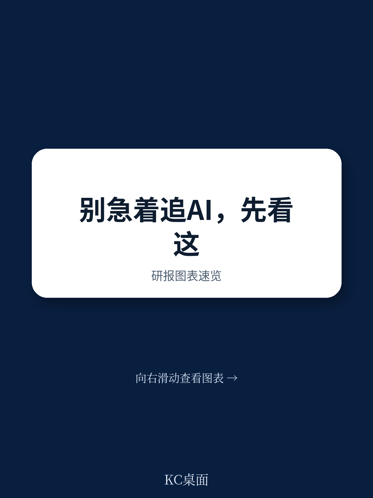
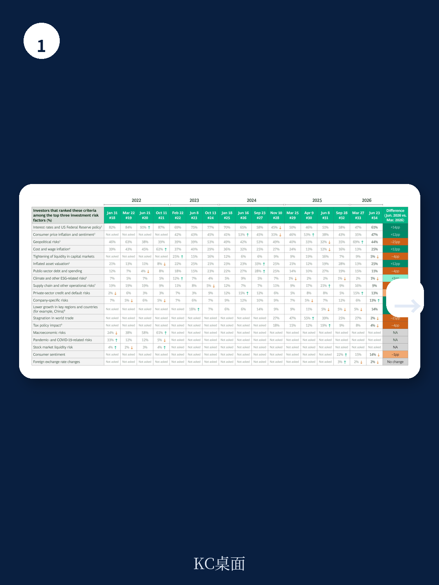
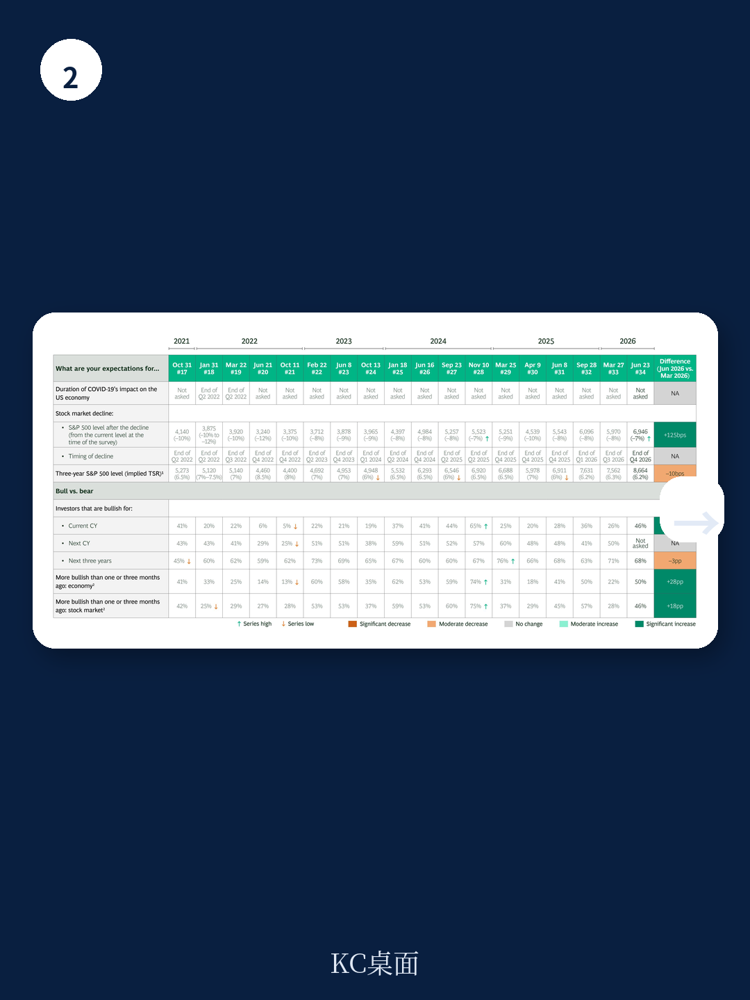

# 波士顿咨询：2026年6月读者情绪与AI预期调查

波士顿咨询在2026年6月22日至23日对其第34次美国读者脉冲调查进行了更新。这份覆盖管理约10万亿美元资产的151位读者的问卷显示，市场情绪在三个月内出现明显修复，但读者对估值和盈利前景的担忧并未消退。调查的核心矛盾在于：读者对AI作为市场驱动因素的预期达到历史高位，同时认为市场对此过于乐观的比例也在上升。

## 1. 读者情绪修复，但对估值和盈利的担忧同步上升

认为2026年剩余时间看涨的读者比例从3月的26%跃升至46%，认为美国将在年底前陷入调整的比例从43%骤降至17%。然而，认为标普500指数被高估的读者比例从62%升至67%，51%的读者预期未来12至24个月内会出现有意义的盈利重置。市场对未来三年平均年化总股东回报率的预期仍停留在6.2%，与3月的6.3%几乎持平。情绪修复与回报预期仍在调整并存，反映出读者认为当前上涨更多由估值驱动而非基本面改善。

> **KC评论：** 46%看涨与6.2%的三年预期回报率之间存在明显落差。这组数据说明，读者对短期方向判断转好，但对长期回报空间并不乐观。报告中的隐含市场低点（标普500约6,946点）意味着从6月22日收盘水平仍有约7%的节奏变化空间，这一数字与历史调查的低点预期一致。

## 2. 利率和通胀取代地缘政治成为首要宏观不确定性

认为利率和通胀是主要宏观不确定性的读者比例分别从3月的47%和35%升至61%和47%，而地缘政治不确定性从69%降至44%。49%的读者预计通胀在2026年底后仍将高于美联储2%的目标，高于9月调查的38%。读者对2026年底平均通胀率的预期为3.6%，对2027至2028年的预期为3.3%。宏观不确定性排序的变化表明，市场关注点正从中东冲突等一次性事件转向美联储政策路径和物价粘性这类持续性变量。

## 3. AI被视作首要市场驱动因素，但读者对过度研究保持警惕

66%的读者将AI列为未来市场最重要的驱动因素，高于3月的54%。但56%的读者认为市场对AI过于乐观，77%的读者预期当前因AI推高的估值水平将在未来对总股东回报构成不确定性，这一比例较3月的63%上升了14个百分点。78%的读者正在主动分析所投公司的AI战略，较3月的72%进一步上升。认为公司对AI研究过度的读者是认为研究不足的三倍（45%对15%）。读者对AI的预期集中在效率提升和先发优势上，只有25%的读者认为AI能为赢家创造持久的竞争优势。

> **KC评论：** 报告中的一个关键区分在于，读者对AI的评估排除了纯AI技术公司。这意味着调查反映的是传统行业和非AI科技公司的AI叙事可信度问题。当80%的读者预期AI将在两年内体现在营收或利润增长中，而同时多数人认为市场定价已过度反映时，管理层的AI沟通策略面临一个微妙平衡：既不能显得落后，又不能被视作为迎合市场而过度承诺。

## 4. 资本配置纪律成为读者对管理层的核心要求

读者对公司的资本配置偏好呈现出明确的纪律性。69%的读者回避杠杆率超过三倍的公司，79%的读者期望公司维持稳定的股息支付。在增长与短期盈利之间，58%的读者要求公司同时实现长期增长和短期每股收益指引，这一比例高于3月的52%。33%的读者将资本回报率作为关键研究标准。79%的读者认为公司应考虑剥离业务，78%支持聚焦型补强收购。这些数据指向一个清晰的观察框架：读者希望管理层在增长研究和财务纪律之间保持平衡，而非单边押注。
