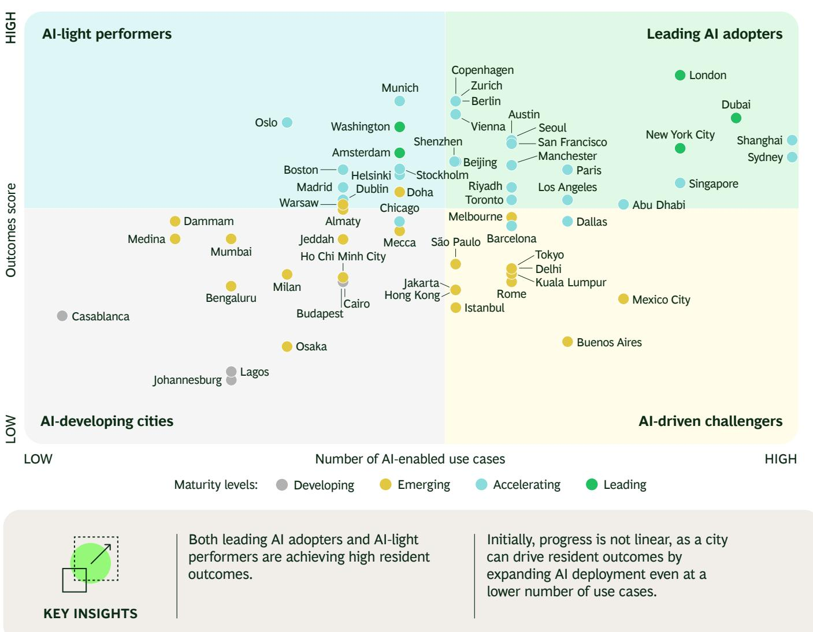
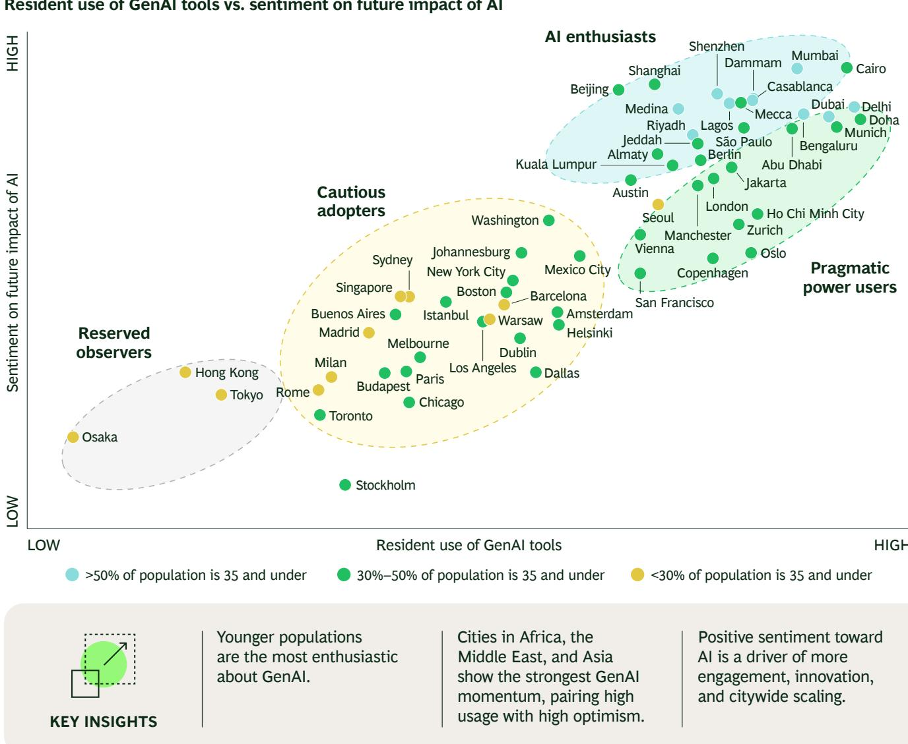
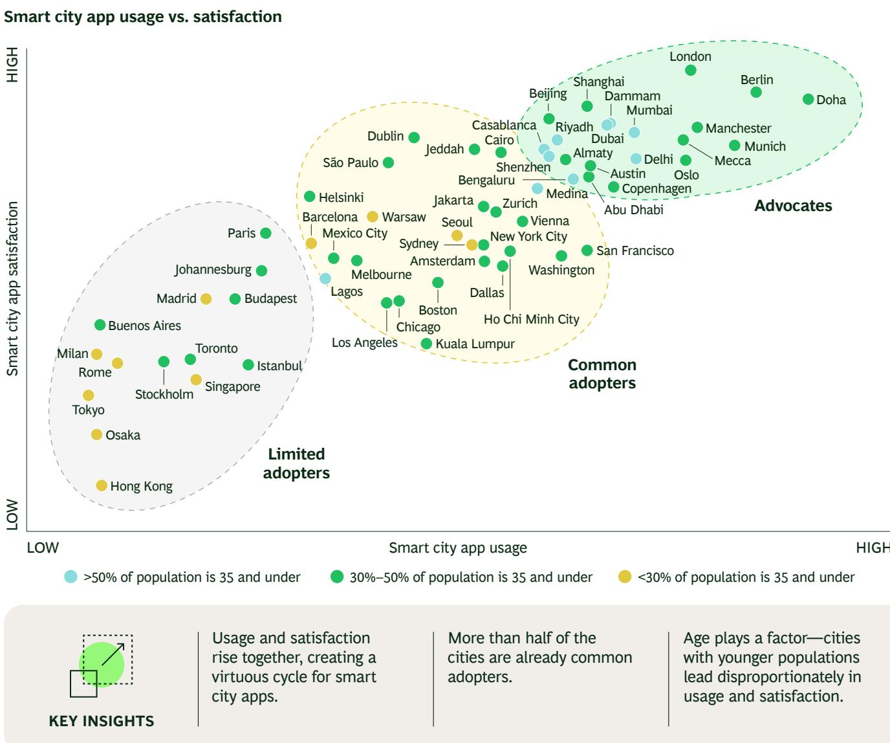
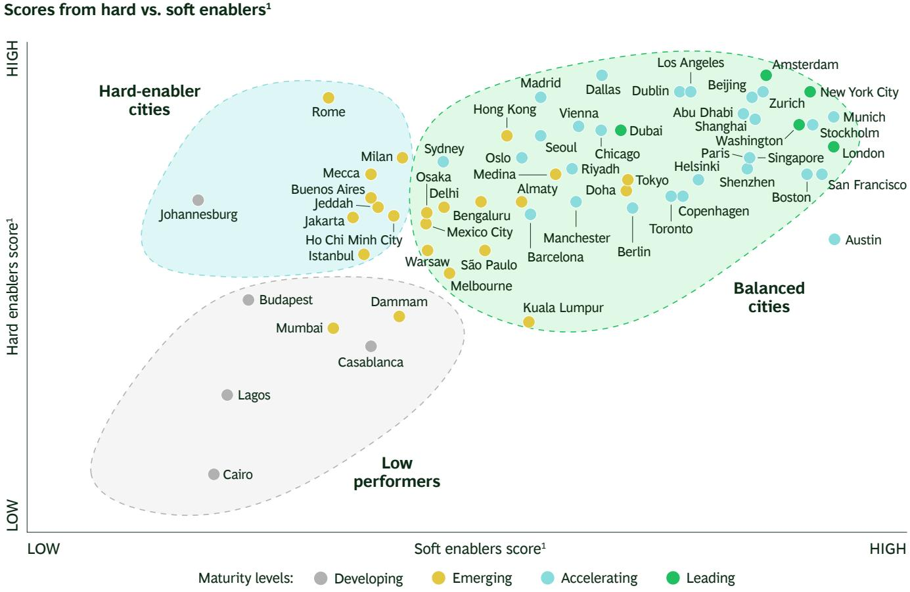
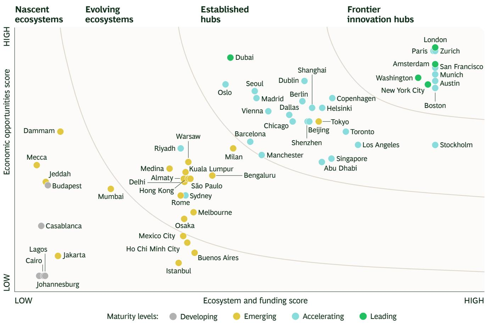
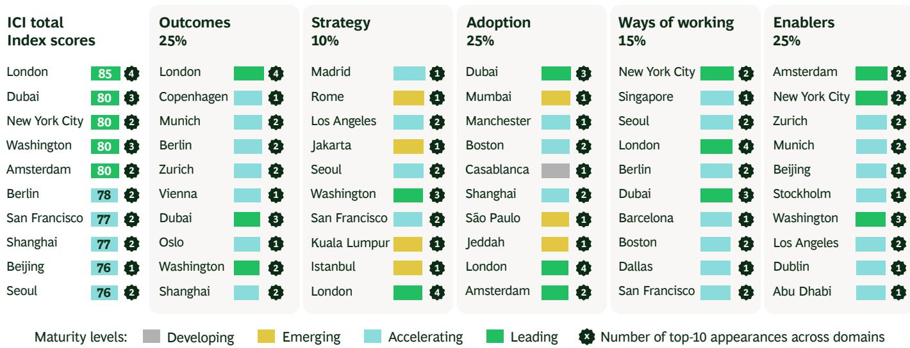
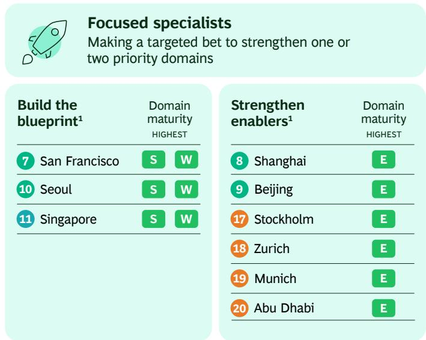
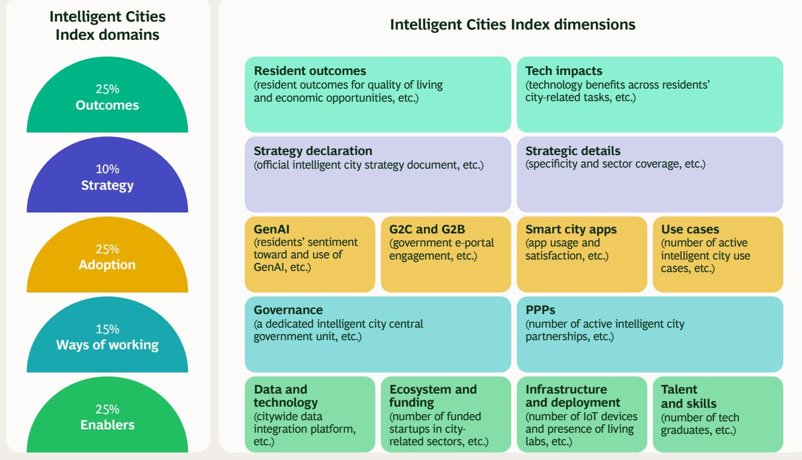
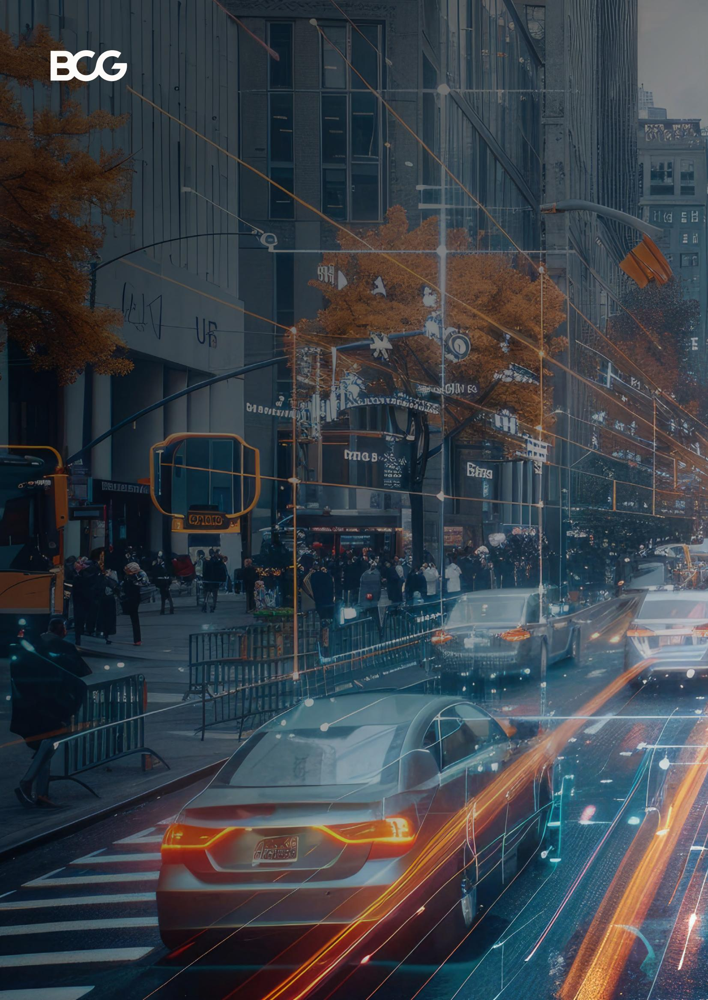

# BCG's Intelligent Cities Index 2026

How AI Shapes Urban Living

By Akram Awad, Rami Mourtada, Cecilia Bousoño, Suresh Subudhi, Vladislav Boutenko, Ramsey Baker, and Ekaterina Shapochka

Cities around the world are deploying AI and digital technology to deliver new levels of service to residents. Yet as these technologies evolve continuously, even the world's most advanced cities must also evolve to provide ever-greater services, meet growing expectations, and help drive resident outcomes and economic opportunities.

BCG's inaugural Intelligent Cities Index (ICI) assesses how 61 of the world's biggest cities use technology to serve their residents and businesses. It offers a perspective on intelligent city maturity that is tech-focused, enabler-driven, and outcomes-oriented. We analyze maturity across five domains: outcomes, strategy, adoption, ways of working, and enablers. A city's overall maturity level reflects its combined domain maturity: leading, accelerating, emerging, or developing. (See “About the Intelligent Cities Index.”)

The five leading cities are London, Dubai, New York City, Washington, and Amsterdam. All five show leading maturity across two or more of the five domains. However, no one city leads every domain; even cities at the cutting edge of technology implementation have areas to strengthen. (See Exhibit 1.)

The Index also offers lessons from global pioneers like London, which tops the Index overall. The growth of intelligent city capability draws on the contributions of a diverse cast of participants, from city government leaders to private sector partners and ultimately residents themselves. A city's success requires a balanced approach to key enabling factors, especially digital technology and AI, across domains. The good news is that there are multiple pathways to success.

The Intelligent Cities Index Leaderboard

<table><tr><td colspan="2"></td><td>City</td><td>Total score</td><td>Outcomes</td><td>Strategy</td><td>Adoption</td><td>Ways of working</td><td>Enablers</td></tr><tr><td rowspan="5">Leading</td><td>1</td><td>London</td><td>85</td><td>●</td><td>●</td><td>●</td><td>●</td><td>●</td></tr><tr><td>2</td><td>Dubai</td><td>80</td><td>●</td><td>●</td><td>●</td><td>●</td><td>●</td></tr><tr><td>3</td><td>New York City</td><td>80</td><td>●</td><td>●</td><td>●</td><td>●</td><td>●</td></tr><tr><td>4</td><td>Washington</td><td>80</td><td>●</td><td>●</td><td>●</td><td>●</td><td>●</td></tr><tr><td>5</td><td>Amsterdam</td><td>80</td><td>●</td><td>●</td><td>●</td><td>●</td><td>●</td></tr><tr><td rowspan="28">Accelerating</td><td>6</td><td>Berlin</td><td>78</td><td>●</td><td>●</td><td>●</td><td>●</td><td>●</td></tr><tr><td>7</td><td>San Francisco</td><td>77</td><td>●</td><td>●</td><td>●</td><td>●</td><td>●</td></tr><tr><td>8</td><td>Shanghai</td><td>77</td><td>●</td><td>●</td><td>●</td><td>●</td><td>●</td></tr><tr><td>9</td><td>Beijing</td><td>76</td><td>●</td><td>●</td><td>●</td><td>●</td><td>●</td></tr><tr><td>10</td><td>Seoul</td><td>76</td><td>●</td><td>●</td><td>●</td><td>●</td><td>●</td></tr><tr><td>11</td><td>Singapore</td><td>76</td><td>●</td><td>●</td><td>●</td><td>●</td><td>●</td></tr><tr><td>12</td><td>Vienna</td><td>75</td><td>●</td><td>●</td><td>●</td><td>●</td><td>●</td></tr><tr><td>13</td><td>Copenhagen</td><td>75</td><td>●</td><td>●</td><td>●</td><td>●</td><td>●</td></tr><tr><td>14</td><td>Shenzhen</td><td>75</td><td>●</td><td>●</td><td>●</td><td>●</td><td>●</td></tr><tr><td>15</td><td>Boston</td><td>74</td><td>●</td><td>●</td><td>●</td><td>●</td><td>●</td></tr><tr><td>16</td><td>Los Angeles</td><td>74</td><td>●</td><td>●</td><td>●</td><td>●</td><td>●</td></tr><tr><td>17</td><td>Stockholm</td><td>74</td><td>●</td><td>●</td><td>●</td><td>●</td><td>●</td></tr><tr><td>18</td><td>Zurich</td><td>74</td><td>●</td><td>●</td><td>●</td><td>●</td><td>●</td></tr><tr><td>19</td><td>Munich</td><td>73</td><td>●</td><td>●</td><td>●</td><td>●</td><td>●</td></tr><tr><td>20</td><td>Abu Dhabi</td><td>72</td><td>●</td><td>●</td><td>●</td><td>●</td><td>●</td></tr><tr><td>21</td><td>Oslo</td><td>72</td><td>●</td><td>●</td><td>●</td><td>●</td><td>●</td></tr><tr><td>22</td><td>Austin</td><td>71</td><td>●</td><td>●</td><td>●</td><td>●</td><td>●</td></tr><tr><td>23</td><td>Madrid</td><td>71</td><td>●</td><td>●</td><td>●</td><td>●</td><td>●</td></tr><tr><td>24</td><td>Dallas</td><td>71</td><td>●</td><td>●</td><td>●</td><td>●</td><td>●</td></tr><tr><td>25</td><td>Manchester</td><td>71</td><td>●</td><td>●</td><td>●</td><td>●</td><td>●</td></tr><tr><td>26</td><td>Dublin</td><td>70</td><td>●</td><td>●</td><td>●</td><td>●</td><td>●</td></tr><tr><td>27</td><td>Chicago</td><td>70</td><td>●</td><td>●</td><td>●</td><td>●</td><td>●</td></tr><tr><td>28</td><td>Toronto</td><td>70</td><td>●</td><td>●</td><td>●</td><td>●</td><td>●</td></tr><tr><td>29</td><td>Helsinki</td><td>70</td><td>●</td><td>●</td><td>●</td><td>●</td><td>●</td></tr><tr><td>30</td><td>Sydney</td><td>70</td><td>●</td><td>●</td><td>●</td><td>●</td><td>●</td></tr><tr><td>31</td><td>Paris</td><td>68</td><td>●</td><td>●</td><td>●</td><td>●</td><td>●</td></tr><tr><td>32</td><td>Barcelona</td><td>67</td><td>●</td><td>●</td><td>●</td><td>●</td><td>●</td></tr><tr><td>33</td><td>Riyadh</td><td>67</td><td>●</td><td>●</td><td>●</td><td>●</td><td>●</td></tr><tr><td rowspan="23">Emerging</td><td>34</td><td>Doha</td><td>64</td><td>●</td><td>●</td><td>●</td><td>●</td><td>●</td></tr><tr><td>35</td><td>Tokyo</td><td>63</td><td>●</td><td>●</td><td>●</td><td>●</td><td>●</td></tr><tr><td>36</td><td>Hong Kong</td><td>63</td><td>●</td><td>●</td><td>●</td><td>●</td><td>●</td></tr><tr><td>37</td><td>Medina</td><td>63</td><td>●</td><td>●</td><td>●</td><td>●</td><td>●</td></tr><tr><td>38</td><td>Almaty</td><td>62</td><td>●</td><td>●</td><td>●</td><td>●</td><td>●</td></tr><tr><td>39</td><td>Jakarta</td><td>61</td><td>●</td><td>●</td><td>●</td><td>●</td><td>●</td></tr><tr><td>40</td><td>Rome</td><td>61</td><td>●</td><td>●</td><td>●</td><td>●</td><td>●</td></tr><tr><td>41</td><td>Milan</td><td>61</td><td>●</td><td>●</td><td>●</td><td>●</td><td>●</td></tr><tr><td>42</td><td>Melbourne</td><td>60</td><td>●</td><td>●</td><td>●</td><td>●</td><td>●</td></tr><tr><td>43</td><td>Delhi</td><td>59</td><td>●</td><td>●</td><td>●</td><td>●</td><td>●</td></tr><tr><td>44</td><td>São Paulo</td><td>59</td><td>●</td><td>●</td><td>●</td><td>●</td><td>●</td></tr><tr><td>45</td><td>Jeddah</td><td>59</td><td>●</td><td>●</td><td>●</td><td>●</td><td>●</td></tr><tr><td>46</td><td>Bengaluru</td><td>59</td><td>●</td><td>●</td><td>●</td><td>●</td><td>●</td></tr><tr><td>47</td><td>Warsaw</td><td>58</td><td>●</td><td>●</td><td>●</td><td>●</td><td>●</td></tr><tr><td>48</td><td>Ho Chi Minh City</td><td>58</td><td>●</td><td>●</td><td>●</td><td>●</td><td>●</td></tr><tr><td>49</td><td>Mecca</td><td>58</td><td>●</td><td>●</td><td>●</td><td>●</td><td>●</td></tr><tr><td>50</td><td>Kuala Lumpur</td><td>58</td><td>●</td><td>●</td><td>●</td><td>●</td><td>●</td></tr><tr><td>51</td><td>Mumbai</td><td>57</td><td>●</td><td>●</td><td>●</td><td>●</td><td>●</td></tr><tr><td>52</td><td>Istanbul</td><td>55</td><td>●</td><td>●</td><td>●</td><td>●</td><td>●</td></tr><tr><td>53</td><td>Mexico City</td><td>55</td><td>●</td><td>●</td><td>●</td><td>●</td><td>●</td></tr><tr><td>54</td><td>Dammam</td><td>55</td><td>●</td><td>●</td><td>●</td><td>●</td><td>●</td></tr><tr><td>55</td><td>Buenos Aires</td><td>53</td><td>●</td><td>●</td><td>●</td><td>●</td><td>●</td></tr><tr><td>56</td><td>Osaka</td><td>52</td><td>●</td><td>●</td><td>●</td><td>●</td><td>●</td></tr><tr><td rowspan="5">Developing</td><td>57</td><td>Budapest</td><td>48</td><td>●</td><td>●</td><td>●</td><td>●</td><td>●</td></tr><tr><td>58</td><td>Johannesburg</td><td>47</td><td>●</td><td>●</td><td>●</td><td>●</td><td>●</td></tr><tr><td>59</td><td>Casablanca</td><td>46</td><td>●</td><td>●</td><td>●</td><td>●</td><td>●</td></tr><tr><td>60</td><td>Cairo</td><td>43</td><td>●</td><td>●</td><td>●</td><td>●</td><td>●</td></tr><tr><td>61</td><td>Lagos</td><td>34</td><td>●</td><td>●</td><td>●</td><td>●</td><td>●</td></tr></table>

Source: BCG's Intelligent Cities Index 2026.  
Note: APAC = Asia-Pacific; MEA = Middle East and North Africa.

## AI Is a Key Foundation of the Intelligent City

A striking pattern stands out: cities that are embedding AI into core services are delivering faster, better resident outcomes.

As shown in Exhibit 2, leading cities in AI adoption—about one-third—are delivering higher numbers of use cases and a high quality of life. These cities are making AI an integral part of public services and daily city operations. Yet the positioning of AI-driven challengers and AI-light performers suggests that progress is not linear; a city can drive resident outcomes by expanding AI deployment even if it starts with a lower number of use cases.

The message is important, especially for AI-light performers and AI-developing cities. The advancement and expansion of AI use cases can deliver better quality of life, and deployment of AI into more use cases overall is a necessary action—not the only action, but a vital one—for cities that seek to boost their overall intelligent city maturity.

## EXHIBIT 2

## When Deployed in High Numbers, AI Use Cases Lift Resident Outcomes

AI-enabled use cases score vs. outcomes score

Initially, progress is not linear, as a city can drive resident outcomes by expanding AI deployment even at a lower number of use cases.

Source: BCG's Intelligent Cities Index 2026. Note: Quadrants are centered to average scores.

# AI Adoption, User Optimism, and the Virtuous Circle of AI Value

Positive sentiment toward AI provides a key element—confidence in the technology's future place in the world—that can shape how the intelligent city evolves.

Our research found a powerful link between how frequently residents use GenAI tools and how positively they view AI's role in their future. As shown in Exhibit 3, residents who have the highest use—AI enthusiasts—also have the highest sentiment. Pragmatic power users are engaging AI more opportunistically but still show a higher level of sentiment than residents who are cautious about their use of the technology.

Such widespread adoption signals a turning point. Citizens are beginning to see AI as a practical technology that can elevate opportunity, productivity, and quality of life. Several geographies especially share this outlook, with cities throughout Africa, Asia, and the Middle East reporting strong enthusiasm and adoption.

A virtuous circle forms in a setting where residents feel strongly about what AI means for their well-being. When residents feel good about how AI is serving them, city leaders have an opening to enable AI more fully and provide more value to beneficiaries. This value feeds more optimism, which is a driver of more engagement, innovation, scaling, and on and on.

## EXHIBIT 3

## GenAI Users Are Optimistic About the Technology

  
Source: BCG's Intelligent Cities Index 2026.

Cities in Africa, the Middle East, and Asia show the strongest GenAI momentum, pairing high usage with high optimism.

Positive sentiment toward AI is a driver of more engagement, innovation, and citywide scaling.

Intelligent city app usage drives satisfaction. Cities whose residents use smart city apps more frequently also tend to score higher on satisfaction. This includes London and Dubai, leaders in the Index and high scorers in app user satisfaction. Resident satisfaction with smart city apps is quite low in cities where the frequency of usage is lower than average.

Our study finds that use and satisfaction tend to be higher in younger cities. Several cities where more than half of the population is under age 35 fall in the standout cohort. (See Exhibit 4.)

Improving app performance will likely have a positive impact on satisfaction and open the door for more deployment and better outcomes. The same cycle of engagement and optimism that drives AI usage can also drive smart city app scaling.

## EXHIBIT 4

## Smart City App Usage and Satisfaction Are Aligned

Source: BCG's Intelligent Cities Index 2026.

## A balance of hard and soft enablers drives a city

forward. The most mature cities in the Index are supported by an assortment of well-developed enablers. (See Exhibit 5.) These cities employ both hard enablers such as data, tech, and infrastructure and soft enablers like talent and funding. In all, 37 cities have found this balance, including Dublin.

Outside this set of balanced players, several other cities excel in hard enablers. For example, Sydney is strong in infrastructure and living labs. The Australian city enjoys accelerating maturity in part because of its focus on these elements.

A story forms: a city can build a strong infrastructure foundation without robust supplies of talent or funding. But technology isn't enough if a city wants to reach the highest levels of maturity.

To do so, a city needs to build up its talent development and funding ecosystems, including venture capital and foreign direct investment, to match the quality of its hard enablers. This is no small task; a city will need to focus money and resources on strengthening funding and talent streams, but the equal focus will likely pay off down the road. Balance is key.

## EXHIBIT 5

## Top Intelligent Cities Excel at Balancing Hard and Soft Enablers

Scores from hard vs. soft enablers $^{1}$

A city can first build stronger hard enablers (e.g., infrastructure) with limited soft enablers (e.g., talent or funding), but a mix of both hard and soft enablers is most impactful.

Funding, talent, and ecosystems can be harder to build than infrastructure—as no city outperforms on soft enablers alone.

Source: BCG's Intelligent Cities Index 2026. $^{1}$ Hard enablers include data and technology, infrastructure, and AI deployment. Soft enablers include ecosystem and funding and talent and skills.

Entrepreneurship and innovation ecosystems create economic opportunities for leading cities. Among the cities in the Index that lead in overall maturity, there's a solid link between the strength of entrepreneurship and innovation ecosystems and overall economic opportunities. Startups are important actors in the push to innovate with technology and deploy new AI and smart city apps. With sufficient capital, these businesses keep developing more powerful, faster, and more satisfying solutions that drive economic growth.

Exhibit 6 shows that four of the Index's top cities score highest in both economic opportunities and ecosystem and funding assessments.

It’s harder to find clear patterns among less mature cities. Weaker ecosystems do not guarantee poorer economic outcomes but instead show highly uneven performance. However, the performance of leading cities suggests that the focus of these locations on entrepreneurship and innovation has been key to their fulfillment of resident expectations.

## EXHIBIT 6

Smart City Funding and Startup Ecosystems Drive Economic Activity  

Source: BCG's Intelligent Cities Index 2026.

Cities with stronger overall enablers convert ecosystem strength into economic opportunity more effectively, emerging as standout innovation transformers.

# Where Each City Leads: A Domain-Level Analysis

As Exhibit 7 illustrates, leaders in each domain make up a broad group of cities with varying overall maturity levels. Their progress suggests that public sector and corporate decision makers have options in their approach, and they can develop many different areas to make an intelligent city stronger.

## EXHIBIT 7

## Leaders in Outcomes and Other Domains

  
Source: BCG's Intelligent Cities Index 2026.

Outcomes. Our analysis factors in outcomes. The top ten leaders in this domain are using technology to deliver results in livability, economic opportunities, social capital, and engagement with government.

There's more. Some of the most mature intelligent cities in the study are leaders in this domain. The implication: improving intelligent city maturity levels translates into a better city experience for residents.

London is the Index's leader in this area. The UK capital scored highest in resident outcomes related to quality of life and delivery of economic opportunities. The city's success here also helps it land as the Index's top city overall—more proof that maturity and outcomes are clearly linked.

Strategy. The Index assesses the depth and quality of each locale's intelligent cities strategy. This includes documentation of the strategy and any updates to keep pace with technology evolution and changing priorities. We also analyzed the number of smart city sectors covered by a city's strategy. Madrid tops this domain with a good balance of sector coverage and specificity in its strategy.

The clearer and more specific the strategic priorities, the more success a city will have in creating a sharper long-term direction for its intelligent technology maturity. With this future direction defined, government leaders and business partners can then steadily focus investment on the use cases that will deliver the greatest resident impact.

Adoption. The Index assessed adoption of smart city apps and AI technologies, which include business-oriented and resident-oriented e-government portals or digital platforms and apps. We also surveyed resident satisfaction with these technologies.

Adoption showed the highest overall scores of any domain in the Index. From our five leading cities to a city like Lagos, adoption is moving forward. It’s encouraging that cities can boost resident optimism with AI and apps even without strong infrastructure or funding; it goes a long way in building the momentum that can eventually bring a city to higher levels of maturity. However, while adoption is broadly achieved, it is often capped; many cities can push intelligent city or AI use cases only so far. At times, scaling falls short without enablers and ways of working in place. It’s vital to make the most of adoption while ramping up other areas.

The second highest city in the Index, Dubai, is joined as a leader in adoption by a notably diverse list of cities, including Mumbai, Manchester, and Boston. Interestingly, each rolls out more smart city use cases than most cities in the study. For Dubai, adoption is a key factor in its balanced approach to intelligent city implementation, which lands it in the highest overall maturity cohort.

Ways of Working. The Index analyzed each city's implementation of governance, specifically institutional AI readiness.

Cities with stronger government readiness for AI tend to deploy more AI-enabled use cases. Yet the level of readiness alone does not directly determine results, whether good or bad. Some high-readiness cities still move slower in turning capability into action, while several cities with modest readiness manage to drive meaningful deployment.

We also captured the number of public-private partnerships linked to each location's intelligent city efforts.

Berlin lands in the leading group in this domain. The managing business development agency set up a dedicated unit to oversee smart city initiatives, which are strengthened by several partnerships between the corporate and public sectors.

# Every city has a different starting point, with pioneers showing several pathways to success.

Enablers. One of the study's recurring takeaways is that there are many elements that make intelligent city maturity grow and flourish. Our analysis considered technology and related factors, such as open data access or elements of infrastructure like the number of IoT endpoints or internet speed. But the intelligent city doesn't thrive on technology alone. Leaders can find advantage by looking at both soft enablers as well as hard, because technology innovation doesn't happen without money, and technology isn't engaged responsibly without people. When funding flows from venture capital and manifests in startups working on innovative smart city apps and AI, a city comes closest to the balance of enablers that the most mature cities in our study sustain.

One of the top cities in the Index, Amsterdam leads this domain with a robust community of startups for a city of under a million residents; many larger cities count far fewer startups. Another key strength: the city reached the highest score in the existence of living labs; in other words, the city has advanced real-world testing and co-creation of new technologies with users and stakeholders, often through designated testbeds or districts, at a level that exceeds many other cities. A solid flow of venture capital supports the city's technology initiatives, proving that funding and innovation—soft enablers—are fuel for maturity.

  
Consistently accelerating across strategy, ways of working, adoption, and enablers

## Choose the Right Pathway to Success

Cities throughout the world can follow the example of the Index's leading performers, which do several things well.

These leaders build momentum across both hard and soft enablers to power their intelligent city technologies long-term. They have achieved strong ecosystem and funding maturity, with vibrant innovation ecosystems and plenty of available capital. They also advance intelligent city use cases at scale, and they've made AI a foundation by integrating the technology into core city operations.

However, every city has a different starting point. Several pathways forward are available, with strong outcomes and maturity stemming from either balanced strength across domains or targeted excellence in specific areas. (See Exhibit 8.)

Balanced Builders. Cities can boost maturity by choosing to balance their strengths.

\- Cities that are balanced to lead the Index reach accelerating scores across the board and achieve leading maturity with high scores on two or more domains.

\- Cities that are balanced to break into higher cohorts reach at least accelerating maturity in all capability domains with similar above-average scores.

Focused Specialists. Some cities appear in the Index's higher ranks by doubling down on one or two priority domains, often focusing on their strategy, ways of working, or strengthening enablers.

\- Build the blueprint: Cities are pushing capabilities in strategy and ways of working by building high-quality strategy, strong governance, and multiple public-private partnerships.

\- Strengthen enablers: Some cities have focused heavily on strengthening ecosystems and funding; data and tech; infrastructure and deployment; and talent and skills.

## EXHIBIT 8

## More Than One Path to Intelligent Cities' Success

## Balanced builders

<table><tr><td rowspan="2" colspan="2">Balance to lead</td><td colspan="2">Domain maturity</td></tr><tr><td>LOWEST</td><td>HIGHEST</td></tr><tr><td>[24YK]</td><td>London</td><td>A</td><td>[25GDK]</td></tr><tr><td>[146DT]</td><td>Dubai</td><td>S</td><td>W</td></tr><tr><td>[50X53]</td><td>New York City</td><td>S</td><td>W</td></tr><tr><td>[16AKC]</td><td>Washington</td><td>A</td><td></td></tr><tr><td></td><td>Amsterdam</td><td>A</td><td>E</td></tr></table>

Focused specialists

<table><tr><td rowspan="2" colspan="2">Balance to break in1</td><td colspan="2">Domain maturity</td></tr><tr><td>LOWEST</td><td>HIGHEST</td></tr><tr><td>[322X]</td><td>Vienna</td><td>W</td><td>S</td></tr><tr><td>[66WS]</td><td>Copenhagen</td><td>W</td><td>S</td></tr><tr><td>[DWBS]</td><td>Shenzhen</td><td>A</td><td>W</td></tr></table>

Making a targeted bet to strengthen one or two priority domains

Build the blueprint $^{1}$

Domain maturity
HIGHEST

San Francisco

Strengthen enablers $^{1}$

Seoul

Singapore

8 Shanghai

Beijing

Stockholm

Domain maturity
HIGHEST

Zurich

E

Munich

E

Abu Dhabi

E

Underpinned by healthy adoption levels $^{2}$

ICI rank:

Top 5

Top 10

Top 15

Top 20

ICI domain maturity:

Accelerating

Leading

A = Adoption    E = Enablers    S = Strategy    W = Ways of working

Source: BCG's Intelligent Cities Index 2026.

$^{1}$ Twelve of the top 15 accelerating cities are on a path to success. $^{2}$ Sixteen of the top 20 cities are at, or above, average scores in adoption.

# Building the city's intelligent foundation requires a strategic roadmap that sequences and scales efforts collaboratively.

A roadmap lays out the important steps toward stronger outcomes, no matter if a city is leading or lower in maturity.

\- Clarify long-term strategic priorities. Strategy should focus investment on the AI and digital technology uses that deliver the greatest resident impact. It is key to know where residents engage their government and economy—these are the areas to deploy smart city apps and AI technology.

\- Improve ways of working by tightening governance, empowering accountable owners, and mobilizing partnerships that accelerate real delivery. Public sector leaders and private sector counterparts can foster all sorts of collaboration, from R&D to skill training.

\- Scale adoption by expanding proven apps and AI solutions, strengthening digital service quality, and encouraging deeper resident and business engagement.

\- Build enablers by upgrading data and technology platforms, enhancing infrastructure, and developing the talent and ecosystem needed to sustain progress. Again, partnerships are valuable here. The high-maturity city is a place of ongoing collaboration between government, business, education, and the populace.

## Conclusion

Create momentum, move forward with urgency—these are crucial decisions for intelligent city stakeholders.

Building the city's foundation with AI and digital technology is a long-term process. City leaders and business partners don't need to try to do everything at once. Instead, they can plan ahead and look for incremental impact wherever residents' needs are most apparent, technology gets frequent usage, and adoption and optimism fuel momentum.

To succeed, leaders will need to gain a clear view of next steps through intelligent city assessment and explore where current capabilities lie and what priority outcomes are best to target. Focusing on the needs and contributions of city stakeholders is key. This includes understanding the needs of residents when prioritizing impact; the needs of government and business leaders when defining ambition and pathway; the needs of cross-city administration when enhancing ways of working; and the needs of the broader city ecosystem when deploying intelligent city enablers.

Every day, residents and businesses adopt AI and digital technology. There is no single path forward—some cities accelerate by focusing on a few critical areas while others strive for a balance of strength across key domains—but momentum comes from making intentional choices now and building for tomorrow.

# About the Intelligent Cities Index

The Intelligent Cities Index was developed through a rigorous five-step methodology designed to ensure robustness and comparability. We began by shortlisting 61 cities across 39 countries based on GDP and intelligent city relevance. We then defined five domains comprising 14 dimensions. Next, we identified a set of 35 indicators across the five domains, combining quantitative and qualitative measures to capture both capability and impact. (See the exhibit.)

To ensure comparability, we normalized six core indicators—two benchmark-based and four based on the 75th percentile—and assigned weights to reflect their relative importance. Finally, we consolidated results into four maturity levels (leading, accelerating, emerging, and developing), translating detailed scores into a clear, comparable view of overall city maturity.

## Intelligent Cities Index Methodology

## Intelligent Cities Index domains

Strategy declaration
(official intelligent city strategy document, etc.)

15%
Ways of working

25% Enablers

Resident outcomes (resident outcomes for quality of living and economic opportunities, etc.)

## Intelligent Cities Index dimensions

GenAI (residents' sentiment toward and use of GenAI, etc.)

Governance
(a dedicated intelligent city central government unit, etc.)

G2C and G2B (government e-portal engagement, etc.)

Data and technology (citywide data integration platform, etc.)

Tech impacts
(technology benefits across residents' city-related tasks, etc.)

## Ecosystem and funding

Strategic details
(specificity and sector coverage, etc.)

(number of funded startups in city-related sectors, etc.)

Smart city apps (app usage and satisfaction, etc.)

Use cases (number of active intelligent city use cases, etc.)

PPPs
(number of active intelligent city partnerships, etc.)

## Infrastructure and deployment

and deployment (number of IoT devices and presence of living labs, etc.)

Talent and skills (number of tech graduates, etc.)

Source: BCG's Intelligent Cities Index 2026.
Note: G2C = government to citizen; G2B = government to business; PPPs = public-private partnerships; IoT = Internet of Things.

# About the Authors

  
Akram Awad
awad.akram@bcg.com

Akram is a managing director and partner in the Dubai office of Boston Consulting Group. He is a core member of BCG's Public Sector and Technology Advantage practices and has advised public sector leaders in the Middle East on the value of unlocking national data through AI.

## Cecilia Bousoño bousono.cecilia@bcg.com

Cecilia is a senior analyst, BCG Vantage, in BCG's Madrid office. She partners with travel, engineering, real estate, logistics, and city clients globally to improve their AI, data, and digital transformations by leveraging the power of technology, sustainability, and innovation.

## Vladislav Boutenko boutenko.vladislav@bcg.com

Vladislav is a managing director and senior partner with BCG, where he leads BCG's work with cities globally. He has also directed cities research with the BCG Institute since 2019. His forthcoming book, The Way We Live Next, is due from Harper Business in Spring 2027.

## Ekaterina Shapochka shapochka.ekaterina@bcg.com

Ekaterina is a partner and associate director, Cities & Regions, in BCG's Riyadh office. She is an expert in regional policy, urban development, quality of life, and smart cities whose work spans projects in Europe, Asia, and the Middle East.

## Acknowledgments

The authors express their sincere gratitude for the extensive support of Mariana Chaverri, Eva González, Shravani Joshi, Maxim Khakhin, Margot Li, Poorti Sathe, and Lynn Zhuo from the BCG consulting and Vantage teams. They also acknowledge contributions from Faisal Alsaedi, Nishan Banerjee,

  
Rami Mourtada
mourtada.rami@bcg.com

Rami is a partner and director in BCG's Technology & Digital Advantage practice in the firm's Dubai office. He is a core member of BCG's Global Center for the Future of Cities and Center for Digital Government. Rami's work spans AI and smart city topics across private and public sectors.

## Suresh Subudhi subudhi.suresh@bcg.com

Suresh is a managing director and senior partner in BCG's Dubai office. He is the global leader for the firm's Travel, Cities & Infrastructure practice. Suresh also co-leads BCG's Global Center for the Future of Cities and Center for Mobility Innovation.

Ramsey Baker
baker.ramsey@bcg.com

Ramsey is a managing director and partner in BCG's Atlanta office. An expert in travel and tourism, he is the global lead for the firm's work at the intersection of the Technology & Digital Advantage and Travel, Cities & Infrastructure practices.

Shubhika Bilgrami, Madawi Binghannam, Evan Bruning, Vanshika Gupta, Janit Pagaria, Lara Schober, Marcel Sieg, and Nadya Smakhtina. Their insights, feedback, and dedication were invaluable to this report.

## BCG

## About Boston Consulting Group

Boston Consulting Group bridges the gap between ambition and outcomes for the world's leading companies and organizations. We are built for this era of unprecedented change—bringing strategic clarity rooted in over 60 years of deep domain knowledge, combined with applied AI shaped by our practitioners. BCG works shoulder-to-shoulder with CEOs across industries and geographies to deliver transformative impact at scale: stronger returns, transferred capabilities, and change that sticks. For more information, visit bcg.com.

For information or permission to reprint, please contact BCG at permissions@bcg.com. To find the latest BCG content and register to receive e-alerts on this topic or others, please visit bcg.com. Follow Boston Consulting Group on LinkedIn, Instagram, Facebook, and X.

