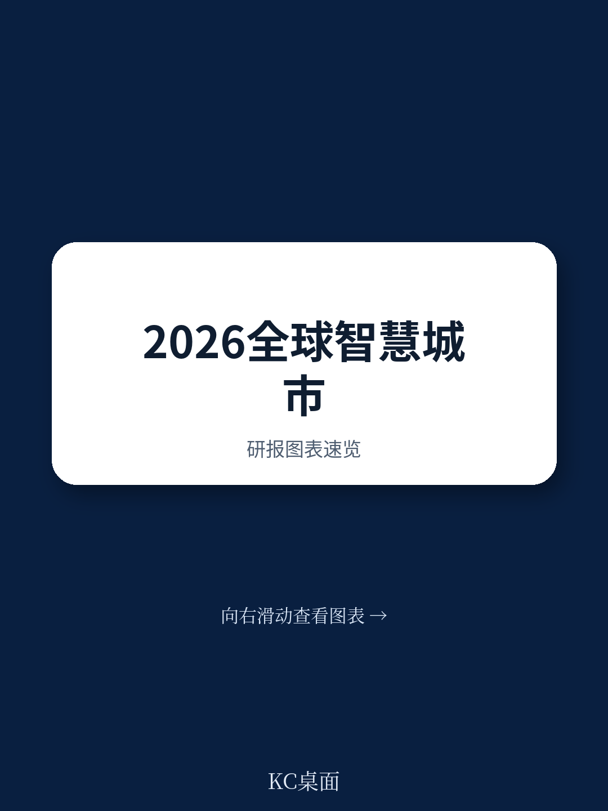
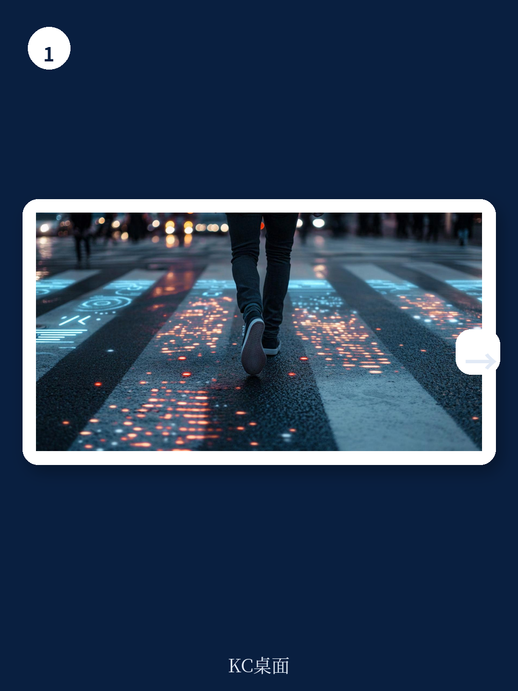
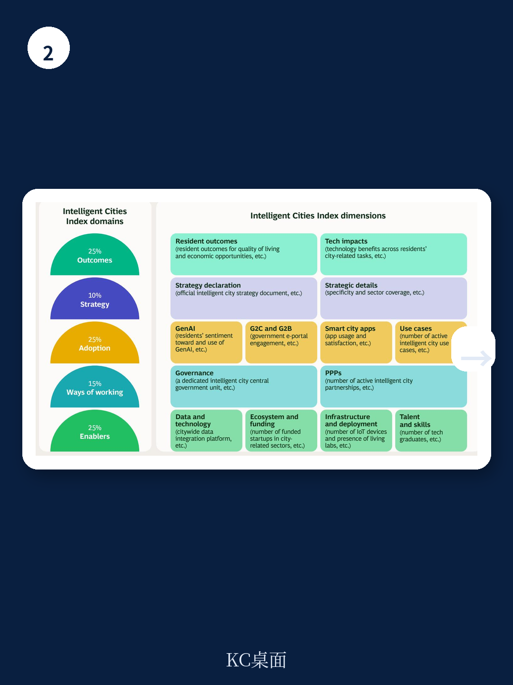

# 波士顿咨询：2026年智能城市指数-61城AI部署与居民满意度

全球61座主要城市正在将人工智能嵌入公共服务，但进展并不均衡。波士顿咨询首次发布的智能城市指数（ICI）提供了一个观察框架：哪些城市真正用技术提升了居民体验，哪些城市仍停留在基础设施层面。

伦敦以85分位居榜首，迪拜、纽约、华盛顿和阿姆斯特丹并列80分，构成第一梯队。但报告揭示了一个关键事实：没有一座城市在所有维度上领先。即使是技术最前沿的城市，也有明显的短板。

## 1. AI用例数量与居民生活质量呈现正相关

报告将城市按AI部署密度分为四类。约三分之一的领先城市同时拥有高数量AI用例和高生活质量评分。但进展并非线性——部分城市在AI用例数量较低时，也能通过精准部署提升居民体验。

这意味着，对于AI部署尚处早期的城市，扩大用例数量是必要动作，但并非唯一路径。关键在于选择哪些场景优先落地。

> **KC评论：** 波士顿咨询的象限图显示，AI驱动型城市与AI轻度城市之间存在一个“非线性跃升区间”。城市管理者不应被低用例数量吓退，而是应聚焦于高影响场景的深度部署。

## 2. 居民对生成式AI的乐观情绪形成正向循环

报告调查了居民对生成式AI的使用频率和态度。高频使用者（AI爱好者）对AI的未来角色最为乐观；务实型用户虽使用更随机，但乐观度仍高于谨慎型用户。

非洲、亚洲和中东城市展现出最强的生成式AI势头——高使用率伴随高乐观度。这种情绪形成正向循环：居民对AI服务满意，城市管理者获得更大空间去扩展AI部署，进而提供更多价值，进一步强化居民信心。

智能城市应用的使用频率与满意度高度一致。伦敦和迪拜在应用用户满意度上得分最高。年轻城市（35岁以下人口占比过半）的使用率和满意度普遍更高。

## 3. 硬性使能因素与软性使能因素需要平衡

报告将城市使能因素分为两类：硬性因素包括数据、技术和基础设施；软性因素包括人才和资金。37座城市找到了平衡点，包括都柏林。

悉尼在基础设施和实景实验室方面表现突出，但软性因素相对薄弱。报告指出：城市可以先建立强大的硬性基础设施，但若缺乏人才和资金生态，很难达到最高成熟度。

创业和创新生态系统与宏观环境机会之间存在明确关联。指数中领先的城市，其创业生态和资金评估得分与宏观环境机会得分高度重合。初创企业是推动新技术部署的关键力量。

## 4. 不同城市可以选择不同的领先路径

报告分析了各维度领先者。伦敦在居民成果维度（生活质量、宏观环境机会）排名第一，这直接支撑了其整体榜首位置。马德里在战略维度领先，因其战略文件覆盖了足够多的智慧城市领域且具备具体性。

采用维度是全部五个维度中得分最高的——从伦敦到拉各斯，采用都在推进。但报告也指出：采用往往存在上限，如果没有使能因素和工作方式的配合，规模化就会受限。

> **KC评论：** 波士顿咨询的评估框架本身就是一个可复用的诊断工具。城市管理者可以对照五个维度（成果、战略、采用、工作方式、使能因素）找出自身短板，而不是盲目复制其他城市的做法。

这份报告的核心启示在于：智能城市建设没有单一模板。伦敦的成功来自成果导向，迪拜的优势在采用和生态，纽约和华盛顿在使能因素上均衡发展。关键在于找到自己的起点和优先顺序。

For informational purposes only. Portions may be generated,translated,summarized,or edited with AI assistance based on source materials and may contain omissions or errors. Please verify independently. This is not investment,legal,tax,accounting,or other professional advice.

