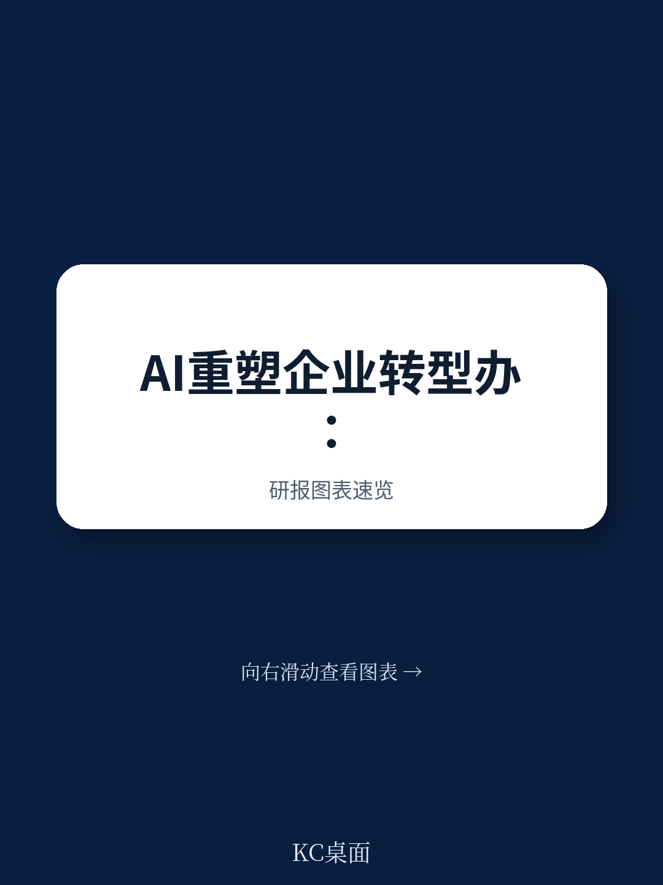
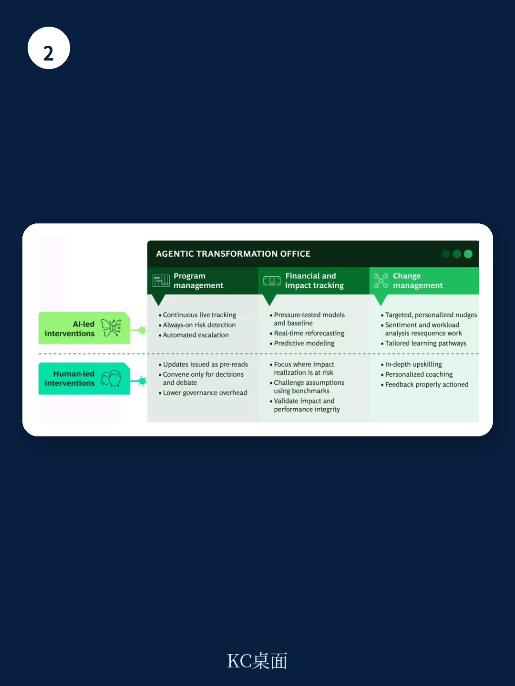

# 波士顿咨询：AI技术与行业应用观察

企业转型办公室长期面临资源紧张、协调繁重、响应迟缓的困境。波士顿咨询在2026年7月发布的一份报告中提出，随着AI从生产力工具演变为能够协调工作的代理引擎，转型办公室的架构正在迎来根本性重构。报告认为，到2030年，由AI代理驱动的转型办公室将在项目管理、财务追踪和变革管理三个核心领域实现从人工监控到智能协同的转变，而这一转变的关键不在于替代人类，而在于强化业务部门的自主决策能力。

## 1. 项目管理从被动追踪转向实时预警与自动协调

传统转型办公室中，团队大量时间用于追踪进度、催促更新、汇编报告和手动识别不确定性。波士顿咨询报告指出，AI代理将改变这一模式：系统能够持续监测不确定性、依赖关系和决策节点，自动生成提醒并推动工作流负责人采取行动。更新、跟进和后续事项将被自动发送，大幅减少转型团队在常规协调上的投入。这意味着大量事务性问题可以在会议前得到解决，团队得以将会议时间聚焦于真正需要讨论的关键议题。

> **KC评论：** 报告隐含的判断是，转型办公室的瓶颈往往不在决策质量，而在信息传递的延迟和协调成本。AI代理解决的不是“做什么”，而是“谁该做什么、什么时候做”的执行效率问题。

## 2. 财务与影响追踪从定期验证转向动态预测

报告认为，AI的预测建模能力将使转型的价值追踪从周期性审核变为持续透明的过程。系统可以基于现有转型组合的数据模式、与企业资源计划和核心财务系统的深度整合，以及外部基准趋势，提前识别价值实现中的潜在缺口。这种动态预测让高管层能够实时了解转型进展，明确哪些环节最需要业务关注。同时，财务部门仍将在影响验证和损益表一致性方面发挥关键作用。报告特别提到，当数据和洞察使转型变得更加可预测时，企业也能更好地向读者说明价值创造的逻辑。

## 3. 变革管理从通用干预转向精准触达与个性化支持

波士顿咨询描绘的2030年转型办公室中，变革管理将不再依赖宽泛的通用方案。AI将利用实时情绪分析和针对性提醒来提升采纳率并推动行为改变。转型团队可以更深入地识别哪些团队负荷过重、哪里出现疲劳迹象、哪些环节的节奏需要调整以保护变革势头。系统还能开发和推送与角色紧密相关的技能提升内容以及个性化辅导，确保反馈闭环的建立。报告认为，这种精准触达让转型成果变得“个人化”，从而激励团队成员更主动地推进项目目标。

## 4. 人类主导与AI增强的边界需要明确治理

波士顿咨询与哈佛商业评论的联合研究显示，将AI定位为人类角色替代品的企业，面临问责稀释、审查质量下降和信任侵蚀的不确定性。报告强调，AI的采用必须经过审慎设计，嵌入人类主导的系统之中。企业需要为AI工具设定最低可行治理框架：哪些内容可以由AI起草和提到，哪些需要人工审核，哪些必须保留为人类决策。转型团队的角色将从监控和报告转向将AI洞察转化为行动、培养变革技能，并赋能业务负责人承担更多自主权、做出更快更好的决策。

报告建议，构建AI代理转型办公室应从清晰的战略愿景、授权和范围界定开始。在引入代理能力之前，企业需要明确办公室的角色、预期交付的价值以及将推动的决策和成果。在此基础上设计运营模式，包括团队结构、治理机制、决策权分配，以及哪些角色由人类主导、哪些由AI增强。早期研究于能力建设同样关键：为项目团队提供前沿AI技术工具，同时辅以扎实的转型和变革原则，让他们敢于打破常规。
