Global Banking Annual Review 2025

# Why precision, not heft, defines the future of banking

Banks need to prepare for the next growth curve. Global Banking Annual Review 2025 shows how a targeted approach can help them thrive.

This report is a collaborative effort by Darius Imregun, Ido Segev, Jon Steitz, Klaus Dallerup, Marti Riba, Miklós Dietz, Pradip Patiath, and Saptarshi Ganguly, with Michael Kirchner, Suhas Gudhe, and Valeria Laszlo, representing views from McKinsey's Financial Services Practice.

## Contents

Executive summary 2
Chapter 1
The peak before the plateau 4
Chapter 2
Banking's agentic AI era: Big gains, bigger disruption 26
Chapter 3
The new rules of engagement: Adapting to the modern banking consumer 42
Contacts 56
Acknowledgments 57

# Executive summary

In 2024, the global banking sector generated profits of about \$1.2 trillion, the highest total ever for any industry. Yet capital markets remain skeptical: Valuations trail the average of all other industries by nearly 70 percent.

Why? Markets doubt banks' recent highs are sustainable, seeing them as tailwind driven. Complicating the picture are macroeconomic forces, including declining interest rates, shifts in technology and consumer behavior, and the steady siphoning of attractive profit pools by fintechs, private credit, and wealth managers. This confluence of factors could push banks' ROE below the cost of equity in many markets.

To thrive in this new era, banks need new solutions. Macro-focused, scale-driven strategies once promised resilience but no longer suffice. Precision is the decisive differentiator, separating leading banks from slow movers and reshaping the industry's performance curve.

The “precision toolbox,” applicable to banks of any size, revamps strategy across four core dimensions:

— Technology: focusing surgically on technologies with the greatest impact—even within agentic and gen AI—while scaling back investments that don’t improve workflows, customer engagement, or business models.

— The new consumer: moving beyond broad segmentation to individualization (a “customer segment of one”), delivering hyperpersonalized, data-driven access to products and services that earn trust in an era of fading loyalty.

— Capital efficiency: shifting from sweeping reallocations to micro-level balance sheet discipline—product by product, client by client, down to individual risk-weighted assets—to free up trapped capital with precision and put it to work where it earns more.

\- Targeted M&A: moving from scale for size's sake to precision, pursuing deals that add reach in specific micromarkets or geographies, or that bring distinct capabilities in a specialized area.

Precision, not heft, is the great equalizer. In the age of AI, even smaller banks can capture disproportionate rewards by embedding precision into every dimension of strategy.

This report covers all four elements of the precision toolbox, with an in-depth look at AI and the new consumer.

AI, particularly agentic AI, holds significant promise for banking, with early adopters securing a lasting advantage over slow movers. Given these are still the early days of agentic and gen AI, it is imperative to use surgical precision to identify where these technologies can truly generate earnings impact, rather than piling into them because of the fear of missing out.

As AI is implemented across the banking industry, it could bring gross reductions of as much as 70 percent in certain cost categories. But because these savings will be partly offset by rising technology costs, the net effect on banks' aggregate cost base is expected to be a 15 to 20 percent decrease. The impact of these savings, while welcome, won't last. As with earlier innovations, competition will likely erode the gains for banks and most of the benefits will accrue to customers over time.

Longer term, AI is likely to erode bank profitability as consumers start routinely using AI agents to optimize their finances (for example, automatically moving deposits into higher-yield accounts), which would reduce customer inertia and reshape industry economics. In particular, agentic AI could disrupt deposits and credit card lending by cutting through inertia.

The threat from third-party agents could be material. If banks don't reposition their business models to adapt, over the next decade or so, bank profit pools globally could decline by \$170 billion, or 9 percent. This could reduce the average return on tangible equity (ROTE) by one to two percentage points and push many banks below their cost of capital.

But the effects won't be felt equally. AI pioneers could see ROTE increase by up to four percentage points, using their lead to reinvent models and capture value. Conversely, slow movers are likely to see lower profits long term.

Winning with consumers is also crucial. AI is shaking up how customers and banks interact, raising expectations for seamless, hyperpersonalized experiences, especially among younger generations.

Consumers are more digital, less loyal, and more deliberate in how they choose financial providers. In the United States, for example, only 4 percent of new checking account applicants choose their existing bank without first exploring alternatives, down from 25 percent in 2018. Instead, customers place more importance on the first few banks they consider in their purchasing journey. Banks that secure a place in this initial consideration set are best positioned for success.

The transformation has been driven by AI and mobile. Most consumers already use gen AI and expect their banks to provide these tools as well, while mobile is now the most widely used banking channel. Banks that integrate AI-powered insights with mobile-first, personalized experiences, blending digital ease with human connection, will define the next era of customer engagement.

To thrive, banks need to win consumer mind share, embrace mobile as the gateway for engagement, and embed AI into customer journeys before challengers seize the advantage.

One would be forgiven for assuming that the past few years have been mediocre for banking, given headlines about layoffs and worries about an economic slowdown. In reality, banks have racked up record after record without much fanfare or notice.

In 2024, funds intermediated by the global banking sector increased to \$426 trillion, nearly four times global nominal GDP, a historical high. Total revenues after risk cost generated by banks reached a record \$5.5 trillion, while a narrower measure of bank revenues from loans, deposits, and assets under management hit a record \$4.1 trillion. The ratio of this figure to nominal GDP reached its highest level ever, driven by record balances $^{1}$ and interest rate increases. Capital ratios $^{2}$ rose to 13.0 percent.

The global banking sector generated a record 1.2 trillion in net income for 2024, $^{3}$ more than any other industry, while its ROE reached 10.3 percent, a 20-year high, although still barely above cost of equity.

Typically, such numbers would be cause for celebration, yet capital markets remain skeptical about the banking sector's value creation potential relative to other industries', as they have been since 2003. That's because, despite the record-breaking numbers, banks have struggled to come up with a business model to get through leaner years ahead. Banks face a sea change due to macroeconomic factors, increased competition, and perhaps most important, advancements in AI, expected to erode profitability for most banks.

Banks' recent performance has been buoyed by favorable conditions—a peak in the global wealth cycle, unusually strong revenue margins boosted by higher interest rates, and low risk costs—but these tailwinds are dissipating. To catch the next growth curve, banks must shift from relying on traditional approaches to precision strategies that generate value in more challenging conditions. After the peaks of the past few years, the banking sector may experience a reversion to the mean, with slower growth and mounting pressure on profitability.

Different scenarios are possible, of course, depending on macroeconomic, technological, and regulatory outcomes. For example, regulatory easing in the United States could provide a boost for banks, at least in the short term. But the long-term pressures weighing on the sector are clear.

The likely reversion to the mean will be driven not just by macroeconomic factors, such as interest rate movements and demographic shifts, but also by disruption stemming from advancements in AI, intensifying competition from nonbank providers such as fintechs, and evolving customer expectations. Banks must dig into the precision toolbox to find new strategies that harness AI and data analytics $^{4}$ to create a targeted path to value. Traditional approaches such as broad digitalization programs or efficiency drives no longer suffice. Precision will be the key to value creation.

What exactly do we mean by precision? It goes beyond broad, one-size-fits-all strategies, as well as strategies that are simply “tailored”—for example, segmenting customers into broad groups and adjusting offers to cater to those groups. Precision means being data driven, targeted, hypergranular, and real time, enabling banks to focus resources where they create the most value. Even small steps ahead of competitors can trigger a positive cycle of growth and reinvestment, widening the performance gap over time.

Banks should deploy the precision toolbox across four key dimensions:

\- Technology: From broad digitalization to surgically using AI to unlock productivity and customer engagement. Precision means not just concentrating investment on the technologies with the greatest impact, particularly AI, but also scaling back or stopping unfocused programs and selectively revamping core systems. Banks spend the highest proportion of revenues of all sectors on tech, yet productivity gains have been elusive. $^{5}$ Furthermore, given the hype around AI, precision in this area is critical to ensuring that investments are geared to proven value creation. Precision helps prevent the “thousand flowers bloom” approach by focusing resources on AI applications with proven impact—for example, zero-touch operations, real-time risk monitoring, and agent-first customer service.

— The new consumer: From broad segmentation to hyperpersonalization and individualization. Traditionally, banks divided customers into large categories such as mass and affluent, delivering average solutions to these segments. Precision involves using data and AI to get to the “segment of one,” personalizing at the level of the individual—in terms of products, terms, servicing, and risk—and building seamless experiences that earn trust in an era of fading loyalty.

— Capital efficiency: From sweeping reallocations to line-by-line discipline. Historically, banks managed capital efficiency through sweeping reallocations, selective balance sheet adjustments, and broad tactical levers. Precision means conducting a line-by-line review of capital allocation—product by product, client by client to unlock every dollar of capital and put it to the best use. AI agents can run continuous optimization of risk-weighted assets, simulate scenarios, and uncover underperformance. Partnerships with insurers and private credit providers can help. So can targeted moves into beyond-banking products.

— M&A: From chasing aggregate scale to plugging gaps. In the past, banks pursued large M&A transactions aimed primarily at adding scale, often with mixed results. Precision calls for disciplined dealmaking focused on closing specific capability gaps—in technology, specialized propositions, or select geographies—and on tailoring integration and synergy capture to local market dynamics.

The rest of this chapter details industry trends and explains how the precision toolbox can help banks thrive. In the second chapter, we examine how AI offers banks ever greater levels of precision. The third chapter explores how precision in serving the new consumer will help determine which banks succeed at a time of fading loyalty.

By source of funds, \$ trillion

## Racking up records

In 2024, the banking sector went from strength to strength. It would probably surprise even most banking sector experts just how many records the industry broke.

## Outsize growth in the banking system

Before we examine bank performance, let's take a step back and assess the state of the global banking system, which intermediates funds between the sources and uses of those funds. Though the banking system involves nonbank providers in addition to banks, traditional banks intermediate the majority of these funds.

The rapid expansion of funds flowing through the banking system has consistently outpaced overall economic growth. Between 2019 and 2024, funds intermediated $^{6}$ by the global banking system grew significantly faster than global GDP (7.0 percent a year, on average, versus 4.8 percent). This trend was driven by elevated interest rates, increased savings during the COVID-19 pandemic due to government stimulus and changing consumption patterns, and robust investment activity, which sent additional capital through banks and asset managers, increasing the volume of funds they intermediate. Over that period, retail funds managed by financial institutions increased 6.0 percent annually, and institutional funds grew 7.7 percent annually (Exhibit 1). Funds in the banking system

## Exhibit 1

Funds intermediated by the global banking system have grown sharply.

Volume of funds intermediated by traditional banks and nonbank providers

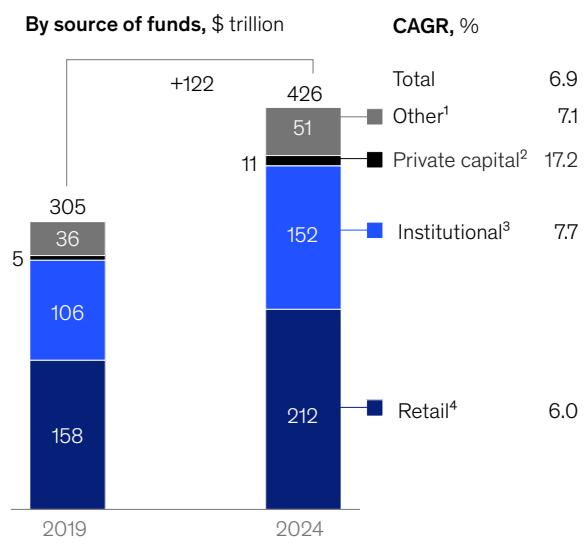  
By balance sheet placement, %

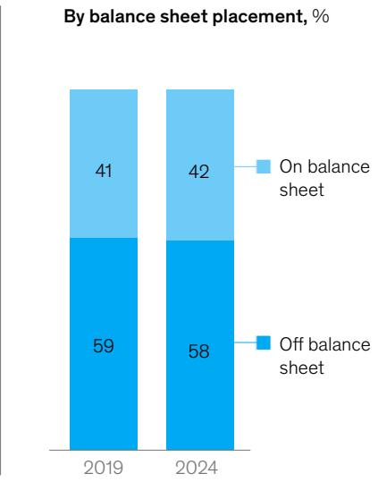  
Note: Figures may not sum to total, because of rounding.  
$^{1}$ Including public pension funds, sovereign wealth funds, and other alternatives (eg, hedge funds, real estate funds). $^{2}$ Including private debt and private equity.  
$^{3}$ Including banks' bonds and other equity, corporate deposits, corporate investments, endowments, foundations, and others. $^{4}$ Including insurance and pension holdings, mutual funds, retail deposits, and securities and derivatives held by households. Source: S&P Capital IQ; S&P Global Market Intelligence, accessed Sept 2025; McKinsey Panorama—Global Banking Pools

McKinsey & Company

originating from private capital experienced the fastest growth, expanding by 17.2 percent a year, underscoring private capital's rising influence in global markets. $^{7}$

A subcategory of intermediated funds, the global wealth of households and institutions, has been on an upward trend, helping to propel the banking industry's revenue growth. Over the past five years, global wealth as a percentage of nominal GDP surpassed the 350 percent mark. Personal financial assets, $^{8}$ a component of wealth, show similar dynamics (Exhibit 2). These developments illustrate the reallocation of wealth from real-economy assets toward financial instruments, a hallmark of finance's growing role in the global economy.

The trend of high wealth and financial assets relative to nominal GDP applies worldwide, though regional outcomes vary. Africa stands out, recording its highest levels in these metrics since 2000.

However, global wealth could be at a peak, as it's likely to be affected by demographic shifts that will play out over the next few decades. An aging population and lower birth rates will result in fewer new savers and investors. $^{9}$ Moreover, there's a generational shift in wealth, with more women and younger people seeking wealth management services. $^{10}$ Financial institutions are often ill equipped to manage the transition of wealth for the next generation, particularly those

## Exhibit 2

Total global wealth compared with nominal GDP 2000–24, $^{1}$ %

Global financial wealth as a share of GDP is at historically high levels.  
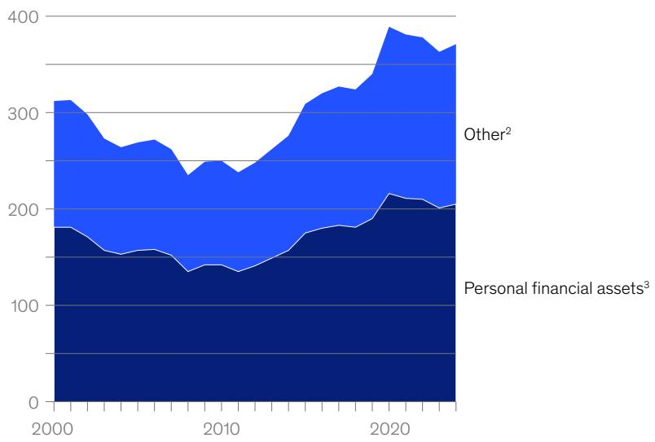  
$^{1}$ Values estimated for 2024.  
$^{2}$ Includes corporate deposits, institutional assets under management, and private capital.  
$^{3}$ Includes insurance and pension holdings, retail deposits and investments, and securities and derivatives held by households.  
Source: S&P Capital IQ; S&P Global Market Intelligence, accessed Sept 2025; McKinsey Panorama—Global Banking Pools

McKinsey & Company

who aren't part of the ultra-affluent segment. This gap could lead to a loss in market share for traditional banks as younger, more diverse clients seek out more tailored and accessible financial solutions. Additionally, the mix of intermediated funds is shifting away from banks toward alternative assets such as private capital, private equity, and even cryptocurrency, reflecting a growing appetite for higher-risk, higher-reward investments. For instance, about half of people born between 1981 and 2012 have invested in crypto. $^{11}$ This shift requires banks to use precision to adapt their strategies and risk management practices to effectively serve clients. Compounding these shifts, a McKinsey Global Institute report published in October 2025 shows that global wealth has become decoupled from productive growth, propped up by debt and asset inflation—raising questions about the sustainability of wealth levels relative to underlying economic output. $^{12}$

## Revenue growth

Not only did global banking revenues reach an all-time high in 2024, but they are increasing much faster than GDP, thanks to record balances and an advantageous margin cycle (Exhibit 3).

## Exhibit 3

Bank revenues have been boosted by high balances and strong margins.

Global banking revenues, balances, and margins, %

Revenues $^{1}$ as a share of nominal GDP

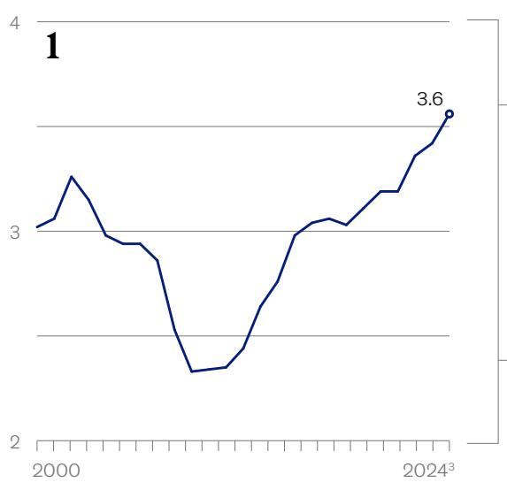  
1 Bank revenues are at their strongest point in 2 decades, now making up 3.6% of global GDP  
Balances $^{2}$ as a share of nominal GDP

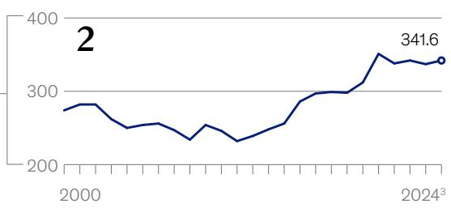  
Revenues $^{1}$ over balances

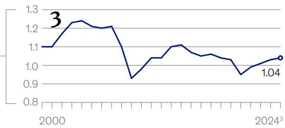  
2 One reason for this trend is elevated bank balances, equal to about 340% of GDP  
3 At the same time, as margins have improved, banks are earning more from each dollar of balances

$^{1}$ After risk cost. $^{2}$ Including assets under management, deposits, and loans. $^{3}$ Estimated.
Source: McKinsey Panorama—Global Banking Pools

McKinsey & Company

Balances hit records across regions, with revenue margins in Latin America and Asia (excluding China) at their highest levels since 2009 and 2015, respectively.

## Profitability and distributable capital

Between 2001 and 2024, global banking net income grew 5 percent a year, on average, to reach a record \$1.2 trillion. Even more striking, the industry's average annual distributable capital generation has nearly tripled, $^{13}$ from about \$290 billion in 2001–20 to roughly \$840 billion in 2021–24. Over the past four years, the banking sector generated a staggering total of about \$3.36 trillion in distributable capital (Exhibit 4). $^{14}$

The distributable capital, also known as free cash flow to equity, that banks generated in 2021–24 also vastly exceeds the total for any other industry (Exhibit 5). Shareholders received a significant portion, but banks have also built up historically large reserves for potential investments and acquisitions.

## Exhibit 4

Banks generated about \$3.36 trillion in distributable capital in 2019–24.  
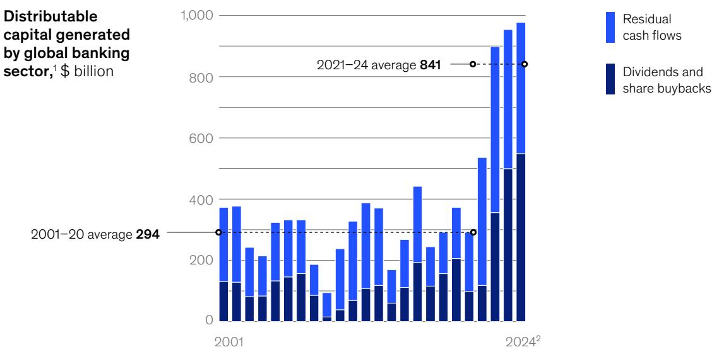  
$^{1}$ Net income minus change in minimum Tier 1 capital. Data adjusted for banks' accounting year conventions, which reflect capital calculation timing. $^{2}$ Estimated.  
Source: S&P Capital IQ; S&P Global Market Intelligence; Panorama by McKinsey; Value Intelligence by McKinsey

McKinsey & Company

The banking industry led all sectors in surplus capital in 2021–24.  
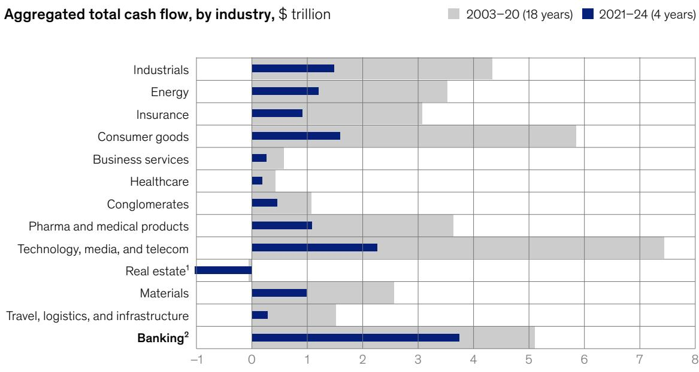  
$^{1}$ Real estate shows negative cash flows, as income is outweighed by heavy borrowing costs and constant reinvestment. $^{2}$ Unadjusted data for industry comparison purposes.  
Source: S&P Capital IQ; McKinsey Value Intelligence

McKinsey & Company

## Continued elevation or a reversion to the mean?

The past three years have been very strong for banks, but have they seized the opportunity to transform the windfall into making their business models ready for the future? The capital market view suggests that maybe not enough banks have done so.

Banks' existing broad strategies haven't worked. The sector invests about \$600 billion in technology annually, $^{15}$ yet bank productivity hasn't consistently improved. $^{16}$ Traditional customer segmentation has resulted in generic, average products. Chasing deals to achieve scale, simply viewing bigger as better, hasn't delivered. Most banks haven't pursued significant capital reallocation, major changes in distribution and the customer relationship model, or outsize innovation that would enable them to find profitable growth in a changing financial landscape.

Of course, it's possible that the banking sector could experience yet more solid growth—particularly if it gets a substantial productivity boost from AI, if the trend toward deregulation continues, and if other outcomes favorable to banking emerge.

But the more likely scenario is that banks could see plateauing profits and revenues, a view supported by the capital markets.

## The market view: A record valuation gap

Despite banks' record-breaking recent years, the valuation gap between banking and other sectors persists (Exhibit 6). As of June 2025, we estimate that the global banking industry's price-to-book ratio (P/B) stood at 1.0, significantly lower than other industries', despite banks' strengthening market performance this year in some regions, particularly Europe. The average ratio across industries was 3.0, meaning that banking is valued 67 percent lower than the average industry, and the gap has widened over the years. Regional variations exist, most notably in Latin America, where the gap reached less than 30 percent in 2024. But overall, while the banking industry's P/B has improved somewhat in recent years, that hasn't made much of an impact on banks' valuation gap.

Similarly, the banking sector's price-to-earnings ratio in 2024 was 8.4, also showing a valuation gap of roughly 70 percent compared with other industries. Despite its peak performance, banking's weak valuation reflects doubts about the industry's ability to innovate and adapt for the future (see sidebar “Analyst views on banks’ near-term future”).

Exhibit 6

## Banking shows a persistent valuation gap with other industries.

Banking's price-to-book ratio and P/E compared with those of other industries $^{1}$

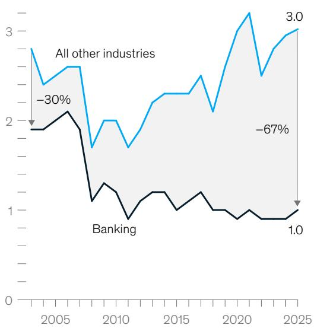

<table><tr><td colspan="2">Price-to-book ratio, by industry, 20252</td><td>2024 P/E ratio</td></tr><tr><td>Technology, media, and telecom</td><td>5.5</td><td>33.9</td></tr><tr><td>Business services</td><td>4.9</td><td>37.9</td></tr><tr><td>Pharma and medical products</td><td>3.9</td><td>56.2</td></tr><tr><td>Consumer goods</td><td>3.8</td><td>24.8</td></tr><tr><td>Industrials</td><td>3.8</td><td>33.8</td></tr><tr><td>Nondepository financial institutions</td><td>3.4</td><td>23.5</td></tr><tr><td>Healthcare</td><td>3.2</td><td>32.3</td></tr><tr><td>Travel, logistics, and infrastructure</td><td>2.4</td><td>16.5</td></tr><tr><td>Energy</td><td>1.7</td><td>15.3</td></tr><tr><td>Insurance</td><td>1.7</td><td>13.3</td></tr><tr><td>Materials</td><td>1.6</td><td>22.9</td></tr><tr><td>Conglomerates</td><td>1.6</td><td>13.7</td></tr><tr><td>Real estate</td><td>1.2</td><td>33.7</td></tr><tr><td>Banking</td><td>1.0</td><td>8.4</td></tr></table>

$^{1}$ Average, excludes outliers and firms with negative price-to-book ratio. Based on \~15,000 publicly traded companies. $^{2}$ Based on data from companies that have reported financial results for the first half of 2025.
Source: S&P Capital IQ; S&P Global Market Intelligence, accessed Sept 2025; Panorama by McKinsey; Value Intelligence by McKinsey

McKinsey & Company

## Analyst views on banks' near-term future

In a first, this year we asked banking analysts to weigh in as we were writing our Global Banking Annual Review. They told us that 2025 could unfold in two ways, largely hinging on developments in the United States: Banks either continue their hot streak or experience a reversion to the mean, as our most likely scenario predicts. The coming months will be critical in determining the trajectory. In the long term, the analysts agree that margin contraction is inevitable, due to macroeconomic factors such as interest rate declines, tariff and tax outcomes, and intensifying competition.

One analyst noted that the banking industry's persistent undervaluation is driven by an intensely competitive landscape, with fintechs, specialty banks, and big technology companies all competing for market share. The rapid adoption of AI, digital platforms, and other technologies is transforming the industry

and increasing the pressure on traditional banks to innovate and invest, as we explore in the second chapter of this report.

The good news is that investors these days tend to be less preoccupied with efficiency ratios than they used to be, another analyst said, allowing banks to focus more on boosting revenue growth to better prepare for the future. Banks are also hoping for an era of regulatory stability, as they have devoted significant portions of their tech budgets to compliance in recent years.

Scale is important, but without a strategic focus, scale doesn't necessarily lead to lasting results. Banks should prioritize unique capabilities and products to enhance scale, according to a third analyst. This is especially important for midsize banks, which can't invest as much as their larger peers.

Why the disconnect? Investors think banks' record financial results have been propped up partly by temporary factors—relatively high interest rates, a peak in the wealth cycle, unusually strong revenue margins, and historically low risk costs—rather than sustainable value creation. At the same time, banks have lost ground as fintechs, payments businesses, private credit firms, wealth managers, and other nonbank providers have muscled into some of the most attractive parts of their businesses. These developments have curtailed banks' profits, which could have been even higher in 2024 if not for the disruption brought by nonbank providers.

For example, in the United Kingdom, neobanks, digital lending businesses, and retail payments fintechs accounted for 7 to 8 percent of the country's total banking revenues in 2024, having tripled their share in the past five years. Fintechs have an especially strong position in card payments and unsecured lending, representing roughly 17 percent and 14 percent of the revenue pools, respectively.

Is the market accurately reflecting the current situation? It's possible that a higher-for-longer interest rate scenario hasn't been fully factored in. But without significant changes to the underlying business model, banks' profitability is expected to erode because they won't be able to cut costs quickly enough to counteract expected margin contraction (Exhibit 7). Banks' ROE rose from 9.0 percent in 2021 to 10.3 percent in 2024, helped mainly by a 2.5-point boost from

## Exhibit 7

Lower margins and other factors are set to dent banks' profitability.

Impact on ROE in 2021–24, by metric, percentage points

Forecast impact on ROE in 2024–30, by metric, percentage points

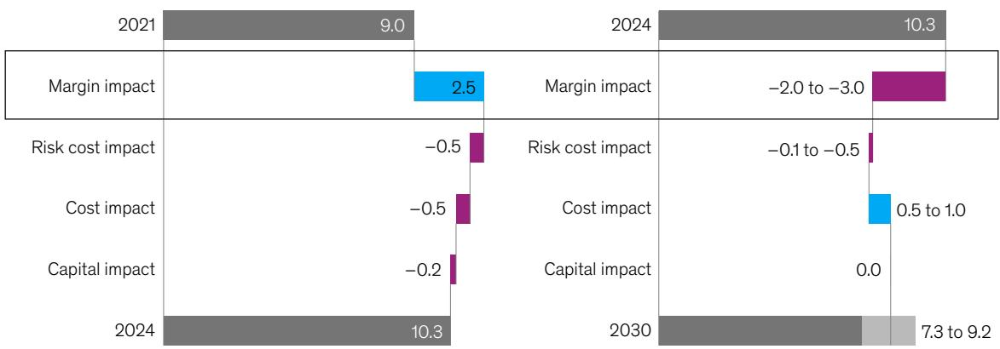  
Note: For 2030 forecasts, assumes that equity to assets will remain the same as in 2024 and capital structure will remain stable. Decline in forecast ROE is driven by declining margins and higher risk, partially offset by improving cost-to-asset ratio.
Source: Panorama by McKinsey

McKinsey & Company

exceptionally strong margins. Looking ahead, those margins are expected to compress by two to three points by 2030 as interest rates normalize, competition intensifies, and transparency increases. Risk costs are also likely to move higher. While continuing efficiency improvements could add back 0.5 to 1.0 points, that won't be enough to offset the negative forces. As a result, banks' ROE is projected to decline to between 7.3 and 9.2 percent by 2030—even if they continue reducing their cost-to-asset ratio at the historical pace of about 1 percent per year.

In an era of falling revenues, banks sorely need productivity gains and could potentially get them from AI. To maintain current return on tangible equity (ROTE) margins, banks will need to cut costs about twice as fast as their revenues decline (Exhibit 8). That's because when the revenue base shrinks, every dollar lost has to be offset by a dollar in cost savings, which represents a greater share of a smaller base. Over the next six years, this implies cost reductions that are four times as rapid as they were in the previous five years. Only about 19 percent of banks managed to achieve such steep cost reductions in 2019–24. The difference between maintaining the current pace of cost-to-asset reductions and increasing them four times means a staggering eight-percentage-point difference in cost-to-income ratios.

# Cost reductions alone won't preserve banks' profitability.

Scenarios for cost-to-asset reduction given anticipated revenue margin $^{1}$ compression

Revenue and cost to assets needed to maintain current return on tangible equity (ROTE) levels, $^{2}$ %

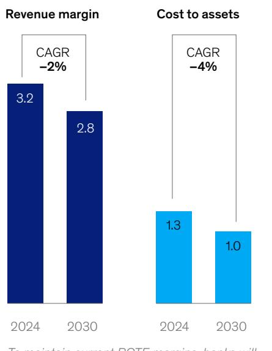  
To maintain current ROTE margins, banks will need to cut costs $\sim 2\times$ as fast as revenues decline

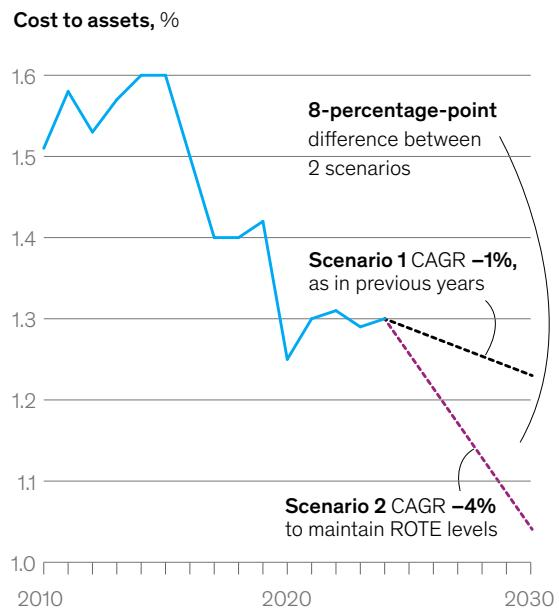  
Implies a reduction over next 6 years 4× as rapid as that seen in previous 5 years; only \~19% of banks have achieved such cost reductions in 2019–24  
$^{1}$ Net interest revenue plus fee and commission revenue divided by outstanding balances.  
$^{2}$ For average global bank.  
Source: Economist Intelligence Unit, accessed Sept 2025; Oxford Economics, accessed Sept 2025; Panorama by McKinsey

McKinsey & Company

## Forces reshaping the banking sector

Banks are contending with various shifts: evolving macroeconomic conditions; rapid advances in technology, including AI, stablecoins, and more; shifting customer behavior; and intensifying competition. While these forces are expected to weigh on the industry’s profitability, they also present opportunities for banks to innovate, differentiate, and find new paths to growth.

Macroeconomic conditions. Banks face declining interest rates, geopolitical uncertainty, and unpredictable risk costs. Plateauing interest rates in late 2024 curtailed the upward momentum in banks' profit margins, creating a more challenging environment.

At the same time, market volatility—driven by factors including geopolitical developments, policy shifts, and trade tensions—boosted corporate and investment banking (CIB) markets revenues, particularly in sales and trading, in 2024 and the first half of 2025.

The global trade environment has been marked by tariff disputes. $^{17}$ Increased tariffs can lead to steeper costs for businesses and consumers, affecting loan demand and credit quality. In the banking sector, rising US tariffs and political tensions have pushed more European companies to shift business from Wall Street banks to local lenders, chipping away at US banks' dominance abroad. $^{18}$

Advancements in technology, particularly AI. Agentic AI could disrupt banking as we know it, as we explore in the report's second chapter. Beyond the opportunities for financial institutions to become more efficient thanks to AI, we are starting to see glimpses of the next wave of AI innovations. Payments companies including Mastercard, PayPal, and Visa recently announced the deployment of “agentic commerce”: AI agents imbued with the ability to shop autonomously, using customers' prompts, and complete transactions on their behalf. $^{19}$ In October 2025, Visa rolled out Trusted Agent Protocol, a system that lets online merchants safely recognize and process purchases made by verified AI shopping agents instead of blocking them as bots. $^{20}$

In theory, such agents could eventually seamlessly allocate deposits to the highest-yielding deposit accounts, perhaps requiring customers to simply provide the final authorization for each move. They could also help customers optimize their lending balances across accounts to minimize high-cost lending by suggesting balance consolidation opportunities and attractive zero-balance transfer options or opportunities to pay down loan balances with excess cash. If such models become prevalent, they could fundamentally change the economics of the banking industry.

Stablecoins. Another aspect of the tech evolution in financial services is the rise of stablecoins, digital currencies pegged to stable assets such as the US dollar. Stablecoins are beginning to reshape the movement and settlement of capital market transactions—both domestically and across borders—by enabling around-the-clock, near-instant, transparent global transfers. Initially, stablecoins' biggest impact is expected in cross-border payments, with faster settlement and lower transaction costs eliminating many inefficiencies in traditional banking models.

Stablecoins are beginning to reshape the movement and settlement of capital market transactions by enabling around-the-clock, near-instant, transparent global transfers.

For banks, stablecoins' ascent is significant. Payments, which stablecoins could disrupt, account for about 40 percent of banking revenue pools $^{21}$ and an estimated 90 percent of bank customer activity. $^{22}$ Although stablecoin transaction volumes account for less than 1 percent of global daily money flows, their rapid growth signals their potential to surpass legacy payment volumes within a decade. $^{23}$ As the adoption of stablecoins grows, banks will need to adapt by integrating these new technologies or risk falling behind.

Financial infrastructure, including core systems. Banks' ability to deliver precision strategies will increasingly hinge on the strength of their financial infrastructure, a systemic enabler or bottleneck. Executing precision strategies and embedding AI depends on both internal systems, such as core banking systems, and external ones, such as payments rails, digital asset settlement layers, and data centers. Banks need to modernize complex core systems, which often block innovation. To address this, they can “hollow out the core” and adopt modular, flexible, open ecosystems that speed up new features and services. Legacy cores are costly, rigid, and hard to integrate with AI or real-time services. Cloud-native, modular cores are emerging, but adoption is uneven. Meanwhile, innovation is coming from nonbank infrastructure providers, including stablecoins and big tech payment networks, which are embedding AI and agentic commerce.

Other innovations and trends. New forces are redefining the boundaries of banking, forcing incumbents to move faster to remain relevant. Real-time payment systems such as Brazil's Pix are accelerating digital transactions and displacing cash usage. $^{24}$ In India and other emerging markets, mobile payments and mobile-first banking are enabling rapid financial inclusion at scale. Embedded finance is injecting banking services into nonbank customer journeys, with financial products integrated into platforms and apps far removed from traditional banks. $^{25}$ The digitization and democratization of financial advice is also accelerating thanks to AI.

Consumers. Shifting customer behaviors are adding another layer of complexity, as we explore in the report's third chapter. Consumers—especially younger generations—are less loyal and more digital-first, and they demand seamless, personalized experiences. Traditional segments, such as mass market or mass affluent, are losing relevance as customers splinter into diverse microsegments. To stay competitive, banks must offer hyperpersonalized products and services, and seamless customer experiences.

Intensifying competition. Competition from fintechs and big technology companies is disrupting traditional banking. The newer entrants are targeting the most valuable, highest-margin pools, such as payments and consumer lending, differentiating their offerings through improved credit risk decision engines and nontraditional customer data, for example, and democratizing wealth management with simple, easy-to-access digital solutions. Even though fintechs account for a relatively small share of the market, their offerings have tapped into banking sector profits, with businesses such as Nubank, Revolut, and Stripe finding success in high-value product pools. As a result, fintechs are experiencing faster revenue growth than banks.

Nonbank providers also tend to be more profitable than traditional banks. For example, payments companies represent the most profitable business model in financial services, though this category also shows the widest variance in performance (Exhibit 9). The lesson is not to overhaul entire business models but to deploy capital with precision, doubling down where the bank has an edge.

Beyond the main forces reshaping the industry, it's also important to consider how regional variation and the regulatory environment affect banks (see sidebar “The impact of geography and regulation on banking”).

## Exhibit 9

All financial-sector business models include a wide range of profitability.

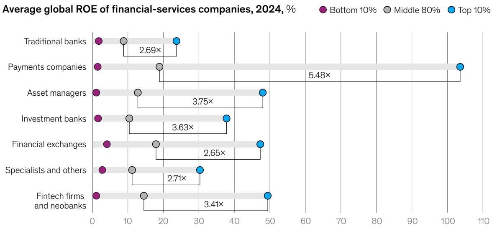  
Source: S&P Capital IQ; S&P Global Market Intelligence, accessed Sept 2025; Value Intelligence by McKinsey

McKinsey & Company

## The impact of geography and regulation on banking

Banking revenue pools are heavily influenced by local factors, such as customer behavior and regulations, not just macro drivers such as GDP. Although these factors don't necessarily tilt the balance, they help build a more nuanced picture of the variables influencing banks.

India and China exert a disproportionate influence on the global banking industry, albeit in contrasting ways. India punches above its weight in shaping the global banking narrative. Indian banks such as HDFC Bank, ICICI Bank, and Kotak Mahindra Bank are not only benefiting from higher valuations but also driving innovation, thanks to favorable macroeconomic conditions and digital transformation.

In contrast, China, with its sheer scale, acts as a significant drag on the industry, as its banking sector faces pressures from sharply narrowing net interest margins, escalating risks (notably from real estate sector stress and local government financing vehicles) and slower growth (especially in mortgages and property development loans). The high speed of innovation in China has also led to faster disintermediation by tech companies.

While regions around the world experienced highs across key financial indicators in 2021–24, China, the rest of Asia, and the Middle East reached ROE peaks during the 2000–20 period, experiencing a slowdown in 2021–24 (Exhibit 1).

The influence of local factors is also visible when examining the ratio of banking revenues after risk costs to nominal GDP (Exhibit 2). For example, Brazil and Canada both have high ratios of bank revenues to GDP, but for different reasons. Canada, one of the world's largest banking markets, is characterized by high financial depth (deposits, loans, and assets under

## Exhibit 1

Most regions are experiencing peaks across key dimensions of banking.

Averages of key financial indicators in banking, 2021–24

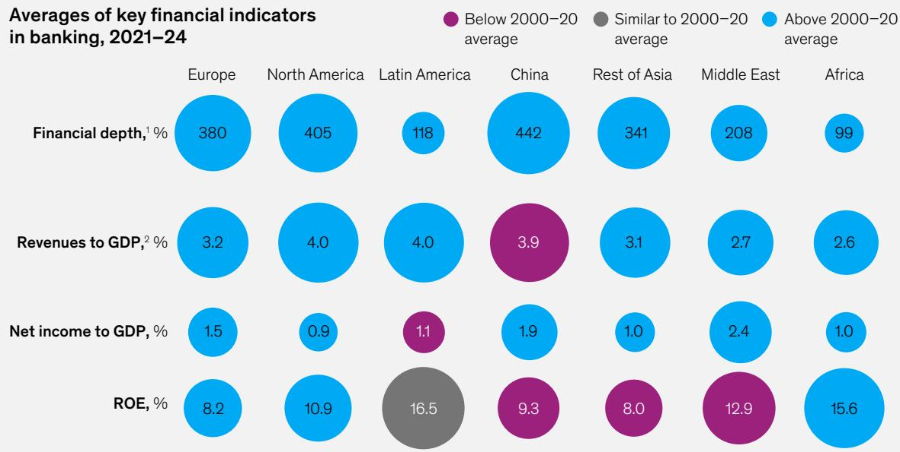  
$^{1}$ Assets under management, deposits, and loans compared with nominal GDP.  
Source: S&P Capital IQ; S&P Global Market Intelligence, accessed Sept 2025; McKinsey Panorama—Global Banking Pools

# Banking revenue pools are highly influenced by local factors.

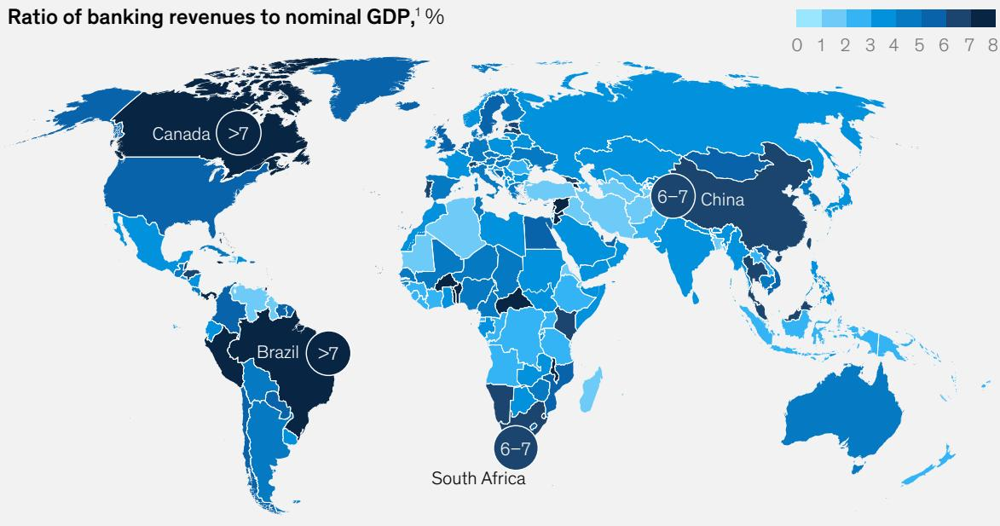

Banking revenues in select countries, $^{1}$ %  
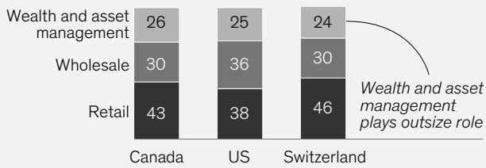

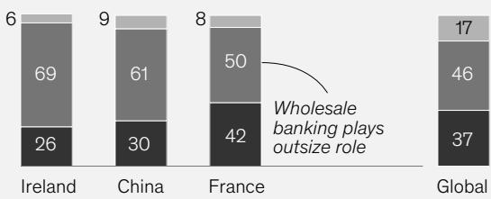  
Note: The boundaries and names shown on this map do not imply official endorsement or acceptance by McKinsey & Company. Figures may not sum to 100%, because of rounding.  
$^{1}$ After risk cost. Data for the following markets is based on regional averages: Belize, Benin, Brunei, Burkina Faso, Cameroon, Central African Republic, Chad, Cuba, Cyprus, Democratic Republic of the Congo, Timor-Leste, Equatorial Guinea, Eritrea, Falkland Islands, Fiji, French Guiana, Gambia, Greenland, Guinea, Guinea-Bissau, Iran, Kosovo, Libya, Mali, Mauritania, Myanmar, Niger, North Korea, Papua New Guinea, Republic of the Congo, Russia, São Tomé and Príncipe, Senegal, Sierra Leone, Solomon Islands, Somalia, South Sudan, Sudan, Suriname, Svalbard, Vanuatu, Yemen, and Zimbabwe.

Source: S&P Capital IQ; S&P Global Market Intelligence, accessed Sept 2025; Panorama by McKinsey; Value Intelligence by McKinsey

## McKinsey & Company

management compared with nominal GDP), relatively high margins across the board, and lower risk. In Brazil, high margins and a business mix heavy on consumer finance are the primary drivers.

## Regulation, risk, and compliance

The regulatory environment is also a key factor affecting banks. Since 2010, banks have experienced increasing compliance costs, fraud detection requirements, and supervisory scrutiny, while new developments, such as

the planned introduction of a digital euro, are adding further complexity. The regulatory winds have shifted recently as the global discourse on relaxing regulatory requirements has reached a new level.

Regulatory stability or loosening would let banks review their broader stakeholder management strategy; consider societal expectations of transparency, ethical conduct, and social responsibility; and focus on fulfilling their role in the

economy. Financial institutions will have the opportunity to redefine and transform their risk management strategies and approaches so they can continue to demonstrate compliance and prepare for regulatory priorities such as managing technology risks and fighting money laundering. In the United States in particular, we believe the next few years present an opportunity to modernize and automate required risk and compliance activities, such as risk and control self-assessments.

## More precise strategies for profitable growth

Increasingly, the industry's ability to create value is concentrated among best-in-class banks. Despite the sector's recent financial successes, based on 2024 results, we estimate that only 15 percent of publicly traded banks across the world created value, up one percentage point from 2023. The value-creating banks outperform peers partly thanks to precision, including micro-level capital deployment, not bigger budgets.

How do we define value creators? These select banks have a P/B above one (a level that reflects investor confidence in their ability to generate returns above their cost of equity) and a price-to-earnings ratio above 13 (which typically indicates banks that have stronger growth or superior profitability than peers below this level). $^{26}$ In comparison, about 54 percent of publicly traded companies across all industries achieve this threshold.

How do banks end up in the value creation tier? As we observed in our Global Banking Annual Review 2024, $^{27}$ location matters. About a third of the value-creating banks are based in attractive markets—such as Australia, Canada, and India—that show high margins and strong fundamentals (for example, demand for credit, demographics, and economic growth). But even within those markets, only banks that differentiate can make it to the value creation stage. Other factors that propel banks into the top tier include strong performance through strategic moves related to structure and execution, including pursuing precision in the four core areas of capital efficiency, M&A, AI, and earning the new consumer's trust.

In this chapter, we explore capital efficiency and M&A in greater detail. We shift to a closer examination of AI in the next chapter and then to the new consumer in the third chapter.

## A more precise approach to capital efficiency: Making every dollar count in banking and beyond

In the past, capital strategies involved sweeping reallocations—large-scale shifts between business lines or ambitious moves into beyond-banking offerings. These methods, such as across-the-board credit cuts or large-scale balance sheet shifts, risked eroding client relationships and missing profitable opportunities.

In today's financial landscape, precision has become the defining factor in effective capital management. Under the new Basel IV regulatory framework, $^{28}$ the relevance of capital has increased significantly. However, implementation varies by geography, creating an uneven playing field where institutions must both comply and adapt with surgical accuracy. Banks must now assess capital allocation at the most detailed levels: product by product, client by client, and even account by account. Capital must flow to areas with strong risk-adjusted returns while being swiftly withdrawn from underperforming segments.

This new approach views capital efficiency as having two complementary levers. First, precision in capital allocation allows banks to move money line by line to maximize ROE. Leading banks are examining risk-weighted assets at granular levels, releasing capital where risk-adjusted returns fall short and reallocating it to areas where it can have more impact. Morgan Stanley, for example, moved away from a model heavily reliant on institutional securities by building up its wealth

# Precision in capital allocation allows banks to move money line by line to maximize ROE, while beyond-banking initiatives can help banks build targeted, capital-light revenue streams.

management business, including through the acquisitions of E\*Trade and Eaton Vance, to provide a diversified, more stable revenue stream. $^{29}$

Second, beyond-banking initiatives can help banks build targeted, capital-light revenue streams and strengthen customer relationships. It's crucial for banks to find revenue streams that don't require tying up large amounts of capital. Beyond-banking offerings help by creating lighter revenue streams, deepening customer ties, and helping banks stand out from competitors.

Capital optimization. Instead of applying generic levers, banks should optimize capital line by line. AI can accelerate this process by automating credit processes and improving data accuracy.

These tools can help with precision in capital management:

— Advanced capital-allocation models. With wider use of internal ratings-based models, banks can measure risk and capital needs more accurately. These models let banks set requirements that better match actual risk, freeing up capital for other uses.

\- Capital-light origination. Banks are increasingly structuring deals and products that generate attractive returns while consuming less capital, a shift that expands capacity without compromising stability. This includes working with private investors to fund new loans outside the bank's own balance sheet.

\- Risk transfer mechanisms. Private investors' appetite for credit exposure has opened new avenues for risk transfer, making portfolios more capital efficient. By teaming up with insurers, private credit funds, and institutional investors, banks can move risk off balance sheet while retaining client relationships, stretching every dollar of capital further. Recent public examples include relationships between ING Bank and RiverRock European Capital Partners and between Société Générale and Brookfield.

— Geographic tailoring. Basel IV implementation differs by jurisdiction, requiring banks to adjust strategies locally. Precision in capital management demands that global institutions strategically navigate these regional differences, aligning allocation and structuring with local regulations.

— Technology-enabled optimization. AI and data analytics are core to credit processes. By automating reviews and improving accuracy, banks can fine-tune capital use line by line. AI-driven automation is increasing sophistication and efficiency in risk modeling and allowing for faster adoption of new models.

Beyond banking. In the past, banks pursued broad beyond-banking strategies, targeting the full customer base with marketplaces or home ecosystem solutions. This worked for banks with a strong market position. For instance, Kaspi Bank's superapp serves 75 percent of the population in its home market, Kazakhstan, offering financial and government services, payments, and e-commerce. $^{30}$

The new era calls for precision in beyond-banking offerings as well, with two distinct elements:

— Identifying customer needs and serving up precise solutions. Instead of broad ecosystems, banks can develop targeted solutions. For example, young, affluent condo owners might get mortgages bundled with smart home or repair services.

— Setting the right level of ambition. While Kaspi could build a full marketplace, given its strong market position, other banks may need to pursue more focused, niche opportunities in highly competitive markets.

## More precise approach to scale: Smarter M&A

The M&A strategies of yesteryear were often defined by big, high-profile deals that often failed to deliver the promised synergies. In contrast, precision M&A involves using deals to directly address strategic gaps, add targeted capabilities, or provide access to specific customer segments. The strategy can be tailored to transactions of any size. Leading banks use M&A to plug discrete gaps—for instance, acquiring AI models or access to a specific customer segment.

Globally, the total value of financial services M&A deals surged in the first half of 2025 from the year-earlier six months, even as the number of deals rose only slightly, with high-value, strategic transactions driving the rebound. We expect banking M&A deals to continue to accelerate, and we expect deals to focus on closing specific gaps in customer segments, technology, data, or geography rather than pursuing size for its own sake.

Capability-led M&A. Banks can use acquisitions to secure discrete advantages—AI tools, data assets, and targeted customer segments—and embed them rapidly through disciplined, early integration. What works is programmatic, capability-focused dealmaking aligned with a clear operating model; what doesn’t is scale for scale’s sake or integrations that dilute focus.

Market-focused M&A. Another approach is to enter priority geographies that balance risk with return and fit the bank's strategy, favoring selective moves over acquisitions for scale. In Europe, further cross-border banking consolidation is expected, reflecting alignment among

policymakers and industry leaders on the importance of enabling European banks to become more competitive globally. $^{31}$

Illustrating the payoff of precision, Singapore-based DBS Bank and Hungary-based OTP Bank Group have created substantial value through M&A, with DBS reaping the benefits of targeted acquisitions in the wealth management space. OTP, meanwhile, has become Europe's leading universal bank in terms of both growth and ROE, partly because of well-timed strategic acquisitions with different risk/return profiles, from stable eurozone market Slovenia to high-growth Uzbekistan. And Royal Bank of Canada created value thanks to its acquisition of HSBC's Canadian operations, reaping industry-leading cost synergies while realizing substantial benefits in the commercial-banking segment.

## AI's impact on banks and their customers

AI offers the single most powerful lever to drive productivity gains in banking and deliver a new level of precision in designing and scaling processes. But capturing value from AI requires a deliberate shift in how banks operate, starting with targeted moves to rewire specific domains where AI can move the needle most. $^{32}$

Moreover, AI isn't just expected to transform the way banks operate, as we explore in the second chapter of this report. It's also starting to transform how consumers buy banking products and services, as we detail in the third chapter.

The magnitude of AI's impact on banking will likely depend on two key factors: the extent to which banks can become fully agentic and radically lower the cost of operations, and the extent to which customers adopt AI to manage their financial affairs. Our analysis includes nine scenarios defined by these factors (Exhibit 10). In our central scenario, which we estimate has a 30 percent likelihood of playing out, AI substantially reshapes both banking operations and consumer behavior.

Other scenarios appear less likely. For example, scenario C3, in which consumers fully delegate financial decision-making to AI agents and banks drastically reduce their head counts, hinges on two factors that are unlikely in the medium term: regulatory acceptance of agents autonomously executing transactions on customers' behalf and AI's ability to replicate senior-level decision

# The magnitude of AI's impact on banking will likely depend on two key factors: the extent to which banks can become fully agentic, and the extent to which customers adopt AI.

## Exhibit 10

AI is expected to reshape banking functions and consumer behavior.

Likelihood of scenarios playing out, %

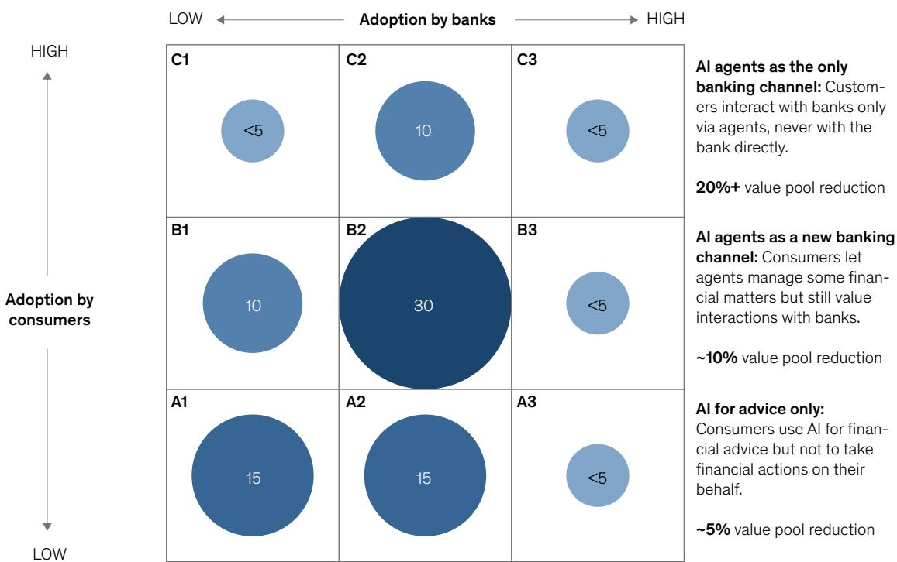  
AI agents as the only banking channel: Customers interact with banks only via agents, never with the bank directly.  
20%+ value pool reduction  
AI agents as a new banking channel: Consumers let agents manage some financial matters but still value interactions with banks.  
\~10% value pool reduction  
AI for advice only: Consumers use AI for financial advice but not to take financial actions on their behalf.  
\~5% value pool reduction  
AI never fully scales: AI agents are used in a few areas, including as copilots for knowledge workers.  
<10% cost reduction  
AI revolutionizes banking functions: AI agents take over IT and other functions, with an agent-to-human ratio of \~20:1.  
AI revolutionizes everything: AI agents replace most roles, with an agent-to-human ratio of 100:1 or more.  
15–20% cost reduction 40%+ cost reduction  
Source: McKinsey analysis; expert interviews

McKinsey & Company

making. Still, as discussed earlier in this report, even if consumers are required to give final approval to transactions orchestrated by AI agents, meaning these agents aren't fully autonomous, such a model could cause major disruption to the industry, as seen in our central scenario.

Banks' record results have masked gathering pressures: Margins are normalizing, competitors are encroaching, and customers are rewriting the rules. The coming years will mark a split between leaders and followers among banks. Leaders will reinvent their models, double down on technology, and embed AI into the core of their business. Followers risk decline as the industry shifts. In the next chapter, we dive deeper into what our most likely scenario might mean for the industry and how AI could rewire banking operations, with leaders taking the spoils and slow adopters left with lower profitability.

Banking's agentic AI era:

# Big gains, bigger disruption

Agentic AI represents a true paradigm shift and is poised to become a critical differentiator. For leading banks, agentic AI is a platform to rewire workflows and business models. Slow adopters, in contrast, face the danger of losing relevance.

Agentic AI is a major step in the evolution of AI, coming after the shifts from simple, rule-based automations to machine learning and then to gen AI–powered chatbots and copilots. With agentic AI, autonomous AI bots powered by dedicated large language models (LLMs) could operate autonomously while soliciting input from and mimicking human behaviors where needed—handling unstructured data, collaborating to execute end-to-end processes, making localized decisions with increasing independence, and interfacing with tools.

Large corporations are making significant AI investments. Amazon has forecast more than \$100 billion in capital expenditures for 2025, most of that earmarked for AI capabilities. $^{33}$ JPMorganChase, which has an \$18 billion annual budget for technology, $^{34}$ including AI, is rewiring for a new era by using agentic AI to execute complex, multistep tasks. $^{35}$

However, hype and investment don't always translate to transformative results. Banking leaders must assess whether agentic AI is a catalyst for transformative innovation or a valuable but niche technology. To navigate this uncertainty, we conducted a comprehensive review that included banking industry trends, client experiences, and conversations with experts worldwide—banking leaders, executives at digital attackers, venture capitalists, academics, and former regulators. The interviewees included AI true believers, deep skeptics, and many in the middle. Our analysis suggests:

— The hype has legs. We expect the underlying AI technology to deliver on its promise, bringing banks new capabilities that are highly applicable to the industry.

— Agentic AI has the potential to radically reshape banking—and not necessarily to the benefit of the industry as a whole. It could create unprecedented efficiencies and new customer value, but without decisive adaptation by banks, it stands to erode traditional profit pools.

\- Even as AI boosts productivity—saving the industry \$700 billion to \$800 billion, or 15 to 20 percent of costs—these savings are likely to be competed away and passed to customers.

— Meanwhile, customer use of AI agents could significantly disrupt value pools. If banks don't change their business models, our most likely scenario shows they could experience an aggregate decrease of \$170 billion, or 9 percent, in global profit pools, representing a one- to two-percentage-point erosion of average ROTE. $^{36}$ That's enough to bring average returns below the cost of capital.

\- The effects won't be felt equally. Pioneers could gain a four-point ROTE advantage while capturing substantial market share as they reap productivity benefits early and reinvest in new models. Slow movers would be stuck with an uncompetitive cost base and would decline in relevance.

— The timing of disruption is uncertain. Nonetheless, we expect a breakout agentic business model to emerge in the next three to five years, creating a tipping point.

\- Creating value from AI won't be easy, but successful organizations offer a template: rewiring entire domains across strategy, people, technology, data, and risk management.

— Financial institutions need to move significantly faster, and regardless of strategic posture, every executive team needs to closely examine the potential impact of AI on the business model.

## Why AI is a force for disruption in banking

Improvements in gen AI tools—paired with capabilities for planning, memory, orchestration, and system integration—have enabled the rise of agentic AI systems, which can autonomously execute multistep processes without being continuously prompted by humans.

Unlike traditional AI, which focuses on structures, rules, and repetition, agentic AI can analyze unstructured data and identify patterns, making way for complex document synthesis, personalization at scale, and semantic understanding of communications and behavior. It significantly accelerates the development and maintenance of software systems with faster, cheaper engineering—translating into faster product development cycles, lower cost of implementation, and more tailored solutions to business needs. It can widen the “happy path” of digital journeys, which have so far been limited to predictable, rule-based flows and have required manual intervention for anything outside that flow.

Progress hasn't been linear. In 2025, skepticism grew as new model releases delivered incremental improvements. $^{37}$ This raised concerns that the pace of AI development may be shifting from a period of significant leaps to one of diminishing returns—at least in the short term.

Despite these developments, AI remains a genuine force for disruption in banking. This year alone, Evident, a platform that tracks AI adoption in financial services, has documented more than 160 use cases announced by 50 of the world's largest banks. $^{38}$ Some early applications have demonstrated significant transformative potential. For instance, a US bank used AI agents to reimagine the way it creates credit risk memos, bringing a 20 to 60 percent increase in productivity and a 30 percent improvement in credit turnaround. In India, a leading digital attacker is using a gen AI tool to monitor 100 percent of collections calls, up from the 2 to 4 percent tracked previously. A leading European bank more than tripled click-through rates by using a personalized marketing campaign powered by gen AI. And an independent US investment bank used a gen AI–powered knowledge management platform to improve productivity for both junior and senior bankers across all stages of dealmaking and M&A execution.

At the same time, intellectual-property filings for gen AI-related technologies in financial services have skyrocketed, increasing to 60 percent of all AI-related patents, up from 35 percent in 2018. $^{39}$

In the near future, we expect to see the emergence of a collaborative model, with one human employee supervising roughly 20 to 30 AI agents that work autonomously to handle complex end-to-end workflows. Early use cases have shown significant potential, with agentic AI enabling zero-touch operations and reducing manual workloads by 30 to 50 percent. As agent libraries are scaled across organizations, this impact is expected to increase.

To keep pace, most executives plan to boost spending: In a recent McKinsey survey, 37 percent of respondents said they plan to increase their gen AI-related investments by more than 20 percent in the next year.

## AI's potential effects on banking

In this section, we examine in detail how AI could reshape the industry, including banks' unit costs for work, and how it might affect consumer behavior.

## Adoption by banks and the effect on costs

What could the agentic bank of the future look like? It might have the following capabilities:

— Agent-first customer care. No matter which channels customers select (app, web, phone call), they will be served by a universal AI agent layer, with easy handoff to specialized supervisory teams. In wealth management, for instance, this could include personalized portfolio reviews or proactive advice prompts from agents monitoring market movements.

— Zero-touch operations. Teams of AI agents will execute workflows independently with human oversight but limited intervention. In retail banking, agents could help with customer onboarding, document generation, and verification, while in CIB, AI agents could automate loan origination checks, trade confirmations, and treasury reconciliations.

— Autonomous financial crime resolution. Agents will monitor transactions in real time, detect suspicious patterns, and generate alerts for potential financial crimes—resolving some cases and escalating complex ones to human specialists. In wholesale banking, agentic know-your-customer/anti-money-laundering systems are already helping clients accelerate onboarding and improve the accuracy of sanctions screening.

## In a recent McKinsey survey, 37 percent of respondents said they plan to increase their gen AI-related investments by more than 20 percent in the next year.

# Cost savings from AI won't lift profits for most banks long term. Competitive dynamics are expected to erode the advantage as banks pass much of the savings to customers.

— Next-generation corporate functions. Agents will drastically reduce the time that humans spend on routine activities in financial planning and analysis (for example, handling data collection, budget generation, and scenario creation), HR (for instance, resume screening and interview scheduling), and other functions.

— AI-enabled risk management. Agents will autonomously perform continuous control testing and manage end-to-end credit risk processes, detecting issues in real time and escalating cases as needed. In emerging markets, AI models that draw on alternative data have already broadened access to credit while sharpening risk differentiation. In developed markets, banks are using AI to strengthen fraud detection, monitor portfolios, and tailor collections strategies.

— Agentic product and technology factories. Agent and human collaboration will speed up how quickly new products get to market, thanks to automation in software development (such as in coding, testing, and API management). As a result, the typical talent pyramid could become more diamond-like, with an increased emphasis on expertise, architecture, and systems design.

Agents will support entire workflows. One agent could perform the requested activity and produce the output; another could review the output, identify gaps, and provide a detailed critique; and a third could elevate the output to a human to review, investigate, and validate. The human in the loop will supervise AI agents, remaining integral for final decisions, quality assurance, exception handling, and adherence to risk and regulatory requirements.

In our central scenario, B2, which we described in the first chapter of this report, AI will revolutionize banking operations and IT, and banks' net unit costs for work are expected to decrease by about 15 percent (Exhibit 11). In scenario C3, AI will revolutionize everything in banking, and banks' net unit costs for work will fall roughly 40 percent. Not all banks will be able to reduce costs by this much, however. For example, the costs of service in some markets could increase rather than decrease as customers' expectations continue to rise and banks spend more to meet those expectations.

However, these efficiencies won't lift profits for most banks long term. That's because, over time, competitive dynamics are expected to erode the advantage as banks pass much of the savings to customers. In any case, agentic AI changes the rules: Pioneers capture outsize gains, while slow movers face decline.

## Exhibit 11

AI has the potential to lower banks' unit costs for work.

Potential impact of AI on average retail bank unit costs for work, by scenario, index (expenses today = 100)

Scenario B2 (30% likelihood of playing out)
Scenario C3 (<5% chance of playing out)

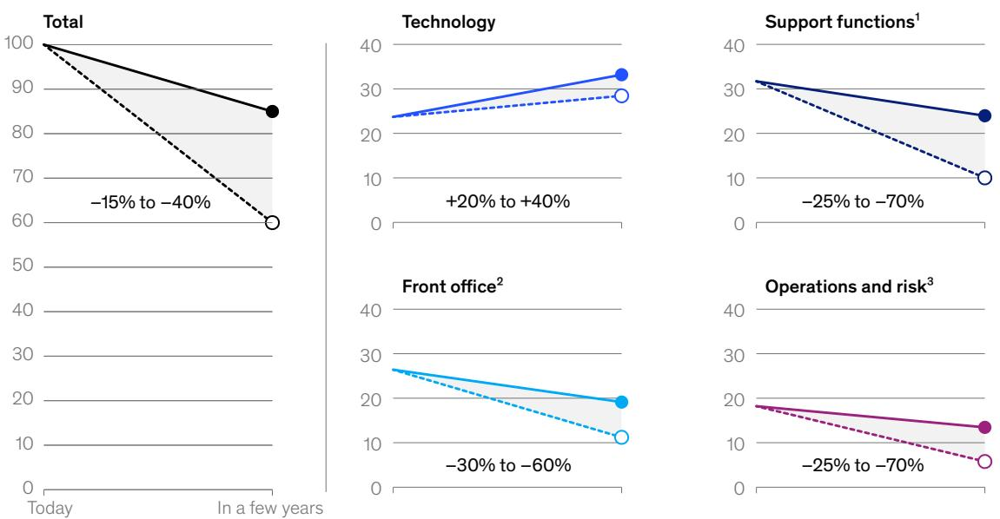  
$^{1}$ Includes business and product strategy, finance, HR, internal audit, legal, marketing, procurement, and real estate. $^{2}$ Includes ATMs, branches, contact centers, corporate centers, correspondents, and direct sales staff. $^{3}$ Includes credit collections, operations, and risk and compliance.
Source: Finalta by McKinsey; McKinsey analysis

## McKinsey & Company

## Adoption by customers and the impact on banking value pools

Customers' use of AI, which we explore further in the third chapter of this report, will affect banking value pools at least as much as what banks do, maybe even more. The magnitude of impact will depend on how extensively consumers adopt AI, and for what purposes—in particular, the extent to which they adopt third-party AI agents not provided by their banks to advise or manage financial affairs on their behalf.

Banks' profitability in many areas has long relied on customer inertia—the tendency to stay with existing providers and products even when better offers exist. This is particularly true in deposits and credit card lending, which between them accounted for about 10 percent of the global banking sector's profit pools in 2024 and which have most consistently delivered returns above the cost of capital.

Neobanks and fintechs have already eroded this inertia by training customers to compare and switch more easily. If consumers adopt AI agents to help optimize their finances, this trend could rapidly accelerate. Agents could not only provide proactive advice ("Good morning, I found a way for you to pay down card balances with excess cash and save \$2,000.") but also take actions on consumers' behalf ("Would you like me to do it for you?"). Taking this to the next level, in the

future, an AI company could become the app of choice for retail purchases, with all card spending relying on agentic optimization.

If agentic AI is widely adopted in this manner, it could have four major impacts on the relationship between banks and their customers:

— Commoditization. Agents could seek out the best provider (highest deposit rate, lowest loan rate) regardless of institution or brand, increasing competitive intensity on rates and fees.

— Disaggregation. Agents could optimize for each product individually, breaking the traditional banking relationship model, which offsets higher customer acquisition costs with the ability to cross-sell.

— Disintermediation. As customers rely more on AI agents to manage their finances, their connection with their banking provider could weaken. In an extreme case, customers could interact with their banking providers only through third-party agents and might not even know which institution currently houses their deposits.

\- Democratization. If AI agents become sophisticated enough, they might be able to provide “good enough” versions of banking value-add services such as financial advice and portfolio management. While this could make these services accessible to customers who traditionally couldn’t afford them, it would likely also result in pricing compression.

The magnitude of the impact on banking profit pools would depend on four interrelated conditions: the level of sophistication of customers' AI agents, the agents' ability to manage financial affairs directly on behalf of customers, consumers' rate of adoption of agentic AI, and finally, banks' actions in response.

# If just 5 to 10 percent of checking balances migrated to top-of-market rates, the banking industry's total deposit profits could decline by 20 percent or more.

In our central scenario, regulations and bank actions prevent AI agents from gaining fully autonomous access to customer accounts, though they could still make suggestions while requiring customers to make the last click to approve the transaction. However, open-banking regulations and digital currencies such as the digital euro could eventually give agents greater “write access” to customers’ accounts.

As we explore next, even relatively modest customer adoption levels and simple agents (requiring improvements in AI technology that remain in line with current trends) could have significant impacts on banking value pools.

## Deposits flowing to higher-rate accounts

Today, 23 trillion of the global total of 70 trillion in consumer deposits sits in checking accounts with near-zero rates, while the remainder is parked in accounts that often pay relatively low savings rates. $^{40}$ As of September 2025, national rates on US interest-bearing checking and savings accounts were just 0.07 percent and 0.40 percent, respectively, well below the rates above 4 percent offered by leading online banks. $^{41}$

If just 5 to 10 percent of checking balances migrated to top-of-market rates, an action that might be prompted by AI agents, that could reduce the banking industry's total deposit profits by 20 percent or more. Furthermore, as deposits become more mobile, facilitated by agents, pricing competition between banks is likely to increase, driving up rates offered to attract deposits.

## Credit card usage optimization

Similarly, credit card lending is ripe for disruption by AI agents. This business area, one of banking's most profitable, is heavily influenced by customer inertia. Credit card lending revenues come from interest on balances for cardholders who don't pay off their cards in full every month, plus fees for late payments, cash advances, and the like.

It's not uncommon for consumers, particularly in the United States and Canada, to maintain high levels of credit card debt even when they have other options. For example, about 75 percent of US revolving balances and roughly 65 percent of borrowers are in the prime or superprime segments. $^{42}$ These consumers pay high interest rates on these revolving balances, even though they have access to significantly lower-cost funding from other sources, such as unsecured personal loans or loans secured against assets.

Agentic AI could reduce this inertia by automating debt consolidation into lower-rate loans and by paying off high-interest balances first or identifying excess cash that could be used to pay down card balances. In our central scenario, B2, which has a 30 percent probability of playing out, customers start using AI agents as a significant channel for interacting with their banks. In this scenario, if agentic AI is adopted by just 5 to 10 percent of customers, holding about 10 to 15 percent of balances, overall credit card lending profits could fall roughly 30 percent if banks take no action to mitigate AI's impact (Exhibit 12).

Of course, even adoption by 5 to 10 percent of customers is far from guaranteed. After all, many financial services innovations (for example, robo-advisory and personal financial management applications) have experienced relatively slow adoption, and customer inertia persists in the

## Exhibit 12

If banks do nothing to mitigate AI's impact, value pools could drop.

## AI's potential impact on bank profit pools, by region and product, $^{1}$ %

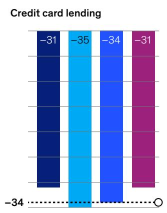  
Consumer deposits

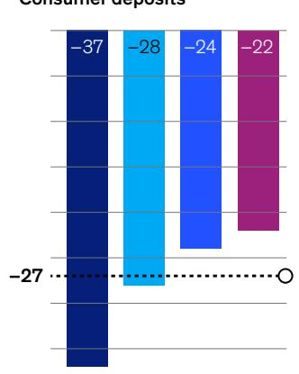  
Wholesale transaction banking and financing $^{2}$

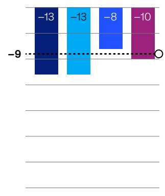  
Personal loans (including overdrafts)  
Small/medium enterprises  
Consumer payments $^{3}$

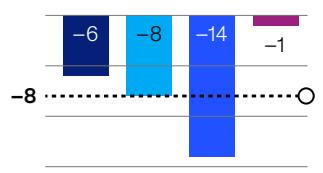

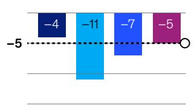

  
Wealth and asset management $^{4}$

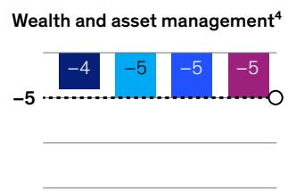

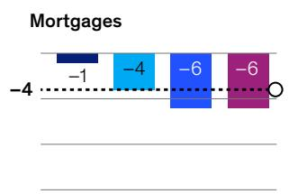

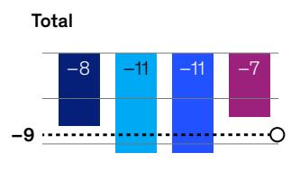  
$^{1}$ Posttax profit pools under B2, the central scenario, estimated to have a 30% likelihood of playing out. Analysis excludes capital markets and investment banking revenues.  
$^{2}$ Includes large nonfinancial corporations.

$^{4}$ Excludes wealth and asset managers' lending and deposits.

Source: McKinsey Panorama—Global Banking Pools; S&P Global

banking system even after decades of reduced friction through digitization. That said, we believe agentic AI is likely to produce tools that are powerful and seamless enough to drive consumer adoption over time.

Indeed, plenty of earlier technologies in financial services have become ubiquitous. Digital banking is the norm, and mobile is the dominant banking channel, as we explore further in the third chapter of this report. The digital transition was encouraged by banks but also driven by demand as consumer expectations shifted thanks to seamless experiences in e-commerce and elsewhere. Meanwhile, digital wallets such as Apple Pay are getting more popular. In 2024, 48 percent of US consumers said they had used digital wallets in the past 90 days, up from 36 percent the previous year. $^{43}$

A recent experiment in easing the conversion of regular credit card balances into lower-rate installment loans provides an interesting parallel to what agentic AI might be able to deliver, perhaps on a greater scale. Between 2017 and 2021, several major card issuers, including American Express $^{44}$ and JPMorgan Chase, $^{45}$ rolled out credit card installment payment plans that allow customers to easily turn regular credit card balances into lower-rate loans. The loans can be set up directly in a banking app, contributing to their appeal. Reducing friction got results: In 2022 alone, US consumers had set up about ten million installment plans, up roughly 60 percent from the previous year, with about 9 billion in total balances. $^{46}$ This growth was driven largely by the much lower interest rates on offer (about 5.8 percent on average for installment payment plans, compared with 20 percent or more for regular credit card debt, even for superprime consumers).

To be sure, installment loans remain a niche market. In comparison, US credit card lending balances totaled about \$1 trillion in October 2025. $^{47}$ Still, the fact that lower friction led some consumers to try installment loans could foreshadow similar success for agentic AI in banking.

There are ways to prepare for this potential disruption. Pioneering banks are examining ways to adapt their business models. Some are doubling down on ecosystem plays to fend off disintermediation. Others are testing their own customer-facing AI agents to help people optimize their finances, hoping to own the disruption rather than wait to be disrupted.

# We believe agentic AI is likely to produce tools that are powerful and seamless enough to drive consumer adoption over time.

○2 Value starts being competed away via more intense competition as more institutions catch up

## Implications for the approaches of individual banks

Outcomes from the agentic AI revolution could vary widely. We expect AI pioneers—those banks, regardless of size, that first capture the 15 to 20 percent net productivity opportunity in each market—to become meaningfully more profitable and gain a lasting market share advantage. Meanwhile, slow movers are likely to see declines. In our most likely scenario, pioneers could open up a significant gap in ROTE compared with slow movers, reaping productivity benefits years earlier and generating cash flow for reinvestment (Exhibit 13). For example, a four-point ROTE gap could result in as much as \$250 million in additional annual profit for a bank with \$100 billion in assets. Over time, as other institutions catch up, pricing competition will kick in and likely compete away those productivity gains. Slow movers will be left with an uncompetitive cost base in a transformed market, lose share, and potentially be acquired. Pioneers will be better positioned to defend their core business and explore beyond-banking revenues, which could help mitigate potential disintermediation and commoditization.

## Exhibit 13

## AI pioneers are expected to gain a lasting advantage.

Potential impact on returns of tangible equity (ROTE), by bank archetypes, illustrative, %  
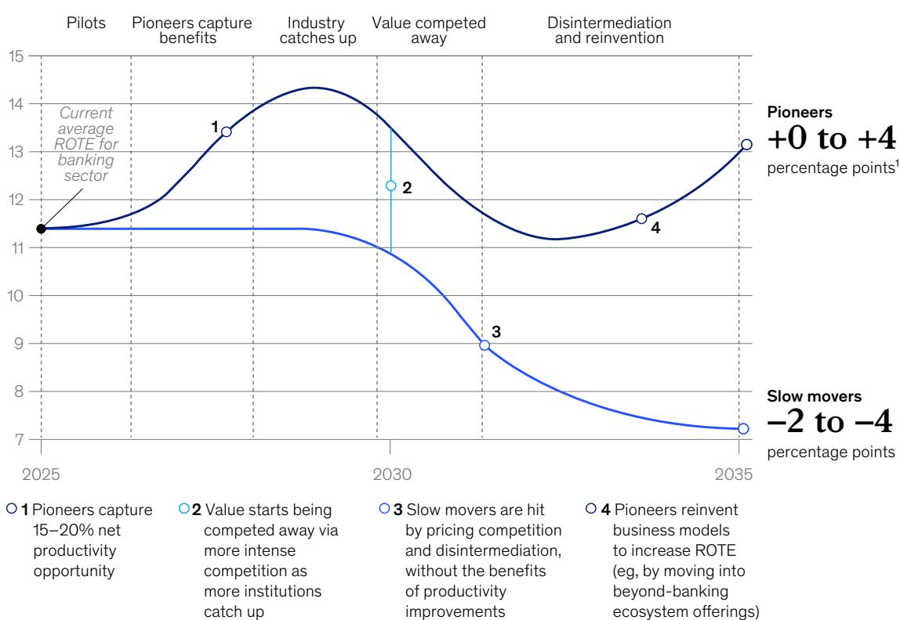  
- 3 Slow movers are hit by pricing competition and disintermediation, without the benefits of productivity improvements  
- 4 Pioneers reinvent business models to increase ROTE (eg, by moving into beyond-banking ecosystem offerings)  
$^{1}$ Extent of gains will depend on local market structure.

McKinsey & Company

In aggregate, where will value from AI be created and captured? In our central scenario, gross reductions in certain cost categories could reach as much as 70 percent. Yet these large savings are expected to be partly offset by rising technology costs, increased fraud prevention spending as banks compete with ever more sophisticated attackers, and higher cybersecurity outlays. As a result, the net effect across the entire cost base is expected to be diluted to 15 to 20 percent.

However, as we described earlier in this report, those savings won't last. A handful of pioneer banks will benefit substantially, improving ROTE, capturing market share, and reinventing their business models to defend against disintermediation. Others will experience a net decline in both market share and returns. Innovative tech companies and other disruptors will also benefit, mainly through powering productivity savings and enabling disintermediation.

## When will AI transform the banking industry?

For most strategic topics, when major disruption will happen is at least as important as what exactly could happen. For trends that are evolving exponentially rather than linearly, predictions on timing are especially difficult. Nonetheless, our central projection is that most banks will struggle to scale from pilots to comprehensive domain transformations. A handful of early adopters will succeed in driving value, while others will become expensive failures. However, within three to five years, an AI-native business model could break through and gain serious traction in the market, threatening unprepared incumbents and catalyzing much more rapid adoption. Beyond the next five to ten years, we expect to see meaningful changes to industry structure driven by AI.

We believe the timing will depend on six main factors, with the first two being most significant:

\- Regulatory support. Regulators will be closely monitoring banks' use of AI for potential consumer harm. This may slow down AI adoption by banks. It may also mean that the earliest at-scale innovations come from nonbanks, which are more lightly regulated in many jurisdictions. That said, many supervisory bodies across the globe have adopted explicitly pro-AI stances, including the UK Financial Conduct Authority and the Monetary Authority of Singapore. $^{48}$

— Incumbents' ability to adopt. Given the highly regulated nature of the banking industry, significant industry change will require at least some large incumbents to adopt AI at scale. This will take time even for the most advanced institutions. Nonetheless, some large banks, such as JPMorgan Chase, are moving aggressively on AI.

\- Disruptor speed to market. Attackers will likely play a crucial role in adoption by putting pressure on incumbents. Some early signs are already visible. Amazon, for instance, introduced a capability that lets customers purchase items unavailable on Amazon from third-party websites by using the company's agentic AI. $^{49}$ Visa and Mastercard have rolled out pilot programs that enable AI agents to initiate purchases on users' behalf, allowing the agents to make a transaction without sharing credit card numbers. $^{50}$

# Banks' (and the global economy's) ability to deploy AI at scale will depend on the availability of third-party data centers, computing power, and energy.

\- Maturity of the technology. Some argue that AI's reasoning abilities may never be sufficient for the most transformative use cases and hallucinations may never fully go away. However, the technology is advancing rapidly, driven by the growing maturity of foundational infrastructure and major advances in training efficiency. For example, despite the tepid reception GPT-5 received when it was released in August 2025, the model is less error-prone than previous iterations: It makes incorrect claims 9.6 percent of the time, down from 12.9 percent for GPT-4o, released in May 2024. $^{51}$ Moreover, human-in-the-loop models have proven highly effective at mitigating AI errors. Even assuming only incremental further gains, technology maturity is unlikely to be a bottleneck.

— Infrastructure readiness. Banks’ (and the global economy’s) ability to deploy AI at scale will depend on the availability of third-party data centers, computing power, and energy. McKinsey analysis suggests global demand for data center capacity could more than triple between 2023 to 2030 and increase US energy demand by 400 terawatt-hours, representing a roughly 7 percent increase in total US power demand. Global spending on AI infrastructure has risen commensurately, nearly doubling in the first half of 2024 to around \$47 billion, and is projected to exceed \$200 billion annually by 2028, according to International Data Corporation. However, energy supply may prove more challenging. The time required to get new power connections for data center sites in major data center hubs has been increasing, and some non-US locations have curbed data center construction in recent years primarily because they lack the power infrastructure to support them. Demand for computing capacity is already straining power grids, and despite some investments in nuclear and other sources, energy demand might not be met in the near term across all regions. Of course, continued advances in technology and emergence of AI chips that consume radically less power could relax the energy barriers.

\- Customer trust. Consumers have been much faster than companies in adopting AI, showing they are willing to use AI tools when they provide a benefit. Still, bank use cases could prove trickier than those in other industries as customers have a higher bar for trust when it comes to finance than they do for other applications. Banks need to tread carefully to build trust as they add AI tools to the customer experience, given that we’ve already seen some backlash to customer-facing AI use cases, such as in contact centers.

AI could transform the banking industry much more quickly than the internet and the mobile revolution did (see sidebar “AI could reshape banking faster than the digital transformation did”).

## AI could reshape banking faster than the digital transformation did

During the digital-banking revolution, the transformation of the banking industry took time. Online banking became commonplace in the 1990s, while the widespread adoption of smartphones around 2010 made mobile banking accessible. Many of the most successful disruptors—such as Chime, N26, Nubank, and Sofi—were founded in 2011–15, a few years after smartphones became widespread, and took a further five to ten years to scale. By that time, the banking industry had also shifted to a broadly digital-first model. By and large, the largest institutions developed the most robust digital capabilities and retained dominant market share, sometimes coexisting with a handful of standout new entrants.

## How might the impact of agentic AI compare?

— Speed. AI might reshape banking faster than digital technology, compressing 20 years of change into just five to ten. Consumer adoption has so far been faster. Venture capital has moved faster, and industry leaders have quickly committed to large investments. That said, consumer adoption of new technology is often generational, and it may take significant time for older, wealthier consumers to be comfortable using agents to help manage their financial affairs.

— Scale. Unlike digital, which often rewarded the largest banks, AI could create a more heterogeneous landscape where advantage depends less on size and more on the ability to deploy new tools quickly and with precision. The most successful firms might not necessarily be just the largest banks, but also a handful of nimble midsize institutions and new entrants.

\- Returns. Although the digital revolution involved fast adopters and slow movers, things changed slowly enough that many of the latter built “good enough” digital capabilities quickly enough to remain competitive. As a result, the ROTE gap between these two groups, while real, was relatively muted in most geographies. The impact of AI might be both stronger and faster, resulting in a greater divergence in returns.

\- New entrants. As with the wave of digital-first fintechs, a new class of “AI techs” could emerge over the next two to three years and, over time, become trusted intermediaries in financial decisions. What’s less clear is whether these companies would largely coexist with incumbents or eventually displace them.

## The keys to unlocking value

So far, the impact of gen AI tools on the banking sector has been mixed. In a striking paradox, nearly 80 percent of companies report using gen AI, yet a similar proportion report no significant impact on their bottom line. $^{52}$

Capturing AI's benefits will require combining business insights with deep tech capabilities—something few banks yet possess. Over time, the industry could become more polarized, resulting in some slow adopters being acquired. The disruption also offers a chance to tackle long-standing constraints by modernizing core mainframe systems, reassessing distribution, and reskilling the workforce. The new era presents an opportunity to leapfrog slow movers by harnessing AI with speed and disciplined, precise execution.

## What could go wrong?

Our analysis shows these main issues behind many banks' lackluster AI efforts:

\- No strategic road map. Many banks launched into their first use cases without a clear AI vision, often copying and pasting successful industry case studies. If these aren't core to the institution's value creation strategy, the ROI is typically marginal.

\- Letting a thousand flowers bloom. "Vertical" use cases, designed to optimize processes in specific functions or business areas, are often identified bottom-up in each function, leading to a proliferation of micro-initiatives rather than a true end-to-end transformation. Resources and focus are spread across too many ideas simultaneously, leaving initiatives stranded in pilot purgatory and never successfully scaling.

\- Focus on deployment, not value. Many organizations have launched “horizontal” use cases for enterprise-wide use, such as copilots and chatbots, as well as vendor solutions. Nearly 70 percent of Fortune 500 companies, for example, use Microsoft 365 Copilot. These tools broadly enhance productivity on routine tasks and scale quickly but deliver diffused, hard-to-measure gains.

— The business side not leading on AI. At many banks, business leaders have historically delegated technology decisions to IT functions. This lack of direct business ownership can limit AI's impact.

— Insufficient capacity creation. Banks are falling short on vertical use cases. Without a fundamental redesign of workflows and practical training for employees, gains from gen AI tend to be relatively marginal and the bottom-line impact limited. Unlocking the full potential of AI will require more than plugging agents into existing workflows. It calls for reimagining those workflows from the ground up—with agents at the core.

## Without a fundamental redesign of workflows and practical training for employees, gains from gen AI tend to be relatively marginal and the bottom-line impact limited.

## Where to start

In an uncertain environment, executives face the daunting task of deciding where to start. Some are launching major investment programs, while others take a lighter approach, adopting vendor tools. In our view, no matter the approach, banks need to move faster: Early action creates option value, allowing institutions to experiment, fail fast, and position for future upside.

Foundational capabilities—such as the right data architecture, talent, operating model, and cyber resilience—take years to build. Once the industry reaches a tipping point, slow adopters may struggle to catch up. For some, a vendor-led model may be the right choice, especially for smaller institutions or those focused on urgent priorities like regulatory remediation.

The gap between leaders and slow movers is expected to widen, with banks that embed precision into their AI strategies sustaining an advantage. Ultimately, AI may be the most powerful lever reshaping banking, but technology alone won't determine winners. Consumer adoption, expectations, and willingness to switch will be just as decisive. The next chapter explores how banks can use precision to win over the modern consumer.

The rules

of engagement

Adapting to the
modern banking
consumer

Bank customers have evolved. They are less loyal and more willing to shop around, reshaping the industry in fundamental ways. This shift is fueled by multiple trends: changes in how consumers choose their bank, the growing impact of AI on customer behavior and banks' strategies, the continued rise of mobile and embedded finance, and the distinct preferences of younger generations—key segments now poised to benefit from the massive global wealth transfer.

Precision can allow banks to better serve this less loyal, more digital modern consumer, who expects hyperpersonalized experiences and seamless, mobile-first integrated journeys, such as the ability to start a task on mobile and complete it at a branch without having to explain the issue again.

Banks that can adapt to these changes and deliver precisely what customers want will be well positioned for success. If incumbents fail to respond, a new wave of AI fintechs could rapidly emerge to fill the gap.

In this chapter, we explore the trends fueling the consumer transformation, starting with how consumers choose their bank, then moving on to the impact of AI, the continuing rise of mobile as the main banking channel, and generational disparities among consumers. We then explore disruption to the banking sector by digital-native fintechs and conclude with strategies for how banks can respond to these broad changes and win over the new consumer.

## The evolving consumer decision journey in banking

Today's bank customers make purchasing decisions very differently than they did five to ten years ago. They are less loyal to their banks and place more importance on the first few banks they consider in their purchasing journey.

After a consumer has been triggered to look for a financial product, the consumer decision journey (CDJ) typically begins with the initial consideration set (ICS), or the first set of banks the consumer thinks of. The consumer then moves to active evaluation, a stage in which banks

Precision can allow banks to better serve the less loyal, more digital modern consumer, who expects hyperpersonalized experiences and seamless, mobile-first integrated journeys.

can be added or removed. The journey can also involve a loyalty loop, in which clients buy new products from their bank without considering other alternatives, though that's a lot less likely these days.

McKinsey surveys conducted in 2018 and 2025 reveal the extent of these changes (Exhibit 14).

For checking accounts, purchases coming from the ICS increased from 60 percent to 77 percent. Active evaluation also gained influence. Conversely, consumers are now much less likely to be loyal to their current provider when applying for a new checking account, with the loyalty loop accounting for just 4 percent of purchases, down from 25 percent in 2018.

Credit cards showed a similar trend. The waning influence of the loyalty loop for credit cards is particularly noteworthy, given that credit cards are typically a product that banks try to cross-sell to existing customers.

New types of businesses such as aggregators, gen AI platforms, intermediaries, and embedded-finance providers are further disrupting the consumer decision journey, exacerbating the decline in loyalty.

## Exhibit 14

Consumers rarely buy from their own bank without weighing other options.

Share of US account openings decided at each stage of the consumer decision journey, %

Loyalty loop
Customer repurchases directly from current provider

Active evaluation
Consumer researches and compares,
adding/removing options

Initial consideration set
Short list of banks that consumer initially considers

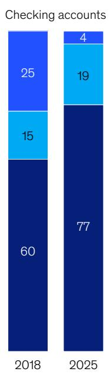

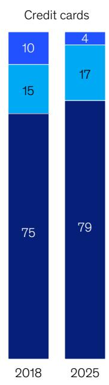  
Source: McKinsey Banking Consumer Decision Journey Survey, May 2025 (checking accounts, n = 2,954; credit cards, n = 3,168); McKinsey Banking Consumer Decision Journey Survey, Sept–Oct 2018 (n = values not available)

McKinsey & Company

What can banks do to counteract these trends? One key strategy is to get into more consumers' ICS. Banks that are most likely to end up in the ICS typically excel in four key areas:

\- Achieving high awareness. The largest competitors, which have the highest marketing visibility and the scale needed to commit to substantial marketing investments, have gained significant ground in the ICS. Data indicate that brands investing more in media tend to achieve higher awareness and consideration (Exhibit 15). Although scale helps, so does precisely targeted awareness—investing media spending where it delivers the biggest impact and using physical presence in markets where visibility drives consideration. For example, while branch numbers are declining in most markets, some banks in the United States are opening more branches, which can help increase brand awareness and customer mind share.

— Triggering action through precision-targeted word of mouth. Word-of-mouth recommendations are the main trigger for opening a checking account or credit card; 21 percent of card shoppers select a card recommended by family or friends, according to the 2025 CDJ survey. This natural advocacy has played a key role in the success of many fintechs, such as Cash App, Revolut, and Wise, which often reinforce the effect with referral programs. Banks can use precision to amplify word of mouth through data-driven referral programs and by targeting younger generations, especially Gen Z, for whom word-of-mouth influence is particularly strong.

## Exhibit 15

High media spending correlates with high awareness and consideration.

Awareness and customer consideration versus media spending for select US banks $^{1}$

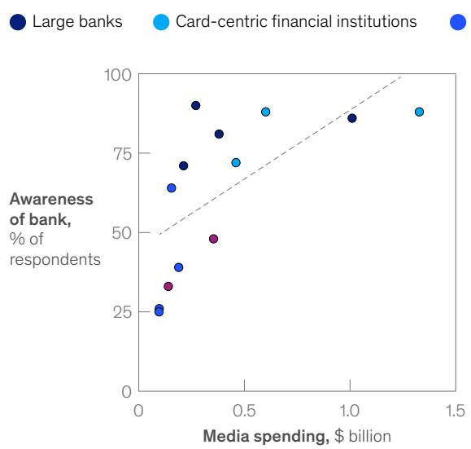

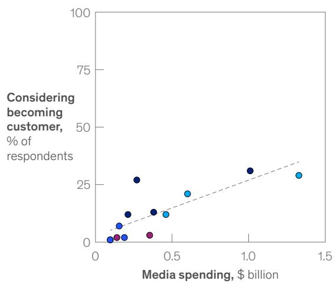  
$^{1}$ Media spending for the year ended in Mar 2025; includes internet display and search ads, online video, outdoor, paid social, print, podcasts, radio, streaming services, and television; excludes direct mail and affiliates.
Source: Kantar; McKinsey Banking Consumer Decision Journey Survey, May 2025; Pathmatics

## McKinsey & Company

# More than half of consumers now use gen AI tools, and they are eager for banks to offer such tools as well.

\- Aligning messaging precisely with touchpoints. Success in the CDJ also depends on making sure the bank's communications reinforce the most relevant benefits at the specific points in the decision journey where customers interact with the brand. When it comes to US checking account openings, for example, survey respondents indicated that being able to meet a banker in person at a branch was the second most important factor in choosing a bank, second only to a wide variety of product offerings.

\- Driving preference through primacy. Being a consumer's primary bank (that is, the bank holding most of their funds or associated with most of their payment transactions) makes a bank three to four times as likely as a competitor to be included in the ICS for further products, and twice as likely to cross-sell products. $^{53}$ Primacy therefore continues to be the cornerstone of retail banking profitability for most banks. Precision involves understanding which entry products are likely to lead to primacy for which customers. While a checking account is the entry point to primacy over 60 percent of the time, it's no longer the only one. Around 40 percent of consumers started their relationship with their primary bank through another product, most often a credit card or savings account. In a notable shift, more consumers are decoupling their salary deposit account from their primary account, opting to set recurring transfers from their traditional bank to a fintech that offers a better digital experience.

Next, we explore how AI is changing both consumer behavior and banks' responses.

## Bank customers and AI

Consumers are rapidly adopting gen AI for financial tasks, and most expect their banks to provide such tools, making AI capabilities a driver of switching behavior.

## Customers use gen AI and want more

More than half of consumers now use gen AI tools, and many consumers rely on models such as ChatGPT to help them manage their financial needs. But they are eager for banks to offer such tools as well: Most users would like their primary bank to offer AI solutions, and nearly all say they would eventually switch to another provider if their current bank didn't keep up with this

technological shift. Our 2025 global survey on gen AI usage in banking, which polled more than 30,000 consumers in seven countries, revealed that 51 percent of consumers use gen AI, and 23 percent use it for banking or finance-related activities (Exhibit 16). Among gen AI users who opened a new bank account in the past two years, 32 percent used gen AI to help them choose a bank.

## Exhibit 16

## More than half of Gen Zers, millennials, and Gen Xers use gen AI.

Awareness and adoption of gen AI, by generation, % of respondents

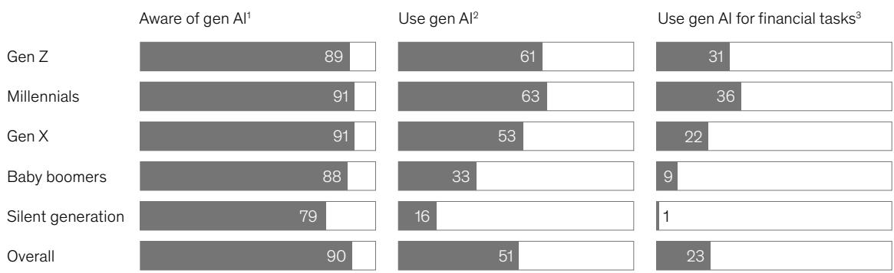

Top 3 financial uses of gen AI, by generation, %  
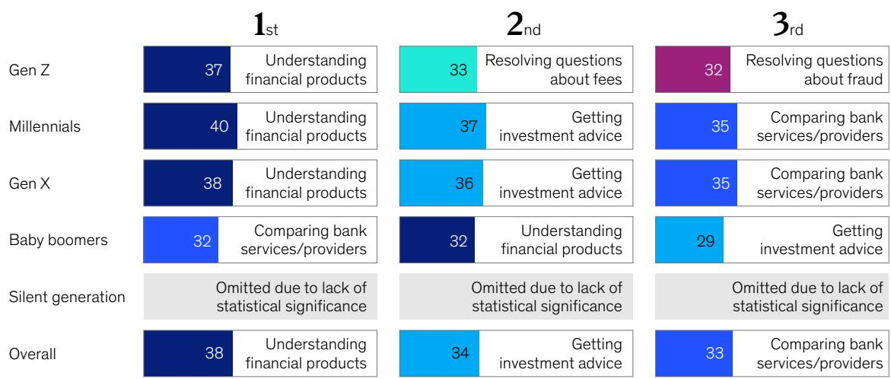

Source: McKinsey Global Banking Annual Review Survey, May 2025 (n = 30,021)

## McKinsey & Company

McKinsey & Company

Developing economies such as Brazil and India have a higher usage of gen AI for banking than developed markets like the Netherlands and Canada (Exhibit 17). This is partly due to generational differences in the adoption of gen AI.

## Exhibit 17

## Use of gen AI varies geographically, particularly for financial tasks.

Awareness and adoption of gen AI, by country, % of respondents

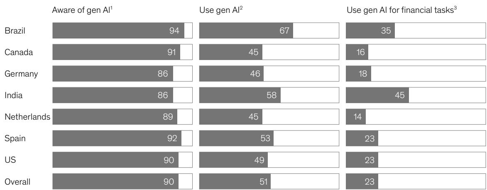

Top 3 financial uses of gen AI, by country, %  
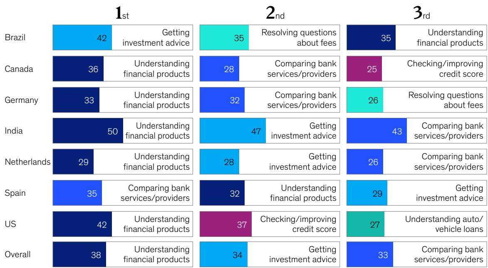  
"When asked "What is your awareness/use of gen AI tools?," respondents who selected "Heard of them but don't use them," "Use them occasionally," or "Use them frequently."  
$^{2}$ When asked “What is your awareness/use of gen AI tools?,” respondents who selected “Use them occasionally” or “Use them frequently.” Responses were limited to people who said they used AI tools at least occasionally.  
$^{3}$ When asked “How often do you use gen AI tools for banking or financial-related activities?,” respondents who selected “Very frequently (once a week or more)” or “Occasionally (once or twice a month).”  
Source: McKinsey Global Banking Annual Review Survey, May 2025 (n = 30,021)

## Customers would like their bank to do more with gen AI

Our research shows that 62 percent of gen AI users want their primary bank to offer gen AI solutions. Forty-four percent of gen AI users say they would rather interact with an AI voice agent immediately than wait less than a minute to speak with a human representative. This preference increases to 70 percent of gen AI users (35 percent of all consumers) when the wait time reaches ten minutes.

We also observe rapid growth in customers using gen AI for complex matters, such as financial planning (Exhibit 18).

Nearly all customers (97 percent) who used gen AI to help choose a new bank account say that the availability of AI features would influence their decision to switch banks in the future. Banks that can deliver the AI capabilities their customers want will be well positioned to capitalize on the growing demand for enhanced financial insights and services.

How else is AI changing consumer behavior and banks' business? One important development is that AI-powered search is starting to directly answer more consumers' queries (such as "How do I consolidate my loans?"). Consumers are clicking on fewer links, and if this trend continues, banks won't be able to rely on affiliates such as NerdWallet and Credit Karma to channel customers to them. Instead, they will need to use precision strategies to ensure their own online content and offers are optimized for AI-driven search.

## Exhibit 18

Many users of gen AI show enthusiasm about utilizing it in banking.

%, among those survey respondents who use gen AI for financial tasks (n = 9,813)

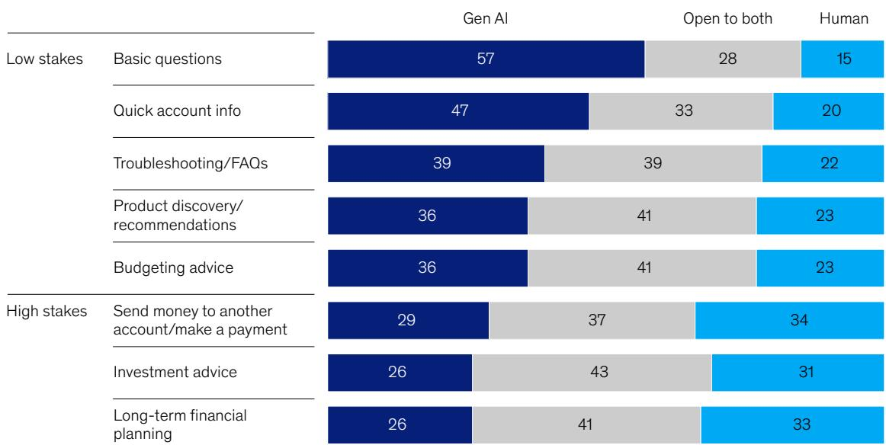  
Source: McKinsey Global Banking Annual Review Survey, May 2025 (n = 30,021)

## McKinsey & Company

Average number of touchpoints for existing products $^{2}$

Moreover, the fragmented media environment, in which streaming services and social media sites play a major role, means banks now need to supply different ad campaigns to different platforms, allowing AI-driven media buying to match the right message to the right customer at the right time.

## Mobile first is key, but don't forget about human interactions

Mobile has become the dominant channel in banking, and its role will accelerate as gen AI becomes more embedded in financial services. Customers who engage through mobile already deliver significantly higher value for banks, reinforcing the strategic importance of this channel. Despite the growing importance of mobile, branches remain critical in many geographies, particularly for activities such as opening checking accounts. While branches play less of a role in most countries, their enduring importance in markets such as Latin America, North America, and southern Europe highlights the need to understand regional differences and the specific reasons why many customers continue to value in-person interactions.

This dichotomy requires financial institutions to develop mobile-first integrated channels that smoothly connect digital and in-person services to meet evolving customer needs.

According to research from Finalta by McKinsey, the proportion of consumers using mobile devices such as phones and tablets for banking rose from 41 percent in 2020 to 63 percent in 2024 (Exhibit 19).

## Exhibit 19

Mobile banking is growing quickly, while other channels are not.

Global metrics for active users, activity, and share of core product sales across banking channels

Online banking

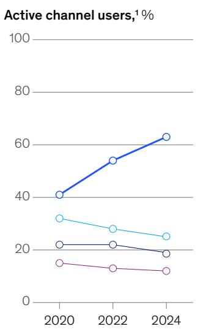

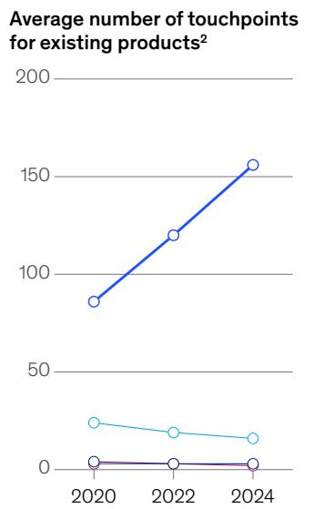

Contact centers

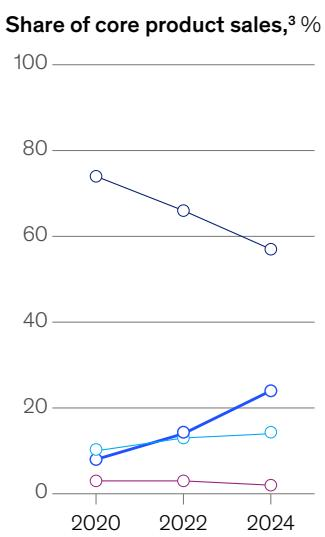  
$^{1}$ Share of active customers who have used the given channel within the past 90 days.

$^{2}$ For branches: average number of transactions—such as payments, deposits, or withdrawals—made annually in a branch by active customers, excluding account openings. For online banking: average number of total online log-ins made annually by active customers. For mobile banking: total mobile logins made annually by active customers. For contact centers: average number of inbound calls annually from active customers. $^{3}$ Core product sales (openings of checking accounts, savings accounts, credit cards, personal loans, mortgages, and non-life insurance policies) as a share of total product sales in each channel.

Source: Finalta by McKinsey

McKinsey & Company

Mobile-active consumers generate significantly more value for banks than their mobile-inactive counterparts. In some markets, they generate double the revenue. They also typically have more banking products and higher retention rates. As gen AI becomes more mainstream, mobile's dominance is likely to accelerate, due to its native security features such as voice and facial recognition.

Despite the rapid growth of digital channels, physical branches continue to play a vital role in many markets. They remain central to shaping customer choice: Large banks compete for visibility through high-profile locations to attract affluent clients, while smaller banks build local density to establish a strong community presence. In North America, branches accounted for 72 percent of checking account openings and 90 percent of new balances in 2024 (Exhibit 20), underscoring their importance to customer primacy. In other regions, such as Asia-Pacific and Europe, branches are less dominant than they are in North America but still account for a meaningful share of account openings and new balances.

Why are branches still important? Consumers tend to rely on them for important milestones and complex sales. They appreciate having someone to talk to during transactions that are complicated, unpredictable, or emotionally charged, such as financial planning or applying for a mortgage. Often, customers might start a process on the mobile app and then switch to a banker for guidance or reassurance. That makes it crucial to integrate mobile, in-branch, and contact center experiences so consumers can transition smoothly between digital and human-

## Exhibit 20

Branches still play an important role in account openings.

Checking account sales mix $^{1}$ and new balance mix, $^{2}$ by region, 2024, %

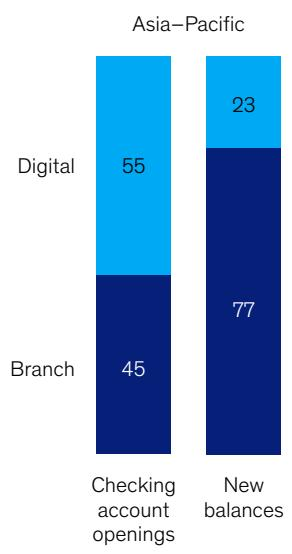

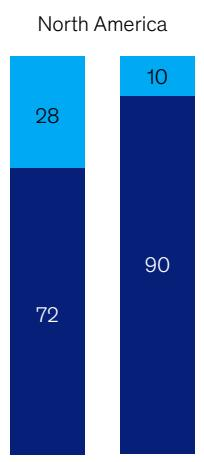

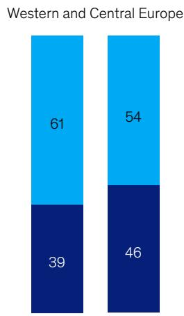  
$^{1}$ Share of checking account openings in the given channel in 2024 out of total checking account openings that year. $^{2}$ Share of new balances (balances added to a checking account within the first year of opening) brought to the bank via the given channel.
Source: Finalta by McKinsey

## McKinsey & Company

assisted touchpoints. Personal advice can also be delivered effectively through remote channels, which are proliferating in markets with low branch density but strong demand for human interaction, such as the Nordics.

## Generational disparities: Catering to evolving needs

Generation Z and millennials, who are poised to dominate the future customer base, bring with them a fundamentally different set of expectations and behaviors than older demographics (Exhibit 21).

These differences include:

— Gen Xers and baby boomers are more likely to view cost as the primary driver for product selection, while Gen Zers and millennials tend to prefer great customer service even if it costs more.

— Gen Zers and millennials are less comfortable than older generations with making financial decisions independently, so they might be more open to personal guidance or tools for decision-making.

## Exhibit 21

Bank customers show generational differences in viewpoints.

Views of banking customers in Western Europe, by generation, % of respondents

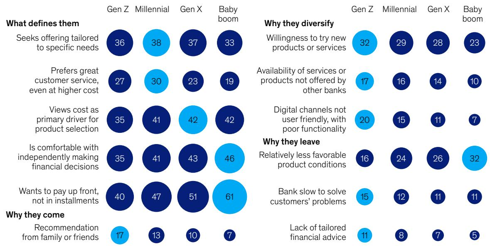  
Source: McKinsey Retail Banking Survey, 2023 (n = 18,129); Panorama by McKinsey

McKinsey & Company

— Younger generations are more open to trying new products and services and are more inclined to change providers for services not offered by their current bank.

\- Twenty percent of Gen Z and 15 percent of millennials would leave a bank if its digital channels weren't user-friendly or had poor functionality, a higher percentage than for older generations. Older generations are more likely to leave due to less favorable product conditions.

— Younger generations show a high level of interest in purchasing beyond-banking products and services from their banks, spanning areas such as property management, investment apps, and home improvement loans.

## Digital disruption: Competing with digital-native fintechs

Banks will need to move quickly to keep up with customer demands. However, incumbents' legacy systems, risk-averse mindsets, and slow-release cycles may leave many at a disadvantage. Banks have already lost some customers. Digital attackers such as Revolut in Europe and Nubank in Latin America have capitalized on successive episodes of unmet consumer demand to grow quickly. Revolut has more than 65 million customers worldwide, while Nubank has more than 122 million in Brazil, Mexico, and Colombia and serves about 60 percent of Brazilian adults.

These disruptors have helped reset customer expectations. Now, with their cloud-native technologies and agile development models, they are well positioned to use gen AI to separate more banks from their customers. Revolut, for example, is developing an AI-powered financial companion for 2025 and is deploying agentic AI tools that automate fraud detection, compliance, and contract management before escalating edge cases to humans. The first wave of fintechs relied on digital customer experience and word of mouth to gain market share. The next wave will be built on gen and agentic AI, with zero-touch operations that provide personalized advice, autonomous money movement, and real-time insights.

The US market has followed a somewhat different path of fintech disruption than Europe or Asia. While the first wave of fintechs struggled to gain traction, that relative immunity now appears to be ending as US consumers increasingly seek AI-powered services that fintechs are well positioned to deliver. Incumbent banks will need to offer more efficient models catering to customer needs before challengers do.

But even if incumbents can't move as quickly, they have one card up their sleeve that disruptors don't: trust. Disruptors will need to earn trust over time and generate word-of-mouth momentum to win over more customers.

## By using AI to supercharge personalization, banks can give customers access to the right products and services at the right time.

## Strategies for success with the new consumer

To succeed, banks must address the shift in consumer behavior. The following recommendations offer strategies for banks to adapt, grow, and earn consumers' trust and loyalty:

— Win consumer mind share. Get into the initial consideration set at all costs by increasing brand awareness and fostering word-of-mouth recommendations. Use every channel—from brand building to physical presence—to develop a reputation that makes customers want to choose you.

\- Fully embrace mobile as channel orchestrator. Adopt a mobile-first strategy that recognizes mobile's role as the gateway for customer engagement. Ensure mobile seamlessly connects with other channels, such as branches and contact center, when required for high-touch, high-emotion interactions.

— Build AI into personalized experiences. Embed AI into client journeys with strong security and privacy guardrails before the next wave of fintechs do.

By using AI to supercharge personalization, banks can give customers access to the right products and services at the right time. Historically, banks organized customers into broad categories, such as mass and mass affluent, and delivered largely generic products and experiences. In contrast, the future will be defined by precision: tailoring products, services, and risk to individual customer profiles by using data to move from segmentation to microsegmentation and ultimately to a “customer segment of one.”

One good illustration of precision as a differentiator is a historical one: Capital One's successful entry into the US credit card market decades ago. By applying advanced analytics to personalize product design and risk criteria, Capital One targeted underserved customers, gained share rapidly, and built an edge. Today, the bank continues to lead with data-driven personalization, using AI and cloud technologies to refine offerings and strengthen digital experiences.

Similar patterns have appeared in telecommunications, where providers that shifted from broad segmentation to individualized offers reshaped competition. Banking—with its multiple levers for personalization, including risk—has even greater potential to turn precision into long-term advantage. With the precision toolbox, banks can offer more precisely tailored products and services to the right customers at the right time, leading to improved customer satisfaction, primacy, and profitability.

For example, banks can aggregate signals from multiple data sources—such as in-house accounts, transaction histories, and accounts with other financial providers—to detect subtle indicators of significant life changes. They can then use gen AI to interpret these signals in real time to not only identify behavioral risks but also craft an experience custom made for each customer, enabling the delivery of hyperpersonalized offers and communications.

Today, using AI tools, banks that deploy precision in messaging, targeting, timing, and channel presence will capture consumers' mind share early, while those that rely on scale or generic campaigns risk being left behind.

The banking industry's next growth curve won't be won by scale but by precision. Leaders that embed precision into strategies involving technology, customer engagement, capital allocation, and M&A will capture outsize rewards, while slow movers clinging to the old playbook risk decline. In this new era, precision isn't just a strategy—it's the avenue to profitable growth. If banks can put the precision toolbox to good use, the sector's massive valuation gap can begin to close, resulting in true value creation for the banks that get it right.

## Authors

Darius Imregun
Partner, Boston
darius\_imregun@mckinsey.com

Ido Segev
Senior partner, Boston
ido\_segev@mckinsey.com

Jon Steitz
Senior partner, Bay Area
jonathan\_steitz@mckinsey.com

Klaus Dallerup
Senior partner, Copenhagen
klaus\_dallerup@mckinsey.com

Marti Riba
Partner, Barcelona
marti\_riba@mckinsey.com

Miklós Dietz
Senior partner, Vancouver
miklos\_dietz@mckinsey.com

Pradip Patiath
Senior partner, Miami
pradip\_patiath@mckinsey.com

Saptarshi Ganguly
Senior partner, Boston
saptarshi\_ganguly@mckinsey.com

Michael Kirchner
Associate partner, New York
michael\_kirchner@mckinsey.com

Suhas Gudhe
Associate partner, Miami
suhas\_gudhe@mckinsey.com

Valeria Laszlo
Panorama senior asset leader, Budapest valeria\_laszlo@mckinsey.com

## Regional leadership contacts

Asia
Renny Thomas
Senior partner, Mumbai
renny\_thomas@mckinsey.com

Europe, Middle East, & Africa
Stephanie Hauser
Senior partner, London
stephanie\_hauser@mckinsey.com

Latin America
Felipe Villarreal
Senior partner, Panama City
felipe\_villarreal@mckinsey.com

North America
Ishaan Seth
Senior partner, New York
ishaan\_seth@mckinsey.com

# Acknowledgments

The authors would like to thank the following colleagues for their contributions to this report:

## Partners and senior partners

Amit Garg, Dan Williams, David Remley, Federico Berruti, Felicia Tan, Felipe Costa, Felipe Villarreal, Fernando Ferrari-Haines, Fuad Faridi, Ishaan Seth, James Kaplan, Javier Martinez Arroyo, Jonathan Godsall, Joydeep Sengupta, Marukel Nunez Maxwell, Max Flötotto, Paul Maia, Renny Thomas, Roberto Marchi, Roger Rudisuli, Stephanie Hauser, Uzayr Jeenah, Vik Sohoni, Vinayak HV, Violet Chung, and Vishnu Kamalnath.

## Analytics and solutions colleagues

Anubhav Das, Belian Kiss-Borlase, Blanka Koji, Csanad Kortvelyessy, Debopriyo Bhattacharyya, Enrique Briega, Garima Ailawadhi, Istvan Rab, Jay Datesh, Luca Pato, Mayar Abdelaziz, Nurzhan Onashabay, Rauhan Nazir, Sanjana Agarwal, Sergey Khon, Shikha Gupta, Tanuj Sachdeva, and Urvashi Jain.

## Production team

Annie Tan, Anouk Frieden, Eszter Teszarik, Gretal Tang, Julia Shamayskaya, Lisa Kondo, Mark Staples, Matteo Camera, Polina Skladneva, Pomponia Orehoczki, Roberto Truque, and Teresa Diviu.

The authors also wish to thank the following banking equity analysts and experts for their insights: Brian Foran and John McDonald at Truist Securities; Guy Moszkowski, cofounder of Autonomous Research US and now senior advisor at McKinsey; Mathias Nielsen at Nordea; and Mike Mayo at Wells Fargo Securities.

This report was edited by Jana Zabkova, a senior editor in the New York office, and developed and produced by the McKinsey Global Financial Services Marketing and Communications team:

## Matt Cooke

Director of communications and marketing
matt\_cooke@mckinsey.com

## Monica Runggatscher

Public relations lead
monica\_runggatscher@mckinsey.com

## Chris Depin

Communications coordinator
chris\_depin@mckinsey.com

This annual review of the global banking industry is based on data and insights from McKinsey Panorama, McKinsey's proprietary banking research arm, as well as the experience of clients and practitioners from all over the world. We welcome comments about this research at fs\_external\_relations@mckinsey.com.

McKinsey & Company

October 2025

Copyright © 2025 McKinsey & Company. All rights reserved.

McKinsey.com

X @McKinsey

@McKinsey

in @McKinsey

This publication is not intended to be used as the basis for trading in the shares of any company or for undertaking any other complex or significant financial transaction without consulting appropriate professional advisors.

No part of this publication may be copied or redistributed in any form without the prior written consent of McKinsey & Company.