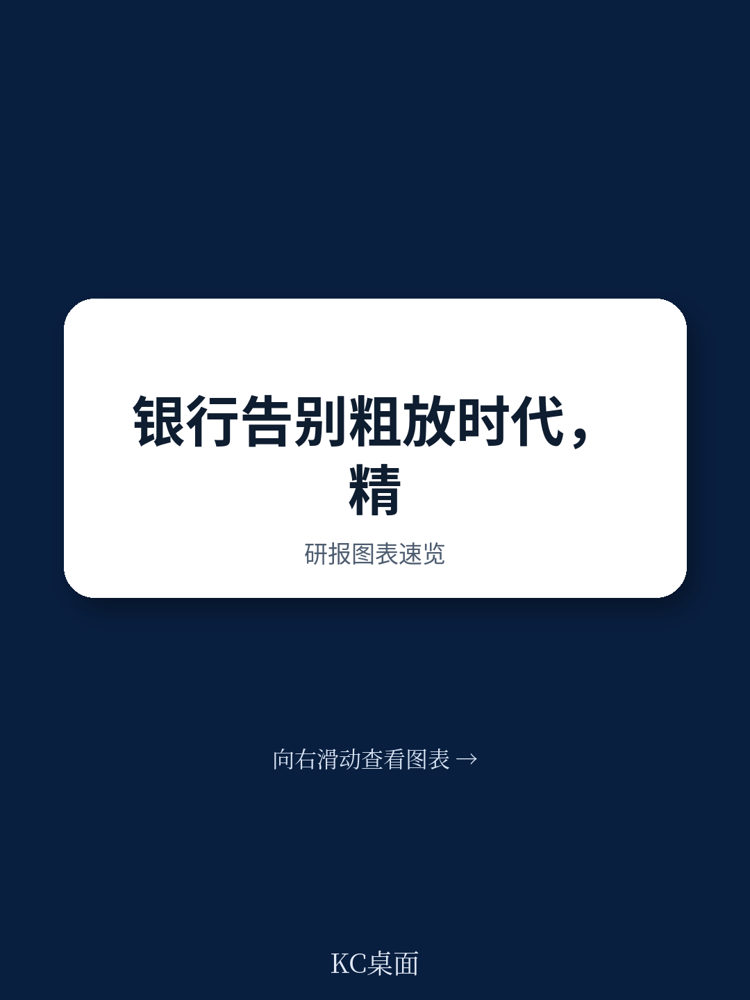

# 麦肯锡：研究主题与行业变化观察

2024年全球银行业净利润达到约1.2万亿美元，创下所有行业的历史最高纪录。但资本市场对银行业的估值仍比其他行业平均低近70%。麦肯锡在最新发布的《全球银行业年度评论2025》中认为，市场并非忽视这些数字，而是怀疑其可持续性——银行近年的高回报主要依赖利率上升、不确定性成本偏低等外部顺风，而这些条件正在消退。

报告提出一个核心判断：过去依赖规模扩张和宏观押注的策略已经失效。未来十年，银行能否跑赢资金成本，取决于能否从“规模驱动”转向“精准驱动”。麦肯锡将这套方法论称为“精准工具箱”，涵盖技术投入、客户经营、资本效率与并购策略四个维度。

> **KC评论：** 报告的核心不是预测利率走向或宏观环境周期，而是提出一个可操作的战略框架。对于银行管理层而言，关键问题不是“市场何时回暖”，而是“在顺风消退后，我的银行靠什么赚钱”。

## 1. 技术投入需要从广撒网转向手术刀式聚焦

银行业在所有行业中技术支出占收入比例最高，但生产力提升并不明显。报告指出，生成式AI和智能体AI虽然前景广阔，但银行不应“千花齐放”式投入。精准的做法是识别出真正能产生盈利影响的应用场景——例如零接触运营、实时不确定性监控、智能优先的客户服务——并果断缩减其他方向的研究。

报告估算，AI在银行业的应用可带来某些成本类别最高70%的毛减，但由于技术成本上升，净效果是银行整体成本基础下降15%至20%。这些节省不会持久——竞争会逐步将收益转移给客户。

## 2. 客户忠诚度下降，银行需要从分层走向个性化

美国新开支票账户的客户中，只有4%会直接选择现有银行而不比较其他选项，而2018年这一比例是25%。报告认为，客户现在更看重购买旅程中最初考虑的那几家银行。谁能进入客户的“初始考虑集”，谁就更可能赢得业务。

麦肯锡提出“客户细分到个人”的概念，即利用数据和AI将产品、条款、服务和不确定性定价都个性化到个体层面。报告引用一家美国地区银行的案例：该行通过数据驱动个性化，在五年内将市场份额从3%提升至7%，并建立了领先地位。

## 3. 资本效率需要微观层面的逐笔审视

传统上银行通过大规模重新配置或宽泛的资产负债表调整来管理资本。报告建议改为逐产品、逐客户、逐笔不确定性加权资产的审查，释放被低效占用的资本并投向回报更高的地方。AI智能体可以持续优化不确定性加权资产、模拟情景并发现低效领域。

报告还提到，与保险公司和私人信贷提供者合作，以及向银行以外的产品领域扩展，也是提升资本效率的补充手段。

## 4. 并购目标应从扩大规模转向填补能力缺口

过去银行追求大规模并购以增加规模，但效果参差不齐。报告认为，精准的并购应专注于填补特定能力缺口——技术、专业产品线或特定区域市场，并根据当地市场动态调整整合与协同方案。

麦肯锡在报告中指出，精准不是大银行的专利。在AI时代，即使是小型银行，也可以通过将精准嵌入战略的每个维度，获得不成比例的回报。规模不再是护城河，精准才是新的差异化来源。

> **KC评论：** 报告反复强调“精准”而非“规模”，但精准的前提是数据基础设施和AI能力。对于多数中小银行而言，第一步不是全面铺开AI，而是先梳理清楚自己有哪些数据、哪些客户、哪些产品真正赚钱。没有这个基础，任何精准战略都只是口号。

报告认为，如果银行能够有效运用精准工具箱，银行业长期存在的估值折价有望开始收窄。但窗口期有限——AI正在改变客户行为，第三方智能体可能在未来十年内削减全球银行业利润池约1700亿美元。行动迟缓的银行，可能面临资金成本以上的持续不确定性。

For informational purposes only. Portions may be generated,translated,summarized,or edited with AI assistance based on source materials and may contain omissions or errors. Please verify independently. This is not investment,legal,tax,accounting,or other professional advice.

