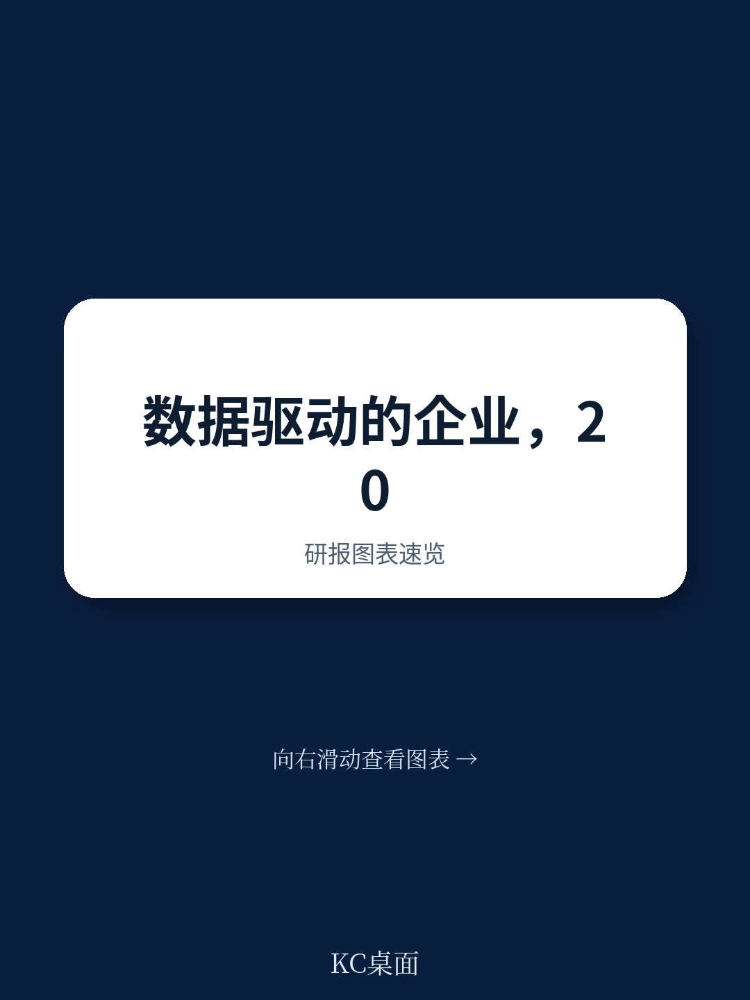
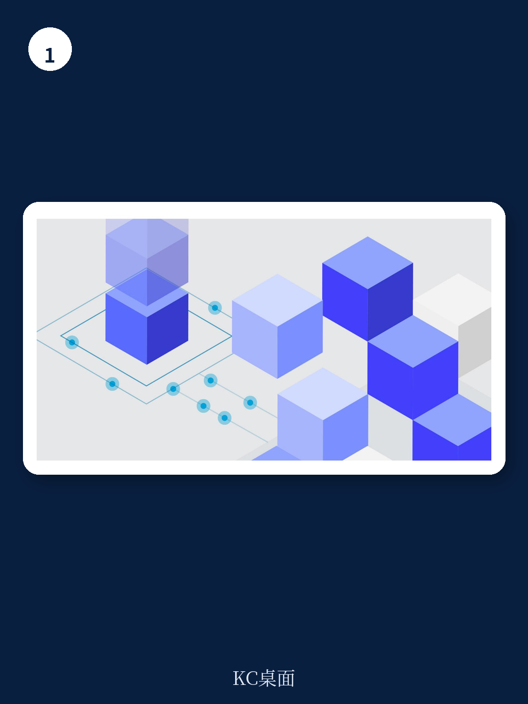

# 麦肯锡：2025年业务与近期数据观察

麦肯锡在最新报告中提出一个判断：到2025年，智能工作流和人机无缝协作将像公司资产负债表一样成为标配，大多数员工将用数据优化工作的几乎所有方面。这个时间点并不遥远，但报告认为这正是关键——那些最快取得进展的企业，将从数据支持的能力中捕获最高价值。报告以七项特征勾勒出未来数据驱动企业的完整画像，并指出已有部分公司展现出其中若干特征，更多企业正在开启这一旅程。

## 1. 数据嵌入每一决策、交互和流程

当前多数企业只在局部应用数据驱动方法，从预测系统到AI自动化，价值未被充分挖掘，效率损失明显。许多业务问题仍通过传统方式解决，耗时数月甚至数年。到2025年，几乎所有员工将自然且规律地利用数据支持工作。他们不再默认制定长达数年的路线图，而是被赋权去思考创新数据技术如何在数小时、数天或数周内解决挑战。组织能够做出更优决策，同时自动化日常活动和常规决策，员工得以专注于创新、协作和沟通等更“人性化”的领域。

报告列举了具体场景：门店经理利用实时分析识别忠诚客户并引导其发现感兴趣的商品，同时简化或完全自动化结账流程；电信公司网络运维人员借助自主网络自动识别需要维护的区域，并根据使用情况突出网络扩建机会；采购经理通过数据驱动流程即时审批采购，从而专注于构建更有效的合作伙伴策略。

> **KC评论：** 这一特征的核心不是技术本身，而是“默认使用数据”的文化转变。报告强调，关键推动因素包括清晰的数据战略、支持高级AI用例的技术基础设施，以及广泛的组织数据素养。这意味着企业需要从顶层设计开始，而非仅靠IT部门推动。

## 2. 数据实时处理与交付

当前由于遗留技术架构的限制，只有一小部分来自连接设备的数据被实时摄取、处理、查询和分析。企业常常不得不在速度和计算强度之间做出选择，这延迟了更复杂的分析并阻碍了实时用例的实施。到2025年，庞大的连接设备网络将实时收集和传输数据。新的技术架构如kappa或lambda架构将支持实时分析，云计算的持续成本下降和更强大的内存数据工具（如Redis、Memcached）上线，使得即使是最复杂的分析也能合理地为所有组织所用。

报告指出，工厂维护团队将利用连接传感器网络实时检测维护需求；产品开发者将利用非结构化数据和无监督机器学习算法，从网络数据中检测深藏的模式，形成比今天更丰富的客户理解；资金分析师将使用增强现实或虚拟现实工具，可视化涉及多个变量的战略决策，而非局限于传统的二维仪表盘。

## 3. 灵活数据存储实现集成即用数据

当前尽管数据激增主要由非结构化或半结构化数据驱动，但大多数可用数据仍以结构化方式组织在关系数据库工具中。数据工程师花费大量时间手动探索数据集、建立关系并连接它们。到2025年，数据从业者将越来越多地利用多种数据库类型，包括时间序列数据库、图数据库和NoSQL数据库，实现更灵活的数据组织方式。这使得团队能够更轻松、更快速地查询和理解非结构化与半结构化数据之间的关系，加速新AI驱动能力的开发。

报告特别提到，结合灵活数据存储与实时技术进步，企业可以开发“客户360”数据平台和数字孪生——物理实体（如制造设施、供应链甚至人体）的实时数据模型。这使企业能够利用传统机器学习或更先进的强化学习技术，进行复杂的模拟和假设场景分析。例如，机构使用图数据库和通用数据模型，将来自多个来源的客户数据流式传输并整合为统一的360度客户视图；运输物流公司利用实时位置数据和嵌入车辆的传感器，开发供应链或运输网络的数字孪生。

## 4. 数据运营模式将数据视为产品

当前组织的数据功能（如果存在）通常通过自上而下的标准、规则和控制来管理数据。数据往往没有真正的“所有者”确保其更新和可用。数据集被存储在分散、孤立的昂贵环境中，用户难以快速找到、访问和整合所需数据。到2025年，数据资产将被组织和支持为产品，无论它们是由内部团队还是外部客户使用。这些数据产品拥有专门的团队或“小队”，负责嵌入数据安全、演进数据工程，并实施自助服务访问和分析工具。

报告举例：零售公司的专门团队开发“产品360”数据产品，并确保数据资产持续演进以满足关键用例需求；医疗保健组织建立产品团队，开发、维护和演进“患者360”数据产品以改善健康结果。关键推动因素包括识别和优先考虑数据业务案例的数据战略、对组织数据来源的理解，以及建立数据产品所有者和团队的运营模式。

## 5. 首席数据官角色扩展为价值创造

当前首席数据官及其团队作为成本中心运作，负责制定和跟踪合规政策、标准和程序以管理数据并确保其质量。到2025年，首席数据官及其团队将作为拥有损益责任的业务单元运作。该单元与业务团队合作，负责构思数据使用的新方式、制定整体企业数据战略，并通过数据服务和数据共享货币化来孵化新的收入来源。

报告描述了具体场景：医疗保健首席数据官与业务部门合作，为患者、支付方和提供者提供新的订阅服务，包括定制治疗方案、更准确地标记错误编码的医疗交易以及改善药物安全；银行首席数据官代表政府机构和其他合作伙伴商业化内部数据服务，如欺诈监控和反洗钱服务；消费品首席数据官与销售团队合作，利用数据推动销售转化，并共同承担达成目标指标的责任。

> **KC评论：** 这一转变意味着首席数据官的角色从成本中心转向利润中心。报告强调，关键推动因素包括业务部门领导的数据素养、用于识别和归因数据成本的宏观环境模型、顶尖数据人才，以及采用不确定性研究风格的孵化器运营模式来支持实验和创新。

## 6. 数据生态系统成员成为常态

当前数据常常被孤立，即使在组织内部也是如此。与外部合作伙伴和竞争对手的数据共享安排虽然正在增加，但仍然不常见且通常有限。到2025年，大型复杂组织将使用数据共享平台促进数据驱动项目的协作，无论是在组织内部还是组织之间。数据驱动企业积极参与数据宏观环境，促进数据池化以为所有成员创造更有价值的洞察。数据市场使得数据的交换、共享和补充成为可能，最终使企业能够构建真正独特和专有的数据产品并从中获得洞察。

报告举例：制造商通过开放制造平台与合作伙伴和同行共享数据，构建全球供应链的更全面视图；制药和医疗保健组织汇集各自数据（如制药研究人员收集的临床试验数据和医疗保健提供者收集的匿名患者数据），使每家公司都能更好地实现其目标；资金服务机构利用数据交换创建新能力，例如为有社会意识的读者提供上市公司的环境、社会和治理评分。

## 7. 数据管理优先化并自动化以保障隐私、安全和韧性

当前数据安全和隐私通常被视为合规问题，由新兴的监管数据保护要求和消费者对信息收集使用的认识驱动。数据安全和隐私保护要么不足，要么过于单一，而非针对特定数据集定制。为员工提供安全数据访问是一个高度手动的过程，容易出错且耗时。手动数据韧性流程使得快速、完整地恢复数据变得困难，造成影响员工生产力的长时间数据中断不确定性。到2025年，组织心态将完全转向将数据隐私、伦理和安全视为必需能力领域，由不断演进的监管期望、消费者对数据权利认识的提高以及安全事件日益高昂的代价驱动。

报告指出，自助服务配置门户将使用预定义“脚本”管理并自动化数据配置，在近实时内安全地为用户提供数据访问，极大提高用户生产力。自动化的近乎持续备份程序确保数据韧性；更快的恢复程序在几分钟内建立并恢复“最后良好副本”，而非几天或几周，从而在技术故障发生时最小化不确定性。AI工具变得可用以更有效地管理数据，例如通过自动化识别、纠正和修复数据质量问题。这些努力使组织能够建立对数据及其管理方式的更大信任，最终加速新数据驱动服务的采用。

这份报告为希望构建数据驱动能力的企业提供了一个清晰的路线图。七个特征并非孤立存在，而是相互支撑：数据嵌入决策需要实时处理能力，实时处理需要灵活数据存储，灵活存储需要将数据视为产品的运营模式，而这一切又需要首席数据官角色的转变、数据生态系统的参与以及自动化数据管理的保障。对于企业而言，关键不是同时推进所有特征，而是识别自身最薄弱的环节，从那里开始构建数据驱动的基础。

For informational purposes only. Portions may be generated,translated,summarized,or edited with AI assistance based on source materials and may contain omissions or errors. Please verify independently. This is not investment,legal,tax,accounting,or other professional advice.

