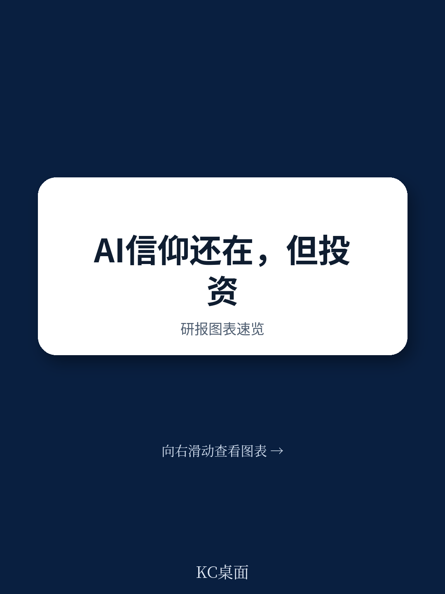
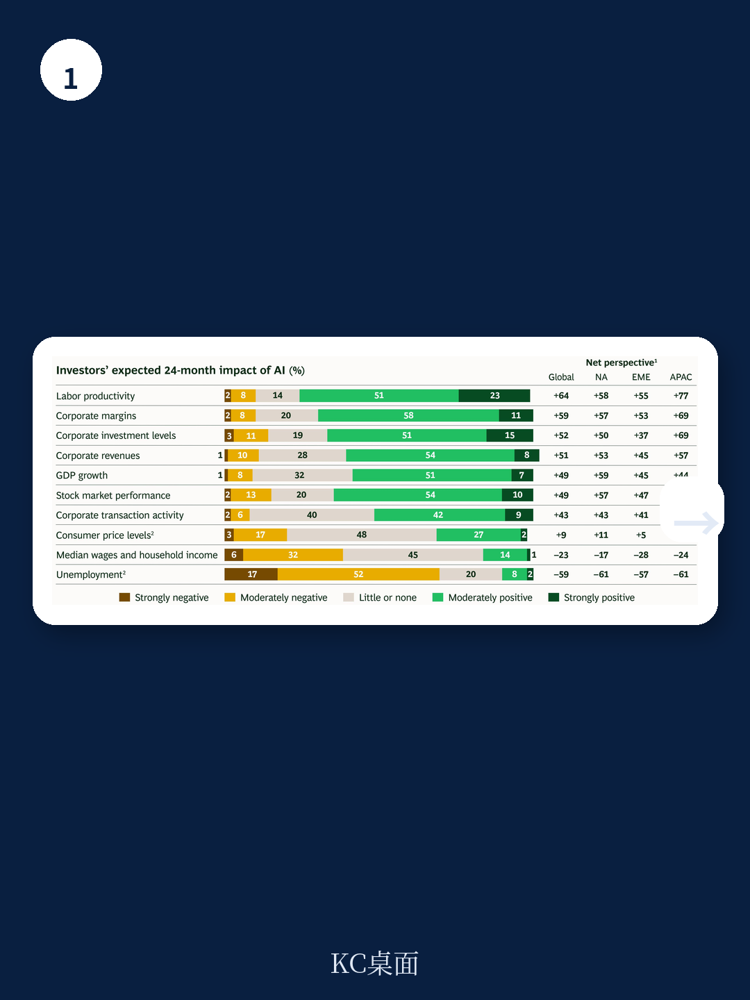
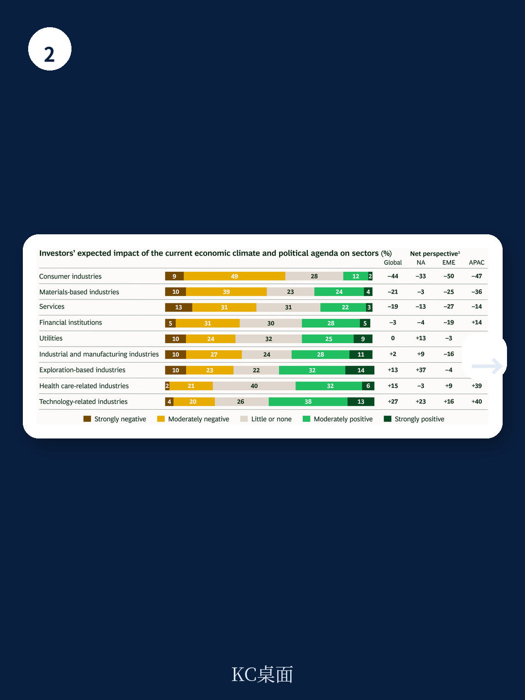

# 波士顿咨询：AI技术与行业应用观察

波士顿咨询2026年全球读者调查在3月23日至4月10日完成，覆盖544位机构读者，管理资产合计约35万亿美元。调查窗口正值标普全球1200指数较1月高点下跌约6%，但此后该指数已创下新高。这份报告的核心信号是：读者对AI的长期信念没有动摇，但对市场定价中AI溢价的容忍度正在下降，且对AI能否转化为可持续竞争优势持审慎态度。

调查显示，读者对未来三年的市场情绪仍然偏多，尤其在北美和亚太地区。但一个关键矛盾在于：读者对市场整体三年期股东总回报（TSR）的预期却相对温和。这种“看多但不追高”的姿态，反映出市场定价与基本面预期之间的裂痕正在扩大。

## 1. 读者认为市场对AI的定价过于乐观

在影响资本市场的关键因素中，AI开发与监管被45%的读者列为前三重要因素，较2024年调查上升22个百分点，增幅在所有因素中最大。但与此同时，56%的读者认为市场对AI的定价过于乐观，净乐观度高达41%，远高于其他任何宏观因素。

报告进一步指出，约三分之二的读者认为当前市场估值和AI预期可能阻碍未来回报。这意味着，如果AI无法在短期内转化为可量化的基本面改善，估值倍数压缩将成为TSR的主要影响。报告明确写道，未来公司的TSR将更依赖于增长、利润率扩张和自由现金流生成等基本面改善，而非估值扩张。

> **KC评论：** 读者并非不看好AI，而是认为市场已经提前透支了AI带来的大部分利好。对于非AI基础设施公司而言，管理层需要回答一个更具体的问题：AI研究何时、以何种幅度体现在营收和利润表中，而不是停留在战略叙事层面。

## 2. 读者对AI执行能力存疑，且不愿为AI牺牲利润率

调查显示，大多数读者会主动评估所投公司的AI战略，并认为这些战略仍有改进空间。但读者对AI执行能力存在明显担忧：多数人认为公司缺乏将AI转化为竞争优势的执行力，同时认为当前AI研究规模过于激进，且显著稀释利润率是不可接受的。

报告特别指出，读者希望公司将AI资本支出视为一项有问责回报的研究，而非不计成本的押注。他们反对通过加杠杆来支撑AI投入，也反对以牺牲短期利润率为代价换取AI布局。这一态度与读者整体偏好低杠杆、稳定分红的资本配置策略高度一致。

## 3. 增长仍是第一优先级，但回报效率权重上升

在研究考量因素中，长期有机增长前景以54%的提及率稳居第一，较2024年上升2个百分点。但值得关注的是，研究资本回报率（ROIC）的提及率上升了8个百分点，成为增幅最大的单项指标。自由现金流转换、生成和回报表现也获得17%的提及。

报告还揭示了一个关键权衡：虽然大多数读者认为公司应同时兼顾短期EPS和长期研究，但当被迫二选一时，近三倍的读者选择优先支持长期增长。这意味着，只要公司能讲清楚增长路径和回报逻辑，市场愿意容忍短期利润不确定性——但前提是研究必须有清晰的回报路径，而非盲目扩张。

## 4. 资本配置偏好：有机研究、组合重塑、低杠杆、稳定分红

读者对资本配置的偏好非常明确。调查显示，读者希望公司优先进行有机研究，积极通过剥离非核心业务和聚焦式补强并购来重塑组合观察，同时避免高杠杆——净债务/EBITDA保持在3倍以下。在股东回报方面，读者希望维持历史水平的股息，并机会性地回购公司，而非激进回购。

报告还指出，约60%的读者对积极股东持支持态度，但只有不到一半的人认为积极股东能真正推动中期或长期TSR改善。这意味着，管理层不能简单依赖积极股东来驱动价值，而需要主动强化近中期基本面，以应对日益增加的审查不确定性。

这份调查传递的信息是清晰的：AI叙事已经过了“只要讲故事就能获得溢价”的阶段。读者正在用更严格的财务纪律来审视每一笔AI投入，要求看到可量化的回报路径。对于企业而言，当前最紧迫的任务不是继续抬高AI研究规模，而是证明现有研究正在转化为增长、利润率和现金流的改善。
