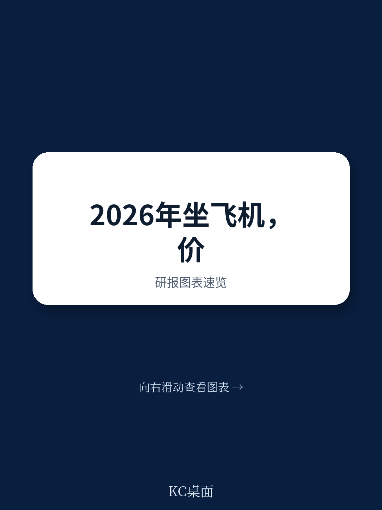
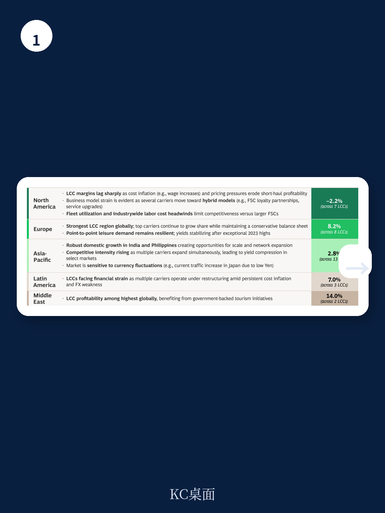
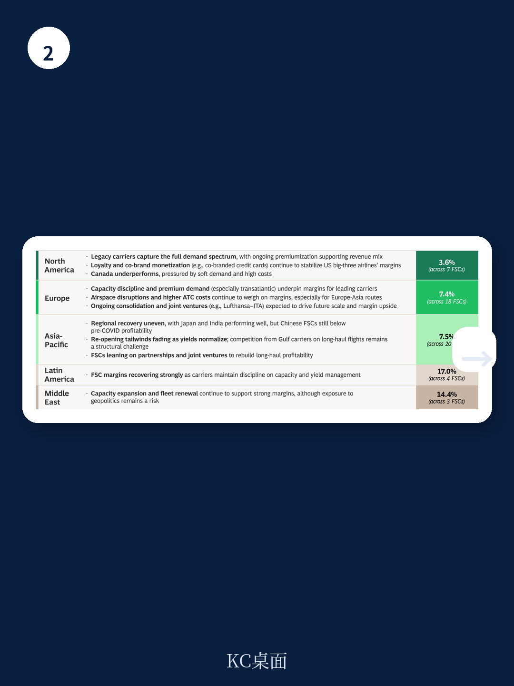

# 波士顿咨询：研究主题与行业变化观察

全球航空业正处于一个微妙的平衡点。波士顿咨询（BCG）最新发布的《Air Travel Demand Outlook 2026》报告指出，行业整体盈利能力尚可，但利润分布极不均匀，且单位成本增速已超过单位收入增速。这份报告的核心判断是：2026年及以后，航空业的竞争焦点将从“恢复运力”转向“重构成本结构”，而能否利用新机型、AI技术和规模整合来重塑成本曲线，将决定不同航司在下一阶段的相对位置。

报告覆盖了五个关键趋势：宏观因素带来的波动性、航司利润分化、成本不确定性与AI应用、OEM交付缓解，以及新机型对航线网络的重新塑造。其中，成本问题是最具穿透力的主线。

## 1. 单位成本增速全面超过单位收入增速

BCG的数据显示，在截至2025年第三季度的过去12个月中，全球所有地区的单位成本（CASK，不含燃油）增速均超过了单位收入（PRASK）增速。北美地区在PRASK增长上领先，但CASK增长同样显著。欧洲和亚太地区则面临更明显的成本挤压。

报告特别拆解了成本构成：机组人员成本是核心通胀驱动因素，2025年同比上涨5%至7%，主要源于欧洲和北美的大规模合同续签。地面处理成本上涨4%至7%，由机场和第三方服务商转嫁工资与通胀调整。维护成本整体稳定，但在亚太地区存在一定不确定性。

这意味着，单纯依靠票价上涨已无法覆盖成本增长。航司必须从运营结构层面寻找永久性的成本改善，而非临时性的费用削减。

## 2. 全服务航司与低成本航司的利润分化加剧

利润分化是成本不确定性的直接映射。BCG统计了全球52家全服务航司（FSC）和36家低成本航司（LCC）的过去12个月平均运营利润率。

全球范围内，FSC以8.4%的平均利润率领先LCC的4.6%。但区域差异巨大：北美FSC利润率仅为3.6%，而LCC平均亏损2.2%，部分LCC已开始探索混合模式（如与FSC的忠诚度合作、服务升级）。欧洲是唯一LCC利润率（8.2%）超过FSC（7.4%）的地区，头部玩家均能维持15%以上的利润率。亚太地区FSC以7.5%领先LCC的2.8%，但区域内部分化严重——日本和印度表现强劲，中国FSC仍未恢复至疫情前水平。

> **KC评论：** 北美LCC的困境最值得关注。报告提到，成本通胀（如工资上涨）和定价不确定性侵蚀了短途航线盈利能力，而FSC通过高端化、忠诚度计划和联名信用卡稳定了收入结构。这暗示，在成本结构无法根本性改善的情况下，北美LCC可能面临更剧烈的商业模式调整或整合。

## 3. AI与规模整合成为结构性降本的两大杠杆

BCG认为，航司可以通过两种路径实现永久性的成本结构改善。

第一是AI驱动的运营优化。报告引用了BCG的分析：在AI应用上领先的航司，其IT预算比同行高1.2倍，AI投入占IT预算的比例更高，预计可带来4.9%的收入增长和5.8%的单位成本下降，最终转化为约5.4个百分点的运营利润率优势。一个具体案例是KLM与BCG合作的Pathfinder机队分配工具，该工具综合考虑运营规则、维护计划、机组排班、乘客行为、延误预测等多重因素，据称可减少30%至40%的延误。

第二是行业整合。报告列举了三种整合逻辑：合并重叠网络以获得规模（如韩国的Air Busan、Air Seoul、Jin Air合并）；合并互补网络以增强产品深度和忠诚度竞争力（如阿拉斯加航空收购夏威夷航空）；以及通过整合增强对OEM的议价能力。

## 4. 新机型正在重塑航线网络的宏观环境性

报告特别关注了两款新机型。A321XLR预计未来五年交付约500架，其4700海里的航程使得跨大西洋窄体航线成为可能——这对FSC意味着可以开辟“长而薄”的航线，对LCC则意味着可以扩展远程市场。IndiGo已订购69架A321XLR，计划2026年1月开通孟买至雅典航线。

另一款是A350-1000超远程版本，目前唯一买家是澳航Qantas，12架飞机预计2026至2028年间交付，将执飞悉尼至伦敦和纽约的直飞航线。这些新机型带来的不仅是航程扩展，更是全新的单位成本结构——窄体机执飞跨洋航线，其座位成本显著低于宽体机。

## 5. 宏观波动与基础设施可靠性仍是系统性变量

报告将宏观因素归纳为三类：宏观环境不确定性、地缘政治动荡和基础设施可靠性。这三者通过改变旅客购买模式和航班可用性来制造波动。

具体而言，美国关税政策导致进口商品成本上升约6倍，波及飞机零部件和基础设施材料；中东、巴基斯坦和欧洲的空域关闭可能持续甚至出现变化；加拿大与美国之间的跨境需求预计无法恢复至2024年水平，但整体北美需求保持稳定，部分需求将转向墨西哥、亚太和欧盟。

基础设施方面，报告引用了多个数据点：欧洲每月约7000次航班取消，月间波动幅度达50%至60%；北美每月约1.1万次取消，11月因美国政府停摆导致空管人员短缺，取消量激增200%。报告认为，2026年机场可靠性问题将持续，空管人员短缺、IT系统脆弱性和建设活动是主要制约因素。

---

对于行业决策者而言，BCG的报告提供了一个清晰的行动框架：在宏观波动成为常态的前提下，航司需要同时管理成本基础、捕捉高增长区域需求、评估新机型对网络的影响，并将AI从试点项目转化为可量化的运营优势。那些能够在这几个维度上同步推进的航司，更有可能在利润率分化加剧的环境中占据有利位置。

For informational purposes only. Portions may be generated,translated,summarized,or edited with AI assistance based on source materials and may contain omissions or errors. Please verify independently. This is not investment,legal,tax,accounting,or other professional advice.

