## Built to Change: Cities of Choice 4.0

Global City Ranking

Full report

## Table of contents

Section 1 - Our approach and key insights
Section 2 - Top 20 cities by dimensions
Section 3 - Ranking by groups
Section 4 - Key forward-looking themes
Section 5 - Appendix: ranking methodology

## Our approach and key insights

## Three editions of Cities of Choice have been published, and a fourth edition, Built to Change, was launched at World Urban Forum 13 in Baku in May

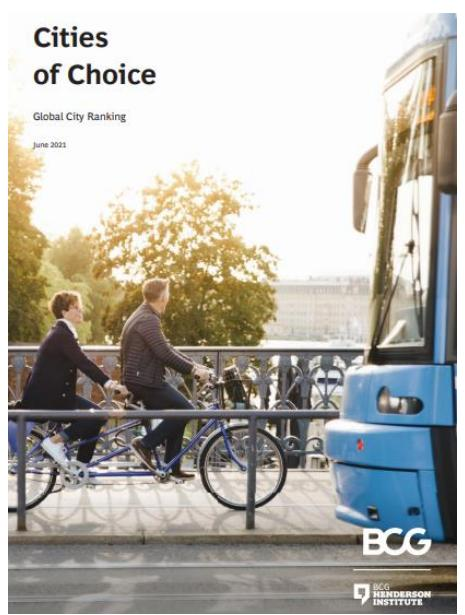  
2019-2020

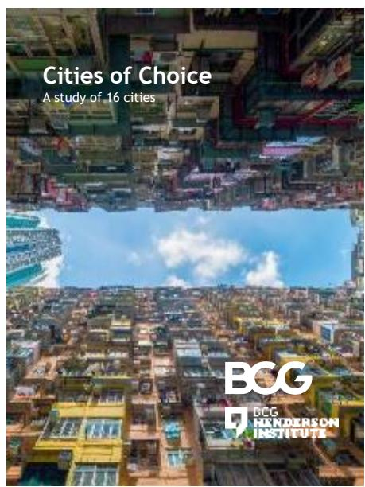  
2020-2021

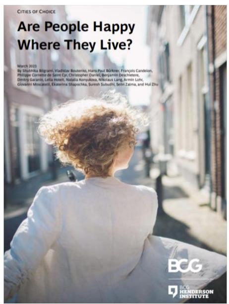  
2022-2023

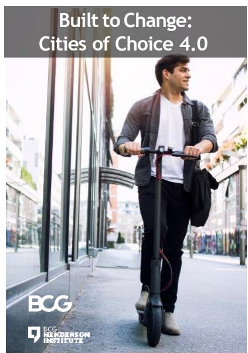  
2025-2026
Deep dives

• Housing affordability

\- Longevity in the city - Online adepts - New AI and robotics wave and cities’ labor market

\- Connected cities

BCG's Cities of Choice 4.0 assesses cities across five dimensions of resident value proposition

• 80 cities

• 200+ indicators

\- 80% objective data

• 20% of data from survey of 24,000 residents

• 10 years longitudinal data

\- 5+ million data points

%

#

#

#

Speed of change

Engagement with governments

Social capital

Livability

Economic
opportunities

High speed of positive change outrunning residents' expectations across the other four dimensions of residents' needs

Governance favoring open and trusted dialogue with authorities where every resident can be heard and contribute to city development (e.g., responsiveness, confidence, and trust)

Conditions for social interaction, mutual respect, equality, and inclusivity (e.g., social connections; culture and history engagement; personal safety)

Affordability, accessibility, and quality of infrastructure and services (e.g., education, entertainment, recreation, goods and services)

Living standards and opportunities for professional realization (e.g., work and career opportunities, business opportunities, availability of resources)

## This edition also assesses 26 elements across five dimensions

Economic opportunities

Opportunities for work, career, and earnings

Equality income

Opportunities for business

Availability of personal loans

#

Livability

Housing

Mobility

Medical care

Education and development

Public spaces

Consumption of goods and services

Entertainment and recreation

Ecology

Cleanliness and hygiene

Comfortable climate

Resilience to emergency situations

Social capital

Social connections

Inclusivity and equality

Identity with culture and history

Safety

Engagement with governments

Ability to influence events

Government services

Business environment

Speed of change

Speed of change in economic opportunities
Speed of change in livability

Speed of change in social capital

Speed of change in engagement with governments

## Cities of Choice 4.0 covers 80 cities

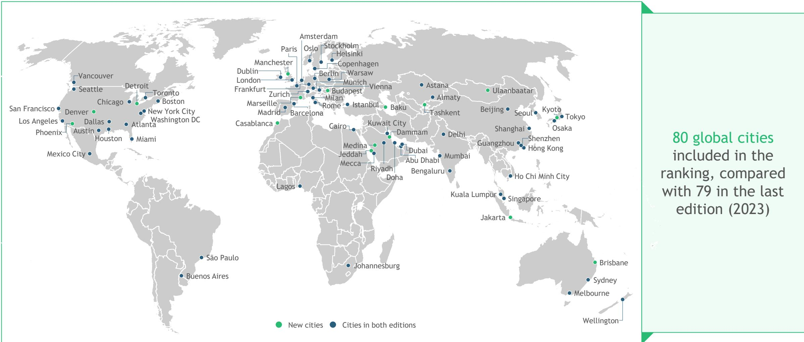

80 global cities included in the ranking, compared with 79 in the last edition (2023)

## Key insight: Speed of change is becoming a winning formula for the future

1. Urban competition has shifted from infrastructure to lived outcomes

\- Success is no longer measured by assets (roads, airports, utilities) but by what they deliver to residents

\- Cities compete on time saved, friction reduced, and quality of everyday life

• Focus has moved from technical performance to resident-level value creation

2. Value today means surplus time, richer experiences, and investable prosperity

\- Mobility = surplus time enabled by smart transport and seamless digital services

\- Comfort = depth and variety of life (culture, community, learning, nature, opportunity)

\- Prosperity = investable surplus, not just salaries but also real take-home life value after costs

## 3. Speed of change is the new source of sustainable advantage

## #

\- Residents compare cities in real time; expectations evolve quickly

\- Faster learning and adaptation drives stronger resident advocacy

\- High-advocacy cities win by consistently improving outcomes—and proving they can do so again

## Advocacy $^{1}$ rises fast in most cities

Leaders remained leaders with increased score. The leading reasons are high speed of change, cultural traditions. Significant increase in advocacy in European cities (potentially post-COVID effect) and, in particular, in Baku, Seattle, Frankfurt, Astana, Munich, Almaty, Austin, and Vienna. Slight drop in Guangzhou, Shenzhen, and Milan

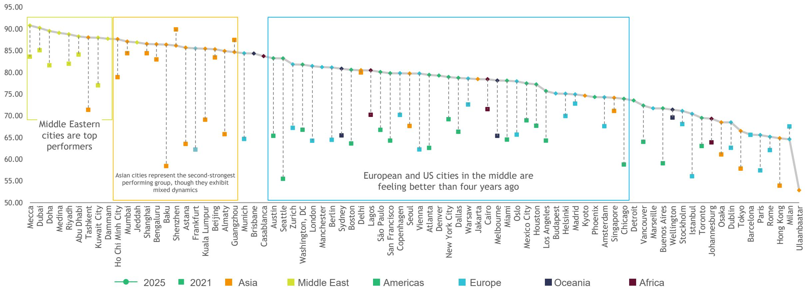  
1. Resident advocacy measured with five questions: 1) Are you satisfied to live in [City]? 2) How likely are you to recommend [City] to a friend from another city as a place to live and work? 3) Have you recommended or criticized [City] as a place to live and work in the last 12 months? 4) Do you see your children living in [City] 20 years from now? 5) Do you believe [City] will prosper in the future?

## A high advocacy score indicates residents' commitment to a city

Cities with higher advocacy also see a greater share of residents planning to stay in the foreseeable future Advocacy is not just an attitude—it reflects genuine commitment and confidence in a city’s long-term prospects, which is a strong foundation for economic and social prosperity.  
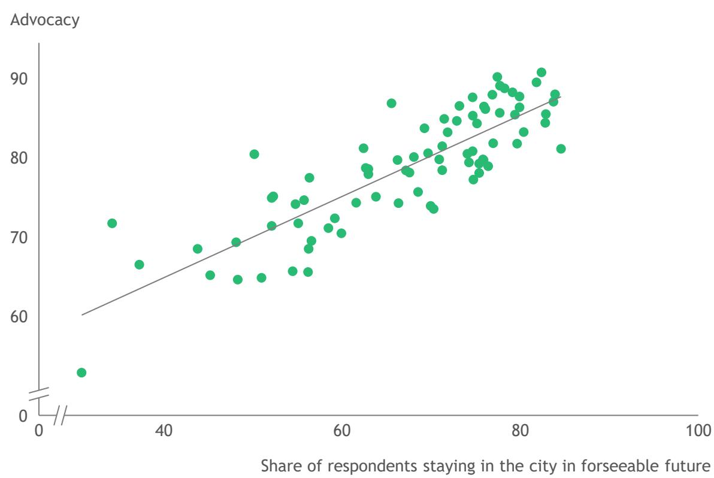

Higher advocacy aligns closely with higher overall resident satisfaction
Cities that score well on advocacy are those delivering consistently positive everyday experiences; advocacy captures both emotional attachment and quality-of-life outcomes.  
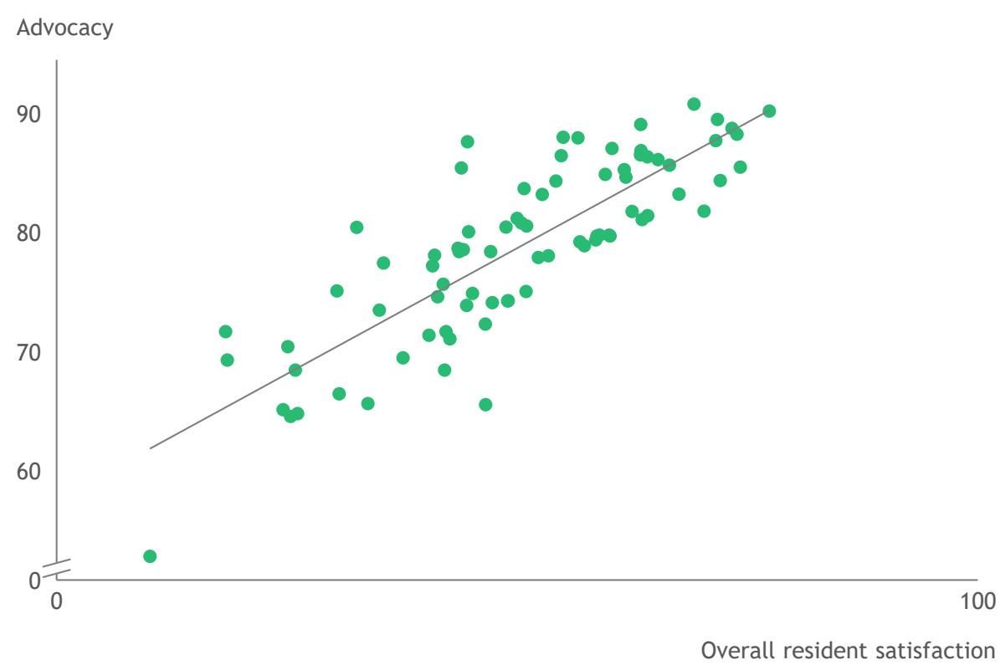  
1. Share of respondents staying in the city in foreseeable future: measured through share of respondents who selected “No, I plan to stay in [City] in the foreseeable future” to question, “Would you seriously consider relocation to another city / country?” 2. Overall resident satisfaction measured by average score of all opinion-based survey questions.

Online adepts $^{1}$ outperform other residents in advocacy across more than 70 cities  
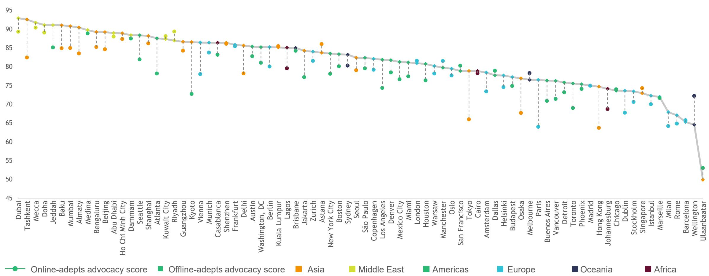  
1. Residents who perform at least four of the following activities entirely online, with no more than two activities entirely offline.  
Activities include groceries, shopping, health care, fitness, entertainment (films, series, theatre, sports), banking and personal finance (paying bills, sending money, applying for loans, etc.), city government services (utilities, applying for permits and IDs, reporting city issues, voting, etc.).

## Section 2

## Top 20 cities by dimension

## Executive summary (I/III) Ranking results by dimension

## Overall

\- The West leads in economic and livability fundamentals; ME, China, and Central Asia drive the fastest change

\- Advocacy and citizen engagement rise across most cities, led by the ME and Asia; Europe and the US show moderate recovery from post-COVID sentiment lows

\- Middle Eastern, Chinese, and Central Asian cities, led by Tashkent, show the fastest transformation over the past decade, especially in livability and economic opportunities

## Speed of change

\- Europe’s pace remains slower, though Zurich and German cities advance through improvements in social capital and engagement with governments

\- Top 10 in speed of change in engagement with governments are UAE and KSA cities

\- Top 15 led by European and US cities and Dubai; Doha drops on weaker ecosystems and business momentum, while Europe gains; Central Asia improves on reforms sentiment

\- Clear income-equality tradeoff: US cities earn more but are more unequal; EU cities are more equal but have lower income

\- Not all cities with strong business ecosystems translate them into higher incomes; even efficient performers can lose their income edge if business conditions stagnate

## Economic opportunities

• Business environment is driven by emergence of new coworking spaces (4.5x on average since 2021) and business incubators

\- Europe (except Istanbul) gained on new indicators: venture capital investment, airport connectivity, and economic land use score confirming strong fundamentals but also early-stage entrepreneur activity increased

• Sentiment on work and business opportunity availability improved across cities, notably in Central Asia

## Executive summary (II/III) Ranking results by dimension

## Overall

• Europe retains leadership (London, Zurich, Oslo); Shanghai and Central Asian cities rapidly close the gap - Developing cities get strongest gains in livability, and if trend continues, talent flow will be redirected strongly to developing cities in search for better living conditions

\- Housing affordability and mobility pressures intensify globally; education and health care gains support Europe’s lead and Asia’s catch-up

Housing: largest challenge across continents

• Higher per square meter prices (+25% in Europe and North America)

\- Increased mortgage rates (doubled in Europe and North America, +40% globally)

• Housing drives happiness and already now 62 cities out of 80 develop city-level housing affordability programs

Mobility: situation worsens despite talks about “new mobility”

\- Despite public transport initiatives, time to commute has increased by $6\%$ across all cities and growing number of cars (by $7.5\%$ from 2023) is the main contribution

• However, 15-minute city and public transport promotion initiatives start paying off and their adepts are improving (Vienna, Paris)

## Livability

Outdoor: conditions deteriorate despite physical improvements and high importance for residents - Air quality deteriorating: over 90% of cities show NO $_{2}$ levels higher than WHO guidelines; in 80% cities in ME and Asia, the highest PM2.5 and PM10

\- Europe and Canada lead globally in public and green spaces, with Europe holding 10 of the top 15 spots; ME lags in green zones; Riyadh, Tashkent, and Warsaw showed strong gains in access to public spaces

\- Despite continuous effort in public and green spaces, time outside decreased by 9.2%, while weight of public spaces in residents' needs is high in all cities

Initial traction on health span and longevity capital

\- Cities across all groups promote healthy lifestyles (55 cities) and prevention programs; high participation in wellness programs (56%) and telehealth access (80+%); in 80 cities, residents had checkups this year

\- Most cities introduced healthy lifestyle programs for older adults (92% participation in wellness programs among elderlies) to be socially and health-wise active and build longevity capital

## Consumption

\- US and European cities lead in offline retail density, while ME and Asia are very much behind. At the same time, they are leaders in ordering goods online, while US and European cities are outsiders. Accessibility of grocery stores: the first 30 are in Asia, ME, and LA $_{14}$

Note: $NO_{2}$ = nitrogen dioxide; WHO = World Health Organization; PM = particulate matter; LA = Latin America.

## Executive summary (III/III) Ranking results by dimension

## Social capital

• European cities rebound post-COVID, while Asian and Middle Eastern cities continue to lead on social connectedness and resilience

\- Inclusivity improves globally, with major gains in developing cities (Almaty, Cairo, Riyadh) and stronger accessibility across transport and employment

\- In social capital, cities are “departing” from countries and forming their own “social capital”

## Engagement with governments

\- Western cities still lead, but the Middle East is catching up quickly; Dubai enters top 10, while some Western cities (Rome, Milan, Budapest) decline

\- Technology penetration drives improvement: +20% feel able to influence decisions; 3x better at solving problems online; 2x more participation apps

\- Online adepts demonstrate stronger advocacy than general population; apparently work from home and online convenience create sufficient comfort for people to praise their cities

• Significant improvement in ability to influence events:

\- +20% increase in residents reporting that they feel able to influence decisions in their city

\- 3x improvement in ability to solve the most common city problems using online tools

\- 2x improvement in the availability of dedicated mobile apps that enable citizens to influence city development

## Results by dimension for 80 cities—top 20 cities

## Speed of change

<table><tr><td>City</td><td>Total dimension score</td></tr><tr><td>Shenzhen</td><td>92</td></tr><tr><td>Riyadh</td><td>91</td></tr><tr><td>Tashkent</td><td>88</td></tr><tr><td>Doha</td><td>87</td></tr><tr><td>Guangzhou</td><td>85</td></tr><tr><td>Shanghai</td><td>83</td></tr><tr><td>Mecca</td><td>81</td></tr><tr><td>Beijing</td><td>81</td></tr><tr><td>Jeddah</td><td>80</td></tr><tr><td>Mumbai</td><td>80</td></tr><tr><td>Dammam</td><td>79</td></tr><tr><td>Medina</td><td>77</td></tr><tr><td>Astana</td><td>77</td></tr><tr><td>Abu Dhabi</td><td>73</td></tr><tr><td>Bengaluru</td><td>72</td></tr><tr><td>Almaty</td><td>71</td></tr><tr><td>Jakarta</td><td>67</td></tr><tr><td>Delhi</td><td>64</td></tr><tr><td>Kuwait City</td><td>64</td></tr><tr><td>Baku</td><td>64</td></tr></table>

## Economic opportunities

<table><tr><td>City</td><td>Total dimension score</td></tr><tr><td>London</td><td>81</td></tr><tr><td>Zurich</td><td>80</td></tr><tr><td>Paris</td><td>80</td></tr><tr><td>Atlanta</td><td>79</td></tr><tr><td>Dubai</td><td>77</td></tr><tr><td>Amsterdam</td><td>76</td></tr><tr><td>Frankfurt</td><td>75</td></tr><tr><td>San Francisco</td><td>75</td></tr><tr><td>Munich</td><td>73</td></tr><tr><td>Washington, DC</td><td>72</td></tr><tr><td>Austin</td><td>71</td></tr><tr><td>Seattle</td><td>71</td></tr><tr><td>Dublin</td><td>71</td></tr><tr><td>Oslo</td><td>70</td></tr><tr><td>New York City</td><td>70</td></tr><tr><td>Boston</td><td>69</td></tr><tr><td>Seoul</td><td>68</td></tr><tr><td>Copenhagen</td><td>66</td></tr><tr><td>Denver</td><td>66</td></tr><tr><td>Madrid</td><td>66</td></tr></table>

## Livability

<table><tr><td>City</td><td>Total dimension score</td></tr><tr><td>Zurich</td><td>74</td></tr><tr><td>London</td><td>74</td></tr><tr><td>Oslo</td><td>73</td></tr><tr><td>Frankfurt</td><td>72</td></tr><tr><td>Vienna</td><td>72</td></tr><tr><td>Washington, DC</td><td>71</td></tr><tr><td>Copenhagen</td><td>70</td></tr><tr><td>Sydney</td><td>69</td></tr><tr><td>Berlin</td><td>69</td></tr><tr><td>Munich</td><td>68</td></tr><tr><td>Vancouver</td><td>64</td></tr><tr><td>Stockholm</td><td>64</td></tr><tr><td>Seattle</td><td>64</td></tr><tr><td>Shanghai</td><td>63</td></tr><tr><td>Brisbane</td><td>62</td></tr><tr><td>Austin</td><td>62</td></tr><tr><td>Denver</td><td>61</td></tr><tr><td>Dubai</td><td>61</td></tr><tr><td>Melbourne</td><td>61</td></tr><tr><td>San Francisco</td><td>61</td></tr></table>

## Social capital

<table><tr><td>City</td><td>Total dimension score</td></tr><tr><td>Beijing</td><td>78</td></tr><tr><td>London</td><td>72</td></tr><tr><td>Berlin</td><td>70</td></tr><tr><td>Shanghai</td><td>70</td></tr><tr><td>Copenhagen</td><td>70</td></tr><tr><td>Vienna</td><td>67</td></tr><tr><td>Shenzhen</td><td>65</td></tr><tr><td>Doha</td><td>64</td></tr><tr><td>Sydney</td><td>64</td></tr><tr><td>Amsterdam</td><td>63</td></tr><tr><td>Stockholm</td><td>62</td></tr><tr><td>Dubai</td><td>62</td></tr><tr><td>Paris</td><td>61</td></tr><tr><td>Seoul</td><td>61</td></tr><tr><td>Munich</td><td>60</td></tr><tr><td>New York City</td><td>60</td></tr><tr><td>Helsinki</td><td>59</td></tr><tr><td>Zurich</td><td>59</td></tr><tr><td>Madrid</td><td>59</td></tr><tr><td>Manchester</td><td>58</td></tr></table>

## Engagement with governments

<table><tr><td>City</td><td>Total dimension score</td></tr><tr><td>Frankfurt</td><td>80</td></tr><tr><td>Zurich</td><td>79</td></tr><tr><td>Munich</td><td>77</td></tr><tr><td>Austin</td><td>77</td></tr><tr><td>San Francisco</td><td>75</td></tr><tr><td>Riyadh</td><td>75</td></tr><tr><td>London</td><td>74</td></tr><tr><td>Atlanta</td><td>73</td></tr><tr><td>Dubai</td><td>72</td></tr><tr><td>Washington, DC</td><td>71</td></tr><tr><td>Abu Dhabi</td><td>70</td></tr><tr><td>Singapore</td><td>70</td></tr><tr><td>Miami</td><td>69</td></tr><tr><td>Denver</td><td>69</td></tr><tr><td>New York City</td><td>67</td></tr><tr><td>Seoul</td><td>67</td></tr><tr><td>Berlin</td><td>67</td></tr><tr><td>Mecca</td><td>66</td></tr><tr><td>Copenhagen</td><td>66</td></tr><tr><td>Dammam</td><td>66</td></tr></table>

## Speed of change, 2014-2024—top 20 cities

<table><tr><td>Rank</td><td>City</td><td>Total dimension score</td><td>SoC in economic opportunities</td><td>SoC in livability</td><td>SoC in social capital</td><td>SoC in engagement with governments</td></tr><tr><td>1</td><td>Shenzhen</td><td>92</td><td>86</td><td>100</td><td>100</td><td>90</td></tr><tr><td>2</td><td>Riyadh</td><td>91</td><td>84</td><td>100</td><td>81</td><td>100</td></tr><tr><td>3</td><td>Tashkent</td><td>88</td><td>97</td><td>51</td><td>84</td><td>95</td></tr><tr><td>4</td><td>Doha</td><td>87</td><td>82</td><td>88</td><td>100</td><td>84</td></tr><tr><td>5</td><td>Guangzhou</td><td>85</td><td>78</td><td>80</td><td>100</td><td>86</td></tr><tr><td>6</td><td>Shanghai</td><td>83</td><td>78</td><td>73</td><td>99</td><td>84</td></tr><tr><td>7</td><td>Mecca</td><td>81</td><td>77</td><td>67</td><td>76</td><td>96</td></tr><tr><td>8</td><td>Beijing</td><td>81</td><td>63</td><td>99</td><td>100</td><td>84</td></tr><tr><td>9</td><td>Jeddah</td><td>80</td><td>73</td><td>82</td><td>74</td><td>92</td></tr><tr><td>10</td><td>Mumbai</td><td>80</td><td>66</td><td>100</td><td>87</td><td>82</td></tr><tr><td>11</td><td>Dammam</td><td>79</td><td>67</td><td>72</td><td>79</td><td>96</td></tr><tr><td>12</td><td>Medina</td><td>77</td><td>68</td><td>68</td><td>76</td><td>91</td></tr><tr><td>13</td><td>Astana</td><td>77</td><td>67</td><td>83</td><td>92</td><td>76</td></tr><tr><td>14</td><td>Abu Dhabi</td><td>73</td><td>65</td><td>83</td><td>61</td><td>87</td></tr><tr><td>15</td><td>Bengaluru</td><td>72</td><td>63</td><td>78</td><td>83</td><td>75</td></tr><tr><td>16</td><td>Almaty</td><td>71</td><td>57</td><td>99</td><td>86</td><td>65</td></tr><tr><td>17</td><td>Jakarta</td><td>67</td><td>60</td><td>76</td><td>69</td><td>70</td></tr><tr><td>18</td><td>Delhi</td><td>64</td><td>51</td><td>74</td><td>75</td><td>70</td></tr><tr><td>19</td><td>Kuwait City</td><td>64</td><td>37</td><td>90</td><td>76</td><td>77</td></tr><tr><td>20</td><td>Baku</td><td>64</td><td>49</td><td>83</td><td>68</td><td>70</td></tr></table>

Note: SoC = speed of change.

## Key outcomes

\- Top 10 is dominated by ME and Chinese cities, reflecting the fast pace of the comprehensive changes the cities have been pursuing

\- Although the speed of change is slow in Europe in general, Zurich and German cities gained significantly due to improvements in social capital and engagement with governments

SoC in economic opportunities

• Middle East and US cities are leading with Tashkent on top

\- Top 10 cities witnessed real annual income growth of average 3%, negative growth in unemployment rates of on average 5%

\- The biggest declines in score happened to Canadian cities, where real wages decreased and inequality slightly increased

SoC in livability

\- Asia and ME are leading as before, Lagos gained significantly due to new metro opening and relatively better performance in housing

\- In North America, cities' scores declined because of significant jump in mortgage rates and impact on household income growth

SoC in social capital

\- Biggest gains are with German cities along with Central Asian and ME due to improvements in reported safety and tolerance in the society

\- At the same time, Europe and United States report in increased growth of crime and murder

SoC in engagement with governments

\- Top 10 is dominated by KSA and UAE cities due to their improved sentiment toward the government services and trust in authorities

\- The sentiment is confirmed by the growth in the E-Government Development Index (EGDI)

## Economic opportunities—top 20 cities

<table><tr><td>City</td><td>Total dimension score</td><td>Opportunities for work and income</td><td>Business opportunities</td><td>Equality of income</td><td>Availability of personal loans</td></tr><tr><td>London</td><td>81</td><td>81</td><td>97</td><td>68</td><td>60</td></tr><tr><td>Zurich</td><td>80</td><td>89</td><td>72</td><td>70</td><td>77</td></tr><tr><td>Paris</td><td>80</td><td>95</td><td>76</td><td>70</td><td>61</td></tr><tr><td>Atlanta</td><td>79</td><td>89</td><td>95</td><td>30</td><td>56</td></tr><tr><td>Dubai</td><td>77</td><td>82</td><td>86</td><td>45</td><td>77</td></tr><tr><td>Amsterdam</td><td>76</td><td>74</td><td>82</td><td>83</td><td>69</td></tr><tr><td>Frankfurt</td><td>75</td><td>63</td><td>75</td><td>81</td><td>100</td></tr><tr><td>San Francisco</td><td>75</td><td>81</td><td>100</td><td>29</td><td>50</td></tr><tr><td>Munich</td><td>73</td><td>63</td><td>67</td><td>88</td><td>94</td></tr><tr><td>Washington</td><td>72</td><td>88</td><td>79</td><td>45</td><td>39</td></tr><tr><td>Austin</td><td>71</td><td>88</td><td>67</td><td>33</td><td>58</td></tr><tr><td>Seattle</td><td>71</td><td>86</td><td>74</td><td>38</td><td>53</td></tr><tr><td>Dublin</td><td>71</td><td>80</td><td>65</td><td>51</td><td>75</td></tr><tr><td>Oslo</td><td>70</td><td>81</td><td>49</td><td>61</td><td>78</td></tr><tr><td>New York City</td><td>70</td><td>79</td><td>93</td><td>20</td><td>41</td></tr><tr><td>Boston</td><td>69</td><td>82</td><td>86</td><td>31</td><td>40</td></tr><tr><td>Seoul</td><td>68</td><td>69</td><td>58</td><td>75</td><td>77</td></tr><tr><td>Copenhagen</td><td>66</td><td>70</td><td>53</td><td>51</td><td>86</td></tr><tr><td>Denver</td><td>66</td><td>74</td><td>78</td><td>36</td><td>49</td></tr><tr><td>Madrid</td><td>66</td><td>64</td><td>59</td><td>73</td><td>73</td></tr></table>

## Key outcomes

\- Overall: Top 15 led by European and US cities and Dubai; income inequality clear gap for most cities leading economic opportunity

Opportunities for work, career, and income

• US still leads, with three European leaders (Paris, Zurich, and Oslo); Dubai joins top 10

\- Sentiment $^{1}$ improves compared to COVID levels, but overall scores still decline in Asia, parts of Europe and North America

Business opportunities for residents

\- Clear lead of North America and Europe, vs. more diversified mix previously

\- Europe (except Istanbul) gained on new indicators: VC investment, airport connectivity, and economic land-use score, confirming strong fundamentals but also overall sentiment and TEA increased

• Sentiment on work and business opportunity availability improved across cities, notably in Central Asia

## Equality of income

• Europe leads; German cities show strong gains

• US cities improved but still rank more unequal; bottom 15 remains dominated by US and Chinese cities

Availability of personal loans

• Top 10 remains dominated by German and Chinese cities

\- Sentiment $^{1}$ improved despite rising borrowing costs, especially in Central Asia

## Economic opportunities | Efficient converters adjust their business opportunities and turn them into incomes

Opportunities for work, career, and income (index)  
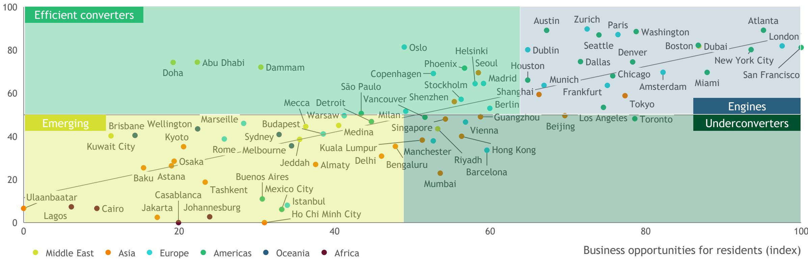  
Note: Opportunities for work and income index measures unemployment; real HH income; food share; GDP (PPP)/worker; surveys (opportunities, self-realization); WFH split/infrastructure; internet speed; business opportunities index measures business opportunities survey; TEA rate; services in GDP%; number of startups; coworking situations, new patents, VC investment; AI-vulnerability survey; land use; retail vacancy, airport connectivity.

## Economic opportunities | US cities earn more but have higher inequality, while European cities are more equal but earn less—an income-equality paradox

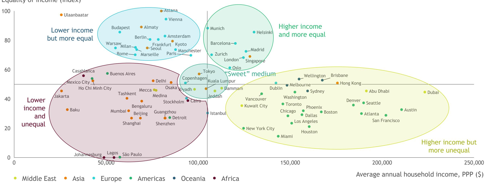

## Livability—top 20 cities

<table><tr><td>City</td><td>Total dimension score</td><td>Housing</td><td>Mobility</td><td>Health care</td><td>Education</td><td>Consumption of goods and services</td><td>Public spaces</td><td>Entertainment and recreation</td><td>Ecology</td><td>Comfortable climate</td><td>Cleanliness and hygiene</td><td>Resilience to emergency situations</td></tr><tr><td>Zurich</td><td>74</td><td>66</td><td>80</td><td>87</td><td>58</td><td>52</td><td>100</td><td>82</td><td>64</td><td>51</td><td>96</td><td>62</td></tr><tr><td>London</td><td>74</td><td>65</td><td>71</td><td>69</td><td>100</td><td>97</td><td>79</td><td>100</td><td>61</td><td>49</td><td>61</td><td>58</td></tr><tr><td>Oslo</td><td>73</td><td>67</td><td>100</td><td>94</td><td>72</td><td>56</td><td>88</td><td>60</td><td>92</td><td>34</td><td>45</td><td>77</td></tr><tr><td>Frankfurt</td><td>72</td><td>81</td><td>92</td><td>100</td><td>70</td><td>73</td><td>74</td><td>68</td><td>57</td><td>39</td><td>73</td><td>78</td></tr><tr><td>Vienna</td><td>72</td><td>59</td><td>98</td><td>66</td><td>64</td><td>65</td><td>85</td><td>75</td><td>82</td><td>41</td><td>67</td><td>72</td></tr><tr><td>Washington</td><td>71</td><td>86</td><td>61</td><td>51</td><td>70</td><td>99</td><td>61</td><td>100</td><td>59</td><td>44</td><td>64</td><td>91</td></tr><tr><td>Copenhagen</td><td>70</td><td>60</td><td>87</td><td>78</td><td>79</td><td>80</td><td>61</td><td>76</td><td>89</td><td>41</td><td>67</td><td>55</td></tr><tr><td>Sydney</td><td>69</td><td>63</td><td>57</td><td>57</td><td>51</td><td>65</td><td>68</td><td>55</td><td>79</td><td>97</td><td>71</td><td>75</td></tr><tr><td>Berlin</td><td>69</td><td>51</td><td>95</td><td>97</td><td>83</td><td>60</td><td>69</td><td>73</td><td>66</td><td>53</td><td>59</td><td>70</td></tr><tr><td>Munich</td><td>68</td><td>71</td><td>97</td><td>100</td><td>87</td><td>65</td><td>46</td><td>58</td><td>63</td><td>44</td><td>77</td><td>84</td></tr><tr><td>Vancouver</td><td>64</td><td>44</td><td>62</td><td>26</td><td>59</td><td>78</td><td>74</td><td>46</td><td>100</td><td>49</td><td>55</td><td>74</td></tr><tr><td>Stockholm</td><td>64</td><td>42</td><td>78</td><td>30</td><td>50</td><td>60</td><td>100</td><td>48</td><td>83</td><td>36</td><td>53</td><td>74</td></tr><tr><td>Seattle</td><td>64</td><td>81</td><td>71</td><td>60</td><td>68</td><td>80</td><td>33</td><td>65</td><td>91</td><td>50</td><td>60</td><td>62</td></tr><tr><td>Shanghai</td><td>63</td><td>47</td><td>67</td><td>82</td><td>71</td><td>74</td><td>74</td><td>51</td><td>30</td><td>42</td><td>72</td><td>78</td></tr><tr><td>Brisbane</td><td>62</td><td>71</td><td>55</td><td>62</td><td>55</td><td>39</td><td>64</td><td>49</td><td>70</td><td>70</td><td>77</td><td>78</td></tr><tr><td>Austin</td><td>62</td><td>94</td><td>49</td><td>38</td><td>66</td><td>54</td><td>67</td><td>55</td><td>77</td><td>52</td><td>65</td><td>49</td></tr><tr><td>Denver</td><td>61</td><td>87</td><td>50</td><td>58</td><td>66</td><td>56</td><td>54</td><td>61</td><td>63</td><td>52</td><td>62</td><td>77</td></tr><tr><td>Dubai</td><td>61</td><td>89</td><td>47</td><td>85</td><td>21</td><td>78</td><td>60</td><td>50</td><td>32</td><td>33</td><td>86</td><td>86</td></tr><tr><td>Melbourne</td><td>61</td><td>56</td><td>38</td><td>56</td><td>62</td><td>49</td><td>73</td><td>58</td><td>83</td><td>70</td><td>42</td><td>81</td></tr><tr><td>San Francisco</td><td>61</td><td>72</td><td>53</td><td>55</td><td>64</td><td>65</td><td>25</td><td>89</td><td>89</td><td>89</td><td>63</td><td>53</td></tr></table>

## Key outcomes

\- As in legacy editions, Europe leads livability, with London and Zurich at the top; Washington has maintained its position, but NYC and San Franscico have lost their historical leadership; Chinese cities catching up very fast, with leader Shanghai in 14th place

\- Housing: Total relative decline of all cities, prices per square meter and mortgage rocket, US cities continue to lead due to historically large space per person

\- Mobility: Post-COVID mobility intensified; overall time to commute has increased also showing growing number of cars

\- Health care: German cities lead, while US cities are mostly at the end of the list

\- Education: Dimension was significantly expanded by including after-school activities and higher education, benefiting European cities and the cities with tradition of after-school programs

\- Consumption: US and European cities lead in offline big format retail density, while ME and Asia lead online delivery and next-door format

\- Public spaces: Europe and Canada lead globally, with Europe holding 10 of the top 15 spots; ME lags in green zones but Riyadh showed strong gains

• Entertainment: Stable with traditional leaders: US and Europe

\- Ecology: NAMR, Europe, and AUS are on top as before; in ME, sustainability commitment improved; half of cities report less than one-third of HH waste recycled; air quality deteriorating compared with COVID time

\- Cleanliness: Zurich on top as before; Asian cities improved due to public toilet revolution

\- Resilience: Washington DC on top with Dubai following; all NA cities improved due to the gains in intensive care beds and emergency personnel

## Social capital—top 20 cities

<table><tr><td>City</td><td>Total dimension score</td><td>Social connections</td><td>Identity with culture</td><td>Inclusivity</td><td>Safety</td></tr><tr><td>Beijing</td><td>78</td><td>77</td><td>100</td><td>55</td><td>85</td></tr><tr><td>London</td><td>72</td><td>64</td><td>100</td><td>70</td><td>45</td></tr><tr><td>Berlin</td><td>70</td><td>59</td><td>100</td><td>75</td><td>31</td></tr><tr><td>Shanghai</td><td>70</td><td>85</td><td>69</td><td>48</td><td>97</td></tr><tr><td>Copenhagen</td><td>70</td><td>67</td><td>63</td><td>83</td><td>59</td></tr><tr><td>Vienna</td><td>67</td><td>51</td><td>74</td><td>82</td><td>45</td></tr><tr><td>Shenzhen</td><td>65</td><td>79</td><td>48</td><td>51</td><td>100</td></tr><tr><td>Doha</td><td>64</td><td>71</td><td>52</td><td>55</td><td>92</td></tr><tr><td>Sydney</td><td>64</td><td>60</td><td>57</td><td>80</td><td>49</td></tr><tr><td>Amsterdam</td><td>63</td><td>47</td><td>59</td><td>91</td><td>33</td></tr><tr><td>Stockholm</td><td>62</td><td>12</td><td>53</td><td>92</td><td>50</td></tr><tr><td>Dubai</td><td>62</td><td>95</td><td>59</td><td>26</td><td>100</td></tr><tr><td>Paris</td><td>61</td><td>17</td><td>100</td><td>56</td><td>35</td></tr><tr><td>Seoul</td><td>61</td><td>31</td><td>85</td><td>53</td><td>68</td></tr><tr><td>Munich</td><td>60</td><td>61</td><td>39</td><td>78</td><td>58</td></tr><tr><td>New York City</td><td>60</td><td>49</td><td>100</td><td>44</td><td>42</td></tr><tr><td>Helsinki</td><td>59</td><td>41</td><td>41</td><td>83</td><td>59</td></tr><tr><td>Zurich</td><td>59</td><td>61</td><td>43</td><td>75</td><td>57</td></tr><tr><td>Madrid</td><td>59</td><td>39</td><td>71</td><td>62</td><td>46</td></tr><tr><td>Manchester</td><td>58</td><td>61</td><td>32</td><td>79</td><td>57</td></tr></table>

## Key outcomes

\- Overall ranking: In 2023, the top 10 were dominated by Asian and ME cities (the highest Western city, New York, ranked 13th); this year, 5 of the top 10 are European, driven largely by stronger survey results, as residents' subjective views improved significantly post-COVID

• Social connections: Asian and ME cities remain as leaders

\- Identity with culture: Residents today feel more proud of their cities' history and culture, with notable increases in Zurich, German cities, and Jeddah; however, many European cities saw declines, including Barcelona, Stockholm, and Amsterdam

\- Inclusivity: Cities are becoming more inclusive in both infrastructure (public transport use rose from 76% to 81%) and practices (employment of people with disabilities grew from 36% to 38%)

\- Safety: As historically, the safest cities are in the Middle East and Asia, while the least safe are in North and South America

## Engagement with governments—top 20 cities

<table><tr><td>City</td><td>Total dimension score</td><td>Ability to influence events</td><td>Government services</td><td>Business environment</td></tr><tr><td>Frankfurt</td><td>80</td><td>90</td><td>75</td><td>77</td></tr><tr><td>Zurich</td><td>79</td><td>73</td><td>81</td><td>84</td></tr><tr><td>Munich</td><td>77</td><td>71</td><td>75</td><td>83</td></tr><tr><td>Austin</td><td>77</td><td>83</td><td>59</td><td>86</td></tr><tr><td>San Francisco</td><td>75</td><td>75</td><td>52</td><td>94</td></tr><tr><td>Riyadh</td><td>75</td><td>65</td><td>100</td><td>65</td></tr><tr><td>London</td><td>74</td><td>83</td><td>72</td><td>68</td></tr><tr><td>Atlanta</td><td>73</td><td>82</td><td>47</td><td>88</td></tr><tr><td>Dubai</td><td>72</td><td>47</td><td>100</td><td>69</td></tr><tr><td>Washington</td><td>71</td><td>88</td><td>53</td><td>74</td></tr><tr><td>Abu Dhabi</td><td>70</td><td>62</td><td>85</td><td>63</td></tr><tr><td>Singapore</td><td>70</td><td>68</td><td>69</td><td>72</td></tr><tr><td>Miami</td><td>69</td><td>73</td><td>38</td><td>87</td></tr><tr><td>Denver</td><td>69</td><td>76</td><td>48</td><td>80</td></tr><tr><td>New York City</td><td>67</td><td>77</td><td>70</td><td>58</td></tr><tr><td>Seoul</td><td>67</td><td>87</td><td>84</td><td>40</td></tr><tr><td>Berlin</td><td>67</td><td>56</td><td>82</td><td>61</td></tr><tr><td>Mecca</td><td>66</td><td>49</td><td>89</td><td>62</td></tr><tr><td>Copenhagen</td><td>66</td><td>56</td><td>76</td><td>65</td></tr><tr><td>Dammam</td><td>66</td><td>57</td><td>86</td><td>57</td></tr></table>

## Key outcomes

Technology penetration drives significant improvement in ability to influence events and government services:

\- +20% increase in residents reporting that they feel able to influence decisions in their city

\- 3x improvement in ability to solve the most common city problems using online tools

\- 2x improvement in the availability of dedicated mobile apps that enable citizens to influence city development

\- Many developing cities have improved their rankings: Riyadh (EGDI improved from 0.49 to 0.92) and Dubai entered the top 10; São Paulo and Almaty are in the top 25

\- Western cities still lead, but ME is catching up quickly with Dubai in top 10, and some cities from the West are becoming laggards, e.g., Rome, Milan, Budapest

\- Business environment is driven by emergence of new coworking spaces (4.5x on average since 2021) and business incubators

## Prosperous middleweights lead on infrastructure, while established powerhouses lag despite large investments but lead on soft infrastructure

Comparison by group

## Physical infrastructure

<table><tr><td>1</td><td>Oslo</td></tr><tr><td>2</td><td>Zurich</td></tr><tr><td>3</td><td>Washington</td></tr><tr><td>4</td><td>Frankfurt</td></tr><tr><td>5</td><td>Warsaw</td></tr><tr><td>6</td><td>Stockholm</td></tr><tr><td>7</td><td>Vienna</td></tr><tr><td>8</td><td>Munich</td></tr><tr><td>9</td><td>Helsinki</td></tr><tr><td>10</td><td>Miami</td></tr><tr><td>11</td><td>London</td></tr><tr><td>12</td><td>Seoul</td></tr><tr><td>13</td><td>Singapore</td></tr><tr><td>14</td><td>Amsterdam</td></tr><tr><td>15</td><td>Wellington</td></tr><tr><td>16</td><td>Copenhagen</td></tr><tr><td>17</td><td>Budapest</td></tr><tr><td>18</td><td>Vancouver</td></tr><tr><td>19</td><td>Paris</td></tr><tr><td>20</td><td>Madrid</td></tr></table>

Established powerhouses

## Soft infrastructure and services

<table><tr><td>1</td><td>London</td></tr><tr><td>2</td><td>Paris</td></tr><tr><td>3</td><td>Barcelona</td></tr><tr><td>4</td><td>São Paulo</td></tr><tr><td>5</td><td>Kyoto</td></tr><tr><td>6</td><td>Ho Chi Minh City</td></tr><tr><td>7</td><td>Rome</td></tr><tr><td>8</td><td>Tokyo</td></tr><tr><td>9</td><td>New York City</td></tr><tr><td>10</td><td>Shanghai</td></tr><tr><td>11</td><td>Copenhagen</td></tr><tr><td>12</td><td>Madrid</td></tr><tr><td>13</td><td>Casablanca</td></tr><tr><td>14</td><td>Manchester</td></tr><tr><td>15</td><td>Lagos</td></tr><tr><td>16</td><td>Astana</td></tr><tr><td>17</td><td>Seattle</td></tr><tr><td>18</td><td>Mexico City</td></tr><tr><td>19</td><td>Baku</td></tr><tr><td>20</td><td>Milan</td></tr></table>

Developing megacities  
Established global hubs  
1. Regulatory capital includes programs and policies.

## Regulatory capital $^{1}$

<table><tr><td>1</td><td>Copenhagen</td></tr><tr><td>2</td><td>Dallas</td></tr><tr><td>3</td><td>Ho Chi Minh City</td></tr><tr><td>4</td><td>Buenos Aires</td></tr><tr><td>5</td><td>Miami</td></tr><tr><td>6</td><td>Shenzhen</td></tr><tr><td>7</td><td>Beijing</td></tr><tr><td>8</td><td>Shanghai</td></tr><tr><td>9</td><td>Manchester</td></tr><tr><td>10</td><td>Zurich</td></tr><tr><td>11</td><td>Paris</td></tr><tr><td>12</td><td>Almaty</td></tr><tr><td>13</td><td>Helsinki</td></tr><tr><td>14</td><td>Milan</td></tr><tr><td>15</td><td>Guangzhou</td></tr><tr><td>16</td><td>Sydney</td></tr><tr><td>17</td><td>Boston</td></tr><tr><td>18</td><td>Medina</td></tr><tr><td>19</td><td>Los Angeles</td></tr><tr><td>20</td><td>Denver</td></tr></table>

Prosperous middleweights  
Developing middleweights  
Note: Calculation methodology used three new subindices calculated by regrouping the physical infrastructure, soft infrastructure, and regulatory capital-related indicators across all dimensions.

## Key insights

\- Paris and Copenhagen are the only two cities appearing in top 20 across all three dimensions

\- Prosperous middleweights lead on physical infrastructure development, while established powerhouses and global hubs lag behind despite large capital spending

\- But established powerhouses followed by established global hubs lead on soft infrastructure, suggesting services and digital experiences are easier to improve in large cities with economies of scale

\- The pillars are weakly correlated—pointing to the fact that cities can perform differently in hard, soft infrastructure and programs

\- Four cities—Ulaanbaatar, Cairo, Bengaluru, and Mecca—lag across all three pillars, indicating a foundational gap where basic infrastructure and program delivery need to be built in tandem

## Section 3

## Ranking by groups

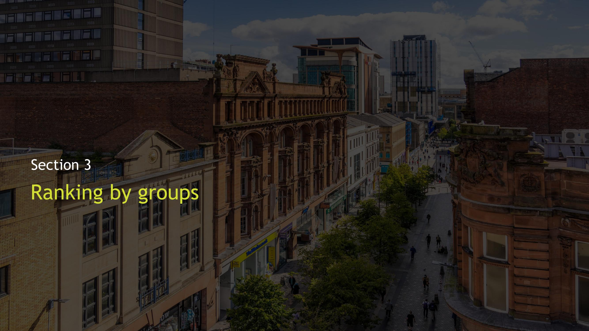

## In addition to ranking by dimension, cities are grouped by socioeconomic profiles to ensure comparability

## Established powerhouses

Cities with more than \$25,000 GDP per capita

Urban area population >10M people

Beijing

London

Los Angeles

New York City

Osaka

Paris

Seoul

Shanghai

Shenzhen

Tokyo

## Developing megacities

Cities with less than \$25,000 GDP per capita

Urban area population >10M people

Bengaluru

Buenos Aires

Cairo

Delhi

Guangzhou

Ho Chi Minh City

Lagos

São Paulo

## Established global hubs

Cities with more than \$25,000 GDP per capita

Urban area population 4M-10M people

<table><tr><td>Atlanta</td><td>Madrid</td></tr><tr><td>Barcelona</td><td>Melbourne</td></tr><tr><td>Berlin</td><td>Miami</td></tr><tr><td>Boston</td><td>Milan</td></tr><tr><td>Chicago</td><td>Phoenix</td></tr><tr><td>Dallas</td><td>Riyadh</td></tr><tr><td>Detroit</td><td>San Francisco</td></tr><tr><td>Dubai</td><td>Seattle</td></tr><tr><td>Hong Kong</td><td>Singapore</td></tr><tr><td>Houston</td><td>Sydney</td></tr><tr><td>Jeddah</td><td>Toronto</td></tr><tr><td>Kuala Lumpur</td><td>Washington</td></tr></table>

## Prosperous middleweights

Cities with more than \$25,000 GDP per capita

Urban area population <4M people

<table><tr><td>Abu Dhabi</td><td>Kyoto</td></tr><tr><td>Amsterdam</td><td>Manchester</td></tr><tr><td>Austin</td><td>Marseille</td></tr><tr><td>Brisbane</td><td>Munich</td></tr><tr><td>Budapest</td><td>Oslo</td></tr><tr><td>Copenhagen</td><td>Rome</td></tr><tr><td>Denver</td><td>Stockholm</td></tr><tr><td>Doha</td><td>Vancouver</td></tr><tr><td>Dublin</td><td>Vienna</td></tr><tr><td>Frankfurt</td><td>Warsaw</td></tr><tr><td>Helsinki</td><td>Wellington</td></tr><tr><td>Kuwait City</td><td>Zurich</td></tr></table>

## Developing middleweights

Cities with less than \$25,000 GDP per capita

Urban area population <4M people

Almaty

Astana

Baku

Casablanca $^{1}$

Dammam

Mecca

Medina

Tashkent

<table><tr><td></td><td>Overall</td><td>Livability and economic opportunities remain the strongest global performance driversSpeed of change differentiates high-performing cities—especially in China and ME—highlighting agility as a growing success factor</td></tr><tr><td></td><td>Established powerhouses</td><td>London leads globally with balanced excellence across dimensions, though lacking in speed of changeChinese cities (Shanghai, Beijing, Shenzhen) outperform on social capital, speed of change, and advocacy, but lag in livability fundamentalsUS and European peers show strong economic opportunities but face limits in social capital and speed of change</td></tr><tr><td></td><td>Developing megacities</td><td>The group is characterized by mostly below-average scores across dimensions but notably high advocacy, reflecting strong citizen engagement despite structural weaknessesGuangzhou tops the group for excelling in all dimensions, accompanied with high advocacyHigh speed of change score seen in India and Southeast Asia, though still constrained by fundamentals</td></tr><tr><td></td><td>Established global hubs</td><td>Group characterized by maturity and stability, with strong advocacy but modest speed of changeBerlin leads as the most balanced performer; Dubai, Washington, and San Francisco follow closelyUS and ME cities excel in economic opportunities and engagement with governments</td></tr><tr><td></td><td>Prosperous middleweights</td><td>Zurich, Frankfurt, and Munich top the group, excelling in economic opportunities and engagement with governmentsEuropean cities dominate, though some laggards (e.g., Marseille, Rome) pull down group averagesDoha stands out with the highest speed of change, signaling emerging regional momentum</td></tr><tr><td></td><td>Developing middleweights</td><td>The group overall has strong advocacy and speed of change but with lacking capability—high citizen alignment and change intent without current supporting economic or social foundationsDammam leads the group with balanced performance across all dimensions</td></tr></table>

## Executive summary Ranking results by group

## Ranking by group: established powerhouses $^{1}$ Cities with more than 25,000 GDP per capita and urban area population of over 10M

<table><tr><td>City</td><td>Overall rating</td><td>Advocacy score</td><td>Economic opportunities</td><td>Livability</td><td>Social capital</td><td>Engagement with governments</td><td>Speed of change</td></tr><tr><td>London</td><td></td><td></td><td></td><td></td><td></td><td></td><td></td></tr><tr><td>Shanghai</td><td></td><td></td><td></td><td></td><td></td><td></td><td></td></tr><tr><td>Beijing</td><td></td><td></td><td></td><td></td><td></td><td></td><td></td></tr><tr><td>Shenzhen</td><td></td><td></td><td></td><td></td><td></td><td></td><td></td></tr><tr><td>Seoul</td><td></td><td></td><td></td><td></td><td></td><td></td><td></td></tr><tr><td>New York City</td><td></td><td></td><td></td><td></td><td></td><td></td><td></td></tr><tr><td>Paris</td><td></td><td></td><td></td><td></td><td></td><td></td><td></td></tr><tr><td>Los Angeles</td><td></td><td></td><td></td><td></td><td></td><td></td><td></td></tr><tr><td>Tokyo</td><td></td><td></td><td></td><td></td><td></td><td></td><td></td></tr><tr><td>Osaka</td><td></td><td></td><td></td><td></td><td></td><td></td><td></td></tr></table>

1. Named “megacenters” in the 2023 ranking and consisted of 14 cities, including all the cities listed in this group.

Note on subdimensions: Economic opportunities: opportunities for work, career, and income, opportunities for business, equality of income, availability of personal loans. Livability: ability to influence events, government services, business environment, cleanliness and hygiene, comfortable climate, consumption of goods and services, ecology, education and development, entertainment and recreation, health care, housing, mobility, public spaces, resilience to emergency situations. Social capital: inclusivity and equality, identity with culture and history, safety, social connections. Speed of change: speed of change in economic opportunities, speed of change in engagement with governments, speed of change in livability, speed of change in social capital.

## Key outcomes

\- Across all groups, livability and economic opportunities are the strongest drivers of overall performance, followed by engagement with governments

\- London ranks first, combining strong economic opportunities with high livability—the only city performing well across both; it has the highest scores in education, consumption, and entertainment

\- Chinese cities win due to high speed of change, social capital, and very high advocacy, but still lag on fundamentals

\- Paris is strong on culture and consumption, but weaker housing, mobility, and hygiene limit its livability

\- Within the US, NYC leads over LA in economic opportunities, stemming from better performance in the innovation ecosystem, workforce efficiency, business development, and sentiment about economic and business opportunities

\- Structural difference within the group comes from Japanese cities, which score low across all pillars, pulling down the group average

## Ranking by group: developing megacities Cities with less than \$25,000 GDP per capita and urban area population of over 10M

<table><tr><td>City</td><td>Overall rating</td><td>Advocacy score</td><td>Economic opportunities</td><td>Livability</td><td>Social capital</td><td>Engagement with governments</td><td>Speed of change</td></tr><tr><td>Guangzhou</td><td></td><td></td><td colspan="5"></td></tr><tr><td>Mumbai</td><td colspan="2"></td><td></td><td colspan="4"></td></tr><tr><td>Delhi</td><td></td><td colspan="2"></td><td></td><td></td><td></td><td></td></tr><tr><td>Bengaluru</td><td></td><td colspan="2"></td><td></td><td colspan="2"></td><td></td></tr><tr><td>São Paulo</td><td></td><td></td><td></td><td></td><td></td><td></td><td></td></tr><tr><td>Ho Chi Minh</td><td></td><td></td><td></td><td></td><td colspan="3"></td></tr><tr><td>Jakarta</td><td colspan="2"></td><td></td><td></td><td></td><td colspan="2"></td></tr><tr><td>Cairo</td><td></td><td></td><td></td><td></td><td></td><td></td><td></td></tr><tr><td>Mexico City</td><td colspan="2"></td><td></td><td colspan="2"></td><td colspan="2"></td></tr><tr><td>Istanbul</td><td></td><td></td><td></td><td></td><td></td><td></td><td></td></tr><tr><td>Buenos Aires</td><td colspan="2"></td><td></td><td></td><td colspan="3"></td></tr><tr><td>Lagos</td><td></td><td></td><td colspan="3"></td><td></td><td></td></tr><tr><td>Johannesburg</td><td colspan="7"></td></tr></table>

## Key outcomes

Note on subdimensions: Economic opportunities: opportunities for work, career, and income, opportunities for business, equality of income, availability of personal loans. Livability: ability to influence events, government services, business environment, cleanliness and hygiene, comfortable climate, consumption of goods and services, ecology, education and development, entertainment and recreation, health care, housing, mobility, public spaces, resilience to emergency situations. Social capital: inclusivity and equality, identity with culture and history, safety, social connections. Speed of change: speed of change in economic opportunities, speed of change in engagement with governments, speed of change in livability, speed of change in social capital.

\- The group is characterized by mostly below-average scores across dimensions, but notably high advocacy, reflecting strong citizen engagement despite structural weaknesses, especially noticeable in Ho Chi Minh City and Lagos

\- Guangzhou leads the group as the most balanced city, combining the above-average fundamentals with high speed of change and high advocacy

\- The group's overall low performance in livability stems from weak infrastructure fundamentals, except Guangzhou, which leads in cleanliness and public spaces

\- Istanbul scores low due to weak livability performance across 5 out of 11 subdimensions and also weak in opportunities for work, career, and income coming from high unemployment rates and low sentiment

## Ranking by group: established global hubs Cities with more than \$25,000 GDP per capita and urban area population of 4M to 10M

<table><tr><td>City</td><td>Overall rating</td><td>Advocacy score</td><td>Economic opportunities</td><td>Livability</td><td>Social capital</td><td>Engagement with governments</td><td>Speed of change</td></tr><tr><td>Berlin</td><td></td><td></td><td></td><td></td><td></td><td></td><td></td></tr><tr><td>Dubai</td><td></td><td></td><td></td><td></td><td></td><td></td><td></td></tr><tr><td>Washington</td><td></td><td></td><td></td><td></td><td></td><td></td><td></td></tr><tr><td>San Francisco</td><td></td><td></td><td></td><td></td><td></td><td></td><td></td></tr><tr><td>Atlanta</td><td></td><td></td><td></td><td></td><td></td><td></td><td></td></tr><tr><td>Riyadh</td><td></td><td></td><td></td><td></td><td></td><td></td><td></td></tr><tr><td>Seattle</td><td></td><td></td><td></td><td></td><td></td><td></td><td></td></tr><tr><td>Boston</td><td></td><td></td><td></td><td></td><td></td><td></td><td></td></tr><tr><td>Sydney</td><td></td><td></td><td></td><td></td><td></td><td></td><td></td></tr><tr><td>Miami</td><td></td><td></td><td></td><td></td><td></td><td></td><td></td></tr><tr><td>Madrid</td><td></td><td></td><td></td><td></td><td></td><td></td><td></td></tr><tr><td>Singapore</td><td></td><td></td><td></td><td></td><td></td><td></td><td></td></tr><tr><td>Chicago</td><td></td><td></td><td></td><td></td><td></td><td></td><td></td></tr><tr><td>Jeddah</td><td></td><td></td><td></td><td></td><td></td><td></td><td></td></tr><tr><td>Phoenix</td><td></td><td></td><td></td><td></td><td></td><td></td><td></td></tr><tr><td>Melbourne</td><td></td><td></td><td></td><td></td><td></td><td></td><td></td></tr><tr><td>Barcelona</td><td></td><td></td><td></td><td></td><td></td><td></td><td></td></tr><tr><td>Dallas</td><td></td><td></td><td></td><td></td><td></td><td></td><td></td></tr><tr><td>Toronto</td><td></td><td></td><td></td><td></td><td></td><td></td><td></td></tr><tr><td>Houston</td><td></td><td></td><td></td><td></td><td></td><td></td><td></td></tr><tr><td>Kuala Lumpur</td><td></td><td></td><td></td><td></td><td></td><td></td><td></td></tr><tr><td>Milan</td><td></td><td></td><td></td><td></td><td></td><td></td><td></td></tr><tr><td>Detroit</td><td></td><td></td><td></td><td></td><td></td><td></td><td></td></tr><tr><td>Hong Kong</td><td></td><td></td><td></td><td></td><td></td><td></td><td></td></tr></table>

Note on subdimensions: Economic opportunities: opportunities for work, career, and income, opportunities for business, equality of income, availability of personal loans. Livability: ability to influence events, government services, business environment, cleanliness and hygiene, comfortable climate, consumption of goods and services, ecology, education and development, entertainment and recreation, health care, housing, mobility, public spaces, resilience to emergency situations. Social capital: inclusivity and equality, identity with culture and history, safety, social connections. Speed of change: speed of change in economic opportunities, speed of change in engagement with governments, speed of change in livability, speed of change in social capital.

## Key outcomes

• Overall, the group is mature with mostly above-average scores but, at the same time, with limited improvement over time

\- Advocacy is strong across all cities, but results differ mainly in economic opportunities and livability; social capital is the main weak area

\- Berlin is #1 as the city with the most balanced performance across the dimensions, with Dubai, Washington, and San Francisco closely following

• Saudi cities move fastest, showing high speed of change and advocacy, but still lag on fundamentals

\- US cities lead in economic opportunities along with Dubai but are weak in social capital; Washington is in top 3 as an anchor for a broader metro area

## Ranking by group: prosperous middleweights Cities with more than \$25,000 GDP per capita and urban area population of less than 4M

<table><tr><td>City</td><td>Overall rating</td><td>Advocacy score</td><td>Economic opportunities</td><td>Livability</td><td>Social capital</td><td>Engagement with governments</td><td>Speed of change</td></tr><tr><td>Zurich</td><td></td><td></td><td></td><td></td><td></td><td></td><td></td></tr><tr><td>Frankfurt</td><td></td><td></td><td></td><td></td><td></td><td></td><td></td></tr><tr><td>Munich</td><td></td><td></td><td></td><td></td><td></td><td></td><td></td></tr><tr><td>Copenhagen</td><td></td><td></td><td></td><td></td><td></td><td></td><td></td></tr><tr><td>Vienna</td><td></td><td></td><td></td><td></td><td></td><td></td><td></td></tr><tr><td>Austin</td><td></td><td></td><td></td><td></td><td></td><td></td><td></td></tr><tr><td>Oslo</td><td></td><td></td><td></td><td></td><td></td><td></td><td></td></tr><tr><td>Amsterdam</td><td></td><td></td><td></td><td></td><td></td><td></td><td></td></tr><tr><td>Denver</td><td></td><td></td><td></td><td></td><td></td><td></td><td></td></tr><tr><td>Doha</td><td></td><td></td><td></td><td></td><td></td><td></td><td></td></tr><tr><td>Abu Dhabi</td><td></td><td></td><td></td><td></td><td></td><td></td><td></td></tr><tr><td>Helsinki</td><td></td><td></td><td></td><td></td><td></td><td></td><td></td></tr><tr><td>Manchester</td><td></td><td></td><td></td><td></td><td></td><td></td><td></td></tr><tr><td>Brisbane</td><td></td><td></td><td></td><td></td><td></td><td></td><td></td></tr><tr><td>Stockholm</td><td></td><td></td><td></td><td></td><td></td><td></td><td></td></tr><tr><td>Dublin</td><td></td><td></td><td></td><td></td><td></td><td></td><td></td></tr><tr><td>Vancouver</td><td></td><td></td><td></td><td></td><td></td><td></td><td></td></tr><tr><td>Warsaw</td><td></td><td></td><td></td><td></td><td></td><td></td><td></td></tr><tr><td>Wellington</td><td></td><td></td><td></td><td></td><td></td><td></td><td></td></tr><tr><td>Kuwait City</td><td></td><td></td><td></td><td></td><td></td><td></td><td></td></tr><tr><td>Marseille</td><td></td><td></td><td></td><td></td><td></td><td></td><td></td></tr><tr><td>Kyoto</td><td></td><td></td><td></td><td></td><td></td><td></td><td></td></tr><tr><td>Budapest</td><td></td><td></td><td></td><td></td><td></td><td></td><td></td></tr><tr><td>Rome</td><td></td><td></td><td></td><td></td><td></td><td></td><td></td></tr></table>

Note on subdimensions: Economic opportunities: opportunities for work, career, and income, opportunities for business, equality of income, availability of personal loans. Livability: ability to influence events, government services, business environment, cleanliness and hygiene, comfortable climate, consumption of goods and services, ecology, education and development, entertainment and recreation, health care, housing, mobility, public spaces, resilience to emergency situations. Social capital: inclusivity and equality, identity with culture and history, safety, social connections. Speed of change: speed of change in economic opportunities, speed of change in engagement with governments, speed of change in livability, speed of change in social capital.

## Key outcomes

\- European cities lead, but ME is catching up quickly with Doha in the Top 10 and some cities from the West are becoming laggards, e.g., Marseille, Budapest, Rome

\- Overall, this group of cities performs lower in social capital and speed of change, except for Doha, which is strong in both dimensions (64 in social capital and 87 in speed of change)

\- Zurich, Frankfurt, and Munich perform well across all dimensions, leading in economic opportunities and engagement with governments

• Abu Dhabi almost enters the top 10, with high scores in speed of change and advocacy, signaling high potential

## Ranking by group: developing middleweights Cities with under \$25,000 GDP per capita and urban area population under 4M

<table><tr><td>City</td><td>Overall rating</td><td>Advocacy score</td><td>Economic opportunities</td><td>Livability</td><td>Social capital</td><td>Engagement with governments</td><td>Speed of change</td></tr><tr><td>Dammam</td><td></td><td></td><td></td><td></td><td></td><td></td><td></td></tr><tr><td>Almaty</td><td></td><td></td><td></td><td></td><td></td><td></td><td></td></tr><tr><td>Mecca</td><td></td><td></td><td></td><td></td><td></td><td></td><td></td></tr><tr><td>Astana</td><td></td><td></td><td></td><td></td><td></td><td></td><td></td></tr><tr><td>Medina</td><td></td><td></td><td></td><td></td><td></td><td></td><td></td></tr><tr><td>Baku</td><td></td><td></td><td></td><td></td><td></td><td></td><td></td></tr><tr><td>Tashkent</td><td></td><td></td><td></td><td></td><td></td><td></td><td></td></tr><tr><td>Casablanca</td><td colspan="7"></td></tr><tr><td>Ulaanbaatar</td><td colspan="7"></td></tr></table>

Note on subdimensions. Economic opportunities: opportunities for work, career, and income, opportunities for business, equality of income, availability of personal loans. Livability: ability to influence events, government services, business environment, cleanliness and hygiene, comfortable climate, consumption of goods and services, ecology, education and development, entertainment and recreation, health care, housing, mobility, public spaces, resilience to emergency situations. Social capital: inclusivity and equality, identity with culture and history, safety, social connections. Speed of change: speed of change in economic opportunities, speed of change in engagement with governments, speed of change in livability, speed of change in social capital.

## Key outcomes

\- Overall, this group is about a high pace of change and low capacity, except Ulaanbaatar, where fundamentals and speed of change are low along with advocacy

\- The group is advocacy-rich but with lacking capability—high citizen alignment and change intent without current supporting economic or social foundations

\- Tashkent leads in speed of change (89)—a top 5 performer across the full 80-city ranking—reflecting rapid gains in economic opportunities and engagement with governments

\- Almaty performs average or above average in most livability subdimensions, except ecology and resilience, where it clearly lags behind

## Section 4

## Key forward-looking themes

## Deep dives on key forward-looking themes...

<table><tr><td rowspan="3">Work and lifestyle</td><td>1 Companies continuing to adapt to distributed work, norms forming around hybrid work</td></tr><tr><td>2 People do more of their daily activities online and spend more time at home</td></tr><tr><td>3 New wave of automation driven by the rise of AI impacting creative work in cities</td></tr><tr><td rowspan="5">Safety and well-being</td><td>4 People increasingly value wealth of personal time</td></tr><tr><td>5 Cities need to adapt to aging urban population and longevity and health tailwinds</td></tr><tr><td>6 Resilience and safety concerns are growing in the cities</td></tr><tr><td>7 Housing markets becoming more unaffordable</td></tr><tr><td>8 Objective reality in cities and subjective perceptions of residents do not always match</td></tr><tr><td rowspan="3">Urban structure</td><td>9 Congestion and long commute times are rising steadily in large cities</td></tr><tr><td>10 “Connected city” (15-minute city index) delivers superior resident value</td></tr><tr><td>11 Downtowns strained since the pandemic due to remote and hybrid working</td></tr><tr><td rowspan="2">Economic mobility</td><td>12 Cities will benefit more from the growing travel economy and benefit from business travelers extending work trips for leisure</td></tr><tr><td>13 Affluent executives are semi-permanently on the move for enhanced economic opportunity and livability</td></tr></table>

## ...providing additional insights on cities' positioning

<table><tr><td></td><td>Highest share of online adepts - Mumbai</td></tr><tr><td></td><td>City with the highest resident advocacy - Mecca</td></tr><tr><td></td><td>The most optimistic city about GenAI - Shenzhen</td></tr><tr><td></td><td>Leaders in amount of time that residents spent at leisure locations - Dubai and Abu Dhabi</td></tr><tr><td></td><td>Cities where people meet with their friends most frequently - Tashkent and Ho Chi Min City</td></tr><tr><td></td><td>Best cities to prepare for longevity - Zurich and Beijing</td></tr><tr><td></td><td>Best cities to move to for retirement to ensure longevity - San Francisco and Sydney</td></tr><tr><td></td><td>Leaders in perceived safety - Riyadh and Mecca</td></tr><tr><td></td><td>The most “connected”1 city - Amsterdam</td></tr><tr><td></td><td>City with the largest number of destinations - Istanbul</td></tr><tr><td></td><td>City with the highest inbound visitor spending - Dubai</td></tr><tr><td></td><td>Cities that will gain the most from business visitors expanding their stay for leisure - Dubai and Tokyo</td></tr></table>

## Theme 1

## Hybrid and distributed work

## Companies continuing to adapt to distributed work, norms forming around hybrid work

## Hybrid work has become the new normal, with collaboration increasingly distributed and digital

Our global survey of 25,000+ residents across 83 cities shows that hybrid is no longer an experiment—it is part of everyday work, shaping where, with whom, and how people collaborate

## Where people work

## 51%

of respondents work from home at least 1-2 days per week

25%

of respondents work from home at least 2-3 days per week

Top ranked cities: Atlanta, Miami, Kyoto, Osaka, Seoul, Berlin

Hybrid schedules are now the norm rather than the exception

Whom they work with

47%

of respondents' colleagues are based in other cities

Top ranked cities: Frankfurt, Oslo, Berlin, Tashkent, Phoenix

Collaboration networks are increasingly distributed and global

## How they work

Employees spend, on average,

1.9 hours

per day in virtual meetings when in the office

Top ranked cities: Medina, Baku, Cairo, Astana, Jeddah, Mecca

Digital tools and virtual collaboration are embedded in daily routines

## The global survey reveals four archetypes of hybrid work

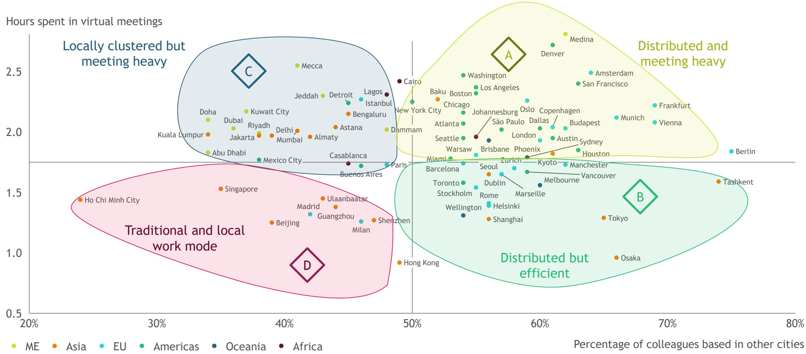

Note: The graph reflects responses from respondents with above-average income.

## Cities reveal distinct collaboration patterns with different implications for hybrid work

Description

Implication

## Distributed and meeting heavy

Teams are widely distributed across locations, and employees spend significant time in virtual meetings to stay connected

Cities should invest in top-tier digital infrastructure and foster international connectivity to remain competitive hubs for global work

Frankfurt, Washington, Amsterdam

Examples

## Distributed but efficient

Distributed teams operate effectively with relatively little time spent in virtual meetings

These cities indicate mature hybrid practices; other organizations can learn from these cities as benchmarks for efficient hybrid work

Sydney, Barcelona, Seattle

## Locally clustered but meeting heavy

Teams are primarily based in the same location, but employees still spend long hours in virtual meetings

These cities are often large urban centers with heavy traffic, and improving commuting efficiency would significantly enhance their overall productivity

Cairo, São Paulo, Jeddah

## Traditional and local work mode

Cities need to prepare for a gradual shift toward hybrid work models by strengthening digital infrastructure and expanding coworking spaces

Collaboration remains predominantly local, with limited use of virtual meetings

Hong Kong, Osaka, Shanghai

## Theme 2

## Life online

People do more of their daily activities online and spend more time at home

## Penetration of online channels in daily activities varies across regions and types of activity

Residents who prefer to buy groceries through online channels $^{1}$ (%)

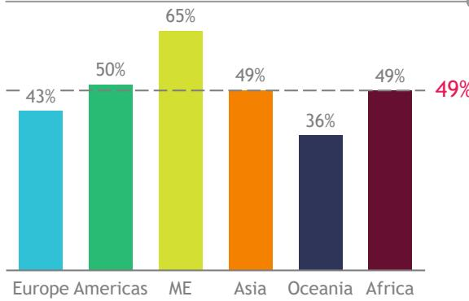  
Residents who prefer to do shopping through online channels (%)  
Residents preferring online entertainment channels (%)

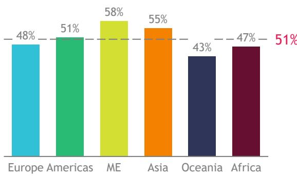  
Residents who prefer to receive banking services through online channels (%)

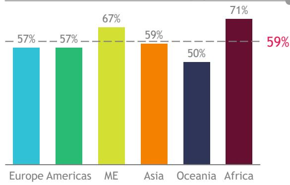  
Residents who prefer to get medical services through online channels (%)

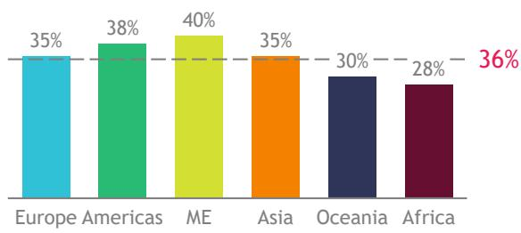

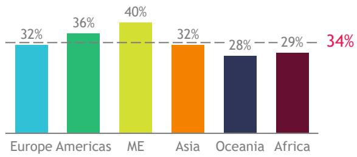  
Residents preferring online fitness channels (%)

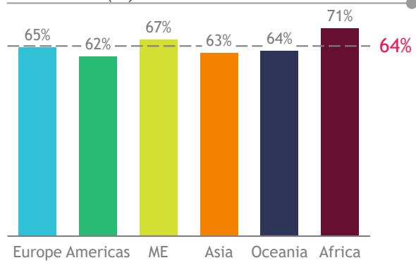  
Residents who prefer to get government services through online channels (%)

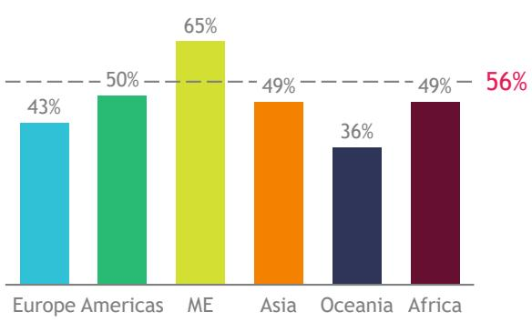  
1. Those who use online channels in 50% of cases are counted with a coefficient of 0.5.

Nineteen percent of online adepts $^{1}$ perform daily chores $^{2}$ mostly online, with Middle Eastern cities showing a higher share of such individuals than other cities

People who perform daily chores mostly online (%)

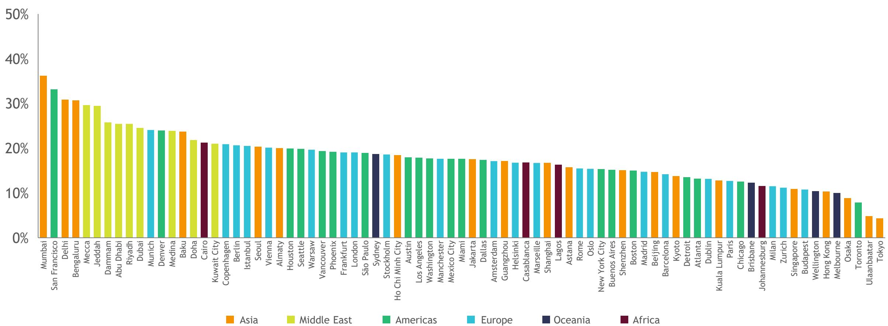  
1. Perform at least four activities entirely online, with no more than two activities entirely offline.  
2. Includes groceries, shopping, health care, fitness, entertainment (films, series, theatre, sports), banking and personal finance (paying bills, sending money, applying for loans, etc.), city government services (utilities, applying for permits and IDs, reporting city issues, voting, etc.).

Penetration of online services correlates with advocacy—cities with a higher share of online adepts demonstrate stronger advocacy

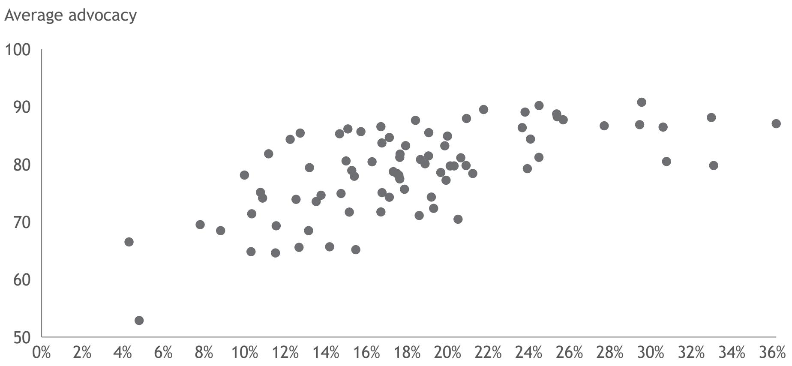  
Online adepts (%)

## Theme 3

## GenAI and the creative class

New wave of automation driven by the rise of AI and robotics impacting creative and knowledge work that tends to be concentrated in cities

## Across cities, the higher frequency of GenAI usage is clearly linked with higher optimism about GenAI's impact on life

Middle East, much of Asia, and Africa cluster in the high-adoption and high-optimism quadrant, while most American and European cities sit midpack on usage, with comparatively moderate optimism

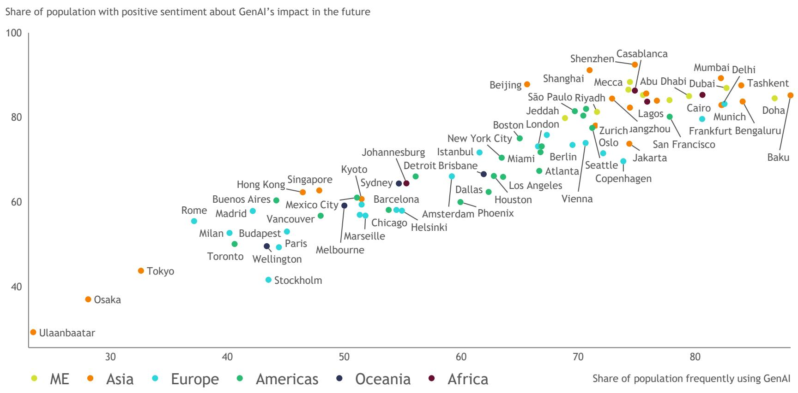

  
Sentiment improves with GenAI usage

Weekly users are the most optimistic about GenAI's impact, while nonusers are the most pessimistic

Sentiment to GenAI by frequency of usage

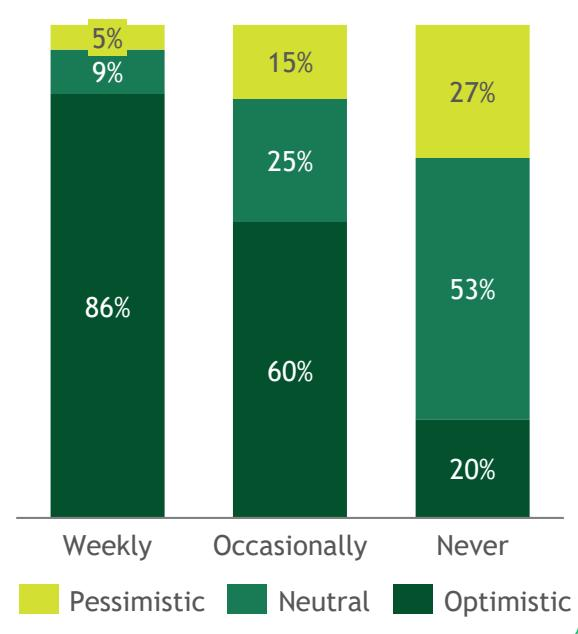

## However, the labor market's exposure to GenAI could range from $16\%$ to $77\%$ across regions

Share of employment highly exposed to GenAI now or in the near future, latest available year  
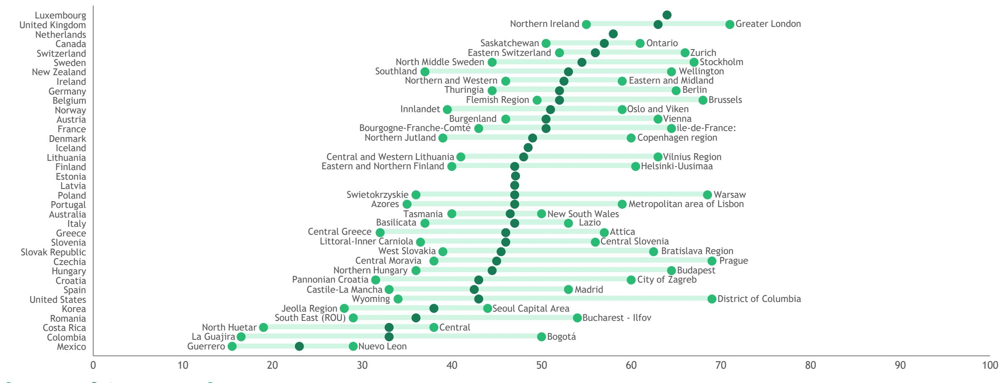  
Source: Job Creation and Local Economic Development, 2024.  
Share of employment highly exposed to GenAI now or in near future (%)

## The creative class is core to cities' existence

"Places that succeed in attracting and retaining creative class people prosper; those that fail don't."
— Richard Florida, The Rise of the Creative Class (2002)

Cities thrive on creativity...

Cities depend on creative talent to drive innovation, fuel economic growth, and inspire urban renewal

Creative people transform declining urban areas into vibrant neighborhoods, bringing economic and cultural revival

Without creativity, cities lose their competitive edge, becoming economically stagnant and culturally depleted

...and creativity flourishes in cities

Urban areas provide the density, connectivity, and collaborative networks essential for creative innovation

Cities offer inspiration, resources, and opportunities that empower creative professionals to achieve their highest potential

Creative ideas flourish in dynamic urban environments where cultural exchange and diversity of thought are abundant

Advertising

Museums,
galleries, and
libraries

# There is no single approach—most cities recognize two groups: 7 industries as creative and 16 more are present in various classifications

## The most characteristic types of creative industries (present in most classifications)

  
Publisher $^{1}$

  
Executive and fine arts

  
Movies and videos

  
Architecture

  
Music

  
Design

  
and marketing

## Creative industries, according to some classifications

  
Fashion

  
Education

  
Television  
and radio

  
Crafts

  
IT, software, and computer services

  
Cultural  
heritage

  
Archives and storage

  
Entertainment

  
Equipment

  
Sports

  
Toy production

  
Home appliances and household goods  
Photo

  
Tourism

  
Paper production

Source: ESSnet Culture; Guide to Eurostat Culture Statistics; UNESCO Framework for Cultural Statistics handbook No. 1; BCG analysis.

## Both groups are most significantly exposed to and most optimistic about the perspective

## Most cultural and creative occupations are more exposed than the average occupation, up to more than double

Average exposure now or in the near future, cultural and creative occupations $^{1}$

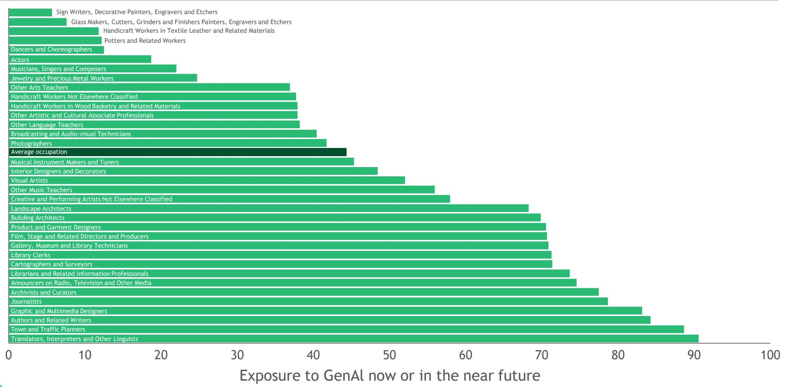  
1. Cultural and creative occupations are defined in ISCO at the 4-digit level according to the Eurostat definition used by the OECD. Source: (Eloundou et al., 2023[47], (OECD, 2022[53]), Cities of Choice Survey, 2025.  
However, survey indicates stronger sentiment in creative class  
GenAI usage and positive sentiment: overall vs. creative class

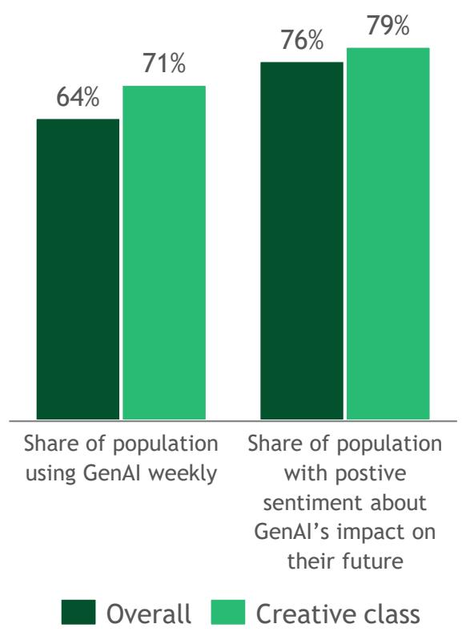

## Cities worldwide are implementing proactive strategies to mitigate AI-driven job displacement in the creative industry

<table><tr><td colspan="2">Mitigation measure</td><td>Description</td><td>City examples</td></tr><tr><td></td><td>Regulation and policy for protecting creative rights</td><td>Laws and guidelines protecting creators&#x27; rights and ensuring fair AI usage</td><td>Paris (2025): National consultation developing frameworks to license creative content for AI, ensuring creators receive fair compensation and creditSeoul (2025): Basic Act on Al mandating clear labeling of AI-generated content, protecting creators from unauthorized use</td></tr><tr><td></td><td>Union negotiations to ensure human authorship and control</td><td>Union agreements ensuring human creators maintain credit and control</td><td>Los Angeles (2023): Writers Guild (WGA) secured contractual protections that AI-generated material cannot reduce writers&#x27; credits or compensationLos Angeles (2023): SAG-AFTRA ensured actors&#x27; informed consent and compensation for use of digital replicas or AI-generated likenesses</td></tr><tr><td></td><td>Training and upskilling</td><td>Specialized programs helping creatives integrate AI into workflows</td><td>Tokyo (2023-2024): Industry-supported training programs encouraging manga and anime artists to adopt hybrid creative-AI workflows</td></tr><tr><td></td><td>Public funding and strategic investment</td><td>Public investments supporting creative industries adapting to AI changes</td><td>London (2025): £10 million public investment in creative sectors (fashion, film, gaming), funding human-led innovation and skills trainingSeoul (2024): AI Innovation Hub (&quot;AI Tech City&quot;) providing resources, financial support, and facilities to help creative businesses leverage AI effectively</td></tr></table>

## Theme 4

## Leisure time and work-life balance

## People (especially young people) increasingly value leisure time and work-life balance

## Among employed people, work dominates the day, especially in Asia and the Middle East, and crowds out personal or domestic time

Survey: How much time per day do you spend on the following activities? (sum=24 hours)
Sample: Employed respondents, n=120-300 per city

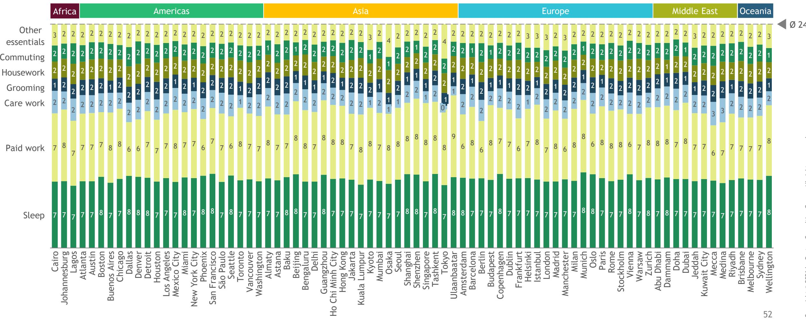

## Work intensity peaks during midcareer years in over 50 cities, while in about 20 cities, residents aged 55 and older work the most, on average

Average daily hours spent on paid work by employed people by age group

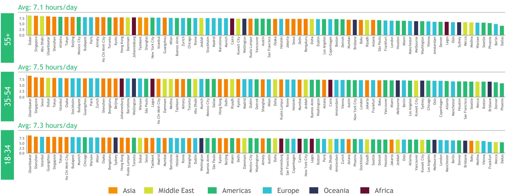  
Survey: How much time per day do you spend on paid work? Sample: Employed respondents, n=120-300 per city.

## Only in 29 cities do more than half of the respondents visit leisure locations at least a few times a week

Survey: How frequently do you visit the following social and leisure locations within your city (restaurants, cafes, markets, bars, parks, entertainment)? Sample: All respondents, n=\~300 per city

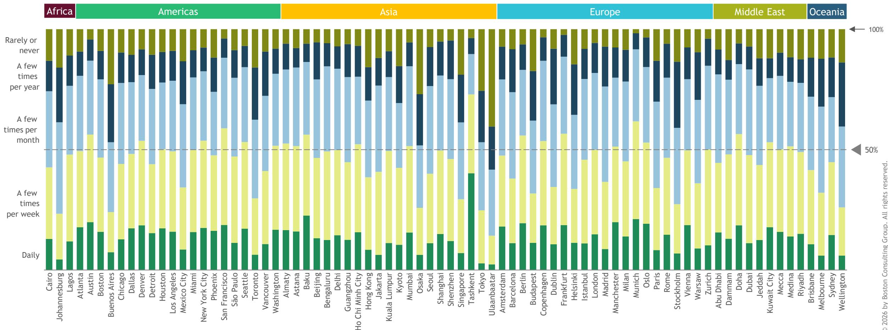

## All Central Asian and German cities are in top 20

People who visit leisure locations at least several times a week (%)  
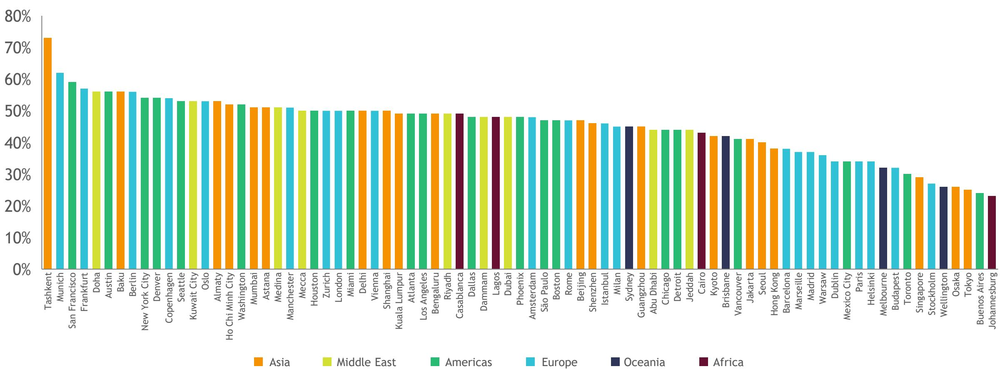  
Survey: How frequently do you visit the following social and leisure locations within your city (restaurants, cafes, markets, bars, parks, entertainment)? Sample: All respondents, n=\~300 per city.

UAE, European, and Asian cities lead in time spent at leisure locations, while North American cities significantly underperform despite the high frequency

Time spent at leisure locations (hours/week)

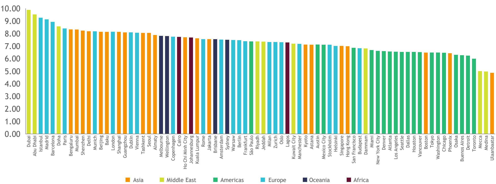  
Note: Assumptions made on the length of time (minutes) spent at each location (restaurants, cafes, markets, bars, parks and entertainment) and regarding the exact frequency number regarding the “few times per week/month/year.”

## In about 80% of cities, over half of the respondents meet friends or colleagues outside work at least once a week

Survey: How often do you meet with your friends or colleagues outside work or study? Sample: All respondents, n=\~300 per city

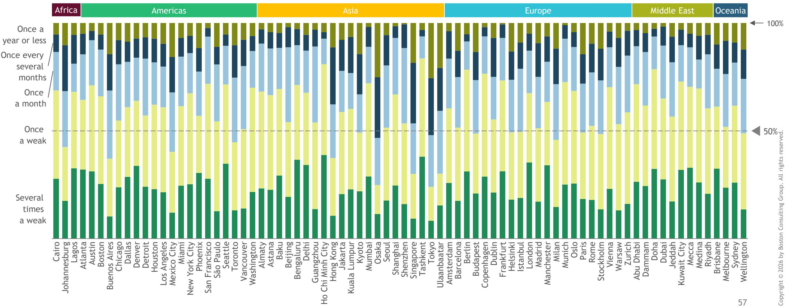

## Tashkent and Ho Chi Minh City lead in this category

Residents meeting friends outside of work at least once a week (%)  
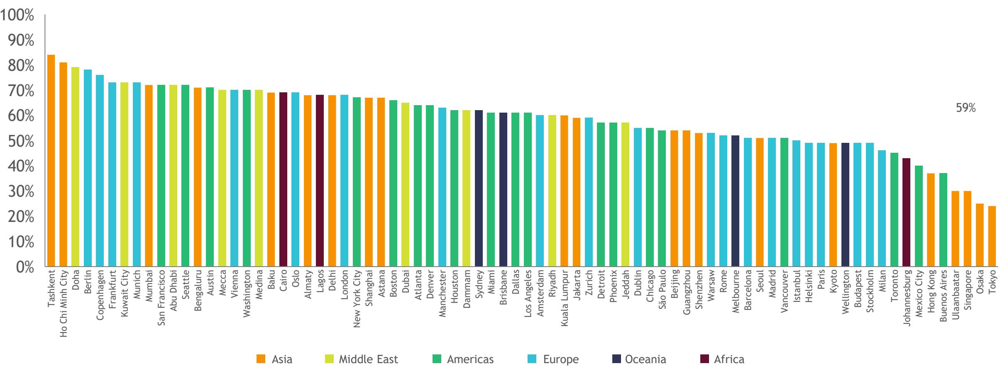  
Survey: How often do you meet with your friends or colleagues outside work or study? Sample: All respondents, n=\~300 per city.

On average, respondents aged 18 to 34 meet with friends more frequently, except in smaller ME cities, where older age groups are more socially active

Residents meeting friends outside of work at least once a week (%)  
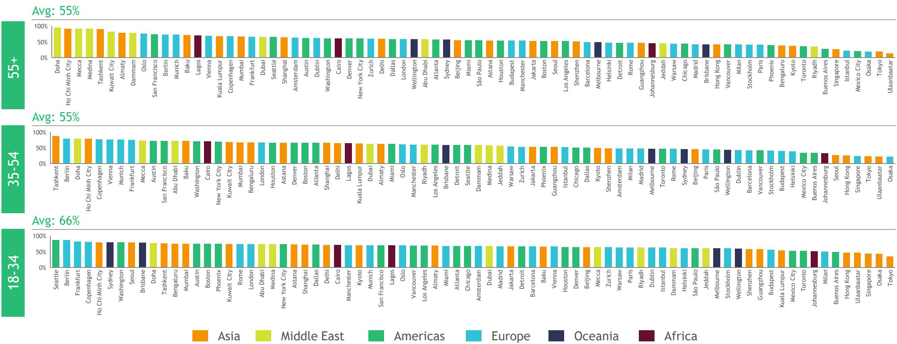  
Survey: How often do you meet with your friends or colleagues outside work or study? Sample: All respondents, n=\~300 per city.

## Theme 5

## Longevity and healthy aging

## Ultralow fertility levels and longevity and health tailwinds are leading to high proportions of elderly people

The share of the population aged 65 and older is set to rise in many cities and may grow even more due to policies and quality of health care

Share of 65+ population of total population across cities (2050)  
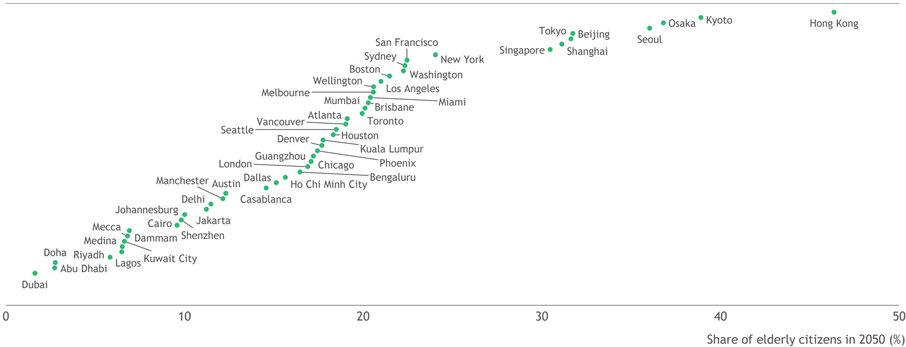  
Note: Elderly population assumed at 65+ years old across cities. Projections made assuming cities maintain current policies and regulations. Source: BCG analysis; Oxford Economics.

## Longevity and healthy aging are mandatory for a city’s long-term success because needs are rising for current and future residents

Longevity and healthy aging are about more than simply living longer—they are about ensuring quality of life as people age. For cities, supporting healthy aging is critical to reducing social and health care burdens and preparing younger populations to sustain long-term well-being. Cities need to support two life strategies:

## Invest early to build health capital Longevity index (35-60 years old)

Longevity starts well before old age—habits formed at a younger age shape well-being later in life

A city's long-term livability depends on how it equips younger residents with tools and environments to age healthily

By fostering healthy lifestyles early, cities create a culture of wellness that benefits individuals and society across generations

  
We look at which city is best in longevity for people 35-60 years old, since cities play a critical role in providing infrastructure for longevity

## Preserve health capital for lifelong well-being Healthy aging index (60+ years old)

A longer life isn’t always a healthier one—the goal is to extend health spans, not just lifespans

By 2050, $22\%$ of the global population will be 60 years old or older—that's one in every five people

Supporting healthy aging reduces the strain on health care systems and social services, while enabling older adults to remain active contributors to society

We look at which city is best for healthy aging in terms of living an active life and receiving decent care, focusing on people 60+ years of age

## A large gap between lifespan and health span may signal that cities lack the required infrastructure and services for people to live longer, healthier lives

Seoul and Doha, as well as US and Indian cities, have the biggest gap between life and healthy life expectancy, whereas many Asian cities have the smallest difference

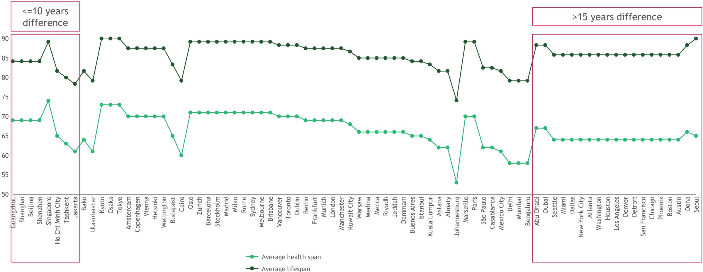  
Note: Life expectancy and healthy life expectancy are country-level data.

1. Source: Nguyen et al.: Impact of 8 lifestyle factors on mortality and life expectancy among United States veterans: The Million Veteran Program.
2. NCDs: Noncommunicable disease (cardiovascular diseases, cancer, diabetes, or chronic respiratory diseases).

## This report measures seven of eight core healthy habits $^{1}$ that build health capital early for people 35 to 60 years old and two longevity indicators

<table><tr><td colspan="2">Core dimensions that build health capital early</td><td>Longevity indicators measured in Cities of Choice 4.0</td></tr><tr><td rowspan="8">Healthy habits</td><td>Exercise regularly</td><td>1 Share of population that practices sports regularly2 Share of middle-aged population that has participated in healthy lifestyle programs at least once in the past year3 Share of population that uses walk/run as primary choice when going somewhere4 Number of fitness centers and swimming pools per 100,000 population</td></tr><tr><td>Positive social connections</td><td>5 Share of middle-aged population that feels him/herself is part of a community6 Average number of times meeting up with friends per month7 Loneliness score</td></tr><tr><td>Restorative sleep</td><td>8 Hours of sleep per day</td></tr><tr><td>Manage negative stress</td><td>9 Happiness score</td></tr><tr><td>Healthy, balanced diet</td><td>10 Number of local farmers&#x27; markets with access to fresh food, per 100,000 population11 Obesity rates</td></tr><tr><td>No excessive alcohol consumption</td><td>12 Share of population that excessively consumes alcohol</td></tr><tr><td>Never smoke</td><td>13 Share of population that smokes</td></tr><tr><td>No opioid use</td><td>Not included</td></tr><tr><td colspan="2">Outdoor space</td><td>14 Average number of hours spent outdoors per week15 Share of the city&#x27;s area allocated for green spaces</td></tr><tr><td colspan="2"> $NCDs^2$ </td><td>16 Probability of dying between 30-70 years old from  $NCDs^2$ </td></tr></table>

Leadership on longevity ranking for people 35 to 60 years old sits largely in Asia and Europe, but Japan falls behind the pack

Longevity for population 35-60 years old, subranking score (0-100)

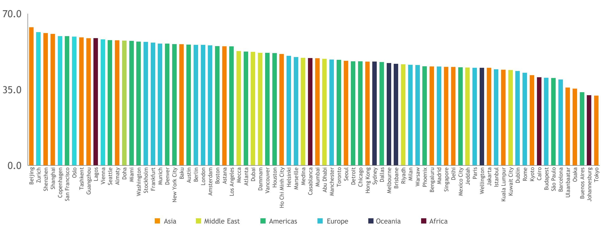

## Details | Across survey-based indicators, Middle Eastern cities score above average on most, whereas Oceanian cities fall behind the average

Residents who choose walk/run as primary method when going somewhere, score (0-100)

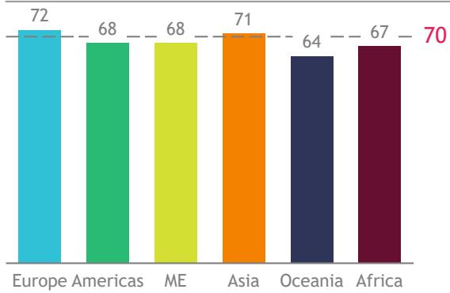  
Residents who believe him/herself belongs to a community (%)

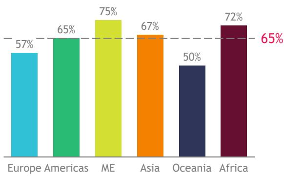  
Residents who participated in healthy lifestyle program at least once in the past 12 months (%)

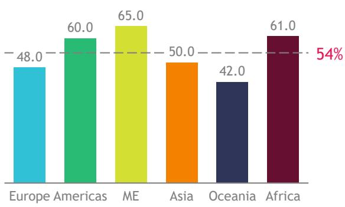  
Number of times per month that respondent meets friends/colleagues outside of work/study

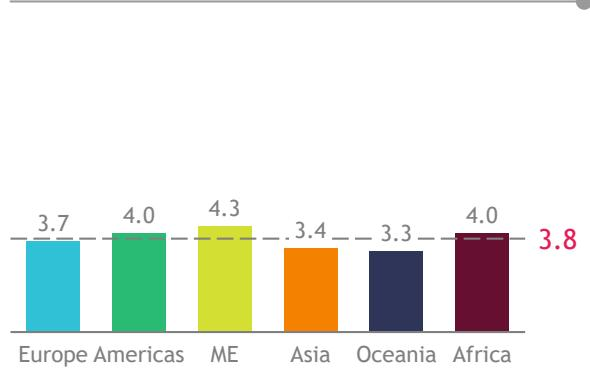  
Number of hours spent outdoors every week

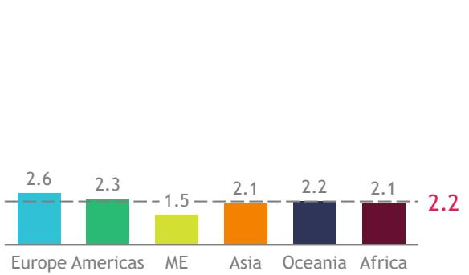  
Loneliness index, survey, share of feeling lonely; 100 most connected, 0 most lonely  
Number of hours of sleep per day

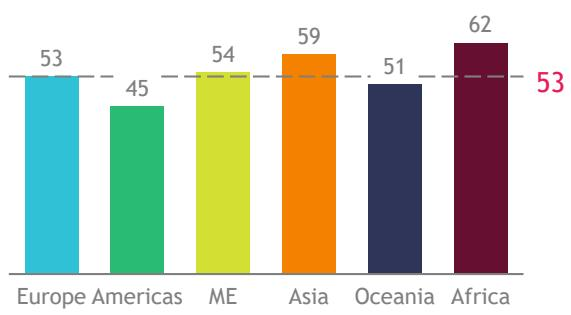

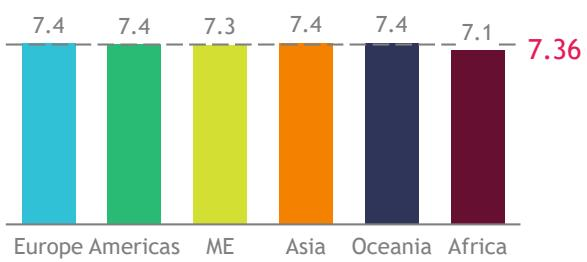  
Happiness index, survey, share of feeling happy; 100 most happy, 0 most sad

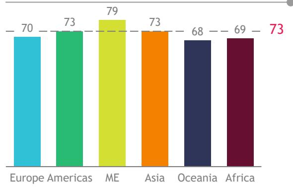

Details | East Asian cities and Paris have the lowest obesity rates, whereas Delhi stands at 81%  
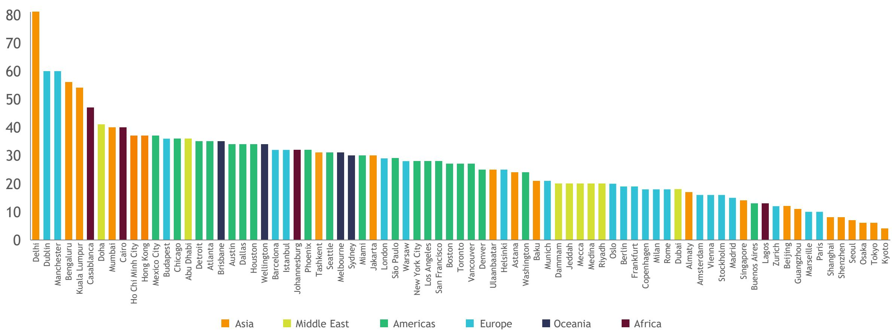

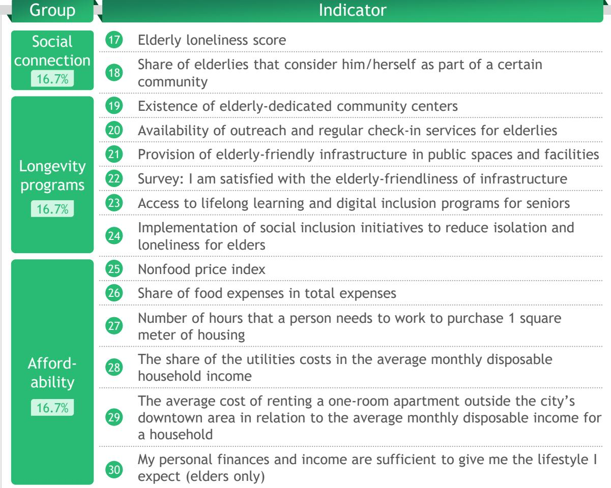

## Cities of Choice 4.0 evaluates six dimensions to determine if a city enables residents to preserve health capital in healthy aging index

## Group

## Indicator

Extreme temperatures score (Celsius degrees exceeding limits of extreme temperature)

2 Average number of hours of sunshine per year

3 Number of months with a comfortable daytime temperature

5 Air quality: PM2.5 content

6 Air quality: PM10 content

7 Air quality: $NO_{2}$ content

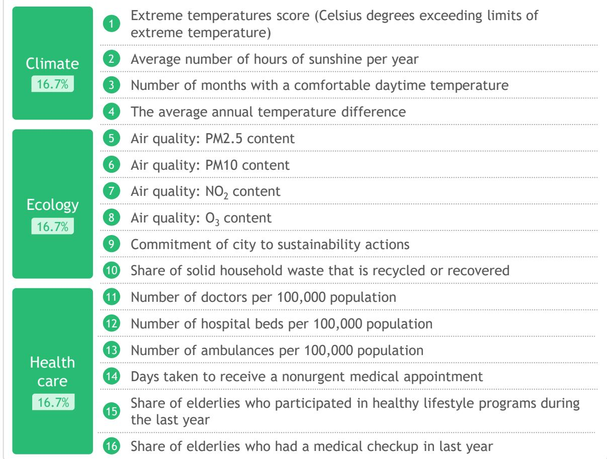

10 Share of solid household waste that is recycled or recovered

13 Number of ambulances per 100,000 population

14 Days taken to receive a nonurgent medical appointment

5 Share of elderlies who participated in healthy lifestyle programs during the last year

16 Share of elderlies who had a medical checkup in last year

Weight assigned

## Indicator

Share of elderlies that consider him/herself as part of a certain community

Existence of elderly-dedicated community centers

20 Availability of outreach and regular check-in services for elderlies

21 Provision of elderly-friendly infrastructure in public spaces and facilities

22 Survey: I am satisfied with the elderly-friendliness of infrastructure

23 Access to lifelong learning and digital inclusion programs for seniors

24 Implementation of social inclusion initiatives to reduce isolation and loneliness for elders

27 Number of hours that a person needs to work to purchase 1 square meter of housing

28 The share of the utilities costs in the average monthly disposable household income

29 downtown area in relation to the average monthly disposable income for a household

My personal finances and income are sufficient to give me the lifestyle I expect (elders only)

While American, Oceanian, and European cities lead the healthy aging index, Asian and Middle Eastern cities lag behind

Healthy aging subranking score (0-100)

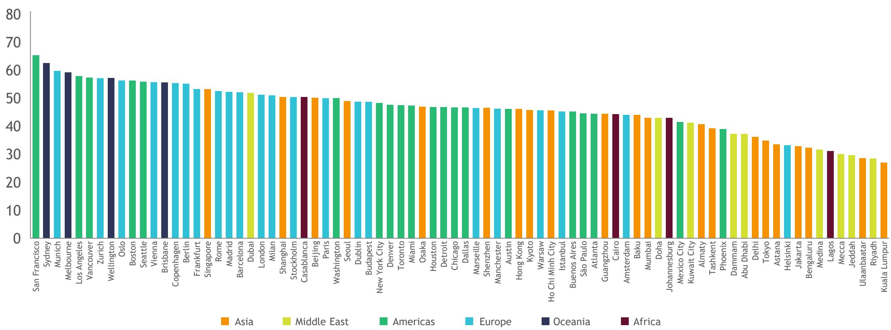

## Cities predominantly sit in archetype C, with a moderate elderly share and a medium loneliness index

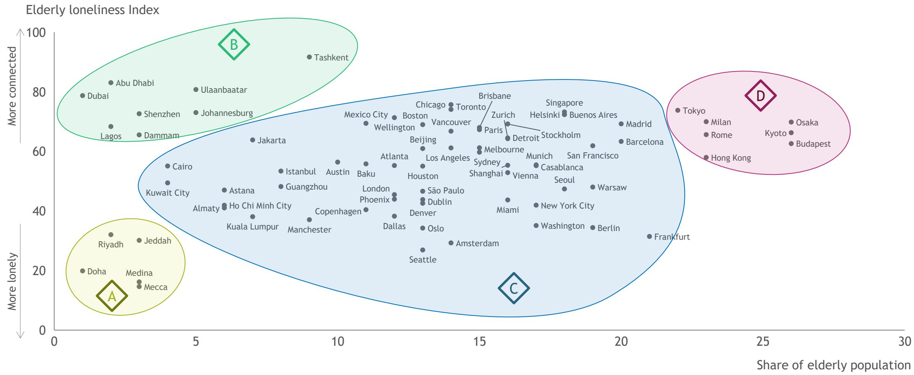

## Twenty-seven percent of respondents aged 60 or older want to move to other large cities

Largest share was recorded in cities where elderly feel more lonely

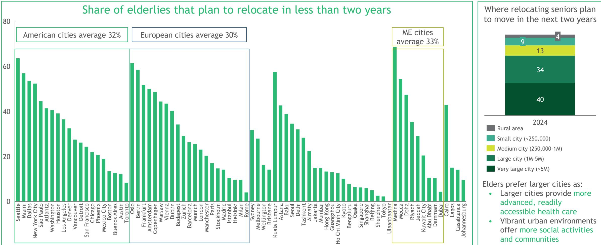

• Vibrant urban environments offer more social activities and communities

Higher loneliness among seniors corresponds to a greater share of those planning to leave their city

Elderly lonliness index  
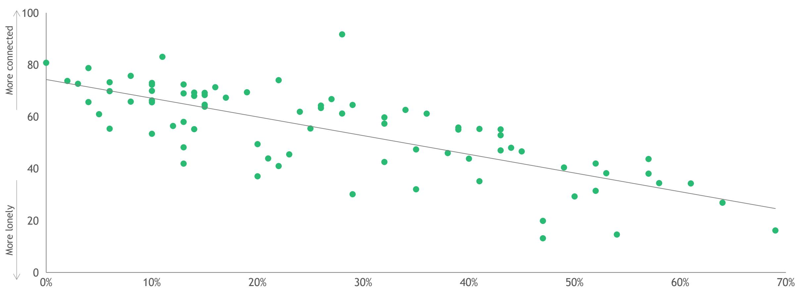  
Share of elderlies that plan to relocate in the next two years

## All cities should prepare for aging populations by designing for connection, access, and care

## Implication

## Less elderly, more lonely

\- Consider improving mobility and access so older adults can reach people and places easily

\- Invest in programs that create frequent, low-friction social contact for seniors

## Less elderly, less lonely

\- Protect what already works by funding community hubs and intergenerational activities

• Prepare for demographic shift by planning age-friendly infrastructure

## Moderately elderly, moderately lonely

\- Remove participation barriers to community activities so moderate engagement becomes habitual

\- Grow the supply and diversity of connection opportunities

## More elderly, moderately lonely

\- Leverage the large senior population to seed and scale neighborhood-based communities

\- Invest in citywide age-friendly infrastructure so participation becomes effortless

## Examples

Riyadh, Doha, Mecca

Dubai, Shenzhen,
Ulaanbaatar

Sydney, London, Zurich, Shanghai

Hong Kong, Osaka, Rome

## Longevity | Ensure age-friendly infrastructure, community care, and accessible services for seniors

Upgrading existing residential
neighborhoods to better
accommodate elderly residents

Barrier-free public transit ensuring full accessibility for elderly passengers

Designated elderly-friendly zones in urban areas with targeted safety measures

Regular services delivered directly to elderly at home

Beijing installs elevators in older walk-up apartment buildings across various districts and incorporates accessibility upgrades like handrails and nonslip walkways Kyoto offers subsidies for retrofitting traditional wooden houses (machiya) with senior-friendly amenities

Japan implements a nationwide policy requiring barrier-free public transportation; nearly all major train and subway stations in Japanese cities feature wheelchair access, elevators, ramps, and clear navigation systems

Seoul ensures all subway stations have elevators or escalators and that buses are fully wheelchair accessible

Singapore has created “Silver Zones,” specially marked residential areas with lower speed limits, narrower lanes, and extended pedestrian crossing times

New York City implements the “Safe Streets for Seniors” initiative, where intersections have been redesigned with pedestrian islands, extended crossing signals, and improved signage in these identified neighborhoods

Cities including Beijing, Seoul, and Shanghai provide extensive home-based caregiving services, with trained professionals or volunteers regularly visiting elderly residents for personal care, medical assistance, or social interaction

## Longevity | Involve the elderly population in social and economic activities

Social activities and lifelong learning programs that allow elderlies to remain socially engaged, physically active, and mentally stimulated

Intergenerational support programs that reduce isolation and foster mutual aid

## #

Elderly-focused neighborhoods providing essentials within close proximity

## #

Policies providing financial or service support to individuals caring for elderly family members

Hong Kong operates the “Elder Academy,” enabling seniors to participate in educational courses at schools and universities, facilitating continuous learning and social integration. New York City provides extensive senior center programs, including wellness activities, arts and technology classes, and social clubs, promoting an active, connected lifestyle for elderly residents

Tokyo operates innovative home-sharing programs where university students that need affordable housing live with elderly residents, offering companionship while addressing housing need

Shanghai has created “15-minute Elderly Care Service Circles,” ensuring seniors can access essential health care, social services, and community activities within a short walking distance from their homes

Singapore developed “Kampung Admiralty,” an integrated residential complex that combines senior-friendly housing with health care facilities, retail spaces, parks, and community services

Singapore provides the “Caregiver Support Grant,” offering financial assistance directly to families caring for elderly relatives with moderate to severe disabilities

Tokyo offers tax deductions and subsidies for families employing professional caregivers

## Theme 6

## Safety and resilience

Lower societal trust, climate disruptions, and high-profile acts of terror are increasing resilience and safety concerns in cities

Overall, residents report feeling safer than they did in 2021, with ME and Asian cities continuing to lead in perceived safety

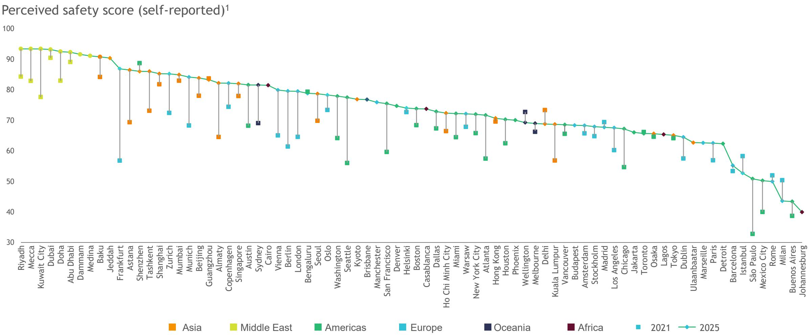  
1. Based on survey question: To what extent do you agree with the statement “I feel safe in the city”?

Known crime cases show mixed trends—Asian and ME cities remain the safest, while South American cities have worsened notably

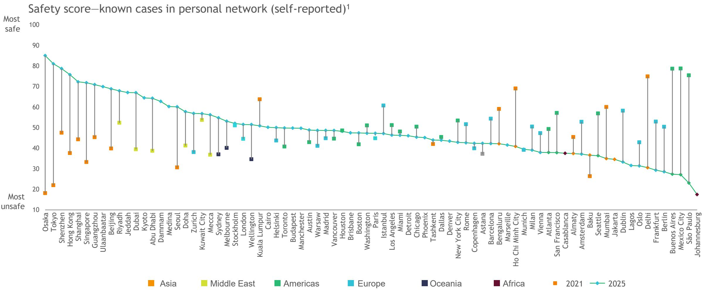  
1. Based on survey question: Do you know of any cases when you or anyone you know personally got physically attacked or robbed, insulted or pestered while in the public space or at home?

## Safety and resilience indicators organized by objective and subjective metrics

## Indicator

Murders per year per 100,000 population

Violent crimes - kidnapping per 100,000

Violent crimes - serious assault per 100,000

5 Number of CCTV cameras within city area

6 Number of victims of terrorist attacks in the last 10 years per 100,000 population

## Objective indicators

7 Number of deaths from terrorist attacks in the last 10 years per 100,000 population

8 Number of deaths from natural disasters in the last 10 years per 100,000 population

9 Level of exposure to natural disasters and estimated potential impact of natural disasters (index)

10 Number of intensive care beds per 100,000 population

11 Resilience strategy (incl. sustainability, to extreme natural disasters, terrorism/war) in place

12 Number of emergency service personnel per 100,000 population

## Indicator

Do you know of situation when someone whom you know personally was physically assaulted or robbed, insulted or molested in a public place or at home?

15 Generally, I feel safe in the city

16 How much you worry about being physically attacked or robbed while in a public space

17 How much you worry about being insulted or pestered while in a public space

18 How much you worry about your personal belongings being stolen

19 I trust the police in the city

20 I trust the courts of the city

21 I trust the city mayor and his/her team

I trust the leader of country and his/her team

While subjective and objective measures show some variation, ME and Asian cities maintain leading positions in safety and resilience

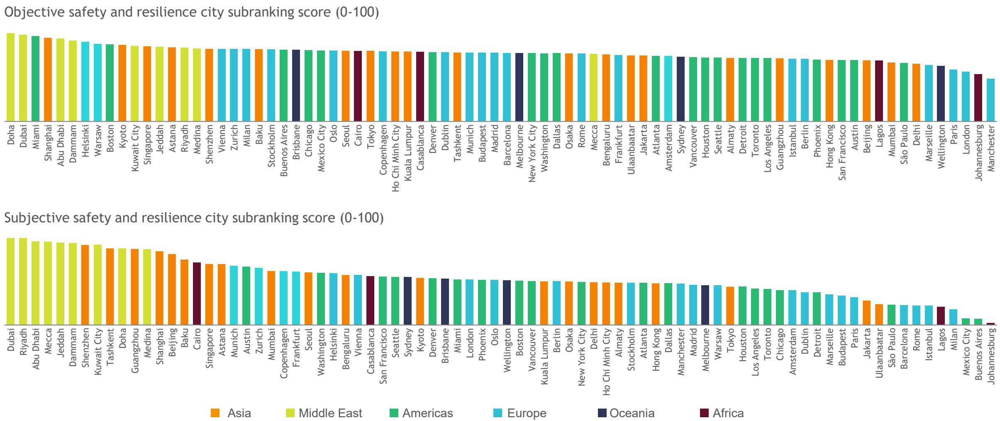

## In some cities, residents trust city leaders more than national ones, stemming from underperforming national authorities or more responsive local leadership

Top 15 cities with the largest positive gap in trust for city mayor vs. country leader

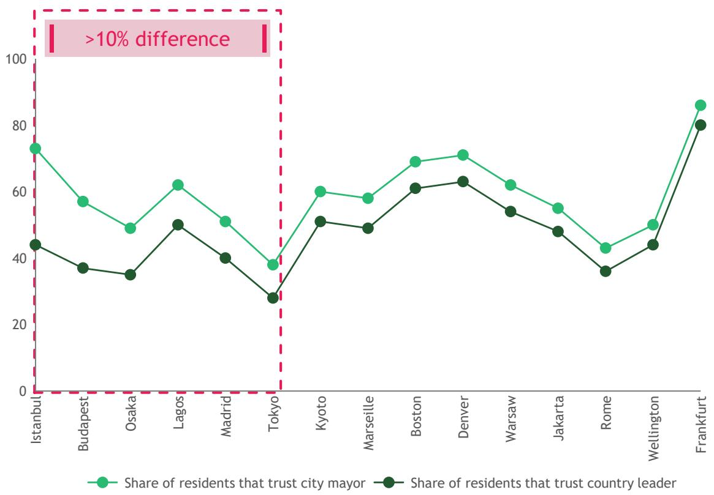

Drivers behind higher trust in city leadership

<table><tr><td></td><td>Istanbul</td><td>Istanbul&#x27;s local government is responsive and visible in addressing daily urban issues (transport, infrastructure, etc.), while national government is perceived as distant</td></tr><tr><td></td><td>Budapest</td><td>Municipal leaders remain close to residents&#x27; urban realities and service delivery, whereas the national government faces fiscal and political challenges that weaken overall trust</td></tr><tr><td></td><td>Japanese cities</td><td>Local governments focus on improving public services, livability, and city branding, making them more relevant to daily life; national institutions, though stable, feel less immediately connected to citizens</td></tr><tr><td></td><td>Lagos</td><td>Widespread distrust in national institutions, politics, and governance elevates relative confidence in city leadership</td></tr><tr><td></td><td>Madrid</td><td>While Spain&#x27;s governance is rather decentralized, Madrid has ongoing citizen engagement platforms like Decide Madrid that encourages engagement and reinforces trust in local authority</td></tr></table>

Note: The share of residents who trust the city mayor and the share of residents who trust the country leader are based on the Cities of Choice Survey. Residents who provided positive responses are counted as trusting.

## Across global cities, trust in city mayors tends to move in line with trust in national leaders, although ME and Asian cities exhibit higher overall trust

Level of trust in city mayor

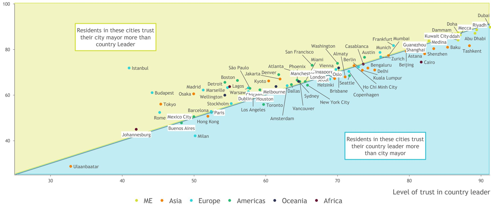

## Residents in Istanbul, Budapest, and Detroit trust their city mayor significantly more than their country leader

Japanese cities and a number of US cities also demonstrate stronger trust in city mayor compared with country leader

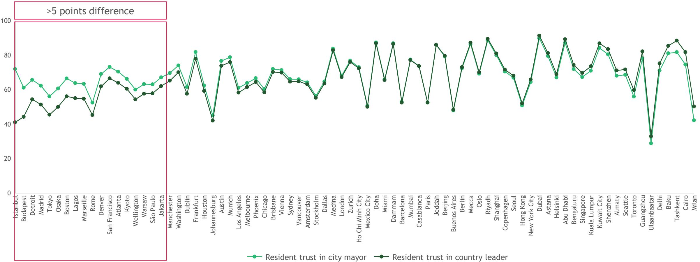  
Note: Resident trust in city mayor and resident trust in country leader are measured through Cities of Choice Survey. The results are converted to a score (0-100), where 100 indicates the highest level of trust.

## Theme 7

## Housing affordability

## Housing markets have become deeply unaffordable, largely because supply has not kept up with demand

## Renting is more affordable in many major Asian cities, while Middle Eastern and many American cities show higher overall housing affordability

The average cost of renting a one-room apartment in relation to the average monthly disposable income for a household

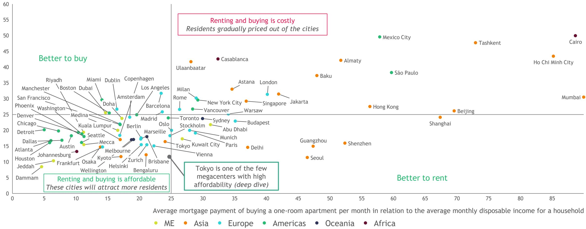

## For the 36 cities with mortgages above 25% of salary, we classified them into four groups based on salary, home prices, and mortgage rates

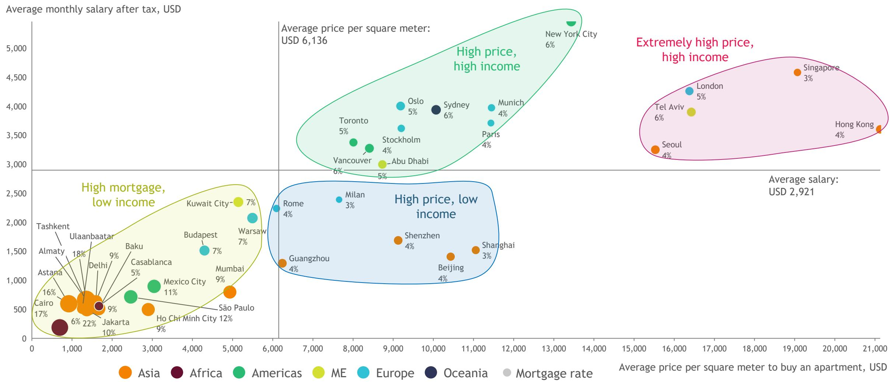  
Average price per square meter to buy an apartment, USD  
Note: The average price per square meter and average salary are calculated using our data set of 80 cities. Source: Numbeo, BCG analysis.

The average share of mortgage payments relative to household disposable income increased from 48% in 2021 to 64% in 2025

Average mortgage payment relative to average monthly household disposable income $^{1}$

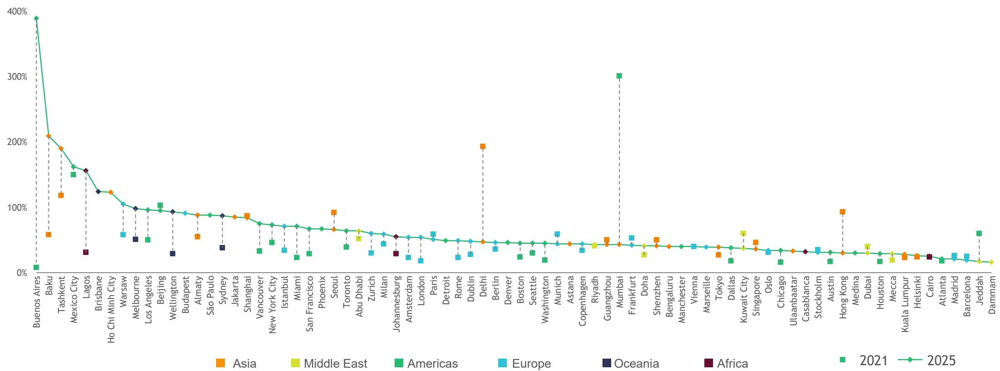  
1. Monthly mortgage payment estimated using average price per square meter, assumed square meter per person and average household size, prevailing mortgage rate, 20% down payment, and a 20-year mortgage term. The resulting monthly payment is divided by average monthly household disposable income to derive the percentage. Source: Numbeo, BCG analysis.

## The average number of hours that a person needs to work to purchase 1 square meter of housing increased from 326 hours in 2021 to 342 hours in 2025

The number of hours that a person needs to work to purchase of 1 square meter of housing $^{1}$

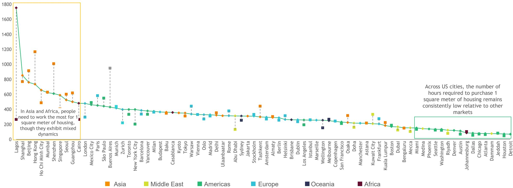  
1. Indicator calculated by dividing the average price per square meter of housing by the implied hourly wage, derived from average monthly income assuming eight working hours per day and 21 working days per month.
Source: Numbeo, BCG calculation.

Cities in North America and Oceania exhibit the highest average square meter of housing per person, whereas Asian cities consistently rank lower

Average square meter of housing per person

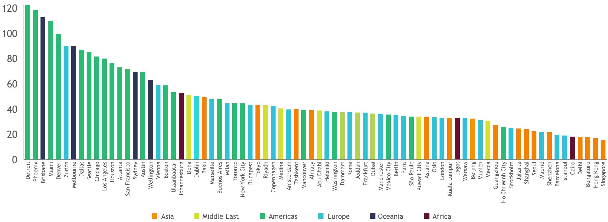

## Theme 8

## Subjective and objective in cities

## Objective reality in cities and subjective perceptions of residents do not always match

Overall ranking | Middle East and part of Asia is more optimistic, while parts of Europe is more pessimistic across the overall ranking

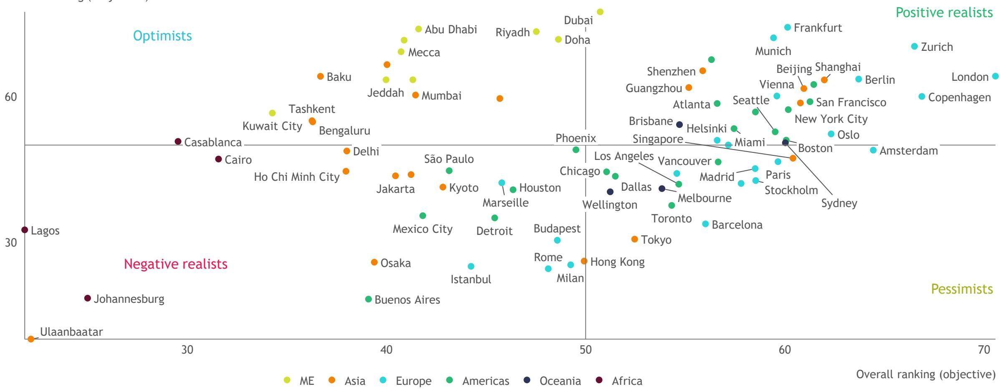  
Note: Objective-data-based indicators or self-reported behavioral survey questions; subjective-opinion-based survey questions.

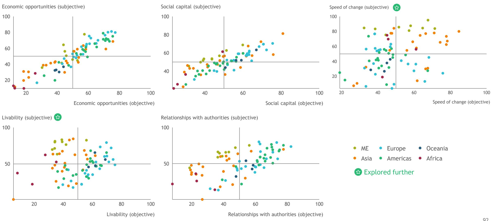

## Dimensions | Overall sentiment differs from the objective reality mainly in livability and speed of change

Livability | Residents are generally satisfied in the Middle East and parts of Asia, although objective metrics perform lower

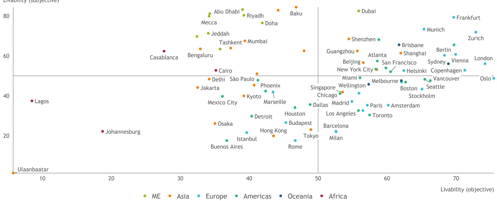

## Speed of change | Perceived vs. actual speed of change diverges by region—ME and Asian cities show aligned momentum

Residents' perception of progress in ME and Asian cities aligns with actual change

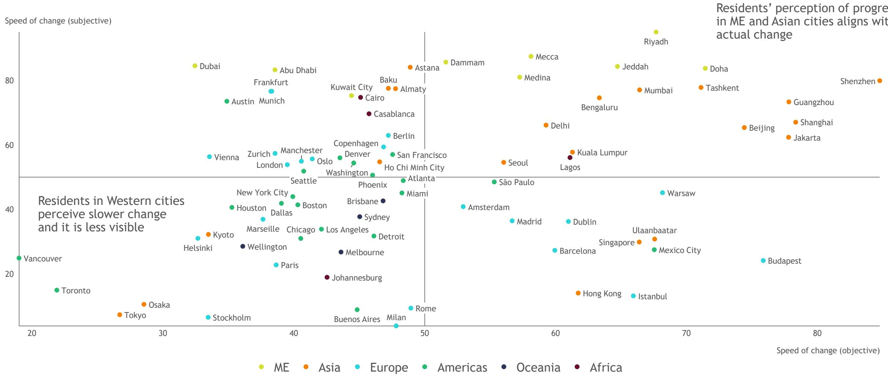

Infrastructure and advocacy | Developed cities excel in infrastructure but not pride, while emerging cities inspire pride despite weaker systems

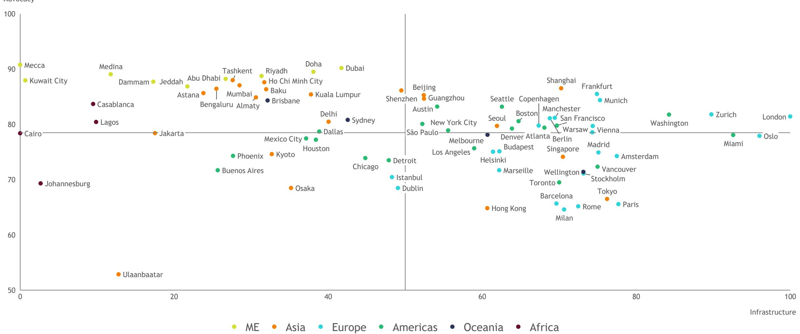

## Theme 9

## Congestion and commuting time

## Congestion and long commute times are rising steadily in large cities

Commute time (minutes)

## Average commute time has risen by 6% since the last edition, possibly because of slower commuting speeds on public transport and more cars coming to cities

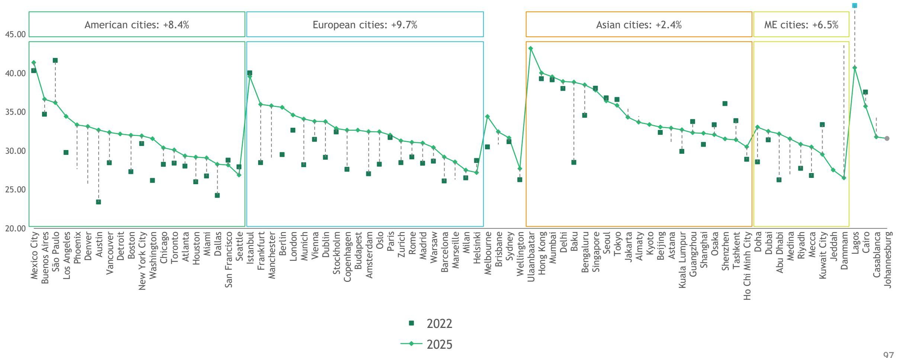

2021 2025

The number of cars has increased by 7.5%, on average, since 2021, driven by Asian and ME cities, with Central Asian cities showing the biggest growth of 22%

Number of passenger cars (millions)

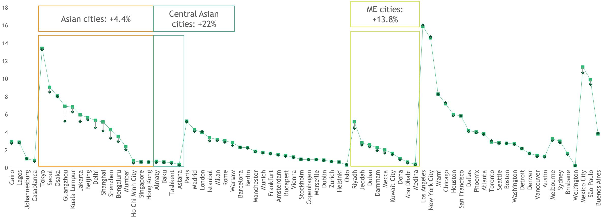

## Residents of Middle Eastern and American cities still rely primarily on private cars for commuting

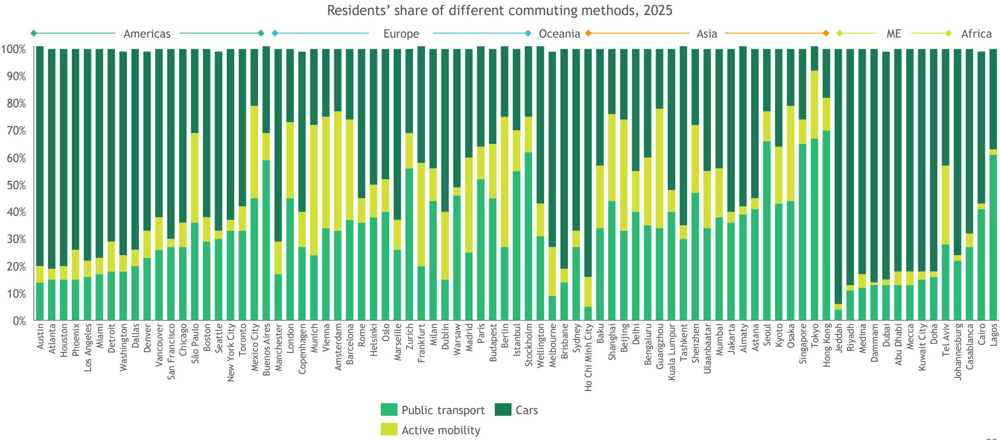

## Residents’ usage of public transport correlates with the increased time to commute

Average commute time (minutes)  
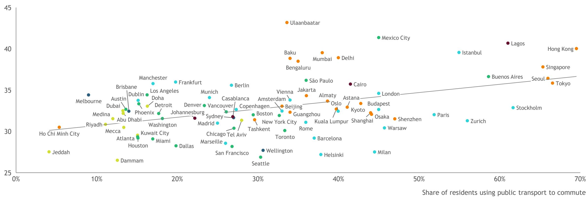

## Theme 10

## The connected city

## The 15-minute city index is emerging as a key driver of urban livability and competitiveness

## Our connected-city index was inspired by the 15-minute city concept, which was reinterpreted by various other cities using different approaches

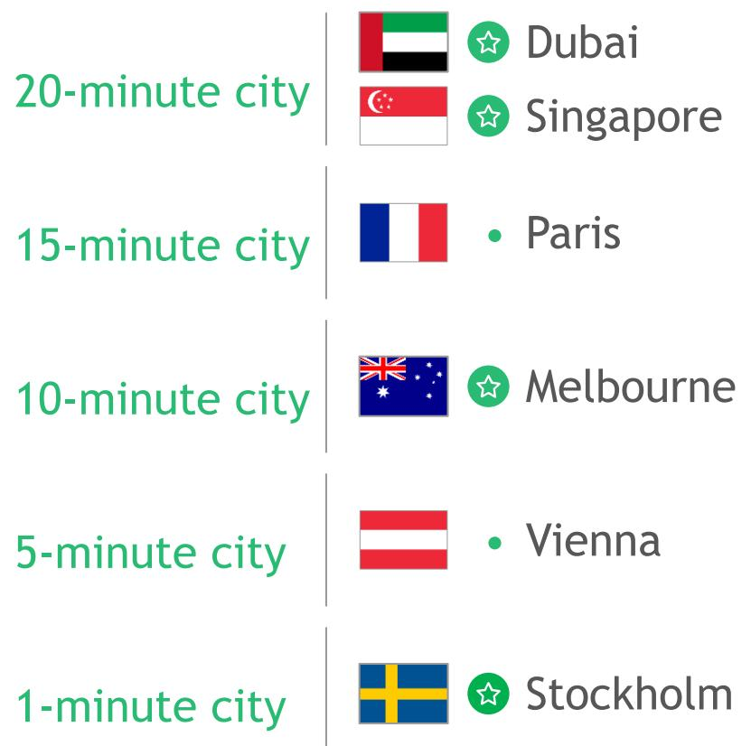

“Within the distance of a 15-minute walk or bike ride, people should be able to live the essence of what constitutes the urban experience.”
— Carlos Moreno, advisor to Paris’s 15-minute city plan

“The 20-minute neighborhood concept is all about creating walkable, healthy, cohesive, sustainable communities with strong local economies.”

— Richard Wynne (former Minister for Planning and Housing, Australia)

“So our idea is you need to be able to access everything within five minutes, walk, get out of your front door, go walk around the corner and you find everything.”
— Expert interview

## Key takeaways

\- Concept typically applied at the neighborhood level

\- Proximity (e.g., five minutes) to essential services is defined by walking distance

\- Accessibility to services are enhanced by micromobility (e.g., bikes)

## Planning or early implementation stage

## Cities that embrace the 15-minute city have already achieved measurable improvements in livability

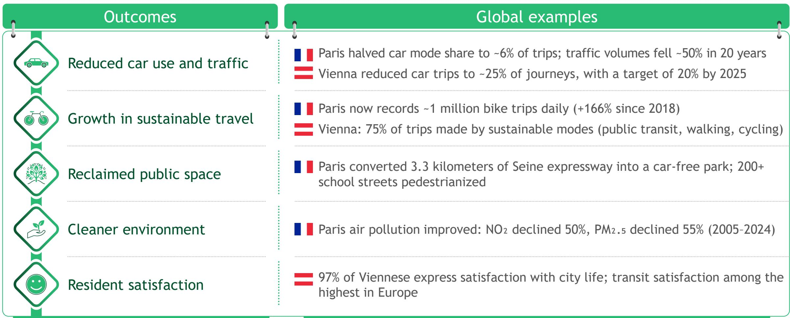  
Source: Tools of Change, Paris Car Reduction Case Study (2023); Vienna Mobility Report (2019), Stadt Wien; El País, Cycling Revolution in Paris (2024); City of Paris, Les Berges de Seine Redevelopment; City of Vienna, Supergrätzl Favoriten Pilot (2022); AirParif, Air Quality in Île-de-France (2024); City of Vienna Urban Development Report (2021); EU Quality of Life in Cities Survey (2015).

## We employed a three-layer approach to evaluate the connected-city index

Layer 1 - Availability of assets

Are the essential services and amenities dense to create a basis for 15-minute city?

We assessed the number of services and amenities present in the city, grouped by frequency of use

Weight 40%

50% Daily needs (e.g., groceries)

25% Weekly needs (e.g., retail space)

25% Less frequent needs (e.g., hospitals)

Does the land use support connectivity?

Layer 2 - Accessibility

95%

Weight 40%

How easily can residents reach and use these amenities?

Beyond presence, we evaluated how easily residents can reach and use these assets

Accessibility and walkability
Accounting for elements such as micromobility, convenient access to work

5% Comfort climate
Accounting for climate conditions that shape outdoor accessibility

Layer 3 - Underlying conditions

Weight 20%

Share of economic land use

## The connected-city indicators' classification and weighting

## Layer 1

## Indicator - 40%

Number of children's playgrounds per 100,000 population

Number restaurants per 100,000 population

Number of fitness centers and swimming pools per 100,000 population

Number of coworking spaces per 100,000 population

Density of metro stations

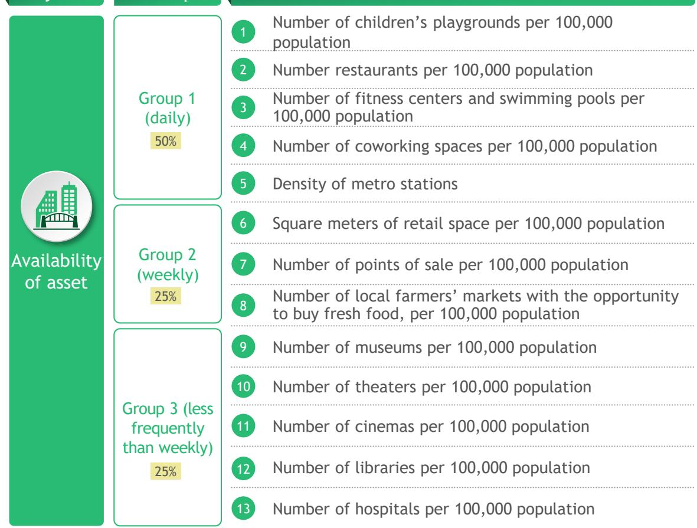

Square meters of retail space per 100,000 population

8 Number of local farmers' markets with the opportunity to buy fresh food, per 100,000 population

Number of museums per 100,000 population

Number of theaters per 100,000 population

Number of cinemas per 100,000 population

Number of libraries per 100,000 population

Number of hospitals per 100,000 population

Economic land use score

## Indicator - 40%

14 Average time (minutes) lost in traffic jams per resident

15 Time to commute from home to place of work or study (survey)

16 Share of population that has convenient access to public transport

17 Presence of infrastructure for velo transport

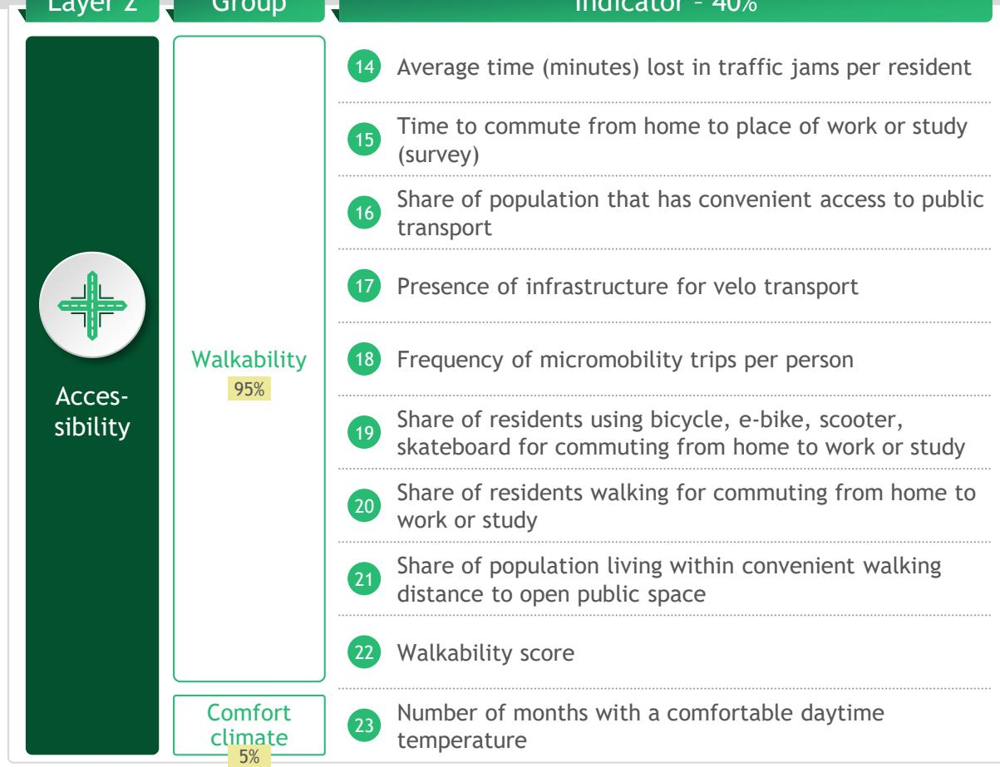

19 Share of residents using bicycle, e-bike, scooter, skateboard for commuting from home to work or study

20 Share of residents walking for commuting from home to work or study

21 Share of population living within convenient walking distance to open public space

23 Number of months with a comfortable daytime temperature

Amsterdam ranks top among 80 cities, whereas Ulaanbaatar, Cairo, and Lagos are lagging behind

Connected-city subranking score (0-100)  
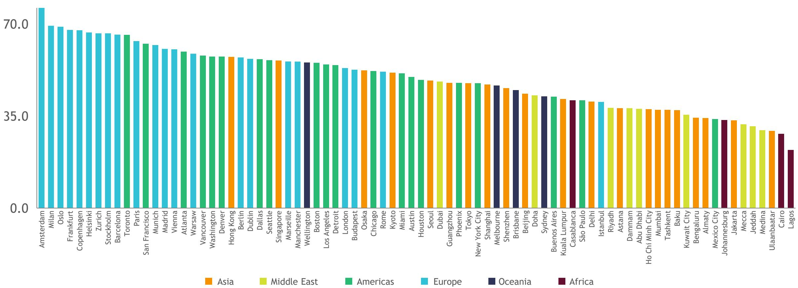

## Theme 11

## Downtowns

Downtowns are strained since the pandemic because of remote and hybrid working, with lower footfall and retail spending

Desk workers drive downtown vitality and economic activity, visiting leisure spots more often (47%) than deskless workers (20%) or the unemployed (15%)

Respondents visiting leisure locations at least a few times per weak by employment category (%)

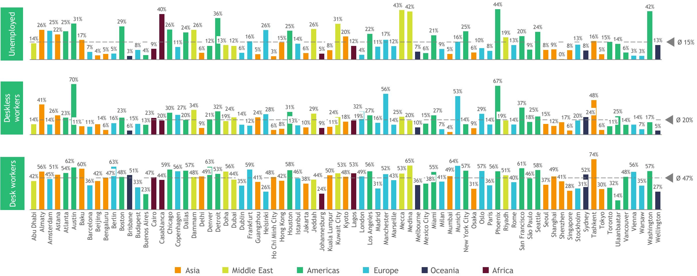  
Note: Survey question, “How frequently do you visit the following social and leisure locations within your city: restaurants, markets, bars, entertainment?” Sample: All respondents, n=300/city.

Downtowns in Europe and North America continue to see a post-COVID outflow of office workers, with hybrid or home-based work exceeding 40% in major cities

People who work or study fully or partially from home (%)  
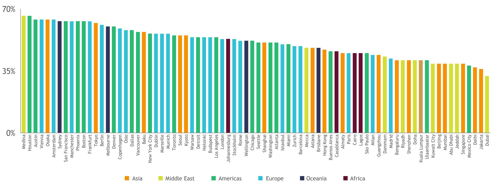

Note: Survey question, “How often do you work/study in location outside of your home?” Sample: Employed respondents, entrepreneurs, and students, n=200-300/city.

European and North American downtowns are also less frequented for weekend entertainment compared with those in the Middle East and Asia

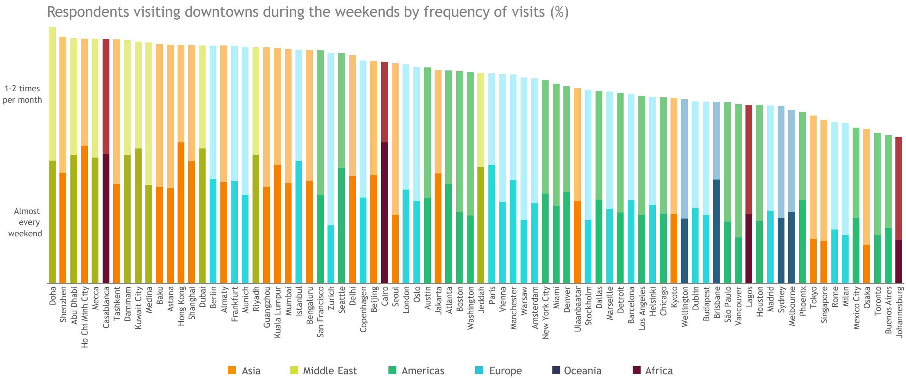  
Note: Survey question, “How often do you visit a downtown/city center on weekends?” Sample: All respondents, n=300/city.

## Theme 12

## Tourism and business leisure

## Cities are becoming more popular destinations for tourists, with business travelers, for example, increasingly extending work trips for leisure, boosting footfall in well-connected cities

Expansive flight connectivity amplifies a city's travel economy, with global hubs such as Dubai and Istanbul far outperforming peers

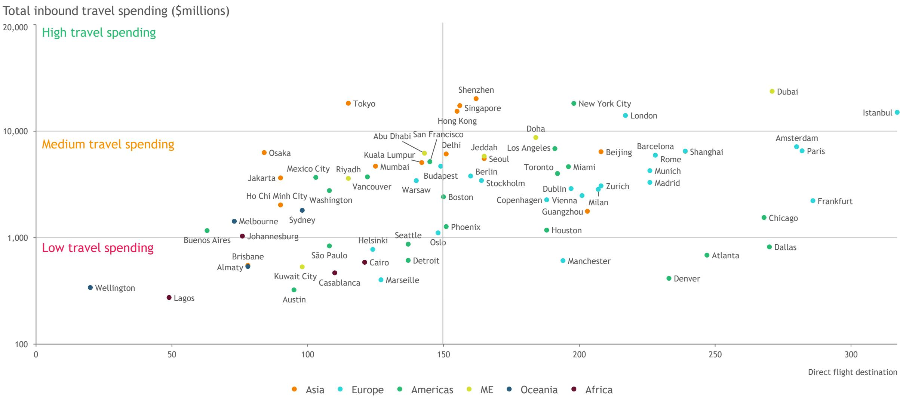

## BCG's recent report, Traveler of the Future, $^{1}$ provides insights on urban tourism

\- Cities are in the top share of travel, with 15%-20% of all trips booked during the last 12 months (vs. nature at 12%-24%)

\- A new trend important for cities emerges—B-leisure tourism—a combination of business and leisure; at least one combined trip taken by 35% of UK travelers, 85% of Chinese travelers, 87% of Saudi travelers

\- This means that business travelers more and more combine business trips with leisure, extending their business trips to experience the cities

\- This provides a great opportunity for cities to expand their share of economy related to tourism

• We have modeled the conversion of business travelers into leisure visitors for a sample of Cities of Choice participants

## Encouraging business travelers to extend their stay for leisure could unlock substantial additional inbound travel revenue

Annual international overnight business visits, 2023 (millions)  
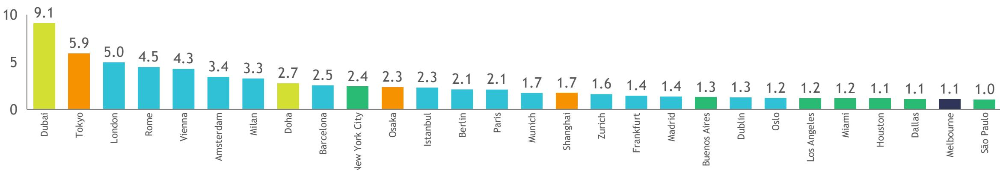  
Estimated annual total inbound travel expenditure with 100% business-leisure conversion $^{1}$ (millions)

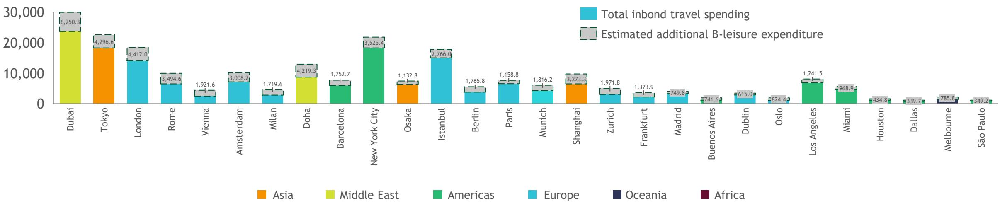  
1. Estimated as average spending per leisure visit times the number of overnight business trips. Source: Tourist Economy, BCG analysis.

## Theme 13

## Affluent executives

Affluent executives are semipermanently on the move for enhanced economic opportunity and livability

## The share of residents planning to move within two years is highest among high-income groups, indicating greater mobility intentions at higher income levels

Share of residents who plan to relocate within two years for different income levels $^{1}$

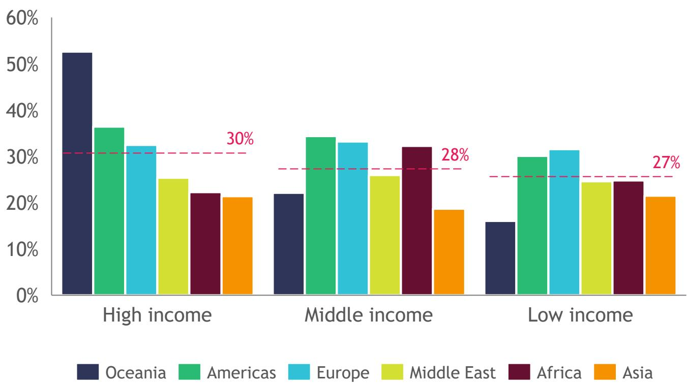  
1. Income classification is based on the Cities of Choice Survey. Respondents are grouped into five income tiers relative to their city's average income: groups 4 and 5 represent high income, group 3 represents middle income, and groups 1 and 2 represent low income.

## Key observations

\- Oceanian cities, led by Brisbane and Sydney, show the strongest relocation intent among high-income residents (over 50%), contrasted by the lowest intent among low-income groups

\- Across Europe, Asia, and the Middle East, relocation intent remains relatively stable across income brackets, suggesting that income has limited influence on residents’ decisions to move

\- The Americas follow the global pattern, with relocation intent decreasing alongside income levels (from 36% to 34% and to 30%), reflecting a balanced but income-sensitive trend

\- In Africa, middle- and low-income residents express slightly higher intent to relocate, pointing to aspirations for upward mobility and improved opportunities as key motivators

Among high-income residents, cities such as Brisbane, Frankfurt, and Dallas show the strongest intent to relocate, while Chinese cities record the lowest

Share of high income population $^{1}$ that is planning to relocate within two years

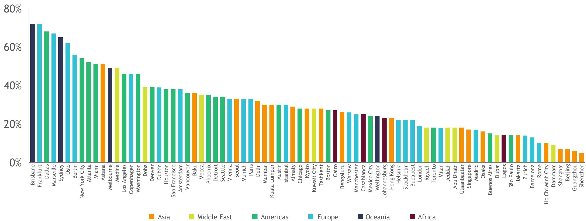  
1. Income classification is based on the Cities of Choice Survey. Respondents are grouped into five income tiers relative to their city's average income: groups 4 and 5 represent high income, group 3 represents middle income, and groups 1 and 2 represent low income.

## Section 5 Appendix: ranking methodology

## Weightings are defined individually for each of the 26 subdimensions for each city based on the residents' survey results

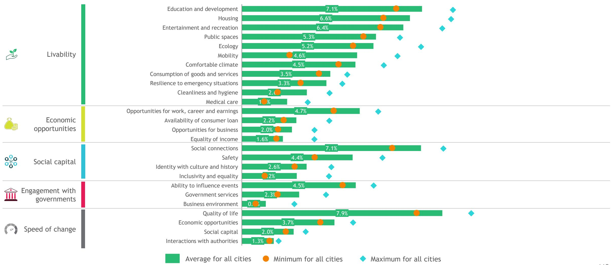

## Indicators are standardized and combined through weighted aggregation to produce the final index score

## Step 1: Normalize indicators and convert to score

Each indicator is standardized across 80 cities and transformed onto a 0-100 scale

The average city scores 50; top and bottom performers anchor the scale (100/0)

Cities who score the average gets 50

Top 2%-3% performing cities gets 100

Bottom 2%-3% performing cities gets 0

#

## Step 2: Weight and aggregate

Indicators are combined into subdimensions using predefined weights

Subdimensions are weighted to calculate the final index score

Cities are clustered into five predefined groups and displayed as color-coded quintile rankings within each group

## Cities of Choice 4.0 indicators (I/IV)

Dimension Subdimension Indicator name

Dimension Subdimension Indicator name

<table><tr><td colspan="3">Dimension Subdimension Indicator Name</td></tr><tr><td rowspan="46">Livability</td><td colspan="2">The ratio of employed to residents of a working age, %</td></tr><tr><td colspan="2">Unemployment rate, according to the ILO methodology, %</td></tr><tr><td colspan="2">Presence of city infrastructure for remote work, score 0-2</td></tr><tr><td colspan="2">Internet Speed, mbps</td></tr><tr><td colspan="2">Average yearly household income, price adjusted, USD per year</td></tr><tr><td colspan="2">Food expenses as a share of total expenses, %</td></tr><tr><td colspan="2">GDP PPP per employed, USD per year</td></tr><tr><td colspan="2">Number of international business conferences hosted annually</td></tr><tr><td colspan="2">Number of Fortune Global 500 company offices in the city</td></tr><tr><td colspan="2"> $Survey^1$ : Opportunities for professional self-realization, score</td></tr><tr><td colspan="2">Survey: Availability of attractive employment opportunities, score</td></tr><tr><td colspan="2">Survey: Share of respondents working from home at least 2 days/week, %</td></tr><tr><td colspan="2">Airport connectivity and passenger flow index</td></tr><tr><td colspan="2">Total early-stage Entrepreneurial Activity Rate, %</td></tr><tr><td colspan="2">Share of Service sector in the economy, %</td></tr><tr><td colspan="2">Number of startups per 100,000 population</td></tr><tr><td colspan="2"># of patents filed over last 3 years</td></tr><tr><td colspan="2">VC investment in 2024, million USD</td></tr><tr><td colspan="2">Vacancy rate of retail space, %</td></tr><tr><td colspan="2">Survey: Perceived opportunities for starting a business, score</td></tr><tr><td colspan="2">Economic land use score</td></tr><tr><td colspan="2">Equality of income Gini coefficient</td></tr><tr><td rowspan="2" colspan="2">Availability of personal loans Average rate of retail loan, %</td></tr><tr></tr><tr><td rowspan="22" colspan="2">Cleanliness and hygiene Number of public toilets available per 100,000 population</td></tr><tr></tr><tr></tr><tr></tr><tr></tr><tr></tr><tr></tr><tr></tr><tr></tr><tr></tr><tr></tr><tr></tr><tr></tr><tr></tr><tr></tr><tr></tr><tr></tr><tr></tr><tr></tr><tr></tr><tr></tr><tr><td></td></tr></table>

1. All survey questions, unless otherwise indicated, are measured on a 0-100 scale, with 0 denoting the lowest score and 100 the highest. All survey results have been normalized to this scale for comparability.

## Cities of Choice 4.0 indicators (II/IV)

Dimension Subdimension Indicator name

<table><tr><td rowspan="15">Entertainment and recreation</td><td>Number of cinemas per 100,000 population</td></tr><tr><td>Number restaurants per 100,000 population</td></tr><tr><td>Number of fitness centers and swimming pools per 100,000 population</td></tr><tr><td>Number of libraries per 100,000 population</td></tr><tr><td>Number of museums per 100,000 population</td></tr><tr><td>Number of theaters per 100,000 population</td></tr><tr><td>Number of world highest-grossing concert tours held in the city in 10 years</td></tr><tr><td>Number of Michelin-rated restaurants</td></tr><tr><td>The presence of significant events in popular sports (football, hockey, tennis, formula-1), units</td></tr><tr><td>Number of museums in the top 100 most visited art museums in the world according to The Art Newspaper</td></tr><tr><td>Number of exhibitions hosted by the city&#x27;s museums ranked among the world&#x27;s most visited art exhibitions by The Art Newspaper</td></tr><tr><td>Presence in the ranking of the best cities according to Time Out, 0-1</td></tr><tr><td>Survey: Availability of leisure and entertainment opportunities, score</td></tr><tr><td>Survey: Frequency of using apps or websites to find cultural and entertainment activities, score</td></tr><tr><td>Survey: Population regularly engaged in sports, %</td></tr><tr><td rowspan="11">Health care</td><td>Number of hospital beds per 100,000 population</td></tr><tr><td>Number of doctors per 100,000 population</td></tr><tr><td>Number of ambulances per 100,000 population</td></tr><tr><td>Life expectancy at birth, years</td></tr><tr><td>Average healthy life expectancy, years</td></tr><tr><td>Number of nurses per 100,000 population</td></tr><tr><td>Obesity rate, %</td></tr><tr><td>Availability of a unified appointment system for medical health (both private and public systems), score 0-2</td></tr><tr><td>Survey: Perceived politeness and competence of medical personnel, score</td></tr><tr><td>Survey: Average waiting time for non-urgent medical appointments, days</td></tr><tr><td>Survey: Participation in healthy lifestyle programs during the past year, %</td></tr></table>

Dimension Subdimension Indicator name

<table><tr><td rowspan="25">Livability</td><td rowspan="2">Health care</td><td>Survey: Share of respondents who had a medical check-up in the past year, %</td></tr><tr><td>Survey: Frequency of using apps or websites for managing personal health, score</td></tr><tr><td rowspan="14">Housing</td><td>Number of square meters of housing space per person, sq m</td></tr><tr><td>Presence of measures/government schemes supporting affordability of residential property, 0-2 (no program - city level program)</td></tr><tr><td>Number of hours that a person needs to work to purchase 1 m2 of housing</td></tr><tr><td>Average mortgage payment relative to average monthly household disposable income, %</td></tr><tr><td>Number of offerings of rental housing per city population</td></tr><tr><td>The average cost of renting a one-room apartment outside the city&#x27;s downtown area in relation to the average monthly disposable income for a household, %</td></tr><tr><td>Extreme or insufficient population density for urban area, people/km2</td></tr><tr><td>The share of the utility costs in the average monthly disposable household income, %</td></tr><tr><td>Level of domestic comfort (the share of housing equipped with washing and dishwasher machines and Internet access), %</td></tr><tr><td>Survey: Availability of suitable housing options, score</td></tr><tr><td>Survey: Frequency of using smart home apps or websites, score</td></tr><tr><td>Survey: Satisfaction with housing conditions, score</td></tr><tr><td>Survey: Frequency of using apps or websites for utility management, score</td></tr><tr><td>Survey: Satisfaction with quality of home utilities, score</td></tr><tr><td rowspan="9">Mobility</td><td>Length of subway lines / urban area of the city, km</td></tr><tr><td>Number of passengers that use public transport per year per 1,000 urban city population</td></tr><tr><td>Share of population that has convenient access to public transport, %</td></tr><tr><td>Availability of dedicated lanes for Public transport, Yes/No</td></tr><tr><td>Presence of infrastructure for velo transport, ranking</td></tr><tr><td>Density of metro stations, #/km2</td></tr><tr><td>Average time lost in traffic jams, hour / year</td></tr><tr><td>Avg length of the road network &amp; driveways to the number of cars, km/100K cars</td></tr><tr><td>Number of taxis per 100,000 population</td></tr></table>

## Cities of Choice 4.0 indicators (III/IV)

Dimension Subdimension Indicator name  
Dimension Subdimension Indicator name

<table><tr><td rowspan="12">Mobility</td><td>Availability of public transport in night hours, score</td></tr><tr><td>Cost of a monthly public transport ticket / monthly earnings, %</td></tr><tr><td>Number of deaths by road accidents per 100,000 population per year</td></tr><tr><td>Number of public transport modes under one fare system</td></tr><tr><td>Walkability score</td></tr><tr><td>Survey: Frequency of using smart parking apps or websites, score</td></tr><tr><td>Survey: Frequency of using apps or websites to reserve e-bikes/e-scooters, score</td></tr><tr><td>Survey: Average commuting time from home to work or school, minutes</td></tr><tr><td>Survey: Frequency of micromobility trips per person, score</td></tr><tr><td>Survey: Share of residents using bicycle/e-bike/scooter/skateboard for commuting from home to work/study, %</td></tr><tr><td>Survey: Share of residents using public transportation for commuting from home to work/study,%</td></tr><tr><td>Survey: Share of residents walking for commuting from home to work/study,%</td></tr><tr><td rowspan="6">Public spaces</td><td>Share of the city&#x27;s area allocated for green spaces, %</td></tr><tr><td>Share of population living within convenient walking distance to open public space, %</td></tr><tr><td>Number of children&#x27;s playgrounds per 100,000 population</td></tr><tr><td>Survey: Availability of senior friendly infrastructure, score</td></tr><tr><td>Survey: Average weekly time spent outdoors, hours</td></tr><tr><td>Survey: Sidewalks are in good condition, convenient, not slippery or snowy, score</td></tr><tr><td rowspan="6">Resilience to emergency situations</td><td>Number of intensive care beds per 100,000 population</td></tr><tr><td>Resilience strategy (incl. sustainability, to extreme natural disasters, terrorism/war) in place, score</td></tr><tr><td>Number of emergency service personnel per 100,000 population</td></tr><tr><td>Stability of the city&#x27;s economic system in the event of economic instability, coefficient</td></tr><tr><td>Level of development for the insurance system: ratio of gross written premium to GDP</td></tr><tr><td>Availability of free city-level psychological support services, 0 -1</td></tr></table>

<table><tr><td rowspan="5">Resilience to emergency situations</td><td>Level of exposure to natural disasters and estimated potential impact of natural disasters, score</td></tr><tr><td>Mortality rate from infectious diseases, %</td></tr><tr><td>Number of deaths from natural disasters in the last 10 years per 100,000 population</td></tr><tr><td>Number of victims of terrorist attacks in the last 10 years per 100,000 population</td></tr><tr><td>Number of deaths from terrorist attacks in the last 10 years per 100,000 population</td></tr><tr><td rowspan="3">Inclusivity and equality</td><td>Share of disabled people of working age who are employed,%</td></tr><tr><td>Inclusiveness Index</td></tr><tr><td>The share of public transport accessible to people with disabilities,%</td></tr><tr><td rowspan="4">Identity with culture and history</td><td>The number of UNESCO cultural heritage sites, units</td></tr><tr><td>Number of nominations for prestigious international contemporary architecture awards over the past 10 years</td></tr><tr><td>The number of films from the IMDb list of top 250, which take place in the city</td></tr><tr><td>Survey: Pride in the city&#x27;s history and culture, score</td></tr><tr><td rowspan="7">Safety</td><td>Number of CCTV cameras within city area</td></tr><tr><td>Murders per year per 100,000 population</td></tr><tr><td>Street lighting, Watt/(cm2*steradian)</td></tr><tr><td>Survey: Awareness of incidents of physical assault, robbery, or harassment among acquaintances, score</td></tr><tr><td>Survey: Respondents sentiment of safety in the city, score</td></tr><tr><td>Survey: Residents concern about being physically attacked or robbed while in a public space, score</td></tr><tr><td>Survey: Residents concern about personal belongings being stolen, score</td></tr><tr><td rowspan="5">Social connections</td><td>Helping a stranger, %</td></tr><tr><td>Share of people participating in donating money, %</td></tr><tr><td>Survey: Share of population considering oneself part of a certain community, %</td></tr><tr><td>Survey: Share of population that participated in local community activities at least once during the past year, %</td></tr><tr><td>Survey: Number of neighbors trusted to look after children</td></tr></table>

## Cities of Choice 4.0 indicators (IV/IV)

Dimension Subdimension Indicator name  
Dimension Subdimension Indicator name

<table><tr><td rowspan="5">Social connections</td><td>Survey: Number of neighbors personally known</td></tr><tr><td>Survey: Number of times of meet-ups with friends/colleagues outside of work per month</td></tr><tr><td>Survey: Level of trust in people within the city, score</td></tr><tr><td>Survey: Availability of longevity programs, score</td></tr><tr><td>Survey: Share of population feeling lonely the day before, %</td></tr><tr><td rowspan="4">Ability to influence events</td><td>Ability to vote for the city head, score</td></tr><tr><td>Ability to solve most popular problems using online tools, score</td></tr><tr><td>Availability of a special mobile app for citizens to influence the features of the city development, score</td></tr><tr><td>Survey: Perceived ability to influence things in the city, score</td></tr><tr><td rowspan="2">Government services</td><td>E-Government Development Index (EGDI)</td></tr><tr><td>Survey: Easiness and effectiveness of obtaining public services, score</td></tr><tr><td rowspan="7">Business environment</td><td>Number of coworkings per 100,000 population</td></tr><tr><td>Number of business incubators &amp; accelerators per 100,000 population</td></tr><tr><td>Cost of business start-up procedures, % of GNI per capita</td></tr><tr><td>Time required to start a business, days</td></tr><tr><td>Survey: Availability of support for starting a business, score</td></tr><tr><td>Survey: Efficiency of the business startup process, score</td></tr><tr><td>Survey: Favorability of regulatory, tax, and law enforcement systems for business operations, score</td></tr><tr><td rowspan="5">Speed of change in economic opportunities</td><td>Real household income: average annual growth rate (2014 - 2024)</td></tr><tr><td>GINI coefficient: average annual growth rate (2014 - 2024)</td></tr><tr><td>Survey: Job opportunities &amp; cost of living have improved over past five years, score</td></tr><tr><td>Survey: Financial situation has improved over the past three years, score</td></tr><tr><td>Average annual change in unemployment (2014-2024)</td></tr><tr><td rowspan="3">Speed of change in engagement with governments</td><td>E-Government Development Index (EGDI): change in score over the last 10 years (2014 - 2024)</td></tr><tr><td>Survey: Government services have improved over the past five years, score</td></tr><tr><td>Survey: I trust the city authorities more today than I did three years ago, score</td></tr></table>

<table><tr><td rowspan="9">Speed of change in livability</td><td>Average mortgage payment relative to average monthly household disposable income (2024 / 2014)</td></tr><tr><td>Average cost of renting an apartment versus the average monthly income: average annual growth rate (2014 - 2024)</td></tr><tr><td>Number square meters of living space per person: average annual growth rate (2014 - 2024)</td></tr><tr><td>Number of new subway stations built within the last 10 years (2014 - 2024)</td></tr><tr><td>Average life expectancy at birth: average growth rate (2014 - 2024)</td></tr><tr><td>Students&#x27; results in the PISA test: change over 10 years</td></tr><tr><td>Number of retail outlets per 100,000 population: average annual growth rate (2014 - 2024)</td></tr><tr><td>Air quality: PM2.5 content, average annual growth rate (2014 - 2024)</td></tr><tr><td>Survey: In general, over the past three years, the city has become better as a place to live, score</td></tr><tr><td rowspan="6">Speed of change in social capital</td><td>Number of crimes per year per 100,000 population: average annual growth rate (2014 - 2024)</td></tr><tr><td>Number of murders per year per 100,000 population: average annual growth rate (2014 - 2024)</td></tr><tr><td>Helping a stranger: average annual growth rate (2014 - 2024)</td></tr><tr><td>Share of people participating in donating money: average annual growth rate (2014 - 2024)</td></tr><tr><td>Survey: Safety has improved over the past five years, score</td></tr><tr><td>Survey: Over the past three years, people in the city have become more open to communication and tolerant, score</td></tr></table>

## Disclaimer

The services and materials provided by Boston Consulting Group (BCG) are subject to BCG's Standard Terms (a copy of which is available upon request) or such other agreement as may have been previously executed by BCG. BCG does not provide legal, accounting, or tax advice. The Client is responsible for obtaining independent advice concerning these matters. This advice may affect the guidance given by BCG. Further, BCG has made no undertaking to update these materials after the date hereof, notwithstanding that such information may become outdated or inaccurate.

The materials contained in this presentation are designed for the sole use by the board of directors or senior management of the Client and solely for the limited purposes described in the presentation. The materials shall not be copied or given to any person or entity other than the Client (“Third Party”) without the prior written consent of BCG. These materials serve only as the focus for discussion; they are incomplete without the accompanying oral commentary and may not be relied on as a stand-alone document. Further, Third Parties may not, and it is unreasonable for any Third Party to, rely on these materials for any purpose whatsoever. To the fullest extent permitted by law (and except to the extent otherwise agreed in a signed writing by BCG), BCG shall have no liability whatsoever to any Third Party, and any Third Party hereby waives any rights and claims it may have at any time against BCG with regard to the services, this presentation, or other materials, including the accuracy or completeness thereof. Receipt and review of this document shall be deemed agreement with and consideration for the foregoing.

BCG does not provide fairness opinions or valuations of market transactions, and these materials should not be relied on or construed as such. Further, the financial evaluations, projected market and financial information, and conclusions contained in these materials are based upon standard valuation methodologies, are not definitive forecasts, and are not guaranteed by BCG. BCG has used public and/or confidential data and assumptions provided to BCG by the Client. BCG has not independently verified the data and assumptions used in these analyses. Changes in the underlying data or operating assumptions will clearly impact the analyses and conclusions.

## BCG BOSTON CONSULTING GROUP