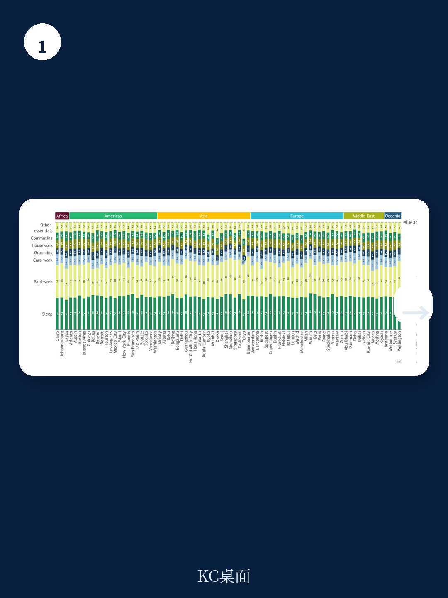
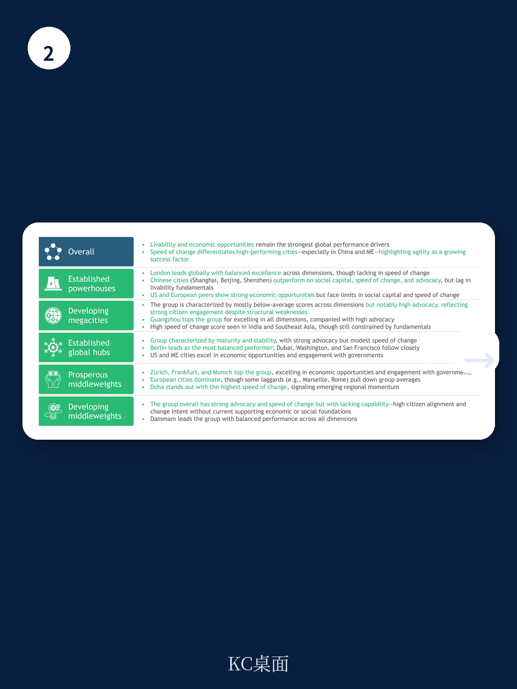

# 波士顿咨询：城市竞争转向居民体验与变革速度

波士顿咨询（BCG）最新发布的《Built to Change:Cities of Choice 4.0》报告，覆盖80个城市、200余项指标，其中80%为客观数据，另20%来自24000名居民调查。报告最核心的判断是：城市竞争的逻辑已发生根本性转变——成功不再由基础设施资产（道路、机场、公用设施）定义，而是由这些资产为居民创造的实际生活结果决定。城市竞争的新标尺是“居民体验价值”，而“变革速度”正成为可持续优势的新来源。

报告引入了一个关键概念：居民倡导度（Resident Advocacy），通过五个问题测量居民对城市的满意度、提到意愿、未来居住意愿等。数据显示，倡导度高的城市，居民计划长期留居的比例也更高。倡导度不仅是态度指标，更反映居民对城市长期前景的真实承诺，是宏观环境与社会繁荣的基础。

> **KC评论：** 倡导度这个指标值得关注。它把城市竞争从“硬件竞赛”拉回到“人的体验”。报告发现，线上活跃居民（Online Adepts）在超过70个城市中的倡导度高于其他群体，这意味着数字服务能力正在成为城市留住人才的关键杠杆。

## 1. 变革速度排名：深圳、利雅得、塔什干领跑，中东与中国城市占据前十

报告专门设置了“变革速度”（Speed of Change）维度，衡量2014至2024年间城市在宏观环境机会、宜居性、社会资本和政务参与四个方面的改善幅度。结果显示，深圳以92分位居榜首，利雅得91分紧随其后，塔什干88分位列第三。前十名中，中国城市占据四席（深圳、广州、上海、北京），沙特城市占据四席（利雅得、麦加、吉达、达曼），中东和中国城市主导了全球城市变革最快的阵营。

相比之下，欧洲城市的变革速度整体偏慢，但苏黎世和部分德国城市通过社会资本和政务参与的改善实现了进步。这一格局意味着，全球城市竞争的“增长极”正在从传统欧美中心向亚洲和中东转移。

## 2. 宏观环境机会与宜居性：欧美城市仍居高位，但差距正在收窄

在宏观环境机会维度，伦敦、苏黎世、巴黎位列前三，美国城市亚特兰大、旧金山、华盛顿特区等也进入前二十。报告指出，商业环境得分受新出现的共享办公空间（自2021年以来平均增长4.5倍）和创业孵化器数量驱动。欧洲城市在不确定性研究、机场连通性和宏观环境用地评分上表现强劲。

宜居性方面，苏黎世、伦敦、奥斯陆领先，欧洲和加拿大城市在公共绿地方面占据主导地位。但报告揭示了一个关键矛盾：住房可负担性和出行不确定性在全球范围内加剧。欧洲和北美每平方米房价上涨25%，房贷利率翻倍；全球通勤时间平均增加6%，汽车保有量自2023年增长7.5%。尽管“15分钟城市”和公共交通推广初见成效（维也纳、巴黎），但整体宜居性改善仍面临结构性制约。

> **KC评论：** 报告明确指出“住房是跨大洲的最大挑战”，62个城市已制定住房可负担性计划。但数据也显示，发展中国家城市在宜居性改善上增速最快——如果这一趋势持续，人才流动可能显著转向发展中国家城市，这是读者和企业选址时需要纳入考量的长期变量。

## 3. 社会资本与政务参与：城市正在脱离国家形成独立的社会资本

社会资本维度，北京以78分位居第一，伦敦、柏林、上海紧随其后。报告特别指出一个趋势：城市正在“脱离”国家，形成自己的社会资本。这意味着居民对城市的认同感、安全感和包容性，越来越独立于国家层面的社会指标。

政务参与方面，法兰克福、苏黎世、慕尼黑领先，但中东城市追赶迅速——迪拜进入前十，利雅得、阿布扎比也位列前二十。技术渗透是主要驱动力：报告显示，居民认为能够影响决策的比例提高了20%，通过在线工具解决常见城市问题的能力提升了3倍，提供市民参与城市发展专用移动应用的城市数量翻了一番。

## 4. 一个可复用的观察框架：用“倡导度-变革速度”矩阵评估城市韧性

报告提供了一套简洁但有力的分析框架：将城市置于“倡导度”与“变革速度”两个维度构成的矩阵中。高倡导度+高变革速度的城市，是居民承诺最强、未来竞争力最可持续的群体。这类城市不仅当前体验好，而且有能力持续改善，从而维持居民信任。

低倡导度+低变革速度的城市则面临人才流失不确定性。报告数据显示，倡导度与居民计划留居的比例高度相关——这不是态度问题，而是宏观环境和社会繁荣的基础条件。对于企业选址、人才吸引和房地产研究决策而言，这个框架提供了一个比单纯看GDP增速或基础设施研究额更贴近实际体验的评估工具。

报告同时指出，线上活跃居民（Online Adepts）在超过70个城市中的倡导度高于一般居民。这类居民通过在线完成购物、医疗、健身、娱乐、资金和市政服务等日常活动，对数字服务便利性的敏感度更高。城市能否留住这批高价值居民，将直接影响其长期创新能力和宏观环境活力。

---

For informational purposes only. Portions may be generated,translated,summarized,or edited with AI assistance based on source materials and may contain omissions or errors. Please verify independently. This is not investment,legal,tax,accounting,or other professional advice.

