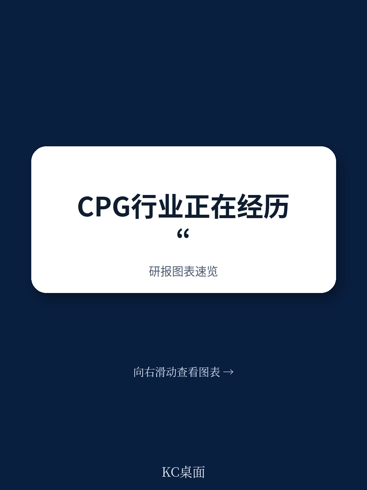

# 波士顿咨询：消费者承压与CPG企业应对

消费者支出节奏变化、通胀侵蚀购买力、关税波动带来不确定性——波士顿咨询在一份2026年1月发布的报告中指出，消费品企业正面临一个“残酷的环境”。但报告的核心判断并非描述困境，而是指出：多数企业正在采用的供应链效率提升、价格微调和促销调整等传统手段，已经不足以应对当前局面。真正能拉开差距的，是更大胆、更全面的跨职能、跨产品、跨公司的成本削减方案，并且必须借助分析和AI工具来实现可量化的回报。

这份报告基于波士顿咨询与全球领先消费品企业的合作经验，以及一项覆盖全球消费行业CEO的调研。调研显示，60%的CEO将成本管理列为优先事项，但其中一半承认，此前的成本削减努力未能带来可持续的节省，甚至削减了关键增长领域的投入。

## 1. 传统成本削减项目存在五个常见失败模式

报告总结了成本项目失败的五个典型原因。第一个是“虚假胜利”：企业达成了资产利用率提升或IT应用精简等目标，但这些成果并未转化为利润表上的持续改善。第二个是“部门孤岛”：领导者只关注自己熟悉的、职能特定的成本杠杆，忽视了跨业务领域能产生更大影响的结构性动作。第三个被形象地称为“除草而非覆盖”：企业追逐短期节省，成本很快像野草一样重新长回来。第四个是流程过时：依赖人工决策流程和激励机制，影响了生产力和竞争力。第五个是资源不足：项目有负责人，但缺乏足够的团队资源或高层支持。

> **KC评论：** 这五个失败模式中，“虚假胜利”和“除草而非覆盖”最容易在季度考核不确定性下出现。报告隐含的意思是，成本削减不能只看项目是否完成，而要追踪是否真正改变了成本结构。

## 2. 成功项目具备三个共同特征：战略对齐、AI驱动、专职治理

报告指出，成功的成本削减项目并非孤立运作，而是与公司整体战略和股东回报计划紧密挂钩，从而将资源导向回报表现率最高的领域。这是第一个特征。

第二个特征是AI驱动的支出评估与削减。利用实时数据、数字化工具和AI，企业可以快速识别成本驱动因素，定位最大的结构性成本，并借助生成式AI加速从洞察到行动的过程。报告给出一个具体数字：根据职能不同，这种方法可以消除5%到20%的成本基础，同时还能缩短上市时间、提升服务水平。

第三个特征是设立“积极型转型管理办公室”。这个办公室拥有专职资源，其负责人必须列席高管会议，确保交付、及时处理新问题，并向领导者提供项目进展的透明度。报告强调，通过跨职能的冲刺团队来推进项目，比传统方式更有效，因为成本削减本身跨越多个关键支出领域。

## 3. 三大成本杠杆覆盖运营、职能和商业领域

报告将成本杠杆分为三类。运营杠杆聚焦于企业如何采购和生产：制造环节通过精益运营、数字化升级和生成式AI赋能来降低成本；供应链环节需要重新评估网络布局，利用数字孪生和实时分析优化路线；采购环节则用AI提升支出透明度、优化合同策略。

职能杠杆涉及核心管理职能：营销支出按ROI重新分配；销售策略和运营模式需要调整以平衡增长与支出；组织成本方面，报告建议从根本上重新思考工作方式和运营模式，并建立生成式AI能力来提升生产力。IT成本削减中有一个具体数字：通过自动化与AI，外包IT服务可节省高达20%的成本，同时可将多达70%的技术岗位迁至低成本地区。

商业杠杆关注定价和贸易管理：将客户贸易资金与具体行为挂钩，调整促销日历优先高ROI活动，以及通过不同包装尺寸和规格来匹配需求场景、最大化消费者支付意愿。

## 4. 报告提供了一个可复用的观察框架：平衡、去平均化与AI嵌入

报告提出了几个跨杠杆的优先行动方向。首先是平衡节省与研究：CEO面临紧缩不确定性，但企业不能靠削减实现增长，关键是在效率提升与战略性再研究之间找到均衡点。其次是部署“去平均化”的收入增长策略：利用细颗粒度数据和动态组合管理，捕捉增量增长和利润，而不是一刀切的方法。第三是嵌入数字化和生成式AI：从采购谈判到促销与需求规划，用智能自动化和AI副驾驶来放大人类能力。

报告还特别指出，供应链和运营的重新设计需要成为持续能力，因为贸易和政策方向的不确定性不会消失。企业需要不断评估网络布局和采购策略，而不是一次性的调整。

> **KC评论：** 报告对“去平均化”策略的强调值得注意。传统消费品企业往往用统一策略应对所有渠道和客户，但在当前环境下，细颗粒度的数据分析和动态组合管理可能是从存量市场中挤出利润的关键。

波士顿咨询的这份报告没有给出简单的答案，而是提供了一个系统性的成本削减框架。对于消费品企业的决策者而言，核心问题可能不是“要不要削减成本”，而是“用什么方法、在哪些领域、以什么节奏来削减”。报告给出的信号是：传统方法已经不够用，AI驱动的整体方案才是下一阶段的竞争门槛。

For informational purposes only. Portions may be generated,translated,summarized,or edited with AI assistance based on source materials and may contain omissions or errors. Please verify independently. This is not investment,legal,tax,accounting,or other professional advice.

