## As Scale Grows, So Does Ambition

Global Principal Investors

Report 2026

Principal investors are playing a more active role in an increasingly complex market landscape 01
How principal investors are changing the way they lead 02
How general partners can partner with principal investors 03

## Principal investors in a new era: expanding influence, active strategies, and a market shaped by geopolitics and AI

The PI universe continues to expand in scale and influence, with \$43T in AuM in 2025 and ten new sovereign vehicles established in 2025 alone. Family offices are also growing and increasingly professionalizing

Private markets allocations have grown steadily over the past decade, led by PE and infrastructure. Recent years have seen longer holding periods and weaker distributions, driving a concentration of capital toward top-tier GPs

More sophisticated PIs are increasingly experimenting with direct, co-investment, and platform capabilities. In some cases, these are emerging as peers and partners for GPs

Geopolitical uncertainty has increased structurally since 2020, with likely implications for geographic allocation, sector mix, and liquidity positioning—particularly for SWFs with explicit national mandates

AI has emerged as a defining thematic area for PIs—both as an investment opportunity across the full stack and as an operational capability. Leading PIs are actively building coordinated AI exposure and embedding AI across fund operations and value creation

## PIs continue to increase in influence as concentrated sources of capital that can shape capital flows and yields across markets

Principal Investors have grown in scale and influence over the last decade, making up \~30% of the total assets under management globally

TOTAL AUM BY PRINCIPAL INVESTOR TYPE (\$T)

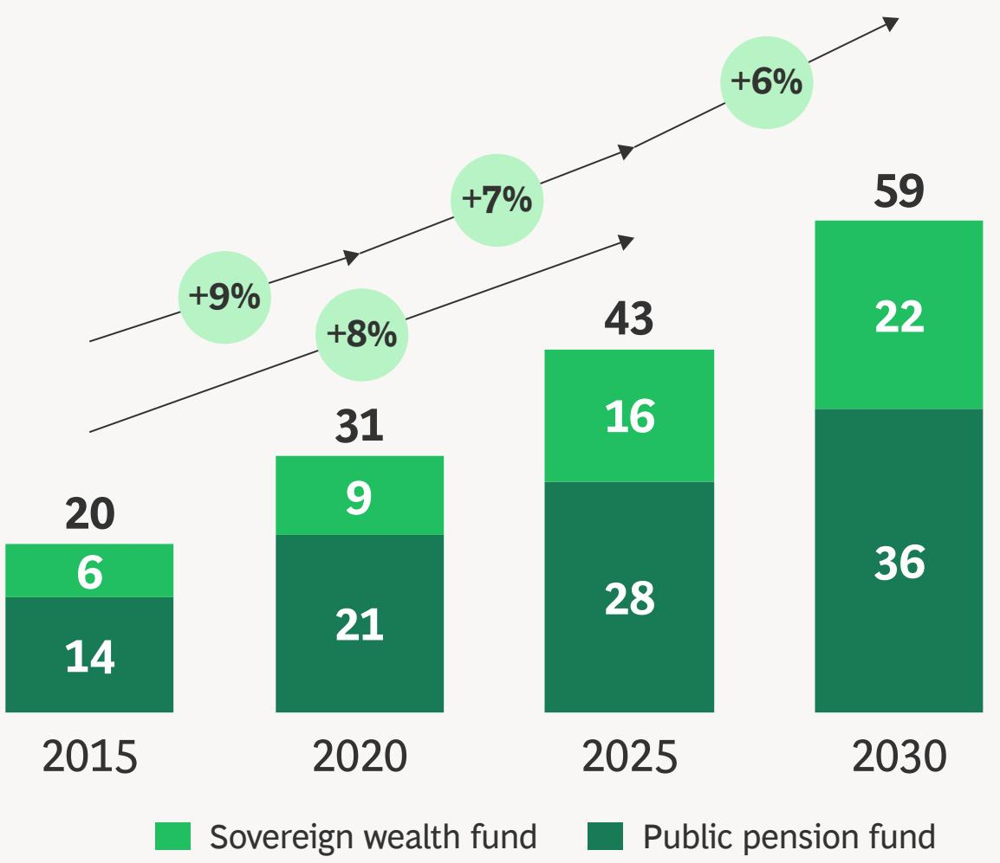  
Sources: Global SWF; BCG analysis.  
GLOBAL PROFESSIONALLY MANAGED AUM (\$T)

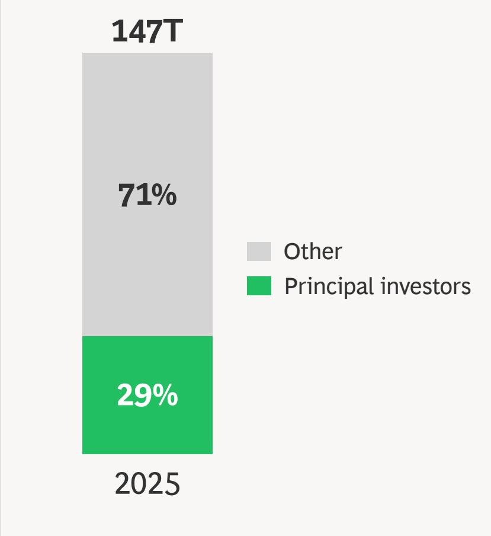  
Note: PI AuM refers to fair value of assets as reported by each fund, or estimated by Global SWF based on tracked investment activities where fund-level data is unavailable. Global AuM corresponds to assets sourced from each region and professionally managed in exchange for management fees; it includes captive AuM of insurance groups or pension funds where AuM is delegated to asset management entities with fees paid. Overall, 44 markets are covered globally, including offshore AuM (which is not included in any region). For all countries where the currency is not US dollar, end-of-year 2025 exchange rate is applied to all years to synchronize current and historic data.

\- Principal investors—sovereign wealth funds and public pension funds—have grown from \$21T in AuM in 2015 to \$43T in 2025, a compound annual growth rate of 7%, and are projected to reach \$59T by 2030

\- SWFs have grown more rapidly than PPFs over the decade, driven by sustained commodity and fiscal surpluses, stronger-than-expected market returns, and the creation of new vehicles. Ten new sovereign funds were established in 2025 alone

\- At roughly 30% of global AuM, this capital base is large enough to move markets. Allocation decisions of a small number of institutions—where to deploy, which asset classes to favor, which geographies to reduce—can shift sector flows, compress or widen credit spreads, and affect asset prices at scale

## New sovereign vehicles are entering private markets with more strategic and active mandates, further expanding influence

SWFs ESTABLISHED (#)

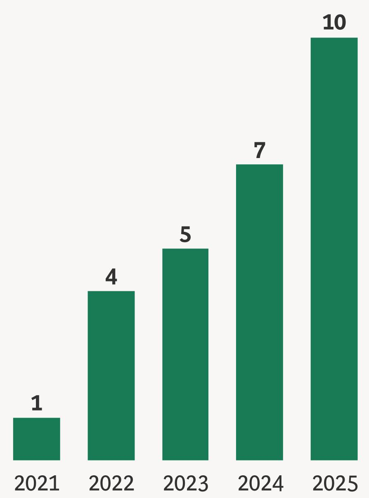

<table><tr><td>SWFs established in 2025</td><td>Country</td></tr><tr><td>Danantara</td><td>Indonesia</td></tr><tr><td>Chinggis</td><td>Mongolia</td></tr><tr><td>Botswana SWF</td><td>Botswana</td></tr><tr><td>Eksab Saudi</td><td>Saudi Arabia</td></tr><tr><td>Eswatini SWF</td><td>Eswatini</td></tr><tr><td>FIS DRC</td><td>DR Congo</td></tr><tr><td>Kenya SWF</td><td>Kenya</td></tr><tr><td>Oyo SWF</td><td>Nigeria</td></tr><tr><td>Syrian Sovereign Fund</td><td>Syria</td></tr><tr><td>Uzbekistan NIF</td><td>Uzbekistan</td></tr></table>

\- The new wave of sovereign vehicles reflects a shift from surplus management to state-led transformation, with reserves and windfalls being organized into investable platforms for priority agendas

\- A growing number of new vehicles sit closer to strategic investment funds than traditional savings SWFs, explicitly pursuing a double mandate of financial return plus domestic economic impact

\- The pipeline for new funds remains active as well, with several countries openly exploring new SWFs (often to monetize state assets or repurpose reserves). This could add a further wave of inorganic growth over the next few years. Examples of this pipeline include:

\- US: Executive order signed Feb 2025 to stand up a fund from \$5.7T federal asset base

\- Taiwan: President committed to first-ever SWF in May 2025, drawing on \$600B in reserves

\- South Korea: New national fund announced Dec 2025, seeded at \$100B from \$0.9T in state assets

\- Canada: Canada Strong Fund announced Apr 2026, seeded at \$25B to back major national projects
- India: \$50B sovereign fund in design, backed by government stakes in public companies

## Family offices are also becoming an influential pool of capital, with scaled FOs increasingly influential capital allocators

## # OF FOs (THOUSANDS) YEAR-ON-YEAR AND REGIONAL DISTRIBUTION (%)

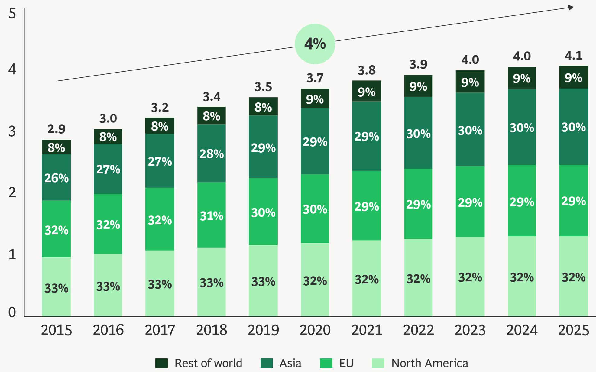  
Sources: Preqin; BCG Global Asset Management Market Sizing; BCG analysis.

Family office growth driven by Asia, while North America and Europe remain the largest and most established bases

\- The total number of family offices has increased steadily since 2019, with Asia contributing to \~42% of growth, equal to NA and EU combined, even as the latter continue to represent the majority of installed base

\- With over \$6T in AuM, family offices are an increasingly influential source of capital

Increasing institutionalization underway across FOs, large FOs transitioning to more direct investing

• Large family offices are building dedicated CIO-led investment teams with formal governance structures, reflecting a shift from founder-led capital stewardship towards professionally managed, multi-generational platforms

\- Scaled FOs are transitioning from passive fund allocations toward active, direct and control-oriented investing, becoming quasi-GP platforms

## Private markets are becoming a larger and more actively managed sleeve for major PIs over the last decade

Across SWFs and PPFs, the share of PE and infra allocation has increased meaningfully over the last decade
ASSET ALLOCATION FOR PRINCIPAL INVESTORS (%)

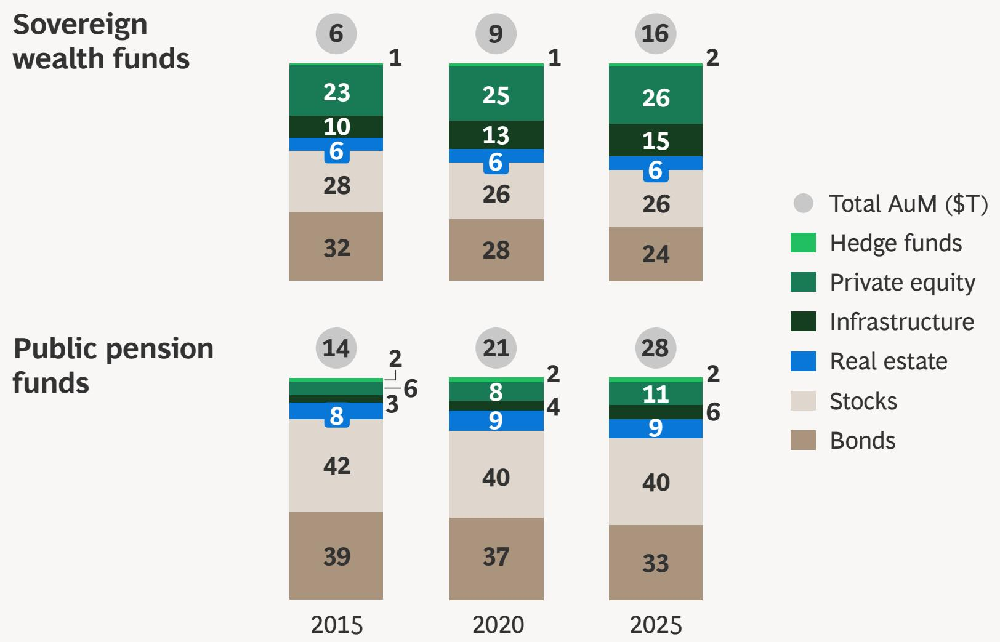  
Sources: Global SWF; BCG analysis.  
Note: Percents may total more than 100 due to rounding. Global SWF sources allocation information from the funds directly (annual reports and websites) if publicly available; otherwise, estimates are provided based on their knowledge of the funds.

Private market allocations have grown steadily as a share of PI portfolios over the past decade, driven by PE and infra

\- SWF PE allocations have risen from \~23% to \~26% of AuM; PPF PE allocations have grown more materially, from \~6% to \~11%

\- Infrastructure has followed a similar trajectory, growing from \~10% to \~15% for SWFs and from \~3% to \~6% for PPFs

\- As overall AuM has grown, higher allocation means absolute capital flows into private markets have expanded substantially

Infrastructure has matured from a niche into a core allocation, driven by its return and diversification profile

\- PI allocations to infrastructure grew at a 13% CAGR from 2015 to 2025—the second-highest growth rate across asset classes after PE, reflecting its appeal as a natural inflation hedge with stable, contracted cash flows

\- More recently, the asset class has been further supported by rising investment in digital infrastructure and green energy, with infrastructure outperforming PE over a one-year horizon

As PE sleeves have expanded, PIs are pushing for greater fee efficiency and direct control over execution

\- PIs are increasingly pursuing co-investments and direct deals alongside GP relationships, with targeted co-investment ratios shifting from \~20% to 25% of fund commitments in the early 2000s to close to 100% for larger investments today

\- Average deal sizes have stepped up materially, reflecting both larger balance sheets and greater conviction

UNREALIZED VALUE (\$T)

## However, at the same time holding periods in private markets have risen, locking in liquidity and constraining reallocation

## Average and median holding periods overall and by region

AVERAGE AND MEDIAN HOLDING PERIOD (YEARS), FOR EXIT YEARS 2014–2025

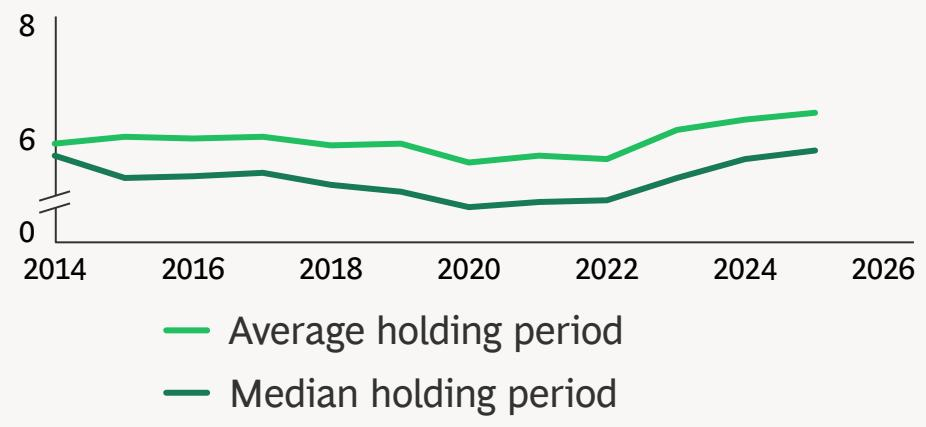  
AVERAGE PRIVATE EQUITY HOLDING PERIOD (YEARS)

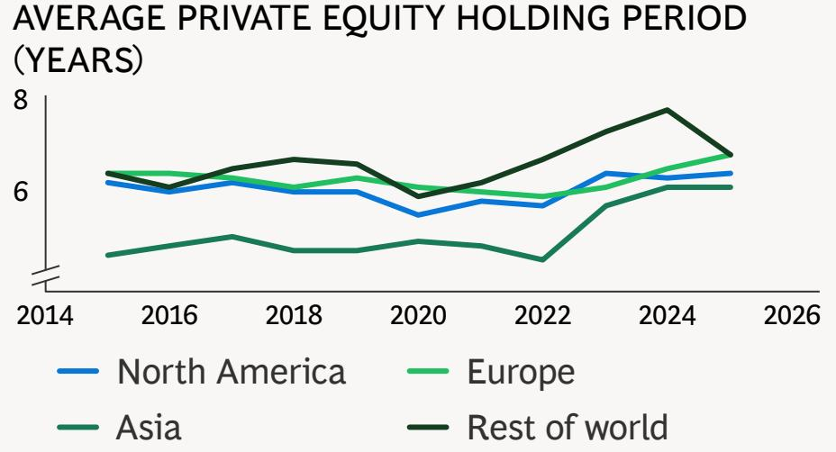

HOLDING PERIOD FOR COMPANIES (#)  
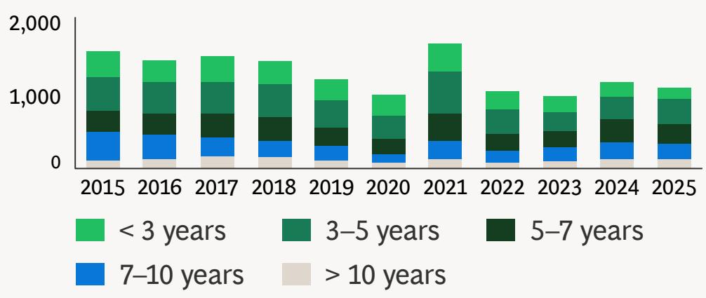

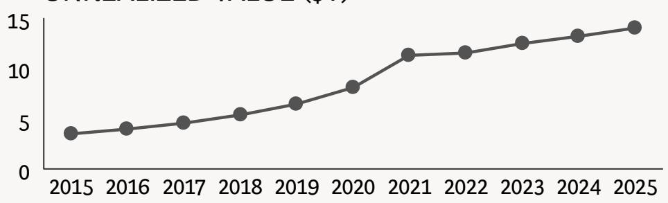

Holding periods have lengthened materially since the 2020 trough across all major regions
Both average and median holding periods declined into 2020 but have risen steadily through 2025 across North America, EU, and Asia—with North America peaking highest in 2024 before moderating

The gap between average and median signals a concentration of longer-held assets
Across the full period, the average consistently sits above the median, indicating a subset of deals held significantly longer than the typical investment

Compared to earlier vintages, a growing share of assets are being held beyond five years
The proportion of companies held for more than five years has increased steadily since 2020, reflecting delayed exit activity and extended ownership cycles

Unrealized value has reached record highs
As holding periods extend and exits slow, unrealized value has accumulated to record highs, constraining capital recycling across the ecosystem

Sources: Preqin; BCG analysis.

## Distributions have lagged capital calls, resulting in negative cashflows and locked capital for LPs

Cumulative capital called and distributed by GPs $^{1}$ GLOBAL (T)

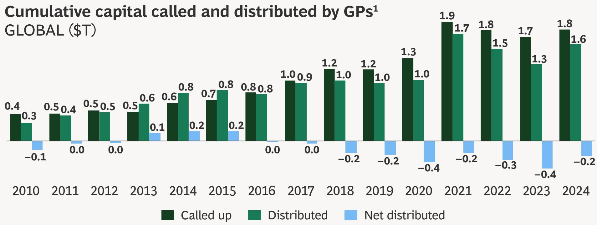  
Global buyout distribution as % of buyout NAV

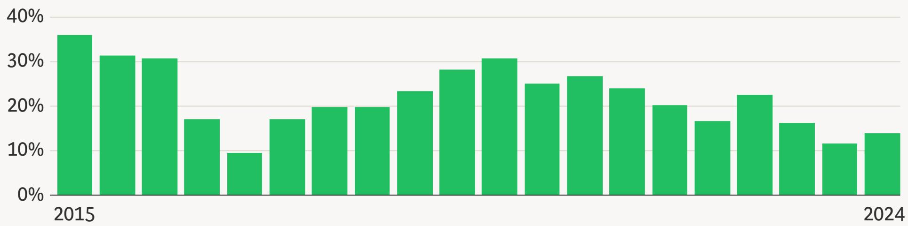  
Sources: Preqin; BCG analysis.  
$^{1}$ Called-up capital refers to LP’s aggregate commitments to the partnership that have been contributed to the partnership. Distributed refers to the called-up capital that has been distributed or returned back to LPs. Net distributed is calculated as the difference between distributed and called-up capital.

Cumulative LP cash flows remain negative
Since 2018, capital calls have exceeded distributions, with the gap widening post-2020 as exits slowed. LPs have therefore remained net cash contributors over the period

Buyout distributions remain below historical norms
Global buyout distributions as % of NAV have declined from pre-2020 levels, reinforcing liquidity pressure

Delayed realization is driving limited distribution
Weak M&A activity and volatile markets have extended holding periods and built exit backlogs as sponsors are reluctant to sell below target valuations

Higher rates have increased the cost of illiquidity
Attractive public yields have increased opportunity cost of locked capital, driving need for secondaries and CVs to return capital

## Consequently, flight to quality is being seen with PIs becoming more selective and discerning in how they engage private markets

Commitment from SWFs and PPFs to GPs  
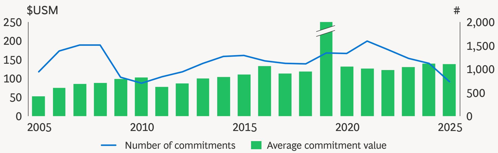

Total annual fund-raising for closed-end funds split by ranking brackets $^{1}$  
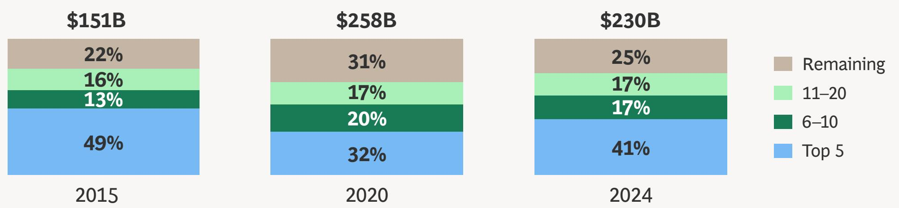  
Sources: Pitchbook; BCG analysis.  
Note: 2019 average commitment value is high due to SoftBank's large commitments in the year to Gulf Cooperation Council SWFs. Average commitment value is calculated based on where the size of commitment is disclosed by Pitchbook and includes commitments from top 100 PPFs and SWFs.  
$^{1}$ Includes flagship buyout/growth/VC/infra fund closes, continuation vehicles, and co-investment funds.

Flight to quality evident with PIs becoming more selective with funds they engage with

\- Fewer commitments (−45%, 2020 vs. 2025), coupled with larger average commitment sizes (+5%, 2020 vs. 2025), indicate that capital is being concentrated in a smaller set of high-conviction managers

\- Fundraising for closed-end funds is increasingly concentrated in the largest managers, with the top five GPs accounting for \~41% and the top ten for \~59% of fundraising in 2024

\- Emerging and smaller GPs need to prove they can deliver differentiated access / edge to be attractive against larger GPs or competing mid-market fund

Governance and capacity constraints are further reinforcing concentration in GPs

\- With more direct/co-invest activity and monitoring needs, investors are rationalizing bandwidth. Fewer, deeper relationships enable better pacing coordination and more efficient oversight

## Growth in secondary markets creating viable, alternative investment opportunities for PIs

Growth of secondaries and cumulative value of PE continuation vehicles
TRANSACTION VOLUME IN SECONDARY MARKET (\$B) AND SHARE OF GP-LED TRANSACTIONS (%)  
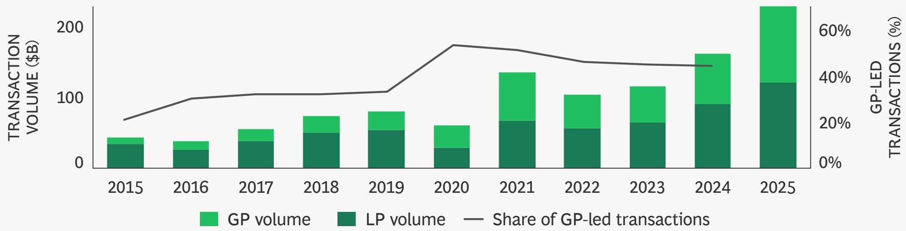

Cumulative value of PE continuation vehicles
PE CONTINUATION VEHICLE FUND SIZE (\$B) AND PE CUMULATIVE VALUE (%)  
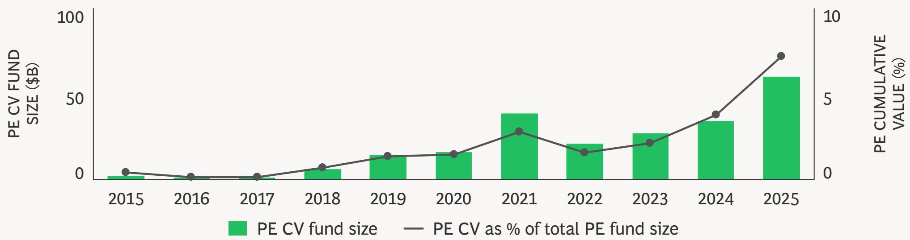  
Sources: Evercore 2025 Secondary Market Survey Highlights (Jan 2026); Pitchbook; Jefferies & UBS; BCG analysis. Note: CV = continuation vehicle.

## Capital-efficient entry at a discount

Secondary buyers acquire stakes in mature funds at NAV discounts, typically 5%–15% for PE, mid-single digits for infrastructure, accessing high-quality portfolios below intrinsic value, an advantage structurally unavailable in primary fund commitments

## J-curve eliminated with immediate yield from day one

Secondary entry skips the capital call and negative return period entirely. For PIs managing against long-dated obligations, receiving distributions from mature, cash-generating portfolios immediately is far preferable to waiting 5–7 years for primary fund cashflows to turn positive

GP-led CVs offer curated access to proven assets
GPs are selectively migrating their highest-conviction portfolio companies into continuation vehicles. Secondary buyers gain concentrated exposure to performing assets with an established track record, rather than a diversified blind-pool commitment at fund inception

## Several PIs are also shifting to a more direct posture, spanning direct deals, co-investments, and third-party platform building

Average ticket for co-investment
fundraising is at all-time high
CO-INVESTMENT FUNDRAISING

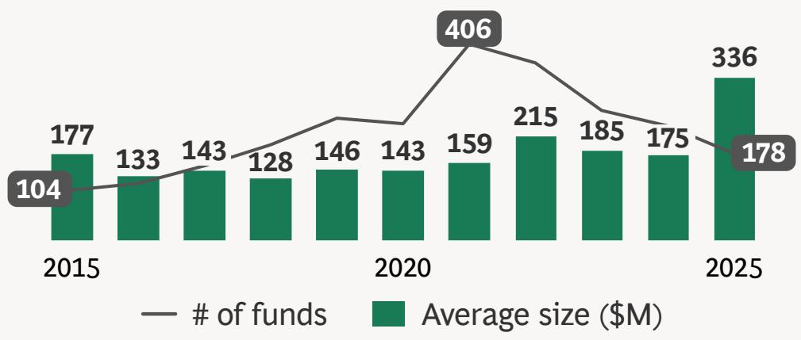  
Direct deals as share of PI deals has expanded

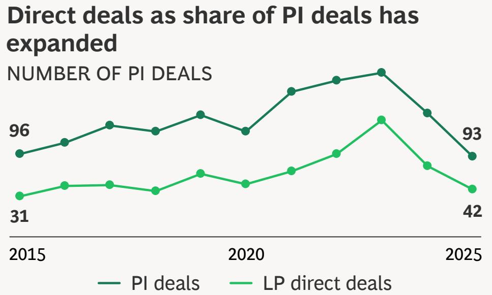  
Sources: Preqin; Pitchbook; Mubadala Capital; Seviora; Financial Times; BCG analysis.

## PIs are also creating platforms for raising and managing third-party capital

## Mubadala Capital

• Used acquisitions to quickly add fundraising capability, products, and client channels—most notably owning 68% of Fortress from SoftBank

• Commitments from TIAA, SoftBank, StepStone Private Wealth, Mutual of Omaha Foundation, among others

## Seviora

\- Wholly owned by Temasek and operating through a group of asset management companies

\- Subsidiaries have raised commitments from NUS Endowment Fund, Singlife, Avendus, Aozora, among others

Co-investment fundraising has grown, with capital consolidating into fewer, larger programs
Average co-investment ticket sizes have reached an all-time high of \$336M in 2025, up from \$104M in 2015—even as fund counts have pulled back from their 2020 peak, signaling a concentration of capital into larger, more selective partnerships

## Direct deals as a share of overall PI activity have expanded meaningfully

Share of LP direct deals in PI deals has expanded, reflecting a sustained structural shift toward direct ownership and away from intermediated fund exposure

Leading PIs are moving beyond LP roles to manage third-party capital directly
Examples like Mubadala Capital and Seviora show PIs moving from “LP+” to platform managers, using acquisitions and multi-manager structures to raise external capital and institutionalize investing edge

## Geopolitical realignments likely to reshape PI capital flows, influencing growth and yields across markets

## Geopolitical shifts and realignment likely to shape global allocations, both geographically and sector-wise

US
Still the largest economy and reserve currency, though facing selective capital reallocation

Europe
Potential capital reallocation from the US amid diversification efforts

Developed Asia
Potential capital
reallocation to
diversify portfolio risk

Emerging Asia
Limited in liquidity depth
but offers significant
growth opportunity

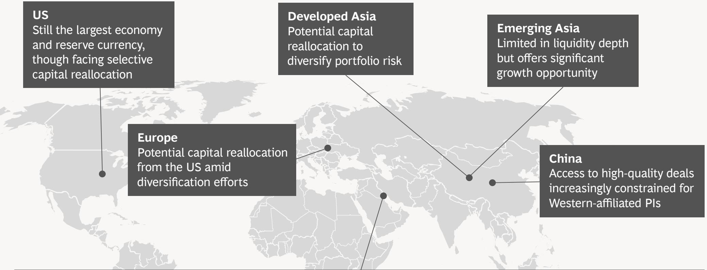

China
Access to high-quality deals increasingly constrained for Western-affiliated PIs

## GLOBAL PI ASSETS UNDER MANAGEMENT, (\$T)

North America
Others

Asia

## Middle East

\- Forms \~17% of PI AuM. Due to conflict in the region, recent patterns of allocation by ME SWFs might evolve, both globally and locally, causing sizable shifts

\- For instance, there might be more emphasis on national infrastructure creation, strategic energy security, and critical supplies, e.g., to critical minerals

## Shifting geopolitical affiliations may drive reorientation of geographic exposure

Geopolitical shifts and realignment underway; these may drive changes in geographic exposure and an increasing focus on strategic sectors, particularly for SWFs with explicit national mandates

Geopolitical realignment appears to be reshaping PI capital flows, as investor origin and affiliation increasingly determine access to deals

## Liquidity is potentially increasingly valuable in a more turbulent world

As geopolitical dislocations multiply, the ability to reallocate quickly across opportunities is an edge. Overcommitment to illiquid, bloc-sensitive assets concentrates return and political risk

In a world where there are more surprises, shocks coming more frequently, it is important to have enough liquidity to be able to pivot and change strategies.
—Dilhan Pillay, Temasek Holdings CEO, 2026

Sources: Global SWF; BCG Global Asset Management Market Sizing Database 2025; Preqin; press search; expert interviews; BCG analysis. Note: MENA = Middle East and North Africa.

## AI is top of mind for investors; PIs are investing across the AI stack, several SWFs are creating dedicated platforms

AI has emerged as a critical megatrend, with implications on where capital is deployed

Investors see AI as the most important megatrend over the next five years

"WHICH DO YOU IDENTIFY AS THE BIGGEST MEGATREND IMPACTING YOUR INVESTMENT DECISIONS OVER THE NEXT FIVE YEARS?" $(\%)$ 1

  
To capitalize on AI growth, investors are looking into five main areas

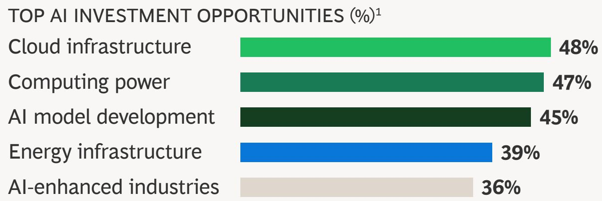  
Sources: Nuveen EQuilibrium Global Institutional Investor Survey (Feb 2026); BCG analysis. $^{1}$ Responses from 800 institutions covering \$17T AuM.

## PIs are actively investing across the AI stack

\- PIs are deploying capital systematically across the full AI stack—applications and services, models, infrastructure, chips, and energy—combining direct investments in frontier companies with large-scale infrastructure JVs and dedicated platforms

\- Leading PIs such as GIC, Mubadala, and QIA are building coordinated exposure—anchoring rounds in frontier model builders (e.g., Anthropic, xAI); co-founding infrastructure initiatives (e.g., QIA-Brookfield JV); and securing upstream compute and energy assets

## Several PIs are setting up dedicated vehicles to invest into AI as well as drive orchestration of sovereign AI efforts

• Dedicated vehicles not only meant to support AI investments, but also drive creation of domestic AI ecosystems

\- MGX was created in March 2024 by Abu Dhabi’s AI and Advanced Technology Council, with a mandate to invest across the AI value chain and build a local AI ecosystem

• Qatar launched Qai in December 2025. Qai will develop, operate, and invest in AI infrastructure to position Qatar as a hub for AI and data-driven industries

At MGX, we see AI as the most transformative force of our time, and believe open, enduring infrastructure is key to unlocking its broad societal impact
—Ahmed Yahia, CEO of MGX

Principal investors are playing a more active role in an increasingly complex market landscape 01
How principal investors are changing the way they lead 02
How general partners can partner with principal investors 03

## How principal investors must evolve how they lead and deploy capital

Infrastructure, mid-market, and secondaries are each maturing into viable, systematic allocation opportunities that warrant dedicated strategic attention

Specialist mid-market access rewards deep manager selection. GP stakes and seeding are growing as vehicles to capture economics, access, and influence alongside capital deployment

PIs must build deeper and more focused strategic relationships with GPs rather than transactional relationships to enable preferential co-investment access, strategic alignment, and stronger governance influence

AI is reshaping both investment opportunity and operational performance. PIs must define a clear AI thesis across the stack, concentrate capital in high-value opportunities, and systematically integrate AI into internal operations and portfolio value creation

As complexity increases, PIs must restructure their organizations around high-conviction platforms, rationalizing direct vs. partner-led execution and systematically exiting strategies outside domains of edge

As PIs explore more sophisticated portfolio management approaches, shifts such as exploring a stronger role for the CIO Office in balancing liquidity and returns and using TPA as a management approach are potential levers to explore

Competition for direct investing talent is intensifying as PI mandates evolve. Compensation structure and value proposition to PI employees requires careful design while taking into account economics and governance constraints

## Amidst private market uncertainty, PIs must carefully consider relative asset class allocation

Recent fundraising has shifted, with focus on infra over other private assets GLOBAL INFRA, PE, AND OTHER PRIVATE CAPITAL FUNDRAISING INDEX (2015 = 100, % RELATIVE TO PEAK)

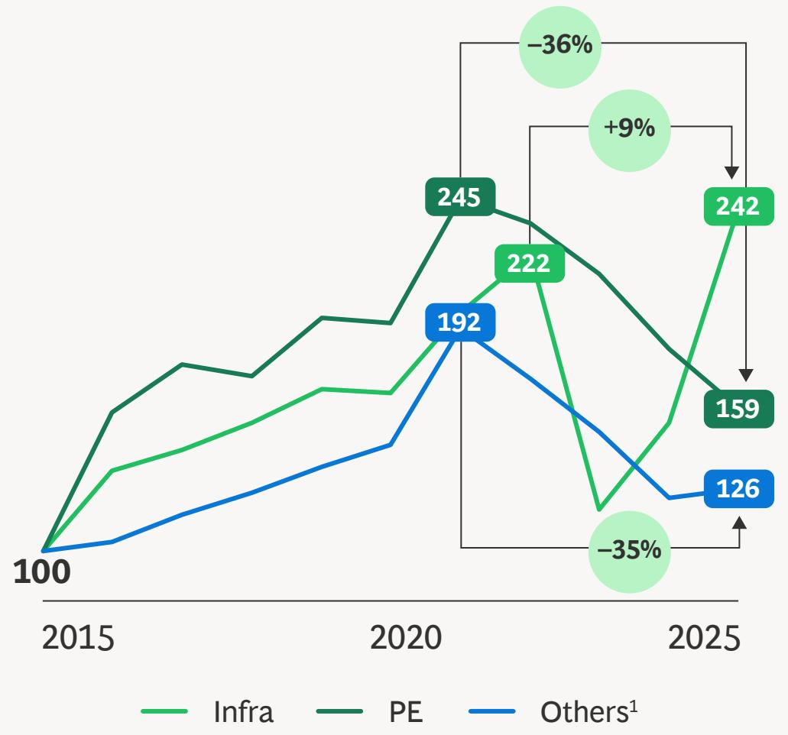  
Sources: Preqin, BCG Infrastructure Strategy 2026 (March 2026).

In general, PE funds have higher IRR, but infra funds offer lower volatility
WEIGHTED AVERAGE NET IRR (%, 2012–2022) $^{2}$

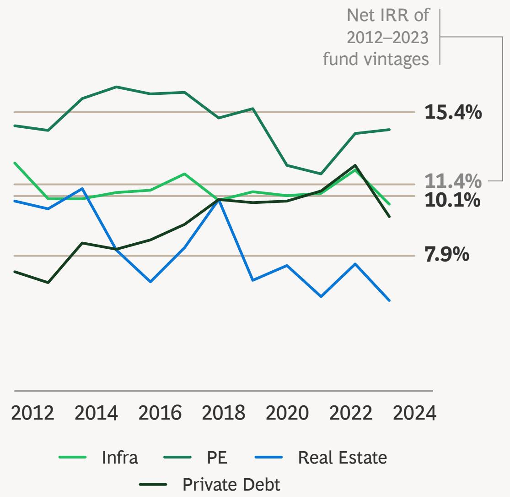  
$^{1}$ Includes real estate and private debt; $^{2}$ Weighted IRR for 2012–2023 is based on net IRR for all funds within a category, weighted by fund size.

PE has historically anchored PI private market allocations, with infra, private credit, and real estate as supplementary positions

Return profiles have shifted in recent years—PE and real estate IRR have become more volatile and declined from historical levels, while infrastructure has remained resilient

Fundraising patterns are also evolving. Infrastructure fundraising has recovered and grown, while PE and other private assets remain below prior peaks

Going forward, PIs must carefully assess relative asset class allocation in private markets. Despite weaker recent performance, PE funds can still potentially deliver higher returns than infrastructure funds. Meanwhile, large inflow of capital to infra funds can create risk of too much capital chasing too few opportunities

AVERAGE NET IRR OF MANAGERS $(\%)^{1}$

## Specialist mid-market access and superior manager selection can unlock alpha, especially where proprietary sourcing / operational edge still exist

## Mid-market is structurally attractive in a capital constrained environment

\- Mid-market GPs are fundraising-constrained but operationally capable, creating a structurally attractive entry point for LPs

\- High-performing mid-market managers are operating in an undercapitalized segment where anchor capital is scarce, creating openness to structural alignment that mega-platforms will not offer—sub-2% fees, enhanced co-invest rights, LPAC seats, and governance protections that reflect LP leverage at its highest

\- In addition, mid-market exposure allows LPs to tap into niche strategies and specialization. Excess return opportunity increasingly sits in specialist subsegments (e.g., sector-focused GPs, regional champions with proprietary sourcing, and operationally-led strategies where the GP brings genuine competitive advantage)

Mid-market segment sees larger IRR dispersion but can offer superior upside potential against large-scale funds with proper manager selection

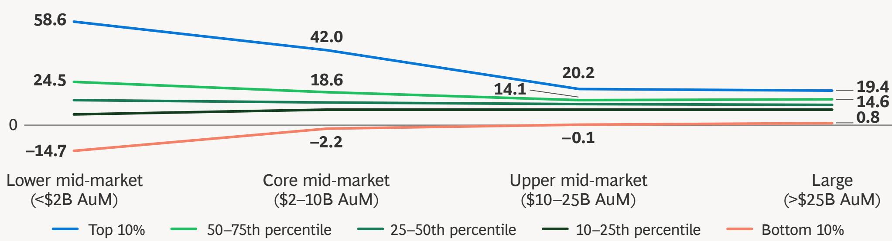

Significant value in identifying differentiated deal access beyond the mainstream

Proprietary sourcing can still unlock value in the mid-market. GPs operating in niche sectors, geographies, or with founder/family-owned deal pipelines with limited competition

Data/AI-based models can be very valuable to surface right managers early

Use AI-enabled screening to identify managers with repeatable edge before they become fully “brand-priced.” Leverage as a monitoring layer to look out for predictive leading indicators such as DPI momentum, loss ratio, value creation bridge, % proprietary deals, etc.

## Some PIs are using GP stakes to access mid-markets, serving as an alternative fixed-income vehicle with additional equity upside

GP stake deal value rebounding over the past years, driven by stakes in middle-market managers

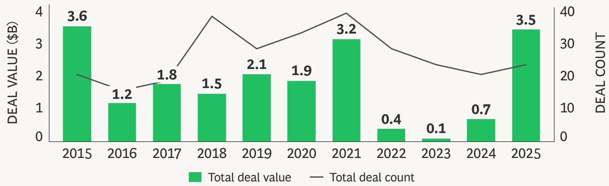

\- Mid-market GPs are actively seeking external capital as traditional sources are holding back, creating a receptive environment for structured partnerships linked to capital commitments

\- For LPs, GP stakes deliver compounding structural advantages, serving as fixed income with equity upside. Fee and carry economics across all future strategies, permanent co-invest access, and AuM growth upside

\- Strategic PIs are seeking to steer GP strategy more closely. GP stakes provide governance rights and board-level influence that no fund commitment can replicate

\- Growing exit options available (e.g., management buyback, secondary sales, strip sales, etc.) making investment option more liquid and simple when exit is required

## Recent examples of scaled LPs strengthening presence in GP stakes

## Mubadala Capital

\- Stakes taken in Silverlake (2020) with a \$2B long-dated fund commitment, Hayfin (2025) driven by strong alignment to strategic priorities

\- Most recent GP stake in November 2025 involves Ares, ADIA, and Mubadala founding a new business together to take minority stakes in mid-sized PE firms

## Blue Owl

\- Democratized access to GP economics through pooled vehicle structure, enables lower minimums and no operational burden for investors as Blue Owl handles monitoring of cash flows, manager relationships and negotiations, etc.

\- Funds have performed strongly: net IRR of \~13% to 38% across funds III to V

New managers can outperform established ones without large additional downside risk $^{1}$

## GP seeding viable path to anchor and catalyze mid-market managers; earnings economics commensurate with the risk capital deployed early

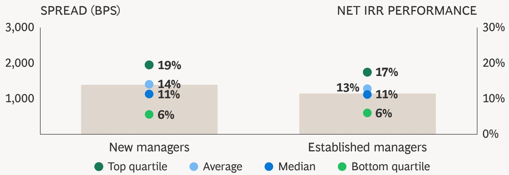

\- GP seeding is structurally undercapitalized. Less than \$5B has been raised globally for seeding vs. \$60B+ for GP stakes, a fraction of the capital despite comparable return potential

\- New managers outperform without added downside.
Top-performing new managers (Fund I–III, <\$2B AuM)
generate higher net IRRs than established managers.
Bottom-quartile performance is identical across both cohorts - GP seeding a way for PIs to anchor and catalyze mid-market managers. Especially in the context of long-term capital stewardship and regional market development (e.g., in GCC and SEA), seeding is a means of meaningfully driving growth in the mid-markets

## TPG NEXT and GCM key recent examples of investors entering GP seeding

TPG NEXT, anchored by \$500M CalPERS commitment, invests as a GP in emerging funds

Demolis Equity Partners (2025): Mid-market growth and buyout fund, focused on tech; TPG Next's investment include capital market, investment sourcing, and diligence support

Cohere Capital Partners: Buyout fund in tech-enabled sectors; TPG Next's investment access to TPG's network, operation and ecosystem support

GCM Grosvenor's Elevate, anchored by CalPERS \$500M commitment, makes seed investments in emerging PE firm founders

Excolere Equity Partners (Oct '23): Mid-market buyout fund focused on human capital, education, and tech-enabled services; GCM provides support on key non-investment functions

Tayeh Capital (Oct '25): PE fund focused on family-owned mid-market service companies; GCM provides access to resources in Sponsor Solutions platform

## Deeper and more programmatic GP partnerships can create structural advantages for PIs, especially in terms of superior co-invest opportunities

Institutional relationships can unlock meaningful benefits preferential co-investments, joint pursuit of strategic objectives through JVs, and better governance influence and rights

## PIs can substantively strengthen GP relationships through three approaches

Anchor GP relationships with programmatic commitments
Mega-GPs reserve their best co-investment deal flow for LPs who reduce fundraising uncertainty. Committing early gives the GP a reason to treat the LP as a structural partner rather than a transactional allocator

Offer co-underwriting capacity, not just co-investment appetite
LPs taking on execution risk alongside the GP and who can move agilely become useful to GPs on certain transactions and get embedded into the deal flow structurally

## Bring sovereign or strategic value the GP cannot source through capital alone

A newer LP that can credibly open doors in its home market in investment spaces that need regulatory relationships, government access, and local legitimacy gives the GP a reason to bring them in early

## Danantara — Building mega-GP network for strategic sector exposure

Context: Launched February 2025, Danantara is deliberately courting mega-GP relationships to access global deal flow and sector expertise ahead of building direct investment capability

## Early partnership activity

\- Actively in discussions with global PE, private credit, and real estate managers to secure fund commitments and co-investment rights in priority themes (e.g., digital infrastructure, AI in China)

\- Establishing co-investment frameworks early: \$4B joint fund with Qatar Investment Authority (April '25) signals intent to underwrite deals at scale alongside strategic partners

## Lunate — Evolving from new LP to integrated partner in under three years

Context: Founded 2023 and headquartered in Abu Dhabi, Lunate manages \~\$115B in AuM and has deployed \$13.5B in its first two years—raising \$17B in 2024 alone for flagship funds. Purpose-built as a sophisticated private markets allocator, with a mandate to operate simultaneously as LP, co-investor, and GP stakes partner

## Early partnership activity

\- Relationships with 100+ GPs established within two years, including BlackRock, Blackstone, CVC, Brookfield, Blue Owl, and HPS

• Over 70 direct deals and co-investments alongside GPs; 30+ as LP fund commitments; rapid progression from passive LP to active deal partner

\- Concrete co-investments: Clayton Dubilier & Rice (Sanofi €16B OTC buyout), Brookfield (Neoen €6.1B take-private), CoreWeave (senior and mezzanine debt)

## PIs must assess investment implications linked to AI and rapidly determine how to integrate across value-chain

## AI EXPOSURES AND USE CASES

PIs need to consider where they are exposed to AI portfolio risk and how to identify AI managers

AI is seen as an important fund enablement engine, enabling fund selection, due diligence, and value creation

## PI TRENDS AND DEVELOPMENTS

## Investments in AI

• Major PIs anchoring AI model and compute platforms as both strategic and financial investments

\- Infrastructure plays (e.g., data center, power, semiconductors) also emerging as a means to create AI exposure. Several PIs are creating infrastructure-focused platforms

## AI in fund strategy and operations

• AI repositioning investment thesis work, identifying AI-exposed sectors and stress-testing existing portfolios for disruption risk

\- GP selection is increasingly data-driven, with AI used to screen, benchmark, and monitor manager performance at scale

\- Agentic AI pilots emerging in due diligence (automated data room analysis); operational impact still early but accelerating

## AI in value creation

\- Leading PIs standing up AI centers of excellence to systematically deploy AI across PortCos with standardized playbooks, shared tooling, etc.

\- AI embedded into value creation agendas from day one: maturity assessments at entry, board-level accountability, rollout programs

\- AI aimed to systematically uplift EBITDA through commercial analytics, cost efficiency, and operational automation across PortCo base

## Rise of AI implications for allocation and manager selection; significant opportunity to strengthen internal operations

## Investments in AI: Rise of AI likely to increase importance of private markets; manager selection critical

AI companies are staying private longer, reinforcing the case for private markets exposure and GP selection

\- AI companies are staying private longer, with the bulk of value creation occurring well before any public listing—meaning LPs without private market exposure risk missing the most significant compounding phase

\- For LPs, this points towards deeper engagement with PE and growth equity GPs active in AI and selective venture fund allocations to maintain access to frontier opportunities

Selecting the right GP partner is critical; in the absence of historical track record, need to understand specific edge

\- AI is a nascent industry. Historical returns are weaker indicators as most managers are only 2 to 3 years into the cycle

• GPs will present strong deal-making and operational capabilities, but LPs have few tools to distinguish genuine expertise from narrative

\- Evaluation must shift from what have they returned to what is their sourcing edge and operational value-add

## AI in Fund Ops: AI increasingly embedded across fund operations; several PIs building bespoke capabilities

AI offers PIs a material opportunity to improve the quality and efficiency of internal operations across the investment lifecycle. The most ambitious PIs are moving toward embedding AI across front, mid, and back office functions

## Several PIs actively applying AI in fund operations, including in manager selection

CPP: Using generative AI to extract patterns across 100+ GP reports and Pitchbook deal activity data; conducting deep dives with partners to sharpen understanding of the AI landscape; deploying bespoke AI research agents for investment analysts to improve the speed and depth of manager assessment

GIC: Applying AI “opinion mining” to assess GP sourcing quality and deal flow edge; extracting key insights from large volumes of manager and market information to cut through noise in an increasingly information-dense environment

ADIA: Has built out a 100+ person quant R&D team alongside ADIA Lab, focused on AI and data science for investment analysis and monitoring; exploring applications across manager selection, portfolio monitoring, and broader investment process support

## PIs are re-examining their organizational structure to enable more active involvement in the markets

## Mandate delivery requires coherence across organization structure, governance, and talent

How the operating model enables mandate delivery

Illustrative

Fund mandate and strategic objectives
Building scaled in-house direct investing to support nation-building (Develop sector depth, deploy capital domestically, and generate risk adjusted returns)

## OPERATING MODEL

## Organization structure

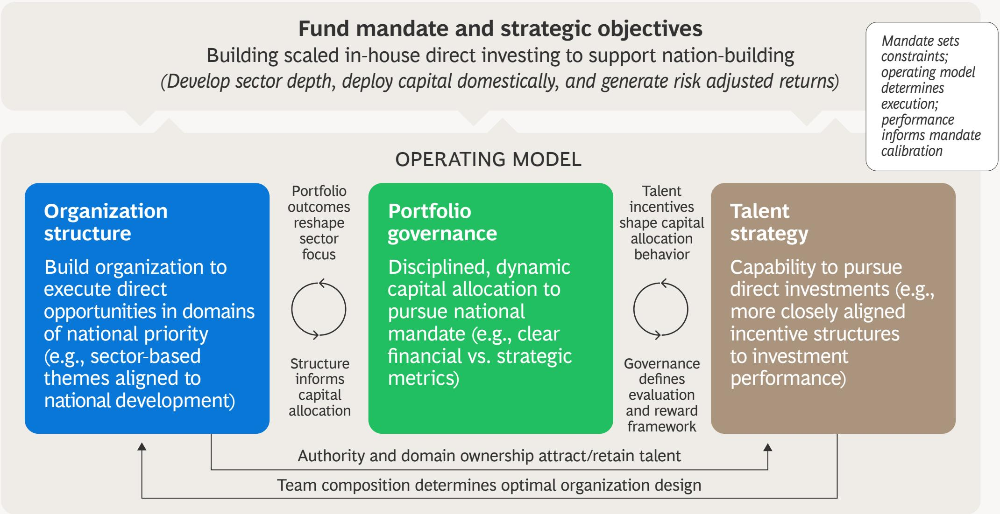

structure
Build organization to
execute direct
opportunities in domains
of national priority
(e.g., sector-based
themes aligned to
national development)

Portfolio outcomes reshape sector focus

Structure informs capital allocation

Portfolio governance

Disciplined, dynamic capital allocation to pursue national mandate (e.g., clear financial vs. strategic metrics)

Talent incentives shape capital allocation behavior

Governance defines evaluation and reward framework

Mandate sets constraints; operating model determines execution; performance informs mandate calibration

## Talent strategy

Capability to pursue direct investments (e.g., more closely aligned incentive structures to investment performance)

Authority and domain ownership attract/retain talent

Team composition determines optimal organization design - Mandate delivery requires alignment across organization structure, portfolio governance, and talent: all three must reinforce each other

\- Agile, total portfolio management (e.g., TPA) requires organization structure with sufficient sector, geo-or asset-class coverage. Limited coverage constrains the ability to capitalize on market dislocations

\- Talent without active portfolio governance under-delivers. Top talent is only helpful insofar as portfolio governance enables capital to be dynamically reallocated at pace to avoid missing time-sensitive opportunities

# PIs especially reorganizing around areas where they can lead and partnering elsewhere

Drive to reorganize

Scale complexity, rising private markets specialization, and shifting mandates (especially for sovereigns) are creating impetus for reorganization

## Imperatives

1 Decision on what to own vs. access to inform capital deployment strategy

\- Funds are choosing between passive allocation to GPs, co-investing, deal leadership, and partnerships based on where they have genuine edge

\- Internal resources are being dedicated only in domains of edge—by sector, geography, or asset class—while other markets are accessed through partnerships

\- Where pursued, direct investing capabilities such as value creation are being institutionalized

## 2 Imperative to modularize organization around sources of repeatable advantage

\- Funds are structuring for speed and repeatable edge in their highest-conviction domains

\- Organizations are being designed around domains where funds have repeatable advantages, enabling greater agility and value-realization potential

In recent years, PIs have visibly been acting on these imperatives in three concrete ways

Restructuring the organization around conviction platforms

PIs sharpening focus on conviction themes and geos where they have clear edge, exiting peripheral markets and creating dedicated platforms around these domains

Leading PIs are reorganizing or creating new entities to sharpen focus on conviction strategies

Temasek: Creating new wholly-owned entities to manage focus on three key segments (effective April 1, 2026): Singapore-based portfolio companies; global direct investments; and partnerships, funds, and asset management companies

Mubadala: Expansion of sector-led platforms (e.g., Mubadala Energy, M42, MGX)

Convergence of SWFs to a more partner-led model

PIs are especially looking to invest directly in areas with clear edge while being more partner-led (e.g., expanding partnerships/GP allocations) elsewhere

GP-partnered co-invest model generally preferred over solo direct ownership

Canadian pension funds (e.g., CDPQ, OTPP) are reducing direct PE exposure and building more partnerships

Similarly, ME and APAC SWFs are doubling down or maintaining co-investment as a core model

Institutionalizing portfolio pruning and exit discipline
Leading PIs are systematically exiting legacy portcos and strategies that no longer align with current focus or institutional expertise

Institutions scaling back operations in regions with lower strategic alignment

Several Canadian pensions have scaled back direct investing in Asia, especially China: OMERS disbanded its Singapore-based Asia private equity team, OTPP closed its Hong Kong office consolidating APAC coverage into Singapore and Mumbai, and CPP cut its Hong Kong-based China PE team

Sets direct investing direction in alignment with OTPP's fund strategy and AuM mandate (\~\$270B)

# Where PIs are taking a more active role, some are building more GP-like value-creation capabilities

## Key principles and considerations

1 Evolving toward hybrid value creation models
Combining central platforms (standards, playbooks) with selectively embedded expertise at the deal and sector level

## 2 Increasing alignment of operating capabilities with investment strategy

Shaping value creation resources around priority sectors and investment themes to enhance relevance and impact

## 3 Clarifying roles across investment and value creation teams

Defining how strategy-setting and execution responsibilities are shared as operating models mature

## 4 Scaling institutional knowledge to drive repeatability

Building mechanisms to codify and transfer best practices across portfolio companies

## 5 Strengthening fund–portfolio alignment mechanisms

Leveraging governance and engagement models to more consistently translate strategy into value creation outcomes

## Several PIs are strengthening operational value creation teams in-house Illustrative

Case study: OTPP strengthening value creation team with operational experts and sector specialists

## OTPP

• In 2024, OTPP established the Portfolio Solutions Group (PSG) to consolidate value creation oversight across its private markets portfolio, operating as a lean, MD-led team that works alongside investment teams to shape portfolio strategy and drive asset-level outcomes

\- PSG is expanding through targeted hiring of operational and sector strategy experts, with functional capabilities (e.g., data analytics) being added in parallel to broaden its execution capabilities

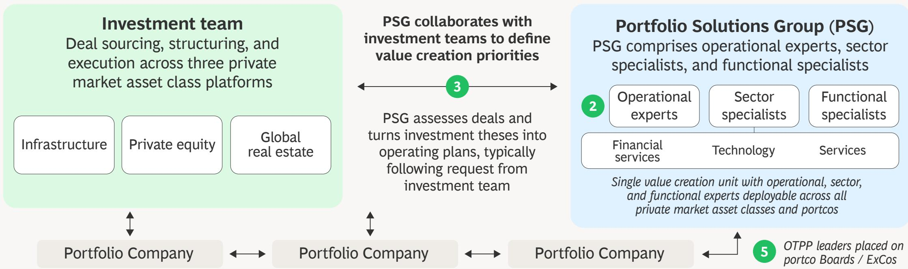  
4 PSG facilitates knowledge sharing to replicate best practices and build institutional knowledge

## A stronger CIO office is becoming more valuable, especially as portfolio complexity expands

## Portfolio management led from top-of-house, empowered CIO office

## CIO office as a dynamic capital allocation engine across asset classes

Illustrative

Teams involved in investment implementation process

Board
Responsible for reference portfolio and risk limits

CIO Office (active portfolio manager)
Responsible for risk budget allocation, liquidity and capital deployment, cross-asset rebalancing

Asset classes

Capital allocation and risk deployment from CIO to asset classes; performance and risk feedback from asset classes to CIO

Public Equities

Private Equity

Credit

Real Assets

Flexible and dynamic cross-asset allocation

Board sets the guardrails, while CIO deploys capital dynamically to maximize total-fund outcomes

Shifting the mandate from policy oversight to active portfolio optimization

\- Moving beyond periodic SAA design to continuous portfolio optimization, recognizing that performance is increasingly determined between policy resets

\- Dynamically rebalance risk and capital across the full portfolio to capture relative value opportunities (e.g., potential for CIO office to deploy overlay strategies like using derivatives to rebalance aggregate exposure across portfolio)

Making the CIO accountable for total-fund outcomes

\- Elevate CIO from compliance monitor to performance owner

\- Align incentives and evaluation to total-fund outcomes rather than siloed benchmarks

Redesign governance to enable disciplined agility

\- Maintain board-owned reference portfolio with total-fund risk limits as enforceable anchor

\- Vest portfolio-wide allocation authority in CIO office, operating within defined risk budgets and breach protocols

\- Enable flexible allocation across assets, so liquidity rules and commitments do not prevent acting on attractive opportunities

\- Scaled governance and accountability in line with AuM and portfolio complexity

## Some PIs are embracing TPA in push for agility and performance gains; however, this requires organization and governance design shifts

As portfolio management becomes more complex, several PIs are exploring shifting, or have shifted, from SAA to TPA to get better value from their portfolio and optimize capital allocation

Leading
institutional
adopters

NZSUPERFUND
2010

## CPP INVESTMENTS

## FUTUREFUND

Mid-2000s

Mid-2000s

GIC
Early-2020s

## Calpers

Recent adopters

First US public pension to adopt TPA; effective July 1, 2026

## CalSTRS

TPA used to enable dynamic allocation to optimize portfolio

## HOOPP

TPA launched in Jan 2026, anchored by liability-aware investing

## Aware Super

Announced a
revamped investment
structure in Feb 2026
to support TPA

SAA allocates capital within fixed asset class buckets, potentially limiting a fund’s ability to respond as markets evolve. TPA enables continuous, portfolio-wide reallocation toward the highest risk-adjusted opportunities

However, TPA should not be seen as a magic bullet; governance is required to reap advantages

TPA is not a magic bullet; effective governance is required to reap advantages of TPA, especially at larger funds

\- Larger funds face alpha headwinds from complexity and diseconomies of scale

\- Sustained outperformance increasingly depends on TPA “in practice” (e.g., flexible allocation across assets, portfolio-wide allocation authority vested in CIO office)

Beyond that, TPA is only one driver of outcomes; broader institutional design matters equally

\- Investing mandate (e.g., strategic vs. financial) and domain specialization (e.g., by asset class, sector, geo) ultimately govern risk and return expectations

\- TPA is an enabler of the given strategy or mandate a fund chooses to employ, enhancing execution efficiency and flexibility rather than being primary driver of returns

## As direct and co-invest roles deepen, some PIs are selectively adapting incentive models

## Institutional and governance constraints shape compensation models across investors

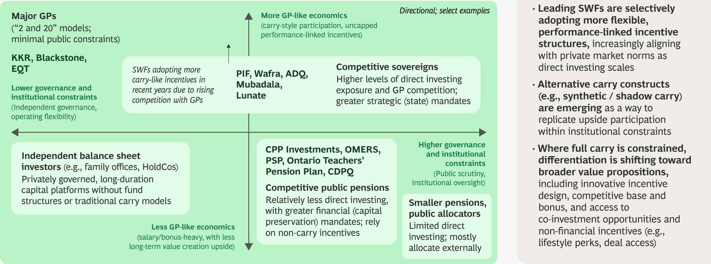

\- Leading SWFs are selectively adopting more flexible, performance-linked incentive structures, increasingly aligning with private market norms as direct investing scales

\- Alternative carry constructs (e.g., synthetic / shadow carry) are emerging as a way to replicate upside participation within institutional constraints

\- Where full carry is constrained, differentiation is shifting toward broader value propositions, including innovative incentive design, competitive base and bonus, and access to co-investment opportunities and non-financial incentives (e.g., lifestyle perks, deal access)

Sources: CPP Annual Report 2025; expert interviews; BCG analysis.

# Some PIs replicating “carry-like” incentives; vital to account for distinct economics suited to balance-sheet model and governance requirements

## Key structural issues

## Several PIs are experimenting with carry-adjacent structures, navigating the boundary between competitive economics and institutional constraints

## 1 Need to manufacture distinct carry mechanisms from GPs as “2 and 20” economics do not apply

\- PIs predominantly invest proprietary capital instead of 3P capital; do not have built-in management fee or carry

\- Alternative carry structure must specify which returns qualify as “alpha” and over what horizon before triggering compensation

## 2 Need to embed governance guardrails in carry design

\- Incentives must operate within appropriate political, reputational, and accountability frameworks

\- Incentive structure will also need to be balanced with broader fund economics

\- Organizational strategic objectives or mandates should be considered as part of carry design

## Lunate

Driven by high direct investing exposure, Lunate has begun providing synthetic carry to some employees, helping them attract talent from large PE firms

Synthetic structure avoids the legal and governance complexity of true carry (no profit participation agreement, no entitlement to fund economics), while still providing meaningful long-term upside tied to investment performance

## CPP Investments

Designed long-term incentive program (deferred award and FRU grant) $^{1}$ to offer distinct carry mechanisms and a strategic component to value generated beyond “alpha”

Long-term incentive program aligns executives to multi-year fund compounding rather than annual performance cycles; discretionary strategic component provides governance flexibility to override benchmark distortions $^{2}$

## OMERS

Wound down a deal-profit sharing plan in 2021, prompting a lawsuit; underscores challenges of GP-style economics within pension constraints

OMERS ran a vintage-year LTIP giving PE professionals a share of deal profits, but repeatedly modified terms (caps, hurdle rates, profit share) before winding it down entirely in 2021; illustrates how carry-like plans at public institutions are vulnerable to unilateral amendment when fund economics or governance priorities shift

Principal investors are playing a more active role in an increasingly complex market landscape 01
How principal investors are changing the way they lead 02
How general partners can partner with principal investors 03

## As the LP landscape evolves, GPs must adapt how they partner and build capabilities to differentiate

GPs must offer greater flexibility across partnership models and evolve from product providers to strategic partners—supporting PIs’ domestic mandates, talent development, and co-investment origination, as strategic alignment becomes an increasingly important selection criterion for large LPs

Retail-originated AuM in private markets is growing faster than institutional. Structural separation of vehicles, teams, and incentives is essential to protect institutional LP interests and fund economics

Family offices are
professionalizing and
shifting toward deal-level
engagement over
blind-pool commitments.
GPs that offer
co-investment access and
tailored vehicles are best
positioned to capture this
growing capital pool

As PIs concentrate capital with fewer, higher-conviction managers, generic positioning is harder to defend. GPs—particularly in the mid-market—should build a differentiated thesis by sector, geography, or theme, backed by the sourcing depth and operational capability to substantiate it

LPs are increasingly evaluating GPs on their ability to assess AI disruption risk and unlock value creation potential across the portfolio. GPs that articulate a clear AI framework in diligence and build operational capability to support portfolio companies are becoming a more differentiated choice

<table><tr><td></td><td>Move beyond standard fund structures to bespoke approachesGPs must build deal capacity to process fast, large co-invest decisions and complement this with tailored vehicles: Separately Managed Accounts (SMAs) for custom mandates, open-ended funds for perpetual capital, and long-dated structures for sovereign horizons</td><td>KKR&#x27;s infrastructure AuM explicitly includes SMAs and the Diversified Core Infrastructure Fund, an open-ended vehicle designed for large LPs seeking long-duration, customized exposure outside the standard fund structure</td></tr><tr><td></td><td>Shift from product provider to strategic partner and co-creatorPIs increasingly seek GPs who can support their domestic mandates, talent development, knowledge transfer, and co-investment origination, not simply deliver IRR. Strategic alignment is becoming a significant selection criterion for large LPs</td><td>Blackstone pioneered perpetual-life fund vehicles (BREIT, BXPE, BCRED), open-ended structures with no capital call cycle or fixed exit that directly address liquidity and pacing challenges for large institutional and wealth allocators</td></tr><tr><td></td><td>Adopt more flexibility in fee structure, especially for anchor LPsTraditional “2 and 20” is under pressure: GPs must adapt their fee structures (e.g., offer tiered or performance-linked fee structures) for PIs to remain attractive partners to LPs</td><td>Mubadala committed $2B to a dedicated Silver Lake strategy in 2020 with a 25-year deployment lifecycle, a bespoke structure designed to invest outside the mandates of Silver Lake&#x27;s standard fund vehicles</td></tr></table>

## GPs must evolve beyond the standard fund model, offering more flexible partnership structures to retain and deepen relationships with PIs

What GPs must do

## Leading mega-GPs are already adapting

Global retail investment as a proportion of capital to private markets has grown \~20% from 2015 to 2025
PRIVATE CAPITAL AUM FROM GLOBAL RETAIL INVESTORS, (\$T)

## Retail capital is greater share of private capital investment, creating structural trade-offs but reducing GPs' reliance on institutional capital

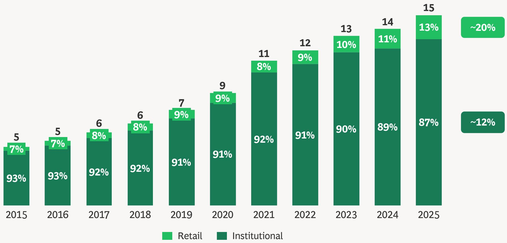  
Sources: Preqin "Private Markets in 2030"; BCG analysis.  
applying each region's share of total private capital AuM (Preqin) to the known and forecasted US and EU retail base.  
$^{1}$ (\~\$1.9T retail investors' private capital)/(\$14.8T in total private capital AuM in 2025) = 12.8%

## Retail is becoming a structural growth engine in private capital

\- As of 2025, global retail investors account for \~\$1.9T in private capital AuM, representing \~12.8% of the total market $^{1}$

## Retail capital is growing faster than institutional flows

\- Expansion is driven by regulatory liberalization, access through retirement savings system, digital platforms, and GP product innovation, reducing barriers for retail capital

## Retail access introduces structural trade-offs for GPs

\- Serving retail requires liquidity features, operational scale, and enhanced transparency, which can reduce return optimization and alter fund economics if not carefully structured

## Institutional-retail structural separation matters to institutional PIs; as GPs broaden capital channels, they must design for segregation

## Vehicle segregation allows for separation of economics and required holding periods

Retail and institutional capital reside in separate vehicles

Retail

investors

General partner

Retail-specific vehicle

Institutional

investors

Institution-specific vehicle

Separate vehicles needed to align structure, liquidity, and governance by client segment

• Retail vehicles require liquidity buffers to fund redemptions and continuous deployment, creating differentiated risk/return profile

\- Separation of vehicles can mitigate allocation conflicts, cross-subsidization risk, and misaligned fee incentives. It is critical for GPs to also ensure auditable fair allocation policies in line with regulation $^{2}$

## Separate organizational structures most effectively prevent sales channel conflicts

Retail team

Institutional team

Different coverage, compensation, information access, reporting, and CRM needed

## Establish fully dedicated teams to protect institutional and retail mandates

• Retail distribution tends to generate higher management fees than institutional, causing a unified team to systematically prioritize retail AuM

\- Institutional LPs share sensitive information (e.g., co-investment appetite/strategic priorities) and expect confidentiality; a shared sales organization creates higher structural risk that information is leaked

## CASE STUDY

Blackstone was an early mover in retail private markets, but learned that serving institutional and retail clients from a single platform creates structural tensions

\- When retail vehicles launched, they typically lacked dedicated investment teams. Professionals from institutional vehicles wore two hats—sourcing deals for both institutional funds and the new retail vehicle simultaneously—creating tensions where differing investment mandates and client expectations pulled in conflicting directions

\- Misaligned compensation and governance structures created dissatisfaction across stakeholders, ultimately prompting Blackstone to build dedicated client-facing and distribution teams for its retail vehicles, alongside separate governance structures

\- Today, retail accounts for approximately 23% of Blackstone's AuM, held in structurally separate vehicles with dedicated distribution teams and distinct governance—though investment professionals and deal flow may be shared

## As FOs become more important, several opportunities exist for GPs to engage and capture value

## FO professionalization is accelerating but uneven

\- Large FOs ( $1B+$ ) are hiring institutional-grade talent and competing directly with PE firms for investment staff, while sub-scale FOs (< $100M$ AuM) face economic constraints that limit full team buildout, relying instead on hybrid, fractional CIO, or OCIO models

\- Increasing appetite for direct deal participation; however, scale is the binding constraint: only the largest FOs can build institutional-grade direct investment teams, creating opportunities for platform vehicles

## Expanding co-investment opportunities to large FOs will help deepen relationships

\- Deal-by-deal participation, with early visibility and preferred economics, reflects how large FOs increasingly want to engage

\- KKR's dedicated FO program offers selective co-investment rights as a core relationship tool, enabling deal-by-deal participation alongside primary funds

## Co-investment structures are emerging as the preferred vehicle for FO private markets exposure

\- PE fund commitments have fallen while interest in co-investment and direct deal participation has grown. For GPs, this represents a growing opportunity to engage FOs at the deal level rather than through committed capital vehicles

\- Larger proportion of FOs anticipate an increase in private equity direct investments rather than private equity fund investments

\- Historically, larger FOs have been more active in direct investments, reflecting stronger in-house capabilities

FO SENTIMENT ON CAPITAL ALLOCATION IN PE (2025) $^{1}$

<table><tr><td></td><td>Increase</td><td>No change</td><td>Decrease</td></tr><tr><td>Private equity direct</td><td>28%</td><td>59%</td><td>13%</td></tr><tr><td>Private equity funds</td><td>24%</td><td>59%</td><td>17%</td></tr></table>

## Subscale FO capital can be aggregated through feeder vehicles or platform partnerships

\- Structured access vehicles can reach FOs below traditional minimums, reducing LP concentration risk

iCapital partnered with Blackstone and KKR to distribute fund access via standardized feeder structures, opening each GP to a wider FO universe

## Platform opportunity: structures where the FO network itself generates proprietary deal access

\- A small number of GPs may find value in FO-native structures where families are genuine platform participants

Built around major tech founder families; the network's relationships generate proprietary late-stage deal access that defines the platform's competitive edge

## About the Authors

Benjamin Sheridan is a managing director and senior partner in BCG's Singapore office. You may contact him by email at sheridan.benjamin@bcg.com.

Benjamin Entraygues is a managing director and senior partner in BCG's Paris office. You may contact him by email at entraygues.benjamin@bcg.com.

Ihab Khalil is a managing director and senior partner in the UAE office of BCG. You may contact him by email at khalil.ihab@bcg.com.

Christy Carter is a managing director and senior partner in the New York office of BCG. You may contact her by email at carter.christy@bcg.com.

Mark Harris is a managing director and senior partner in BCG's Toronto office. You may contact him by email at harris.mark@bcg.com.

Saleh Al-Ateeqi is a managing director and partner in the UAE office of BCG. You may contact him by email at alateeqi.saleh@bcg.com.

Andrew Claerhout is a partner and director in BCG's Singapore office. You may contact him by email at claerhout.andrew@bcg.com.

Shobhit Shubhankar is a partner in BCG's Singapore office. You may contact him by email at shubhankar.shobhit@bcg.com.

Katharina Obinger is a partner in the UAE office of BCG. You may contact her by email at obinger.katharina@bcg.com.

## Acknowledgments

The authors would like to thank Gwenhael Le Boulay, Johannes Glugla, Eric Ritsema, James Loughridge, Dieuwertje ten Feld, Jade Tan, Jonathan Chin, Aisha Khandelwal, Gloria Tan, Alexander Raju, and Angela Everitt for their support in preparing this report.

## Disclaimer

The services and materials provided by Boston Consulting Group (BCG) are subject to BCG's Standard Terms (a copy of which is available upon request) or such other agreement as may have been previously executed by BCG. BCG does not provide legal, accounting, or tax advice. The Client is responsible for obtaining independent advice concerning these matters. This advice may affect the guidance given by BCG. Further, BCG has made no undertaking to update these materials after the date hereof, notwithstanding that such information may become outdated or inaccurate.

The materials contained in this presentation are designed for the sole use by the board of directors or senior management of the Client and solely for the limited purposes described in the presentation. The materials shall not be copied or given to any person or entity other than the Client (“Third Party”) without the prior written consent of BCG. These materials serve only as the focus for discussion; they are incomplete without the accompanying oral commentary and may not be relied on as a stand-alone document. Further, Third Parties may not, and it is unreasonable for any Third Party to, rely on these materials for any purpose whatsoever. To the fullest extent permitted by law (and except to the extent otherwise agreed in a signed writing by BCG), BCG shall have no liability whatsoever to any Third Party, and any Third Party hereby waives any rights and claims it may have at any time against BCG with regard to the services, this presentation, or other materials, including the accuracy or completeness thereof. Receipt and review of this document shall be deemed agreement with and consideration for the foregoing.

BCG does not provide fairness opinions or valuations of market transactions, and these materials should not be relied on or construed as such. Further, the financial evaluations, projected market and financial information, and conclusions contained in these materials are based upon standard valuation methodologies, are not definitive forecasts, and are not guaranteed by BCG. BCG has used public and/or confidential data and assumptions provided to BCG by the Client. BCG has not independently verified the data and assumptions used in these analyses. Changes in the underlying data or operating assumptions will clearly impact the analyses and conclusions.