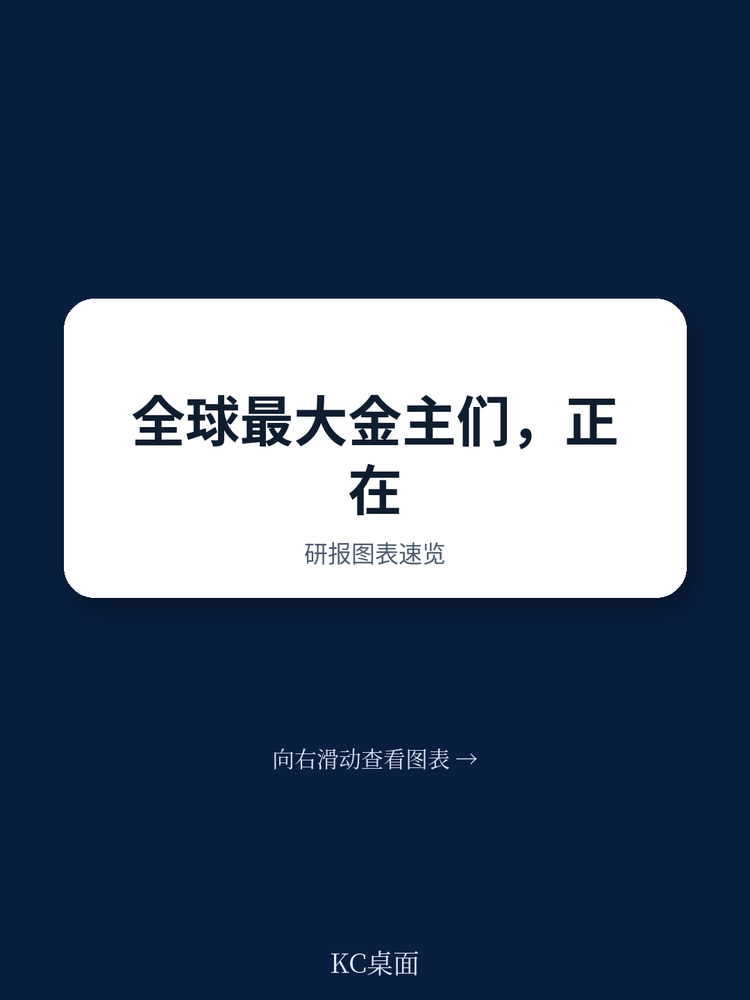
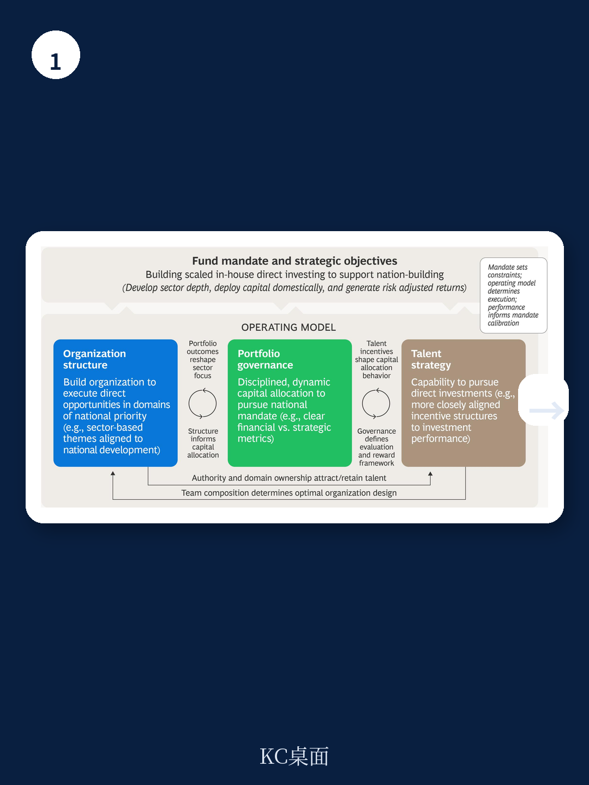
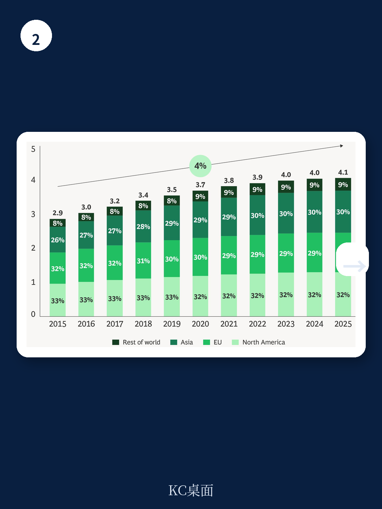

# 波士顿咨询：研究主题与行业变化观察

全球主权财富产品和公共养老产品的管理资产规模在2025年达到43万亿美元，较2015年的21万亿美元翻了一番以上。波士顿咨询在最新发布的《全球主要读者报告》中指出，这一资本池已占全球专业管理资产总额约30%，其配置决策足以对市场流动性和市场定价产生系统性影响。报告同时观察到，主权读者正在从传统的被动出资人角色，向更主动、更直接的研究模式转型，这一趋势正在重塑私募市场的竞争格局。

## 1. 新设主权产品数量创下年度纪录

2025年，全球新设立的主权财富产品达到10只，覆盖印尼、蒙古、博茨瓦纳、沙特、刚果民主共和国、肯尼亚、尼日利亚、叙利亚和乌兹别克斯坦等国家。报告认为，这一轮新产品设立浪潮反映的不仅是盈余管理需求，更是国家层面将财政储备和资源收入转化为战略研究平台的意图。这些新设产品普遍采用双重使命框架：在追求财务回报的同时，承担国内宏观环境转型任务。

值得关注的是，多个国家已公开探索设立主权产品，包括美国、台湾、韩国、加拿大和印度。报告将这些计划称为“潜在的第二波增长”，如果全部落地，将为主权读者体系带来进一步的非有机扩张。

> **KC评论：** 主权产品的新设和扩容并非孤立事件。报告暗示，当更多国家将储备资产转化为主动研究平台时，全球资本流动的地理分布和行业偏好可能发生结构性变化。对于GP而言，这意味着募资对象和竞争格局都在变化。

## 2. 私募市场持有期延长导致资本循环效率下降

报告数据显示，私募股权和基础设施在主权读者资产配置中的占比持续上升。主权财富产品的私募股权配置从约23%升至26%，公共养老产品则从约6%升至11%。基础设施配置同样增长显著，2015至2025年间年化增速达13%，仅次于私募股权。

但与此同时，资产持有期显著延长。自2020年以来，北美、欧洲和亚洲三大区域的持有期中位数和平均数均持续上升。持有超过五年的资产占比稳步增加，未实现价值积累至历史高位。报告指出，资本分配额持续超过分配额，导致有限合伙人自2018年以来始终处于净现金贡献状态。

这一流动性约束正在改变主权读者的行为模式。报告观察到，主权读者对GP的承诺数量较2020年下降45%，但平均承诺规模上升5%，表明资本正在向少数高确信度的管理人集中。2024年，前五大GP占据了约41%的募资额，前十大约占59%。

## 3. 二级市场和直接研究的替代路径正在成熟

面对流动性不确定性，主权读者正在积极寻找替代方案。报告指出，二级市场交易量持续增长，买家通常以净资产价值5%至15%的折扣收购成熟产品份额，从而规避新产品出资的J曲线效应。GP主导的续期产品也为读者提供了对已证明资产的集中敞口。

与此同时，直接研究和联合研究在主权读者交易中的占比显著扩大。联合研究的平均单笔规模在2025年达到3.36亿美元，较2015年的1.04亿美元增长超过两倍。部分领先的主权读者正在进一步向平台化转型，通过收购资产管理公司和建立多管理人结构来管理第三方资本。报告以Mubadala Capital和Seviora为例，说明这一趋势的具体路径。

## 4. 家族办公室正在成为不可忽视的资本力量

报告估算，全球家族办公室管理资产超过6万亿美元，且数量持续增长。亚洲贡献了约42%的新增家族办公室，与北美和欧洲的总和相当。大型家族办公室正在经历制度化转型，从创始人主导的资本管理转向由首席研究官领导的专业研究团队。

在私募市场配置方面，家族办公室对直接研究和联合研究的兴趣正在超过传统产品研究。报告引用2025年调查数据，28%的家族办公室计划增加私募股权直接研究，而计划增加产品研究的仅占24%。对于GP而言，这意味着需要调整与家族办公室的互动方式，从传统的产品承诺转向更灵活的交易层面合作。

报告同时指出，小型家族办公室的资本可以通过结构化渠道进行聚合。iCapital与Blackstone和KKR的合作模式提供了一个参考案例：通过标准化的渠道结构，GP可以触达传统最低研究门槛以下的家族办公室群体。

> **KC评论：** 家族办公室的崛起对GP既是机会也是挑战。机会在于资本来源的多元化，挑战在于这些读者对费用、透明度和交易参与度的要求更高。报告没有明说，但隐含的判断是：能够提供差异化交易机会和灵活合作结构的GP，更有可能在这一轮资本结构变化中保持竞争力。

## 5. 地缘政治因素正在影响主权读者的配置框架

报告认为，自2020年以来地缘政治不确定性已结构性上升，这对主权读者的地域配置、行业组合和流动性管理产生潜在影响。对于承担国家使命的主权财富产品而言，这一影响尤为显著。报告以中国为例，指出西方关联的主权读者获取高质量交易的机会正受到更多限制。

报告没有给出具体的配置建议，但通过图表展示了不同区域面临的资本流动方向差异：美国仍是最主要的地区和储备货币发行国，但面临选择性资本再配置；欧洲和发达亚洲可能成为资本分散化的受益者；新兴亚洲虽然流动性深度有限，但提供了显著的增长机会。

For informational purposes only. Portions may be generated,translated,summarized,or edited with AI assistance based on source materials and may contain omissions or errors. Please verify independently. This is not investment,legal,tax,accounting,or other professional advice.

