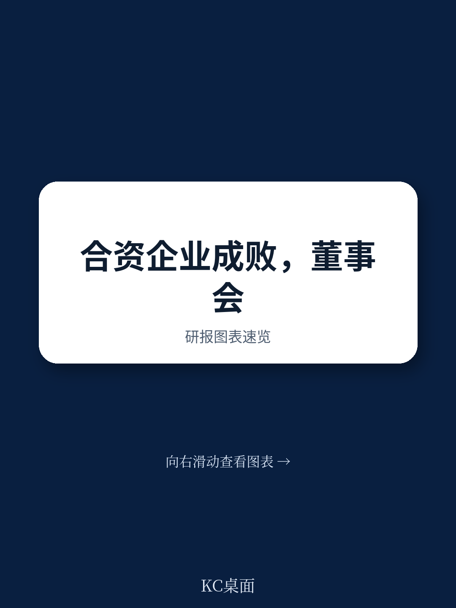
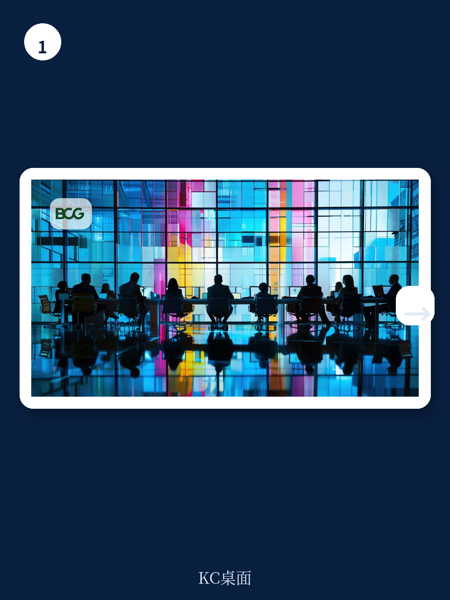
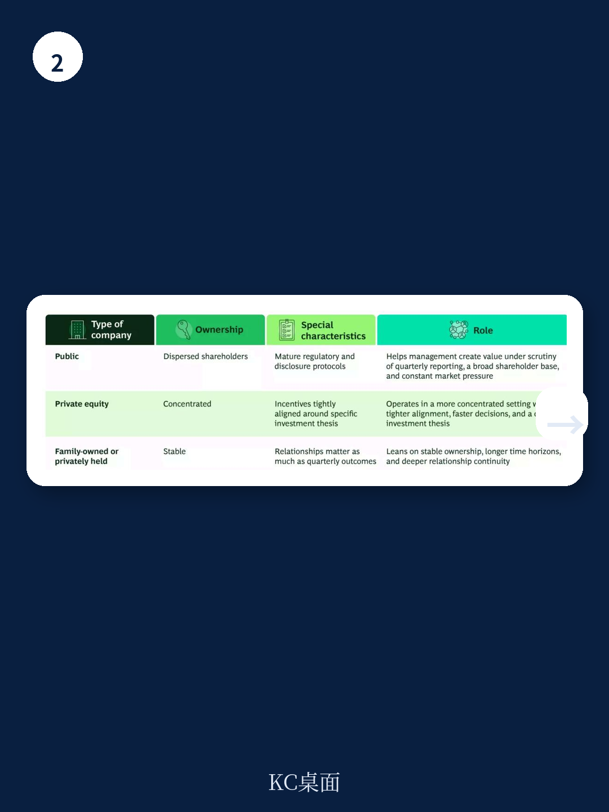

# 波士顿咨询：合资企业董事会治理决定成败

波士顿咨询一项跨行业调查显示，约三分之一的合资企业失败至少部分可归因于董事会未能维持清晰的决策权、规范的治理流程以及以合资企业利益而非母公司利益为优先的承诺。这一问题正随着更多企业将合资作为创造新价值的路径而愈发突出。该机构认为，治理失效已成为合资企业失败的第三大常见原因，其影响甚至超过商业计划本身的缺陷。

合资企业面临的治理挑战具有独特性。与上市公司、私募股权控股公司或家族企业不同，合资企业董事会处于更复杂的利益格局中：不同母公司拥有重叠但不完全一致的目标，运营、财务和人才纽带将所有者与合资企业紧密相连。波士顿咨询指出，许多合资企业董事会的运作重心更多放在限制和管理节奏变化不确定性上，而非创造价值。对于被任命的董事和CEO而言，任务因缺乏财务激励、角色定义模糊以及难以在利益竞争的母公司之间达成共识而变得复杂。

## 1. 所有权结构决定董事会治理的五个维度

波士顿咨询认为，所有权结构通过五个维度影响董事会任务：所有者是谁、他们想要什么、决策速度、耐心程度以及与公司的互动方式。合资企业董事会处于更复杂的方程式中。与上市公司受季度报告和广泛股东基础的不确定性不同，合资企业的成功不仅关乎盈利，还包括能力建设、市场准入和成本降低等目标。这些不同维度和复杂性表明，合资企业的价值创造需要在其自身框架内理解。

该机构特别指出，当母公司向合资企业提供技术、人员、资本或其他持续贡献时，治理难度进一步上升。这些接口对释放合资企业的全部价值创造潜力至关重要，但若无人刻意管理，也可能产生影响和价值流失。在某些情况下，一家母公司向合资企业提供的服务价值超过了其从合资企业利润中获得的份额，这造成了大多数合资企业董事会并未设计应对的利益冲突。

## 2. 上市公司治理的三个可迁移经验

波士顿咨询从上市公司治理中提炼出三条适用于合资企业董事会的经验。第一，一致的战略叙事。上市公司董事会深知，如果管理层无法解释公司方向，市场会填补这一真空。合资企业董事会和CEO同样需要能够向母公司传达清晰的价值创造主张。第二，董事会纪律。上市公司董事会必须结构化议程、设定年度日历并预先安排关键决策。许多合资企业董事会将议程、信息流和决策制定的结构责任转移给CEO，而许多合资企业CEO是首次与董事会合作，弱董事会纪律并非意图问题，而是双方未能定义良好纪律的内涵。第三，领导力传承。上市公司董事会会随着战略演变审慎考虑CEO发展和适配性。更多合资企业董事会，尤其是那些监督借调管理团队的董事会，需要将CEO继任作为核心职责管理。

## 3. 私募股权模式中的决策速度与能力导向

私募股权控股公司提供了不同的治理模型。所有权更集中，董事会通常更小，所有者、董事和管理层之间对成功标准的认知高度一致。波士顿咨询以黑石集团为例指出，其董事会以能力导向的构成、纪律化的运营节奏、高确信度的战略、领导力对齐和早期干预为特征。当黑石收购一家公司时，董事会成员通常根据公司所需能力任命，董事会成为解决企业最高价值决策的论坛。

这一方法对合资企业董事会具有直接借鉴意义。当合资企业难以实现目标时，董事会需要能够专注于关键问题并受激励这样做的响应型董事。波士顿咨询同时指出，这一比较存在天然局限：私募股权董事会通常更灵活，因为所有权主张是统一的，而合资企业董事会必须等待足够的所有者对齐才能行动。速度本身不是成功的充分衡量标准，但它是重要因素。

## 4. 家族企业模式中的连续性、信任与长期视野

家族企业和私人控股公司展示了治理的另两项优势：连续性和信任关系。波士顿咨询指出，许多合资企业需要比一家或多家母公司最初预期的更长的孕育期才能达到全部潜力。理解这一点的董事会能够更好地抵抗两种常见陷阱：过早要求证据，或随着创始董事轮换、新董事缺乏合资企业启动背景而失去兴趣。

当信任存在时，董事会和CEO可以更早、更少防御性地处理困难问题。该机构强调，董事会不仅是决策机构，也是一个关系系统。董事通过在董事会之外建立关系、维护合资企业利益、不计较得失地妥协以及以可预测的方式行事来建立信任，从而创造韧性和价值。

> **KC评论：** 波士顿咨询的核心判断是，合资企业治理不能简单复制其他所有权结构的模板，而应理解每种结构创造的不同价值创造环境。对于企业战略和业务发展负责人，这意味着在合资企业设立阶段就应将董事会设计视为战略能力而非合规功能，其最终影响可能超过原始商业假设。

波士顿咨询建议，法律、战略和业务发展负责人作为合资企业的主要设计者，需要构建能够运作的董事会：拥有正确授权的董事、匹配企业复杂性的会议节奏、揭示和解决冲突的协议、奖励建设性参与的激励措施，以及对CEO和管理团队的务实支持。对于合资企业CEO而言，最重要的资产不是权威或专业能力，而是各方对其独立性的信任。
