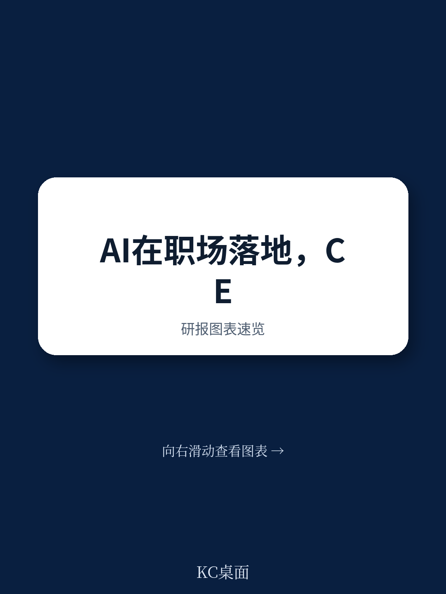
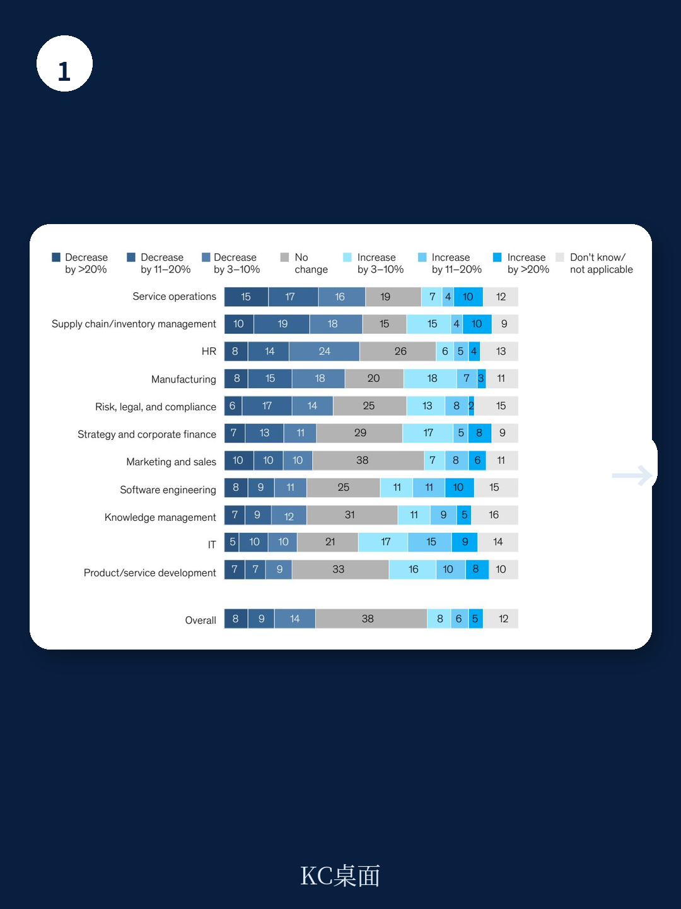
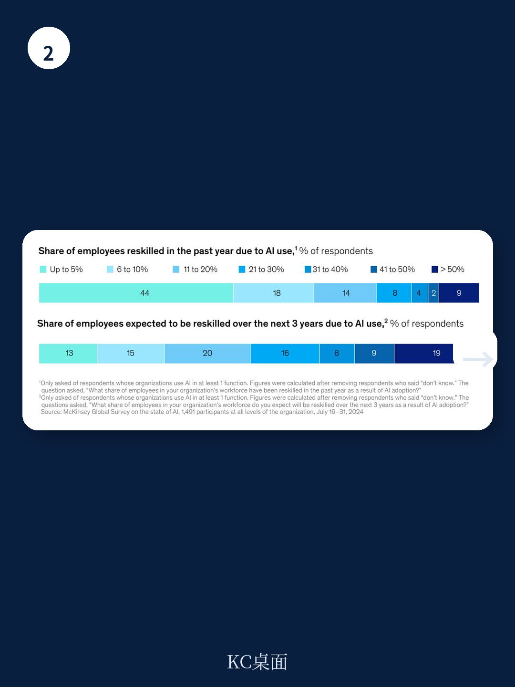

# 麦肯锡：AI技术与行业应用观察

麦肯锡2025年3月发布的全球AI调研显示，企业正在从实验性部署转向系统性组织变革。这份基于1491名受访者的调查发现，真正影响利润的并非技术本身，而是工作流程的重新设计、治理架构的升级以及不确定性管理的强化。超过四分之三的受访者表示其组织已在至少一个业务职能中使用AI，但企业层面的利润影响仍不显著——超过80%的受访者称生成式AI尚未对企业级EBIT产生实质性影响。

## 1. 工作流程重新设计是影响利润的最强因素

在麦肯锡测试的25个组织属性中，工作流程的重新设计对生成式AI的EBIT影响最大。21%的受访者表示其组织已因部署生成式AI而从根本上重新设计了至少部分工作流程。这一发现表明，技术部署本身并不创造价值，价值来自企业如何围绕AI重构运营方式。

> **KC评论：** 报告通过回归分析确认了工作流程重新设计的权重最高，这提醒读者：AI项目的成败更多取决于组织变革管理，而非模型性能。许多企业将AI部署委托给IT或数字化部门，但麦肯锡合伙人指出，这往往导致失败。

## 2. CEO直接参与AI治理与更高利润回报相关

调查显示，CEO对AI治理的监督是与企业自报的生成式AI利润影响最相关的要素之一。28%的受访者表示其CEO负责AI治理，17%表示由董事会监督。在大型企业中，CEO监督对EBIT的影响最为显著。麦肯锡合伙人Alexander Sukharevsky在评论中指出，有效的AI实施需要完全投入的高管团队，因为AI带来的转型需要跨部门协调、资源调配和持续的战略决策。

## 3. 大型企业在不确定性管理和最佳实践方面领先

受访者报告，与2024年初相比，更多组织正在积极管理不准确性、网络安全和知识产权侵权等不确定性。大型企业（年收入5亿美元以上）在不确定性缓解方面明显领先，尤其在网络安全和隐私不确定性领域。在采用和规模化实践方面，大型企业建立明确路线图的可能性是小企业的两倍以上，设立专门团队的可能性也更高。然而，整体来看，不到三分之一的受访者表示其组织正在遵循大多数最佳实践，不到五分之一表示正在跟踪生成式AI解决方案的KPI。

## 4. 生成式AI在业务单元层面已显现收入和成本效应

调查显示，在部署生成式AI的业务职能中，多数受访者报告了收入增长和成本下降。与2024年初相比，更多受访者在市场营销与销售、产品与服务开发、服务运营等职能中看到了成本削减效果。然而，这些业务单元层面的改善尚未转化为企业层面的利润变化。麦肯锡高级研究员Michael Chui指出，这仍是早期阶段——企业正在学习如何将技术能力转化为组织能力，而大型企业在这方面走得更快。

这份调研的核心信号是：AI的价值创造正在从“是否使用”转向“如何组织”。那些开始重构工作流程、让CEO直接参与治理、系统化管理不确定性并建立规模化路线图的企业，正在积累难以被追赶的竞争优势。
