BCG

Executive Perspectives

## The Future of Field Service with Applied AI

Field Service Operations

June 2026

## Introduction

We meet often with CEOs to discuss AI—a topic that is both captivating and rapidly changing. After working with over 1,000 clients in the past year, we are sharing our most recent insights in a series designed to help CEOs navigate AI. With AI at an inflection point, the focus in 2026 is on turning AI’s potential into transformative impact through applied AI, with agents at the center.

In this edition, we discuss the future of field service and the role AI can play in turbocharging growth, productivity, and new business models. We address key questions on the minds of field service leaders:

\- What should my team look like? Will I need a different team or can I upskill my team?

• How has AI been evolving, and what role can AI agents play in field service?

\- How will the economics of field service change, and what’s the ROI on AI tools?

• How should the customer experience evolve as a result?

\- Which tools are best suited to my goals, how do I get started—and how do I get this right?

This document is a guide for CEOs and field service leaders to cut through the hype around AI and AI agents in field service and understand what creates value now and in the future.

In this BCG
Executive Perspective,
we articulate the vision
and value of the future
of field service with AI

Oil and gas

## Background | Field and aftermarket services

## Overview

The field and aftermarket service function consists of installation, repair, maintenance, and replacement services for high-value industrial equipment

Field and aftermarket services often require technicians with highly specialized skills, traditionally gained through experience

## Value chain

Service sales funnel

Service operations management

## A field service function has four parts of its value chain with various activities

Customer relationships

In-field repair and maintenance

## Key activities within key steps

\- Sales reps help generate and convert leads to repair, maintain, replace, and install high-value equipment, as well as help develop and negotiate contracts and pricing with potential and existing customers

\- Operations managers oversee the operations of a field service business and are responsible for ensuring smooth operations by monitoring

• Operations managers are also responsible for maintaining the financial health of field service units

• Service technicians perform diagnostics, repairs, maintenance, and installation services at customer facilities

• Service technicians are responsible for maintaining institutional technical knowledge and training newer employees

\- Customers reach out to solicit services from FSPs (field service and aftermarket providers)

• Sales reps engage with customers to ensure high-quality service is delivered

## Field and aftermarket asset examples

Building services

3M+ HVAC units replaced in US annually

5,800+ aircraft in US commercial fleet

## Offroad heavy equipment

318,000 construction units sold in North America in 2022

19M barrels per day in US refining capacity

70,000+ wind turbines and 5,000+ solar farms in US

  
Tech and telecom

5,000+ data centers and 140,000+ cell towers in US

11,000+ MRI systems in US

40,000+ F&B processing plants in US

Note: F&B = Food & Beverage

## Executive summary | Transforming to an Applied AI-enabled field service organization

The time to act on applied AI and AI agents in field service is now

Field service functions are facing global challenges such as technician shortages (costing the trucking industry alone \$2.4 billion annually) and unplanned asset downtime (costing industrial manufacturers as much as \$50 billion annually)

There is an opportunity to drive 15%+ revenue impact and 5pp+ gross margin impact through applied AI and AI agents in field service

This is because field service as a function is rapidly approaching an inflection point, with emerging technology trends and developments delivering transformative impact, including:

\- Connected equipment, which is becoming a new standard, as machinery data and analytics unlock value in operations

\- GenAI technician copilots, which are unleashing productivity and creating knowledge bases across technology generations

• AI agents, which are reshaping ecosystems for service execution and communication

These technology trends are enabling a step change from traditional field service to streamlined, expedited, and augmented offerings, increasing the value potential of the rapidly growing field service function

## Applied AI and AI agents can reshape field service teams

Sales (service lead generation): 30%-40% more leads from connected assets, AI-based monitoring, and proactive targeting using AI agents

Operations (productivity gain): Coupled with continuous operations improvements, AI drives a 20%-30% lift in productivity via smart dispatching and scheduling and in-field support tools (e.g., troubleshooting copilot)

New revenue streams: OEMs further develop offerings, including premium service contracts and outcomes as a service

Technician workforce: Institutional technical knowledge is maintained and easily shared, accelerating the training of junior mechanics

## Executing successfully requires a transformational mindset

To successfully deploy AI and AI agents in field services and drive outcomes at scale, organizations need to have a portfolio and transformational mindset; to combine GenAI, predictive AI, and AI agents within the technology stack to enable team members; and to rewire the operating model to focus 90% on people and process change

Field service leaders play a critical role in driving this change by sharing best practices, breaking down siloes between teams, and making bold investments in technology and upskilling

To get started, define your objectives and North Star, prioritize use cases, start with PoCs that demonstrate value, and scale up successive waves of capabilities while enabling the field service team

## Field service functions are fraught with pain points

## Service sales funnel

## Sales rep

Reactive selling limits
growth opportunities by
failing to anticipate
customer needs

Static pricing models and lack of customized services leave value on the table

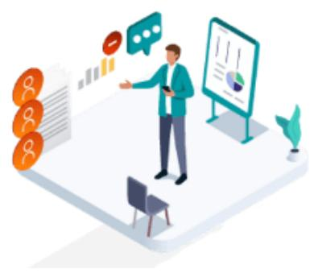

## Service operations management

## Operations manager

Limited visibility into team productivity, effectiveness limits standard work implementation

High turnover leads to loss of critical expertise

Underutilization of IoT and connected data hampers operational efficiency

Note: IoT = Internet of Things.

## In-field repair and maintenance

## Service technician

Delays from unavailable parts and inefficient routing waste valuable time

Lengthy diagnostics and insufficient onsite support reduce technician effectiveness

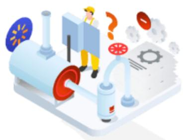

## Customer relationship

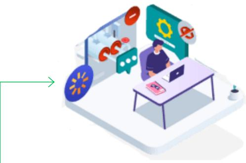

## Customer

Reactive service leads to prolonged machine downtime and higher costs

Limited transparency into service progress frustrates customers and extends repair timelines

## Pain points continue to intensify due to a shortage of technician talent

## Example industries with a persisting, constrained supply of technicians

## Building services (HVAC)

Aviation

## 15%

Greentech (wind power)

Growth in HVAC US technician demand, outstripping 6% growth

## 10%

Shortage of certified mechanics in 2025 (2036 gap only narrows to 7%)

## 124,000

Worker shortfall in wind energy sector projected for 2030

## Health care equipment

## 7,300

Biomedical technician openings added per year; only 400 graduates to fill them

## 40 years

Average technician age, implying high retirement age

## 54 years

Average aviation mechanic age in the US

## 42 years

Average age of wind-turbine technician in the US

## 45 years

Average age of biomedical technician, implying high retirement age

Beyond raw shortages, companies face an accelerating brain drain: Retiring technicians carry decades of tribal knowledge, while incoming junior technicians require rapid retraining, compounding the challenge

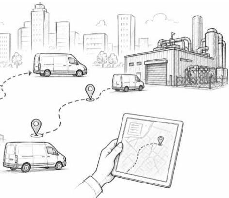

## Successful companies overcome pain points through a set of AI solutions...

## Service sales funnel

## Hub performance, lead generation, and advanced pricing

AI agents identify opportunities and initiate actions (e.g., automatically generating work orders and conducting initial analytics) to triage and price opportunities; agents assign work orders to robots and humans

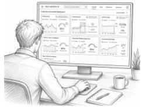

## Service operations management

## Real-time schedule rebalancing

AI agent rebalances schedules in real time based on routine tasks and emergencies, skill, capacity, and demand, autonomously adjusting assignments

Optimize schedules on the fly to manage robot and human dispatching

Part inventory and management
AI agents sense demand and autonomously replenish and allocate parts across the network

## Customer experience and support

Customer portal enabled by AI agents to provide equipment insights, coordinate maintenance, and, in some cases, to make remote fixes

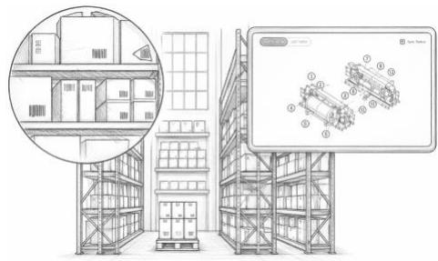  
Note: These solutions are examples and do not all have to be employed to see value. AR = augmented reality.

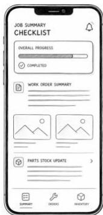

Illustrative

## In-field repair and maintenance

## Robot conducts initial imaging

Initial Imaging
Robot technicians (including drones) conducts onsite analysis (e.g., via thermal imaging) to better prep technician with right parts and context

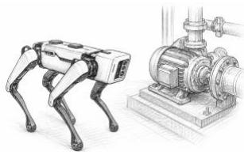

## Technician completes first-time fix

Human technician with right qualifications arrives with right parts and context; receives remote guidance (enhanced by AR) to complete a first-time fix

Automatic job
summary
dramatically
reduces manual
data entry

Enhanced tools drive efficiency

## ...which impact their org but enable focus on highly complex activities

## Current Future Future-state focus

<table><tr><td>Persona</td><td>Key activities (examples)</td><td>Current</td><td>Future</td></tr><tr><td rowspan="4">Operations manager</td><td>Scheduling technicians and matching with appropriate jobs</td><td rowspan="17" colspan="2">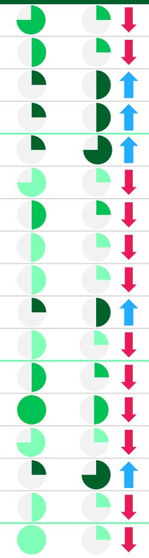</td></tr><tr><td>Inventory management and procurement (including parts stocking)</td></tr><tr><td>Customer relationship and consultative activities</td></tr><tr><td>Monitoring operational and financial health</td></tr><tr><td rowspan="7">Technician</td><td>“Wrench time” (repair, maintenance, and replacement activities)</td></tr><tr><td>Commuting between job sites and headquarters</td></tr><tr><td>Troubleshooting and identifying root cause of malfunctions</td></tr><tr><td>Looking up repair literature and identifying necessary parts</td></tr><tr><td>Recording field notes and documenting job performed</td></tr><tr><td>Customer relationship management and onsite sales</td></tr><tr><td>Training and assisting new technicians and apprentices</td></tr><tr><td rowspan="5">Back-office staff (including sales reps)</td><td>Creating proposals for quotes</td></tr><tr><td>Developing, pursuing, and converting leads</td></tr><tr><td>Administrative activities (e.g., invoicing and billing)</td></tr><tr><td>Customer relationship management</td></tr><tr><td>Warranty claims and registration</td></tr><tr><td>Customers</td><td>Waiting for assets to be repaired (downtime)</td></tr></table>

Time spent performing activity

Low complexity

Moderate complexity

High complexity

Time spent on nonrevenue-generating activity is repurposed, allowing managers to increase focus on operational and financial health of business

Reduced time spent commuting, preparing for jobs, and other nonrevenue-generating activities; that time is repurposed to allow technicians to increase “wrench time,” leading to more jobs completed and, in turn, increased revenue

Sales reps and back-office staff improve efficiency, reducing total amount of labor required to perform same volume of tasks and, in turn, decreasing operational costs while allowing sales reps to provide a superior customer experience

Superior customer experience

Increase in time spent

Decrease in time spent

## Long-term impacts

## \~20%-50%

Increase in
management spans $^{1}$

## 1.5x-2x

Boost in productivity
of technician
workforces

## \~30%-50%

Increase in
management spans of
back-office teams $^{1}$

## As a result, successful companies see significant value

## Revenue and profitability unlocked in parallel to improve efficiency in future state

Illustrative example: HVAC field service technician Joe doubled his profit index by leveraging the various digital tools implemented at his field service company

Commercial growth

Elevated service

## 15%+

Revenue growth

## 20pp+

On-time maintenance
completion uplift

## 5pp+

Service gross margin uplift

## 15%+

Average Job duration decrease

## 1.0x profit index

Examples of AI changes

Parts look-up platform helps technicians identify components for jobs quickly

## 1.8x profit index

Automated warranty software assists with warranty activities and registration

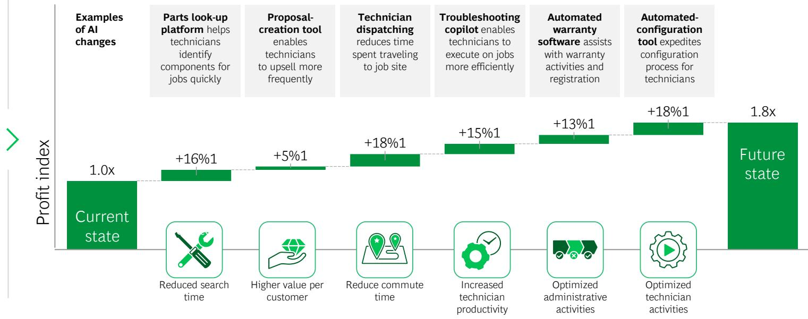

Automated-configuration tool expedites configuration process for technicians

Higher value per customer

Reduce commute time

Increased technician productivity

## Key insights

## Every company starts somewhere:

Tailor your approach to your current technology stack and organization readiness; generic blueprints do not work

## Recognize long-term teaming

impacts: Anticipate how team composition shifts as AI matures, and drive adoption through change management

## Get to value fast and scale

smartly: Identify high-ROI use cases first and build a roadmap that proves value before full deployment

## The adoption of AI is accelerating, especially with the advent of AI agents

## AI adoption is accelerating...

Millions of field workers vital to the global economy will quit by 2030: here's how AI can solve that problem. - TechRadar, July 2025

AI-Powered Dispatching Gains
Momentum as Field Service Companies
Seek Operational Efficiency
- Analytics Insight, March 2026

iOPEX Unveils 'FieldPilot', Bringing Agentic AI to Field Engineering Services - Business Wire, March 2026

Miele Deploys IFS.ai Globally to Transform Field Service Management Across 25+ Countries
- PR Newswire, February 2026

## ...and heading to the next frontier: AI agents

FRONTAL CORTEX
ABDUCTIVE REASONING

Observes, plans, and acts autonomously
Leverages both predictive and GenAI

AI agents

## LEFT BRAIN DEDUCTIVE REASONING

Focuses on
structured tasks

Solutions are highly explainable

## Predictive AI

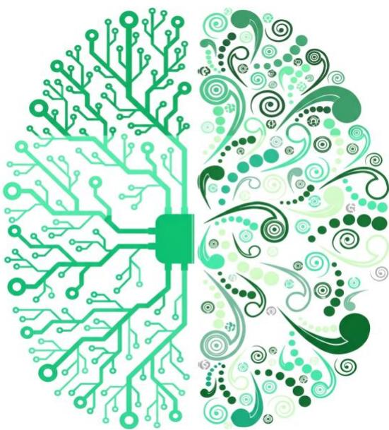

## RIGHT BRAIN INDUCTIVE REASONING

Tackles unstructured problems
Focuses on creative,
imaginative, associative, and
open-minded solutions

GenAI

Note: GenAI = generative AI.

Accepts
result

## AI agents have enabled more effective workflow execution

## Agentic AI

## Predictive AI

## AI first (2026)

Predictive AI,
GenAI, and AI
agents more
effectively execute
workflows, which
are being reshaped
around AI
capabilities;
humans supervise
operations and
safeguard quality
of outcomes

## Agent led

Agent acts without any explicit human oversight

## Agent orchestrated

User observes outputs and can intervene if issues flagged

## Agent enabled

Agent executes and explicitly requires human approval

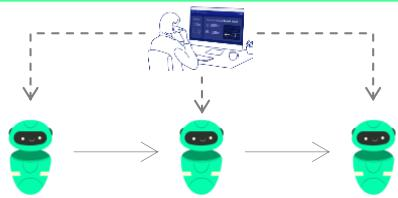

  
Sets goal

## GenAI accelerated (2023)

Users drive progress, with AI dramatically boosting efficiency along traditional processes

## Human led, using predictive AI tools (2020 and prior)

Users run operations using digital and predictive AI tools that provide insights and forecasts, with limited changes to the operating model

## Examples in field service AI

\- Detects, diagnoses, and dispatches without human intervention

\- Triggers remote fixes independently

\- Dynamically schedules and reroutes technicians in real time

\- Proactively flags potential asset performance issues and recommends interventions

\- Generates work orders from detected issues, when instructed

\- Recommends troubleshooting steps and required parts

• Drafts service reports and customer updates

\- Summarizes past incidents to support troubleshooting

• Queries asset history and manuals via chatbot

• Forecasts parts demand and inventory

\- Predicts potential asset failures using sensor data and historical trends

\- Generates manual reports and documentation

## Agents also have expanded the decision space that they can operate in

## AI agents are removing the constraints that traditional AI and tools could not overcome

Field service decision space  
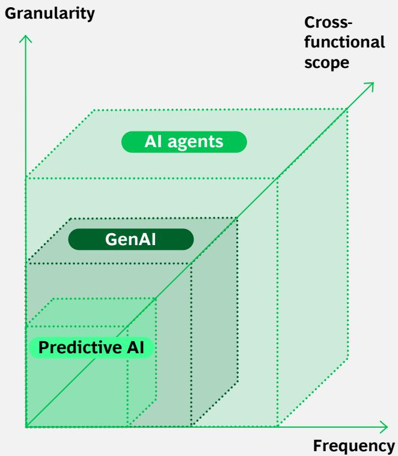

## 1 Frequency

From periodic planning to continuous, event-driven decisions (e.g., asset alerts and delays)

## Granularity

From aggregated planning to highly granular decisions at the asset, work order, technician, and part level

## 2 Cross-functional scope

5 From siloed decisions to simultaneous optimization across dispatching, parts, technician support, pricing, and customer communications

## What this means for field service companies in practice

Instead of reacting to breakdowns and customer calls...
Agents proactively detect issues from asset data and automatically trigger outreach and work orders

Instead of manually scheduling and dispatching technicians...
Agents dynamically optimize schedules in real time based on skills, locations, parts, and urgency

Instead of technicians troubleshooting alone onsite...
Agents provide real-time diagnostic guidance and step-by-step copilots to resolve issues faster

Instead of fragmented data across service, scales, and operations...
Agents unify data into a single view and orchestrate actions across functions

Instead of firefighting parts shortages and inventory issues...
Agents predict demand and autonomously replenish and allocate parts across the network

## Future of field service ... is therefore becoming an industry where...

<table><tr><td rowspan="2">Intelligent lead generation</td><td>AI-powered service sales leads and execution</td><td>AI agents proactively identify and act on new service opportunities, leveraging machine data, CRM, and public records to trigger outreach and service workflows for high-value repairs and service contracts</td></tr><tr><td>AI-based parts- and service-demand planning and pricing</td><td>Parts inventory, service capacity, and pricing are continuously optimized by AI agents using demand signals, installed-base analysis, elasticity patterns, and predictive forecasting to improve availability and margin</td></tr><tr><td rowspan="3">Increased productivity</td><td>Full network visibility and continuous service operations improvement</td><td>Real-time control towers provide end-to-end visibility across operations and KPIs, including PM on-time rate, issue-resolution rate, technician performance, and order-to-cash time, enabling continuous improvement</td></tr><tr><td>The next generation of field service technicians</td><td>Service technicians are turbocharged with GenAI copilots and AR/VR technology for faster and higher-quality execution; technologies ensure retention of institutional knowledge, despite high turnover</td></tr><tr><td>Revolutionized and streamlined scheduling and dispatching</td><td>AI agents generate and deploy optimal service schedules based on technician skills, customer needs, routing considerations, and part availability, maximizing productivity and minimizing wasted time</td></tr><tr><td rowspan="2">New revenue streams</td><td>Value-added revenue streams</td><td>In addition to selling equipment, companies can provide solutions, services, and even outcomes (e.g., increased uptime), all enabled and de-risked through AI and AI agent technologies</td></tr><tr><td>Best-in-class customer support and transparency</td><td>Applied AI and AI agents enable increased customer service productivity, personalization, first-time resolution rates, customer and employee satisfaction, and reduced training effort and cost</td></tr></table>

## Reshaping and evolving field service creates opportunity to introduce new business models and create additional revenue streams

## BCG is helping companies move toward the future state and unlock value through AI and AI agent solutions across the field service life cycle

## Hub performance

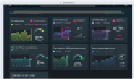

## Daily management board (DMB)

Operational insights for real-time management; +14% number of work orders per hour

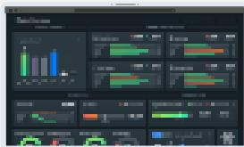

Sales performance decision engine
Analytics for sales performance tracking; +16% revenue growth

## Asset reliability and performance

## Predictive maintenance and asset health

Advanced insights for asset health and longevity; -20% maintenance cost for customers

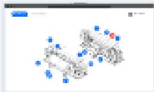

## AI and advanced pricing

Dynamic pricing strategies based on AI algorithm; +8% contribution margin with no impact on market share

## Parts inventory and management Demand forecasting and inventory optimization; -4% carrying cost

## GenAI technician copilots

Real-time tracking (including knowledge graph), AI anomaly alerts, and copilot; 10%-20% reduction in shortfalls and 1%-2% reduction in opex

## Technician productivity

## Control room copilot

Real-time AI expert troubleshooting assistance; +5%-10% daily technician productivity

Technician remote guidance, AR and XR tool, and digitized parts and manuals; 40% less rework and errors

## Remote support and collaboration

## Customer experience and support

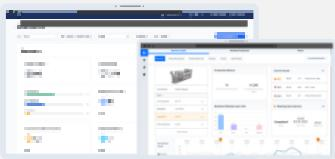

## Self-service customer portal

Maintenance summary, asset health tracking, and proactive alerts; +20% measured customer satisfaction

## AI support agent

Voice agent that resolves up to 80% of queries without human support

  
Labor visibility, scheduling and optimization, and technician GPS productivity; -24% mileage cost

## Scheduling

## Scheduling and dispatching

## Decision copilot

Conversational interface, supported by predictive analytics, across operations, assets, and planning to accelerate decision making

## Example 1 | A DMB sets the rhythm, and AI drives continuous improvement, aligning leadership and team performance through metrics

## High impact at manufacturing and distribution company

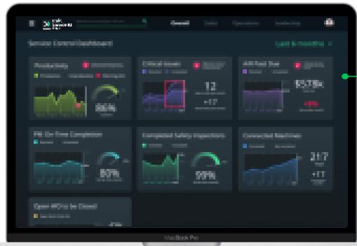

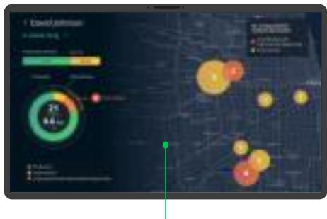  
Advanced analytics and machine learning enhance field technicians' productivity

## Integrated control tower displays key business KPIs

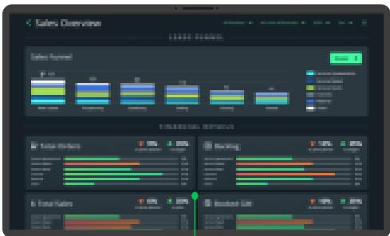  
Comprehensive KPI view drives sales performance across regions and markets

## +16%

Revenue growth through more proactive leads tracking and movement through the funnel

## +7pp

Services gross margin through continuous improvement cost reduction

## +20pp

Increase in PM on-time completion through technician tracking and enablement

## Four key elements for an effective solution

Real-time visibility

Cascading metrics

Operating rhythm

Tie to action

Unified view of metrics enables
effective management of the business

Cascading aligns leadership and field team performance

Daily or weekly rhythm enables continuous improvement

Improved decision making through clear, actionable recommendations

## Example 2 | A farm decision copilot unifies data and leverages analytics to drive faster, smarter farm choices

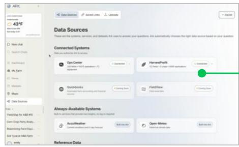

## Unified data and insights across internal and external sources

## Conversational interface for farmers to receive structured, actionable insights

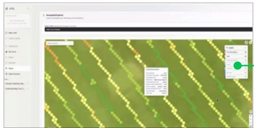

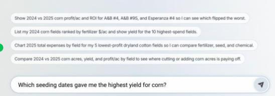

Show 2024 vs 2025 corn profit/ac and ROI for A&B #4, A&B #9S, and Esperanza #4 so I can see which flipped the worst.
List my 2024 corn fields ranked by fertilizer \$/ac and show yield for the 10 highest-spend fields.
Chart 2025 total expenses by field for my 5 lowest-profit dryland cotton fields so I can compare fertilizer, seed, and chemical.
Compare 2024 vs 2025 corn acres, yield, and profit/ac by field to see where cutting or adding corn acres is paying off.

View of field-level performance to identify optimization opportunities

## High impact for farming operations

## \$90-\$224

Savings per acre

Faster decision making
Reduces time spent gathering and analyzing data across fragmented tools

Improved insight generation
Surfaces relevant signals across operational, financial, and external data

Reduced complexity
Eliminates need to navigate multiple systems and manually reconcile data

## Five key elements for an effective solution

## Unified data layer

Conversational interface

Contextual intelligence

Actionable recommendations

Multiagent orchestration

Brings together operational, financial, and external data

Enables user to explore and analyze data via natural language

Analyzes and benchmarks data to surface meaningful insights

Delivers insights directly within existing workflows

Coordinates domain AI agents (e.g., regulatory, fertility, and planting)

## Example 3 | AI can be coupled with cutting-edge hardware, such as XR, to drive impact in field service

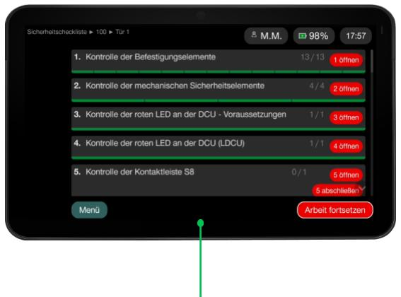  
Integrated cockpit provides real-time visibility and operational control

AI-powered application enables hands-free, on-the-job support

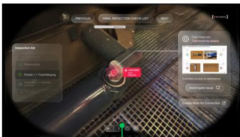  
Guided workflows improve execution quality

## High impact in maintenance and operations

-40%

Less errors and rework

+25%

Faster maintenance execution

## \$200M

Savings potential in maintenance

## Four key elements for an effective XR solution

Application

Cockpit

Data platform

Change management

AI-powered XR devices for hands-free, on-the-go support

Real-time insights and control over shop floor operations

Structured data enabling scalability and additional digital solutions

Continuous communication, training, and integrations

## A cluster of use cases can be applied in tandem to fleets of vehicles

## Future-state application of AI to fleets includes system of agents designed to capture moments that matter for customers

## Data agent

Unify and interpret data across systems to create a single source of truth

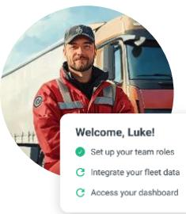

## Maintenance agent

Detect issues early and trigger the right actions to keep vehicles on the road

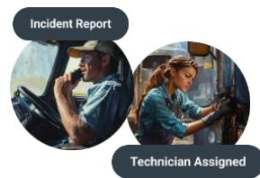

## Life cycle agent

Predict asset lifespan and recommend replacement and investment decisions

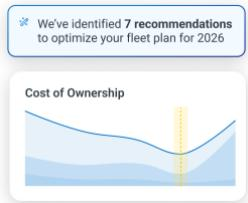

## Monitoring agent

Continuously
track fleet
status and
recommend
actions

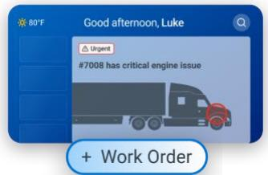

Performance agent
Identify opportunities to improve
operations

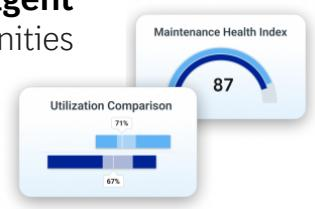

## Insights agent

Generate insights and quantify impact of decisions

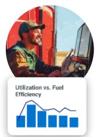

## Six core capabilities are enabled by coordinated agents

<table><tr><td></td><td></td><td>Predictive maintenance</td><td>Detect potential breakdown and recommended proactive repair</td></tr><tr><td></td><td></td><td>Life cycle planning</td><td>Optimize asset lifespan and capital allocation</td></tr><tr><td></td><td></td><td>Work order management</td><td>Manage work order processes from issue detection to resolution</td></tr><tr><td></td><td></td><td>Regulatory compliance</td><td>Ensure documentation and compliance actions are up to date</td></tr><tr><td></td><td></td><td>Cost optimization</td><td>Improve TCO tracking and cost-saving recommendations</td></tr><tr><td></td><td></td><td>Integrated network</td><td>Connect with vendors to execute maintenance efficiently</td></tr></table>

AI and AI agents enable proactive management to maximize equipment uptime and minimize TCO

## To win with applied AI and AI agents in field service, companies should pursue three actions

## Rightsizing to drive outcomes

## Unlocking data and technology

Deploy task-based AI and AI agent workflows to reshape field service teams and invent new business models

Be purposeful in how technology is leveraged as part of an ecosystem to be successful

## Rewiring the operating model

Transforming roles,
capabilities, and the
operating model to enable
human-agent collaboration

\- Lead with a bold vision for the future of field service management; rightsize solutions for identified problems and pain points

\- Redesign workflows around agents, embedding decision making into dispatching, diagnostics, and resolution

\- Coordinate across service, operations, and support to enable end-to-end, agent-orchestrated journeys

\- Pair GenAI with other technology for maximum impact; orchestrate via agents

\- Focus AI agent implementation where it matters most; prioritize high-impact, high-frequency decisions constrained by analytical capacity

\- Accelerate scalable solutions by developing the target-state architecture that enables agent reuse and interoperability

\- Redefine technician and dispatcher roles to work alongside agents (e.g., copilots and autonomous workflows)

\- Establish an AI-driven operating model by defining new skills and adapting workflows for AI-driven field service management

\- Build an AI-driven field service operation, emphasizing experiments and scaling through build-operate-transfer approaches to ensure rapid learning

## Unlocking data and tech | Key technology success factors for integrating applied AI and AI agents into field service

## Combine GenAI, predictive AI, and AI agents for maximum impact

Even with the onset of AI agents, GenAI, predictive AI, and digital applications have a critical role in the ecosystem:

\- GenAI synthesizes large data sets and generates content (e.g., text creation)

\- Predictive AI focuses on decision making (e.g., predictive maintenance)

• Digital drives end-user adoption and utilization of AI functionality

• AI agents orchestrate workflows and decisions across systems

## Don't wait for perfection to get started

Getting started with AI and AI agent development does not require perfection; in fact, waiting for ideal conditions delays progress and value creation:

• AI development is iterative; early adoption enables continuous learning

\- Even with data and system gaps, AI can provide insights driving immediate value (agent use cases can start narrow and then scale rapidly)

\- Waiting for perfect conditions creates the risk of falling behind competitors

## Integrate applied AI and AI agents with existing systems

Seamless integration of applied AI and AI agents with existing systems is key:

\- Applied AI and AI agents should be designed to work with systems such as ERP, CRM, or databases, ensuring minimal disruption

• Such an approach accelerates adoption and realization of value without significant infrastructure changes

## Unlocking data and tech | A target-state ecosystem can be achieved by integrating capabilities or building, partnering, and buying new capabilities

## Target-state ecosystem

Smart business layer

AI-powered apps (including self-service and remote service tools)

AI layer

AI (predictive AI, GenAI) and AI agents

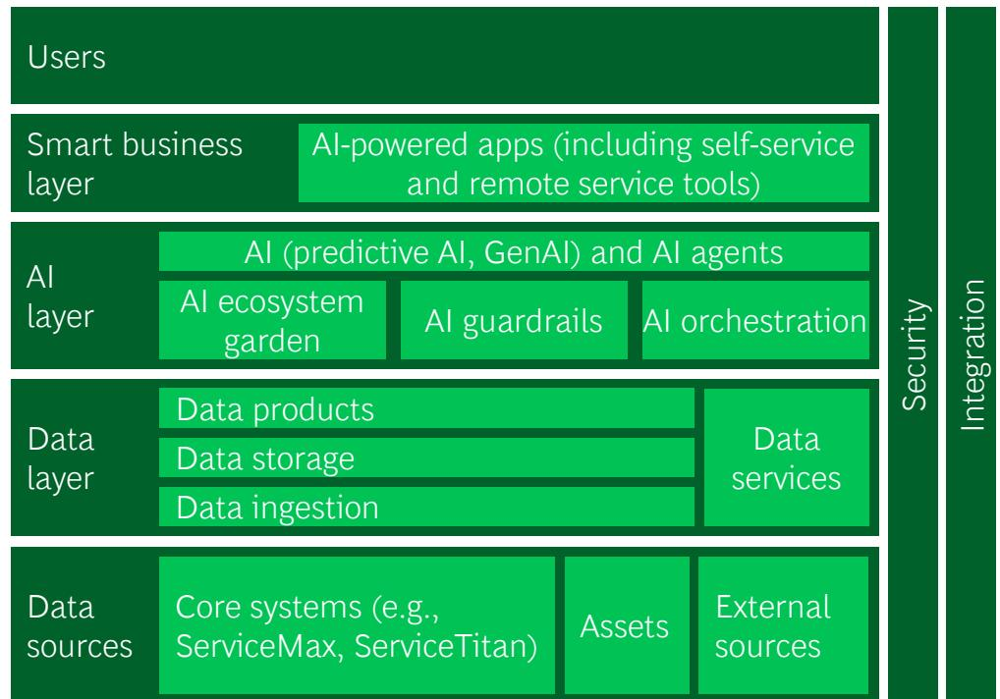

AI ecosystem garden

Al guardrails

AI orchestration

Data layer

Data products

Data storage

Data ingestion

Data services

Data sources

Core systems (e.g., ServiceMax, ServiceTitan)

Assets

External
sources

## Key criteria for building, buying, and partnering for new capabilities

## BUILD capabilities internally when:

• Problem is relatively complex and/or unique

\- Solution customization is a top priority

• Company has strong existing in-house development capabilities

• Development timeline is not a concern

\- Core agent orchestration logic is strategic and differentiated

## BUY capabilities externally when:

\$

\- Problem is well defined and common (e.g., prebuilt agent use cases)

\- Customization is not a concern

• Completion timeline is top priority

## PARTNER to develop capabilities when:

• Problem is relatively complex and/or unique

\- Customization is relatively important

• Company lacks full internal AI expertise to develop solutions

• Completion timeline is important

• Core agent orchestration logic is strategic and differentiated

## Examples of capabilities

that have been bought,
internally built, and
codeveloped with a partner

## Build automated field notes capability internally given medium complexity, long lead times, and available capacity

## Buy paperless work order solution given simplicity and need for low customization

## Codevelop a demand forecasting solution given need for customization and time sensitivity

## Unlocking data and tech | AI agents are best suited to unlocking value for complex problems that require dynamic reasoning

## GenAI-assisted decisions

• Network footprint and service territory design

\- Own vs. partner decisions for service delivery

\- Long-term workforce and capacity planning (skills, hiring, and outsourcing)

\- Service portfolio and SLA design (e.g., response times and coverage levels)

\- Contract strategy

## Highest AI agent value

• Dynamic dispatching and scheduling optimization

• Real-time rescheduling and disruption management (e.g., delays and cancellations)

• Job prioritization and triage

• Predictive maintenance triggering for specific assets

\- Remote diagnostics and resolution recommendations

\- Parts allocation and inventory positioning (van stock and local depots)

## Lower priority

\- Periodic service policy reviews (inspection frequency and maintenance plans)

\- Returns and handling policies

• Facility-level scheduling (e.g., depot operations planning)

\- Tooling and equipment allocation planning

## Predictive AI and automation

\- General work order creation and updating of nonasset-specific categories (e.g., closures)

\- Standard appointment confirmations notifications

\- Standard service reports and documentation generation

• Routine parts ordering and replenishment triggers

\- Technician timesheet and activity logging

Quarterly or annually

## DECISION FREQUENCY

Continuous

Each quadrant spans different levels of cross-functional scope; agents create the most value when scope, frequency, and granularity are all high

## Why use agents for these decisions

## Decision subjectivity Requires real-time judgment

across tradeoffs, customer criticality, and operational constraints that cannot be reduced to fixed rules

## Cross-system orchestration Spans platforms and customer systems; agents stitch together fragmented data and workflows

## Speed at scale

Agents continuously optimize schedules, routing, and resolutions in real time, which is far beyond human dispatching capacity

## Rewiring the operating model | An AI and AI agent transformation requires transitioning people and processes while developing data and technology

## Typical digital transformation

Compared with a typical data-driven transformation, the success of field service applied AI and AI agents relies even more on change management across the services organization

## 10%

AI and Algorithms

## 20%

Data and technology

## 70%

Business process
change management

## 70%

## Focus on service operations change management

\- Leadership activation: drive enthusiasm and clear vision for human-agent operating model

\- Service team engagement: codesign and iterate workflows with technicians and AI agents

\- Execution excellence: redefine processes and roles

• Culture and effectiveness: adapt service strategies and KPIs

\- Training and enablement: upskill teams to work alongside and trust agents

## 30%

## Building the AI agent technology stack

\- Deploy AI agents to the frontline

\- Utilize field service-specific ML models, predictive AI, GenAI, and AI agents

\- Integrate field and service systems and agents to enable autonomous workflows

## Rewiring the operating model | Implement the five pillars of field service change management to make applied AI and AI agents operational

## Leadership activation

• Empower leaders as adoption champions

\- Equip field service leaders with a clear vision for agent-enabled operations and tools

\- Foster engagement and excitement around applied AI and AI agents as collaborators

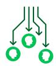

## Service team engagement

• Codevelop agent-enabled workflows with technicians for seamless integration

\- Use real-time feedback to refine agent behavior and make iterative improvements

• Build trust in AI-driven changes by transparently sharing progress and improvements in service outcomes

## Execution excellence

\- Align field service organization and roles with agent-augmented service models

• Establish clear ownership for development and implementation

\- Optimize workflows by embedding agents into processes (e.g., dispatching and diagnostics)

\- Ensure ethical and governed agent autonomy

## Culture and effectiveness

\- Deploy modern collaboration and communication tools to support human-agent interaction

\- Refine KPIs to reflect human-agent productivity gains

\- Introduce incentives to accelerate adoption

\- Apply user-level monitoring to track agent performance

## Training and enablement

\- Implement rapid training for field service teams

• Develop AI and AI agent champions to act as multipliers

\- Activate AI and AI agent leaders and champions in service teams via train-the-trainer initiatives

## To begin unlocking value in field service with applied AI and AI agents, three main steps are required

## Execute rapid diagnostics

## Conduct PoCs exercise

\- Rapidly identify pain points within the core service business

\- Prioritize field service AI modules across value potential and relevance and ROI and draft a roadmap for design, business case development, and feasibility testing

\- Design pilots and PoCs for relevant field service AI modules and identify implementation challenges

\- Reimagine the future with product strategy, vision, and scope; leverage these inputs to finalize a business case to drive initiatives

• Prove and test feasibility of solutions via digital and AI PoCs and transformation pilots

\- Complete roadmap for the build phase (which includes resourcing and governance)

## Build, pilot, and iterate

\- Iteratively build digital AI solutions and deploy in market to test and learn, while maximizing the near-term value captured

\- Enable core capabilities, such as user testing, technology enablers, and agile methodology

Julia
Dhar

## BCG experts | Key contacts for the future of field service with applied AI and AI agents

  
Decker
Walker

  
Andy Lin

  
Hunkar Toyoglu

  
Justin
Rodriguez

  
Tibor
Mérey

  
Martin Fink

  
Christopher
Spafford

  
Ben
Vermeer

Nico
Geisel

  
Sebastian Köcher

Ashkan
Afkhami

  
Tristan Mallet

  
Ramsey Baker

  
Rachel
Stanford

Michael Troisi

John Snipes

Guillaume
Coiraton

Ian
Stuart-Hoff

  
Laura
Juliano

  
Mike Quinn

Vivian Lee

Brian
Hirshman

Charles
Gildehaus

Marcus Wittig

  
Andrew
Beir

Aisha
Taylor

  
Dutch
MacDonald

Lacy
Ketzner

  
Mohammed
Omar

Dominik
Deradjat

  
Jeff
Ahlquist

Shashank Modi

Michael
Dahle

  
Mike
Dahlmeier

## BOG