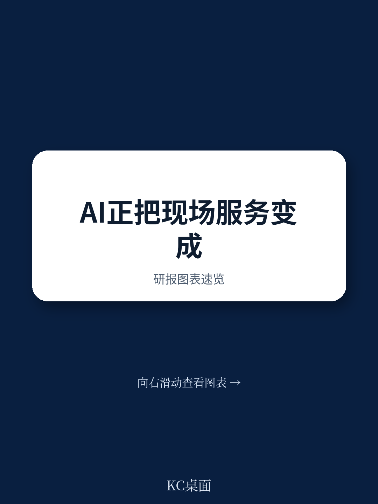
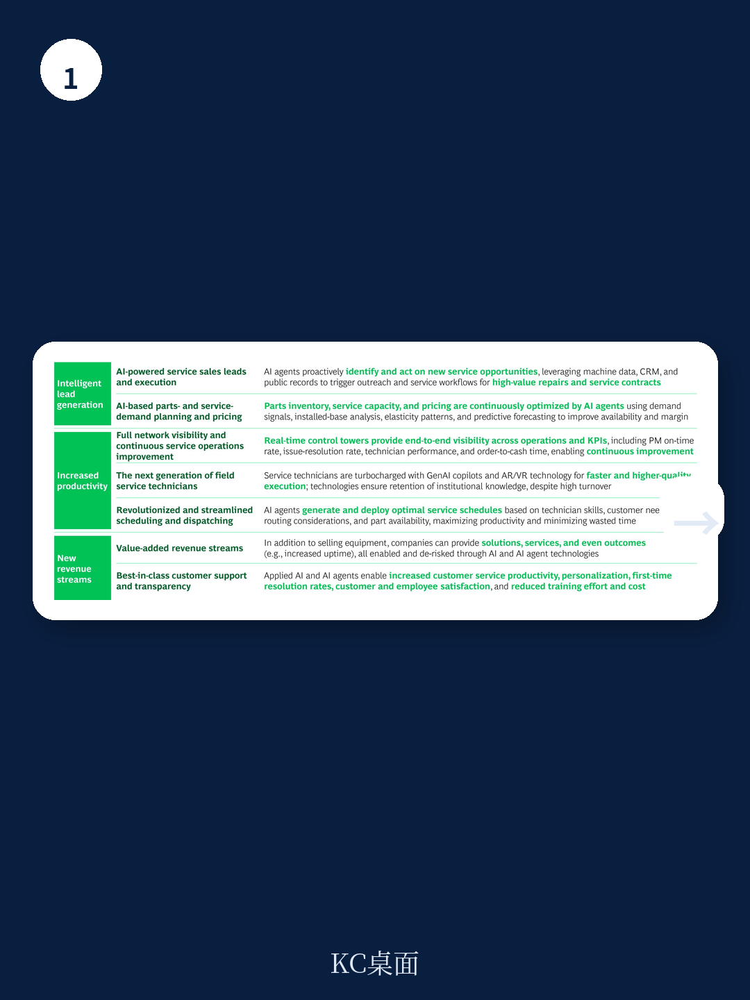
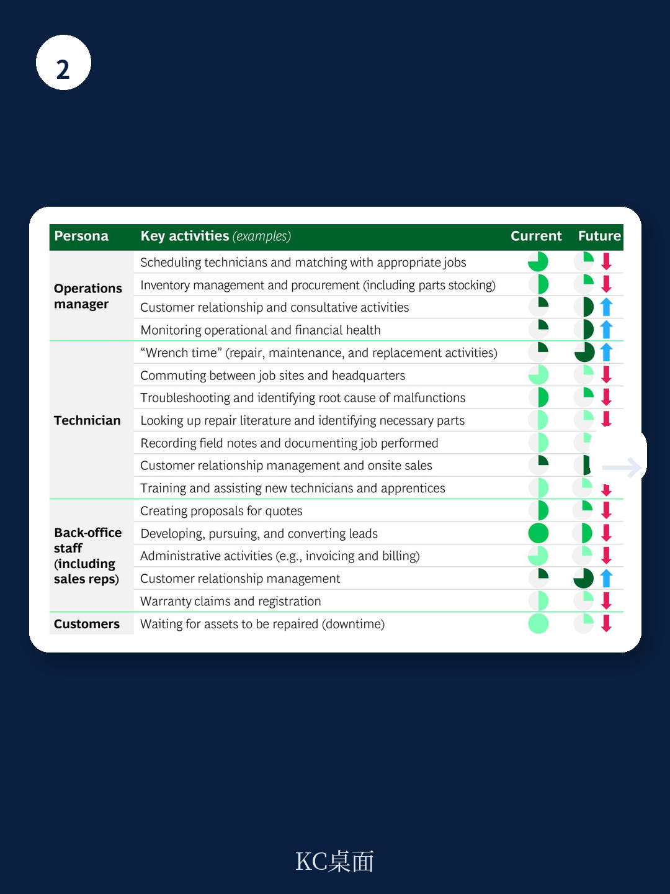

# 波士顿咨询：AI技术与行业应用观察

现场服务行业正面临一个结构性矛盾：设备资产规模持续增长，而能够维修这些设备的熟练技术人员却在加速流失。波士顿咨询在2026年6月发布的这份报告中指出，仅美国卡车运输业每年因技师短缺造成的损失就达24亿美元，工业制造商的非计划停机损失更高达每年500亿美元。报告认为，应用型AI和AI智能体能够在这一领域实现15%以上的收入增长和5个百分点以上的毛利率提升。

这一判断的核心依据在于，现场服务行业正同时经历三重技术变化：设备联网成为新标准、生成式AI助手开始释放生产力、AI智能体正在重塑服务执行和沟通的生态系统。报告基于与超过1000家客户的合作经验，提出了从传统现场服务向AI增强型服务转型的具体路径。

## 1. 技师短缺与知识断层构成双重约束

报告列举了多个行业的技师供给数据。美国暖通空调领域的技术人员需求增长15%，而供给增长仅为6%；航空维修领域2025年存在10%的技师缺口，预计到2036年这一缺口仅收窄至7%；风电行业到2030年面临12.4万人的工人缺口；生物医学设备领域每年新增7300个岗位，但仅有400名毕业生填补。

更值得关注的是年龄结构。美国航空维修技师的从业者平均年龄为54岁，风电技师平均42岁，生物医学技师平均45岁。报告指出，退休技师带走的不仅是劳动力，更是数十年积累的“部落知识”，而新入职的初级技师需要快速再培训。这意味着，即使企业愿意增加招聘，知识传递的效率瓶颈依然存在。

> **KC评论：** 报告用“部落知识”一词，点出了现场服务行业最容易被忽视的资产——老技师头脑中的经验判断。这些知识通常没有文档化，AI工具的价值之一，就是将这些隐性知识转化为可检索、可复用的系统知识库。

## 2. AI智能体覆盖服务价值链的四个环节

波士顿咨询将现场服务的价值链分为四个环节：服务销售漏斗、服务运营管理、现场维修与维护、客户关系。报告为每个环节设计了具体的AI应用场景。

在销售环节，AI智能体可以基于设备连接数据识别机会，自动生成工单并进行初步分析和定价。在运营管理环节，AI智能体能够实时重新平衡调度计划，根据常规任务和紧急任务、技能、容量和需求自主调整人员分配，同时管理零件库存的自动补货和分配。在现场维修环节，机器人技师（包括无人机）可以先行进行现场热成像分析，为人类技师准备正确的零件和背景信息，人类技师到达后即可完成首次修复。在客户关系环节，AI驱动的客户门户可以提供设备洞察、协调维护，甚至在某些情况下进行远程修复。

报告用一个HVAC技师的案例来量化这些变化：该技师通过使用零件查找平台、自动化保修软件和自动配置工具，其利润指数从1.0提升至1.8。整个企业层面，报告预计可实现15%以上的收入增长、20个百分点以上的按时维护完成率提升、5个百分点以上的服务毛利率提升，以及15%以上的平均工单时长下降。

## 3. 技术栈演进：从预测性AI到AI智能体

报告将AI在现场服务中的应用分为三个层次。预测性AI擅长结构化任务，解决方案高度可解释；生成式AI处理非结构化问题，侧重于创造性、联想性和开放式的解决方案；AI智能体则具备观察、规划和自主行动的能力，同时利用预测性AI和生成式AI。

报告认为，2026年是一个关键节点。AI智能体开始更有效地执行工作流程，工作流程本身也在围绕AI能力进行重塑，人类负责监督操作并保障结果质量。这一演进路径意味着，企业不需要一次性部署所有AI能力，而是可以根据自身技术栈和组织准备度，选择从哪个层次切入。

报告特别强调，成功部署AI需要组合式思维——将预测性AI、生成式AI和AI智能体整合在同一技术栈中，同时将90%的精力放在人员和流程变革上。具体而言，企业需要重新设计角色和职责、建立人机协作的流程、部署支持人机交互的协作工具、调整KPI以反映人机协同的生产力提升，并引入激励措施加速采用。

## 4. 起步路径：诊断、试点、迭代

报告为现场服务领导者提供了三个主要步骤。第一步是快速诊断，识别核心服务业务中的痛点，并优先排序现场服务AI模块的价值潜力、相关性和回报表现率。第二步是概念验证，设计相关模块的试点项目，识别实施挑战，重新构想未来的产品战略、愿景和范围，并最终确定商业案例。第三步是构建、试点和迭代，逐步构建数字化AI解决方案并在市场中测试学习，同时最大化近期捕获的价值。

报告提醒，每个公司的起点不同，通用蓝图并不适用。企业需要根据自身当前的技术栈和组织准备度来定制方案，同时要预见到随着AI成熟，团队构成将如何变化，并通过变革管理推动采用。

> **KC评论：** 报告提出的“先诊断、再试点、后迭代”路径，本质上是一个降低决策不确定性的方法。现场服务行业的AI部署涉及人员调度、零件库存、客户合同等多个变量，一次性大规模改造的不确定性较高。从高回报表现率的用例入手，用试点数据证明价值，再逐步扩展，是更务实的策略。

---

For informational purposes only. Portions may be generated,translated,summarized,or edited with AI assistance based on source materials and may contain omissions or errors. Please verify independently. This is not investment,legal,tax,accounting,or other professional advice.

