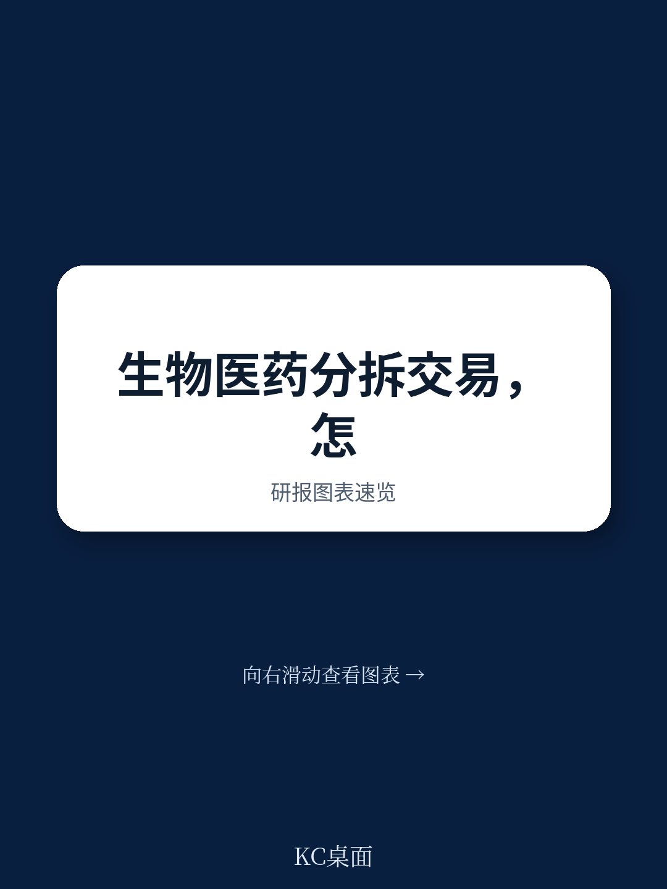
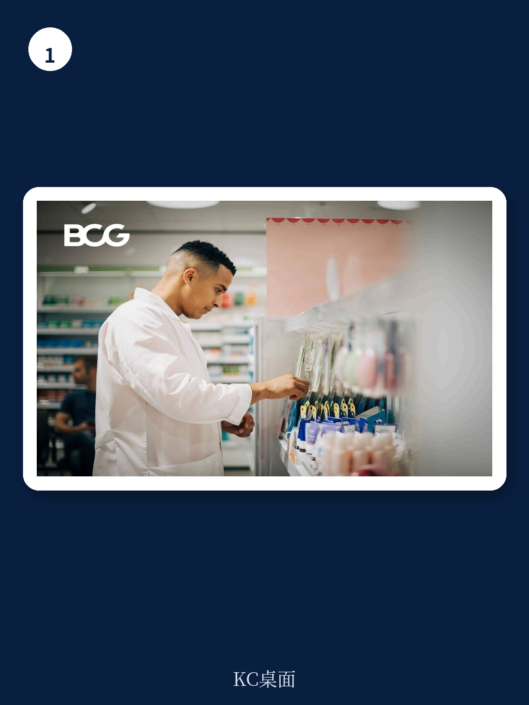

# 波士顿咨询：生物制药业务剥离的执行复杂性

生物制药公司的业务剥离交易，在纸面上看起来战略清晰，但实际执行中，价值创造与价值毁灭的差距可能超过100个百分点。波士顿咨询这份2022年的报告，基于对全球生物制药行业大规模剥离案例的观察，提出了一个核心判断：剥离交易的价值并非来自交易结构本身，而是来自执行阶段的精细管理。报告指出，从2020年7月到2021年6月，全球季度平均剥离交易价值达到3090亿美元，比五年均值高出25%。然而，只有约50%的交易在中期创造了价值，表现最差的交易与表现最好的交易之间，股东总回报差距超过100个百分点。这个差距，主要来自执行层面的差异。

## 1. 生物制药剥离面临五重独特复杂性

报告识别出生物制药行业剥离交易的五项核心挑战，这些挑战在其他行业并不常见。首先是全球布局与本地运营的矛盾。多数生物制药公司是跨国企业，但每个市场的药品进口、分销和销售都需要高度本地化的许可和运营。一次剥离可能需要在几十个市场同时启动本地业务分离工作流。

其次是监管环境的复杂性和动态变化。医疗健康行业面临的监管远比多数行业严格。一次剥离可能触发数千项监管影响，从生产场地名称变更到市场授权转移，每个产品在每个市场都需要数十甚至数百项变更。这些变更必须在保持持续供应的前提下完成，通常需要数年时间。

第三是高度整合的全球供应链。生物制药公司的生产流程往往将剥离业务与母公司的产品混合在同一生产场地、分销中心和第三方供应商中。分离这些生产流需要考虑税务、法律和监管的多重影响。

第四是经过验证的IT系统。生物制药的IT系统需要经过全球监管机构的验证和审计。分离系统并确保每个系统获得卫生主管部门批准，需要时间，且几乎必然需要过渡服务协议来维持业务连续性。

最后，也是最关键的，是产品的患者关键性。生物制药产品直接关系到患者生命。生产错误或库存短缺在其他行业可能只是客户不便，但在医疗健康领域，业务连续性是不可妥协的底线。

> **KC评论：** 这五项挑战并非独立存在，而是相互嵌套。例如，供应链分离的决策会直接影响监管变更的时间表和成本，而IT系统分离的节奏又受制于监管审批的进度。报告提醒管理团队，不能按职能条块分别处理，而需要建立跨职能的协调机制。

## 2. 执行阶段需要优先关注的五个核心领域

针对上述挑战，报告提出了五个对应的执行优先事项。第一，建立能够同时处理全球和本地问题的治理结构。一个敏捷的治理模型——全球集中工作流负责监督所有本地分离活动，并协调律师和顾问的工作——可以确保分离活动在全球范围内一致执行。

第二，尽早评估监管和供应影响。在项目早期阶段评估剥离的监管后果，可以显著缩短时间线，并减少因库存积压和减记产生的成本。这个工作流高度技术化、天然跨职能，且随着监管环境和供应要求在剥离过程中不断演变而动态变化。

第三，制定清晰的供应链分离策略。关于交易完成时可接受的供应链纠缠程度的早期决策，会对时间线、税务影响和整体成本产生实质性影响。精心设计两个实体之间的长期供应协议，可以缓解部分——但非全部——供应链纠缠带来的挑战。

第四，让业务部门尽早参与IT系统分离。在剥离项目启动时，建立一个稳健且战略性的IT系统清单及其分离选项至关重要。这需要IT专家和所有关键系统的业务负责人共同协作。一些剥离项目甚至需要为高度复杂的关键技术开发全新系统。

第五，优先确保患者关键产品的供应连续性。剥离项目必须考虑所有可能影响供应的因素。公司需要协调跨职能治理——包括监管、供应链和商业考量——确保项目计划能够在整个剥离时间线内维持持续供应。与业务分离相关的活动和工作流，需要与维持日常业务运营的活动和工作流隔离。

## 3. 执行质量是剥离交易价值分化的关键变量

报告的数据显示，从2003年到2021年中，Bloomberg分拆指数的回报率是标普500指数的两倍以上。但这一平均值掩盖了巨大的个体差异。表现最差的交易与表现最好的交易之间，股东总回报差距超过100个百分点。报告认为，这种分化并非源于交易的战略逻辑差异，而是源于执行质量。

在生物制药行业，这种执行差距尤为显著。因为该行业的复杂性——全球监管、整合供应链、患者关键性——使得执行失误的代价更高。一次执行不当的剥离，不仅可能导致交易成本超支，还可能因供应中断或监管违规而损害患者安全，进而引发更严重的商业和法律后果。

报告强调，剥离交易的价值创造潜力是真实的，但“仅仅决定进行交易是不够的”。管理团队需要提前理解挑战，思考关键决策的潜在影响，确保按时完成交易，并制定清晰的计划来捕获所有可能的价值。这是一个需要深思熟虑和主动规划的过程，而非可以事后补救的环节。

For informational purposes only. Portions may be generated,translated,summarized,or edited with AI assistance based on source materials and may contain omissions or errors. Please verify independently. This is not investment,legal,tax,accounting,or other professional advice.

